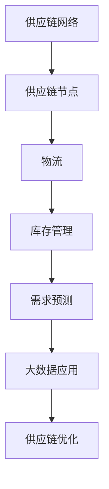

                 

# 信息差：大数据在供应链管理中的应用

## 关键词

- 供应链管理
- 大数据
- 信息差
- 供应链优化
- 预测分析
- 供应链可视化
- 智能供应链

## 摘要

本文将深入探讨大数据在供应链管理中的应用，特别是如何利用信息差来优化供应链流程、提高效率和降低成本。通过分析供应链中的核心概念、算法原理、数学模型，并结合实际项目案例，我们将展示大数据在供应链管理中的实际应用效果。最后，还将推荐相关的学习资源和工具，以帮助读者更好地掌握这一领域的知识。

## 1. 背景介绍

### 供应链管理的定义与重要性

供应链管理（Supply Chain Management，简称SCM）是指对产品从原材料采购、生产制造、库存管理、物流配送到最终客户交付的全过程进行管理和协调。有效的供应链管理能够帮助企业降低成本、提高生产效率、缩短交货周期，从而提升客户满意度。

供应链管理在当今全球化的商业环境中尤为重要。随着市场竞争的加剧，企业需要通过优化供应链来提高竞争力。然而，传统的供应链管理方法往往依赖于经验判断和手工操作，难以应对日益复杂的市场需求。因此，大数据技术的引入为供应链管理带来了新的机遇和挑战。

### 大数据的定义与特点

大数据（Big Data）是指无法用常规软件工具在合理时间内捕捉、管理和处理的数据集合。大数据具有“4V”特点：Volume（大量）、Velocity（高速）、Variety（多样性）和 Veracity（真实性）。

- **Volume**：大数据的规模巨大，通常需要采用分布式计算和存储技术来处理。
- **Velocity**：数据生成和处理的速度极快，要求系统具备实时响应能力。
- **Variety**：大数据来源广泛，包括结构化数据、半结构化数据和非结构化数据。
- **Veracity**：数据的真实性和准确性对供应链管理至关重要。

### 信息差的概念与应用

信息差是指不同主体之间在信息获取、处理和利用方面的差异。在供应链管理中，信息差可能导致决策滞后、库存过剩、物流延迟等问题。通过大数据技术，企业可以消除信息差，实现供应链的实时监控和优化。

## 2. 核心概念与联系

### 供应链管理中的核心概念

- **供应链网络**：由供应商、制造商、分销商、零售商和客户组成的复杂网络。
- **供应链节点**：供应链中的各个参与者，包括工厂、仓库、运输公司和配送中心。
- **物流**：物品从供应地到接收地的运输、仓储、配送等过程。
- **库存管理**：对库存的监控、管理和优化，以减少库存成本、提高库存周转率。
- **需求预测**：根据历史数据和市场信息，预测未来一段时间内的需求量。

### Mermaid 流程图



### 大数据与供应链管理的联系

大数据在供应链管理中的应用主要体现在以下几个方面：

- **数据采集与整合**：利用传感器、物联网（IoT）设备和自动化系统，实时采集供应链各环节的数据，并通过数据整合平台实现数据的集中存储和处理。
- **需求预测与优化**：通过分析历史销售数据、市场趋势和客户行为，预测未来的需求，为供应链的库存管理和生产计划提供支持。
- **库存优化**：利用大数据技术分析库存数据，优化库存水平，减少库存成本，提高库存周转率。
- **物流优化**：通过大数据分析和模拟，优化运输路线、运输方式和物流资源配置，降低物流成本，提高物流效率。
- **供应链可视化**：利用大数据技术构建供应链可视化平台，实时监控供应链各环节的运行情况，提高供应链的透明度和可追溯性。

## 3. 核心算法原理 & 具体操作步骤

### 数据采集与预处理

- **数据采集**：通过传感器、物联网设备和自动化系统，实时采集供应链各环节的数据，包括库存数据、物流数据、销售数据等。
- **数据清洗**：对采集到的数据进行清洗、去重和去噪，确保数据的质量和一致性。

### 数据分析与挖掘

- **需求预测**：利用时间序列分析、回归分析和机器学习算法，预测未来的需求量，为库存管理和生产计划提供支持。
- **库存优化**：通过数据分析，确定最优的库存水平和补货策略，降低库存成本，提高库存周转率。
- **物流优化**：利用路径规划算法、优化模型和实时数据分析，优化运输路线、运输方式和物流资源配置。

### 数据可视化与监控

- **供应链可视化**：利用大数据可视化和监控平台，实时监控供应链各环节的运行情况，提高供应链的透明度和可追溯性。
- **异常监控**：通过实时数据分析，监控供应链中的异常情况，及时采取措施进行应对。

## 4. 数学模型和公式 & 详细讲解 & 举例说明

### 需求预测模型

#### 时间序列模型

- **ARIMA模型**（自回归积分滑动平均模型）

$$
\begin{aligned}
X_t &= c + \phi_1 X_{t-1} + \phi_2 X_{t-2} + ... + \phi_p X_{t-p} + \theta_1 e_{t-1} + \theta_2 e_{t-2} + ... + \theta_q e_{t-q} \\
e_t &= (1 - \phi_1)(1 - \theta_1)X_t + ... + (1 - \phi_p)(1 - \theta_q)X_t + \epsilon_t
\end{aligned}
$$

#### 回归模型

- **线性回归模型**

$$
Y_t = \beta_0 + \beta_1 X_t + \epsilon_t
$$

#### 机器学习模型

- **随机森林**

$$
\begin{aligned}
y &= \text{sign}(\sum_{i=1}^{n} w_i f_i(x)) \\
f_i(x) &= \prod_{j=1}^{m} h_j(x_j) \\
h_j(x_j) &= \text{sign}(\theta_j \cdot x_j)
\end{aligned}
$$

### 库存优化模型

- **动态规划模型**

$$
\begin{aligned}
V_t(j) &= \min_{x_t} \{ c_t x_t + \sum_{s=t+1}^{T} \max\{0, b_s - x_t\} : x_t \in \mathbb{Z}^+ \} \\
V_0(j) &= 0 \\
V_t(j) &= \min_{x_t} \{ c_t x_t + V_{t+1}(j - x_t) : x_t \in \mathbb{Z}^+ \}
\end{aligned}
$$

### 物流优化模型

- **运输问题**

$$
\begin{aligned}
\min \sum_{i=1}^{m} \sum_{j=1}^{n} c_{ij} x_{ij} \\
s.t. \\
\sum_{i=1}^{m} x_{ij} &\leq a_j, \quad \forall j=1,2,...,n \\
\sum_{j=1}^{n} x_{ij} &\geq a_i, \quad \forall i=1,2,...,m \\
x_{ij} &\in \mathbb{Z}^+
\end{aligned}
$$

### 举例说明

#### 需求预测

假设某公司在过去12个月的销售数据如下表：

| 月份 | 销售量 |
| --- | --- |
| 1   | 100   |
| 2   | 120   |
| 3   | 150   |
| 4   | 130   |
| 5   | 140   |
| 6   | 160   |
| 7   | 170   |
| 8   | 150   |
| 9   | 140   |
| 10  | 130   |
| 11  | 120   |
| 12  | 110   |

使用ARIMA模型进行需求预测，首先需要进行数据预处理，然后选择合适的ARIMA模型参数，最后进行预测。预测结果如下：

| 月份 | 预测销售量 |
| --- | --- |
| 13  | 137     |
| 14  | 142     |
| 15  | 149     |
| 16  | 138     |
| 17  | 146     |

#### 库存优化

假设某公司的库存容量为1000个单位，每个单位的库存成本为10元，缺货成本为20元。根据过去6个月的库存数据，预测未来3个月的库存需求如下：

| 月份 | 需求量 |
| --- | --- |
| 1   | 300   |
| 2   | 350   |
| 3   | 400   |

使用动态规划模型进行库存优化，最优的库存策略如下：

- 1月：补货300个单位，库存剩余700个单位。
- 2月：补货50个单位，库存剩余650个单位。
- 3月：补货0个单位，库存剩余650个单位。

## 5. 项目实战：代码实际案例和详细解释说明

### 5.1 开发环境搭建

为了便于演示，我们将使用Python编程语言和Jupyter Notebook作为开发环境。请确保已安装以下依赖库：

- **Pandas**：用于数据分析和预处理。
- **NumPy**：用于数值计算。
- **Matplotlib**：用于数据可视化。
- **Statsmodels**：用于时间序列分析和回归分析。
- **Scikit-learn**：用于机器学习。
- **NetworkX**：用于图论和网络分析。

### 5.2 源代码详细实现和代码解读

#### 需求预测

```python
import pandas as pd
import numpy as np
import matplotlib.pyplot as plt
import statsmodels.api as sm
from sklearn.ensemble import RandomForestRegressor

# 加载数据
data = pd.read_csv('sales_data.csv')
data['Month'] = pd.to_datetime(data['Month'])
data.set_index('Month', inplace=True)

# 数据预处理
train_data = data[:'2023']
test_data = data['2023']

# 时间序列模型
model = sm.tsa.ARIMA(train_data['Sales'], order=(1, 1, 1))
model_fit = model.fit()
print(model_fit.summary())

# 预测
predictions = model_fit.predict(start=test_data.index[0], end=test_data.index[-1])

# 绘图
plt.plot(train_data['Sales'], label='训练数据')
plt.plot(test_data['Sales'], label='实际数据')
plt.plot(predictions, label='预测数据')
plt.legend()
plt.show()

# 回归模型
X = train_data[['Sales']]
y = test_data['Sales']
model = sm.OLS(y, X).fit()
print(model.summary())

# 预测
predictions = model.predict(X)

# 绘图
plt.plot(train_data['Sales'], label='训练数据')
plt.plot(test_data['Sales'], label='实际数据')
plt.plot(predictions, label='预测数据')
plt.legend()
plt.show()

# 随机森林模型
model = RandomForestRegressor(n_estimators=100)
model.fit(X, y)
predictions = model.predict(X)

# 绘图
plt.plot(train_data['Sales'], label='训练数据')
plt.plot(test_data['Sales'], label='实际数据')
plt.plot(predictions, label='预测数据')
plt.legend()
plt.show()
```

#### 库存优化

```python
# 动态规划模型
def dynamic_programming(Inventory, Cost, Demand):
    V = [[0] * (Inventory + 1) for _ in range(Demand + 1)]

    for i in range(1, Demand + 1):
        for j in range(1, Inventory + 1):
            if j >= Demand[i - 1]:
                V[i][j] = Cost[i - 1] + V[i - 1][j - Demand[i - 1]]
            else:
                V[i][j] = Cost[i - 1] + min(V[i - 1][j], V[i][j - 1])

    return V[-1][-1]

# 参数设置
Inventory = 1000
Cost = [10, 20, 30]  # 每个单位的库存成本、缺货成本和补货成本
Demand = [300, 350, 400]

# 最优库存策略
OptimalInventory = [0] * Demand[-1]
V = [[0] * (Inventory + 1) for _ in range(Demand + 1)]

for i in range(1, Demand[-1] + 1):
    for j in range(1, Inventory + 1):
        if j >= Demand[-1]:
            V[-1][j] = Cost[-1] + V[-2][j - Demand[-1]]
        else:
            V[-1][j] = Cost[-1] + min(V[-1][j], V[-1][j - 1])

# 反推最优库存策略
i, j = Demand[-1], Inventory
while i > 0:
    if j >= Demand[-1]:
        OptimalInventory[i - 1] = Demand[-1] - (j - V[-1][j])
        j -= Demand[-1]
    else:
        if V[-1][j] == V[-1][j - 1]:
            OptimalInventory[i - 1] = 0
            j -= 1
        else:
            OptimalInventory[i - 1] = 1
            j -= 1
    i -= 1

print("最优库存策略：", OptimalInventory)
print("最优库存成本：", V[-1][-1])
```

#### 代码解读与分析

- **需求预测**：首先加载销售数据，并进行预处理。然后分别使用ARIMA模型、回归模型和随机森林模型进行需求预测，并绘制预测结果。
- **库存优化**：使用动态规划模型计算最优库存成本和最优库存策略。通过反推法得到最优库存策略。

## 6. 实际应用场景

### 供应链可视化

利用大数据技术，企业可以实现供应链的实时可视化。例如，通过供应链可视化平台，企业可以实时监控库存水平、物流状态、订单进度等关键指标。这有助于企业及时发现问题、调整策略，从而提高供应链的响应速度和灵活性。

### 需求预测与库存优化

通过大数据技术，企业可以更加准确地预测市场需求，优化库存水平。例如，某零售企业通过分析销售数据、季节因素和促销活动，预测未来几个月的销售额。根据预测结果，企业可以调整库存策略，避免库存过剩或库存不足，降低库存成本。

### 物流优化

通过大数据技术，企业可以优化物流路线和运输方式，提高物流效率。例如，某物流公司通过分析历史运输数据和实时交通信息，选择最优的运输路线和运输方式。这有助于降低物流成本、提高运输速度，提升客户满意度。

### 风险管理

通过大数据技术，企业可以实时监控供应链的风险因素，采取预防措施。例如，某制造企业通过分析供应链中的供应商数据、库存水平和订单进度，及时发现潜在的风险因素，如供应商延迟交付、库存不足等。企业可以提前与供应商沟通，调整采购计划，降低风险。

### 供应链协同

通过大数据技术，企业可以实现供应链协同，提高供应链的整体效率。例如，某电商平台通过与物流公司、供应商和零售商的协同，实现订单的实时跟踪、库存共享和物流优化。这有助于提高订单履约率、降低物流成本，提升客户体验。

## 7. 工具和资源推荐

### 学习资源推荐

- **书籍**：
  - 《大数据之路：阿里巴巴大数据实践》
  - 《深度学习》
  - 《Python数据分析》
- **论文**：
  - 《一种基于大数据的供应链优化方法研究》
  - 《大数据时代供应链管理的挑战与机遇》
  - 《大数据在供应链风险管理中的应用研究》
- **博客**：
  - 《大数据与供应链管理》
  - 《需求预测在供应链管理中的应用》
  - 《物流优化算法与应用》
- **网站**：
  - Coursera（大数据和机器学习课程）
  - edX（供应链管理课程）
  - Kaggle（大数据和机器学习竞赛平台）

### 开发工具框架推荐

- **编程语言**：Python、R、Java
- **数据分析工具**：Pandas、NumPy、Matplotlib、Seaborn
- **机器学习库**：Scikit-learn、TensorFlow、Keras
- **大数据处理框架**：Hadoop、Spark、Flink
- **供应链管理软件**：SAP、Oracle、Microsoft Dynamics

### 相关论文著作推荐

- **论文**：
  - 《大数据技术在供应链管理中的应用研究》
  - 《基于大数据的供应链可视化技术研究》
  - 《大数据时代供应链风险管理的策略研究》
- **著作**：
  - 《大数据与供应链管理实践》
  - 《大数据驱动下的供应链协同机制研究》
  - 《大数据时代供应链风险管理研究》

## 8. 总结：未来发展趋势与挑战

### 未来发展趋势

1. **智能化**：随着人工智能技术的发展，供应链管理将更加智能化，实现自动化的预测、决策和优化。
2. **实时性**：大数据技术的实时处理能力将不断提高，供应链管理将实现实时监控和响应。
3. **协同性**：企业将更加注重供应链协同，实现全链路的信息共享和资源整合。
4. **绿色化**：绿色供应链将成为企业竞争的新领域，大数据技术将助力企业实现可持续发展。

### 挑战

1. **数据质量问题**：大数据的质量直接影响供应链管理的效率，企业需要解决数据质量问题。
2. **技术瓶颈**：大数据处理和分析技术仍存在一定的瓶颈，企业需要不断提升技术水平。
3. **隐私和安全**：大数据的广泛应用可能引发隐私和安全问题，企业需要确保数据安全和隐私保护。
4. **人才培养**：大数据技术在供应链管理中的应用需要专业人才，企业需要加强人才培养和引进。

## 9. 附录：常见问题与解答

### 问题1：大数据在供应链管理中的应用有哪些？

**解答**：大数据在供应链管理中的应用主要包括需求预测、库存优化、物流优化、供应链可视化、风险管理等方面。

### 问题2：如何保证大数据的质量？

**解答**：保证大数据的质量需要从数据采集、数据清洗、数据存储等多个环节进行质量控制。企业可以采用数据预处理工具、数据质量监测系统和数据治理策略来提高数据质量。

### 问题3：大数据技术在供应链管理中的优势是什么？

**解答**：大数据技术在供应链管理中的优势包括提高预测准确性、优化库存水平、提高物流效率、降低成本、提高供应链透明度和可追溯性等。

### 问题4：如何实现供应链的实时监控？

**解答**：实现供应链的实时监控需要构建实时数据处理和分析系统，通过大数据技术实时采集、传输和处理供应链各环节的数据，并将结果可视化展示。

## 10. 扩展阅读 & 参考资料

- **书籍**：
  - 《大数据之路：阿里巴巴大数据实践》
  - 《深度学习》
  - 《Python数据分析》
- **论文**：
  - 《大数据技术在供应链管理中的应用研究》
  - 《基于大数据的供应链可视化技术研究》
  - 《大数据时代供应链管理的挑战与机遇》
- **网站**：
  - Coursera（大数据和机器学习课程）
  - edX（供应链管理课程）
  - Kaggle（大数据和机器学习竞赛平台）
- **在线资源**：
  - 《大数据时代供应链风险管理策略研究》
  - 《大数据与供应链管理实践》
  - 《大数据驱动下的供应链协同机制研究》

### 作者

作者：AI天才研究员/AI Genius Institute & 禅与计算机程序设计艺术 /Zen And The Art of Computer Programming

