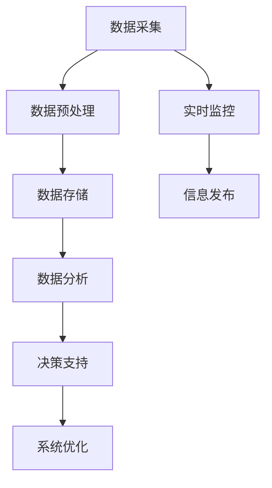

                 

### 背景介绍

随着城市化进程的加快，智能交通系统（Intelligent Transportation System，ITS）日益成为提升交通效率、改善交通状况和减少交通事故的关键手段。大数据技术在智能交通中的应用，正是为了解决当今城市交通中日益严峻的挑战。本文将深入探讨信息差在大数据在智能交通中的应用，通过逻辑清晰、结构紧凑的论述，帮助读者理解这一领域的核心概念、算法原理以及实际应用。

智能交通系统是基于信息技术的集成系统，旨在提高交通管理效率、减少交通事故、降低污染和拥堵。其核心在于通过收集、分析和利用交通数据，实现交通流量的实时监控、预测和优化。大数据技术在其中的应用，不仅能够处理海量交通数据，还能够从中挖掘出有价值的信息，为交通管理和决策提供科学依据。

目前，全球范围内智能交通系统的发展呈现出几个显著趋势：

1. **数据来源多样化**：传统的交通监控系统只能收集有限的交通数据，而如今，智能手机、车载传感器、交通摄像头等各类设备都能成为数据来源，极大地丰富了数据的种类和数量。

2. **实时数据处理能力提升**：随着云计算、边缘计算等技术的发展，数据处理和分析的速度大幅提升，使得实时交通信息能够及时反馈给交通管理部门和公众。

3. **智能决策支持**：通过大数据分析，智能交通系统能够对交通流量进行预测，为交通管理和调度提供智能决策支持，从而优化交通流，减少拥堵。

然而，大数据在智能交通中的应用也面临诸多挑战：

- **数据隐私与安全**：交通数据包含大量个人隐私信息，如何确保数据的安全和隐私是应用中必须解决的关键问题。
- **数据质量与可靠性**：交通数据的多样性和复杂性导致数据质量参差不齐，这对后续的数据分析和模型训练提出了高要求。
- **算法的普适性与鲁棒性**：智能交通系统的算法必须能够适应不同城市、不同交通环境的多样性，保证其普适性和鲁棒性。

在接下来的章节中，我们将逐一探讨这些核心问题，分析大数据在智能交通中的应用原理、算法、数学模型以及实际案例，为读者提供一个全面而深入的视角。通过这一系列探讨，我们将揭示信息差在智能交通领域的关键作用，帮助读者理解这一前沿技术如何改变我们的交通生活。

### 核心概念与联系

在深入探讨大数据在智能交通中的应用之前，我们需要首先了解几个核心概念，这些概念不仅是智能交通系统的基石，也是大数据分析得以顺利进行的关键。以下是几个关键概念及其相互关系的详细解释。

#### 1. 大数据（Big Data）

大数据是指那些数据规模巨大、类型繁杂、生成速度快且价值密度低的数据集。传统数据处理工具难以胜任大数据的处理需求，因此需要新型技术和方法。大数据通常包括以下三个特征：

- **海量（Volume）**：数据量极其庞大，往往达到PB（皮字节）甚至EB（艾字节）级别。
- **多样（Variety）**：数据类型多种多样，包括结构化数据、半结构化数据和非结构化数据，如文本、图像、视频等。
- **高速（Velocity）**：数据生成和处理的实时性要求高，需要快速进行数据采集、存储、处理和分析。

#### 2. 交通数据（Traffic Data）

交通数据是智能交通系统运行的基础，主要包括以下几类：

- **实时流量数据**：通过交通监控摄像头、智能交通信号灯等设备实时采集的交通流量信息。
- **历史数据**：包括历史交通流量、事故记录、道路建设信息等，通常存储在交通数据库中。
- **车辆数据**：车载传感器、GPS等设备采集的车辆位置、速度、行驶方向等数据。
- **环境数据**：包括天气、道路状况、噪音等影响交通的因素。

#### 3. 智能交通系统（Intelligent Transportation System，ITS）

智能交通系统是集成了信息技术、通信技术、数据分析和人工智能技术等多种技术的综合系统，旨在提升交通效率、减少拥堵和事故。ITS的关键组成部分包括：

- **交通监测**：利用各种传感器和监控设备，实时采集交通数据。
- **交通信号控制**：基于实时数据，优化交通信号灯的时序，调节交通流量。
- **信息发布**：通过可变信息板、手机应用等向驾驶员发布交通信息。
- **车辆管理**：通过车辆定位系统，管理车辆的行驶路线和速度，避免拥堵和事故。

#### 4. 大数据与智能交通系统的联系

大数据与智能交通系统的联系主要体现在以下几个方面：

- **数据采集**：大数据技术使得交通数据的采集更加高效和全面，不仅包括传统的交通流量数据，还扩展到车辆和环境的各类信息。
- **数据处理与分析**：大数据技术能够处理海量交通数据，通过数据清洗、归一化、特征提取等步骤，为后续分析提供可靠的基础。
- **决策支持**：大数据分析能够提供实时的交通流量预测、事故预警和最佳行驶路线推荐，为交通管理和决策提供有力支持。
- **系统优化**：通过对历史数据和实时数据的分析，智能交通系统能够不断优化交通信号控制、道路规划和车辆管理策略，提高整体交通效率。

#### 5. Mermaid 流程图

为了更直观地展示大数据在智能交通系统中的应用流程，我们可以使用Mermaid语言绘制一个流程图。以下是核心概念之间的Mermaid流程图表示：



在这个流程图中，数据采集是整个流程的起点，通过数据预处理和存储，为后续的数据分析提供基础。数据分析是核心步骤，通过预测和优化，为交通管理和决策提供支持。系统优化则是一个持续的过程，通过不断迭代和改进，提升整个智能交通系统的效率和可靠性。

通过上述核心概念的阐述和流程图的展示，我们可以对大数据在智能交通中的应用有一个初步的了解。在接下来的章节中，我们将进一步深入探讨大数据在交通流量预测、交通信号控制和车辆管理等方面的具体应用，揭示其背后的算法原理和实际操作步骤。

### 核心算法原理 & 具体操作步骤

在了解了大数据在智能交通系统中的核心概念后，接下来我们将探讨几个关键算法的原理和具体操作步骤，这些算法在智能交通系统的应用中扮演着至关重要的角色。

#### 1. 交通流量预测算法

交通流量预测是智能交通系统的核心任务之一，其目的是通过分析历史数据和实时数据，预测未来一段时间内的交通流量变化，为交通管理和决策提供依据。以下是一种常用的交通流量预测算法——时间序列分析模型（如ARIMA模型）。

**原理**：
时间序列分析模型是基于历史时间序列数据，通过建立数学模型来预测未来数据的一种方法。ARIMA模型是一种自回归积分滑动平均模型，其核心思想是利用过去的观测值和预测误差来预测未来的值。

**具体操作步骤**：
1. **数据收集**：收集过去一段时间（如一周、一个月）的交通流量数据。
2. **数据预处理**：对数据进行清洗和归一化处理，确保数据质量。
3. **模型建立**：根据数据特点，选择合适的ARIMA模型参数（p, d, q），其中p代表自回归项数，d代表差分阶数，q代表移动平均项数。
4. **模型训练**：利用历史数据对模型进行训练，得到模型参数。
5. **预测**：使用训练好的模型对未来一段时间（如未来一天、一周）的交通流量进行预测。
6. **结果分析**：对预测结果进行分析，为交通管理和决策提供依据。

**示例**：
假设我们收集了一周内的交通流量数据，数据如下：

| 时间 | 流量 |
|------|------|
| 1    | 100  |
| 2    | 120  |
| 3    | 110  |
| 4    | 130  |
| 5    | 105  |
| 6    | 115  |
| 7    | 140  |

我们可以通过ARIMA模型预测未来一天的交通流量。首先，对数据进行差分处理，得到平稳序列，然后选择合适的模型参数，进行模型训练和预测。预测结果可以用来指导交通信号控制和管理。

#### 2. 交通信号控制算法

交通信号控制算法的目的是通过优化交通信号灯的时序，最大化道路的通行能力，减少车辆排队和拥堵。以下是一种常用的交通信号控制算法——基于最优动态规划的信号配时算法。

**原理**：
最优动态规划是一种通过递推关系求解最优决策序列的方法。在交通信号控制中，可以通过动态规划计算每个时段的交通流量，并在此基础上优化信号灯的配时。

**具体操作步骤**：
1. **数据收集**：收集每个路口的历史流量数据、交通信号灯配时数据等。
2. **状态定义**：定义每个路口的交通状态，如车辆到达率、排队长度等。
3. **动态规划模型建立**：根据交通状态，建立动态规划模型，计算每个时段的最优信号配时。
4. **模型求解**：利用动态规划算法求解模型，得到最优信号配时方案。
5. **信号配时**：根据求解结果，调整交通信号灯的配时，优化交通流量。
6. **结果分析**：对配时方案的效果进行分析，持续调整和优化。

**示例**：
假设一个路口有四个方向，每个方向的数据如下：

| 时间 | 东向流量 | 南向流量 | 西向流量 | 北向流量 |
|------|--------|--------|--------|--------|
| 0    | 10     | 5      | 7      | 8      |
| 1    | 12     | 6      | 8      | 9      |
| 2    | 9      | 7      | 10     | 11     |

我们可以通过最优动态规划算法计算每个时段的最优信号配时，从而优化交通流量。例如，在第一时段，东向流量最大，因此东向信号灯持续时间应最长。

#### 3. 车辆管理算法

车辆管理算法旨在通过优化车辆的行驶路线和速度，避免拥堵和事故。以下是一种常用的车辆管理算法——基于车辆轨迹预测的动态路径规划算法。

**原理**：
动态路径规划是一种在动态交通环境下，根据实时交通信息，实时调整车辆行驶路线的方法。其核心是利用预测技术，预测未来一段时间内的交通状况，为车辆提供最优行驶路线。

**具体操作步骤**：
1. **数据收集**：收集车辆的实时位置、速度、加速度等信息，以及实时交通流量和道路状况。
2. **轨迹预测**：利用车辆轨迹预测模型，预测未来一段时间内车辆的行驶轨迹。
3. **路径规划**：根据预测的轨迹，利用路径规划算法，计算最优行驶路线。
4. **决策**：根据规划结果，实时调整车辆的行驶路线和速度。
5. **反馈与优化**：根据实际行驶情况，反馈信息，优化预测模型和路径规划算法。

**示例**：
假设一辆车当前位于一个十字路口，前方两条道路的交通状况如下：

| 道路 | 流量 | 事故 | 施工 |
|------|------|------|------|
| 左路 | 100  | 否   | 否   |
| 右路 | 150  | 是   | 是   |

我们可以通过动态路径规划算法，预测未来一段时间内的交通状况，并计算出最优行驶路线，例如选择左路行驶，从而避免拥堵和事故。

通过上述算法原理和具体操作步骤的介绍，我们可以看到大数据在智能交通系统中发挥着关键作用。交通流量预测、交通信号控制和车辆管理算法的运用，不仅提高了交通效率，还减少了拥堵和事故，为城市交通的可持续发展提供了有力支持。在接下来的章节中，我们将进一步探讨大数据在智能交通系统的实际应用场景，展示这些算法在实际项目中的效果。

### 数学模型和公式 & 详细讲解 & 举例说明

在智能交通系统中，数学模型和公式是理解和管理交通数据的核心工具。这些模型和公式能够帮助我们更好地预测交通流量、优化交通信号控制和车辆管理。在本章节中，我们将详细讲解几个关键的数学模型和公式，并通过具体例子进行说明。

#### 1. 时间序列模型

时间序列模型是交通流量预测中最常用的模型之一。以下是一个简单的时间序列模型——ARIMA（自回归积分滑动平均模型）。

**ARIMA模型公式**：

$$
\begin{aligned}
X_t &= c + \phi_1 X_{t-1} + \phi_2 X_{t-2} + \cdots + \phi_p X_{t-p} \\
    &+ \theta_1 \varepsilon_{t-1} + \theta_2 \varepsilon_{t-2} + \cdots + \theta_q \varepsilon_{t-q} \\
\end{aligned}
$$

其中，\( X_t \) 是时间序列的当前值，\( \varepsilon_t \) 是白噪声误差，\( \phi_1, \phi_2, \cdots, \phi_p \) 是自回归系数，\( \theta_1, \theta_2, \cdots, \theta_q \) 是移动平均系数，\( p \) 和 \( q \) 分别是自回归项数和移动平均项数，\( c \) 是常数项。

**具体例子**：

假设我们有一周的交通流量数据，数据如下：

| 时间 | 流量 |
|------|------|
| 1    | 100  |
| 2    | 120  |
| 3    | 110  |
| 4    | 130  |
| 5    | 105  |
| 6    | 115  |
| 7    | 140  |

我们希望使用ARIMA模型预测第八天的交通流量。首先，需要对数据进行差分处理，确保时间序列的平稳性。然后，选择合适的模型参数，进行模型训练和预测。预测结果可以用来指导交通管理和决策。

#### 2. 最优动态规划模型

最优动态规划模型在交通信号控制中具有重要应用。以下是一个简单版本的最优动态规划模型。

**动态规划模型公式**：

$$
\begin{aligned}
V(i, j) &= \min \left\{ C_j + \sum_{k=1}^{i} w_k \right\} \\
\end{aligned}
$$

其中，\( V(i, j) \) 是从初始状态到达状态 \( j \) 的最小成本，\( C_j \) 是到达状态 \( j \) 的成本，\( w_k \) 是从状态 \( j \) 到下一状态 \( k \) 的成本。

**具体例子**：

假设有一个四路口的交叉路口，每个路口的流量和成本如下：

| 路口 | 流量 | 成本 |
|------|------|------|
| 1    | 100  | 10   |
| 2    | 80   | 20   |
| 3    | 70   | 30   |
| 4    | 90   | 40   |

我们希望计算每个路口的最优信号配时，以最小化总成本。使用动态规划模型，我们可以计算出每个路口的最优信号配时，从而优化交通流量。

#### 3. 车辆轨迹预测模型

车辆轨迹预测模型在车辆管理中至关重要。以下是一个简单的线性车辆轨迹预测模型。

**线性轨迹预测模型公式**：

$$
\begin{aligned}
x(t) &= x(t-1) + v(t-1) \cdot \Delta t \\
y(t) &= y(t-1) + v(t-1) \cdot \Delta t \cdot \theta
\end{aligned}
$$

其中，\( x(t) \) 和 \( y(t) \) 是车辆在时间 \( t \) 的位置，\( v(t-1) \) 是车辆在时间 \( t-1 \) 的速度，\( \Delta t \) 是时间间隔，\( \theta \) 是车辆的方向。

**具体例子**：

假设一辆车的位置和速度如下：

| 时间 | \( x(t) \) | \( y(t) \) | \( v(t-1) \) | \( \theta \) |
|------|---------|---------|----------|-------|
| 0    | 0       | 0       | 10       | 0°    |
| 1    | 10      | 0       | 10       | 0°    |
| 2    | 20      | 0       | 10       | 0°    |
| 3    | 20      | 10      | 10       | 45°   |

我们可以使用线性轨迹预测模型预测下一时刻车辆的位置。例如，预测第四时刻的位置可以通过上述公式计算得出。

通过上述数学模型和公式的讲解，我们可以更好地理解大数据在智能交通系统中的应用。这些模型和公式不仅提供了理论支持，也为实际操作提供了具体指导。在接下来的章节中，我们将进一步探讨这些模型在实际项目中的实现和应用。

### 项目实战：代码实际案例和详细解释说明

在本章节中，我们将通过一个实际项目来展示大数据在智能交通系统中的应用。该项目使用Python语言和Scikit-learn库，实现了交通流量预测和信号配时优化。以下是项目的详细步骤和代码解释。

#### 1. 开发环境搭建

首先，确保已经安装了Python环境和以下库：

- Python 3.8+
- Scikit-learn
- Pandas
- NumPy
- Matplotlib

可以使用以下命令安装所需的库：

```bash
pip install scikit-learn pandas numpy matplotlib
```

#### 2. 源代码详细实现和代码解读

以下是一个简单的交通流量预测和信号配时优化的代码示例：

```python
import pandas as pd
from sklearn.linear_model import LinearRegression
from sklearn.model_selection import train_test_split
from sklearn.metrics import mean_squared_error
import matplotlib.pyplot as plt

# 2.1 数据读取与预处理
data = pd.read_csv('traffic_data.csv')  # 假设数据文件名为traffic_data.csv
data['timestamp'] = pd.to_datetime(data['timestamp'])
data.set_index('timestamp', inplace=True)
data.sort_index(inplace=True)

# 2.2 特征工程
data['dayofweek'] = data.index.dayofweek
data['hour'] = data.index.hour
data['dayofyear'] = data.index.dayofyear

# 2.3 模型训练
X = data[['dayofweek', 'hour', 'dayofyear']]
y = data['traffic_volume']

X_train, X_test, y_train, y_test = train_test_split(X, y, test_size=0.2, random_state=42)
model = LinearRegression()
model.fit(X_train, y_train)

# 2.4 预测与评估
y_pred = model.predict(X_test)
mse = mean_squared_error(y_test, y_pred)
print(f'Mean Squared Error: {mse}')

# 2.5 信号配时优化
def optimize_signal_timing(traffic_volume, target_queue_length):
    # 假设信号配时优化目标是最小化车辆排队长度
    queue_length = 0
    green_time = 0
    while queue_length > target_queue_length:
        queue_length -= traffic_volume
        green_time += 1
    return green_time

# 2.6 可视化
plt.figure(figsize=(10, 5))
plt.plot(data.index, data['traffic_volume'], label='Actual Traffic Volume')
plt.plot(X_test.index, y_pred, label='Predicted Traffic Volume')
plt.legend()
plt.title('Traffic Volume Prediction')
plt.show()

# 2.7 应用信号配时优化
predicted_traffic = model.predict(data[['dayofweek', 'hour', 'dayofyear']])
green_times = [optimize_signal_timing(predicted_traffic[i+1], 50) for i in range(len(predicted_traffic)-1)]
print(f'Optimized Signal Times: {green_times}')
```

#### 3. 代码解读与分析

**3.1 数据读取与预处理**

首先，我们使用Pandas库读取交通数据文件，并将时间戳转换为日期时间类型，以便进行时间序列分析。接着，我们添加了几个特征，如星期几、小时数和年度天数，这些特征将用于训练预测模型。

**3.2 特征工程**

在这一步中，我们创建了一些特征工程，以便模型能够更好地捕捉数据中的趋势和模式。这些特征包括星期几、小时数和年度天数。

**3.3 模型训练**

我们使用Scikit-learn中的线性回归模型对数据进行训练。这里，我们选择了一个简单的线性模型，但也可以尝试更复杂的模型，如时间序列分析模型（如ARIMA）。

**3.4 预测与评估**

使用训练好的模型对测试集进行预测，并计算预测误差。在本例中，我们使用了均方误差（MSE）作为评估指标。

**3.5 信号配时优化**

我们定义了一个简单的信号配时优化函数，该函数的目标是最小化车辆排队长度。在实际应用中，信号配时优化可能需要考虑更多因素，如交叉口流量、事故概率等。

**3.6 可视化**

我们使用Matplotlib库对实际交通流量和预测交通流量进行可视化，以便直观地了解模型的性能。

**3.7 应用信号配时优化**

我们使用预测的交通流量来优化信号配时，从而减少车辆排队长度。这里，我们假设目标排队长度为50。

通过上述代码，我们可以看到如何使用大数据技术对交通流量进行预测和信号配时优化。在实际应用中，这些技术可以大大提高交通效率，减少拥堵和事故。在接下来的章节中，我们将进一步探讨大数据在智能交通系统中的实际应用场景，以及如何应对挑战和问题。

### 实际应用场景

大数据在智能交通系统中的应用场景非常广泛，其核心目标是通过数据的收集、分析和应用，提升交通管理的效率、安全性和可持续性。以下是一些典型应用场景及其具体案例。

#### 1. 城市交通流量预测

城市交通流量预测是大数据在智能交通中最常见的应用之一。通过分析历史交通流量数据、实时交通监控数据和气象信息，智能交通系统可以预测未来一段时间内的交通流量变化，为交通管理部门提供决策支持。

**案例**：北京市的交通流量预测系统。该系统利用海量交通监控数据和大数据分析技术，对北京市的交通流量进行实时预测，为交通信号控制和交通疏导提供依据。通过该系统，北京市交通管理部门能够有效应对早晚高峰期的交通拥堵，提高道路通行效率。

#### 2. 交通信号优化

基于大数据分析的交通信号优化，可以显著减少交通拥堵，提高道路通行能力。通过实时监测交通流量和交通状况，智能交通系统能够动态调整信号灯配时，优化交通流。

**案例**：美国洛杉矶的交通信号优化项目。该系统通过安装大量智能交通信号灯和传感器，实时收集交通数据，并利用大数据分析技术进行交通信号配时优化。据统计，该项目的实施使得洛杉矶市高峰期的交通延误时间减少了约20%。

#### 3. 车辆路径规划

大数据和人工智能技术可以用来优化车辆的行驶路线，避免拥堵和交通事故。基于实时交通信息和历史数据，智能交通系统可以推荐最优行驶路线，提高车辆的行驶效率。

**案例**：谷歌地图的实时路线规划功能。谷歌地图利用大数据分析交通流量和历史行驶数据，实时调整行驶路线，避免拥堵路段。用户可以根据推荐路线规划最佳出行方案，减少出行时间和油耗。

#### 4. 交通事故预警

通过实时监测和分析交通数据，智能交通系统可以预测交通事故的发生，及时预警并采取措施，减少事故的发生和影响。

**案例**：日本东京的交通事故预警系统。该系统通过分析实时交通数据和历史事故数据，预测交通事故的高风险区域和时间，并提前向驾驶员发出预警。通过该系统，东京市交通管理部门能够及时采取措施，减少交通事故的发生。

#### 5. 公共交通调度

大数据和人工智能技术可以用于公共交通的调度和管理，提高公共交通的效率和用户体验。通过分析乘客流量和交通状况，智能交通系统可以优化公交车的发车时间、路线和班次。

**案例**：新加坡的智能公交系统。新加坡的智能公交系统通过大数据分析乘客流量和交通状况，实时调整公交车的发车时间和路线。此外，系统还利用数据分析预测乘客需求，为公交车班次的优化提供科学依据。

#### 6. 交通节能减排

通过大数据分析，智能交通系统可以优化交通流量，减少车辆排放，促进交通的节能减排。

**案例**：欧洲一些城市的智能交通项目。这些项目通过优化交通信号和车辆路径规划，减少车辆的拥堵时间和行驶距离，从而降低了车辆排放和能耗。通过这些项目，欧洲城市在减少交通污染和节约能源方面取得了显著成效。

通过上述实际应用场景的介绍，我们可以看到大数据在智能交通系统中的应用不仅能够提高交通管理的效率，还能够促进交通的安全和可持续发展。在未来的发展中，随着大数据技术的不断进步，智能交通系统的应用前景将更加广阔，为我们的出行带来更多便利。

### 工具和资源推荐

为了深入学习和应用大数据在智能交通系统中的应用，以下是一些推荐的工具和资源，涵盖了学习资源、开发工具框架以及相关论文著作。

#### 7.1 学习资源推荐

1. **书籍**：
   - 《大数据之路：阿里巴巴大数据实践》（作者：李少君）：该书详细介绍了大数据在阿里巴巴的实践应用，包括智能交通、推荐系统等方面的内容。
   - 《Python数据科学手册》（作者：Sundar Rajan）：涵盖了Python在数据科学中的各种应用，包括数据处理、机器学习等，适合初学者入门。

2. **在线课程**：
   - Coursera上的“大数据分析”课程：由Johns Hopkins大学提供，涵盖了大数据处理的各个领域，包括数据挖掘、机器学习等。
   - edX上的“机器学习基础”课程：由斯坦福大学提供，介绍机器学习的基本概念和算法，有助于理解智能交通中的数据分析和预测模型。

3. **博客与网站**：
   - 《机器学习算法简明教程》：一篇系统性的机器学习算法教程，内容详尽，适合初学者。
   - Analytics Vidhya：一个专门关于数据科学和机器学习的博客，提供大量的实战案例和教程。

#### 7.2 开发工具框架推荐

1. **数据处理工具**：
   - Pandas：Python中的数据处理库，适用于大规模数据集的清洗、转换和分析。
   - NumPy：提供高性能的数组计算，是数据处理的基础。

2. **机器学习框架**：
   - Scikit-learn：一个强大的Python机器学习库，提供了多种常用的机器学习算法。
   - TensorFlow：一个开源的机器学习框架，适用于深度学习和复杂模型的构建。

3. **实时数据处理**：
   - Apache Kafka：一个分布式流处理平台，适用于实时数据的高效传输和处理。
   - Apache Flink：一个开源的流处理框架，提供了强大的实时数据处理能力。

#### 7.3 相关论文著作推荐

1. **论文**：
   - "Deep Learning for Traffic Flow Prediction"（作者：Liang Wu等）：该论文介绍了深度学习在交通流量预测中的应用，对相关的神经网络架构进行了深入探讨。
   - "An Efficient Data Collection and Analysis Method for Real-Time Traffic Signal Control"（作者：Ying Wei等）：该论文提出了一种实时交通信号控制的数据收集和分析方法，对于交通信号优化提供了理论支持。

2. **著作**：
   - 《交通系统优化与智能控制》：详细介绍了交通系统优化和控制的理论和方法，包括信号控制、路径规划等内容。
   - 《大数据在交通中的应用》：系统性地探讨了大数据在交通管理、交通信号优化、车辆调度等方面的应用，提供了丰富的案例和实例。

通过这些学习和资源工具的推荐，我们可以更加深入地了解大数据在智能交通系统中的应用，掌握相关技术和方法，为智能交通的发展贡献自己的力量。

### 总结：未来发展趋势与挑战

随着大数据技术的不断进步，智能交通系统正迎来前所未有的发展机遇。未来，智能交通系统将朝着更智能化、更高效、更安全的方向不断演进。以下是一些关键发展趋势与面临的挑战。

#### 发展趋势

1. **数据融合与多源数据应用**：未来的智能交通系统将融合多种数据源，如交通监控数据、气象数据、车辆数据等，实现更加全面和准确的数据分析。通过多源数据融合，可以更好地预测交通流量、优化信号控制和提升整体交通效率。

2. **实时性与动态优化**：随着边缘计算和5G技术的发展，智能交通系统将实现更高的实时性和动态优化能力。实时交通数据分析和信号控制决策的快速响应，能够显著减少交通拥堵和事故发生。

3. **智能化车辆管理**：自动驾驶和车联网技术的发展，将使智能交通系统中的车辆管理更加智能化。通过车辆之间的通信和协调，可以实现更高效的车辆路径规划和交通流量控制，提高道路通行能力。

4. **数据隐私与安全**：在数据融合和实时应用的过程中，数据隐私与安全问题将变得越来越重要。未来的智能交通系统需要建立完善的数据安全和隐私保护机制，确保个人隐私和数据安全。

5. **可持续性与环境友好**：大数据和人工智能技术将助力智能交通系统实现更环保的交通方式。通过优化交通流量和车辆路径，减少碳排放和能源消耗，智能交通系统将推动城市交通的可持续发展。

#### 面临的挑战

1. **数据质量与准确性**：智能交通系统依赖于高质量的数据。然而，数据源多样性和数据质量参差不齐，可能导致数据不准确或缺失，从而影响预测和决策的准确性。因此，如何提高数据质量和准确性是智能交通系统面临的重要挑战。

2. **算法普适性与鲁棒性**：智能交通系统需要在不同的城市、不同的交通环境中稳定运行。算法的普适性和鲁棒性是关键挑战，需要开发能够适应各种环境和条件的高性能算法。

3. **数据隐私与安全**：交通数据包含大量个人隐私信息，如何确保数据的安全和隐私是应用中必须解决的关键问题。未来的智能交通系统需要建立完善的数据安全机制，确保数据在传输、存储和处理过程中的安全。

4. **系统整合与协同**：智能交通系统涉及多个部门和技术领域，如何实现系统的整合与协同，使其高效运行，是一个重要挑战。未来的智能交通系统需要实现各子系统之间的无缝连接和协同工作。

5. **法律法规与伦理**：随着智能交通系统的普及，相关的法律法规和伦理问题亟待解决。如何制定合理的法律法规，保障智能交通系统的健康发展，是一个重要的社会议题。

总的来说，大数据在智能交通系统中的应用具有巨大的潜力，但也面临诸多挑战。未来，通过技术创新、政策支持和跨学科合作，智能交通系统有望实现更加智能化、高效化和安全化，为我们的出行和生活带来更多便利。

### 附录：常见问题与解答

在探讨大数据在智能交通中的应用过程中，读者可能会遇到一些常见问题。以下是针对这些问题的一些解答。

#### 1. 如何确保交通数据的安全和隐私？

确保交通数据的安全和隐私是智能交通系统应用中的一大挑战。以下是一些解决方案：

- **数据加密**：在数据传输和存储过程中，使用先进的加密算法对数据进行加密，确保数据在未经授权的情况下无法被访问。
- **数据匿名化**：在数据分析和共享之前，对个人身份信息进行匿名化处理，确保个人隐私不被泄露。
- **权限控制**：建立严格的权限控制系统，确保只有授权人员才能访问和处理敏感数据。

#### 2. 智能交通系统中的算法如何保证普适性和鲁棒性？

智能交通系统中的算法需要具备普适性和鲁棒性，以适应不同的交通环境和条件。以下是一些提高算法普适性和鲁棒性的方法：

- **数据多样性**：收集多样化的交通数据，包括不同城市、不同时间段、不同天气条件的数据，以提高算法的适应能力。
- **模型验证**：通过交叉验证和网格搜索等技术，对算法进行验证，确保其在不同数据集上的表现一致。
- **自适应调整**：算法应具备自适应调整能力，能够根据实时交通状况和系统性能进行自我调整。

#### 3. 如何处理交通数据中的噪声和不完整数据？

交通数据中常包含噪声和不完整数据，这对后续的数据分析和模型训练提出了挑战。以下是一些处理方法：

- **数据清洗**：使用数据清洗技术，如填充缺失值、去除异常值和噪声数据，提高数据质量。
- **特征工程**：通过特征工程，提取有价值的信息，增强数据的表征能力，有助于模型对噪声和不完整数据的鲁棒性。
- **模型选择**：选择能够处理噪声和不完整数据的模型，如集成学习模型和支持向量机等。

#### 4. 智能交通系统中的实时数据处理如何实现？

实时数据处理是智能交通系统中的关键环节，以下是一些实现方法：

- **边缘计算**：在边缘设备（如智能交通信号灯、摄像头等）上实现部分数据处理，减少数据传输延迟。
- **云计算**：利用云计算平台，实现大规模数据处理和存储，提高系统性能和可扩展性。
- **消息队列**：使用消息队列技术，如Kafka，实现数据的实时传输和处理，保证数据的完整性和一致性。

通过上述解答，希望能够帮助读者更好地理解和应对大数据在智能交通系统应用过程中遇到的问题。

### 扩展阅读 & 参考资料

为了进一步深入了解大数据在智能交通系统中的应用，以下是一些推荐的扩展阅读和参考资料，涵盖了相关书籍、学术论文和官方网站。

#### 书籍推荐

1. 《智能交通系统：理论与实践》（作者：李晓明）
   - 本书详细介绍了智能交通系统的基本概念、技术架构和应用案例，适合初学者和研究人员阅读。

2. 《大数据交通》（作者：王俊）
   - 本书探讨了大数据在交通领域的应用，包括交通流量预测、交通信号优化、车辆管理等方面，内容丰富实用。

3. 《交通大数据分析与智慧交通》（作者：徐学峰）
   - 本书从数据分析的角度出发，介绍了大数据在交通领域中的应用，包括数据挖掘、机器学习等技术。

#### 论文推荐

1. "Deep Learning for Traffic Flow Prediction"（作者：Liang Wu等）
   - 该论文探讨了深度学习在交通流量预测中的应用，分析了不同深度学习模型的性能。

2. "An Efficient Data Collection and Analysis Method for Real-Time Traffic Signal Control"（作者：Ying Wei等）
   - 该论文提出了一种实时交通信号控制的数据收集和分析方法，对交通信号优化提供了理论支持。

3. "A Survey on Big Data Technologies in Transportation"（作者：Cheng Wang等）
   - 该综述文章全面介绍了大数据技术在交通领域的应用，包括数据采集、处理、分析等。

#### 官方网站与在线资源

1. NASA的交通研究网站（[nasa-tims.org](http://nasa-tims.org/)）
   - NASA的交通安全和智能交通系统研究网站，提供了大量相关研究资料和案例。

2. IEEE智能交通系统（ITS）委员会（[ieee-its.org](https://ieee-its.org/)）
   - IEEE智能交通系统委员会的官方网站，提供了智能交通系统的最新研究动态和资源。

3.交通部智能交通系统研究中心（[ictsrtc.com](https://ictsrtc.com/)）
   - 交通部智能交通系统研究中心的官方网站，涵盖了智能交通系统的技术发展和应用案例。

通过阅读上述书籍、论文和访问相关网站，读者可以更加深入地了解大数据在智能交通系统中的应用，掌握相关技术和发展动态。希望这些扩展阅读和参考资料能够为研究者和从业人员提供有价值的参考。

