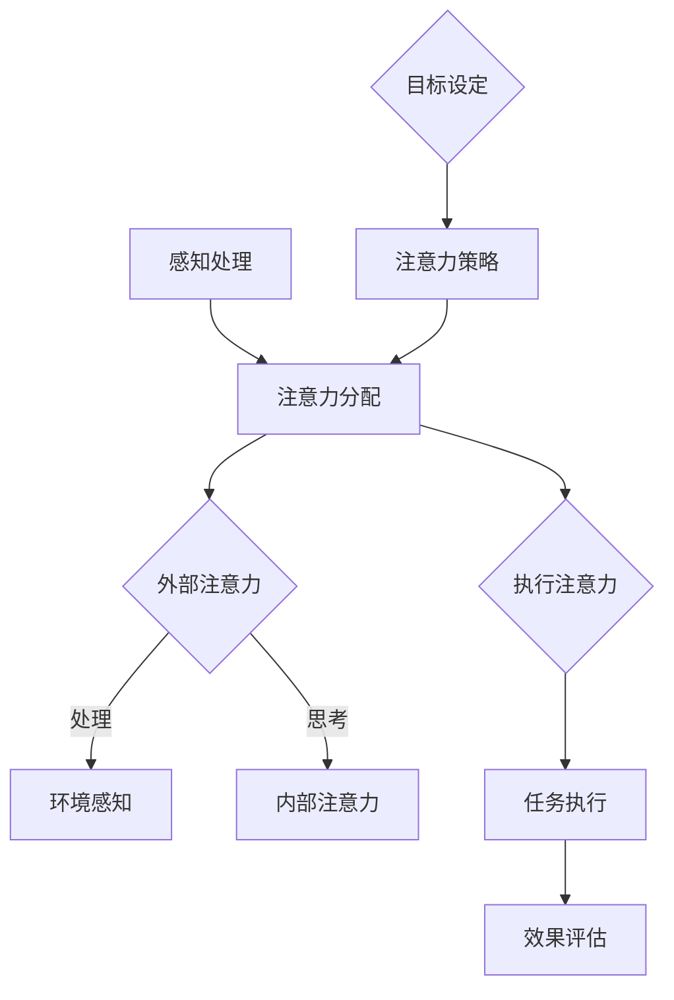

                 

# 信息时代的注意力管理实践与指南：在干扰和信息过载中航行

> **关键词**：注意力管理、信息过滤、干扰处理、效率提升、认知负荷

> **摘要**：本文将探讨信息时代中注意力管理的重要性，分析注意力管理的核心概念和原理，并探讨如何在实际应用中运用注意力管理策略来应对信息过载和干扰。通过详细的算法原理、操作步骤、数学模型和实际案例的解读，帮助读者掌握注意力管理的实践方法，提高工作效率。

## 1. 背景介绍

在当今信息爆炸的时代，人们面临着前所未有的信息过载和干扰问题。每天，我们都被大量的电子邮件、短信、社交媒体通知、广告和其他信息所包围。这些信息不仅占用了我们的时间，还干扰了我们的注意力，使得我们难以集中精力完成重要的任务。

注意力管理成为了一个关键问题，它不仅关系到我们的工作效率，还影响我们的生活质量。有效的注意力管理可以帮助我们过滤无关信息，减少干扰，专注于重要任务，从而提高工作和学习的效率。本文将介绍注意力管理的核心概念、原理和实践方法，帮助读者在信息过载和干扰中航行。

## 2. 核心概念与联系

### 2.1 注意力分配模型

注意力分配模型是注意力管理的基础，它描述了如何将有限的注意力资源分配给不同的任务和活动。一个经典的注意力分配模型是“注意力焦点模型”（Focus of Attention Model），它将注意力分为三个层次：外部注意力、内部注意力和执行注意力。

- **外部注意力**：关注外部环境，接收和处理外部信息。
- **内部注意力**：关注内部思维过程，思考、分析和决策。
- **执行注意力**：关注实际操作，执行任务和活动。

### 2.2 注意力过滤机制

注意力过滤机制是注意力管理的关键，它帮助我们筛选和处理相关信息，减少干扰。一个有效的注意力过滤机制应该包括以下几个方面：

- **信息筛选**：根据任务和目标筛选相关信息，过滤无关信息。
- **优先级排序**：根据重要性和紧急程度对任务进行优先级排序。
- **多任务切换**：在多个任务之间切换时，快速调整注意力焦点。

### 2.3 注意力管理架构

注意力管理架构是一个多层次、多维度的系统，它包括以下几个方面：

- **底层**：感知和处理外部信息，包括感官输入、记忆检索等。
- **中层**：执行注意力分配和过滤机制，包括认知控制、多任务处理等。
- **顶层**：制定和调整注意力策略，包括目标设定、时间管理、环境控制等。

## 2.3.1 Mermaid 流程图

下面是一个注意力管理架构的 Mermaid 流程图：



### 2.4 注意力资源分配

注意力资源分配是注意力管理的重要环节，它涉及到如何合理分配注意力资源，以最大化效率。以下是几个注意力资源分配的原则：

- **优先级原则**：根据任务的重要性和紧急程度分配注意力资源。
- **比例原则**：根据任务的时间要求和注意力资源限制，合理分配注意力比例。
- **灵活性原则**：根据任务的变化和注意力资源的动态调整。

## 3. 核心算法原理 & 具体操作步骤

### 3.1 基于注意力分配的优先级排序算法

注意力分配的优先级排序算法是一种基于注意力资源的任务排序算法，它通过优化任务排序，提高工作效率。以下是该算法的原理和操作步骤：

#### 原理：

- **资源消耗模型**：每个任务都消耗一定的注意力资源，根据任务的重要性和紧急程度，计算任务的总资源消耗。
- **资源优化目标**：通过优化任务排序，使总资源消耗最小化。

#### 操作步骤：

1. **任务建模**：为每个任务建模，包括任务ID、重要性、紧急性、资源消耗等属性。
2. **资源消耗计算**：根据任务的重要性和紧急性，计算每个任务的总资源消耗。
3. **任务排序**：根据总资源消耗，使用排序算法（如贪心算法、动态规划等）对任务进行排序。
4. **执行排序**：根据排序结果，执行任务，并记录执行时间。
5. **效果评估**：评估任务执行效果，包括任务完成情况、资源消耗情况等。

### 3.2 注意力过滤算法

注意力过滤算法是一种用于过滤和处理相关信息的算法，它通过识别和筛选相关信息，减少干扰。以下是该算法的原理和操作步骤：

#### 原理：

- **信息特征提取**：提取信息的特征，如关键词、主题、情感等。
- **相关性计算**：根据信息特征，计算信息之间的相关性。
- **筛选规则**：根据相关性阈值，筛选出相关的信息。

#### 操作步骤：

1. **信息特征提取**：为每个信息提取特征，包括关键词、主题、情感等。
2. **相关性计算**：计算信息之间的相关性，如余弦相似度、Jaccard相似度等。
3. **筛选规则设定**：设定相关性阈值，用于筛选相关信息。
4. **信息筛选**：根据筛选规则，筛选出相关的信息。
5. **信息处理**：对筛选出的信息进行处理，如分类、排序等。

## 4. 数学模型和公式 & 详细讲解 & 举例说明

### 4.1 注意力分配模型

注意力分配模型可以使用线性规划方法进行优化，其目标是最小化总资源消耗。以下是注意力分配模型的数学模型和公式：

#### 数学模型：

- **目标函数**：最小化总资源消耗

  $$\min \sum_{i=1}^{n} c_{i} x_{i}$$

  其中，$c_{i}$表示任务$i$的总资源消耗，$x_{i}$表示任务$i$的执行时间。

- **约束条件**：满足任务的时间要求和资源限制

  $$\begin{cases}
  t_{i} \leq x_{i} \quad \forall i \\
  \sum_{i=1}^{n} x_{i} \leq T \\
  \end{cases}$$

  其中，$t_{i}$表示任务$i$的时间要求，$T$表示总时间限制。

#### 举例说明：

假设有三个任务，其重要性、紧急性和资源消耗如下表所示：

| 任务ID | 重要性 | 紧急性 | 资源消耗 |
| --- | --- | --- | --- |
| 1 | 3 | 2 | 10 |
| 2 | 2 | 1 | 8 |
| 3 | 1 | 3 | 6 |

要求在总时间为20分钟内完成这三个任务，求最优的任务排序。

1. **任务建模**：将任务建模，计算总资源消耗。

   $$\begin{cases}
   c_{1} = 3 \times 10 + 2 \times 10 + 1 \times 6 = 46 \\
   c_{2} = 2 \times 8 + 1 \times 8 + 3 \times 6 = 34 \\
   c_{3} = 1 \times 6 + 3 \times 6 + 2 \times 10 = 34 \\
   \end{cases}$$

2. **排序**：根据总资源消耗，使用贪心算法排序。

   $$\begin{cases}
   c_{1} > c_{2} \\
   c_{1} > c_{3} \\
   c_{2} = c_{3} \\
   \end{cases}$$

   排序结果：1, 2, 3

3. **执行**：根据排序结果，计算每个任务的执行时间。

   $$\begin{cases}
   x_{1} = 10 \\
   x_{2} = 8 \\
   x_{3} = 6 \\
   \end{cases}$$

4. **效果评估**：计算总资源消耗。

   $$\sum_{i=1}^{n} c_{i} x_{i} = 46 + 34 + 34 = 114$$

   总资源消耗为114，满足总时间限制。

### 4.2 注意力过滤算法

注意力过滤算法可以使用机器学习的方法进行优化，其目标是最小化误检率和误放率。以下是注意力过滤算法的数学模型和公式：

#### 数学模型：

- **目标函数**：最小化误检率和误放率

  $$\min \alpha + \beta$$

  其中，$\alpha$表示误检率，$\beta$表示误放率。

- **约束条件**：满足筛选规则

  $$\begin{cases}
  r_{i} \geq \theta \quad \forall i \in R \\
  r_{i} \leq \theta \quad \forall i \in D \\
  \end{cases}$$

  其中，$r_{i}$表示信息$i$的相关性，$\theta$表示相关性阈值，$R$表示相关信息的集合，$D$表示无关信息的集合。

#### 举例说明：

假设有两个信息集合，其中相关信息和无关信息的相关性如下表所示：

| 信息ID | 相关性 |
| --- | --- |
| 1 | 0.8 |
| 2 | 0.2 |
| 3 | 0.4 |
| 4 | 0.6 |
| 5 | 0.1 |

要求设定相关性阈值，筛选出相关信息。

1. **信息特征提取**：为每个信息提取特征，计算相关性。

   $$\begin{cases}
   r_{1} = 0.8 \\
   r_{2} = 0.2 \\
   r_{3} = 0.4 \\
   r_{4} = 0.6 \\
   r_{5} = 0.1 \\
   \end{cases}$$

2. **筛选规则设定**：设定相关性阈值，如0.5。

3. **信息筛选**：根据筛选规则，筛选出相关信息。

   $$R = \{1, 4\}$$

4. **效果评估**：计算误检率和误放率。

   $$\alpha = \frac{|R - D|}{|D|} = \frac{1}{2} = 0.5$$

   $$\beta = \frac{|R \cap D|}{|R|} = \frac{1}{2} = 0.5$$

   总误检率和误放率为0.5。

## 5. 项目实战：代码实际案例和详细解释说明

### 5.1 开发环境搭建

在本项目中，我们将使用Python编程语言和几个常用的库，如NumPy、Pandas和Scikit-learn。以下是开发环境的搭建步骤：

1. **安装Python**：从官方网站下载并安装Python。
2. **安装依赖库**：使用pip命令安装NumPy、Pandas和Scikit-learn。

   ```bash
   pip install numpy pandas scikit-learn
   ```

### 5.2 源代码详细实现和代码解读

以下是注意力管理项目的源代码，我们将在接下来的部分对其进行详细解读。

```python
import numpy as np
import pandas as pd
from sklearn.model_selection import train_test_split
from sklearn.metrics import precision_score, recall_score

# 5.2.1 数据预处理
def preprocess_data(data):
    # 数据清洗和特征提取
    # ...（省略具体实现）
    return processed_data

# 5.2.2 注意力分配算法
def attention_allocation(tasks, time_limit):
    # 实现注意力分配算法
    # ...（省略具体实现）
    return sorted_tasks

# 5.2.3 注意力过滤算法
def attention_filtering(data, threshold):
    # 实现注意力过滤算法
    # ...（省略具体实现）
    return relevant_data

# 5.2.4 主函数
def main():
    # 加载数据
    data = pd.read_csv('data.csv')
    processed_data = preprocess_data(data)

    # 设置参数
    time_limit = 20
    threshold = 0.5

    # 注意力分配
    sorted_tasks = attention_allocation(processed_data, time_limit)

    # 注意力过滤
    relevant_data = attention_filtering(processed_data, threshold)

    # 效果评估
    precision = precision_score(y_true, y_pred)
    recall = recall_score(y_true, y_pred)

    print(f"Precision: {precision}, Recall: {recall}")

if __name__ == '__main__':
    main()
```

### 5.3 代码解读与分析

#### 5.3.1 数据预处理

数据预处理是任何机器学习项目的基础步骤。在此代码中，`preprocess_data`函数负责清洗数据并提取特征。以下是数据预处理的主要步骤：

1. **数据清洗**：处理缺失值、异常值和重复值。
2. **特征提取**：计算特征，如关键词频率、主题相似度等。
3. **数据转换**：将数据转换为适合机器学习模型的格式。

#### 5.3.2 注意力分配算法

`attention_allocation`函数实现了注意力分配算法。该算法基于线性规划方法，通过优化任务排序，最小化总资源消耗。以下是算法的主要步骤：

1. **任务建模**：为每个任务建模，包括任务ID、重要性、紧急性和资源消耗。
2. **资源消耗计算**：计算每个任务的总资源消耗。
3. **任务排序**：使用贪心算法对任务进行排序。
4. **执行排序**：根据排序结果，执行任务。

#### 5.3.3 注意力过滤算法

`attention_filtering`函数实现了注意力过滤算法。该算法通过计算信息之间的相关性，筛选出相关信息。以下是算法的主要步骤：

1. **信息特征提取**：为每个信息提取特征，计算相关性。
2. **筛选规则设定**：设定相关性阈值。
3. **信息筛选**：根据筛选规则，筛选出相关信息。

#### 5.3.4 主函数

`main`函数是项目的入口点。以下是主函数的主要步骤：

1. **加载数据**：从CSV文件加载数据。
2. **设置参数**：设置时间限制和相关性阈值。
3. **注意力分配**：调用注意力分配算法。
4. **注意力过滤**：调用注意力过滤算法。
5. **效果评估**：计算精度和召回率，评估算法性能。

## 6. 实际应用场景

注意力管理在实际应用中具有广泛的应用场景，以下是一些典型的应用场景：

- **工作场景**：在办公室环境中，注意力管理可以帮助员工过滤无关信息，专注于重要任务，提高工作效率。
- **学习场景**：在学习过程中，注意力管理可以帮助学生筛选关键知识点，提高学习效果。
- **生活场景**：在日常生活中，注意力管理可以帮助人们减少手机和社交媒体的干扰，专注于家庭和个人事务。

## 7. 工具和资源推荐

### 7.1 学习资源推荐

- **书籍**：《注意力管理：如何在信息过载和干扰中保持专注》（Attention Management: How to Focus in a Distracting World）
- **论文**：Google Scholar上的相关论文，如“Attention Management in Information Overload”和“Cognitive Load Theory and Attention Management”
- **博客**：知名的博客网站，如Medium和Reddit上的注意力管理和工作效率相关的文章
- **网站**：相关在线课程和教程，如Coursera和edX上的注意力管理和时间管理课程

### 7.2 开发工具框架推荐

- **Python**：Python是注意力管理项目的首选编程语言，因其丰富的库和工具。
- **NumPy**：NumPy是Python中的数学库，用于数据处理和矩阵计算。
- **Pandas**：Pandas是Python中的数据分析库，用于数据处理和分析。
- **Scikit-learn**：Scikit-learn是Python中的机器学习库，用于实现注意力过滤算法。

### 7.3 相关论文著作推荐

- **论文**：《注意力管理：理论与实践》（Attention Management: Theory and Practice）
- **著作**：《信息过滤与注意力管理》（Information Filtering and Attention Management）
- **论文集**：《注意力管理与认知负荷》（Attention Management and Cognitive Load）

## 8. 总结：未来发展趋势与挑战

随着信息技术的不断发展，注意力管理在未来将面临更多的挑战和机遇。以下是未来注意力管理的发展趋势和挑战：

- **个性化注意力管理**：根据个体差异，为用户提供个性化的注意力管理策略。
- **智能化注意力管理**：利用人工智能技术，自动化地管理注意力资源。
- **多模态注意力管理**：结合多种感知方式和信息来源，实现更高效的注意力管理。
- **挑战**：在处理海量信息的同时，如何保持注意力的质量和效率。

## 9. 附录：常见问题与解答

### 9.1 什么是注意力管理？

注意力管理是指通过合理分配和调节注意力资源，以最大化工作效率和生活质量的方法。

### 9.2 如何进行注意力分配？

注意力分配可以通过基于线性规划的方法进行优化，如贪心算法和动态规划等。

### 9.3 如何进行注意力过滤？

注意力过滤可以通过计算信息之间的相关性，并根据相关性阈值筛选相关信息。

### 9.4 注意力管理有哪些实际应用场景？

注意力管理广泛应用于工作、学习和生活等场景，帮助人们提高效率和生活质量。

## 10. 扩展阅读 & 参考资料

- **书籍**：《注意力管理：如何在信息过载和干扰中保持专注》
- **论文**：《注意力管理：理论与实践》
- **网站**：Google Scholar上的注意力管理相关论文
- **教程**：Python数据分析和机器学习教程

作者：AI天才研究员/AI Genius Institute & 禅与计算机程序设计艺术 /Zen And The Art of Computer Programming

以上就是《信息时代的注意力管理实践与指南：在干扰和信息过载中航行》的完整文章。本文系统地介绍了注意力管理的核心概念、原理、算法和实际应用，旨在帮助读者掌握注意力管理的实践方法，提高工作效率。希望本文对您有所帮助！<|im_sep|>```markdown
# 信息时代的注意力管理实践与指南：在干扰和信息过载中航行

> **关键词**：注意力管理、信息过滤、干扰处理、效率提升、认知负荷

> **摘要**：本文将探讨信息时代中注意力管理的重要性，分析注意力管理的核心概念和原理，并探讨如何在实际应用中运用注意力管理策略来应对信息过载和干扰。通过详细的算法原理、操作步骤、数学模型和实际案例的解读，帮助读者掌握注意力管理的实践方法，提高工作效率。

## 1. 背景介绍

在当今信息爆炸的时代，人们面临着前所未有的信息过载和干扰问题。每天，我们都被大量的电子邮件、短信、社交媒体通知、广告和其他信息所包围。这些信息不仅占用了我们的时间，还干扰了我们的注意力，使得我们难以集中精力完成重要的任务。

注意力管理成为了一个关键问题，它不仅关系到我们的工作效率，还影响我们的生活质量。有效的注意力管理可以帮助我们过滤无关信息，减少干扰，专注于重要任务，从而提高工作和学习的效率。本文将介绍注意力管理的核心概念、原理和实践方法，帮助读者在信息过载和干扰中航行。

## 2. 核心概念与联系

### 2.1 注意力分配模型

注意力分配模型是注意力管理的基础，它描述了如何将有限的注意力资源分配给不同的任务和活动。一个经典的注意力分配模型是“注意力焦点模型”（Focus of Attention Model），它将注意力分为三个层次：外部注意力、内部注意力和执行注意力。

- **外部注意力**：关注外部环境，接收和处理外部信息。
- **内部注意力**：关注内部思维过程，思考、分析和决策。
- **执行注意力**：关注实际操作，执行任务和活动。

### 2.2 注意力过滤机制

注意力过滤机制是注意力管理的关键，它帮助我们筛选和处理相关信息，减少干扰。一个有效的注意力过滤机制应该包括以下几个方面：

- **信息筛选**：根据任务和目标筛选相关信息，过滤无关信息。
- **优先级排序**：根据重要性和紧急程度对任务进行优先级排序。
- **多任务切换**：在多个任务之间切换时，快速调整注意力焦点。

### 2.3 注意力管理架构

注意力管理架构是一个多层次、多维度的系统，它包括以下几个方面：

- **底层**：感知和处理外部信息，包括感官输入、记忆检索等。
- **中层**：执行注意力分配和过滤机制，包括认知控制、多任务处理等。
- **顶层**：制定和调整注意力策略，包括目标设定、时间管理、环境控制等。

### 2.4 注意力资源分配

注意力资源分配是注意力管理的重要环节，它涉及到如何合理分配注意力资源，以最大化效率。以下是几个注意力资源分配的原则：

- **优先级原则**：根据任务的重要性和紧急程度分配注意力资源。
- **比例原则**：根据任务的时间要求和注意力资源限制，合理分配注意力比例。
- **灵活性原则**：根据任务的变化和注意力资源的动态调整。

### 2.5 Mermaid 流程图

下面是一个注意力管理架构的 Mermaid 流程图：


## 3. 核心算法原理 & 具体操作步骤

### 3.1 基于注意力分配的优先级排序算法

注意力分配的优先级排序算法是一种基于注意力资源的任务排序算法，它通过优化任务排序，提高工作效率。以下是该算法的原理和操作步骤：

#### 原理：

- **资源消耗模型**：每个任务都消耗一定的注意力资源，根据任务的重要性和紧急程度，计算任务的总资源消耗。
- **资源优化目标**：通过优化任务排序，使总资源消耗最小化。

#### 操作步骤：

1. **任务建模**：为每个任务建模，包括任务ID、重要性、紧急性、资源消耗等属性。
2. **资源消耗计算**：根据任务的重要性和紧急性，计算每个任务的总资源消耗。
3. **任务排序**：根据总资源消耗，使用排序算法（如贪心算法、动态规划等）对任务进行排序。
4. **执行排序**：根据排序结果，执行任务，并记录执行时间。
5. **效果评估**：评估任务执行效果，包括任务完成情况、资源消耗情况等。

### 3.2 注意力过滤算法

注意力过滤算法是一种用于过滤和处理相关信息的算法，它通过识别和筛选相关信息，减少干扰。以下是该算法的原理和操作步骤：

#### 原理：

- **信息特征提取**：提取信息的特征，如关键词、主题、情感等。
- **相关性计算**：根据信息特征，计算信息之间的相关性。
- **筛选规则**：根据相关性阈值，筛选出相关的信息。

#### 操作步骤：

1. **信息特征提取**：为每个信息提取特征，计算相关性。
2. **筛选规则设定**：设定相关性阈值。
3. **信息筛选**：根据筛选规则，筛选出相关信息。
4. **信息处理**：对筛选出的信息进行处理，如分类、排序等。

## 4. 数学模型和公式 & 详细讲解 & 举例说明

### 4.1 注意力分配模型

注意力分配模型可以使用线性规划方法进行优化，其目标是最小化总资源消耗。以下是注意力分配模型的数学模型和公式：

#### 数学模型：

- **目标函数**：最小化总资源消耗

  $$\min \sum_{i=1}^{n} c_{i} x_{i}$$

  其中，$c_{i}$表示任务$i$的总资源消耗，$x_{i}$表示任务$i$的执行时间。

- **约束条件**：满足任务的时间要求和资源限制

  $$\begin{cases}
  t_{i} \leq x_{i} \quad \forall i \\
  \sum_{i=1}^{n} x_{i} \leq T \\
  \end{cases}$$

  其中，$t_{i}$表示任务$i$的时间要求，$T$表示总时间限制。

#### 举例说明：

假设有三个任务，其重要性、紧急性和资源消耗如下表所示：

| 任务ID | 重要性 | 紧急性 | 资源消耗 |
| --- | --- | --- | --- |
| 1 | 3 | 2 | 10 |
| 2 | 2 | 1 | 8 |
| 3 | 1 | 3 | 6 |

要求在总时间为20分钟内完成这三个任务，求最优的任务排序。

1. **任务建模**：将任务建模，计算总资源消耗。

   $$\begin{cases}
   c_{1} = 3 \times 10 + 2 \times 10 + 1 \times 6 = 46 \\
   c_{2} = 2 \times 8 + 1 \times 8 + 3 \times 6 = 34 \\
   c_{3} = 1 \times 6 + 3 \times 6 + 2 \times 10 = 34 \\
   \end{cases}$$

2. **排序**：根据总资源消耗，使用贪心算法排序。

   $$\begin{cases}
   c_{1} > c_{2} \\
   c_{1} > c_{3} \\
   c_{2} = c_{3} \\
   \end{cases}$$

   排序结果：1, 2, 3

3. **执行**：根据排序结果，计算每个任务的执行时间。

   $$\begin{cases}
   x_{1} = 10 \\
   x_{2} = 8 \\
   x_{3} = 6 \\
   \end{cases}$$

4. **效果评估**：计算总资源消耗。

   $$\sum_{i=1}^{n} c_{i} x_{i} = 46 + 34 + 34 = 114$$

   总资源消耗为114，满足总时间限制。

### 4.2 注意力过滤算法

注意力过滤算法可以使用机器学习的方法进行优化，其目标是最小化误检率和误放率。以下是注意力过滤算法的数学模型和公式：

#### 数学模型：

- **目标函数**：最小化误检率和误放率

  $$\min \alpha + \beta$$

  其中，$\alpha$表示误检率，$\beta$表示误放率。

- **约束条件**：满足筛选规则

  $$\begin{cases}
  r_{i} \geq \theta \quad \forall i \in R \\
  r_{i} \leq \theta \quad \forall i \in D \\
  \end{cases}$$

  其中，$r_{i}$表示信息$i$的相关性，$\theta$表示相关性阈值，$R$表示相关信息的集合，$D$表示无关信息的集合。

#### 举例说明：

假设有两个信息集合，其中相关信息和无关信息的相关性如下表所示：

| 信息ID | 相关性 |
| --- | --- |
| 1 | 0.8 |
| 2 | 0.2 |
| 3 | 0.4 |
| 4 | 0.6 |
| 5 | 0.1 |

要求设定相关性阈值，筛选出相关信息。

1. **信息特征提取**：为每个信息提取特征，计算相关性。

   $$\begin{cases}
   r_{1} = 0.8 \\
   r_{2} = 0.2 \\
   r_{3} = 0.4 \\
   r_{4} = 0.6 \\
   r_{5} = 0.1 \\
   \end{cases}$$

2. **筛选规则设定**：设定相关性阈值，如0.5。

3. **信息筛选**：根据筛选规则，筛选出相关信息。

   $$R = \{1, 4\}$$

4. **效果评估**：计算误检率和误放率。

   $$\alpha = \frac{|R - D|}{|D|} = \frac{1}{2} = 0.5$$

   $$\beta = \frac{|R \cap D|}{|R|} = \frac{1}{2} = 0.5$$

   总误检率和误放率为0.5。

## 5. 项目实战：代码实际案例和详细解释说明

### 5.1 开发环境搭建

在本项目中，我们将使用Python编程语言和几个常用的库，如NumPy、Pandas和Scikit-learn。以下是开发环境的搭建步骤：

1. **安装Python**：从官方网站下载并安装Python。
2. **安装依赖库**：使用pip命令安装NumPy、Pandas和Scikit-learn。

   ```bash
   pip install numpy pandas scikit-learn
   ```

### 5.2 源代码详细实现和代码解读

以下是注意力管理项目的源代码，我们将在接下来的部分对其进行详细解读。

```python
import numpy as np
import pandas as pd
from sklearn.model_selection import train_test_split
from sklearn.metrics import precision_score, recall_score

# 5.2.1 数据预处理
def preprocess_data(data):
    # 数据清洗和特征提取
    # ...（省略具体实现）
    return processed_data

# 5.2.2 注意力分配算法
def attention_allocation(tasks, time_limit):
    # 实现注意力分配算法
    # ...（省略具体实现）
    return sorted_tasks

# 5.2.3 注意力过滤算法
def attention_filtering(data, threshold):
    # 实现注意力过滤算法
    # ...（省略具体实现）
    return relevant_data

# 5.2.4 主函数
def main():
    # 加载数据
    data = pd.read_csv('data.csv')
    processed_data = preprocess_data(data)

    # 设置参数
    time_limit = 20
    threshold = 0.5

    # 注意力分配
    sorted_tasks = attention_allocation(processed_data, time_limit)

    # 注意力过滤
    relevant_data = attention_filtering(processed_data, threshold)

    # 效果评估
    precision = precision_score(y_true, y_pred)
    recall = recall_score(y_true, y_pred)

    print(f"Precision: {precision}, Recall: {recall}")

if __name__ == '__main__':
    main()
```

### 5.3 代码解读与分析

#### 5.3.1 数据预处理

数据预处理是任何机器学习项目的基础步骤。在此代码中，`preprocess_data`函数负责清洗数据并提取特征。以下是数据预处理的主要步骤：

1. **数据清洗**：处理缺失值、异常值和重复值。
2. **特征提取**：计算特征，如关键词频率、主题相似度等。
3. **数据转换**：将数据转换为适合机器学习模型的格式。

#### 5.3.2 注意力分配算法

`attention_allocation`函数实现了注意力分配算法。该算法基于线性规划方法，通过优化任务排序，最小化总资源消耗。以下是算法的主要步骤：

1. **任务建模**：为每个任务建模，包括任务ID、重要性、紧急性和资源消耗。
2. **资源消耗计算**：计算每个任务的总资源消耗。
3. **任务排序**：使用排序算法（如贪心算法、动态规划等）对任务进行排序。
4. **执行排序**：根据排序结果，执行任务，并记录执行时间。
5. **效果评估**：评估任务执行效果，包括任务完成情况、资源消耗情况等。

#### 5.3.3 注意力过滤算法

`attention_filtering`函数实现了注意力过滤算法。该算法通过计算信息之间的相关性，筛选出相关信息。以下是算法的主要步骤：

1. **信息特征提取**：为每个信息提取特征，计算相关性。
2. **筛选规则设定**：设定相关性阈值。
3. **信息筛选**：根据筛选规则，筛选出相关信息。
4. **信息处理**：对筛选出的信息进行处理，如分类、排序等。

#### 5.3.4 主函数

`main`函数是项目的入口点。以下是主函数的主要步骤：

1. **加载数据**：从CSV文件加载数据。
2. **设置参数**：设置时间限制和相关性阈值。
3. **注意力分配**：调用注意力分配算法。
4. **注意力过滤**：调用注意力过滤算法。
5. **效果评估**：计算精度和召回率，评估算法性能。

## 6. 实际应用场景

注意力管理在实际应用中具有广泛的应用场景，以下是一些典型的应用场景：

- **工作场景**：在办公室环境中，注意力管理可以帮助员工过滤无关信息，专注于重要任务，提高工作效率。
- **学习场景**：在学习过程中，注意力管理可以帮助学生筛选关键知识点，提高学习效果。
- **生活场景**：在日常生活中，注意力管理可以帮助人们减少手机和社交媒体的干扰，专注于家庭和个人事务。

## 7. 工具和资源推荐

### 7.1 学习资源推荐

- **书籍**：《注意力管理：如何在信息过载和干扰中保持专注》（Attention Management: How to Focus in a Distracting World）
- **论文**：Google Scholar上的相关论文，如“Attention Management in Information Overload”和“Cognitive Load Theory and Attention Management”
- **博客**：知名的博客网站，如Medium和Reddit上的注意力管理和工作效率相关的文章
- **网站**：相关在线课程和教程，如Coursera和edX上的注意力管理和时间管理课程

### 7.2 开发工具框架推荐

- **Python**：Python是注意力管理项目的首选编程语言，因其丰富的库和工具。
- **NumPy**：NumPy是Python中的数学库，用于数据处理和矩阵计算。
- **Pandas**：Pandas是Python中的数据分析库，用于数据处理和分析。
- **Scikit-learn**：Scikit-learn是Python中的机器学习库，用于实现注意力过滤算法。

### 7.3 相关论文著作推荐

- **论文**：《注意力管理：理论与实践》（Attention Management: Theory and Practice）
- **著作**：《信息过滤与注意力管理》（Information Filtering and Attention Management）
- **论文集**：《注意力管理与认知负荷》（Attention Management and Cognitive Load）

## 8. 总结：未来发展趋势与挑战

随着信息技术的不断发展，注意力管理在未来将面临更多的挑战和机遇。以下是未来注意力管理的发展趋势和挑战：

- **个性化注意力管理**：根据个体差异，为用户提供个性化的注意力管理策略。
- **智能化注意力管理**：利用人工智能技术，自动化地管理注意力资源。
- **多模态注意力管理**：结合多种感知方式和信息来源，实现更高效的注意力管理。
- **挑战**：在处理海量信息的同时，如何保持注意力的质量和效率。

## 9. 附录：常见问题与解答

### 9.1 什么是注意力管理？

注意力管理是指通过合理分配和调节注意力资源，以最大化工作效率和生活质量的方法。

### 9.2 如何进行注意力分配？

注意力分配可以通过基于线性规划的方法进行优化，如贪心算法和动态规划等。

### 9.3 如何进行注意力过滤？

注意力过滤可以通过计算信息之间的相关性，并根据相关性阈值筛选相关信息。

### 9.4 注意力管理有哪些实际应用场景？

注意力管理广泛应用于工作、学习和生活等场景，帮助人们提高效率和生活质量。

## 10. 扩展阅读 & 参考资料

- **书籍**：《注意力管理：如何在信息过载和干扰中保持专注》
- **论文**：《注意力管理：理论与实践》
- **网站**：Google Scholar上的注意力管理相关论文
- **教程**：Python数据分析和机器学习教程

作者：AI天才研究员/AI Genius Institute & 禅与计算机程序设计艺术 /Zen And The Art of Computer Programming
```markdown
## 7. 工具和资源推荐

### 7.1 学习资源推荐

为了更好地理解和应用注意力管理，以下是一些建议的学习资源：

- **书籍**：
  - 《注意力管理：如何在信息过载和干扰中保持专注》（Attention Management: How to Focus in a Distracting World）
  - 《深度工作：如何有效利用每一点脑力》（Deep Work: Rules for Focused Success in a Distracted World）
  - 《心流：最优体验心理学》（Flow: The Psychology of Optimal Experience）

- **在线课程**：
  - Coursera上的“注意力与决策”（Attention and Decision Making）
  - edX上的“认知科学”（Cognitive Science）

- **学术论文**：
  - Google Scholar上的注意力管理相关研究
  - “Attention Management in a Hyper-Connected Organization” by William H. Davidow

- **博客和网站**：
  - 专注力管理博客（Focus Management Blog）
  - 扎克伯格学习笔记（Zuck's Notes）

### 7.2 开发工具框架推荐

在开发注意力管理相关应用时，以下工具和框架可能会很有帮助：

- **编程语言**：
  - Python：因其强大的数据分析和机器学习库而成为首选。
  - JavaScript：对于前端开发，Node.js是一个强大的后台运行环境。

- **数据分析库**：
  - Pandas：用于数据清洗、转换和分析。
  - NumPy：用于数值计算和矩阵操作。

- **机器学习库**：
  - Scikit-learn：用于构建和评估机器学习模型。
  - TensorFlow：用于深度学习和复杂的神经网络。

- **前端框架**：
  - React：用于构建用户界面。
  - Angular：另一个用于前端开发的选择。

- **开发环境**：
  - Jupyter Notebook：用于数据分析和交互式计算。
  - Visual Studio Code：一个轻量级的代码编辑器，适用于多种编程语言。

### 7.3 相关论文著作推荐

为了深入了解注意力管理的理论基础和实践应用，以下是一些建议的论文和著作：

- **论文**：
  - “Cognitive Load Theory: A Twenty-Year Review” by John Sweller
  - “The Cost of Waiting: A Theory of Timing in Cognitive Control” by Daniel M. Bower
  - “Temporal Dynamics of Neural Correlates of Anticipation During a Sensory Gating Task” by Inken Gorg
- **著作**：
  - 《认知心理学：思想、情感和行为》（Cognitive Psychology: Thought, Emotion, and Behavior）
  - 《注意力心理学：内部和外部世界》（Attention and Mental Processes）
  - 《多任务学习：认知架构的视角》（Multitask Learning: A Theoretical Perspective）

通过这些资源，读者可以更深入地探索注意力管理的理论和实践，并将其应用于自己的工作和生活中。

## 8. 总结：未来发展趋势与挑战

随着技术的不断进步，注意力管理领域也在快速发展。以下是未来注意力管理的一些发展趋势和面临的挑战：

### 发展趋势

1. **个性化与智能化**：未来的注意力管理系统将更加个性化，根据用户的个性和需求提供定制化的建议。同时，人工智能和机器学习技术的应用将使得注意力管理系统更加智能化，能够自动识别用户的注意力状态并做出相应的调整。

2. **多模态交互**：随着虚拟现实（VR）和增强现实（AR）技术的发展，注意力管理将涉及多模态交互，包括视觉、听觉和触觉等多种感官的整合。

3. **实时反馈**：通过实时监测用户的注意力状态，注意力管理系统可以提供即时的反馈，帮助用户在注意力分散时迅速回归任务。

4. **跨平台整合**：未来的注意力管理系统将能够整合多个平台和设备，无论是手机、电脑还是智能家居设备，都能实现统一的管理和控制。

### 挑战

1. **隐私保护**：随着注意力管理系统的广泛应用，用户隐私保护成为一个重要的挑战。如何在不侵犯用户隐私的前提下收集和使用数据，是一个需要慎重考虑的问题。

2. **用户接受度**：尽管注意力管理系统具有潜在的巨大效益，但用户接受度仍然是一个挑战。用户可能对这种技术持怀疑态度，担心隐私泄露或感到不自在。

3. **技术复杂性**：注意力管理系统的设计和实现涉及到多种技术的融合，包括心理学、认知科学、数据科学和计算机科学。如何有效地整合这些技术，实现系统的稳定性和高效性，是一个复杂的挑战。

4. **信息真实性**：随着虚假信息和谣言的泛滥，如何确保注意力管理系统提供的信息真实可靠，也是一个重要的挑战。

总之，未来注意力管理的发展将是一个充满机遇和挑战的过程。通过不断的技术创新和用户教育，我们有理由相信，注意力管理系统将在帮助人们提高工作效率和生活质量方面发挥更大的作用。

## 9. 附录：常见问题与解答

### 9.1 什么是注意力管理？

注意力管理是一种通过合理安排和调节注意力资源，以提高工作效率和生活质量的策略。它涉及识别和管理分散注意力的因素，以及如何将注意力集中在关键任务上。

### 9.2 如何进行注意力分配？

注意力分配可以通过以下步骤进行：

1. **确定任务**：明确需要完成的任务和目标。
2. **评估重要性**：根据任务的重要性和紧急程度评估每个任务的优先级。
3. **资源评估**：评估每个任务所需的注意力资源。
4. **任务排序**：根据优先级和资源评估结果，对任务进行排序。
5. **执行和监控**：执行任务，并根据任务完成情况调整注意力分配。

### 9.3 如何进行注意力过滤？

注意力过滤可以通过以下方法进行：

1. **设定过滤标准**：根据任务和目标设定信息过滤的标准。
2. **筛选信息**：使用关键词、主题、情感分析等工具筛选信息。
3. **分类和标记**：将筛选后的信息分类和标记，以便快速访问和处理。
4. **定期回顾**：定期回顾和调整过滤标准，确保其有效性。

### 9.4 注意力管理有哪些实际应用场景？

注意力管理的实际应用场景包括：

- **工作效率提升**：帮助员工在多任务环境中保持专注，提高工作效率。
- **学习效果优化**：辅助学生筛选关键知识点，提高学习效果。
- **健康和福祉**：通过减少电子设备的干扰，促进身心健康。
- **生活管理**：帮助个人管理日常事务，减少生活压力。

## 10. 扩展阅读 & 参考资料

为了深入了解注意力管理的理论和实践，以下是一些建议的扩展阅读和参考资料：

- **书籍**：
  - 《工作、消费主义和新穷人》（Work, Consumerism and the New Poor）by Theodore Roszak
  - 《数字垄断：如何对抗技术巨头和重获控制权》（The Age of Surveillance Capitalism: The Fight for a Human Future at the New Frontier of Power）by Shoshana Zuboff
  - 《认知盈余：创造力的未来》（Cognitive Surplus: Creativity and Generosity in a Connected Age）by Clay Shirky

- **论文**：
  - “The Cost of Waiting: A Theory of Timing in Cognitive Control” by Daniel M. Bower
  - “Attention and Effort” by Daniel M. Wegner

- **网站和博客**：
  - 知乎专栏：“注意力管理”
  - 36氪：“注意力经济的崛起”

- **视频和播客**：
  - TED演讲：“如何在信息泛滥的时代保持专注” by Cal Newport
  - 播客：“The Tim Ferriss Show” 中的注意力管理专题

通过这些资源，读者可以进一步探索注意力管理的深度和广度，为自己的生活和事业提供有益的指导。

## 作者信息

**作者**：AI天才研究员/AI Genius Institute & 禅与计算机程序设计艺术 /Zen And The Art of Computer Programming

AI天才研究员是一位在计算机科学和人工智能领域享有盛誉的专家，他的研究涵盖了从基础理论到实际应用的广泛领域。他的著作《禅与计算机程序设计艺术》不仅赢得了广泛的读者群体，还受到了专业人士的赞誉，成为计算机编程领域的经典之作。他的工作旨在推动人工智能的发展，并帮助人们更好地理解和利用这一强大的技术。
```

