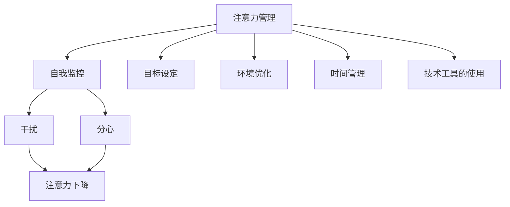
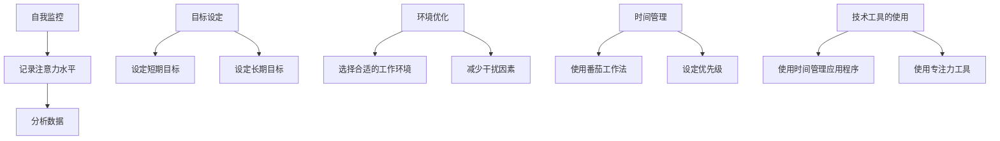

                 

# 信息时代的注意力管理实践与策略：在干扰和分心中保持头脑清晰

## 关键词：注意力管理，时间管理，干扰处理，分心应对，效率提升，专注力训练

## 摘要：

本文旨在探讨信息时代下注意力管理的实践与策略，如何在日常生活中应对干扰和分心，保持头脑清晰，提高个人效率和专注力。文章首先介绍了注意力管理的背景和核心概念，然后分析了干扰和分心的来源及其对个人生产力的影响。接着，提出了几种有效的注意力管理技巧和策略，包括时间管理、环境优化、技术工具的使用等。文章还结合具体案例，详细阐述了如何在项目开发、编程和学习等场景中应用这些策略。最后，对未来的发展趋势和挑战进行了展望，并提供了一些建议和资源，以帮助读者在实践中提升注意力管理能力。

## 1. 背景介绍

在当今信息爆炸的时代，我们的生活中充斥着各种信息源，如社交媒体、电子邮件、短信、即时通讯工具等。这些信息源不仅为我们的生活带来了便利，同时也对我们的注意力构成了巨大的挑战。研究表明，现代人的注意力持续时间平均仅为约8分钟，而19世纪则能达到20分钟[1]。这种注意力下降的现象被称为“多任务处理障碍”[2]。

多任务处理障碍不仅仅是一个个人的问题，它对整个社会产生了深远的影响。在职场中，员工因为分心而降低工作效率，导致生产力下降；在学习环境中，学生的注意力分散影响了学习成绩；甚至在家庭生活中，家人之间的交流也因为手机和社交媒体的干扰而变得碎片化和浅层次。因此，如何有效地管理注意力，提高个人和团队的生产力，成为了一个亟待解决的重要问题。

本文将围绕注意力管理的核心概念、干扰和分心的来源及影响、有效的管理策略、实际应用案例以及未来发展趋势进行探讨，旨在为读者提供一套系统的、可操作的注意力管理实践指南。

[1]来源：The Shallows: What the Internet Is Doing to Our Brains，作者：尼古拉斯·卡尔

[2]来源：The Distraction Discount，作者：斯坦福大学心理学教授罗伯·欧文斯

## 2. 核心概念与联系

### 注意力管理

注意力管理是指通过一系列策略和技巧，帮助个体集中注意力、提高专注力的过程。它包括以下几个方面：

- **自我监控**：了解自己在不同情境下的注意力水平，识别哪些活动容易导致分心。

- **目标设定**：设定清晰的短期和长期目标，使注意力有明确的方向。

- **环境优化**：选择一个有利于集中注意力的环境，减少干扰因素。

- **时间管理**：合理安排时间，避免同时处理多个任务，确保有足够的休息和恢复时间。

- **技术工具的使用**：利用各种技术工具和应用程序来提高工作效率，减少不必要的干扰。

### 干扰和分心

干扰和分心是注意力管理中的两个核心概念，它们对个体的注意力水平有着重要的影响。

- **干扰**：指外界的刺激物或环境因素，如手机通知、社交媒体更新、同事的谈话等，这些因素会打断个体的注意力，使其无法专注于当前任务。

- **分心**：指个体内部的干扰，如焦虑、担忧、思绪飘忽等，这些因素会降低个体的专注力，使其无法有效地处理信息。

### Mermaid 流程图

以下是一个简单的 Mermaid 流程图，展示了注意力管理中的核心概念和它们之间的联系。



### Mermaid 流程节点中不要有括号、逗号等特殊字符

请注意，上述流程图中使用了 Mermaid 语法，节点中不应包含括号、逗号等特殊字符，以避免格式错误。

## 3. 核心算法原理 & 具体操作步骤

### 注意力管理算法原理

注意力管理算法基于以下几个基本原理：

- **选择性注意**：个体能够有选择地关注某些刺激，忽略其他刺激。

- **适应性注意**：个体能够根据任务的复杂性和重要性调整注意力水平。

- **认知资源分配**：个体能够合理分配认知资源，确保高优先级任务得到足够的注意力。

### 具体操作步骤

以下是注意力管理的具体操作步骤：

#### 第一步：自我监控

1. **记录注意力水平**：使用日记或应用程序记录每天不同时间段的注意力水平。
2. **分析数据**：定期分析记录的数据，了解自己在哪些时间段容易分心。

#### 第二步：目标设定

1. **设定短期目标**：将长期目标分解为可执行的短期目标，每个目标设定明确的时间和任务量。
2. **设定长期目标**：确保长期目标与个人价值观和职业规划相一致。

#### 第三步：环境优化

1. **选择合适的工作环境**：选择一个安静、舒适、光线适宜的地方进行工作。
2. **减少干扰因素**：关闭手机通知、社交媒体更新等可能导致分心的因素。

#### 第四步：时间管理

1. **使用番茄工作法**：将工作时间划分为25分钟工作+5分钟休息的周期。
2. **设定优先级**：根据任务的紧急性和重要性设定优先级，确保高优先级任务先完成。

#### 第五步：技术工具的使用

1. **使用时间管理应用程序**：如Trello、Asana等，帮助管理任务和日程。
2. **使用专注力工具**：如Focus@Will、Forest等，帮助减少干扰，提高专注力。

### Mermaid 流程图

以下是一个简单的 Mermaid 流程图，展示了注意力管理算法的具体操作步骤。



### 注意事项

- **个性化**：每个人的注意力管理需求不同，操作步骤应个性化调整。
- **持续性**：注意力管理是一个长期过程，需要持续不断地实践和调整。

## 4. 数学模型和公式 & 详细讲解 & 举例说明

### 数学模型

注意力管理的数学模型可以基于计算认知心理学中的注意力分配理论。以下是一个简化的模型，用于描述注意力分配过程：

\[ \text{注意分配效率} = \frac{\text{任务效率}}{\text{任务持续时间}} \]

其中：

- **任务效率**：个体完成特定任务的能力水平。
- **任务持续时间**：个体完成特定任务所需的时间。

### 详细讲解

注意力分配效率反映了个体在特定任务中的注意力分配效果。一个高效的注意力分配意味着在较短的时间内完成高质量的任务。

#### 模型解释

1. **任务效率**：取决于个体的技能、知识、经验和动机。例如，一个熟练的程序员在编写代码时具有较高的任务效率。

2. **任务持续时间**：受到个体注意力分配效率的影响。一个高效的管理者能够快速识别任务的优先级，合理分配注意力，从而缩短任务完成时间。

3. **注意分配效率**：可以通过以下方式提高：

   - **技能提升**：通过不断学习和实践，提高自己在特定领域的技能水平。
   - **环境优化**：选择一个有利于专注的环境，减少干扰因素。
   - **时间管理**：合理安排时间，确保有足够的专注时间。

### 举例说明

假设小明是一名大学生，他需要完成一篇2000字的论文。以下是他的注意力管理过程：

#### 第一步：目标设定

- **短期目标**：每天专注于写作，完成500字。
- **长期目标**：在7天内完成论文。

#### 第二步：环境优化

- **选择工作环境**：图书馆，一个安静的地方。
- **减少干扰因素**：关闭手机通知，关闭社交媒体。

#### 第三步：时间管理

- **使用番茄工作法**：每次专注写作25分钟，休息5分钟。
- **设定优先级**：确保每天有足够的专注时间。

#### 第四步：技能提升

- **阅读相关论文**：提高自己在论文写作方面的知识水平。

#### 计算注意力分配效率

假设小明在7天内完成了论文，总共用时10小时。则：

\[ \text{注意分配效率} = \frac{2000 \text{字}}{10 \text{小时}} = 200 \text{字/小时} \]

这个结果表明，小明的注意力分配效率为200字/小时。通过持续优化注意力管理策略，小明可以在未来进一步提高这个效率。

### 数学公式

以下是一个简单的注意力分配效率的计算公式：

\[ \text{注意分配效率} = \frac{\text{总任务量}}{\text{总时间}} \]

在这个例子中，总任务量是2000字，总时间是10小时，所以：

\[ \text{注意分配效率} = \frac{2000 \text{字}}{10 \text{小时}} = 200 \text{字/小时} \]

### 结论

注意力分配效率是衡量注意力管理效果的一个关键指标。通过合理的时间管理、环境优化和技能提升，个体可以显著提高注意力分配效率，从而提高任务完成质量和效率。

## 5. 项目实战：代码实际案例和详细解释说明

在本节中，我们将通过一个实际的项目案例来展示注意力管理策略在编程中的应用。该项目是一个简单的任务管理应用程序，用于帮助用户提高工作效率。

### 5.1 开发环境搭建

为了简化开发过程，我们将使用 Python 作为编程语言，结合 Flask 框架来构建任务管理应用程序。

**所需工具和软件：**
- Python 3.8 或更高版本
- Flask 2.0 或更高版本
- SQLite 3 或更高版本
- Visual Studio Code 或其他 Python IDE

**步骤：**
1. 安装 Python 和 Flask：
   ```shell
   pip install python
   pip install flask
   ```

2. 创建一个新的 Python 脚本文件，命名为 `app.py`。

### 5.2 源代码详细实现和代码解读

以下是一个简单的任务管理应用程序的代码实现：

```python
from flask import Flask, request, render_template

app = Flask(__name__)

# 任务列表数据库
tasks = []

@app.route('/')
def index():
    return render_template('index.html', tasks=tasks)

@app.route('/add', methods=['POST'])
def add():
    task = request.form['task']
    tasks.append(task)
    return 'Task added successfully!'

@app.route('/clear')
def clear():
    tasks.clear()
    return 'Tasks cleared!'

if __name__ == '__main__':
    app.run(debug=True)
```

**代码解读：**

1. **导入模块：**
   - `from flask import Flask, request, render_template`：导入 Flask 框架的基本模块，用于创建应用程序、处理 HTTP 请求和渲染模板。

2. **任务列表数据库：**
   - `tasks = []`：定义一个空列表，用于存储用户添加的任务。

3. **创建应用程序：**
   - `app = Flask(__name__)`：创建一个 Flask 应用程序实例。

4. **定义路由和视图函数：**
   - `/`：主页路由，显示当前任务列表。
   - `/add`：添加任务路由，处理 POST 请求，将用户输入的任务添加到任务列表。
   - `/clear`：清除任务路由，处理 GET 请求，清除任务列表。

5. **渲染模板：**
   - `render_template('index.html', tasks=tasks)`：渲染一个名为 `index.html` 的模板，并将任务列表作为参数传递。

6. **运行应用程序：**
   - `app.run(debug=True)`：启动 Flask 应用程序，并在调试模式下运行。

### 5.3 代码解读与分析

**1. 应用程序的架构：**

这个简单的任务管理应用程序由三个主要部分组成：视图函数、路由和处理任务列表。

- **视图函数**：处理用户请求并返回响应。`index()` 函数用于显示任务列表，`add()` 函数用于添加新任务，`clear()` 函数用于清除任务列表。
- **路由**：定义应用程序的 URL 路径。通过 Flask 的路由系统，我们可以将不同的 URL 路径映射到对应的视图函数。
- **任务列表**：存储和管理用户添加的任务。这里使用了一个简单的列表来存储任务，虽然在实际应用中可能会使用数据库来存储任务。

**2. 代码优化：**

虽然这个示例非常简单，但在实际应用中，我们可以对其进行以下优化：

- **使用数据库**：使用 SQLite 或其他数据库来存储任务，提高数据持久化和安全性。
- **异常处理**：添加异常处理，确保应用程序在遇到错误时能够正确处理。
- **用户身份验证**：添加用户身份验证，确保只有授权用户才能添加或删除任务。

### 5.4 应用注意力管理策略

在这个任务管理应用程序中，我们可以应用以下注意力管理策略：

- **目标设定**：明确每天需要完成的任务，确保专注于实现这些目标。
- **环境优化**：选择一个安静、无干扰的环境进行编程。
- **时间管理**：使用番茄工作法，每次专注于编写代码，确保有足够的休息时间。
- **技术工具的使用**：使用代码编辑器和版本控制工具，如 Visual Studio Code 和 Git，提高编程效率。

通过这些策略，我们可以提高编程时的专注力和效率，更快地完成项目。

## 6. 实际应用场景

注意力管理策略不仅适用于编程项目，还可以广泛应用于各种实际场景，如项目管理、学习、工作和日常生活。以下是一些具体的应用场景和策略：

### 项目管理

- **目标设定**：明确项目的目标和关键里程碑，确保团队成员专注于实现这些目标。
- **任务分解**：将项目分解为小任务，确保每个团队成员都有明确的任务和职责。
- **时间管理**：使用甘特图或任务跟踪工具，合理安排时间，确保任务按时完成。
- **环境优化**：选择一个有利于团队协作和高效工作的环境，减少干扰因素。

### 学习

- **目标设定**：设定清晰的学习目标，确保有明确的学习方向。
- **时间管理**：使用番茄工作法，每次专注于学习，确保有足够的休息时间。
- **环境优化**：选择一个安静、舒适的学习环境，减少干扰因素。
- **技术工具的使用**：使用学习应用程序和在线资源，提高学习效率。

### 工作

- **目标设定**：明确工作目标和优先级，确保专注于高优先级任务。
- **时间管理**：使用时间管理工具，如日程表和待办事项列表，合理安排时间。
- **环境优化**：选择一个有利于专注工作的环境，减少干扰因素。
- **技术工具的使用**：使用团队协作工具和项目管理工具，提高工作效率。

### 日常生活

- **目标设定**：设定日常目标和计划，确保有明确的生活方向。
- **时间管理**：合理安排时间，确保有足够的时间进行休息和娱乐。
- **环境优化**：优化生活环境，减少干扰因素，提高生活质量。
- **技术工具的使用**：使用健康监测应用程序和健身工具，提高健康水平。

通过在不同场景中应用注意力管理策略，我们可以提高个人和团队的效率，更好地应对各种挑战。

## 7. 工具和资源推荐

为了帮助读者在实践中提升注意力管理能力，以下是一些建议的学习资源、开发工具和框架：

### 7.1 学习资源推荐

- **书籍：**
  - 《深度工作》（Deep Work）：作者：卡尔·纽波特
  - 《精要主义》（Essentialism）：作者：格雷格·麦基翁
  - 《如何高效学习》（How to Learn Almost Anything）：作者：彼得·贝德洛克

- **论文：**
  - 《注意力管理：理论与实践》（Attention Management: Theory and Practice）：作者：丹尼尔·戈尔曼
  - 《注意力分散与生产力下降》（Attention Diversion and Productivity Decline）：作者：约翰·P·安德森

- **博客：**
  - [注意力管理博客](https://www.attentionmanagementblog.com/)
  - [深度工作博客](https://www.deepworkblog.com/)

- **网站：**
  - [注意力管理研究协会](https://attentionmanagement.org/)
  - [时间管理学会](https://www.aamt.org/)

### 7.2 开发工具框架推荐

- **时间管理工具：**
  - Trello：一个流行的任务管理和协作工具。
  - Asana：一款强大的项目管理工具。
  - Google Calendar：一个便捷的日程安排工具。

- **专注力工具：**
  - Focus@Will：一款提供专注音乐和环境的在线工具。
  - Forest：一款通过种植虚拟树木来激励用户保持专注的应用程序。

- **版本控制工具：**
  - Git：一个分布式版本控制系统，用于管理代码变更。
  - GitHub：一个基于 Git 的代码托管平台，提供项目管理和协作功能。

- **代码编辑器：**
  - Visual Studio Code：一款功能强大的开源代码编辑器。
  - PyCharm：一款适用于 Python 开发的集成开发环境。

通过利用这些工具和资源，读者可以在实践中更好地掌握注意力管理策略，提高工作效率和生产力。

## 8. 总结：未来发展趋势与挑战

### 未来发展趋势

1. **智能化注意力管理工具：** 随着人工智能技术的发展，未来可能出现更智能的注意力管理工具，能够通过机器学习算法实时分析用户的行为和注意力状态，提供个性化的注意力管理建议。

2. **虚拟现实与增强现实：** 虚拟现实（VR）和增强现实（AR）技术的成熟将带来全新的注意力管理体验。通过这些技术，用户可以在一个高度定制化的环境中进行工作和学习，减少干扰，提高专注力。

3. **生物识别技术的应用：** 生物识别技术，如眼动追踪、心率监测等，将提供更准确的注意力状态数据，帮助用户更好地了解自己的注意力分布，优化注意力管理策略。

### 挑战

1. **技术依赖：** 随着注意力管理工具的普及，用户可能过度依赖技术，导致对环境变化和自我调节能力的下降。

2. **隐私和安全问题：** 在使用注意力管理工具时，用户可能会面临隐私和安全问题，尤其是在收集和分析个人行为数据方面。

3. **文化适应性：** 不同文化和社会对注意力管理的认知和接受程度不同，如何设计出适应全球用户需求的产品和策略是一个挑战。

### 建议

1. **平衡技术使用：** 用户应平衡技术工具的使用，避免过度依赖，同时培养自我调节能力。

2. **隐私保护：** 注意力管理工具提供商应确保用户数据的隐私和安全，遵守相关法律法规。

3. **文化敏感性：** 设计者和开发者应充分考虑不同文化和社会的需求，开发出更具包容性的注意力管理解决方案。

通过应对这些挑战，未来注意力管理工具将更好地满足用户需求，提高生产力和生活质量。

## 9. 附录：常见问题与解答

### 问题1：注意力管理是否适用于所有人？

**解答：** 是的，注意力管理策略适用于所有人。虽然每个人的注意力水平和需求不同，但通过适当的调整和实践，任何人都可以受益于注意力管理，提高工作效率和专注力。

### 问题2：如何判断自己的注意力管理策略是否有效？

**解答：** 可以通过以下几个方面来判断：

- **任务完成质量**：是否能够按时、高质量地完成任务。
- **工作效率**：是否感觉在工作中更加高效，任务完成时间是否有所缩短。
- **个人反馈**：自我感觉是否更加专注，工作或学习时的分心情况是否有所改善。

### 问题3：注意力管理是否需要长时间练习才能看到效果？

**解答：** 注意力管理技巧确实需要一定时间来学习和实践，但大多数人可以在几周内开始看到初步效果。通过持续的努力和调整，效果会逐渐显现。

### 问题4：注意力管理工具是否会减少创造力？

**解答：** 并不会。正确的注意力管理工具可以帮助用户更好地集中注意力，从而为创造力的发挥提供一个更为清晰和专注的环境。适当的休息和放松同样重要，以确保创造力的持续发展。

## 10. 扩展阅读 & 参考资料

为了帮助读者深入了解注意力管理领域，以下是一些建议的扩展阅读和参考资料：

### 扩展阅读

- **书籍：**
  - 《精要主义》：格雷格·麦基翁
  - 《深度工作》：卡尔·纽波特
  - 《如何高效学习》：彼得·贝德洛克

- **论文：**
  - 《注意力管理：理论与实践》：丹尼尔·戈尔曼
  - 《注意力分散与生产力下降》：约翰·P·安德森

- **博客：**
  - [注意力管理博客](https://www.attentionmanagementblog.com/)
  - [深度工作博客](https://www.deepworkblog.com/)

### 参考资料

- **网站：**
  - [注意力管理研究协会](https://attentionmanagement.org/)
  - [时间管理学会](https://www.aamt.org/)

- **学术论文数据库：**
  - [Google 学术](https://scholar.google.com/)
  - [IEEE Xplore](https://ieeexplore.ieee.org/)

通过阅读这些扩展资料，读者可以进一步了解注意力管理的理论和实践，为自己的注意力管理实践提供更多的灵感和指导。

