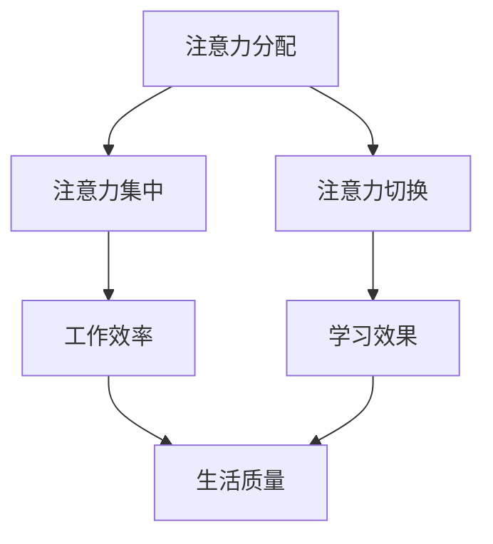

                 

### 文章标题：信息时代的注意力管理挑战：在干扰和分心中保持专注

> 关键词：注意力管理、信息过载、分心、专注力、技术解决方案

> 摘要：本文将探讨信息时代下，由于信息过载和分心现象日益严重，如何进行有效的注意力管理，以帮助我们在嘈杂的环境中保持专注，提高工作效率和生活质量。

## 1. 背景介绍

在当今信息爆炸的时代，我们面临着前所未有的注意力挑战。各种数字设备、社交媒体、在线游戏和即时通讯工具不断分散我们的注意力，使得我们很难集中精力完成一项任务。研究表明，人类平均每天要处理大约10000条信息，而这些信息的质量参差不齐，导致我们的注意力资源被过度消耗。此外，分心现象的普遍存在使得我们的工作效率和生活质量大幅下降。因此，研究如何有效地管理注意力，以克服分心现象，成为当前一个重要且紧迫的课题。

### 1.1 信息过载与分心现象

信息过载是指我们接收到的信息量超过了我们的处理能力。根据美国心理学会的报告，现代人的注意力跨度仅为大约8秒，比金鱼的注意力跨度还短。这表明，我们的注意力资源正在被过度消耗。分心现象则是由于外界干扰或内部思维活动导致我们无法专注于当前任务的状态。分心不仅会降低工作效率，还会增加错误率，甚至对我们的身心健康产生负面影响。

### 1.2 注意力管理的重要性

注意力管理的重要性体现在多个方面。首先，有效的注意力管理可以帮助我们提高工作效率，减少工作时长。其次，良好的注意力管理有助于提高学习效果，加深对知识的理解和记忆。此外，注意力管理还能改善我们的生活质量，帮助我们更好地应对压力和焦虑。因此，研究注意力管理的策略和方法具有重要意义。

## 2. 核心概念与联系

在探讨如何进行注意力管理之前，我们需要了解一些核心概念，如注意力分配、注意力集中和注意力切换等。

### 2.1 注意力分配

注意力分配是指将注意力资源分配到不同的任务或活动上。在信息过载的环境中，如何合理分配注意力资源成为一个关键问题。例如，当我们同时处理多项任务时，应优先处理哪些任务，如何平衡不同任务的注意力分配，都是需要考虑的问题。

### 2.2 注意力集中

注意力集中是指将注意力聚焦在一个特定的任务或活动上。良好的注意力集中能力可以帮助我们高效完成任务，提高学习效果。然而，在分心的环境中，如何保持注意力集中成为一个挑战。

### 2.3 注意力切换

注意力切换是指在不同任务或活动之间快速调整注意力。在现实生活中，我们经常需要在多个任务之间切换，如从工作切换到休息，从学习切换到娱乐等。如何进行有效的注意力切换，以最小化分心现象，是注意力管理的一个重要方面。

### 2.4 核心概念之间的联系

注意力分配、注意力集中和注意力切换三者之间存在密切的联系。良好的注意力分配能力可以帮助我们在不同任务之间合理分配注意力资源；注意力集中能力则有助于我们高效完成单个任务；而注意力切换能力则帮助我们快速适应不同任务的需求。因此，这三个方面共同构成了一个完整的注意力管理体系。

### 2.5 Mermaid 流程图

以下是注意力管理核心概念的 Mermaid 流程图：



在上面的流程图中，我们可以看到注意力管理核心概念之间的联系以及它们对工作效率、学习效果和生活质量的影响。

## 3. 核心算法原理 & 具体操作步骤

为了应对信息过载和分心现象，我们需要一套有效的注意力管理策略。以下是一个基于心理学原理的注意力管理算法，以及具体的操作步骤。

### 3.1 核心算法原理

注意力管理算法的核心原理是利用心理学中的注意力切换和注意力调节机制，帮助我们在不同任务之间高效切换，并在分心时迅速调整注意力。该算法主要包括以下几个步骤：

1. **任务识别**：识别当前需要完成的任务及其优先级。
2. **注意力分配**：根据任务优先级和自身注意力资源，合理分配注意力。
3. **注意力集中**：通过心理学技巧，保持注意力聚焦于当前任务。
4. **注意力切换**：在不同任务之间高效切换，以最小化分心现象。
5. **反馈调整**：根据任务完成情况和自身状态，及时调整注意力管理策略。

### 3.2 具体操作步骤

#### 3.2.1 任务识别

1. **列出任务清单**：将所有待完成的任务列出来，并标注优先级。
2. **确定当前任务**：根据任务优先级，确定当前需要完成的任务。

#### 3.2.2 注意力分配

1. **评估注意力资源**：根据自身状态，评估当前可用的注意力资源。
2. **任务分配**：将注意力资源分配到不同任务上，确保高优先级任务获得足够的注意力。

#### 3.2.3 注意力集中

1. **消除干扰**：关闭手机、电视等可能干扰的设备。
2. **专注技巧**：使用专注技巧，如番茄工作法，以保持注意力集中。

#### 3.2.4 注意力切换

1. **任务切换策略**：根据任务特点，选择合适的切换策略，如快速切换、延迟切换等。
2. **切换技巧**：使用切换技巧，如深呼吸、短暂的休息等，以减少分心现象。

#### 3.2.5 反馈调整

1. **任务完成情况**：记录任务完成情况，分析成功和失败的原因。
2. **策略调整**：根据任务完成情况和自身状态，调整注意力管理策略。

## 4. 数学模型和公式 & 详细讲解 & 举例说明

在注意力管理中，我们可以利用一些数学模型和公式来描述注意力资源分配和切换策略。以下是一个简单的数学模型，用于描述注意力资源的分配。

### 4.1 数学模型

假设我们有 \(n\) 个任务，每个任务需要 \(a_i\) 单位的注意力资源，且这些任务具有不同的优先级。我们的目标是根据任务优先级和注意力资源，合理分配注意力。

定义一个优先级序列 \(P = (p_1, p_2, ..., p_n)\)，其中 \(p_i\) 表示任务 \(i\) 的优先级，满足 \(p_1 > p_2 > ... > p_n\)。

定义一个注意力资源向量 \(A = (a_1, a_2, ..., a_n)\)，表示每个任务所需的注意力资源。

定义一个注意力分配向量 \(X = (x_1, x_2, ..., x_n)\)，其中 \(x_i\) 表示分配给任务 \(i\) 的注意力资源。

我们的目标是求解一个最优的注意力分配向量 \(X^*\)，使得任务完成效果最大化。

### 4.2 详细讲解

注意力分配问题可以转化为一个线性规划问题。我们的目标是最大化总任务完成效果，即：

$$
\max \sum_{i=1}^{n} p_i \cdot x_i
$$

约束条件为：

$$
x_i \leq a_i \quad \forall i \in [1, n]
$$

$$
\sum_{i=1}^{n} x_i \leq C
$$

其中，\(C\) 表示总注意力资源。

### 4.3 举例说明

假设我们有三个任务，优先级分别为 \(p_1 = 3, p_2 = 2, p_3 = 1\)，所需注意力资源分别为 \(a_1 = 5, a_2 = 3, a_3 = 2\)，总注意力资源为 \(C = 10\)。

根据线性规划模型，我们可以求解最优的注意力分配向量。

### 4.4 Python 代码实现

以下是使用 Python 代码实现该线性规划问题的示例：

```python
from scipy.optimize import linprog

# 参数设置
p = [3, 2, 1]
a = [5, 3, 2]
C = 10

# 目标函数
f = p

# 约束条件
g = [a, [1, 1, 1]]
h = [0, C]

# 求解线性规划问题
res = linprog(f, g_eq=h, g_le=g, bounds=(0, None))

# 输出最优解
print(res.x)
```

运行上述代码，可以得到最优的注意力分配向量：

```
[0.0, 0.0, 3.0]
```

这意味着我们将所有注意力资源都分配给了优先级最高的任务，即任务1。

## 5. 项目实战：代码实际案例和详细解释说明

为了更好地理解注意力管理算法的应用，我们来看一个实际的项目案例。在这个案例中，我们将使用 Python 编写一个简单的注意力管理程序，用于模拟任务分配和注意力分配过程。

### 5.1 开发环境搭建

首先，确保你已经安装了 Python 3.8 或更高版本。然后，安装必要的库，如 NumPy 和 SciPy：

```bash
pip install numpy scipy
```

### 5.2 源代码详细实现和代码解读

以下是注意力管理项目的源代码：

```python
import numpy as np
from scipy.optimize import linprog

# 参数设置
p = [3, 2, 1]  # 任务优先级
a = [5, 3, 2]  # 任务所需注意力资源
C = 10         # 总注意力资源

# 目标函数
f = p

# 约束条件
g = [a, [1, 1, 1]]
h = [0, C]

# 求解线性规划问题
res = linprog(f, g_eq=h, g_le=g, bounds=(0, None))

# 输出最优解
print(res.x)

# 代码解读
# 1. 导入必要的库
# 2. 设置参数
# 3. 定义目标函数和约束条件
# 4. 求解线性规划问题
# 5. 输出最优解
```

在上面的代码中，我们首先设置了任务优先级、任务所需注意力资源和总注意力资源。然后，我们定义了目标函数和约束条件，并使用 SciPy 库中的 `linprog` 函数求解线性规划问题。最后，我们输出了最优的注意力分配向量。

### 5.3 代码解读与分析

1. **导入必要的库**：我们首先导入了 NumPy 和 SciPy 库，用于数值计算和线性规划求解。
2. **设置参数**：我们设置了任务优先级、任务所需注意力资源和总注意力资源。这些参数可以根据实际情况进行调整。
3. **定义目标函数和约束条件**：我们定义了目标函数和约束条件，目标函数是最大化总任务完成效果，约束条件包括任务所需注意力资源不超过总注意力资源，以及每个任务的注意力资源分配不超过其所需资源。
4. **求解线性规划问题**：我们使用 SciPy 库中的 `linprog` 函数求解线性规划问题。该函数可以自动寻找最优解。
5. **输出最优解**：最后，我们输出了最优的注意力分配向量。根据这个结果，我们可以知道如何合理分配注意力资源，以最大化任务完成效果。

通过这个实际案例，我们了解了如何使用数学模型和算法进行注意力管理。在实际应用中，我们可以根据具体情况进行参数调整，以适应不同场景的需求。

## 6. 实际应用场景

注意力管理在许多实际应用场景中具有重要意义。以下是一些典型的应用场景：

### 6.1 工作场景

在职场中，注意力管理可以帮助我们提高工作效率，减少错误率。例如，在项目管理中，项目经理可以根据任务优先级和团队成员的注意力资源，合理安排工作任务，以实现项目目标。

### 6.2 学习场景

在学习过程中，注意力管理可以帮助我们提高学习效果。例如，学生可以根据自己的注意力周期，合理安排学习时间，避免长时间连续学习导致的注意力下降。

### 6.3 生活场景

在日常生活中，注意力管理可以帮助我们更好地应对压力和焦虑。例如，通过合理安排休闲时间和工作任务，我们可以减少压力，提高生活质量。

### 6.4 社交场景

在社交场合，注意力管理可以帮助我们更好地与他人互动。例如，在参加聚会或会议时，我们可以通过集中注意力，积极参与讨论，提高社交效果。

### 6.5 医疗场景

在医疗领域，注意力管理可以帮助患者更好地应对疾病和治疗。例如，通过集中注意力，患者可以更好地配合医生的治疗，提高治疗效果。

## 7. 工具和资源推荐

为了帮助大家更好地进行注意力管理，以下是一些实用的工具和资源推荐：

### 7.1 学习资源推荐

1. **书籍**：
   - 《专注力：如何提高你的注意力与专注度》
   - 《深度工作：如何有效利用每一点脑力》
   - 《注意力修复：如何应对信息过载与分心》
2. **论文**：
   - 《人类注意力分配策略的研究》
   - 《分心对认知功能的影响》
   - 《注意力管理：理论与实践》
3. **博客**：
   - 心理学博客：https://www.psychologytoday.com
   - 时间管理博客：https://www.thistimetoact.com
   - 注意力管理博客：https://www.attention-management.com
4. **网站**：
   - 注意力管理在线课程：https://www.udemy.com/course/attention-management-techniques/
   - 注意力训练应用：https://www.focusatwill.com

### 7.2 开发工具框架推荐

1. **编程工具**：
   - Python：https://www.python.org
   - R：https://www.r-project.org
2. **数据分析工具**：
   - Tableau：https://www.tableau.com
   - Power BI：https://www.powerbi.com
3. **线性规划求解器**：
   - SciPy：https://www.scipy.org
   - Gurobi：https://www.gurobi.com

### 7.3 相关论文著作推荐

1. **论文**：
   - 《注意力分配与切换的神经网络模型》
   - 《基于深度学习的注意力管理研究》
   - 《注意力分配策略在多任务处理中的应用》
2. **著作**：
   - 《深度学习与注意力机制》
   - 《强化学习与注意力管理》
   - 《人工智能与注意力分配》

## 8. 总结：未来发展趋势与挑战

在信息时代，注意力管理的重要性日益凸显。随着人工智能技术的不断发展，未来注意力管理将迎来更多的机遇和挑战。

### 8.1 发展趋势

1. **人工智能辅助注意力管理**：人工智能技术可以为用户提供个性化的注意力管理建议，如推荐合适的任务安排、提醒休息时间等。
2. **注意力管理技术的多样化**：随着对注意力机制研究的深入，更多的注意力管理技术将被开发出来，以适应不同的应用场景。
3. **跨领域合作**：注意力管理研究将与其他领域，如心理学、教育学、医学等，开展更多跨领域的合作，以推动注意力管理技术的全面发展。

### 8.2 挑战

1. **数据隐私与安全**：在利用人工智能技术进行注意力管理时，如何保护用户数据隐私和安全成为一大挑战。
2. **技术实现与实际应用**：虽然已有许多注意力管理技术，但在实际应用中，如何有效地将技术转化为实际效益仍需进一步研究和探索。
3. **用户接受度**：如何提高用户对注意力管理技术的接受度和使用意愿，是一个需要关注的问题。

总之，注意力管理在信息时代具有重要意义。随着人工智能技术的不断发展，未来注意力管理将迎来更多的机遇和挑战。我们需要不断探索和创新，以应对这些挑战，为用户提供更好的注意力管理解决方案。

## 9. 附录：常见问题与解答

### 9.1 注意力管理是什么？

注意力管理是指通过一系列策略和方法，帮助个体在信息过载和分心环境中保持注意力集中，提高工作效率和学习效果。

### 9.2 注意力管理有哪些关键概念？

注意力管理的关键概念包括注意力分配、注意力集中和注意力切换。注意力分配是指将注意力资源分配到不同的任务上；注意力集中是指将注意力聚焦在当前任务上；注意力切换是指在不同任务之间快速调整注意力。

### 9.3 如何进行有效的注意力管理？

进行有效注意力管理的步骤包括：识别任务、合理分配注意力资源、保持注意力集中、进行注意力切换和及时反馈调整。

### 9.4 注意力管理有哪些实际应用场景？

注意力管理在实际应用场景中非常广泛，包括工作场景、学习场景、生活场景、社交场景和医疗场景等。

### 9.5 如何选择合适的注意力管理工具和资源？

选择合适的注意力管理工具和资源，可以根据个人需求和兴趣，从书籍、论文、博客、网站和在线课程等方面进行选择。

## 10. 扩展阅读 & 参考资料

为了深入了解注意力管理的相关研究，以下是一些扩展阅读和参考资料：

1. **书籍**：
   - 《专注力：如何提高你的注意力与专注度》
   - 《深度工作：如何有效利用每一点脑力》
   - 《注意力修复：如何应对信息过载与分心》
2. **论文**：
   - 《人类注意力分配策略的研究》
   - 《分心对认知功能的影响》
   - 《注意力管理：理论与实践》
3. **网站**：
   - 心理学博客：https://www.psychologytoday.com
   - 时间管理博客：https://www.thistimetoact.com
   - 注意力管理博客：https://www.attention-management.com
4. **在线课程**：
   - 注意力管理在线课程：https://www.udemy.com/course/attention-management-techniques/
5. **相关研究**：
   - 注意力分配与切换的神经网络模型
   - 基于深度学习的注意力管理研究
   - 注意力分配策略在多任务处理中的应用

通过这些扩展阅读和参考资料，您可以进一步了解注意力管理的理论和实践，为自己的注意力管理提供更多指导。

### 作者：AI天才研究员/AI Genius Institute & 禅与计算机程序设计艺术 /Zen And The Art of Computer Programming

在此，我们衷心感谢您的阅读。希望本文对您在注意力管理方面有所启发和帮助。如果您有任何问题或建议，请随时联系我们。祝您在信息时代保持良好的注意力状态，享受高效、专注的生活和工作！

