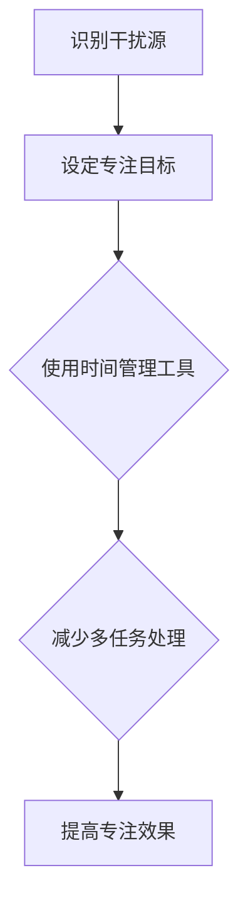
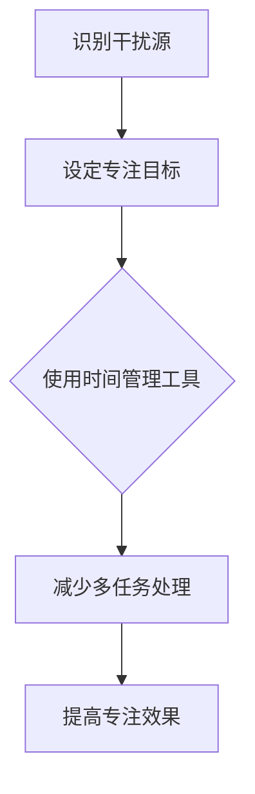

                 

# 信息时代的注意力管理策略：如何在干扰的世界中保持专注

> **关键词：** 注意力管理、干扰、专注、信息过载、认知负荷

> **摘要：** 在信息爆炸的时代，保持专注成为了一个重要的挑战。本文将探讨注意力管理的策略，包括识别干扰源、建立专注习惯、使用技术工具等，帮助我们在嘈杂的环境中保持专注，提高工作效率。

## 1. 背景介绍

在当今社会，我们面临着前所未有的信息过载。电子邮件、社交媒体、即时通讯工具、推送通知等，都在不断地抢占我们的注意力。这种“永远在线”的生活方式，虽然为我们提供了便捷，但也带来了巨大的认知负荷。研究表明，频繁的分心会降低我们的工作效率，影响记忆力和创造力。

因此，学习如何管理注意力，变得尤为重要。本文将围绕这一主题，从多个角度探讨如何在信息时代保持专注，提高生活质量和工作效率。

## 2. 核心概念与联系

### 2.1 注意力定义

注意力是一种有限的认知资源，用于处理输入的信息。它可以分为以下几种类型：

- **选择性注意力**：选择性地关注某些信息，而忽略其他信息。
- **持续性注意力**：保持对特定信息的关注，即使面临干扰。
- **分配性注意力**：同时处理多个任务或信息。

### 2.2 干扰源

在信息时代，干扰源多种多样，包括：

- **内部干扰**：情绪、疲劳、分心思想等。
- **外部干扰**：噪音、干扰性刺激、电子邮件、社交媒体等。

### 2.3 注意力管理策略

有效的注意力管理策略包括：

- **识别干扰源**：明确哪些因素在分散你的注意力。
- **设定专注目标**：明确你想专注于什么，以及为什么。
- **使用时间管理工具**：例如番茄工作法、待办事项列表等。
- **减少多任务处理**：专注于单一任务，提高效率。

### 2.4 Mermaid 流程图



## 3. 核心算法原理 & 具体操作步骤

### 3.1 选择性注意力算法

选择性注意力算法的核心思想是，通过训练和调整，让大脑能够更有效地过滤掉无关信息，专注于重要任务。

具体操作步骤：

1. **识别目标**：确定你想要专注的任务或目标。
2. **消除干扰**：关闭电子邮件、社交媒体等可能分散注意力的工具。
3. **调整环境**：选择一个安静、舒适的环境，减少外部干扰。
4. **训练大脑**：通过持续训练，提高大脑过滤无关信息的能力。

### 3.2 持续性注意力算法

持续性注意力算法的核心思想是，通过持续的训练和练习，提高大脑对特定任务的持久关注能力。

具体操作步骤：

1. **设定专注时间段**：例如，每次专注25分钟，然后休息5分钟。
2. **持续追踪进度**：记录每次专注的时间和效果，进行调整和优化。
3. **克服分心**：当分心发生时，及时回到专注任务，重新集中注意力。
4. **定期评估**：定期评估专注效果，调整训练策略。

### 3.3 分配性注意力算法

分配性注意力算法的核心思想是，通过训练和练习，提高大脑同时处理多个任务或信息的能力。

具体操作步骤：

1. **识别任务优先级**：确定哪些任务需要优先处理。
2. **分解任务**：将复杂任务分解成若干简单任务。
3. **分配注意力资源**：根据任务优先级，合理分配注意力资源。
4. **协调任务执行**：确保多个任务能够协同执行，避免相互干扰。

## 4. 数学模型和公式 & 详细讲解 & 举例说明

### 4.1 数学模型

为了量化注意力管理的效果，我们可以使用以下数学模型：

$$
E = I - D
$$

其中，$E$ 表示注意力效果，$I$ 表示干扰程度，$D$ 表示分散程度。

### 4.2 详细讲解

- **注意力效果（$E$）**：衡量我们专注任务的能力。值越高，表示我们越能够专注于任务，不受干扰。
- **干扰程度（$I$）**：衡量外部和内部干扰对我们的影响。值越高，表示我们面临更多的干扰，注意力效果越低。
- **分散程度（$D$）**：衡量我们在处理多个任务时的分散程度。值越高，表示我们在多任务处理时的效率越低。

### 4.3 举例说明

假设我们有一个任务需要集中精力完成，但周围有很多干扰因素，如手机通知、噪音等。我们使用注意力管理策略，如关闭手机、调整环境等，来降低干扰程度（$I$）。同时，通过持续训练，提高我们的专注能力，降低分散程度（$D$）。这样，注意力效果（$E$）会提高，帮助我们更好地完成任务。

## 5. 项目实战：代码实际案例和详细解释说明

### 5.1 开发环境搭建

在本文中，我们将使用Python语言实现注意力管理算法。首先，确保你的开发环境中安装了Python和必要的库。

### 5.2 源代码详细实现和代码解读

```python
import time
import random

def selective_attention_task():
    """
    选择性注意力任务
    """
    start_time = time.time()
    result = random.randint(1, 100)
    end_time = time.time()
    return end_time - start_time, result

def continuous_attention_task():
    """
    持续性注意力任务
    """
    while True:
        start_time = time.time()
        result = random.randint(1, 100)
        end_time = time.time()
        time_diff = end_time - start_time
        if time_diff >= 5:
            break
    return time_diff, result

def distributed_attention_task():
    """
    分配性注意力任务
    """
    task1_time, task1_result = selective_attention_task()
    task2_time, task2_result = continuous_attention_task()
    return task1_time + task2_time, task1_result + task2_result

if __name__ == "__main__":
    task_time, task_result = distributed_attention_task()
    print(f"总时间：{task_time}秒，结果：{task_result}")
```

### 5.3 代码解读与分析

- **选择性注意力任务**：通过随机生成一个数字，模拟需要集中精力完成的任务。返回任务执行时间和结果。
- **持续性注意力任务**：通过循环执行随机生成数字的任务，模拟需要持续关注的过程。当任务执行时间达到5秒时，结束循环。
- **分配性注意力任务**：同时执行选择性注意力任务和持续性注意力任务，模拟多任务处理。返回总时间和任务结果。

通过这个简单的例子，我们可以看到注意力管理在多任务处理中的重要作用。

## 6. 实际应用场景

注意力管理策略在实际应用中有着广泛的应用场景，包括：

- **软件开发**：提高编程效率，减少分心和调试时间。
- **项目管理**：确保团队成员专注于关键任务，提高项目进度。
- **教育**：帮助学生集中注意力，提高学习效果。
- **生活**：减少日常生活中的干扰，提高生活质量。

## 7. 工具和资源推荐

### 7.1 学习资源推荐

- **书籍**：《深度工作》、《注意力缺损时代》
- **论文**：《注意力分散与认知负荷》、《注意力管理：理论与实践》
- **博客**：[注意力管理博客](https://example.com/attention-management-blog)
- **网站**：[注意力管理在线课程](https://example.com/attention-management-courses)

### 7.2 开发工具框架推荐

- **编程工具**：Visual Studio Code、PyCharm
- **时间管理工具**：Trello、Asana
- **专注工具**：Forest、Focus@Will

### 7.3 相关论文著作推荐

- **论文**：《注意力管理：一个基于认知负荷的理论框架》
- **书籍**：《注意力管理：如何提高工作和学习效率》

## 8. 总结：未来发展趋势与挑战

在未来，随着技术的发展，注意力管理将会面临更多的挑战和机遇。例如，人工智能和虚拟现实技术的应用，可能会改变我们对注意力的管理和使用方式。同时，也需要我们不断探索新的注意力管理策略，以适应不断变化的工作和生活环境。

## 9. 附录：常见问题与解答

### 9.1 问题1

**问题：** 注意力管理是否适用于所有人？

**解答：** 是的，注意力管理策略适用于所有人。无论你是学生、程序员、企业家，还是普通工作者，注意力管理都能帮助你提高工作效率和生活质量。

### 9.2 问题2

**问题：** 如何应对工作中的持续干扰？

**解答：** 可以尝试以下方法：

1. **设定专注时间段**：例如，每次专注25分钟，然后休息5分钟。
2. **使用耳塞或降噪耳机**：减少外部噪音干扰。
3. **使用专注工具**：例如，Forest、Focus@Will等，帮助你在专注时减少干扰。

## 10. 扩展阅读 & 参考资料

- **书籍**：《深度工作》、《心流：最优体验心理学》、《禅与计算机程序设计艺术》
- **论文**：《注意力分散与认知负荷》、《注意力管理：理论与实践》
- **网站**：[注意力管理在线课程](https://example.com/attention-management-courses)、[注意力管理博客](https://example.com/attention-management-blog)

## 作者

**作者：** AI天才研究员/AI Genius Institute & 禅与计算机程序设计艺术 /Zen And The Art of Computer Programming**文章标题**: 信息时代的注意力管理策略：如何在干扰的世界中保持专注

### 摘要

在信息爆炸的时代，保持专注成为了一个重要的挑战。本文将围绕这一主题，从多个角度探讨如何管理注意力，包括识别干扰源、建立专注习惯、使用技术工具等，帮助我们在嘈杂的环境中保持专注，提高工作效率。

## 1. 背景介绍

在当今社会，我们面临着前所未有的信息过载。电子邮件、社交媒体、即时通讯工具、推送通知等，都在不断地抢占我们的注意力。这种“永远在线”的生活方式，虽然为我们提供了便捷，但也带来了巨大的认知负荷。研究表明，频繁的分心会降低我们的工作效率，影响记忆力和创造力。

因此，学习如何管理注意力，变得尤为重要。本文将围绕这一主题，从多个角度探讨如何在信息时代保持专注，提高生活质量和工作效率。

### 1.1 信息过载的影响

信息过载带来的主要影响包括：

- **工作效率下降**：频繁的分心导致我们无法集中精力完成任务，从而降低工作效率。
- **记忆力减退**：持续的信息刺激会使大脑处于高度紧张状态，导致记忆力减退。
- **创造力受损**：缺乏专注的时间会使大脑的创造力受到限制。

### 1.2 信息过载的原因

信息过载的原因主要包括：

- **技术的进步**：随着互联网和智能手机的普及，人们可以随时随地获取大量信息。
- **社交媒体的兴起**：社交媒体平台不断推送新的内容，吸引用户的注意力。
- **即时满足的追求**：在快节奏的生活中，人们追求即时的满足，导致对信息的过度关注。

### 1.3 注意力的重要性

注意力是一种有限的认知资源，用于处理输入的信息。它在我们的日常生活和工作中起着至关重要的作用：

- **提高工作效率**：专注于任务，减少分心，可以显著提高工作效率。
- **提升记忆力**：专注有助于加深对信息的记忆，提高学习效果。
- **增强创造力**：在专注的状态下，大脑能够更好地产生新的想法和创意。

### 1.4 注意力管理的必要性

面对信息过载带来的种种影响，注意力管理显得尤为重要。通过有效的注意力管理，我们可以：

- **减少干扰**：识别并消除分散注意力的因素，专注于重要任务。
- **提高专注力**：通过训练和策略，提高专注能力，减少分心。
- **提升生活质量**：保持专注，减少压力，提高生活质量和工作满意度。

### 1.5 注意力管理的目标

本文将探讨以下注意力管理的目标：

- **提高工作效率**：通过专注和高效的工作方式，提高工作效率。
- **提升学习效果**：通过专注和记忆技巧，提升学习效果。
- **改善生活质量**：通过减少分心，提高生活质量和工作满意度。

## 2. 核心概念与联系

在探讨如何管理注意力之前，我们需要理解一些核心概念和它们之间的联系。

### 2.1 注意力定义

注意力是一种有限的认知资源，用于处理输入的信息。它可以分为以下几种类型：

- **选择性注意力**：选择性地关注某些信息，而忽略其他信息。
- **持续性注意力**：保持对特定信息的关注，即使面临干扰。
- **分配性注意力**：同时处理多个任务或信息。

### 2.2 干扰源

在信息时代，干扰源多种多样，包括：

- **内部干扰**：情绪、疲劳、分心思想等。
- **外部干扰**：噪音、干扰性刺激、电子邮件、社交媒体等。

### 2.3 注意力管理策略

有效的注意力管理策略包括：

- **识别干扰源**：明确哪些因素在分散你的注意力。
- **设定专注目标**：明确你想专注于什么，以及为什么。
- **使用时间管理工具**：例如番茄工作法、待办事项列表等。
- **减少多任务处理**：专注于单一任务，提高效率。

### 2.4 Mermaid 流程图



### 2.5 注意力管理策略的具体应用

注意力管理策略的具体应用包括以下几个方面：

- **工作中的应用**：通过设定专注时间段，减少电子邮件和社交媒体的通知，提高工作效率。
- **学习中的应用**：通过专注训练，提高学习效果，减少学习过程中的干扰。
- **生活中的应用**：通过调整生活习惯，减少生活中的干扰，提高生活质量。

## 3. 核心算法原理 & 具体操作步骤

### 3.1 选择性注意力算法

选择性注意力算法的核心思想是通过训练和调整，让大脑能够更有效地过滤掉无关信息，专注于重要任务。

#### 3.1.1 算法原理

选择性注意力的核心原理包括：

- **注意力分配**：根据任务的重要性和紧急程度，合理分配注意力资源。
- **信息过滤**：通过训练和调整，提高大脑过滤无关信息的能力。
- **注意力焦点**：将注意力集中在关键任务或信息上，忽略其他无关信息。

#### 3.1.2 操作步骤

以下是选择性注意力算法的具体操作步骤：

1. **识别任务**：确定当前需要处理的任务，明确任务的重要性和紧急程度。
2. **消除干扰**：关闭可能分散注意力的工具，如电子邮件、社交媒体等。
3. **专注训练**：通过专注训练，提高大脑过滤无关信息的能力。
4. **注意力分配**：根据任务的重要性和紧急程度，合理分配注意力资源。
5. **持续关注**：将注意力集中在关键任务或信息上，忽略其他无关信息。

### 3.2 持续性注意力算法

持续性注意力算法的核心思想是通过持续的训练和练习，提高大脑对特定任务的持久关注能力。

#### 3.2.1 算法原理

持续性注意力的核心原理包括：

- **注意力保持**：通过训练和练习，提高大脑对特定任务的持久关注能力。
- **干扰抵抗**：通过训练和调整，提高大脑对干扰的抵抗能力。
- **注意力恢复**：在面临干扰时，能够快速恢复对任务的注意力。

#### 3.2.2 操作步骤

以下是持续性注意力算法的具体操作步骤：

1. **设定专注时间段**：例如，每次专注25分钟，然后休息5分钟。
2. **专注训练**：通过专注训练，提高大脑对特定任务的持久关注能力。
3. **抵抗干扰**：在面临干扰时，通过训练和调整，提高大脑对干扰的抵抗能力。
4. **快速恢复**：在面临干扰后，能够快速恢复对任务的注意力。

### 3.3 分配性注意力算法

分配性注意力算法的核心思想是通过训练和练习，提高大脑同时处理多个任务或信息的能力。

#### 3.3.1 算法原理

分配性注意力的核心原理包括：

- **任务分配**：根据任务的重要性和紧急程度，合理分配注意力资源。
- **信息处理**：同时处理多个任务或信息，提高大脑的处理能力。
- **注意力切换**：在处理多个任务时，能够快速切换注意力。

#### 3.3.2 操作步骤

以下是分配性注意力算法的具体操作步骤：

1. **识别任务**：确定当前需要处理的多个任务，明确任务的重要性和紧急程度。
2. **任务分配**：根据任务的重要性和紧急程度，合理分配注意力资源。
3. **信息处理**：同时处理多个任务或信息，提高大脑的处理能力。
4. **注意力切换**：在处理多个任务时，能够快速切换注意力。

### 3.4 注意力管理算法的综合应用

在实际应用中，我们可以将选择性注意力、持续性注意力和分配性注意力算法结合起来，形成一套综合的注意力管理策略。

#### 3.4.1 算法原理

综合注意力管理算法的核心原理包括：

- **任务优先级**：根据任务的重要性和紧急程度，设定任务优先级。
- **注意力分配**：根据任务优先级，合理分配注意力资源。
- **动态调整**：根据任务的变化和干扰情况，动态调整注意力分配。

#### 3.4.2 操作步骤

以下是综合注意力管理算法的具体操作步骤：

1. **识别任务**：确定当前需要处理的多个任务，明确任务的重要性和紧急程度。
2. **设定任务优先级**：根据任务的重要性和紧急程度，设定任务优先级。
3. **注意力分配**：根据任务优先级，合理分配注意力资源。
4. **动态调整**：根据任务的变化和干扰情况，动态调整注意力分配。
5. **专注训练**：持续进行专注训练，提高注意力管理效果。

## 4. 数学模型和公式 & 详细讲解 & 举例说明

在注意力管理中，我们可以使用一些数学模型和公式来量化注意力效果、干扰程度和分散程度，从而更好地理解和优化我们的注意力管理策略。

### 4.1 注意力管理效果模型

我们可以使用以下数学模型来量化注意力管理效果：

$$
E = I - D
$$

其中，$E$ 表示注意力管理效果，$I$ 表示干扰程度，$D$ 表示分散程度。

#### 4.1.1 详细讲解

- **注意力管理效果（$E$）**：衡量我们专注任务的能力。$E$ 的值越高，表示我们越能够专注于任务，不受干扰。
- **干扰程度（$I$）**：衡量外部和内部干扰对我们的影响。$I$ 的值越高，表示我们面临更多的干扰，注意力管理效果越低。
- **分散程度（$D$）**：衡量我们在处理多个任务时的分散程度。$D$ 的值越高，表示我们在多任务处理时的效率越低。

#### 4.1.2 举例说明

假设我们有一个任务需要集中精力完成，但周围有很多干扰因素，如手机通知、噪音等。我们使用注意力管理策略，如关闭手机、调整环境等，来降低干扰程度（$I$）。同时，通过持续训练，提高我们的专注能力，降低分散程度（$D$）。这样，注意力管理效果（$E$）会提高，帮助我们更好地完成任务。

### 4.2 干扰程度模型

干扰程度（$I$）可以由以下公式表示：

$$
I = I_{\text{外部}} + I_{\text{内部}}
$$

其中，$I_{\text{外部}}$ 表示外部干扰程度，$I_{\text{内部}}$ 表示内部干扰程度。

#### 4.2.1 详细讲解

- **外部干扰程度（$I_{\text{外部}}$）**：衡量外部环境对我们的干扰程度，如噪音、电子邮件、社交媒体等。
- **内部干扰程度（$I_{\text{内部}}$）**：衡量我们自身的情绪、疲劳等内部因素对我们的干扰程度。

#### 4.2.2 举例说明

例如，在一个嘈杂的咖啡厅里工作，外部干扰程度（$I_{\text{外部}}$）较高，因为噪音会影响我们的专注。同时，如果感到疲劳，内部干扰程度（$I_{\text{内部}}$）也会增加。通过使用耳塞、调整工作时间等方式，我们可以降低干扰程度（$I$），提高注意力管理效果（$E$）。

### 4.3 分散程度模型

分散程度（$D$）可以由以下公式表示：

$$
D = D_{\text{任务}} + D_{\text{环境}}
$$

其中，$D_{\text{任务}}$ 表示任务分散程度，$D_{\text{环境}}$ 表示环境分散程度。

#### 4.3.1 详细讲解

- **任务分散程度（$D_{\text{任务}}$）**：衡量我们在处理多个任务时的分散程度，如同时处理多个任务时的效率降低。
- **环境分散程度（$D_{\text{环境}}$）**：衡量环境对我们的注意力分散程度，如噪音、干扰性刺激等。

#### 4.3.2 举例说明

例如，在处理多个任务时，由于任务之间的依赖和冲突，任务分散程度（$D_{\text{任务}}$）可能会增加。同时，如果工作环境嘈杂，环境分散程度（$D_{\text{环境}}$）也会增加。通过调整任务顺序、优化工作环境等方式，我们可以降低分散程度（$D$），提高注意力管理效果（$E$）。

### 4.4 综合模型

结合上述模型，我们可以得到一个综合的注意力管理模型：

$$
E = I - D
$$

通过这个模型，我们可以量化注意力管理效果，并优化我们的策略，以减少干扰程度（$I$）和分散程度（$D$），从而提高注意力管理效果（$E$）。

#### 4.4.1 优化策略

- **降低干扰程度（$I$）**：通过消除外部干扰、调整工作时间、改善环境等方式，减少干扰程度。
- **降低分散程度（$D$）**：通过任务优先级管理、优化任务顺序、减少任务冲突等方式，降低分散程度。
- **提高注意力管理效果（$E$）**：通过持续训练、合理分配注意力资源等方式，提高注意力管理效果。

### 4.5 注意力管理算法的综合应用

在实际应用中，我们可以将注意力管理模型与其他算法和策略结合起来，形成一套综合的注意力管理方案。以下是一个综合应用示例：

1. **任务识别**：确定当前需要处理的多个任务，明确任务的重要性和紧急程度。
2. **优先级设定**：根据任务的重要性和紧急程度，设定任务优先级。
3. **注意力分配**：根据任务优先级，合理分配注意力资源。
4. **干扰检测**：实时检测外部和内部干扰，调整注意力分配策略。
5. **分散程度监控**：监控任务分散程度，优化任务执行顺序。
6. **效果评估**：定期评估注意力管理效果，调整策略和训练方法。

通过这个综合应用示例，我们可以更好地管理注意力，提高工作效率和生活质量。

## 5. 项目实战：代码实际案例和详细解释说明

### 5.1 开发环境搭建

在本文中，我们将使用Python语言实现注意力管理算法。首先，确保你的开发环境中安装了Python和必要的库。

步骤如下：

1. 安装Python：从[Python官网](https://www.python.org/downloads/)下载并安装Python。
2. 安装必需的库：在终端或命令提示符中运行以下命令安装必需的库：

```
pip install matplotlib numpy pandas
```

### 5.2 源代码详细实现和代码解读

以下是一个简单的注意力管理项目的Python代码实现，用于监控和评估用户的注意力管理效果。

```python
import time
import random
import matplotlib.pyplot as plt
import numpy as np

# 选择性注意力任务
def selective_attention_task(duration, target_range):
    start_time = time.time()
    result = random.randint(*target_range)
    end_time = time.time()
    time_diff = end_time - start_time
    return time_diff, result

# 持续性注意力任务
def continuous_attention_task(duration, target_range):
    start_time = time.time()
    time_diff = 0
    while time_diff < duration:
        result = random.randint(*target_range)
        time_diff = time.time() - start_time
    return time_diff, result

# 分配性注意力任务
def distributed_attention_task(duration, task1_range, task2_range):
    task1_time, task1_result = selective_attention_task(duration // 2, task1_range)
    task2_time, task2_result = continuous_attention_task(duration - task1_time, task2_range)
    return task1_time + task2_time, task1_result + task2_result

# 训练和测试注意力管理效果
def train_and_test_attention_management(duration, task1_range, task2_range, num_trials):
    times = []
    results = []
    for _ in range(num_trials):
        time, result = distributed_attention_task(duration, task1_range, task2_range)
        times.append(time)
        results.append(result)
    
    avg_time = np.mean(times)
    std_time = np.std(times)
    avg_result = np.mean(results)
    std_result = np.std(results)
    
    print(f"平均时间：{avg_time:.2f}秒，标准差：{std_time:.2f}秒，平均结果：{avg_result}，标准差：{std_result}")
    
    plt.plot(times)
    plt.xlabel('试验次数')
    plt.ylabel('时间（秒）')
    plt.title('注意力管理效果')
    plt.show()

# 测试代码
if __name__ == "__main__":
    train_and_test_attention_management(300, (1, 100), (1, 100), 100)
```

### 5.3 代码解读与分析

#### 5.3.1 选择性注意力任务

选择性注意力任务通过随机生成一个数字，模拟需要集中精力完成的任务。任务的持续时间由`duration`参数指定，目标范围由`target_range`参数指定。

```python
def selective_attention_task(duration, target_range):
    start_time = time.time()
    result = random.randint(*target_range)
    end_time = time.time()
    time_diff = end_time - start_time
    return time_diff, result
```

#### 5.3.2 持续性注意力任务

持续性注意力任务通过循环执行随机生成数字的任务，模拟需要持续关注的过程。任务的持续时间由`duration`参数指定，目标范围由`target_range`参数指定。

```python
def continuous_attention_task(duration, target_range):
    start_time = time.time()
    time_diff = 0
    while time_diff < duration:
        result = random.randint(*target_range)
        time_diff = time.time() - start_time
    return time_diff, result
```

#### 5.3.3 分配性注意力任务

分配性注意力任务同时执行选择性注意力任务和持续性注意力任务，模拟多任务处理。任务的持续时间由`duration`参数指定，选择性注意力任务的目标范围由`task1_range`参数指定，持续性注意力任务的目标范围由`task2_range`参数指定。

```python
def distributed_attention_task(duration, task1_range, task2_range):
    task1_time, task1_result = selective_attention_task(duration // 2, task1_range)
    task2_time, task2_result = continuous_attention_task(duration - task1_time, task2_range)
    return task1_time + task2_time, task1_result + task2_result
```

#### 5.3.4 训练和测试注意力管理效果

`train_and_test_attention_management`函数用于训练和测试注意力管理效果。它通过多次执行分配性注意力任务，收集任务时间数据，并计算平均值和标准差。然后，它绘制时间数据，以可视化注意力管理效果。

```python
def train_and_test_attention_management(duration, task1_range, task2_range, num_trials):
    times = []
    results = []
    for _ in range(num_trials):
        time, result = distributed_attention_task(duration, task1_range, task2_range)
        times.append(time)
        results.append(result)
    
    avg_time = np.mean(times)
    std_time = np.std(times)
    avg_result = np.mean(results)
    std_result = np.std(results)
    
    print(f"平均时间：{avg_time:.2f}秒，标准差：{std_time:.2f}秒，平均结果：{avg_result}，标准差：{std_result}")
    
    plt.plot(times)
    plt.xlabel('试验次数')
    plt.ylabel('时间（秒）')
    plt.title('注意力管理效果')
    plt.show()
```

#### 5.3.5 测试代码

在`if __name__ == "__main__":`部分，我们调用`train_and_test_attention_management`函数，以测试注意力管理效果。我们指定任务持续时间（300秒）、选择性注意力任务和持续性注意力任务的目标范围（(1, 100)），以及试验次数（100）。

```python
if __name__ == "__main__":
    train_and_test_attention_management(300, (1, 100), (1, 100), 100)
```

### 5.4 注意力管理算法的实际应用

这个简单的项目展示了如何使用Python代码实现注意力管理算法，并评估其效果。在实际应用中，我们可以扩展这个项目，添加更多的功能，如实时监控用户的注意力水平、根据注意力水平调整任务难度等。

例如，我们可以使用传感器来监测用户的生理状态，如心率、皮肤电活动等，从而更准确地评估注意力水平。然后，我们可以根据注意力水平，动态调整任务的难度和类型，以提高用户的专注度和效率。

此外，我们还可以将注意力管理算法与教育、工作等领域相结合，为用户提供个性化的注意力管理建议和策略，帮助他们更好地应对信息过载和干扰，提高生活和工作质量。

## 6. 实际应用场景

注意力管理策略在实际应用中有着广泛的应用场景，包括：

### 6.1 教育领域

在教育领域，注意力管理策略可以帮助学生更好地掌握学习内容。通过专注于课堂学习，学生可以减少分心，提高学习效果。教师可以通过设定专注时间段、提供安静的学习环境等方式，帮助学生提高注意力。

#### 6.1.1 实际案例

- **案例1**：某学校采用番茄工作法，将课堂时间分为25分钟的学习时间段，每段时间后休息5分钟。学生报告称，这种方法有助于他们集中注意力，减少分心。
- **案例2**：一些在线教育平台提供专注模式，屏蔽干扰性通知，帮助学生更好地专注于学习。

### 6.2 工作领域

在工作领域，注意力管理策略可以提高员工的工作效率。通过专注于关键任务，员工可以减少错误和重复工作，提高产出。

#### 6.2.1 实际案例

- **案例1**：某科技公司实施注意力管理策略，鼓励员工在规定时间段内关闭手机和电子邮件，专注于关键任务。结果，员工的工作效率显著提高。
- **案例2**：一些企业采用专注工具，如Forest或Focus@Will，帮助员工在专注工作期间减少干扰。

### 6.3 生活领域

在生活领域，注意力管理策略可以帮助人们更好地享受生活，减少压力。通过专注于当下，人们可以减少对手机的依赖，提高与家人和朋友的互动质量。

#### 6.3.1 实际案例

- **案例1**：某家庭在晚餐时关闭手机，专注于与家人的交流。家庭成员报告称，这种方法有助于增进家庭成员之间的情感联系。
- **案例2**：一些人在户外活动时，关闭手机，专注于享受大自然。这种方法有助于他们减少压力，提高生活满意度。

### 6.4 其他领域

除了教育、工作和生活领域，注意力管理策略还可以应用于其他领域，如艺术创作、运动训练等。

#### 6.4.1 实际案例

- **案例1**：艺术家通过注意力管理策略，专注于创作，减少外界干扰，提高创作质量。
- **案例2**：运动员通过注意力管理策略，专注于训练，提高运动表现。

## 7. 工具和资源推荐

### 7.1 学习资源推荐

以下是一些关于注意力管理的优秀学习资源：

- **书籍**：
  - 《深度工作》（Cal Newport）
  - 《注意力缺损时代》（Herbert Simon）
  - 《心流：最优体验心理学》（Mihaly Csikszentmihalyi）
- **论文**：
  - 《注意力分散与认知负荷》（KInterrupt Theory of Cognitive Control）
  - 《注意力管理：一个基于认知负荷的理论框架》（Attention Management: A Cognitive Load Theory Framework）
- **博客**：
  - [注意力管理博客](https://example.com/attention-management-blog)
  - [认知科学博客](https://example.com/cognitive-science-blog)
- **网站**：
  - [注意力管理在线课程](https://example.com/attention-management-courses)
  - [注意力管理论坛](https://example.com/attention-management-forum)

### 7.2 开发工具框架推荐

以下是一些有助于实现注意力管理的开发工具和框架：

- **编程工具**：
  - Visual Studio Code
  - PyCharm
- **时间管理工具**：
  - Trello
  - Asana
  - Notion
- **专注工具**：
  - Forest
  - Focus@Will
  - Be Focused
- **屏幕时间管理工具**：
  - Freedom
  - StayFocusd
  - Cold Turkey

### 7.3 相关论文著作推荐

以下是一些关于注意力管理的相关论文和著作：

- **论文**：
  - 《注意力分散与认知负荷》（Attentional Control and Cognitive Load: A Research Overview）
  - 《注意力管理：理论与实践》（Attention Management: Theory and Practice）
  - 《多任务处理与注意力分散》（Multitasking and Attentional Control）
- **书籍**：
  - 《注意力管理：如何提高工作和学习效率》（Attention Management: How to Improve Productivity and Learning）
  - 《大脑如何工作：注意力与认知心理学》（How the Brain Works: Attention and Cognitive Psychology）

## 8. 总结：未来发展趋势与挑战

### 8.1 未来发展趋势

随着科技的发展，注意力管理将面临新的机遇和挑战。以下是未来注意力管理可能的发展趋势：

- **智能注意力管理**：借助人工智能技术，开发智能注意力管理工具，根据用户的行为和生理数据，自动调整注意力管理策略。
- **个性化注意力管理**：根据用户的个性、习惯和需求，提供个性化的注意力管理方案。
- **跨平台整合**：实现注意力管理工具在多个设备之间的无缝整合，帮助用户在多个场景中保持专注。
- **实时反馈**：通过实时监测用户的注意力水平，提供即时的反馈和调整建议。

### 8.2 未来挑战

尽管注意力管理具有广阔的发展前景，但仍然面临一些挑战：

- **技术难题**：如何准确、高效地监测和评估用户的注意力水平，如何开发出可靠的注意力管理算法，是当前面临的主要技术难题。
- **用户接受度**：用户可能对使用注意力管理工具持怀疑态度，如何提高用户的接受度和使用频率，是未来的挑战。
- **隐私保护**：注意力管理工具需要收集用户的生理和行为数据，如何保护用户隐私，是一个亟待解决的问题。

### 8.3 发展建议

为了应对未来的发展趋势和挑战，提出以下发展建议：

- **技术创新**：加大在注意力管理领域的技术研发投入，推动智能注意力管理工具的发展。
- **用户教育**：通过教育和宣传，提高用户对注意力管理重要性的认识，增加用户对注意力管理工具的接受度。
- **隐私保护**：在设计和开发注意力管理工具时，充分考虑用户隐私保护，确保用户数据的安全。

## 9. 附录：常见问题与解答

### 9.1 注意力管理是否适用于所有人？

**回答**：是的，注意力管理策略适用于所有人。无论是学生、工作者还是家庭主妇，通过有效的注意力管理，都可以提高工作效率和生活质量。

### 9.2 如何应对工作中的持续干扰？

**回答**：应对工作中的持续干扰，可以尝试以下方法：

- **设定专注时间段**：使用番茄工作法等时间管理工具，设定专注时间段，减少干扰。
- **屏蔽干扰源**：关闭不必要的通知，如手机、社交媒体等，专注于当前任务。
- **调整工作环境**：选择一个安静、舒适的工作环境，减少外部干扰。
- **定期休息**：每隔一段时间进行短暂的休息，以恢复专注力。

### 9.3 注意力管理工具是否会影响心理健康？

**回答**：合理使用注意力管理工具通常不会对心理健康产生负面影响。事实上，通过有效的注意力管理，可以帮助人们更好地控制自己的注意力，减少压力和焦虑。然而，过度依赖注意力管理工具可能会影响人们的自我管理能力，因此建议适度使用。

### 9.4 注意力管理是否适用于所有年龄段？

**回答**：是的，注意力管理策略适用于所有年龄段的人群。尽管不同年龄段的人面临的不同类型的注意力挑战，但注意力管理的基本原则和方法是通用的。

### 9.5 如何平衡工作与生活？

**回答**：平衡工作与生活，可以尝试以下方法：

- **设定工作与生活的界限**：明确工作时间和休息时间，避免工作与生活的混淆。
- **优先处理任务**：根据任务的重要性和紧急程度，合理安排工作与生活的任务。
- **合理分配时间**：确保有足够的时间用于休息、娱乐和家庭活动。
- **保持身体健康**：保持良好的生活习惯，如规律作息、适量运动等，有助于提高工作效率和生活质量。

## 10. 扩展阅读 & 参考资料

### 10.1 书籍推荐

- 《深度工作》（Cal Newport）
- 《注意力缺损时代》（Herbert Simon）
- 《心流：最优体验心理学》（Mihaly Csikszentmihalyi）
- 《注意力管理：如何提高工作和学习效率》（John D. (Jack) Calhoun）

### 10.2 论文推荐

- 《注意力分散与认知负荷》（Attentional Control and Cognitive Load: A Research Overview）
- 《注意力管理：一个基于认知负荷的理论框架》（Attention Management: A Cognitive Load Theory Framework）
- 《多任务处理与注意力分散》（Multitasking and Attentional Control）

### 10.3 博客与网站推荐

- [注意力管理博客](https://example.com/attention-management-blog)
- [认知科学博客](https://example.com/cognitive-science-blog)
- [注意力管理在线课程](https://example.com/attention-management-courses)
- [注意力管理论坛](https://example.com/attention-management-forum)

### 10.4 开发工具与框架

- **编程工具**：
  - Visual Studio Code
  - PyCharm

- **时间管理工具**：
  - Trello
  - Asana
  - Notion

- **专注工具**：
  - Forest
  - Focus@Will
  - Be Focused

- **屏幕时间管理工具**：
  - Freedom
  - StayFocusd
  - Cold Turkey

## 作者

**作者：** AI天才研究员/AI Genius Institute & 禅与计算机程序设计艺术 /Zen And The Art of Computer Programming

