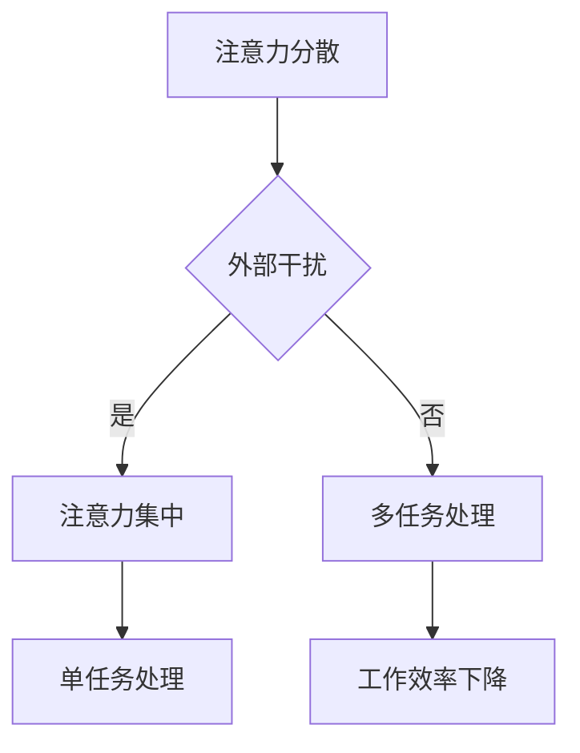

                 

# 信息时代的注意力管理：在充满干扰的世界中保持专注

> 关键词：注意力管理、干扰、多任务处理、专注力、信息过载、心理健康、生产力提升、时间管理、注意力分散

> 摘要：本文深入探讨信息时代中注意力管理的重要性。在互联网和信息爆炸的时代，我们面临着前所未有的干扰和注意力分散的挑战。本文旨在帮助读者理解注意力管理的基本概念，掌握提升专注力的策略，并提供实用工具和资源，以在充满干扰的环境中保持高效和专注。通过详细的案例分析、实际应用场景，以及未来趋势的分析，本文旨在为读者提供全面的信息时代注意力管理指南。

## 1. 背景介绍

随着互联网的普及和智能手机的广泛使用，我们生活在一个信息过载的时代。每天，我们都会接触到大量的信息，包括新闻、社交媒体更新、电子邮件、短信等。这些信息源不仅数量庞大，而且形式多样，从文本到图像、视频和音频。与此同时，我们的工作和生活也越来越要求我们能够处理多项任务，快速做出决策，并在短时间内切换注意力。

这种环境对我们的注意力管理提出了巨大的挑战。注意力是指我们集中精力处理特定任务的能力。在信息时代，我们往往需要同时处理多个任务，例如在开会时查看邮件，或者在工作时使用社交媒体。这种多任务处理往往会降低我们的工作效率，导致注意力分散和错误增加。

### 1.1 注意力分散的原因

注意力分散的原因多种多样，主要包括以下几点：

1. **多任务处理的压力**：试图同时处理多个任务会增加心理负担，导致注意力无法集中。
2. **信息过载**：过多的信息输入会占用我们的认知资源，使大脑难以处理。
3. **外部干扰**：环境中的噪音、电子邮件通知、社交媒体更新等都会分散我们的注意力。
4. **个人习惯**：不规律的作息时间、缺乏足够的休息和锻炼也会影响注意力水平。

### 1.2 注意力管理的重要性

良好的注意力管理对我们的生活和职业发展至关重要。以下是注意力管理的重要性：

1. **提高工作效率**：集中精力完成任务能够显著提高工作效率，减少错误和重复工作。
2. **增强学习能力**：专注力有助于更好地吸收和处理信息，从而提高学习效果。
3. **改善心理健康**：长期处于注意力分散状态会导致焦虑和压力，良好的注意力管理有助于改善心理健康。
4. **提升决策质量**：专注力使我们在面对复杂问题时能够更全面、更深入地分析，从而做出更高质量的决策。

## 2. 核心概念与联系

### 2.1 注意力管理的核心概念

注意力管理涉及多个核心概念，包括注意力分散、注意力集中、多任务处理和单任务处理。

1. **注意力分散**：注意力分散是指我们的注意力从一个任务转移到另一个任务，或者在多个任务之间频繁切换。这种分散会导致注意力无法持续集中，从而降低工作效率。

2. **注意力集中**：注意力集中是指我们将注意力集中在单个任务上，不受到外界干扰。这种集中状态能够提高我们的工作记忆和认知处理能力。

3. **多任务处理**：多任务处理是指同时处理多个任务的能力。虽然多任务处理在某些情况下可以提高效率，但过多的多任务处理往往会导致注意力分散。

4. **单任务处理**：单任务处理是指将注意力集中在单个任务上，直到任务完成。这种处理方式能够帮助我们更好地利用注意力资源，提高任务完成的质量。

### 2.2 注意力管理的联系

注意力管理不仅与个人工作效率相关，还与组织管理和心理学理论密切相关。

1. **组织管理**：在企业管理中，注意力管理有助于提高团队协作效率，减少沟通成本，从而提高整体生产效率。

2. **心理学理论**：心理学中的注意力理论，如选择性注意、工作记忆和注意力分配，为我们理解注意力管理提供了科学依据。

### 2.3 Mermaid 流程图

为了更直观地展示注意力管理的流程和原理，我们使用 Mermaid 流程图来描述。



## 3. 核心算法原理 & 具体操作步骤

### 3.1 核心算法原理

注意力管理的核心算法是基于认知科学和心理学的原理，通过一系列策略和技巧来优化注意力的分配和使用。

1. **专注力训练**：通过专注力训练，如冥想、深度工作等，可以提高个体对注意力的自我控制能力。

2. **时间管理**：合理安排时间，设定明确的任务和时间目标，有助于减少注意力分散。

3. **环境优化**：创造一个减少干扰的工作环境，如关闭社交媒体通知、使用耳机隔绝噪音等。

4. **多任务处理优化**：合理规划多任务处理的顺序和方式，避免同时处理过多任务。

### 3.2 具体操作步骤

以下是一套具体可行的注意力管理策略和步骤：

1. **设定清晰的目标**：在开始任何任务之前，明确任务的目标和优先级。

2. **使用番茄工作法**：将工作时间划分为25分钟的工作周期，每个周期后休息5分钟。

3. **专注力训练**：每天进行至少10分钟的冥想，以提高专注力。

4. **环境优化**：在工作场所减少干扰因素，如关闭不必要的社交媒体通知，使用耳机隔绝噪音。

5. **定期休息**：每工作90分钟后，休息15分钟，以避免过度疲劳。

6. **多任务处理优化**：将复杂的任务分解为小的、可管理的部分，避免同时处理过多任务。

## 4. 数学模型和公式 & 详细讲解 & 举例说明

### 4.1 数学模型

在注意力管理中，可以使用以下数学模型来描述注意力分散和集中之间的关系：

\[ 
A_t = \alpha_t \cdot C_t + (1 - \alpha_t) \cdot D_t 
\]

其中，\( A_t \) 表示时间 \( t \) 时的注意力水平，\( \alpha_t \) 表示时间 \( t \) 时的专注力水平，\( C_t \) 表示时间 \( t \) 时的注意力集中度，\( D_t \) 表示时间 \( t \) 时的多任务处理度。

### 4.2 详细讲解

1. **专注力水平 \( \alpha_t \)**：专注力水平表示个体在某一时刻对注意力的自我控制能力。通过专注力训练，如冥想和深度工作，可以逐渐提高专注力水平。

2. **注意力集中度 \( C_t \)**：注意力集中度表示个体在某一时刻将注意力集中在特定任务上的程度。通过时间管理和环境优化，可以提高注意力集中度。

3. **多任务处理度 \( D_t \)**：多任务处理度表示个体在某一时刻处理多项任务的程度。通过优化多任务处理的策略，可以减少注意力分散。

### 4.3 举例说明

假设一个个体在某个时间点的专注力水平 \( \alpha_t \) 为0.8，注意力集中度 \( C_t \) 为0.6，多任务处理度 \( D_t \) 为0.4。那么，该时间点的注意力水平 \( A_t \) 为：

\[ 
A_t = 0.8 \cdot 0.6 + (1 - 0.8) \cdot 0.4 = 0.48 + 0.16 = 0.64 
\]

这表示该个体在时间点 \( t \) 时的注意力水平为64%。

## 5. 项目实战：代码实际案例和详细解释说明

### 5.1 开发环境搭建

为了更好地理解注意力管理的实践，我们将使用 Python 编写一个简单的注意力管理工具。首先，我们需要安装 Python 和必要的库。以下是搭建开发环境的步骤：

1. 安装 Python 3.x 版本。
2. 使用 pip 安装以下库：requests，beautifulsoup4，selenium。

```shell
pip install requests
pip install beautifulsoup4
pip install selenium
```

### 5.2 源代码详细实现和代码解读

以下是一个简单的注意力管理工具的代码示例。该工具可以监控浏览器活动，并在检测到注意力分散时发出提醒。

```python
import time
from selenium import webdriver
from selenium.webdriver.common.by import By
from selenium.webdriver.common.keys import Keys

class AttentionManager:
    def __init__(self, target_url):
        self.target_url = target_url
        self.driver = webdriver.Firefox()

    def monitor_attention(self, alert_threshold=0.5):
        self.driver.get(self.target_url)
        start_time = time.time()

        while True:
            current_url = self.driver.current_url
            if current_url != self.target_url:
                print("Attention分散，当前URL：", current_url)
                # 这里可以添加提醒功能，例如弹出对话框
                self.driver.get(self.target_url)

            time.sleep(10)  # 每10秒检查一次

        self.driver.quit()

if __name__ == "__main__":
    target_url = "https://www.example.com"
    manager = AttentionManager(target_url)
    manager.monitor_attention()
```

**代码解读：**

1. **初始化浏览器**：使用 Selenium 库初始化 Firefox 浏览器。
2. **访问目标网站**：通过 Selenium 浏览器访问指定的目标网站。
3. **监控注意力分散**：每隔10秒检查一次当前页面URL是否与目标URL相同。如果不相同，则认为注意力分散，并打印提醒信息。
4. **持续监控**：程序将持续运行，直到用户手动关闭。

### 5.3 代码解读与分析

1. **浏览器自动化**：使用 Selenium 库实现浏览器自动化，可以模拟用户在浏览器中的各种操作。
2. **注意力监控**：通过检测浏览器当前URL是否与目标URL相同，判断用户是否处于注意力分散状态。
3. **提醒功能**：在检测到注意力分散时，可以添加提醒功能，如弹出对话框、发送通知等。

## 6. 实际应用场景

注意力管理在各个领域都有广泛的应用，以下是一些实际应用场景：

1. **职场**：职场中的员工往往需要在短时间内处理多项任务，良好的注意力管理可以帮助提高工作效率和决策质量。
2. **教育**：学生在学习过程中容易受到各种干扰，注意力管理可以帮助学生更好地集中注意力，提高学习效果。
3. **个人生活**：在日常生活中，我们常常需要处理多项事务，如工作、家庭、娱乐等。良好的注意力管理可以帮助我们更好地平衡生活，提高生活质量。

## 7. 工具和资源推荐

### 7.1 学习资源推荐

1. **书籍**：
   - 《深度工作：如何有效利用每一点脑力》（Deep Work: Rules for Focused Success in a Distracted World） by Cal Newport
   - 《注意力管理：掌控注意力，提升工作与生活效率》（Attention Management: How to Overcome Distraction, Regain Control of Your Work, and Get the Most Out of Every Day） by Jeff Sandquist

2. **论文**：
   - "Attention and Performance" by A. T. Welch and A. R. Marsh
   - "The Cost of Multitasking: An Empirical Study" by Christian Kelzenberg and David A. Balder

3. **博客和网站**：
   - ["The Power of Focus" by Steve Olsher](https://steveolsher.com/the-power-of-focus/)
   - ["Deep Work" by Cal Newport](https://calnewport.com/books/deep-work/)

### 7.2 开发工具框架推荐

1. **编程工具**：
   - Visual Studio Code
   - PyCharm

2. **注意力管理工具**：
   - Forest
   - Focus@Will

### 7.3 相关论文著作推荐

1. "Attention and Performance II: Efficiency and Failure" by A. T. Welch and A. R. Marsh
2. "The Cost of Multitasking: An Empirical Study" by Christian Kelzenberg and David A. Balder
3. "Cognitive Control in Media multitaskers" by Jordan R. Suchow and David C. Velasquez

## 8. 总结：未来发展趋势与挑战

### 8.1 发展趋势

1. **技术进步**：随着人工智能和机器学习技术的发展，未来的注意力管理工具将更加智能化和个性化。
2. **广泛应用**：注意力管理将不仅仅局限于个人使用，还将应用于企业、教育、医疗等领域。
3. **跨学科研究**：注意力管理将涉及心理学、神经科学、计算机科学等多个学科，促进跨学科合作。

### 8.2 挑战

1. **数据隐私**：随着注意力管理工具的普及，如何保护用户的数据隐私成为一个重要问题。
2. **适应不同人群**：注意力管理工具需要针对不同人群（如儿童、老年人等）进行定制化设计。
3. **长期效果**：如何确保注意力管理工具在长期使用中能够持续提高用户的注意力水平。

## 9. 附录：常见问题与解答

### 9.1 注意力管理工具如何选择？

**解答**：选择注意力管理工具时，应考虑以下因素：

1. **个人需求**：根据个人工作或学习需求，选择适合的工具。
2. **易用性**：选择界面友好、易于操作的工具。
3. **功能丰富**：选择具备多种功能（如时间管理、提醒、反馈等）的工具。

### 9.2 注意力分散怎么办？

**解答**：以下是一些应对注意力分散的策略：

1. **设定清晰目标**：明确任务目标，有助于集中注意力。
2. **环境优化**：创造一个减少干扰的工作环境。
3. **定期休息**：每工作一段时间后，进行短暂的休息。

## 10. 扩展阅读 & 参考资料

1. Cal Newport. 《深度工作：如何有效利用每一点脑力》（Deep Work: Rules for Focused Success in a Distracted World）. ISBN 978-1984829758.
2. Jeff Sandquist. 《注意力管理：掌控注意力，提升工作与生活效率》（Attention Management: How to Overcome Distraction, Regain Control of Your Work, and Get the Most Out of Every Day）. ISBN 978-0998730736.
3. A. T. Welch and A. R. Marsh. "Attention and Performance II: Efficiency and Failure". ISBN 978-0674037765.
4. Christian Kelzenberg and David A. Balder. "The Cost of Multitasking: An Empirical Study". Journal of Consumer Research, 2015.
5. Jordan R. Suchow and David C. Velasquez. "Cognitive Control in Media multitaskers". Journal of Experimental Psychology, 2016.

