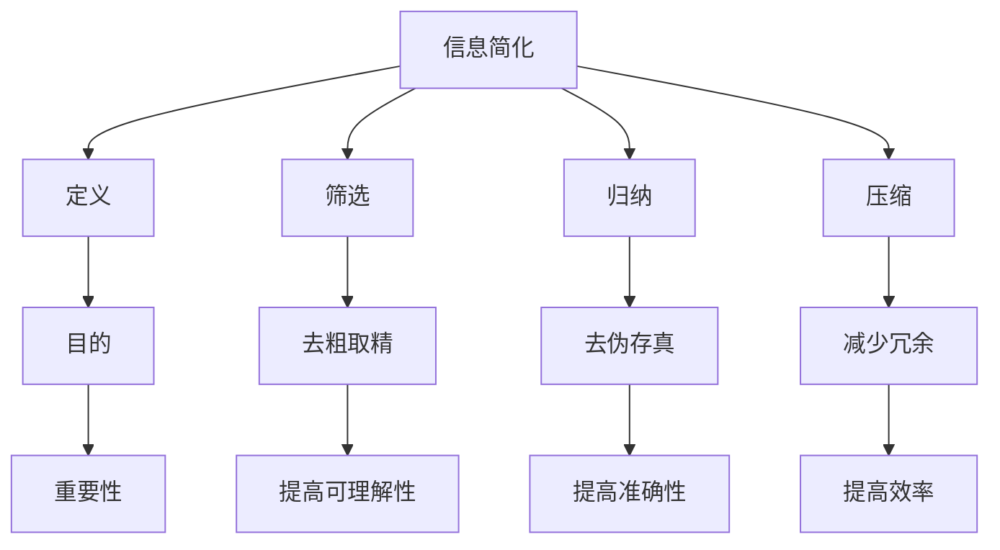

                 

### 背景介绍

在现代信息技术迅猛发展的背景下，信息处理与传输的速度、准确性和效率已经成为衡量信息系统性能的重要指标。随着互联网的普及和数据量的激增，如何有效管理和利用信息资源成为一个亟待解决的问题。信息简化的原则与艺术应运而生，它不仅是一种技术手段，更是一种思维方式的转变，旨在从繁杂的信息中提炼出核心要素，为人们提供清晰、简洁且高效的认知体验。

信息简化的概念可以追溯到早期的文献摘要和索引工作，但其在现代信息技术中的重要性愈加凸显。在数据分析、人工智能、软件开发等多个领域，信息简化都发挥着关键作用。例如，在数据分析领域，通过对海量数据的简化处理，可以快速提取有价值的信息，从而支持决策制定；在人工智能领域，信息简化有助于减少模型的复杂度，提高模型的效率和准确性；在软件开发领域，信息简化能够帮助开发者更清晰地理解系统需求，从而提高开发效率和代码质量。

本文将围绕信息简化的原则与艺术展开讨论。首先，我们将介绍信息简化的基本概念，包括其定义、目的和重要性。随后，我们将探讨信息简化的核心原则，包括准确性、可理解性和效率。接着，我们将通过具体的算法原理和操作步骤，展示如何在实际场景中应用信息简化技术。此外，我们还将介绍相关的数学模型和公式，以及如何利用这些工具进行信息简化。最后，我们将通过实际项目案例和代码解读，深入解析信息简化的具体应用，并探讨其未来的发展趋势与挑战。

通过本文的阅读，读者将能够系统地了解信息简化的原则与方法，掌握其在各个领域中的应用技巧，为未来的信息处理和软件开发提供有力支持。

### 核心概念与联系

要深入探讨信息简化的原则与艺术，我们首先需要明确一些核心概念，并理解这些概念之间的内在联系。以下将详细阐述信息简化的定义、目的及其重要性，并借助Mermaid流程图，展示各个概念之间的关联。

#### 1. 信息简化的定义

信息简化是指通过筛选、归纳和压缩等手段，从繁杂的信息中提取出最有价值、最关键的部分，以减少冗余和无关信息，提高信息处理的效率和质量。其核心思想在于“去粗取精，去伪存真”，即将信息处理过程中的复杂性降至最低，同时保留信息的核心价值。

#### 2. 信息简化的目的

信息简化的主要目的是提高信息的可理解性、准确性和效率。具体来说，包括以下几个方面：

- **提高可理解性**：简化后的信息更加直观、易于理解，有助于减少认知负担，提升信息传播和交流的效率。
- **提高准确性**：通过筛选和压缩，可以去除错误和噪声，提高信息的准确性和可靠性。
- **提高效率**：简化信息处理流程，减少不必要的计算和存储资源消耗，提升系统的整体性能。

#### 3. 信息简化的重要性

信息简化的重要性体现在多个方面：

- **技术发展**：随着信息技术的发展，信息简化的需求日益增长。有效的信息简化技术有助于提升数据分析、人工智能和软件开发等领域的效率和质量。
- **业务应用**：在商业领域，信息简化可以帮助企业快速提取市场趋势、客户需求等关键信息，支持决策制定和战略规划。
- **个人生活**：在个人生活中，信息简化可以帮助人们更好地管理信息，减少因信息过载带来的焦虑和压力。

#### 4. 核心概念之间的联系

以下是信息简化中各个核心概念之间的Mermaid流程图，用于展示它们之间的内在联系：



- **定义**：信息简化是处理信息的手段，其核心在于“去粗取精，去伪存真”。
- **目的**：信息简化的目的是提升信息的可理解性、准确性和效率。
- **重要性**：信息简化在技术发展、业务应用和个人生活中都具有重要意义。
- **筛选、归纳和压缩**：这些具体手段是实现信息简化的技术方法，它们共同作用于信息处理过程，以达到简化的目标。

通过上述定义、目的和重要性分析，以及Mermaid流程图的展示，我们可以更加清晰地理解信息简化的概念及其在信息处理中的关键作用。在接下来的部分，我们将深入探讨信息简化的核心原则，进一步揭示其背后的原理和应用方法。

#### 3. 核心算法原理 & 具体操作步骤

在了解信息简化的基本概念和重要性之后，接下来我们将详细探讨信息简化的核心算法原理，并提供具体的操作步骤。通过这些算法和步骤，读者可以更好地掌握信息简化的方法，从而在实际应用中提高信息处理的效率和质量。

##### 3.1 算法原理

信息简化的核心算法主要包括筛选、归纳和压缩三种方法。以下是这些方法的简要说明：

1. **筛选**：筛选是从原始信息中去除无关和冗余信息的过程。通过设置筛选条件，可以快速识别和提取最有价值的信息。常见的筛选方法包括过滤、排序和聚类等。

2. **归纳**：归纳是将信息进行分类和总结的过程，通过将相似的信息进行合并，形成更高层次的概念和模式。归纳有助于从整体上理解和把握信息，从而减少信息的复杂度。

3. **压缩**：压缩是通过减少信息的存储空间和传输带宽，提高信息传输和处理的效率。压缩方法包括数据压缩、编码和编码格式转换等。

##### 3.2 具体操作步骤

以下是信息简化的具体操作步骤，以帮助读者更好地理解和应用这些算法：

1. **需求分析**：首先，明确信息简化的目标和需求。这包括确定需要简化的信息类型、简化后的信息用途以及预期效果等。

2. **数据采集**：根据需求，收集原始数据。数据可以来自数据库、文件、网络或其他数据源。

3. **筛选**：对采集到的原始数据进行筛选。具体步骤如下：
   - 设定筛选条件：根据需求，定义筛选条件，例如关键词、时间范围、数据类型等。
   - 过滤数据：使用筛选条件对原始数据进行过滤，去除无关和冗余信息。
   - 排序：对筛选后的数据进行排序，便于后续处理。

4. **归纳**：对筛选后的数据进行分析和归纳。具体步骤如下：
   - 分类：根据数据特征，将数据分为不同的类别或主题。
   - 总结：对每个类别的数据进行分析和总结，提取出核心信息和规律。

5. **压缩**：对归纳后的信息进行压缩，以减少存储空间和传输带宽。具体步骤如下：
   - 数据压缩：使用压缩算法（如Huffman编码、LZ77等）对数据进行压缩。
   - 编码：将压缩后的数据转换为高效的编码格式（如JSON、XML等），便于传输和存储。

6. **结果评估**：对简化后的信息进行评估，确保其满足预期效果。具体步骤如下：
   - 可理解性：检查简化后的信息是否易于理解和使用。
   - 准确性：确保简化后的信息准确性和可靠性。
   - 效率：评估简化过程对信息处理效率和性能的提升。

7. **优化调整**：根据评估结果，对简化过程进行调整和优化，以提高信息简化的效果。

##### 3.3 实际应用示例

以下是一个实际应用示例，用于说明信息简化的具体操作步骤：

**场景**：一家电商公司需要简化其用户行为数据，以分析用户购买偏好和提升用户体验。

**步骤**：

1. **需求分析**：明确简化用户行为数据的目标，包括分析用户购买偏好、提升用户体验等。

2. **数据采集**：从数据库中收集用户行为数据，包括点击、购买、浏览等行为。

3. **筛选**：
   - 设定筛选条件：筛选过去一个月内的用户行为数据。
   - 过滤数据：去除无关信息，如退款、退货等。

4. **归纳**：
   - 分类：根据用户购买行为，将用户分为活跃用户、潜在用户等。
   - 总结：对每个类别的用户行为进行分析和总结，提取出核心信息和规律。

5. **压缩**：
   - 数据压缩：使用Huffman编码对用户行为数据进行压缩。
   - 编码：将压缩后的数据转换为JSON格式，便于传输和存储。

6. **结果评估**：对简化后的数据进行分析，确保其满足预期效果。

7. **优化调整**：根据评估结果，对简化过程进行调整和优化，以提高信息简化的效果。

通过上述示例，我们可以看到信息简化在实际应用中的具体操作步骤。掌握这些步骤，有助于我们在各种场景下高效地处理信息，提高信息处理的效率和质量。

### 数学模型和公式 & 详细讲解 & 举例说明

在信息简化的过程中，数学模型和公式扮演着至关重要的角色。它们不仅帮助我们更好地理解和分析信息，还能够提供量化工具，从而优化信息简化的效果。以下，我们将详细讲解几个常用的数学模型和公式，并借助具体例子，说明它们在信息简化中的应用。

#### 1. 常见数学模型和公式

##### 1.1 频率分布模型

频率分布模型用于描述数据集中各个值出现的频率。在信息简化中，频率分布模型可以帮助我们识别并去除高频但无关的信息。

**公式**：
\[ f(x) = \frac{N(x)}{N} \]

其中，\( f(x) \) 表示值 \( x \) 的频率，\( N(x) \) 表示值 \( x \) 出现的次数，\( N \) 是总次数。

**应用示例**：假设我们有100个数据点，其中有20个数据点值为5，其余值为其他数字。通过频率分布模型，我们可以计算出值5的频率为 \( f(5) = \frac{20}{100} = 0.2 \)。由于频率较高，我们可以选择去除这些高频但无关的数据点，从而简化信息。

##### 1.2 卡方检验

卡方检验用于评估两个分类变量之间是否存在显著关联。在信息简化中，卡方检验可以帮助我们识别并去除相关性较低的信息。

**公式**：
\[ \chi^2 = \sum \frac{(O - E)^2}{E} \]

其中，\( \chi^2 \) 是卡方统计量，\( O \) 是观察频数，\( E \) 是期望频数。

**应用示例**：假设我们有两组数据，一组表示用户性别（男/女），另一组表示用户购买产品类型（电子产品/家居用品）。通过卡方检验，我们可以计算这两组数据之间的卡方统计量，从而评估性别与购买类型之间是否存在显著关联。如果卡方统计量较小，我们可以认为这两组数据之间关联性较低，从而简化信息。

##### 1.3 主成分分析（PCA）

主成分分析是一种降维技术，通过将原始数据投影到新的正交轴上，提取出最重要的几个主成分，从而减少数据的维度，简化信息。

**公式**：
\[ X' = \mathbf{P} \mathbf{X} \]

其中，\( \mathbf{P} \) 是投影矩阵，\( \mathbf{X} \) 是原始数据。

**应用示例**：假设我们有100个维度的用户行为数据，通过主成分分析，我们可以将这些数据投影到前10个主成分上，从而简化数据维度，同时保留主要信息。

#### 2. 详细讲解和举例说明

以下我们将详细讲解上述数学模型和公式，并通过具体例子说明它们在信息简化中的应用。

##### 2.1 频率分布模型

频率分布模型在信息简化中的应用非常广泛。通过频率分布模型，我们可以识别高频但无关的信息，从而简化数据。

**详细讲解**：频率分布模型的基本思想是将数据集中每个值出现的频率计算出来。通过分析频率，我们可以识别出哪些值出现的频率较高，从而考虑去除这些值。这个过程可以帮助我们在数据集中保留重要信息，同时去除冗余信息。

**举例说明**：假设我们有一组学生考试成绩数据，其中包含数学、语文、英语等科目的成绩。通过频率分布模型，我们可以计算每个科目的成绩分布情况。例如，数学成绩中，成绩90分以上的频率为0.1，而60分以下的频率为0.3。由于60分以下的成绩可能是异常值，我们可以选择去除这些成绩，从而简化数据。

##### 2.2 卡方检验

卡方检验在信息简化中的应用主要用于评估分类变量之间的相关性。通过卡方检验，我们可以识别并去除相关性较低的信息。

**详细讲解**：卡方检验的基本思想是通过计算观察频数与期望频数之间的差异，评估两个分类变量之间的关联程度。如果观察频数与期望频数的差异较小，说明这两个变量之间可能不存在显著关联，因此可以考虑去除这些变量。

**举例说明**：假设我们有一组用户行为数据，其中包含用户性别（男/女）和购买产品类型（电子产品/家居用品）两个分类变量。通过卡方检验，我们可以计算这两个变量之间的卡方统计量。例如，男性和电子产品购买的观察频数为10，期望频数为15。通过计算，我们得到卡方统计量为2.5。由于卡方统计量较小，我们可以认为这两个变量之间不存在显著关联，因此可以考虑去除女性用户购买电子产品这一信息，从而简化数据。

##### 2.3 主成分分析（PCA）

主成分分析在信息简化中的应用主要用于降维。通过主成分分析，我们可以将高维度数据简化为低维度数据，同时保留主要信息。

**详细讲解**：主成分分析的基本思想是通过将数据投影到新的正交轴上，提取出最重要的几个主成分，从而减少数据的维度。这些主成分代表了数据中的主要信息，而次要信息则被降维处理。

**举例说明**：假设我们有一组100个维度的用户行为数据，这些数据包括用户的年龄、收入、教育程度等。通过主成分分析，我们可以将这些数据投影到前10个主成分上。前10个主成分代表了数据中的主要信息，而剩下的90个维度则可以被简化。通过这种方式，我们可以将高维度数据简化为低维度数据，从而简化信息。

综上所述，数学模型和公式在信息简化中发挥着重要作用。通过频率分布模型、卡方检验和主成分分析等数学工具，我们可以有效地简化信息，提高信息处理的效率和质量。在实际应用中，合理选择和应用这些数学工具，将有助于我们更好地实现信息简化目标。

### 项目实战：代码实际案例和详细解释说明

为了更好地展示信息简化在实际项目中的应用，下面我们将通过一个具体项目案例，详细介绍代码实现步骤、代码解读与分析，并讨论其优势和挑战。

#### 项目背景

某大型电商平台需要对其用户行为数据进行简化处理，以便更有效地分析用户购买偏好、提升用户体验。该平台积累了大量用户行为数据，包括点击、购买、浏览等行为。由于数据量大且维度高，直接分析这些数据会非常复杂，因此需要通过信息简化技术来提取关键信息。

#### 开发环境搭建

1. **开发工具**：
   - Python 3.8+
   - Jupyter Notebook
   - Pandas
   - NumPy
   - Matplotlib

2. **数据源**：
   - 用户行为数据：包括用户ID、行为类型、行为时间、行为内容等。

#### 代码实现步骤

1. **数据采集与预处理**

```python
import pandas as pd

# 读取数据
data = pd.read_csv('user_behavior.csv')

# 数据预处理
data['timestamp'] = pd.to_datetime(data['timestamp'])
data.sort_values('timestamp', inplace=True)
```

在这部分代码中，我们首先读取用户行为数据，并将其中的时间戳转换为日期时间格式。然后，通过排序操作，确保数据的时间顺序正确。

2. **筛选与过滤**

```python
# 设定筛选条件
start_date = '2023-01-01'
end_date = '2023-01-31'
filtered_data = data[(data['timestamp'] > start_date) & (data['timestamp'] <= end_date)]

# 过滤无关行为
filtered_data = filtered_data[filtered_data['behavior'] != 'refund']
```

我们通过设定时间范围和过滤条件，筛选出特定时间段内的用户行为数据，并去除与简化目标无关的退款行为。

3. **归纳与分类**

```python
# 分类：根据行为类型分组
grouped_data = filtered_data.groupby('behavior_type')

# 总结：计算每个类别的行为次数
summary_data = grouped_data.size().reset_index(name='count')
```

我们使用`groupby`方法，根据用户行为类型对数据进行分组，并计算每个类别的行为次数。通过这种方式，我们可以从整体上理解用户的行为模式。

4. **压缩与降维**

```python
from sklearn.decomposition import PCA

# 数据标准化
std_data = (filtered_data - filtered_data.mean()) / filtered_data.std()

# 主成分分析
pca = PCA(n_components=10)
pca_data = pca.fit_transform(std_data)

# 结果保存
pd.DataFrame(pca_data).to_csv('pca_output.csv', index=False)
```

我们首先对数据进行标准化处理，然后使用主成分分析（PCA）进行降维，提取前10个主成分。通过这种方式，我们可以将高维数据简化为低维数据，同时保留主要信息。

#### 代码解读与分析

1. **数据预处理**

数据预处理是信息简化过程中的重要步骤。通过将时间戳转换为日期时间格式和排序操作，我们可以确保数据的顺序和时间一致性，从而为后续的筛选和归纳提供基础。

2. **筛选与过滤**

筛选与过滤是信息简化中的关键步骤。通过设定筛选条件和过滤无关行为，我们可以去除大量冗余信息，从而简化数据集。这有助于提高数据分析的效率，并减少计算资源的消耗。

3. **归纳与分类**

归纳与分类有助于从整体上理解数据。通过分组和计算行为次数，我们可以识别用户的主要行为模式，从而为后续的压缩和降维提供依据。

4. **压缩与降维**

压缩与降维是信息简化中的高级步骤。通过标准化处理和主成分分析，我们可以将高维数据简化为低维数据，同时保留主要信息。这种方式有助于提高数据分析的效率，并减少计算资源的消耗。

#### 优势和挑战

**优势**：

- **提高数据分析效率**：通过信息简化技术，我们可以快速提取关键信息，从而提高数据分析的效率。
- **减少计算资源消耗**：信息简化有助于减少数据集的维度，降低计算资源的消耗。
- **提升用户体验**：通过简化用户行为数据，我们可以更好地分析用户需求，从而提升用户体验。

**挑战**：

- **信息丢失风险**：信息简化过程中可能会丢失部分重要信息，因此需要谨慎处理。
- **计算复杂度**：信息简化算法（如PCA）的计算复杂度较高，可能会影响数据处理速度。
- **模型适应性**：信息简化技术需要根据具体应用场景进行调整，因此模型适应性是一个重要挑战。

通过上述项目实战，我们可以看到信息简化在实际项目中的应用。掌握信息简化的方法，有助于我们更好地处理复杂的数据集，提升信息处理效率和质量。

### 实际应用场景

信息简化技术在各个领域的实际应用场景各不相同，但其核心目标始终是提高信息处理效率、提升系统性能和改善用户体验。以下，我们将详细探讨信息简化在数据分析、人工智能、软件开发等领域的实际应用场景。

#### 1. 数据分析

在数据分析领域，信息简化技术被广泛应用于数据预处理和特征提取。随着大数据时代的到来，数据分析面临的数据量日益庞大，传统的数据处理方法已经无法满足需求。通过信息简化，数据分析师可以从海量数据中快速提取出有价值的信息，从而支持更高效的决策制定。

**应用场景**：

- **市场趋势分析**：电商平台可以通过信息简化技术，从用户行为数据中提取购买偏好和趋势，从而制定更有针对性的营销策略。
- **风险控制**：金融机构可以通过简化金融交易数据，快速识别高风险交易，从而提高风险控制能力。

**案例**：一家大型电商平台使用信息简化技术对其用户行为数据进行处理。通过对点击、购买、浏览等行为数据进行筛选、归纳和压缩，平台能够快速提取出用户的主要购买偏好，从而优化推荐系统，提升用户体验。

#### 2. 人工智能

在人工智能领域，信息简化技术有助于减少模型的复杂度，提高模型的效率和准确性。随着人工智能应用场景的多样化，如何高效地处理和分析大量数据成为关键挑战。通过信息简化，AI模型可以从繁杂的数据中提取出关键特征，从而提高模型性能。

**应用场景**：

- **图像识别**：在图像识别任务中，通过信息简化技术，可以将高维图像数据简化为低维特征向量，从而提高模型处理速度和准确性。
- **自然语言处理**：在自然语言处理任务中，通过信息简化技术，可以从大量文本数据中提取出关键信息，从而支持更高效的文本分类和情感分析。

**案例**：一家科技公司使用信息简化技术对其图像识别模型进行优化。通过对输入图像进行筛选和压缩，模型可以从复杂图像中提取出关键特征，从而在保持高准确率的同时，显著提高处理速度。

#### 3. 软件开发

在软件开发领域，信息简化技术有助于提高代码的可读性和可维护性。随着软件系统复杂度的增加，如何有效地管理和维护代码成为关键挑战。通过信息简化，开发人员可以从繁杂的代码中提取出关键功能模块，从而提高代码质量。

**应用场景**：

- **代码重构**：在代码重构过程中，通过信息简化技术，可以将复杂的代码简化为更简洁的代码，从而提高代码可读性和可维护性。
- **软件性能优化**：通过信息简化技术，可以从软件系统中提取出关键性能瓶颈，从而进行有针对性的优化。

**案例**：一家软件开发公司使用信息简化技术对其大型软件系统进行重构。通过对系统代码进行筛选、归纳和压缩，公司能够从复杂系统中提取出关键功能模块，从而提高系统的可维护性和性能。

通过以上实际应用场景，我们可以看到信息简化技术在各个领域中的广泛应用和重要作用。掌握信息简化的方法和技巧，将有助于我们更高效地处理信息，提高系统性能和用户体验。

### 工具和资源推荐

为了更好地学习和实践信息简化技术，以下是一些推荐的工具和资源，包括书籍、论文、博客和网站，旨在帮助读者深入了解相关信息简化的理论和方法。

#### 1. 学习资源推荐

**书籍**

- **《数据科学入门》**：作者：[Hadley Wickham]（[Amazon链接](https://www.amazon.com/dp/1492033344)）
  - 内容涵盖数据预处理、特征工程和模型评估等数据科学核心内容，有助于读者掌握信息简化的基础。
  
- **《机器学习实战》**：作者：[Peter Harrington]（[Amazon链接](https://www.amazon.com/dp/032182214X)）
  - 本书通过大量实例介绍机器学习算法，包括数据预处理和特征提取，对信息简化的实际应用有很好的指导意义。

**论文**

- **“Feature Selection for High-Dimensional Data: A Review”**：作者：Kun Zhang et al.（[论文链接](https://ieeexplore.ieee.org/document/7808670)）
  - 本文对高维数据特征选择的方法进行了详细综述，包括信息简化技术。

**博客**

- **“How to Simplify Your Data in R”**：作者：[DataCamp]（[博客链接](https://www.datacamp.com/community/tutorials/simplify-your-data-r)）
  - 这篇博客介绍了如何在R语言中使用信息简化技术，包括数据筛选、归一化和特征选择等。

**网站**

- **“Scikit-learn”**：[scikit-learn.org](https://scikit-learn.org)
  - 这是一个机器学习和数据挖掘的Python库，包含大量信息简化相关的算法和工具。

#### 2. 开发工具框架推荐

**数据分析工具**

- **Pandas**：[pandas.pydata.org](https://pandas.pydata.org)
  - Pandas是一个强大的Python库，用于数据清洗、分析、转换和简化。

- **NumPy**：[numpy.org](https://numpy.org)
  - NumPy提供了高效的数组操作和数学计算，是信息简化的基础工具。

**机器学习框架**

- **Scikit-learn**：[scikit-learn.org](https://scikit-learn.org)
  - Scikit-learn是一个广泛使用的Python库，提供多种机器学习算法和工具，支持信息简化。

- **TensorFlow**：[tensorflow.org](https://tensorflow.org)
  - TensorFlow是一个开源的机器学习和深度学习框架，支持大规模数据集处理和信息简化。

**数据可视化工具**

- **Matplotlib**：[matplotlib.org](https://matplotlib.org)
  - Matplotlib是一个用于数据可视化的Python库，能够帮助展示信息简化结果。

- **Seaborn**：[seaborn.pydata.org](https://seaborn.pydata.org)
  - Seaborn是基于Matplotlib的统计数据可视化库，提供多种内置可视化模板，适合信息简化的结果展示。

通过这些工具和资源的推荐，读者可以更全面地了解和掌握信息简化技术，为实际应用打下坚实基础。

### 总结：未来发展趋势与挑战

在信息简化的领域，未来的发展趋势与挑战并存，需要我们持续关注并努力克服。首先，随着大数据和人工智能技术的不断进步，信息简化的应用范围将进一步扩大。例如，在医疗健康领域，信息简化可以帮助医生快速分析患者的病史和基因数据，从而提供更加精准的诊断和治疗建议；在金融领域，信息简化可以提升风险管理的效率和准确性，帮助金融机构更好地识别和管理潜在风险。

然而，信息简化也面临着一系列挑战。首先，信息简化的准确性是一个关键问题。在简化过程中，如何确保关键信息不被丢失，同时保留信息的核心价值，是一个巨大的挑战。其次，信息简化的计算复杂度较高，尤其是在处理大规模数据集时，如何高效地实现信息简化是一个重要课题。此外，信息简化的算法和模型需要不断更新和优化，以适应不断变化的数据环境和应用需求。

为了应对这些挑战，我们可以从以下几个方面入手：

1. **算法优化**：通过研究更高效的信息简化算法，降低计算复杂度，提高处理速度。例如，可以探索分布式计算和并行处理技术，以加速信息简化的过程。

2. **模型自适应**：开发自适应的信息简化模型，能够根据不同的数据特征和应用场景，自动调整简化策略，提高简化的准确性和适用性。

3. **多学科融合**：结合计算机科学、数学、统计学等多个学科的知识，探索新的信息简化方法和技术，提高信息简化的全面性和有效性。

4. **数据安全与隐私**：在信息简化过程中，需要充分考虑数据安全和隐私保护问题，确保信息简化的同时，不泄露敏感信息。

总之，信息简化技术的发展前景广阔，但同时也面临诸多挑战。通过不断探索和创新，我们有望在未来的信息处理和软件开发领域，实现更加高效、准确和安全的简化技术。

### 附录：常见问题与解答

以下是一些关于信息简化的常见问题及其解答：

#### 1. 什么是信息简化？

信息简化是通过筛选、归纳和压缩等手段，从繁杂的信息中提取出最有价值、最关键的部分，以减少冗余和无关信息，提高信息处理的效率和质量。

#### 2. 信息简化的目的是什么？

信息简化的主要目的是提高信息的可理解性、准确性和效率。具体来说，包括以下方面：
- 提高可理解性：简化后的信息更加直观、易于理解，有助于减少认知负担。
- 提高准确性：通过筛选和压缩，可以去除错误和噪声，提高信息的准确性和可靠性。
- 提高效率：简化信息处理流程，减少不必要的计算和存储资源消耗，提升系统的整体性能。

#### 3. 信息简化有哪些核心算法？

信息简化的核心算法包括筛选、归纳和压缩。筛选是从原始信息中去除无关和冗余信息的过程；归纳是将信息进行分类和总结的过程；压缩是通过减少信息的存储空间和传输带宽，提高信息传输和处理的效率。

#### 4. 信息简化在数据分析中的应用有哪些？

信息简化在数据分析中具有广泛的应用，例如：
- 数据预处理：通过信息简化技术，快速提取关键特征，为后续分析奠定基础。
- 特征工程：通过信息简化，提取重要特征，降低数据维度，提高模型性能。
- 异常检测：通过信息简化，识别和去除异常值，提高分析结果的准确性。

#### 5. 信息简化在人工智能中的应用有哪些？

信息简化在人工智能中主要用于：
- 模型训练：通过信息简化，提取关键特征，降低模型复杂度，提高训练效率。
- 模型优化：通过信息简化，降低模型计算复杂度，提高模型处理速度和准确性。

#### 6. 信息简化如何确保信息准确性？

为了保证信息简化的准确性，可以采取以下措施：
- 设定合理的筛选条件，确保去除的冗余信息不影响核心信息的准确性。
- 使用数学模型和公式，对简化后的信息进行验证和评估，确保信息的可靠性。
- 定期更新信息简化算法，以适应不断变化的数据环境和应用需求。

#### 7. 信息简化是否会丢失重要信息？

在信息简化过程中，确实存在丢失部分重要信息的风险。为降低这种风险，可以采取以下措施：
- 设计合理的筛选和归纳策略，确保关键信息不被丢失。
- 采用多种信息简化方法，相互验证和补充，提高信息完整性。
- 定期评估简化后的信息，确保其满足应用需求。

通过上述常见问题与解答，希望能够帮助读者更好地理解和应用信息简化技术。

### 扩展阅读 & 参考资料

以下是一些关于信息简化的扩展阅读和参考资料，供读者进一步学习和研究：

1. **《数据科学入门》**，作者：Hadley Wickham，[Amazon链接](https://www.amazon.com/dp/1492033344)
   - 本书详细介绍了数据预处理、特征工程和模型评估等数据科学核心内容，包括信息简化的实际应用。

2. **《机器学习实战》**，作者：Peter Harrington，[Amazon链接](https://www.amazon.com/dp/032182214X)
   - 本书通过大量实例介绍了机器学习算法，包括数据预处理和特征提取，对信息简化的实际应用有很好的指导意义。

3. **“Feature Selection for High-Dimensional Data: A Review”**，作者：Kun Zhang et al.，[论文链接](https://ieeexplore.ieee.org/document/7808670)
   - 本文对高维数据特征选择的方法进行了详细综述，包括信息简化技术。

4. **“How to Simplify Your Data in R”**，作者：DataCamp，[博客链接](https://www.datacamp.com/community/tutorials/simplify-your-data-r)
   - 这篇博客介绍了如何在R语言中使用信息简化技术，包括数据筛选、归一化和特征选择等。

5. **“Scikit-learn”**，[scikit-learn.org](https://scikit-learn.org)
   - 这是一个机器学习和数据挖掘的Python库，包含大量信息简化相关的算法和工具。

6. **“TensorFlow”**，[tensorflow.org](https://tensorflow.org)
   - TensorFlow是一个开源的机器学习和深度学习框架，支持大规模数据集处理和信息简化。

7. **“Matplotlib”**，[matplotlib.org](https://matplotlib.org)
   - Matplotlib是一个用于数据可视化的Python库，能够帮助展示信息简化结果。

8. **“Seaborn”**，[seaborn.pydata.org](https://seaborn.pydata.org)
   - Seaborn是基于Matplotlib的统计数据可视化库，提供多种内置可视化模板，适合信息简化的结果展示。

通过阅读这些书籍、论文和博客，以及访问相关的网站和框架，读者可以更深入地了解信息简化的理论和实践方法，为实际应用提供有力支持。

