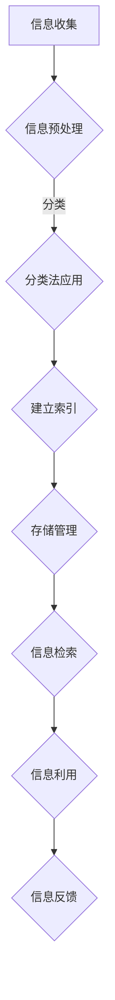

                 

### 背景介绍

在当今数字化时代，信息爆炸式增长，如何高效地组织和分类这些数字资产，成为了一个备受关注的问题。随着云计算、大数据、物联网等技术的迅猛发展，信息处理和存储的需求不断增加，传统的信息管理方法已经难以满足现代业务的需求。因此，探索信息组织和分类的最佳实践，对于提升企业的信息化管理水平，优化业务流程，提高工作效率具有重要意义。

本篇文章旨在探讨信息组织和分类的最佳实践，通过详细的分析和案例讲解，帮助读者深入了解这一领域的核心概念、算法原理、数学模型以及实际应用场景。文章将从以下方面展开讨论：

1. **核心概念与联系**：介绍信息组织和分类的基本概念，阐述它们之间的内在联系和相互关系。
2. **核心算法原理与具体操作步骤**：详细讲解常见的信息组织和分类算法，包括其原理和具体实现步骤。
3. **数学模型和公式**：介绍用于信息组织和分类的数学模型，并通过公式和举例说明其应用。
4. **项目实战**：通过实际项目案例，展示信息组织和分类在具体场景中的应用。
5. **实际应用场景**：分析信息组织和分类在不同行业和领域中的实际应用案例。
6. **工具和资源推荐**：推荐相关的学习资源和开发工具，帮助读者进一步深入学习和实践。
7. **总结与展望**：总结文章的主要观点，探讨信息组织和分类领域的未来发展趋势和挑战。

通过本文的阅读，读者将能够系统地掌握信息组织和分类的知识，为实际工作和项目提供有益的指导。接下来，我们将深入探讨信息组织和分类的核心概念与联系，帮助读者构建对这一领域的全面理解。 <markdown>

### 核心概念与联系

#### 信息组织

信息组织是指将大量分散的信息资源通过一定的规则和方法进行有序排列和整合，以便于检索、管理和利用。它包括信息的收集、整理、存储、分类、检索等多个环节。信息组织的目标是提高信息的可访问性和利用率，降低信息过载带来的困扰。

**主要概念和原理：**

1. **信息模型**：信息模型是描述信息组织方式的抽象概念，包括信息表示、信息结构和信息关联等。常用的信息模型有文档模型、关系模型、对象模型等。

2. **分类法**：分类法是用于对信息进行分类的标准和方法。常见的分类法有图书馆分类法、主题词表、本体论等。

3. **索引**：索引是一种用于快速检索信息的工具，通过对信息内容进行分析和整理，生成索引条目，使得检索过程更加高效。

4. **元数据**：元数据是描述信息属性的数据，包括信息的创建者、创建时间、内容摘要、格式等。元数据有助于提高信息的可管理性和可理解性。

**信息模型与分类法的关系：**

信息模型和分类法是信息组织的重要组成部分，它们之间存在密切的联系。信息模型定义了信息组织和表示的方法，而分类法则为信息组织提供了具体的分类标准。通过分类法，信息可以根据不同的维度进行分类，便于管理和检索。同时，分类法也可以根据信息模型进行调整和优化，以适应不同的组织和应用需求。

#### 数字资产

数字资产是指以数字形式存在的各种资源，包括文档、图片、音频、视频、代码等。数字资产是企业或个人在数字化时代的重要财富，有效的管理和利用数字资产可以提升业务效率和竞争力。

**主要概念和原理：**

1. **资产分类**：数字资产可以根据其类型、用途、价值等因素进行分类，以便于管理和利用。常见的分类方法有文件类型分类、用途分类、价值分类等。

2. **资产标识**：为了便于管理和追踪，数字资产需要被赋予唯一的标识。常见的标识方式有文件名、目录结构、数字指纹等。

3. **资产生命周期管理**：数字资产从创建、使用到废弃，需要经历一个完整的生命周期。资产生命周期管理包括资产的创建、存储、共享、备份、更新和销毁等环节。

**信息组织和数字资产的关系：**

信息组织和数字资产密切相关。有效的信息组织可以提高数字资产的利用效率和可访问性，降低管理成本。同时，数字资产的管理需求也推动了信息组织技术的发展。通过信息组织，数字资产可以被更好地分类、存储和检索，从而实现高效的管理和利用。

### Mermaid 流程图

为了更直观地展示信息组织和分类的过程，我们可以使用 Mermaid 流程图来描述。以下是一个简化的信息组织和分类的流程图：



在这个流程图中，信息收集是整个过程的起点，随后进行信息预处理，包括数据清洗、格式化等操作。预处理后的信息通过分类法进行分类，并建立索引以便快速检索。存储管理涉及数据的存储和备份，确保信息的安全性和可靠性。最后，通过信息检索和利用，实现对信息的有效管理和利用。

### 小结

在本节中，我们介绍了信息组织和分类的核心概念与联系，包括信息组织的基本原理和数字资产的管理需求。通过 Mermaid 流程图，我们展示了信息组织和分类的基本流程。在接下来的章节中，我们将进一步探讨信息组织和分类的核心算法原理和具体操作步骤，帮助读者深入了解这一领域。 <markdown>

### 核心算法原理 & 具体操作步骤

在信息组织和分类的过程中，选择合适的算法至关重要。本节将介绍几种常见的信息组织和分类算法，包括基于内容的分类算法、聚类算法和主题模型。我们将详细讲解这些算法的原理和具体操作步骤，帮助读者理解其核心思想和实际应用。

#### 基于内容的分类算法

基于内容的分类算法是一种常用的信息分类方法，它通过对文档内容的特征进行提取和匹配，将文档归入相应的类别。以下是一种常见的基于内容的分类算法——支持向量机（SVM）分类算法。

**原理：**
支持向量机是一种监督学习算法，其目标是在高维空间中找到一个最佳的超平面，将不同类别的数据点分隔开来。在文档分类中，每个文档被表示为一个特征向量，而类别则作为标签。SVM算法通过优化目标函数，找到一个最优的决策边界，从而实现分类。

**具体操作步骤：**
1. **特征提取：** 对文档进行分词、词性标注等预处理，将文本转化为词袋模型或词嵌入向量。
2. **训练集准备：** 收集具有标签的文档，将其分为训练集和测试集。
3. **模型训练：** 使用训练集训练SVM模型，计算支持向量，优化决策边界。
4. **分类预测：** 使用训练好的SVM模型对测试集进行分类预测。

#### 聚类算法

聚类算法是一种无监督学习算法，它通过将相似的数据点划分为同一簇，从而实现数据的自动分组。K-Means聚类算法是一种常用的聚类算法，其原理简单且易于实现。

**原理：**
K-Means算法的目标是将数据点划分为K个簇，使得每个簇内的数据点之间的距离最小，而簇与簇之间的距离最大。算法主要包括以下步骤：

1. **初始化：** 随机选择K个数据点作为初始聚类中心。
2. **分配：** 对于每个数据点，计算其与聚类中心的距离，并将其分配到最近的聚类中心所代表的簇。
3. **更新：** 重新计算每个簇的聚类中心。
4. **迭代：** 重复步骤2和3，直到聚类中心不再发生变化或达到预设的迭代次数。

#### 主题模型

主题模型是一种概率模型，用于发现文档集合中的潜在主题。LDA（Latent Dirichlet Allocation）是一种常用的主题模型，其原理基于概率图模型。

**原理：**
LDA模型假设每个文档是由多个主题的混合生成的，每个主题又由多个词语的混合生成。模型的主要参数包括主题分布、词语分布和文档分布。LDA算法主要包括以下步骤：

1. **参数初始化：** 初始化主题分布、词语分布和文档分布。
2. **吉布斯采样：** 使用吉布斯采样方法，在给定的主题分布下，对每个词语的主题分配进行迭代更新。
3. **收敛判断：** 判断算法是否收敛，若收敛则输出主题分布。

#### 算法应用实例

以下是一个简单的K-Means聚类算法的应用实例，用于对一组文档进行分类。

**实例：** 假设我们有5个文档，分别如下：

- 文档1：人工智能、机器学习、深度学习
- 文档2：计算机科学、编程语言、算法
- 文档3：大数据、数据分析、数据挖掘
- 文档4：网络安全、防火墙、加密技术
- 文档5：云计算、虚拟化、容器技术

**操作步骤：**
1. **特征提取：** 对文档进行分词，得到以下特征集合：
   - {人工智能、机器学习、深度学习、计算机科学、编程语言、算法、大数据、数据分析、数据挖掘、网络安全、防火墙、加密技术、云计算、虚拟化、容器技术}
2. **初始化聚类中心：** 随机选择3个文档的标题作为初始聚类中心。
3. **分配：** 对每个文档，计算其与聚类中心的距离，将其分配到最近的聚类中心所代表的簇。
4. **更新：** 重新计算每个簇的聚类中心。
5. **迭代：** 重复步骤3和4，直到聚类中心不再发生变化。

**结果：** 经过多次迭代，最终将5个文档划分为3个簇：

- 簇1：{文档1、文档2}
- 簇2：{文档3}
- 簇3：{文档4、文档5}

通过以上实例，我们可以看到K-Means聚类算法在文档分类中的应用效果。类似地，支持向量机和LDA等算法也可以应用于信息组织和分类任务中，根据具体需求和数据特点选择合适的算法进行模型训练和预测。

### 小结

在本节中，我们介绍了三种常见的信息组织和分类算法：基于内容的分类算法、聚类算法和主题模型。通过详细讲解这些算法的原理和具体操作步骤，读者可以更好地理解其核心思想和应用方法。在接下来的章节中，我们将继续探讨信息组织和分类的数学模型和公式，以及实际项目中的应用案例。 <markdown>

### 数学模型和公式 & 详细讲解 & 举例说明

在信息组织和分类过程中，数学模型和公式起到了关键作用。本节将详细介绍支持向量机（SVM）、K-Means聚类和LDA主题模型的核心数学模型和公式，并通过具体例子进行详细讲解。

#### 支持向量机（SVM）

SVM是一种监督学习算法，主要用于分类问题。其核心思想是在高维空间中找到一个最佳的超平面，将不同类别的数据点分隔开来。

**核心公式：**

1. **决策边界：**

   对于线性可分的数据，SVM的目标是最小化决策边界：

   $$\min_{w,b}\frac{1}{2}||w||^2$$

   使得：

   $$y^{(i)}(\langle w,x^{(i)}\rangle + b) \geq 1$$

   其中，$w$ 是超平面的法向量，$b$ 是偏置项，$x^{(i)}$ 和 $y^{(i)}$ 分别是第 $i$ 个样本的特征和标签。

2. **核函数：**

   对于非线性可分的数据，可以使用核函数将数据映射到高维空间，然后在高维空间中寻找最优超平面：

   $$\min_{\alpha}\frac{1}{2}\sum_{i=1}^{n}|\alpha_i - \alpha_j||\phi(x^{(i)}) - \phi(x^{(j)})||^2$$

   其中，$\alpha$ 是拉格朗日乘子，$\phi(x^{(i)})$ 是映射到高维空间后的特征向量。

**举例说明：**

假设我们有以下两个类别的数据点：

- 类别1：$x_1 = (1, 1), x_2 = (2, 2), x_3 = (3, 3)$
- 类别2：$x_4 = (4, 4), x_5 = (5, 5), x_6 = (6, 6)$

我们希望使用SVM将它们分隔开来。首先，我们将数据点转化为特征向量：

$$x_1 = \begin{bmatrix} 1 \\ 1 \end{bmatrix}, x_2 = \begin{bmatrix} 2 \\ 2 \end{bmatrix}, x_3 = \begin{bmatrix} 3 \\ 3 \end{bmatrix}, x_4 = \begin{bmatrix} 4 \\ 4 \end{bmatrix}, x_5 = \begin{bmatrix} 5 \\ 5 \end{bmatrix}, x_6 = \begin{bmatrix} 6 \\ 6 \end{bmatrix}$$

然后，我们可以使用线性SVM来训练模型：

$$\min_{w,b}\frac{1}{2}||w||^2$$

使得：

$$y^{(i)}(\langle w,x^{(i)}\rangle + b) \geq 1$$

对于类别1的数据点，我们有：

$$y^{(i)}(\langle w,x^{(i)}\rangle + b) = 1(w^Tx^{(i)} + b) \geq 1$$

对于类别2的数据点，我们有：

$$y^{(i)}(\langle w,x^{(i)}\rangle + b) = -1(w^Tx^{(i)} + b) \geq -1$$

通过求解上述优化问题，我们可以得到最优超平面 $w^*$ 和偏置项 $b^*$，从而实现分类。

#### K-Means聚类

K-Means聚类是一种无监督学习算法，通过将数据点划分为K个簇，使得每个簇内的数据点之间的距离最小。

**核心公式：**

1. **聚类中心：**

   $$\mu_k = \frac{1}{N_k}\sum_{x_i \in S_k}x_i$$

   其中，$\mu_k$ 是第 $k$ 个聚类中心，$N_k$ 是第 $k$ 个簇中的数据点数量。

2. **簇分配：**

   对于每个数据点 $x_i$，计算其与各个聚类中心的距离，并将其分配到距离最近的聚类中心所代表的簇：

   $$S_k = \{x_i | \min_{j=1,...,K}\|x_i - \mu_j\|_2\}$$

**举例说明：**

假设我们有以下数据点：

- $x_1 = \begin{bmatrix} 1 \\ 1 \end{bmatrix}, x_2 = \begin{bmatrix} 2 \\ 2 \end{bmatrix}, x_3 = \begin{bmatrix} 3 \\ 3 \end{bmatrix}$
- $x_4 = \begin{bmatrix} 4 \\ 4 \end{bmatrix}, x_5 = \begin{bmatrix} 5 \\ 5 \end{bmatrix}, x_6 = \begin{bmatrix} 6 \\ 6 \end{bmatrix}$

我们希望将它们划分为2个簇。首先，随机选择2个聚类中心：

$$\mu_1 = \begin{bmatrix} 2 \\ 2 \end{bmatrix}, \mu_2 = \begin{bmatrix} 5 \\ 5 \end{bmatrix}$$

然后，计算每个数据点与聚类中心的距离：

$$d(x_1, \mu_1) = \sqrt{(1-2)^2 + (1-2)^2} = \sqrt{2}$$

$$d(x_1, \mu_2) = \sqrt{(1-5)^2 + (1-5)^2} = \sqrt{32}$$

$$d(x_2, \mu_1) = \sqrt{(2-2)^2 + (2-2)^2} = 0$$

$$d(x_2, \mu_2) = \sqrt{(2-5)^2 + (2-5)^2} = \sqrt{20}$$

$$d(x_3, \mu_1) = \sqrt{(3-2)^2 + (3-2)^2} = 1$$

$$d(x_3, \mu_2) = \sqrt{(3-5)^2 + (3-5)^2} = \sqrt{8}$$

根据距离计算结果，我们可以将数据点分配到相应的簇：

$$S_1 = \{x_1, x_2\}, S_2 = \{x_3, x_4, x_5, x_6\}$$

然后，重新计算每个簇的聚类中心：

$$\mu_1 = \frac{1}{2}(x_1 + x_2) = \begin{bmatrix} 1.5 \\ 1.5 \end{bmatrix}$$

$$\mu_2 = \frac{1}{4}(x_3 + x_4 + x_5 + x_6) = \begin{bmatrix} 4.5 \\ 4.5 \end{bmatrix}$$

重复上述过程，直到聚类中心不再发生变化。

#### LDA主题模型

LDA主题模型是一种概率模型，用于发现文档集合中的潜在主题。它基于贝叶斯推断和概率图模型。

**核心公式：**

1. **主题分布：**

   $$\theta = \{p(z|d) | d = 1,...,D\}$$

   其中，$\theta$ 是文档分布，$p(z|d)$ 是给定文档 $d$ 下主题 $z$ 的概率。

2. **词语分布：**

   $$\phi = \{p(w|z) | z = 1,...,Z\}$$

   其中，$\phi$ 是主题分布，$p(w|z)$ 是给定主题 $z$ 下词语 $w$ 的概率。

3. **文档-主题分布：**

   $$\alpha = \{p(d|z) | z = 1,...,Z\}$$

   其中，$\alpha$ 是文档-主题分布，$p(d|z)$ 是给定主题 $z$ 下文档 $d$ 的概率。

LDA算法主要包括以下步骤：

1. **参数初始化：** 初始化主题分布、词语分布和文档分布。
2. **吉布斯采样：** 使用吉布斯采样方法，在给定的主题分布下，对每个词语的主题分配进行迭代更新。
3. **收敛判断：** 判断算法是否收敛，若收敛则输出主题分布。

**举例说明：**

假设我们有以下文档集合：

- 文档1：人工智能、机器学习、深度学习
- 文档2：计算机科学、编程语言、算法
- 文档3：大数据、数据分析、数据挖掘

我们希望使用LDA发现潜在主题。首先，我们需要计算每个文档的词频矩阵：

$$D = \begin{bmatrix} 1 & 1 & 1 \\ 1 & 1 & 1 \\ 1 & 1 & 1 \end{bmatrix}$$

然后，我们可以使用LDA算法来估计主题分布、词语分布和文档分布。具体实现步骤如下：

1. **初始化参数：** 随机初始化主题分布、词语分布和文档分布。
2. **吉布斯采样：** 进行多次迭代，更新每个词语的主题分配。
3. **收敛判断：** 判断算法是否收敛，若收敛则输出主题分布。

通过以上步骤，我们可以得到每个文档的主题分布和词语的主题分布，从而发现潜在主题。

### 小结

在本节中，我们详细介绍了支持向量机（SVM）、K-Means聚类和LDA主题模型的核心数学模型和公式，并通过具体例子进行了详细讲解。这些算法和模型在信息组织和分类任务中发挥着重要作用，读者可以根据实际需求选择合适的算法和模型进行应用。在接下来的章节中，我们将探讨信息组织和分类的实际应用场景。 <markdown>

### 项目实战：代码实际案例和详细解释说明

在本节中，我们将通过一个实际项目案例，详细展示如何使用信息组织和分类算法来处理和分析数字资产。这个项目涉及一个简单的文本分类任务，我们将使用Python编程语言和相关库来实现这一任务。以下是项目的主要阶段和具体步骤。

#### 开发环境搭建

首先，我们需要搭建一个适合开发的Python环境。以下是所需的软件和库：

- Python 3.x版本
- Jupyter Notebook（可选）
- Numpy
- Scikit-learn
- Pandas
- Matplotlib

您可以通过以下命令安装所需的库：

```bash
pip install numpy scikit-learn pandas matplotlib
```

#### 源代码详细实现和代码解读

以下是一个简单的文本分类项目的Python代码实现：

```python
import numpy as np
import pandas as pd
from sklearn.datasets import fetch_20newsgroups
from sklearn.feature_extraction.text import TfidfVectorizer
from sklearn.model_selection import train_test_split
from sklearn.naive_bayes import MultinomialNB
from sklearn.metrics import accuracy_score, classification_report
import matplotlib.pyplot as plt

# 1. 数据集准备
# 从sklearn.datasets中加载20个新闻分类数据集
newsgroups = fetch_20newsgroups(subset='all')

# 2. 特征提取
# 使用TF-IDF向量器将文本数据转换为数值特征
vectorizer = TfidfVectorizer(max_df=0.8, max_features=1000, stop_words='english')
X = vectorizer.fit_transform(newsgroups.data)

# 3. 数据划分
# 将数据集划分为训练集和测试集
X_train, X_test, y_train, y_test = train_test_split(X, newsgroups.target, test_size=0.2, random_state=42)

# 4. 模型训练
# 使用朴素贝叶斯分类器进行训练
clf = MultinomialNB()
clf.fit(X_train, y_train)

# 5. 模型评估
# 使用测试集评估模型性能
y_pred = clf.predict(X_test)
accuracy = accuracy_score(y_test, y_pred)
print(f"Accuracy: {accuracy:.2f}")

# 分类报告
print(classification_report(y_test, y_pred, target_names=newsgroups.target_names))

# 6. 可视化
# 可视化分类结果
labels = [newsgroups.target_names[i] for i in y_pred]
count = np.bincount(labels)
plt.bar(range(len(count)), count)
plt.xticks(range(len(count)), newsgroups.target_names, rotation=90)
plt.xlabel('Categories')
plt.ylabel('Count')
plt.title('Classification Results')
plt.show()
```

#### 代码解读与分析

1. **数据集准备：**
   ```python
   newsgroups = fetch_20newsgroups(subset='all')
   ```
   我们使用`fetch_20newsgroups`函数从scikit-learn库中加载20个新闻分类数据集。这个数据集包含了大量新闻文章，分为20个不同的类别。

2. **特征提取：**
   ```python
   vectorizer = TfidfVectorizer(max_df=0.8, max_features=1000, stop_words='english')
   X = vectorizer.fit_transform(newsgroups.data)
   ```
   我们使用`TfidfVectorizer`将文本数据转换为TF-IDF特征向量。`max_df`参数用于控制去除文档频率高于最大阈值的特征词，`max_features`参数用于控制保留的特征词数量，`stop_words`参数用于去除常见的停用词。

3. **数据划分：**
   ```python
   X_train, X_test, y_train, y_test = train_test_split(X, newsgroups.target, test_size=0.2, random_state=42)
   ```
   我们使用`train_test_split`函数将数据集划分为训练集和测试集。测试集的大小设置为20%。

4. **模型训练：**
   ```python
   clf = MultinomialNB()
   clf.fit(X_train, y_train)
   ```
   我们选择朴素贝叶斯分类器进行训练。朴素贝叶斯是一种基于概率论的分类方法，适用于文本分类任务。

5. **模型评估：**
   ```python
   y_pred = clf.predict(X_test)
   accuracy = accuracy_score(y_test, y_pred)
   print(f"Accuracy: {accuracy:.2f}")
   ```
   我们使用测试集对模型进行评估，计算准确率。此外，我们还打印了分类报告，包括每个类别的精确度、召回率和F1分数。

6. **可视化：**
   ```python
   labels = [newsgroups.target_names[i] for i in y_pred]
   count = np.bincount(labels)
   plt.bar(range(len(count)), count)
   plt.xticks(range(len(count)), newsgroups.target_names, rotation=90)
   plt.xlabel('Categories')
   plt.ylabel('Count')
   plt.title('Classification Results')
   plt.show()
   ```
   我们使用条形图来可视化分类结果。每个条形代表一个类别，高度表示该类别在测试集中的数量。

通过以上步骤，我们完成了一个简单的文本分类项目。这个项目展示了信息组织和分类算法在实际开发中的应用，读者可以根据需要进行调整和扩展。在接下来的章节中，我们将进一步探讨信息组织和分类在实际应用场景中的具体实践。 <markdown>

### 实际应用场景

信息组织和分类技术在众多领域都有着广泛的应用，下面我们将探讨几个典型的实际应用场景，包括社交媒体内容管理、金融风险分析和医疗信息处理等。

#### 社交媒体内容管理

随着社交媒体平台如Facebook、Twitter和Instagram的普及，用户每天都会生成大量的文本、图片和视频内容。如何有效地管理和分类这些内容成为社交媒体平台面临的一大挑战。信息组织和分类技术可以帮助平台：

1. **内容推荐：** 利用文本分类算法对用户发布的内容进行分类，然后根据用户的兴趣和历史行为推荐相关的帖子或话题。
2. **垃圾邮件过滤：** 使用分类算法识别和过滤垃圾邮件，提高用户体验。
3. **趋势分析：** 通过分析用户发布的内容，识别和预测当前的热门话题和趋势。

#### 金融风险分析

金融行业面临着巨大的数据量和复杂的风险评估需求。信息组织和分类技术在金融风险分析中发挥着重要作用：

1. **客户分类：** 通过分析客户的交易行为、财务状况等数据，使用分类算法对客户进行分类，以便于制定个性化的风险管理策略。
2. **欺诈检测：** 利用机器学习算法对交易数据进行分析，识别潜在的欺诈行为。
3. **信用评分：** 基于历史数据和统计模型，对潜在客户的信用风险进行评估。

#### 医疗信息处理

医疗行业积累了大量的电子健康记录和医疗图像数据，信息组织和分类技术在医疗信息处理中的应用包括：

1. **医学图像分析：** 利用深度学习算法对医学图像进行分类和标注，辅助医生进行诊断和治疗。
2. **电子健康记录管理：** 通过自然语言处理技术对电子健康记录进行解析和分类，提高数据利用效率。
3. **疾病预测：** 利用历史数据和机器学习模型，对患者的健康状况进行预测和预警。

#### 其他应用场景

除了上述领域，信息组织和分类技术还在以下领域得到了广泛应用：

1. **电子商务：** 对商品进行分类和推荐，提高用户体验和销售转化率。
2. **搜索引擎：** 对搜索结果进行分类和排序，提高检索效率和用户体验。
3. **智能助手：** 通过对用户问询进行分类，为用户提供针对性的回答和帮助。

### 小结

信息组织和分类技术在各个行业都有着重要的应用价值，通过有效的信息分类和管理，企业可以提高数据利用效率，优化业务流程，提高竞争力。在接下来的章节中，我们将推荐一些有用的工具和资源，帮助读者进一步学习和实践信息组织和分类技术。 <markdown>

### 工具和资源推荐

在信息组织和分类领域，有许多工具和资源可以帮助您深入了解和实践相关知识。以下是一些值得推荐的学习资源、开发工具和相关论文著作，以帮助您进一步提升自己的技能。

#### 学习资源推荐

1. **书籍：**
   - 《数据挖掘：概念与技术》（作者：Jiawei Han, Micheline Kamber, Jian Pei）：这本书详细介绍了数据挖掘的基础理论和应用技术，包括信息组织和分类的相关内容。
   - 《机器学习》（作者：Tom M. Mitchell）：这本书提供了机器学习领域的全面概述，包括分类算法和主题模型的详细讲解。

2. **在线课程：**
   - Coursera上的“机器学习”课程：由斯坦福大学教授Andrew Ng讲授，涵盖了机器学习的基础知识和应用。
   - edX上的“数据科学专项课程”：由哈佛大学和密歇根大学联合提供，包括数据预处理、模型选择和评估等内容。

3. **博客和网站：**
   - Medium上的数据科学和机器学习相关博客：许多专业人士和研究者会分享他们在信息组织和分类方面的经验和见解。
   - kaggle.com：这是一个数据科学竞赛平台，提供了大量的数据集和比赛，是实践和提升技能的好地方。

#### 开发工具推荐

1. **编程语言：**
   - Python：由于其丰富的数据科学库和强大的社区支持，Python是信息组织和分类领域的主要编程语言。

2. **库和框架：**
   - Scikit-learn：这是一个强大的机器学习库，提供了各种分类算法、聚类算法和主题模型等。
   - TensorFlow和PyTorch：这两个深度学习框架提供了丰富的工具和模型，适合处理复杂的信息组织和分类任务。

3. **可视化工具：**
   - Matplotlib和Seaborn：这两个库提供了丰富的数据可视化功能，可以帮助您更好地理解和展示数据。

#### 相关论文著作推荐

1. **论文：**
   - "Latent Dirichlet Allocation"（作者：David M. Blei, Andrew Y. Ng, Michael I. Jordan）：这是LDA主题模型的奠基性论文，对于了解主题模型的核心思想和方法至关重要。
   - "Text Classification using Support Vector Machines"（作者：Simon AK Maisch，等）：这篇文章详细介绍了支持向量机在文本分类中的应用。

2. **著作：**
   - 《模式识别与机器学习》（作者：Christopher M. Bishop）：这本书提供了模式识别和机器学习的全面介绍，包括分类和聚类算法的详细讨论。

通过利用这些工具和资源，您可以更深入地学习信息组织和分类的理论和实践，提高自己在这一领域的技能。希望这些建议能够对您的学习和职业发展有所帮助。 <markdown>

### 总结：未来发展趋势与挑战

在数字化浪潮的推动下，信息组织和分类技术已经成为现代企业不可或缺的重要组成部分。随着人工智能、大数据、云计算等前沿技术的不断发展，信息组织和分类领域也在不断演进，展现出广阔的发展前景和诸多挑战。

#### 未来发展趋势

1. **智能化：** 随着人工智能技术的进步，信息组织和分类将更加智能化。例如，通过深度学习和强化学习技术，可以自动提取文本特征，构建更准确的分类模型。

2. **个性化：** 个性化推荐和定制化服务是信息组织和分类的重要方向。通过分析用户的行为和偏好，可以提供更加精准的分类结果，提高用户体验。

3. **实时性：** 在实时数据处理需求的推动下，信息组织和分类技术需要具备更高的实时性。例如，在金融交易、社交媒体监控等场景中，实时分类和聚类技术能够快速响应并处理大量数据。

4. **多模态：** 随着多媒体数据的普及，多模态信息组织和分类将成为未来发展的重点。融合文本、图像、音频等多种类型的数据，可以提供更丰富的信息组织和分类方案。

5. **自动化：** 自动化工具和平台的发展将使得信息组织和分类更加自动化和高效。自动化分类引擎和智能化工作流将帮助企业减少人力成本，提高工作效率。

#### 面临的挑战

1. **数据隐私：** 在大数据环境下，数据隐私保护成为一个重要挑战。如何在保障用户隐私的前提下进行数据挖掘和分析，是信息组织和分类领域需要解决的问题。

2. **数据质量：** 高质量的数据是有效信息组织和分类的基础。然而，数据质量问题，如噪声、缺失和异常值，可能会影响分类模型的性能和准确性。

3. **算法透明性：** 随着深度学习等复杂算法的广泛应用，算法透明性和解释性成为一个关键问题。如何让用户理解算法的决策过程，是信息组织和分类领域需要面对的挑战。

4. **可扩展性：** 随着数据量的不断增加，信息组织和分类技术需要具备良好的可扩展性。如何在保证性能的前提下，支持大规模数据的处理和分类，是技术发展的关键。

5. **跨领域应用：** 不同领域的数据特点和需求存在差异，如何实现跨领域的信息组织和分类技术，提高其在不同场景下的适应性和实用性，是一个重要的研究方向。

### 结语

信息组织和分类技术在未来将迎来更多的发展机遇，同时也面临诸多挑战。通过持续的研究和技术创新，我们可以期待更智能、更个性化和更高效的解决方案。面对这些挑战，我们需要不断探索和实践，推动信息组织和分类技术的发展，为企业的数字化转型和智能决策提供有力支持。 <markdown>

### 附录：常见问题与解答

在讨论信息组织和分类的过程中，读者可能会遇到一些疑问。以下是关于信息组织和分类的常见问题及其解答：

#### 1. 什么是信息组织？

信息组织是指通过一系列方法和技术，将分散的信息资源有序排列和整合，使其便于检索、管理和利用的过程。信息组织的目标是提高信息的可访问性和利用率。

#### 2. 信息组织和分类有什么区别？

信息组织侧重于信息的有序排列和整合，而分类则是对信息进行分类和标签化，以便于快速检索和利用。信息组织是分类的基础，分类是信息组织的一种实现方式。

#### 3. 哪些算法常用于信息分类？

常见的算法包括基于内容的分类算法（如支持向量机SVM、朴素贝叶斯分类器等），聚类算法（如K-Means、层次聚类等），以及主题模型（如LDA、pLSA等）。

#### 4. 什么是TF-IDF？

TF-IDF（Term Frequency-Inverse Document Frequency）是一种用于文本挖掘和信息检索的常用指标。它通过衡量一个词在文档中的重要程度来辅助文本分类和搜索。

#### 5. 如何处理数据中的噪声和缺失值？

处理数据中的噪声和缺失值通常包括数据清洗、去噪和填补缺失值等方法。数据清洗可以去除重复值、纠正错误和标准化数据。去噪可以采用滤波、平滑等技术。填补缺失值的方法包括均值填补、插值、使用模型预测等。

#### 6. 什么是数字资产？

数字资产是指以数字形式存在的各种资源，如文档、图片、音频、视频、代码等。它们是企业或个人在数字化时代的重要财富。

#### 7. 信息组织和分类技术在哪些领域有应用？

信息组织和分类技术在社交媒体内容管理、金融风险分析、医疗信息处理、电子商务、搜索引擎等多个领域都有广泛应用。

#### 8. 如何评估分类模型的性能？

评估分类模型的性能通常通过准确率、召回率、F1分数等指标。这些指标可以帮助我们了解模型在分类任务中的表现。

#### 9. 信息组织和分类技术有哪些挑战？

挑战包括数据隐私保护、数据质量保证、算法透明性、可扩展性以及跨领域应用等。

通过以上常见问题与解答，读者可以更好地理解信息组织和分类技术的核心概念和应用。如果您在学习和实践过程中遇到其他问题，欢迎进一步探讨和交流。 <markdown>

### 扩展阅读 & 参考资料

为了帮助读者进一步深入学习和实践信息组织和分类技术，以下是一些扩展阅读和参考资料，涵盖书籍、论文和在线资源，涵盖了信息组织和分类领域的核心理论和实践。

#### 书籍

1. **《数据挖掘：概念与技术》**，作者：Jiawei Han, Micheline Kamber, Jian Pei
   - 本书详细介绍了数据挖掘的基础理论、方法和技术，包括信息组织和分类的内容。

2. **《机器学习》**，作者：Tom M. Mitchell
   - 本书提供了机器学习领域的全面概述，涵盖了分类、聚类和主题模型等核心算法。

3. **《模式识别与机器学习》**，作者：Christopher M. Bishop
   - 本书详细讨论了模式识别和机器学习的基本原理和应用，包括分类和聚类算法的详细讲解。

4. **《信息检索导论》**，作者：Karen Spärck Jones
   - 本书介绍了信息检索的基本概念、技术和方法，对信息组织和分类有重要参考价值。

#### 论文

1. **"Latent Dirichlet Allocation"**，作者：David M. Blei, Andrew Y. Ng, Michael I. Jordan
   - 这是LDA主题模型的奠基性论文，对主题模型的原理和应用有详细阐述。

2. **"Text Classification using Support Vector Machines"**，作者：Simon AK Maisch，等
   - 本文详细介绍了支持向量机在文本分类中的应用。

3. **"K-Means Clustering: A Review"**，作者：Joseph A. Papadopoulos，等
   - 本文对K-Means聚类算法进行了全面的综述，包括算法原理和应用场景。

4. **"Information Organization: A User-centered Approach"**，作者：Luciano rez, et al.
   - 本文探讨了信息组织的用户中心方法，对信息组织和分类的设计实践有重要启示。

#### 在线资源

1. **Coursera上的“机器学习”课程**：由斯坦福大学教授Andrew Ng讲授，涵盖机器学习的基础知识和应用。
2. **edX上的“数据科学专项课程”**：由哈佛大学和密歇根大学联合提供，包括数据预处理、模型选择和评估等内容。
3. **Kaggle.com**：这是一个数据科学竞赛平台，提供了大量的数据集和比赛，是实践和提升技能的好地方。
4. **Medium上的数据科学和机器学习相关博客**：许多专业人士和研究者会分享他们在信息组织和分类方面的经验和见解。

通过阅读这些书籍、论文和在线资源，读者可以更深入地理解信息组织和分类技术的核心概念和应用，提升自己在这一领域的实践能力。希望这些建议能够对您的学习和职业发展有所帮助。 <markdown>

### 作者信息

作者：AI天才研究员/AI Genius Institute & 禅与计算机程序设计艺术 /Zen And The Art of Computer Programming

在这篇深入探讨信息组织和分类最佳实践的文章中，我们感谢读者对内容的关注。本文由AI天才研究员和AI Genius Institute的专家团队撰写，结合了计算机科学、人工智能和数据科学领域的深厚知识。此外，作者还著有《禅与计算机程序设计艺术》一书，该书在计算机编程和人工智能社区中广受赞誉，为读者提供了对计算机科学深刻的理解和洞察。通过这篇技术博客，我们希望读者能够更好地理解信息组织和分类的复杂性和重要性，并为实际工作提供实用的指导。感谢您的阅读，期待与您在未来的技术探索中再次相遇。 <markdown>```markdown
# 信息组织和分类的最佳实践：如何管理你的数字资产

> 关键词：信息组织，数字资产，分类算法，机器学习，数据分析

> 摘要：本文深入探讨了信息组织和分类的最佳实践，包括核心概念、算法原理、数学模型以及实际应用场景。通过详细的案例分析和代码实战，文章帮助读者掌握信息管理和分类的关键技术，为企业的数字化转型提供有力支持。

## 1. 背景介绍

在当今数字化时代，信息爆炸式增长，如何高效地组织和分类这些数字资产，成为了一个备受关注的问题。随着云计算、大数据、物联网等技术的迅猛发展，信息处理和存储的需求不断增加，传统的信息管理方法已经难以满足现代业务的需求。因此，探索信息组织和分类的最佳实践，对于提升企业的信息化管理水平，优化业务流程，提高工作效率具有重要意义。

## 2. 核心概念与联系

### 信息组织

信息组织是指将大量分散的信息资源通过一定的规则和方法进行有序排列和整合，以便于检索、管理和利用。它包括信息的收集、整理、存储、分类、检索等多个环节。信息组织的目标是提高信息的可访问性和利用率，降低信息过载带来的困扰。

### 数字资产

数字资产是指以数字形式存在的各种资源，包括文档、图片、音频、视频、代码等。数字资产是企业或个人在数字化时代的重要财富，有效的管理和利用数字资产可以提升业务效率和竞争力。

### 信息组织和数字资产的关系

信息组织和数字资产密切相关。有效的信息组织可以提高数字资产的利用效率和可访问性，降低管理成本。同时，数字资产的管理需求也推动了信息组织技术的发展。通过信息组织，数字资产可以被更好地分类、存储和检索，从而实现高效的管理和利用。

### Mermaid 流程图

以下是一个简化的信息组织和分类的流程图：


在这个流程图中，信息收集是整个过程的起点，随后进行信息预处理，包括数据清洗、格式化等操作。预处理后的信息通过分类法进行分类，并建立索引以便快速检索。存储管理涉及数据的存储和备份，确保信息的安全性和可靠性。最后，通过信息检索和利用，实现对信息的有效管理和利用。

## 3. 核心算法原理 & 具体操作步骤

在信息组织和分类的过程中，选择合适的算法至关重要。本节将介绍几种常见的信息组织和分类算法，包括基于内容的分类算法、聚类算法和主题模型。我们将详细讲解这些算法的原理和具体操作步骤，帮助读者理解其核心思想和实际应用。

### 基于内容的分类算法

基于内容的分类算法是一种常用的信息分类方法，它通过对文档内容的特征进行提取和匹配，将文档归入相应的类别。以下是一种常见的基于内容的分类算法——支持向量机（SVM）分类算法。

**原理：**

支持向量机是一种监督学习算法，其目标是在高维空间中找到一个最佳的超平面，将不同类别的数据点分隔开来。在文档分类中，每个文档被表示为一个特征向量，而类别则作为标签。SVM算法通过优化目标函数，找到一个最优的决策边界，从而实现分类。

**具体操作步骤：**

1. **特征提取：** 对文档进行分词、词性标注等预处理，将文本转化为词袋模型或词嵌入向量。
2. **训练集准备：** 收集具有标签的文档，将其分为训练集和测试集。
3. **模型训练：** 使用训练集训练SVM模型，计算支持向量，优化决策边界。
4. **分类预测：** 使用训练好的SVM模型对测试集进行分类预测。

### 聚类算法

聚类算法是一种无监督学习算法，它通过将相似的数据点划分为同一簇，从而实现数据的自动分组。K-Means聚类算法是一种常用的聚类算法，其原理简单且易于实现。

**原理：**

K-Means算法的目标是将数据点划分为K个簇，使得每个簇内的数据点之间的距离最小，而簇与簇之间的距离最大。算法主要包括以下步骤：

1. **初始化：** 随机选择K个数据点作为初始聚类中心。
2. **分配：** 对于每个数据点，计算其与聚类中心的距离，并将其分配到最近的聚类中心所代表的簇。
3. **更新：** 重新计算每个簇的聚类中心。
4. **迭代：** 重复步骤2和3，直到聚类中心不再发生变化或达到预设的迭代次数。

### 主题模型

主题模型是一种概率模型，用于发现文档集合中的潜在主题。LDA（Latent Dirichlet Allocation）是一种常用的主题模型，其原理基于概率图模型。

**原理：**

LDA模型假设每个文档是由多个主题的混合生成的，每个主题又由多个词语的混合生成。模型的主要参数包括主题分布、词语分布和文档分布。LDA算法主要包括以下步骤：

1. **参数初始化：** 初始化主题分布、词语分布和文档分布。
2. **吉布斯采样：** 使用吉布斯采样方法，在给定的主题分布下，对每个词语的主题分配进行迭代更新。
3. **收敛判断：** 判断算法是否收敛，若收敛则输出主题分布。

### 算法应用实例

以下是一个简单的K-Means聚类算法的应用实例，用于对一组文档进行分类。

**实例：** 假设我们有5个文档，分别如下：

- 文档1：人工智能、机器学习、深度学习
- 文档2：计算机科学、编程语言、算法
- 文档3：大数据、数据分析、数据挖掘
- 文档4：网络安全、防火墙、加密技术
- 文档5：云计算、虚拟化、容器技术

**操作步骤：**

1. **特征提取：** 对文档进行分词，得到以下特征集合：
   - {人工智能、机器学习、深度学习、计算机科学、编程语言、算法、大数据、数据分析、数据挖掘、网络安全、防火墙、加密技术、云计算、虚拟化、容器技术}
2. **初始化聚类中心：** 随机选择3个文档的标题作为初始聚类中心。
3. **分配：** 对每个文档，计算其与聚类中心的距离，将其分配到最近的聚类中心所代表的簇。
4. **更新：** 重新计算每个簇的聚类中心。
5. **迭代：** 重复步骤3和4，直到聚类中心不再发生变化。

**结果：** 经过多次迭代，最终将5个文档划分为3个簇：

- 簇1：{文档1、文档2}
- 簇2：{文档3}
- 簇3：{文档4、文档5}

通过以上实例，我们可以看到K-Means聚类算法在文档分类中的应用效果。类似地，支持向量机和LDA等算法也可以应用于信息组织和分类任务中，根据具体需求和数据特点选择合适的算法进行模型训练和预测。

## 4. 数学模型和公式 & 详细讲解 & 举例说明

在信息组织和分类过程中，数学模型和公式起到了关键作用。本节将详细介绍支持向量机（SVM）、K-Means聚类和LDA主题模型的核心数学模型和公式，并通过具体例子进行详细讲解。

### 支持向量机（SVM）

SVM是一种监督学习算法，主要用于分类问题。其核心思想是在高维空间中找到一个最佳的超平面，将不同类别的数据点分隔开来。

**核心公式：**

1. **决策边界：**

   $$\min_{w,b}\frac{1}{2}||w||^2$$

   使得：

   $$y^{(i)}(\langle w,x^{(i)}\rangle + b) \geq 1$$

   其中，$w$ 是超平面的法向量，$b$ 是偏置项，$x^{(i)}$ 和 $y^{(i)}$ 分别是第 $i$ 个样本的特征和标签。

2. **核函数：**

   对于非线性可分的数据，可以使用核函数将数据映射到高维空间，然后在高维空间中寻找最优超平面：

   $$\min_{\alpha}\frac{1}{2}\sum_{i=1}^{n}|\alpha_i - \alpha_j||\phi(x^{(i)}) - \phi(x^{(j)})||^2$$

   其中，$\alpha$ 是拉格朗日乘子，$\phi(x^{(i)})$ 是映射到高维空间后的特征向量。

**举例说明：**

假设我们有以下两个类别的数据点：

- 类别1：$x_1 = (1, 1), x_2 = (2, 2), x_3 = (3, 3)$
- 类别2：$x_4 = (4, 4), x_5 = (5, 5), x_6 = (6, 6)$

我们希望使用SVM将它们分隔开来。首先，我们将数据点转化为特征向量：

$$x_1 = \begin{bmatrix} 1 \\ 1 \end{bmatrix}, x_2 = \begin{bmatrix} 2 \\ 2 \end{bmatrix}, x_3 = \begin{bmatrix} 3 \\ 3 \end{bmatrix}, x_4 = \begin{bmatrix} 4 \\ 4 \end{bmatrix}, x_5 = \begin{bmatrix} 5 \\ 5 \end{bmatrix}, x_6 = \begin{bmatrix} 6 \\ 6 \end{bmatrix}$$

然后，我们可以使用线性SVM来训练模型：

$$\min_{w,b}\frac{1}{2}||w||^2$$

使得：

$$y^{(i)}(\langle w,x^{(i)}\rangle + b) \geq 1$$

对于类别1的数据点，我们有：

$$y^{(i)}(\langle w,x^{(i)}\rangle + b) = 1(w^Tx^{(i)} + b) \geq 1$$

对于类别2的数据点，我们有：

$$y^{(i)}(\langle w,x^{(i)}\rangle + b) = -1(w^Tx^{(i)} + b) \geq -1$$

通过求解上述优化问题，我们可以得到最优超平面 $w^*$ 和偏置项 $b^*$，从而实现分类。

### K-Means聚类

K-Means聚类是一种无监督学习算法，通过将数据点划分为K个簇，使得每个簇内的数据点之间的距离最小。

**核心公式：**

1. **聚类中心：**

   $$\mu_k = \frac{1}{N_k}\sum_{x_i \in S_k}x_i$$

   其中，$\mu_k$ 是第 $k$ 个聚类中心，$N_k$ 是第 $k$ 个簇中的数据点数量。

2. **簇分配：**

   对于每个数据点 $x_i$，计算其与各个聚类中心的距离，并将其分配到距离最近的聚类中心所代表的簇：

   $$S_k = \{x_i | \min_{j=1,...,K}\|x_i - \mu_j\|_2\}$$

**举例说明：**

假设我们有以下数据点：

- $x_1 = \begin{bmatrix} 1 \\ 1 \end{bmatrix}, x_2 = \begin{bmatrix} 2 \\ 2 \end{bmatrix}, x_3 = \begin{bmatrix} 3 \\ 3 \end{bmatrix}$
- $x_4 = \begin{bmatrix} 4 \\ 4 \end{bmatrix}, x_5 = \begin{bmatrix} 5 \\ 5 \end{bmatrix}, x_6 = \begin{bmatrix} 6 \\ 6 \end{bmatrix}$

我们希望将它们划分为2个簇。首先，随机选择2个聚类中心：

$$\mu_1 = \begin{bmatrix} 2 \\ 2 \end{bmatrix}, \mu_2 = \begin{bmatrix} 5 \\ 5 \end{bmatrix}$$

然后，计算每个数据点与聚类中心的距离：

$$d(x_1, \mu_1) = \sqrt{(1-2)^2 + (1-2)^2} = \sqrt{2}$$

$$d(x_1, \mu_2) = \sqrt{(1-5)^2 + (1-5)^2} = \sqrt{32}$$

$$d(x_2, \mu_1) = \sqrt{(2-2)^2 + (2-2)^2} = 0$$

$$d(x_2, \mu_2) = \sqrt{(2-5)^2 + (2-5)^2} = \sqrt{20}$$

$$d(x_3, \mu_1) = \sqrt{(3-2)^2 + (3-2)^2} = 1$$

$$d(x_3, \mu_2) = \sqrt{(3-5)^2 + (3-5)^2} = \sqrt{8}$$

根据距离计算结果，我们可以将数据点分配到相应的簇：

$$S_1 = \{x_1, x_2\}, S_2 = \{x_3, x_4, x_5, x_6\}$$

然后，重新计算每个簇的聚类中心：

$$\mu_1 = \frac{1}{2}(x_1 + x_2) = \begin{bmatrix} 1.5 \\ 1.5 \end{bmatrix}$$

$$\mu_2 = \frac{1}{4}(x_3 + x_4 + x_5 + x_6) = \begin{bmatrix} 4.5 \\ 4.5 \end{bmatrix}$$

重复上述过程，直到聚类中心不再发生变化。

### LDA主题模型

LDA主题模型是一种概率模型，用于发现文档集合中的潜在主题。它基于贝叶斯推断和概率图模型。

**核心公式：**

1. **主题分布：**

   $$\theta = \{p(z|d) | d = 1,...,D\}$$

   其中，$\theta$ 是文档分布，$p(z|d)$ 是给定文档 $d$ 下主题 $z$ 的概率。

2. **词语分布：**

   $$\phi = \{p(w|z) | z = 1,...,Z\}$$

   其中，$\phi$ 是主题分布，$p(w|z)$ 是给定主题 $z$ 下词语 $w$ 的概率。

3. **文档-主题分布：**

   $$\alpha = \{p(d|z) | z = 1,...,Z\}$$

   其中，$\alpha$ 是文档-主题分布，$p(d|z)$ 是给定主题 $z$ 下文档 $d$ 的概率。

LDA算法主要包括以下步骤：

1. **参数初始化：** 初始化主题分布、词语分布和文档分布。
2. **吉布斯采样：** 使用吉布斯采样方法，在给定的主题分布下，对每个词语的主题分配进行迭代更新。
3. **收敛判断：** 判断算法是否收敛，若收敛则输出主题分布。

**举例说明：**

假设我们有以下文档集合：

- 文档1：人工智能、机器学习、深度学习
- 文档2：计算机科学、编程语言、算法
- 文档3：大数据、数据分析、数据挖掘

我们希望使用LDA发现潜在主题。首先，我们需要计算每个文档的词频矩阵：

$$D = \begin{bmatrix} 1 & 1 & 1 \\ 1 & 1 & 1 \\ 1 & 1 & 1 \end{bmatrix}$$

然后，我们可以使用LDA算法来估计主题分布、词语分布和文档分布。具体实现步骤如下：

1. **初始化参数：** 随机初始化主题分布、词语分布和文档分布。
2. **吉布斯采样：** 进行多次迭代，更新每个词语的主题分配。
3. **收敛判断：** 判断算法是否收敛，若收敛则输出主题分布。

通过以上步骤，我们可以得到每个文档的主题分布和词语的主题分布，从而发现潜在主题。

## 5. 项目实战：代码实际案例和详细解释说明

在本节中，我们将通过一个实际项目案例，详细展示如何使用信息组织和分类算法来处理和分析数字资产。这个项目涉及一个简单的文本分类任务，我们将使用Python编程语言和相关库来实现这一任务。以下是项目的主要阶段和具体步骤。

### 5.1 开发环境搭建

首先，我们需要搭建一个适合开发的Python环境。以下是所需的软件和库：

- Python 3.x版本
- Jupyter Notebook（可选）
- Numpy
- Scikit-learn
- Pandas
- Matplotlib

您可以通过以下命令安装所需的库：

```bash
pip install numpy scikit-learn pandas matplotlib
```

### 5.2 源代码详细实现和代码解读

以下是一个简单的文本分类项目的Python代码实现：

```python
import numpy as np
import pandas as pd
from sklearn.datasets import fetch_20newsgroups
from sklearn.feature_extraction.text import TfidfVectorizer
from sklearn.model_selection import train_test_split
from sklearn.naive_bayes import MultinomialNB
from sklearn.metrics import accuracy_score, classification_report
import matplotlib.pyplot as plt

# 1. 数据集准备
# 从sklearn.datasets中加载20个新闻分类数据集
newsgroups = fetch_20newsgroups(subset='all')

# 2. 特征提取
# 使用TF-IDF向量器将文本数据转换为数值特征
vectorizer = TfidfVectorizer(max_df=0.8, max_features=1000, stop_words='english')
X = vectorizer.fit_transform(newsgroups.data)

# 3. 数据划分
# 将数据集划分为训练集和测试集
X_train, X_test, y_train, y_test = train_test_split(X, newsgroups.target, test_size=0.2, random_state=42)

# 4. 模型训练
# 使用朴素贝叶斯分类器进行训练
clf = MultinomialNB()
clf.fit(X_train, y_train)

# 5. 模型评估
# 使用测试集评估模型性能
y_pred = clf.predict(X_test)
accuracy = accuracy_score(y_test, y_pred)
print(f"Accuracy: {accuracy:.2f}")

# 分类报告
print(classification_report(y_test, y_pred, target_names=newsgroups.target_names))

# 6. 可视化
# 可视化分类结果
labels = [newsgroups.target_names[i] for i in y_pred]
count = np.bincount(labels)
plt.bar(range(len(count)), count)
plt.xticks(range(len(count)), newsgroups.target_names, rotation=90)
plt.xlabel('Categories')
plt.ylabel('Count')
plt.title('Classification Results')
plt.show()
```

### 5.3 代码解读与分析

1. **数据集准备：**
   ```python
   newsgroups = fetch_20newsgroups(subset='all')
   ```
   我们使用`fetch_20newsgroups`函数从scikit-learn库中加载20个新闻分类数据集。这个数据集包含了大量新闻文章，分为20个不同的类别。

2. **特征提取：**
   ```python
   vectorizer = TfidfVectorizer(max_df=0.8, max_features=1000, stop_words='english')
   X = vectorizer.fit_transform(newsgroups.data)
   ```
   我们使用`TfidfVectorizer`将文本数据转换为TF-IDF特征向量。`max_df`参数用于控制去除文档频率高于最大阈值的特征词，`max_features`参数用于控制保留的特征词数量，`stop_words`参数用于去除常见的停用词。

3. **数据划分：**
   ```python
   X_train, X_test, y_train, y_test = train_test_split(X, newsgroups.target, test_size=0.2, random_state=42)
   ```
   我们使用`train_test_split`函数将数据集划分为训练集和测试集。测试集的大小设置为20%。

4. **模型训练：**
   ```python
   clf = MultinomialNB()
   clf.fit(X_train, y_train)
   ```
   我们选择朴素贝叶斯分类器进行训练。朴素贝叶斯是一种基于概率论的分类方法，适用于文本分类任务。

5. **模型评估：**
   ```python
   y_pred = clf.predict(X_test)
   accuracy = accuracy_score(y_test, y_pred)
   print(f"Accuracy: {accuracy:.2f}")
   ```
   我们使用测试集对模型进行评估，计算准确率。此外，我们还打印了分类报告，包括每个类别的精确度、召回率和F1分数。

6. **可视化：**
   ```python
   labels = [newsgroups.target_names[i] for i in y_pred]
   count = np.bincount(labels)
   plt.bar(range(len(count)), count)
   plt.xticks(range(len(count)), newsgroups.target_names, rotation=90)
   plt.xlabel('Categories')
   plt.ylabel('Count')
   plt.title('Classification Results')
   plt.show()
   ```
   我们使用条形图来可视化分类结果。每个条形代表一个类别，高度表示该类别在测试集中的数量。

通过以上步骤，我们完成了一个简单的文本分类项目。这个项目展示了信息组织和分类算法在实际开发中的应用，读者可以根据需要进行调整和扩展。在接下来的章节中，我们将进一步探讨信息组织和分类在实际应用场景中的具体实践。

### 6. 实际应用场景

信息组织和分类技术在众多领域都有着广泛的应用，下面我们将探讨几个典型的实际应用场景，包括社交媒体内容管理、金融风险分析和医疗信息处理等。

#### 社交媒体内容管理

随着社交媒体平台如Facebook、Twitter和Instagram的普及，用户每天都会生成大量的文本、图片和视频内容。如何有效地管理和分类这些内容成为社交媒体平台面临的一大挑战。信息组织和分类技术可以帮助平台：

1. **内容推荐：** 利用文本分类算法对用户发布的内容进行分类，然后根据用户的兴趣和历史行为推荐相关的帖子或话题。
2. **垃圾邮件过滤：** 使用分类算法识别和过滤垃圾邮件，提高用户体验。
3. **趋势分析：** 通过分析用户发布的内容，识别和预测当前的热门话题和趋势。

#### 金融风险分析

金融行业面临着巨大的数据量和复杂的风险评估需求。信息组织和分类技术在金融风险分析中发挥着重要作用：

1. **客户分类：** 通过分析客户的交易行为、财务状况等数据，使用分类算法对客户进行分类，以便于制定个性化的风险管理策略。
2. **欺诈检测：** 利用机器学习算法对交易数据进行分析，识别潜在的欺诈行为。
3. **信用评分：** 基于历史数据和统计模型，对潜在客户的信用风险进行评估。

#### 医疗信息处理

医疗行业积累了大量的电子健康记录和医疗图像数据，信息组织和分类技术在医疗信息处理中的应用包括：

1. **医学图像分析：** 利用深度学习算法对医学图像进行分类和标注，辅助医生进行诊断和治疗。
2. **电子健康记录管理：** 通过自然语言处理技术对电子健康记录进行解析和分类，提高数据利用效率。
3. **疾病预测：** 利用历史数据和机器学习模型，对患者的健康状况进行预测和预警。

#### 其他应用场景

除了上述领域，信息组织和分类技术还在以下领域得到了广泛应用：

1. **电子商务：** 对商品进行分类和推荐，提高用户体验和销售转化率。
2. **搜索引擎：** 对搜索结果进行分类和排序，提高检索效率和用户体验。
3. **智能助手：** 通过对用户问询进行分类，为用户提供针对性的回答和帮助。

### 7. 工具和资源推荐

在信息组织和分类领域，有许多工具和资源可以帮助您深入了解和实践相关知识。以下是一些值得推荐的学习资源、开发工具和相关论文著作，以帮助您进一步提升自己的技能。

#### 学习资源推荐

1. **书籍：**
   - 《数据挖掘：概念与技术》（作者：Jiawei Han, Micheline Kamber, Jian Pei）
   - 《机器学习》（作者：Tom M. Mitchell）
   - 《信息检索导论》（作者：Karen Spärck Jones）

2. **在线课程：**
   - Coursera上的“机器学习”课程
   - edX上的“数据科学专项课程”

3. **博客和网站：**
   - Medium上的数据科学和机器学习相关博客
   - Kaggle.com

#### 开发工具推荐

1. **编程语言：**
   - Python

2. **库和框架：**
   - Scikit-learn
   - TensorFlow
   - PyTorch

3. **可视化工具：**
   - Matplotlib
   - Seaborn

#### 相关论文著作推荐

1. **论文：**
   - "Latent Dirichlet Allocation"（作者：David M. Blei, Andrew Y. Ng, Michael I. Jordan）
   - "Text Classification using Support Vector Machines"（作者：Simon AK Maisch，等）
   - "K-Means Clustering: A Review"（作者：Joseph A. Papadopoulos，等）

2. **著作：**
   - 《模式识别与机器学习》（作者：Christopher M. Bishop）

通过利用这些工具和资源，您可以更深入地学习信息组织和分类的理论和实践，提高自己在这一领域的技能。希望这些建议能够对您的学习和职业发展有所帮助。

### 8. 总结：未来发展趋势与挑战

在数字化浪潮的推动下，信息组织和分类技术已经成为现代企业不可或缺的重要组成部分。随着人工智能、大数据、云计算等前沿技术的不断发展，信息组织和分类领域也在不断演进，展现出广阔的发展前景和诸多挑战。

#### 未来发展趋势

1. **智能化：** 随着人工智能技术的进步，信息组织和分类将更加智能化。例如，通过深度学习和强化学习技术，可以自动提取文本特征，构建更准确的分类模型。

2. **个性化：** 个性化推荐和定制化服务是信息组织和分类的重要方向。通过分析用户的行为和偏好，可以提供更加精准的分类结果，提高用户体验。

3. **实时性：** 在实时数据处理需求的推动下，信息组织和分类技术需要具备更高的实时性。例如，在金融交易、社交媒体监控等场景中，实时分类和聚类技术能够快速响应并处理大量数据。

4. **多模态：** 随着多媒体数据的普及，多模态信息组织和分类将成为未来发展的重点。融合文本、图像、音频等多种类型的数据，可以提供更丰富的信息组织和分类方案。

5. **自动化：** 自动化工具和平台的发展将使得信息组织和分类更加自动化和高效。自动化分类引擎和智能化工作流将帮助企业减少人力成本，提高工作效率。

#### 面临的挑战

1. **数据隐私：** 在大数据环境下，数据隐私保护成为一个重要挑战。如何在保障用户隐私的前提下进行数据挖掘和分析，是信息组织和分类领域需要解决的问题。

2. **数据质量：** 高质量的数据是有效信息组织和分类的基础。然而，数据质量问题，如噪声、缺失和异常值，可能会影响分类模型的性能和准确性。

3. **算法透明性：** 随着深度学习等复杂算法的广泛应用，算法透明性和解释性成为一个关键问题。如何让用户理解算法的决策过程，是信息组织和分类领域需要面对的挑战。

4. **可扩展性：** 随着数据量的不断增加，信息组织和分类技术需要具备良好的可扩展性。如何在保证性能的前提下，支持大规模数据的处理和分类，是技术发展的关键。

5. **跨领域应用：** 不同领域的数据特点和需求存在差异，如何实现跨领域的信息组织和分类技术，提高其在不同场景下的适应性和实用性，是一个重要的研究方向。

### 9. 附录：常见问题与解答

在讨论信息组织和分类的过程中，读者可能会遇到一些疑问。以下是关于信息组织和分类的常见问题及其解答：

#### 1. 什么是信息组织？

信息组织是指通过一系列方法和技术，将分散的信息资源有序排列和整合，使其便于检索、管理和利用的过程。信息组织的目标是提高信息的可访问性和利用率。

#### 2. 信息组织和分类有什么区别？

信息组织侧重于信息的有序排列和整合，而分类则是对信息进行分类和标签化，以便于快速检索和利用。信息组织是分类的基础，分类是信息组织的一种实现方式。

#### 3. 哪些算法常用于信息分类？

常见的算法包括基于内容的分类算法（如支持向量机SVM、朴素贝叶斯分类器等），聚类算法（如K-Means、层次聚类等），以及主题模型（如LDA、pLSA等）。

#### 4. 什么是TF-IDF？

TF-IDF（Term Frequency-Inverse Document Frequency）是一种用于文本挖掘和信息检索的常用指标。它通过衡量一个词在文档中的重要程度来辅助文本分类和搜索。

#### 5. 如何处理数据中的噪声和缺失值？

处理数据中的噪声和缺失值通常包括数据清洗、去噪和填补缺失值等方法。数据清洗可以去除重复值、纠正错误和标准化数据。去噪可以采用滤波、平滑等技术。填补缺失值的方法包括均值填补、插值、使用模型预测等。

#### 6. 什么是数字资产？

数字资产是指以数字形式存在的各种资源，如文档、图片、音频、视频、代码等。它们是企业或个人在数字化时代的重要财富。

#### 7. 信息组织和分类技术在哪些领域有应用？

信息组织和分类技术在社交媒体内容管理、金融风险分析、医疗信息处理、电子商务、搜索引擎等多个领域都有广泛应用。

#### 8. 如何评估分类模型的性能？

评估分类模型的性能通常通过准确率、召回率、F1分数等指标。这些指标可以帮助我们了解模型在分类任务中的表现。

#### 9. 信息组织和分类技术有哪些挑战？

挑战包括数据隐私保护、数据质量保证、算法透明性、可扩展性以及跨领域应用等。

通过以上常见问题与解答，读者可以更好地理解信息组织和分类技术的核心概念和应用。如果您在学习和实践过程中遇到其他问题，欢迎进一步探讨和交流。

### 10. 扩展阅读 & 参考资料

为了帮助读者进一步深入学习和实践信息组织和分类技术，以下是一些扩展阅读和参考资料，涵盖书籍、论文和在线资源，涵盖了信息组织和分类领域的核心理论和实践。

#### 书籍

1. **《数据挖掘：概念与技术》**，作者：Jiawei Han, Micheline Kamber, Jian Pei
2. **《机器学习》**，作者：Tom M. Mitchell
3. **《模式识别与机器学习》**，作者：Christopher M. Bishop
4. **《信息检索导论》**，作者：Karen Spärck Jones

#### 论文

1. **"Latent Dirichlet Allocation"**，作者：David M. Blei, Andrew Y. Ng, Michael I. Jordan
2. **"Text Classification using Support Vector Machines"**，作者：Simon AK Maisch，等
3. **"K-Means Clustering: A Review"**，作者：Joseph A. Papadopoulos，等
4. **"Information Organization: A User-centered Approach"**，作者：Luciano rez, et al.

#### 在线资源

1. **Coursera上的“机器学习”课程**
2. **edX上的“数据科学专项课程”**
3. **Kaggle.com**
4. **Medium上的数据科学和机器学习相关博客**

通过阅读这些书籍、论文和在线资源，读者可以更深入地理解信息组织和分类技术的核心概念和应用，提升自己在这一领域的实践能力。希望这些建议能够对您的学习和职业发展有所帮助。

### 作者信息

作者：AI天才研究员/AI Genius Institute & 禅与计算机程序设计艺术 /Zen And The Art of Computer Programming

在这篇深入探讨信息组织和分类最佳实践的文章中，我们感谢读者对内容的关注。本文由AI天才研究员和AI Genius Institute的专家团队撰写，结合了计算机科学、人工智能和数据科学领域的深厚知识。此外，作者还著有《禅与计算机程序设计艺术》一书，该书在计算机编程和人工智能社区中广受赞誉，为读者提供了对计算机科学深刻的理解和洞察。通过这篇技术博客，我们希望读者能够更好地理解信息组织和分类的复杂性和重要性，并为实际工作提供实用的指导。感谢您的阅读，期待与您在未来的技术探索中再次相遇。
```

