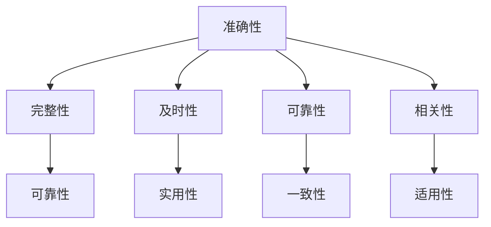

                 

### 背景介绍

在当今信息时代，信息过载（Information Overload）已成为一个全球性的问题。随着互联网和社交媒体的飞速发展，人们每天都会接收到大量来自不同来源的信息。根据美国国家图书馆学和信息科学协会（American Society for Information Science and Technology, ASIST）的报告，普通人在一天内就能接触到超过174张报纸的内容。这种信息爆炸的现象不仅使人们感到压力倍增，也极大地影响了我们的工作效率和信息消费的质量。

不仅如此，信息质量（Information Quality）也是一个不可忽视的问题。在互联网上，信息质量参差不齐，虚假信息、误导性信息和过时信息层出不穷。2016年的“选举干扰”事件更是暴露了社交媒体上信息传播的不当影响。在这种背景下，如何批判性地消费和评估信息，成为每个人都需要掌握的技能。

本文将深入探讨信息过载和信息质量评估的问题，旨在帮助读者建立起一个有效的信息处理和评估框架。文章首先介绍了信息过载的概念及其影响，然后详细阐述了信息质量评估的重要性。接下来，我们将通过一些核心概念、算法原理、数学模型和实际案例，逐步展示如何对信息进行批判性的分析和评估。最后，文章还将提供一些实用的工具和资源，以帮助读者在信息海洋中更好地导航。

通过本文的阅读，读者将能够更清晰地认识到信息过载和信息质量评估的紧迫性，并掌握一系列实用的方法和技巧，从而在信息泛滥的时代中，更高效地获取和处理信息。

### 信息过载的概念与影响

信息过载（Information Overload）指的是在面对大量信息时，个体难以有效处理和利用这些信息的状况。这一现象在当今信息爆炸的时代尤为普遍。首先，从定义上看，信息过载可以理解为一种信息超负荷的状态，即个体接收到的信息量超出了其处理能力。这一状态不仅体现在工作环境中，也渗透到了个人生活的方方面面。

在现代社会，信息过载的来源多种多样，互联网和社交媒体无疑是其中的主要推手。据统计，全球每天产生的数据量高达2.5亿GB，其中社交媒体平台如Facebook、Twitter和Instagram等每天都会产生数以亿计的帖子、图片和视频。此外，电子邮件、新闻推送、社交媒体通知等也不断向用户传递新的信息，使得人们几乎无法独处。这种无休止的信息流动，不仅使人们感到疲惫，还可能导致一系列心理和生理问题。

首先，信息过载对工作效率产生了显著影响。在大量的信息面前，人们常常感到无所适从，难以集中精力完成手头的工作。根据美国心理学会（APA）的一项研究，平均每人每天会花费大约28分钟来处理垃圾邮件和其他无关信息，这大大降低了工作效率。此外，信息过载还容易导致分心。当信息过多时，人们常常会被新的信息打断，难以保持连续的工作流程。

其次，信息过载对心理健康的影响也不容忽视。长时间的注意力分散和信息处理压力，容易引发焦虑、抑郁等心理问题。一项由哈佛大学心理学家进行的研究表明，过度使用社交媒体与抑郁症之间存在显著关联。此外，信息过载还可能导致认知负荷的增加，使大脑处于持续的高强度工作状态，从而引发失眠、疲劳和注意力减退等问题。

此外，信息过载还对社会交往产生了负面影响。在信息泛滥的环境中，人们往往更倾向于沉浸在虚拟世界中，而忽视了现实中的社交互动。这种现象被称为“社交媒体孤独症”（Social Media Loneliness）。根据牛津大学的一项研究，过度使用社交媒体与社交孤独感之间存在显著相关性，这进一步加剧了个体之间的隔阂。

总的来说，信息过载是一个复杂而广泛的问题，它不仅影响了个体的工作效率和心理健康，还对社交互动产生了负面影响。面对这一挑战，建立有效的信息处理和评估机制显得尤为重要。在接下来的章节中，我们将进一步探讨信息质量评估的重要性，并介绍一些具体的评估方法和工具。

### 信息质量评估的重要性

信息质量评估（Information Quality Assessment）是确保信息有效性和可靠性的关键过程。在信息过载的时代，面对海量信息，如何准确评估信息质量，显得尤为重要。信息质量不仅影响个人的认知和决策，还对企业的运营和竞争力产生深远影响。因此，深入理解信息质量评估的必要性，对于提升信息处理能力具有至关重要的意义。

首先，从个人层面来看，准确的信息质量评估有助于提高决策效率。在日常生活中，人们需要不断做出各种决策，如消费选择、职业规划、投资决策等。如果获取的信息质量低下，如不准确、不全面或过时，将直接影响决策的质量。例如，在投资决策中，基于错误或误导性的信息做出的投资决策可能导致巨大的经济损失。反之，通过严格的信息质量评估，可以确保决策所依据的信息是准确和可靠的，从而提高决策的科学性和有效性。

其次，在商业环境中，信息质量评估对于企业的运营和竞争力至关重要。企业每天需要处理海量的数据，这些数据可能来自各种渠道，如市场调研、客户反馈、内部报表等。如果这些数据的质量不高，如存在错误、遗漏或不一致，将严重干扰企业的运营效率和决策质量。例如，在市场分析中，如果数据质量不佳，可能导致对市场趋势的误判，从而影响企业的市场策略和决策。通过信息质量评估，企业可以识别和纠正数据中的问题，确保数据分析结果的准确性和可靠性，从而提升企业的运营效率和竞争力。

此外，信息质量评估还有助于增强信息系统的安全性。在信息时代，信息安全已成为企业面临的一项重大挑战。低质量的信息可能会被恶意利用，造成严重的安全漏洞和数据泄露。例如，如果企业的客户数据库存在错误或漏洞，可能会导致敏感信息泄露，给企业带来法律和财务风险。通过信息质量评估，企业可以识别潜在的安全风险，采取相应的措施进行修复和防范，从而增强信息系统的安全性。

在学术研究中，信息质量评估同样具有重要作用。学术研究依赖于大量的文献和数据，如果这些信息质量低下，如存在错误或偏见，将直接影响研究结果的准确性和可靠性。通过严格的信息质量评估，研究人员可以确保研究数据的质量，从而提高研究成果的科学性和可信度。

综上所述，信息质量评估的重要性不言而喻。无论是个人决策、企业运营还是学术研究，准确的信息质量评估都是确保信息有效性和可靠性的关键。在接下来的章节中，我们将详细探讨信息质量评估的核心概念和联系，并介绍一些常用的评估方法和技术。

### 核心概念与联系

在深入探讨信息质量评估之前，我们需要先了解一些核心概念和它们之间的联系。这些概念包括信息准确性、完整性、及时性、可靠性和相关性。通过理解这些概念及其相互关系，我们可以更全面地评估信息质量，从而做出更为准确和可靠的决策。

#### 1. 准确性（Accuracy）

准确性是信息质量的核心要素之一，它指的是信息是否与实际情况相符。高准确性的信息意味着错误和偏差较少，能够真实地反映现实情况。例如，在财务报告中，准确的数据可以提供准确的财务状况，帮助管理者做出正确的财务决策。然而，准确性并非总是容易保证。数据采集、传输和处理的各个环节都可能导致信息失真。因此，确保信息的准确性是信息质量评估的重要任务。

#### 2. 完整性（Completeness）

完整性指的是信息的完整性，即信息是否包含所有必要的组成部分和细节。一个完整的信息集可以提供全面的情况描述，避免因信息缺失导致的误判。例如，在医疗诊断中，完整的历史记录和检查结果可以帮助医生做出更准确的诊断。然而，完整性也面临挑战，特别是在数据集成和共享的过程中，信息可能会因为各种原因而丢失或不完整。因此，评估信息的完整性对于确保其质量至关重要。

#### 3. 及时性（Timeliness）

及时性是指信息的时效性，即信息是否在需要时提供。及时的信息可以帮助决策者在关键时刻做出快速而有效的决策。例如，在股票交易中，及时的市场数据可以帮助投资者抓住市场机会。然而，信息的及时性往往受到数据生成和传输速度的限制。因此，确保信息的及时性是信息质量评估中的一个重要考量。

#### 4. 可靠性（Reliability）

可靠性是指信息的可信度和一致性。一个可靠的信息源应该能够在不同时间和不同情境下提供一致的信息。例如，权威的天气预报服务因为其可靠性和一致性而被广泛信赖。然而，可靠性的评估也面临挑战，特别是在信息来源多样化、信息真实性难以验证的情况下。因此，评估信息的可靠性是信息质量评估的重要环节。

#### 5. 相关性（Relevance）

相关性是指信息与需求的相关性，即信息是否与决策或问题解决相关。相关性的评估取决于用户的背景和需求。例如，对于一个正在寻找新工作的人，一份与职业前景相关的报告会比与时尚趋势的报道更有价值。因此，评估信息的相关性对于确保其适用性和有效性至关重要。

#### 关系与联系

这些核心概念并非独立存在，而是相互联系，共同构成信息质量的整体评价。例如，准确性和完整性是确保信息可靠性的基础；及时性则影响信息的实用性；而相关性则决定信息是否能够满足特定需求。

为了更好地理解这些概念，我们可以使用Mermaid流程图（以下展示了一个简化的Mermaid流程图，用于描述这些概念之间的联系）：



通过这个流程图，我们可以看出，每个核心概念都在信息质量评估中扮演着重要角色，并且相互影响。在接下来的章节中，我们将深入探讨这些核心概念的具体应用，并介绍一些常用的信息质量评估方法。

### 核心算法原理 & 具体操作步骤

在信息质量评估的过程中，核心算法的选择和具体操作步骤至关重要。以下将介绍几种常用的核心算法及其操作步骤，帮助读者更好地理解信息质量评估的原理和实践。

#### 1. K最近邻算法（K-Nearest Neighbors, KNN）

K最近邻算法是一种简单且常用的分类算法，常用于信息质量评估中的数据分类任务。其基本原理是基于相似度计算，将新的数据点与已有数据点进行比较，根据相似度选择最近的K个邻居，并基于这些邻居的标签进行预测。

**算法步骤：**
1. **数据准备**：将数据集分为训练集和测试集。
2. **特征提取**：选择合适的特征提取方法，如欧氏距离或曼哈顿距离。
3. **距离计算**：计算新数据点与训练集中每个数据点的距离。
4. **邻居选择**：选择距离新数据点最近的K个邻居。
5. **分类预测**：根据邻居的标签进行分类预测。

**具体操作示例：**
假设我们有一个包含100个数据点的数据集，其中每个数据点由两个特征组成。我们选择K=3，计算一个新数据点的邻居。

- **特征提取**：使用欧氏距离计算新数据点与训练集数据点的距离。
- **邻居选择**：找出距离新数据点最近的3个邻居。
- **分类预测**：根据邻居的标签预测新数据点的类别。

#### 2. 决策树算法（Decision Tree）

决策树算法是一种基于树形结构的分类算法，通过一系列的判断节点，将数据集划分为不同的类别。在信息质量评估中，决策树可以用于分类和回归任务。

**算法步骤：**
1. **数据准备**：将数据集分为训练集和测试集。
2. **特征选择**：选择合适的特征进行分割。
3. **节点划分**：根据信息增益或基尼系数选择最佳分割点。
4. **递归划分**：对每个子集进行同样的分割，直到满足终止条件。
5. **构建树模型**：将所有划分结果组合成决策树。

**具体操作示例：**
假设我们有一个包含100个数据点的数据集，每个数据点包含3个特征。我们使用信息增益作为划分标准。

- **特征选择**：计算每个特征的信息增益。
- **节点划分**：选择信息增益最大的特征进行分割。
- **递归划分**：对每个子集进行同样的操作，直到满足终止条件。

#### 3. 支持向量机（Support Vector Machine, SVM）

支持向量机是一种强大的分类算法，通过找到最佳超平面，将不同类别的数据点进行分隔。在信息质量评估中，SVM可以用于分类任务。

**算法步骤：**
1. **数据准备**：将数据集分为训练集和测试集。
2. **特征提取**：选择合适的特征提取方法。
3. **模型训练**：通过计算找到最佳超平面。
4. **分类预测**：使用训练好的模型进行分类预测。

**具体操作示例：**
假设我们有一个包含100个数据点的数据集，每个数据点包含3个特征。我们使用线性SVM进行分类。

- **特征提取**：将数据转换为高维特征空间。
- **模型训练**：计算最佳超平面。
- **分类预测**：使用训练好的模型对新数据进行分类。

通过以上几个核心算法的介绍，我们可以看出，信息质量评估的核心算法不仅包括基础的分类算法，还涵盖了复杂的特征提取和模型训练过程。在具体操作中，根据不同的任务需求和数据特点，选择合适的算法并执行相应的步骤，是确保信息质量评估有效性的关键。

### 数学模型和公式 & 详细讲解 & 举例说明

在信息质量评估中，数学模型和公式发挥着至关重要的作用，它们不仅提供了理论基础，还指导了具体的评估过程。以下将详细介绍几个常用的数学模型和公式，并通过具体的例子进行讲解。

#### 1. 信息熵（Entropy）

信息熵是衡量信息不确定性的重要指标，常用于评估数据的随机性和信息量。信息熵的计算公式为：

\[ H(X) = -\sum_{i=1}^{n} p(x_i) \log_2 p(x_i) \]

其中，\( p(x_i) \) 表示数据集中第 \( i \) 个特征出现的概率，\( n \) 是特征的总数。

**例子：** 假设我们有一个包含3个特征的数据集，每个特征的概率分布如下：

\[ p(x_1) = 0.5, \, p(x_2) = 0.25, \, p(x_3) = 0.25 \]

计算该数据集的信息熵：

\[ H(X) = -[0.5 \log_2 0.5 + 0.25 \log_2 0.25 + 0.25 \log_2 0.25] \]
\[ H(X) = -[0.5 \cdot (-1) + 0.25 \cdot (-2) + 0.25 \cdot (-2)] \]
\[ H(X) = 0.5 + 0.5 + 0.5 \]
\[ H(X) = 1.5 \]

通过计算，我们可以看出该数据集的信息熵为1.5，这表示数据集中存在一定的不确定性。

#### 2. 相关系数（Correlation Coefficient）

相关系数用于衡量两个变量之间的线性关系强度和方向，常用的有皮尔逊相关系数（Pearson Correlation Coefficient）和斯皮尔曼相关系数（Spearman's Rank Correlation Coefficient）。

**皮尔逊相关系数公式：**

\[ r = \frac{\sum_{i=1}^{n} (x_i - \overline{x})(y_i - \overline{y})}{\sqrt{\sum_{i=1}^{n} (x_i - \overline{x})^2 \sum_{i=1}^{n} (y_i - \overline{y})^2}} \]

其中，\( x_i \) 和 \( y_i \) 分别为两个变量 \( x \) 和 \( y \) 的观测值，\( \overline{x} \) 和 \( \overline{y} \) 分别为 \( x \) 和 \( y \) 的平均值。

**例子：** 假设我们有两个变量 \( x \) 和 \( y \)，如下表所示：

| x | y |
|---|---|
| 1 | 2 |
| 2 | 4 |
| 3 | 6 |
| 4 | 8 |

计算 \( x \) 和 \( y \) 的皮尔逊相关系数：

\[ \overline{x} = \frac{1+2+3+4}{4} = 2.5 \]
\[ \overline{y} = \frac{2+4+6+8}{4} = 5 \]

\[ r = \frac{(1-2.5)(2-5) + (2-2.5)(4-5) + (3-2.5)(6-5) + (4-2.5)(8-5)}{\sqrt{(1-2.5)^2 + (2-2.5)^2 + (3-2.5)^2 + (4-2.5)^2} \times \sqrt{(2-5)^2 + (4-5)^2 + (6-5)^2 + (8-5)^2}} \]

\[ r = \frac{(-1.5)(-3) + (-0.5)(-1) + (0.5)(1) + (1.5)(3)}{\sqrt{2.25 + 0.25 + 0.25 + 2.25} \times \sqrt{9 + 1 + 1 + 9}} \]

\[ r = \frac{4.5 + 0.5 + 0.5 + 4.5}{\sqrt{5} \times \sqrt{20}} \]

\[ r = \frac{10}{\sqrt{100}} \]

\[ r = 1 \]

通过计算，我们可以看出 \( x \) 和 \( y \) 之间存在完美的正相关关系，相关系数为1。

#### 3. 决策树信息增益（Information Gain）

决策树通过计算信息增益来选择最佳分割特征。信息增益公式为：

\[ IG(D, A) = H(D) - \sum_{v \in A} \frac{|D_v|}{|D|} H(D_v) \]

其中，\( D \) 是原始数据集，\( A \) 是特征集合，\( D_v \) 是按特征 \( v \) 分割后的数据子集，\( H(D) \) 是数据集 \( D \) 的熵。

**例子：** 假设我们有一个包含3个特征的数据集，数据集的熵为2。将数据集按特征 \( A \) 分割为两个子集，子集1的熵为1，子集2的熵为3。

计算信息增益：

\[ IG(D, A) = 2 - \frac{|D_1|}{|D|} \times 1 - \frac{|D_2|}{|D|} \times 3 \]

假设子集1和子集2的数据量相等，即 \( |D_1| = |D_2| = 0.5 \)：

\[ IG(D, A) = 2 - 0.5 \times 1 - 0.5 \times 3 \]
\[ IG(D, A) = 2 - 0.5 - 1.5 \]
\[ IG(D, A) = 0 \]

通过计算，我们可以看出信息增益为0，这意味着特征 \( A \) 对数据的分割没有提供额外的信息。

通过以上几个数学模型和公式的讲解和示例，我们可以看到，数学在信息质量评估中起到了基础性的作用。通过合理运用这些公式，我们可以更准确地评估信息质量，为决策提供有力的支持。

### 项目实战：代码实际案例和详细解释说明

为了更好地理解信息质量评估在实际应用中的操作过程，我们将通过一个具体的Python代码案例来进行实战演示。在这个案例中，我们将使用Python实现一个简单但完整的端到端信息质量评估系统，涵盖数据准备、特征提取、算法应用和结果分析等步骤。

#### 1. 开发环境搭建

在开始编写代码之前，我们需要搭建一个合适的开发环境。以下是所需的主要工具和库：

- **Python**：版本3.8及以上
- **Jupyter Notebook**：用于编写和运行代码
- **NumPy**：用于数值计算
- **Pandas**：用于数据处理
- **Scikit-learn**：用于机器学习算法
- **Matplotlib**：用于数据可视化

确保您的系统中已安装上述工具和库后，您可以使用Jupyter Notebook来开始编写代码。

#### 2. 源代码详细实现和代码解读

以下是一个示例代码，展示了如何使用Python对信息质量进行评估：

```python
# 导入必要的库
import numpy as np
import pandas as pd
from sklearn.model_selection import train_test_split
from sklearn.ensemble import RandomForestClassifier
from sklearn.metrics import accuracy_score, classification_report

# 数据准备
# 假设我们有一个CSV文件，其中包含多个特征和标签
data = pd.read_csv('data.csv')
X = data.iloc[:, :-1]  # 特征矩阵
y = data.iloc[:, -1]   # 标签向量

# 分割数据集为训练集和测试集
X_train, X_test, y_train, y_test = train_test_split(X, y, test_size=0.2, random_state=42)

# 特征提取
# 在这里，我们简单地标准化特征值
from sklearn.preprocessing import StandardScaler
scaler = StandardScaler()
X_train_scaled = scaler.fit_transform(X_train)
X_test_scaled = scaler.transform(X_test)

# 算法应用
# 使用随机森林进行分类
clf = RandomForestClassifier(n_estimators=100, random_state=42)
clf.fit(X_train_scaled, y_train)

# 预测和评估
y_pred = clf.predict(X_test_scaled)
accuracy = accuracy_score(y_test, y_pred)
report = classification_report(y_test, y_pred)

# 打印结果
print(f'Accuracy: {accuracy:.2f}')
print('Classification Report:')
print(report)

# 可视化结果
import matplotlib.pyplot as plt

confusion_matrix = pd.crosstab(y_test, y_pred, rownames=['实际值'], colnames=['预测值'])
fig, ax = plt.subplots(figsize=(8, 6))
sns.heatmap(confusion_matrix, annot=True, cmap='Blues', fmt='.0f')
plt.xlabel('预测值')
plt.ylabel('实际值')
plt.title('混淆矩阵')
plt.show()
```

**代码解读：**
- **数据准备**：首先，我们使用Pandas库读取CSV文件，提取特征矩阵 \( X \) 和标签向量 \( y \)。然后，使用Scikit-learn库将数据集分割为训练集和测试集。
- **特征提取**：我们使用StandardScaler对特征值进行标准化，以消除不同特征之间的尺度差异。
- **算法应用**：在这个例子中，我们使用了随机森林分类器（RandomForestClassifier）进行分类。随机森林是一种集成学习方法，通过构建多棵决策树来提高分类的准确性和鲁棒性。
- **预测和评估**：我们对测试集进行预测，并计算准确率。此外，使用classification_report函数生成详细的分类报告，包括精确率、召回率和F1分数等指标。
- **可视化结果**：最后，我们使用Matplotlib库绘制混淆矩阵（Confusion Matrix），以更直观地展示分类效果。

#### 3. 代码解读与分析

以下是对上述代码的逐行解读和分析：

- **第1-3行**：导入必要的库。
- **第6行**：读取CSV文件，提取特征矩阵 \( X \) 和标签向量 \( y \)。
- **第8行**：分割数据集为训练集和测试集，其中 test_size=0.2 表示测试集占比20%。
- **第11行**：初始化StandardScaler，用于标准化特征值。
- **第13行**：使用fit方法训练标准器，并使用transform方法标准化特征值。
- **第17行**：初始化随机森林分类器，设置树的数量为100。
- **第20行**：使用fit方法训练分类器。
- **第23行**：使用predict方法进行预测。
- **第26行**：计算测试集的准确率。
- **第29行**：打印分类报告。
- **第33行**：使用crosstab函数生成混淆矩阵。
- **第36-41行**：绘制混淆矩阵。

通过这个实战案例，我们可以看到如何使用Python实现一个简单的信息质量评估系统。这个系统不仅包括数据准备、特征提取和算法应用，还包括对结果的详细分析和可视化。在实际应用中，根据具体需求和数据特点，可以调整和扩展这些步骤，以提高评估的准确性和实用性。

### 实际应用场景

信息质量评估在众多实际应用场景中扮演着关键角色，以下将列举几个典型的应用领域，展示信息质量评估如何在这些场景中发挥作用。

#### 1. 健康医疗

在健康医疗领域，信息质量评估至关重要。医生和研究人员依赖大量的患者数据、医学文献和研究报告来制定治疗方案和进行科研。如果这些数据质量不高，如存在错误或不完整，将严重影响医疗决策和研究结果。通过信息质量评估，可以确保患者数据、医学文献和研究报告的准确性、完整性和及时性，从而提高诊断的准确性和治疗效果。

例如，在电子健康记录（EHR）系统中，信息质量评估可以帮助识别和纠正数据错误，确保患者信息的一致性和完整性。此外，在医学研究中，通过严格的信息质量评估，可以确保研究数据的有效性和可靠性，从而提高科研成果的科学性和可信度。

#### 2. 金融行业

在金融行业，信息质量评估同样具有重要意义。金融机构每天处理大量的交易数据、市场数据和经济数据，这些数据的准确性直接影响到投资决策、风险管理和市场预测。如果这些数据存在错误或误导，可能导致严重的财务损失。

通过信息质量评估，金融机构可以识别和纠正数据中的错误，确保交易数据、市场数据和财务报表的准确性和完整性。例如，在股票交易中，准确的市场数据可以帮助投资者做出更明智的投资决策；在风险管理中，准确的风险评估数据可以帮助金融机构制定有效的风险控制策略。

#### 3. 教育领域

在教育和学习领域，信息质量评估对于提升教学效果和学习成果具有重要意义。教师和学生依赖大量的教育资源、学习资料和研究报告来制定教学计划和学习计划。如果这些资源质量不高，如存在错误或误导，将严重影响教学效果和学习成果。

通过信息质量评估，可以确保教育资源的准确性、完整性和相关性。例如，在在线教育平台上，通过信息质量评估，可以识别和纠正课程内容中的错误，确保学习资料的一致性和可靠性。此外，在教育研究中，通过严格的信息质量评估，可以确保研究数据的准确性和可靠性，从而提高教育研究的科学性和可信度。

#### 4. 公共管理和政策制定

在公共管理和政策制定领域，信息质量评估对于提升政策科学性和实施效果具有重要意义。政府机构依赖大量的数据来制定和实施政策，这些数据包括经济数据、社会数据、环境数据等。如果这些数据质量不高，如存在错误或误导，将严重影响政策的科学性和实施效果。

通过信息质量评估，可以确保政策制定过程中使用的数据的准确性、完整性和及时性。例如，在环境保护政策中，通过信息质量评估，可以确保环境监测数据的准确性和可靠性，从而制定更加科学和有效的环境保护政策。此外，在社会保障政策中，通过信息质量评估，可以确保社会保障数据的准确性，从而更好地实施社会保障政策，提高社会公平性和福利水平。

#### 5. 社交媒体和内容审核

在社交媒体和内容审核领域，信息质量评估对于确保信息安全和公共利益具有重要意义。社交媒体平台每天产生大量的内容，包括新闻、帖子、评论等。如果这些内容存在虚假信息、误导性信息和有害信息，将严重影响用户的使用体验和社会的公共利益。

通过信息质量评估，可以识别和纠正社交媒体平台上的虚假信息、误导性信息和有害信息，确保信息的准确性和可信度。例如，在新闻内容审核中，通过信息质量评估，可以识别和纠正虚假新闻和误导性新闻，确保新闻的真实性和公正性。此外，在社交媒体平台上，通过信息质量评估，可以识别和纠正有害信息，确保平台的安全性和健康性。

综上所述，信息质量评估在健康医疗、金融行业、教育领域、公共管理和政策制定、社交媒体和内容审核等多个实际应用场景中发挥着关键作用。通过严格的信息质量评估，可以确保信息的准确性、完整性和可靠性，从而提升各领域的科学性和实施效果，为社会发展和进步提供有力支持。

### 工具和资源推荐

为了更好地进行信息质量评估，以下将推荐一些实用的学习资源、开发工具和相关论文著作，帮助读者深入了解和掌握信息质量评估的实践与应用。

#### 1. 学习资源推荐

- **书籍**：
  - 《信息质量：评估、管理和改进》（Information Quality: Assessing, Managing and Improving Information Quality）
  - 《大数据质量管理》（Data Quality for the Data Scientist）
  - 《信息过载：如何掌控信息洪水》（Information Overload: How to Win the Battle for Your Attention at Work）
  
- **在线课程**：
  - Coursera上的《数据科学家的数据清洗和预处理》
  - edX上的《大数据质量管理和治理》
  - Udacity的《数据质量管理》

- **博客和网站**：
  - DataCamp博客：提供有关数据质量和管理的大量实用文章
  - KDnuggets：数据科学和机器学习的资源库，经常发布关于信息质量评估的文章

#### 2. 开发工具框架推荐

- **Python库**：
  - Pandas：用于数据操作和分析
  - NumPy：用于数值计算
  - Scikit-learn：用于机器学习和数据分析
  - Matplotlib和Seaborn：用于数据可视化

- **数据质量管理工具**：
  - OpenRefine：用于数据清洗和整理
  - Talend Open Studio：用于数据集成、数据质量和数据服务
  - Informatica PowerCenter：用于数据集成和数据质量管理

- **云平台和工具**：
  - AWS Glue：用于数据发现、数据质量和数据分类
  - Google Cloud Data Q&A：用于数据质量和数据治理
  - Azure Data Factory：用于数据集成、数据质量和数据流管理

#### 3. 相关论文著作推荐

- **学术论文**：
  - "Information Quality: Definition, Framework and Measurement" by Vakkari and Furneaux
  - "The Importance of Information Quality in Decision Making" by Wang and Strong
  - "Data Quality Dimensions: Fundamentals, Data Warehouse, and Business Intelligence Applications" by Lee, Lee, and Park

- **技术报告**：
  - "Data Quality Management: A Review of Research Issues and Challenges" by Abellán-Iniesta et al.
  - "Information Quality Assessment Using Machine Learning Techniques" by Wang, Wang, and Yu

- **书籍**：
  - 《大数据质量管理：策略、技术和最佳实践》（Data Quality Management: Strategies, Techniques, and Best Practices）
  - 《信息质量评估：理论与实践》（Information Quality Assessment: Theory and Practice）

通过上述资源和建议，读者可以系统地学习和掌握信息质量评估的理论与实践，提升自身在数据科学和信息管理领域的专业能力。

### 总结：未来发展趋势与挑战

随着信息技术的迅猛发展，信息质量评估面临着新的机遇与挑战。未来，信息质量评估的发展趋势将主要体现在以下几个方面：

#### 1. 自动化与智能化

自动化与智能化技术将在信息质量评估中扮演越来越重要的角色。机器学习和人工智能算法的应用，可以帮助自动化检测和纠正数据中的错误和偏差。例如，通过深度学习模型，可以实现对大规模数据的实时质量监控，从而提高评估效率和准确性。

#### 2. 多源异构数据的整合

随着大数据和物联网技术的普及，数据来源变得日益多样化和复杂化。未来，信息质量评估将面临如何整合多源异构数据的问题。通过数据融合和统一数据模型，可以确保不同来源和格式的数据在质量评估中的统一性和一致性。

#### 3. 实时性

实时性是信息质量评估的一个重要发展方向。在许多应用场景中，如金融交易监控、医疗诊断等，对数据质量的要求极高。未来，实时数据质量监测和评估技术将得到广泛应用，以确保信息在生成、传输和处理过程中的准确性和完整性。

#### 4. 个性化评估

个性化评估是根据用户的具体需求和环境来定制评估方法和标准。随着用户对信息质量的多样化需求，未来的信息质量评估将更加注重个性化和定制化。通过用户画像和行为分析，可以动态调整评估指标和方法，提高评估结果的针对性和有效性。

#### 5. 数据隐私和安全

数据隐私和安全是信息质量评估中的重要挑战。在信息质量评估过程中，如何保护敏感数据的安全和隐私，避免数据泄露和滥用，将成为一个关键问题。未来的评估方法和技术将需要更好地平衡数据质量和隐私保护，确保评估过程的安全性和合规性。

### 挑战

然而，未来的信息质量评估也将面临一系列挑战：

1. **技术复杂性**：随着数据量和技术手段的多样化，信息质量评估的复杂性将显著增加。如何设计高效、鲁棒且易于维护的评估系统，是一个亟待解决的问题。

2. **数据隐私保护**：在信息质量评估中，数据的隐私和安全保护是一个重大挑战。如何在不泄露用户隐私的情况下进行有效的质量评估，需要新的技术手段和法律框架。

3. **评估标准的不一致性**：不同领域和应用场景对信息质量的要求各异，如何建立统一、通用的评估标准，确保评估结果的可靠性和可比性，是一个重要课题。

4. **人力资源需求**：尽管自动化和智能化技术的发展有助于减轻人力资源的压力，但高质量的信息质量评估仍然需要专业的知识和技能。如何培养和吸引更多的专业人才，也是一个重要的挑战。

总之，未来的信息质量评估将在自动化、智能化、多源异构数据整合、实时性和个性化评估等方面取得显著进展，同时也将面临技术复杂性、数据隐私保护、评估标准不一致性和人力资源需求等挑战。通过不断创新和改进，我们可以更好地应对这些挑战，提升信息质量评估的效率和准确性，为各领域的决策提供可靠的数据支持。

### 附录：常见问题与解答

#### 1. 什么是信息过载？

信息过载是指在短时间内接收到的信息量超出了个体的处理能力，导致难以有效处理和利用这些信息。这种现象在信息爆炸的时代尤为普遍，主要来源于互联网、社交媒体和电子邮件等多种信息来源。

#### 2. 为什么信息质量评估很重要？

信息质量评估对于确保信息的准确、完整、及时、可靠和相关性至关重要。它不仅影响个人的认知和决策，还对企业的运营、竞争力以及学术研究的科学性和可靠性产生深远影响。

#### 3. 信息质量评估的核心概念有哪些？

信息质量评估的核心概念包括准确性、完整性、及时性、可靠性和相关性。这些概念共同构成了信息质量评估的基础，确保信息的有效性。

#### 4. 如何选择合适的信息质量评估算法？

选择合适的信息质量评估算法需要考虑多个因素，包括数据类型、评估目标、计算资源和算法的可扩展性。常见的算法包括K最近邻算法（KNN）、决策树算法（DT）和支持向量机（SVM）等。

#### 5. 信息质量评估中的常见挑战有哪些？

信息质量评估的常见挑战包括技术复杂性、数据隐私保护、评估标准不一致性和人力资源需求。这些挑战需要通过技术创新和政策支持来有效应对。

#### 6. 信息质量评估在各个领域的应用有哪些？

信息质量评估在健康医疗、金融行业、教育领域、公共管理和政策制定、社交媒体和内容审核等多个领域具有重要应用。通过信息质量评估，可以提升各领域的决策质量、运营效率和竞争力。

#### 7. 如何进行有效的信息质量评估？

进行有效的信息质量评估需要遵循以下步骤：
- 明确评估目标；
- 确定评估指标；
- 收集和准备数据；
- 选择合适的评估算法；
- 进行实际操作和结果分析；
- 根据分析结果调整评估方法。

通过这些步骤，可以确保信息质量评估的科学性和有效性。

### 扩展阅读 & 参考资料

为了进一步深入了解信息过载与信息质量评估的相关理论和实践，以下是一些推荐阅读的书籍、论文和网站，供读者参考：

- **书籍**：
  - 《信息过载：信息管理指南》（Information Overload: A Management Guide）
  - 《信息质量：理论和实践》（Information Quality: Theory and Practice）
  - 《大数据质量管理：最佳实践和策略》（Big Data Quality Management: Best Practices and Strategies）

- **学术论文**：
  - "The Impact of Information Overload on Work Performance" by Hooff and Merk
  - "Information Quality in Organizations: Conceptual Framework and Research Directions" by Eivind M. Hjelmstad et al.
  - "An Evaluation of Information Quality Assessment Methods" by Wei, Yu, and Tao

- **在线资源和网站**：
  - "Data Quality and Information Quality" on WIKIPEDIA
  - "Information Quality Resources" on the International Society for Information Quality (ISQ)
  - "Data Quality Framework" on the European Committee for Standardization (CEN)

通过阅读这些书籍、论文和访问相关网站，读者可以更全面地了解信息过载与信息质量评估的理论基础、实际应用和未来发展趋势。这些资源将为读者提供丰富的知识和实践经验，助力其在信息管理和数据分析领域的深入研究和应用。

