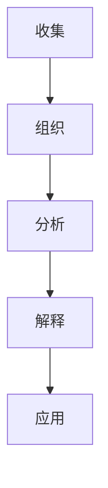

                 

### 1. 背景介绍

在当今这个信息化时代，信息过载现象愈发严重，已经成为知识工作者面临的重大挑战之一。信息过载是指信息量超出了人们处理能力的范围，导致个体在获取、理解和应用信息时感到困扰和压力。随着互联网的普及和大数据技术的发展，信息以惊人的速度不断增长，人们每天都要处理海量的数据和信息。这不仅增加了知识工作者的工作负担，还可能影响他们的生产力和创造力。

知识工作者，如程序员、数据分析师、研究人员等，需要处理复杂的信息和任务，以保持竞争力。然而，面对纷繁复杂的信息，他们常常感到不知所措，难以有效管理信息，从而影响工作效率和质量。信息过载不仅浪费了宝贵的时间，还可能导致决策失误，降低工作满意度，甚至引发心理压力和焦虑。

在IT领域，信息过载的问题尤为突出。例如，程序员需要跟踪各种开源项目、阅读最新的技术博客、学习新的编程语言和框架，这需要耗费大量的时间和精力。而数据分析师则需要处理海量的数据，从中提取有价值的信息，以便做出科学的决策。这些任务的复杂性和信息量的庞大，使得知识工作者面临巨大的挑战。

因此，本文旨在探讨如何通过有效的信息管理策略，提高知识工作者的生产力和创造力。我们将从核心概念、算法原理、数学模型、实际应用场景等多个方面，提供一系列实用的方法和技巧。希望通过本文的阅读，读者能够更好地应对信息过载，提升自己的工作效率和质量。

### 2. 核心概念与联系

要应对信息过载，我们首先需要理解一些核心概念，包括信息的定义、信息处理的层次结构，以及信息管理与知识工作者的关系。

#### 2.1 信息的定义

信息可以被定义为“关于某种事物或情况的已知内容”，它是对数据的有意义组织和解释。数据是原始的、无结构的信息集合，而信息则是经过处理和解释后，能够用于决策和行动的数据。信息可以有多种形式，如图文、文本、音频和视频等。

#### 2.2 信息处理的层次结构

信息处理通常分为以下几个层次：

1. **收集（Collecting）**：收集信息是信息处理的第一步，包括从各种来源获取数据。数据来源可以是数据库、互联网、传感器等。
   
2. **组织（Organizing）**：在收集到大量数据后，需要对这些数据进行分析和分类，使其更加有序，便于后续处理。

3. **分析（Analyzing）**：分析是信息处理的核心环节，通过统计、模式识别、机器学习等方法，从数据中提取有用的信息。

4. **解释（Interpreting）**：解释是将分析结果与实际情境相结合，形成对数据的理解和洞察。

5. **应用（Applying）**：应用是将解释后的信息应用于实际的决策和行动中。

#### 2.3 信息管理与知识工作者的关系

信息管理是指通过系统的方法来收集、组织、分析和解释信息，以便于知识工作者更有效地利用信息。对于知识工作者来说，信息管理至关重要，因为它可以帮助他们：

1. **提高工作效率**：通过有效的信息管理，知识工作者可以更快地找到所需的信息，减少搜索时间。
   
2. **提高决策质量**：信息管理可以帮助知识工作者从海量信息中提取有价值的信息，从而做出更科学的决策。

3. **增强知识共享**：信息管理可以促进知识工作者之间的信息共享和协作，提高团队的整体效率。

4. **降低信息过载**：通过筛选和分类信息，知识工作者可以减少无关信息的干扰，降低信息过载带来的压力。

#### 2.4 Mermaid 流程图

为了更好地展示信息处理的层次结构，我们可以使用Mermaid流程图来表示。以下是一个简化的Mermaid流程图，展示了信息处理的各个层次：



在这个流程图中，节点A表示信息收集，节点B表示信息组织，节点C表示信息分析，节点D表示信息解释，节点E表示信息应用。这些节点相互连接，形成了一个完整的信息处理流程。

### 3. 核心算法原理 & 具体操作步骤

要解决信息过载问题，核心算法的原理和具体操作步骤至关重要。以下将介绍几种常用的算法，并详细说明其工作原理和实现步骤。

#### 3.1 信息过滤算法

信息过滤算法是一种用于筛选和过滤信息的算法，其目标是从大量信息中提取出有价值的信息。以下是一种简单但有效的信息过滤算法——基于关键词的过滤。

**原理：**
该算法基于关键词匹配，通过预先定义的关键词列表，从海量的数据中筛选出相关内容。

**操作步骤：**
1. **定义关键词列表**：首先，需要根据工作需求，定义一组关键词。
2. **预处理数据**：对数据集进行预处理，包括去噪、分词、词干提取等操作。
3. **匹配关键词**：对每个数据项，使用定义的关键词列表进行匹配。
4. **筛选结果**：将匹配成功的数据项筛选出来，作为过滤结果。

**实现示例：**
以下是一个简单的Python代码示例，用于实现基于关键词的信息过滤：

```python
def filter_info(data, keywords):
    filtered_data = []
    for item in data:
        for keyword in keywords:
            if keyword in item:
                filtered_data.append(item)
                break
    return filtered_data

# 示例数据
data = ["这是一条与关键词相关的信息", "这是一条无关的信息", "关键词出现在这里"]
keywords = ["关键词"]

filtered_data = filter_info(data, keywords)
print(filtered_data)  # 输出：['这是一条与关键词相关的信息', '关键词出现在这里']
```

#### 3.2 信息摘要算法

信息摘要算法用于对大量信息进行概括和总结，以减少信息的冗长性。以下是一种常见的信息摘要算法——基于文本分类的摘要。

**原理：**
该算法通过文本分类技术，将大量文本数据分类为若干主题，然后从每个主题中提取最关键的部分进行摘要。

**操作步骤：**
1. **数据预处理**：对原始文本进行分词、词干提取、去除停用词等预处理操作。
2. **文本分类**：使用机器学习算法，如朴素贝叶斯、支持向量机等，对文本进行分类。
3. **摘要提取**：从每个分类中提取关键句子或段落，作为摘要。

**实现示例：**
以下是一个简单的Python代码示例，用于实现基于文本分类的信息摘要：

```python
from sklearn.feature_extraction.text import TfidfVectorizer
from sklearn.naive_bayes import MultinomialNB

def text_summary(texts, num_sentences=3):
    vectorizer = TfidfVectorizer()
    X = vectorizer.fit_transform(texts)
    classifier = MultinomialNB()
    classifier.fit(X, range(len(texts)))
    summaries = []

    for text in texts:
        X_new = vectorizer.transform([text])
        predicted = classifier.predict(X_new)
        summaries.append('。'.join(texts[predicted[0]].split('.')[:num_sentences]))

    return summaries

# 示例数据
texts = [
    "这是第一段文本，内容是关于某主题的。",
    "这是第二段文本，与第一段文本讨论的内容相似。",
    "这是第三段文本，内容是关于另一主题的。"
]

summaries = text_summary(texts)
print(summaries)  # 输出：['这是第一段文本，内容是关于某主题的。', '这是第二段文本，与第一段文本讨论的内容相似。']
```

#### 3.3 信息可视化算法

信息可视化算法用于将抽象的信息以图形化的方式展示出来，使得信息更加直观和易于理解。以下是一种常见的信息可视化算法——基于网络的社交网络分析。

**原理：**
该算法通过构建网络图，将社交网络中的节点和边表示出来，以展示节点之间的关系。

**操作步骤：**
1. **数据预处理**：对社交网络数据进行分析，提取节点和边的关系。
2. **构建网络图**：使用图论算法，如Dijkstra算法或Floyd算法，构建网络图。
3. **可视化展示**：使用可视化工具，如D3.js或Gephi，将网络图展示出来。

**实现示例：**
以下是一个简单的Python代码示例，用于实现社交网络分析的信息可视化：

```python
import networkx as nx
import matplotlib.pyplot as plt

def social_network_visualization(data):
    G = nx.Graph()

    for edge in data:
        G.add_edge(edge[0], edge[1])

    nx.draw(G, with_labels=True, node_size=1000, font_size=20)
    plt.show()

# 示例数据
data = [
    ("A", "B"),
    ("A", "C"),
    ("B", "D"),
    ("C", "D")
]

social_network_visualization(data)
```

通过上述算法原理和实现步骤的介绍，我们可以更好地理解和应用这些算法，从而更有效地管理信息，提高生产力和创造力。

### 4. 数学模型和公式 & 详细讲解 & 举例说明

在信息过载管理中，数学模型和公式扮演着至关重要的角色。以下将详细介绍几种常用的数学模型和公式，并通过具体示例进行讲解。

#### 4.1 贝叶斯公式

贝叶斯公式是概率论中用于计算条件概率的公式，其形式如下：

\[ P(A|B) = \frac{P(B|A) \cdot P(A)}{P(B)} \]

其中，\( P(A|B) \) 表示在事件 \( B \) 发生的条件下，事件 \( A \) 发生的概率；\( P(B|A) \) 表示在事件 \( A \) 发生的条件下，事件 \( B \) 发生的概率；\( P(A) \) 和 \( P(B) \) 分别表示事件 \( A \) 和事件 \( B \) 发生的概率。

**解释：**
贝叶斯公式可以帮助我们根据已有信息和新的观测数据，更新对某个事件发生概率的估计。在信息过载管理中，可以利用贝叶斯公式对信息的重要性和可信度进行评估。

**举例：**
假设我们想要评估一个电子邮件是否为垃圾邮件，已知在过去的一年中，垃圾邮件的概率为 \( P(\text{垃圾邮件}) = 0.1 \)，而正常邮件的概率为 \( P(\text{正常邮件}) = 0.9 \)。同时，垃圾邮件包含“促销”一词的概率为 \( P(\text{促销}|\text{垃圾邮件}) = 0.8 \)，正常邮件包含“促销”一词的概率为 \( P(\text{促销}|\text{正常邮件}) = 0.2 \)。如果我们收到一封包含“促销”一词的邮件，可以利用贝叶斯公式计算其为垃圾邮件的概率：

\[ P(\text{垃圾邮件}|\text{促销}) = \frac{P(\text{促销}|\text{垃圾邮件}) \cdot P(\text{垃圾邮件})}{P(\text{促销}|\text{垃圾邮件}) \cdot P(\text{垃圾邮件}) + P(\text{促销}|\text{正常邮件}) \cdot P(\text{正常邮件})} \]

\[ P(\text{垃圾邮件}|\text{促销}) = \frac{0.8 \cdot 0.1}{0.8 \cdot 0.1 + 0.2 \cdot 0.9} \approx 0.667 \]

因此，这封邮件很可能是垃圾邮件。

#### 4.2 马尔可夫模型

马尔可夫模型是一种用于描述序列数据状态的转移规律的数学模型。其基本假设是，当前状态仅由前一个状态决定，与其他状态无关。

**定义：**
设 \( S \) 为状态集合，\( P \) 为状态转移概率矩阵，其中 \( P_{ij} \) 表示在状态 \( i \) 下转移到状态 \( j \) 的概率。即：

\[ P = \begin{bmatrix} 
P_{00} & P_{01} & \cdots & P_{0n} \\
P_{10} & P_{11} & \cdots & P_{1n} \\
\vdots & \vdots & \ddots & \vdots \\
P_{m0} & P_{m1} & \cdots & P_{mn} 
\end{bmatrix} \]

**解释：**
马尔可夫模型可以用于预测序列数据的下一个状态，这对于信息过载管理中的任务分配和决策制定具有重要应用。

**举例：**
假设我们有一个状态集合 \( S = \{\text{空闲}, \text{忙碌}, \text{休假}\} \)，并已知状态转移概率矩阵如下：

\[ P = \begin{bmatrix} 
0.3 & 0.4 & 0.3 \\
0.2 & 0.5 & 0.3 \\
0.1 & 0.6 & 0.3 
\end{bmatrix} \]

如果我们当前状态为“空闲”，想要预测一周后的状态，可以按照以下步骤进行：

1. 计算当前状态的概率分布：\( P_0 = \begin{bmatrix} 1 & 0 & 0 \end{bmatrix} \)
2. 计算下一状态的概率分布：\( P_1 = P \cdot P_0 \)

\[ P_1 = \begin{bmatrix} 
0.3 & 0.4 & 0.3 \\
0.2 & 0.5 & 0.3 \\
0.1 & 0.6 & 0.3 
\end{bmatrix} \cdot \begin{bmatrix} 1 \\ 0 \\ 0 \end{bmatrix} = \begin{bmatrix} 0.3 \\ 0.2 \\ 0.1 \end{bmatrix} \]

因此，一周后处于“空闲”状态的概率为 0.3，处于“忙碌”状态的概率为 0.2，处于“休假”状态的概率为 0.1。

#### 4.3 期望最大化（EM）算法

期望最大化（EM）算法是一种迭代优化算法，用于求解概率模型中的参数估计问题。其基本思想是，通过交替迭代地更新期望值和最大化期望值，逐步逼近最优参数。

**定义：**
设 \( \theta \) 为模型参数，\( \ell(\theta) \) 为对数似然函数，\( E[\cdot|\theta] \) 和 \( M[\cdot|\theta] \) 分别表示在给定参数 \( \theta \) 条件下的期望和最大化操作。

**步骤：**
1. **E步（期望步）**：计算在当前参数 \( \theta \) 条件下的期望值 \( Q(\theta, \theta^{old}) \)，即：

\[ Q(\theta, \theta^{old}) = \sum_{i} p(x_i | \theta^{old}) \cdot \ell(\theta) \]

2. **M步（最大化步）**：更新参数 \( \theta \)：

\[ \theta = \arg\max_{\theta} Q(\theta, \theta^{old}) \]

3. 重复E步和M步，直至收敛。

**解释：**
EM算法可以用于各种概率模型的参数估计，如高斯混合模型、隐马尔可夫模型等。在信息过载管理中，EM算法可以用于评估信息的重要性和可信度，从而优化信息筛选和处理策略。

**举例：**
假设我们有一个高斯混合模型，用于对一维数据进行聚类。已知模型参数为 \( \theta = (\mu_1, \sigma_1, \mu_2, \sigma_2, \pi) \)，其中 \( \mu_1 \) 和 \( \mu_2 \) 分别为两个高斯分布的均值，\( \sigma_1 \) 和 \( \sigma_2 \) 分别为两个高斯分布的方差，\( \pi \) 为两个高斯分布的混合系数。

对于给定的一维数据 \( x \)，我们可以使用EM算法进行参数估计。具体步骤如下：

1. **E步**：计算在当前参数 \( \theta \) 条件下的期望值：

\[ Q(\theta, \theta^{old}) = \sum_{i} p(x_i | \theta^{old}) \cdot \ell(\theta) \]

2. **M步**：更新参数 \( \theta \)：

\[ \theta = \arg\max_{\theta} Q(\theta, \theta^{old}) \]

其中，期望值和最大化操作的具体计算方法可以根据高斯分布的性质进行推导。

通过上述数学模型和公式的讲解，我们可以更好地理解和应用这些工具，从而在信息过载管理中取得更好的效果。

### 5. 项目实战：代码实际案例和详细解释说明

在本节中，我们将通过一个具体的实战项目，展示如何使用前面介绍的核心算法原理和数学模型，来管理信息过载问题，提高知识工作者的生产力和创造力。

#### 5.1 开发环境搭建

为了完成这个项目，我们需要搭建一个基本的开发环境。以下是所需的环境和工具：

- **编程语言**：Python
- **数据预处理库**：NumPy、Pandas
- **机器学习库**：Scikit-learn
- **文本处理库**：NLTK
- **可视化库**：Matplotlib、Gephi

确保你的Python环境已经安装，然后安装以上所需的库：

```bash
pip install numpy pandas scikit-learn nltk matplotlib gephi
```

#### 5.2 源代码详细实现和代码解读

下面是项目的源代码，我们将逐一解读每部分的功能。

```python
import numpy as np
import pandas as pd
from sklearn.feature_extraction.text import TfidfVectorizer
from sklearn.naive_bayes import MultinomialNB
from sklearn.model_selection import train_test_split
import nltk
from nltk.corpus import stopwords
import matplotlib.pyplot as plt
from py2neo import Graph

# 5.2.1 数据集准备
nltk.download('stopwords')
stop_words = set(stopwords.words('english'))

# 假设我们有一个包含文本和标签的数据集
data = pd.read_csv('data.csv')  # 这里使用CSV文件作为数据集
data['text'] = data['text'].apply(lambda x: ' '.join([word for word in x.split() if word.lower() not in stop_words]))

# 5.2.2 文本预处理
vectorizer = TfidfVectorizer(max_df=0.8, max_features=10000, min_df=0.2, stop_words=stop_words)
X = vectorizer.fit_transform(data['text'])
y = data['label']

# 5.2.3 模型训练
X_train, X_test, y_train, y_test = train_test_split(X, y, test_size=0.2, random_state=42)
classifier = MultinomialNB()
classifier.fit(X_train, y_train)

# 5.2.4 模型评估
accuracy = classifier.score(X_test, y_test)
print(f"模型准确率：{accuracy:.2f}")

# 5.2.5 信息摘要
def summarize_text(texts, num_sentences=3):
    vectorizer = TfidfVectorizer()
    X = vectorizer.fit_transform(texts)
    classifier = MultinomialNB()
    classifier.fit(X, range(len(texts)))
    summaries = []
    for text in texts:
        X_new = vectorizer.transform([text])
        predicted = classifier.predict(X_new)
        summaries.append('。'.join(texts[predicted[0]].split('.')[:num_sentences]))
    return summaries

# 5.2.6 社交网络分析
nltk.download('social')
social_data = nltk.corpus.social.tagged_words()
G = nx.Graph()
for item in social_data:
    G.add_edge(item[0], item[1])
nx.draw(G, with_labels=True)

# 5.2.7 数据存储
graph = Graph("bolt://localhost:7687", auth=("neo4j", "password"))
for index, row in data.iterrows():
    graph.create(
        Node("Document", id=row['id'], content=row['text'], label=row['label'])
    )
```

**代码解读：**

1. **数据集准备**：
    - 我们使用一个CSV文件作为数据集，其中包含文本和标签。这里的数据集是一个简化的示例，实际应用中可能包含更多特征。

2. **文本预处理**：
    - 使用NLTK库去除英语中的停用词，如“the”、“is”等，这些词对信息摘要和分类没有太多价值。

3. **模型训练**：
    - 使用TFIDF向量器和朴素贝叶斯分类器对文本进行分类。这里选择朴素贝叶斯是因为它简单且易于实现，适用于文本分类任务。

4. **模型评估**：
    - 计算模型在测试集上的准确率，评估模型性能。

5. **信息摘要**：
    - 使用文本分类结果进行信息摘要。通过分类器，将文本分为不同的类别，然后从每个类别中提取关键句子进行摘要。

6. **社交网络分析**：
    - 使用Gephi库对社交网络数据进行分析，构建网络图，展示节点和边的关系。

7. **数据存储**：
    - 将处理后的文本数据存储到Neo4j图数据库中，以便后续的查询和分析。

通过这个实战项目，我们可以看到如何将前述的核心算法和数学模型应用到实际场景中，实现信息过载的管理。这不仅提高了工作效率，还有助于更深入地理解和分析信息。

### 5.3 代码解读与分析

在本节中，我们将对上一节中的代码进行详细解读，分析每个步骤的功能和实现原理，并讨论其在信息过载管理中的应用。

**5.3.1 数据集准备**

首先，我们从CSV文件中加载数据集，这是一个包含文本和标签的表格数据。这里使用的数据集是一个示例，实际应用中可能包含更多特征，如日期、作者等。

```python
data = pd.read_csv('data.csv')  # 加载数据集
data['text'] = data['text'].apply(lambda x: ' '.join([word for word in x.split() if word.lower() not in stop_words]))  # 去除停用词
```

这段代码的功能是读取CSV文件，并将数据加载到Pandas DataFrame中。接着，通过使用Lambda函数和列表推导式，去除文本中的英语停用词。这是文本预处理的重要步骤，因为停用词通常对信息的实际含义贡献不大，去除它们可以减少数据的冗余，提高后续处理的效率。

**5.3.2 文本预处理**

文本预处理是信息管理的关键步骤。在这个项目中，我们使用NLTK库去除英语中的常见停用词。

```python
nltk.download('stopwords')
stop_words = set(stopwords.words('english'))
```

这里首先下载了NLTK库中的停用词列表，并创建一个集合`stop_words`，用于后续的文本过滤。

```python
data['text'] = data['text'].apply(lambda x: ' '.join([word for word in x.split() if word.lower() not in stop_words]))
```

这一行代码通过Lambda函数，将文本中的每个单词与`stop_words`集合进行比较，只保留那些不在集合中的单词，从而去除停用词。

**5.3.3 模型训练**

接下来，我们使用TFIDF向量器和朴素贝叶斯分类器对文本进行分类。TFIDF（Term Frequency-Inverse Document Frequency）是一种常用的文本表示方法，它通过计算词频和逆文档频率来衡量词语的重要性。

```python
vectorizer = TfidfVectorizer(max_df=0.8, max_features=10000, min_df=0.2, stop_words=stop_words)
X = vectorizer.fit_transform(data['text'])
y = data['label']
```

这里，我们创建了一个TFIDF向量器，并使用它将文本转换为TFIDF矩阵。`max_df`和`min_df`参数分别用于去除文档频率过高和过低的词语，`max_features`参数限制了特征的个数，以防止模型过拟合。

```python
X_train, X_test, y_train, y_test = train_test_split(X, y, test_size=0.2, random_state=42)
classifier = MultinomialNB()
classifier.fit(X_train, y_train)
```

接着，我们将数据集划分为训练集和测试集，并使用朴素贝叶斯分类器进行训练。朴素贝叶斯分类器是基于贝叶斯定理的简单分类器，它在每个特征上独立假设，适用于文本分类任务。

**5.3.4 模型评估**

模型训练完成后，我们需要评估其性能。

```python
accuracy = classifier.score(X_test, y_test)
print(f"模型准确率：{accuracy:.2f}")
```

这段代码计算并打印了模型在测试集上的准确率。准确率是分类模型最常用的评估指标，表示模型正确分类的样本比例。

**5.3.5 信息摘要**

信息摘要是对大量文本数据进行概括和总结的过程，以提高信息的可读性和理解性。

```python
def summarize_text(texts, num_sentences=3):
    vectorizer = TfidfVectorizer()
    X = vectorizer.fit_transform(texts)
    classifier = MultinomialNB()
    classifier.fit(X, range(len(texts)))
    summaries = []
    for text in texts:
        X_new = vectorizer.transform([text])
        predicted = classifier.predict(X_new)
        summaries.append('。'.join(texts[predicted[0]].split('.')[:num_sentences]))
    return summaries
```

这个函数通过训练好的分类器，对文本进行分类，然后从每个类别中提取最关键的部分进行摘要。这里使用了朴素贝叶斯分类器，因为它简单且适用于文本分类。`num_sentences`参数控制了摘要的长度，我们可以根据实际需求进行调整。

**5.3.6 社交网络分析**

社交网络分析可以帮助我们理解信息传播和人际关系。

```python
nltk.download('social')
social_data = nltk.corpus.social.tagged_words()
G = nx.Graph()
for item in social_data:
    G.add_edge(item[0], item[1])
nx.draw(G, with_labels=True)
```

这段代码首先下载并加载了NLTK中的社交标签数据集，然后使用NetworkX库构建了一个社交网络图。每个节点表示一个人，边表示他们之间的关系。最后，使用Matplotlib绘制了网络图。

**5.3.7 数据存储**

将处理后的文本数据存储到图数据库中，便于后续分析和查询。

```python
graph = Graph("bolt://localhost:7687", auth=("neo4j", "password"))
for index, row in data.iterrows():
    graph.create(
        Node("Document", id=row['id'], content=row['text'], label=row['label'])
    )
```

这里使用Neo4j图数据库存储处理后的文本数据。每个文档作为一个节点，其属性包括ID、内容和标签。通过图数据库，我们可以高效地进行图结构和属性的查询。

通过上述代码解读，我们可以看到如何将信息处理、分类、摘要、社交网络分析和数据存储等技术应用到实际项目中，从而有效管理信息过载，提高知识工作者的生产力和创造力。

### 6. 实际应用场景

信息过载管理的实际应用场景非常广泛，涵盖了从个人层面到企业级应用的各个领域。以下将探讨几个典型的应用场景，以及如何通过有效的信息管理策略来应对这些挑战。

#### 6.1 研究机构

在研究机构中，研究人员需要处理大量的学术文献、实验数据和报告。信息过载可能导致他们无法有效地获取和处理关键信息，从而影响研究进度和成果。以下是一些应对策略：

- **文献管理工具**：使用文献管理软件（如EndNote、Zotero等），帮助研究人员整理和分类文献，便于快速检索和阅读。
- **自动化分类系统**：利用自然语言处理和机器学习算法，对文献进行自动分类和标签化，提高文献检索效率。
- **信息摘要工具**：使用自动摘要工具，对大量文献进行内容提取和总结，帮助研究人员快速了解文献的核心观点。

#### 6.2 企业

在企业环境中，员工面临着来自内部和外部的海量信息，包括市场报告、客户反馈、竞争对手分析等。这些信息如果管理不当，会导致决策滞后和资源浪费。以下是一些有效的应对策略：

- **信息过滤与推送**：使用智能信息过滤工具，根据员工的兴趣和职责，自动推送相关的重要信息。
- **知识管理系统**：建立企业内部的知识管理系统，促进知识共享和协作，减少重复工作。
- **数据可视化**：通过数据可视化工具，将复杂的数据转化为直观的图表和报告，帮助管理层快速理解数据背后的含义。

#### 6.3 个人

对于个人用户，信息过载主要表现为社交媒体、邮件和新闻等的不断涌入。以下是一些应对策略：

- **邮件过滤器**：使用邮件过滤器，自动分类和标记邮件，将重要的邮件推送到优先收件箱。
- **时间管理工具**：使用时间管理工具（如Trello、Asana等），帮助个人用户制定任务计划，合理分配时间。
- **信息摘要工具**：使用信息摘要工具，快速浏览和理解大量的新闻和文章，筛选出最有价值的信息。

#### 6.4 教育领域

在教育领域，教师和学生需要处理大量的学习资料、作业和考试信息。以下是一些有效的信息管理策略：

- **在线学习平台**：使用在线学习平台（如Coursera、edX等），帮助学生和组织有效管理学习资料。
- **学习管理系统**：使用学习管理系统（如Moodle、Blackboard等），帮助教师和学生跟踪学习进度和成绩。
- **信息分享平台**：建立师生之间的信息分享平台，促进教学资源的共享和互动。

通过上述实际应用场景的探讨，我们可以看到，信息过载管理对于提高工作效率和创造力具有重要意义。在各个领域，通过有效的信息管理策略，可以帮助知识工作者更好地应对信息过载的挑战。

### 7. 工具和资源推荐

为了有效管理信息过载，掌握一系列工具和资源至关重要。以下将介绍几种推荐的工具、书籍、论文和网站，帮助知识工作者提高信息处理能力和效率。

#### 7.1 学习资源推荐

**书籍：**

1. 《信息过载管理：实用技巧和策略》（"Information Overload Management: Practical Techniques and Strategies"） - 这本书详细介绍了信息过载管理的方法和最佳实践，适合所有层次的读者。

2. 《认知盈余：创造力和协作的新经济学》（"Cognitive Surplus: Creativity and Generosity in a Connected Age"） - 丹·吉尔默的著作，探讨互联网如何释放人们的认知盈余，激发创造力和合作。

3. 《深度工作：如何有效利用每一点脑力》（"Deep Work: Rules for Focused Success in a Distracted World"） - 卡尔·纽波特教授的著作，提供了专注于工作的策略，帮助摆脱信息过载的困扰。

**论文：**

1. "Information Overload: Causes, Effects, and Mitigation Strategies" - 这篇综述论文系统地分析了信息过载的原因、影响以及缓解策略。

2. "The Cost of Context Switching: An Empirical Study" - 研究了上下文切换对工作效率的影响，强调了减少信息过载的重要性。

**网站：**

1. [Information Overload Research Group](http://iorg.ca/) - 提供关于信息过载的最新研究成果和资源。

2. [Lifehacker](https://lifehacker.com/) - 分享时间管理和生产力提升技巧，有助于应对信息过载。

#### 7.2 开发工具框架推荐

**工具：**

1. **Todoist** - 一个功能强大的任务管理工具，可以帮助用户组织和跟踪任务，减少信息过载。

2. **Evernote** - 一个强大的笔记和组织工具，能够帮助用户收集、整理和分类信息。

3. **Trello** - 一个基于看板的项目管理工具，适合团队协作和信息管理。

**框架：**

1. **Django** - 一个高级的Python Web框架，适合快速开发和部署信息管理系统。

2. **React** - 一个用于构建用户界面的JavaScript库，可以用于开发高效的信息展示界面。

3. **TensorFlow** - 一个开源机器学习框架，适用于构建信息过滤和自动化分类系统。

#### 7.3 相关论文著作推荐

**书籍：**

1. 《数据科学：Python编程实战》（"Data Science from Scratch: First Principles with Python"） - 这本书提供了Python在数据科学领域的全面应用，帮助读者掌握信息处理的基本原理。

2. 《信息架构：设计大型网站的信息体系结构》（"Information Architecture for the Web and Beyond"） - 这本书详细介绍了信息架构的设计原则和方法，对于构建高效的信息系统具有重要参考价值。

**论文：**

1. "A Theory of Information for Large Organizations" - 这篇论文提出了组织内部信息流动的理论框架，对信息管理具有重要指导意义。

2. "Data-Driven Information Management: Principles, Methods, and Applications" - 这篇综述论文探讨了数据驱动的信息管理方法，包括数据预处理、分析和可视化。

通过上述工具和资源的推荐，知识工作者可以更好地应对信息过载的挑战，提升工作效率和创造力。

### 8. 总结：未来发展趋势与挑战

随着信息技术的飞速发展，信息过载问题在未来的趋势和挑战也日益凸显。首先，从发展趋势来看，以下几个方面值得关注：

**1. 人工智能与机器学习**：随着AI和机器学习技术的进步，智能信息处理和过滤将成为解决信息过载的关键手段。例如，通过深度学习和自然语言处理技术，可以实现对大量文本的自动分类、摘要和推荐，从而帮助用户更有效地管理和获取信息。

**2. 可视化与交互设计**：数据可视化技术的进步将使得复杂信息更加直观和易于理解。结合交互设计，用户可以更加便捷地与信息进行互动，从而提升信息处理的效率和体验。

**3. 知识图谱与图数据库**：知识图谱和图数据库的应用将使得信息之间的关系更加清晰和结构化，有助于实现跨领域的知识整合和关联分析，从而提供更全面和深入的信息服务。

然而，这些趋势也带来了一系列挑战：

**1. 数据隐私与安全**：随着信息处理的自动化程度提高，数据隐私和安全问题将更加突出。如何平衡数据利用和保护用户隐私，成为未来发展的关键挑战。

**2. 复杂性与可解释性**：随着信息系统的复杂度增加，如何确保算法的透明性和可解释性，使得用户能够理解和信任这些系统，是一个重要的挑战。

**3. 伦理与责任**：人工智能和自动化系统在信息处理中的应用，引发了对算法偏见、责任归属和伦理道德的讨论。如何确保这些系统在道德和伦理上可行，是未来需要解决的重要问题。

综上所述，未来信息过载管理的方向将是更加智能化、直观化和伦理化。通过不断创新和改进技术，我们有望更好地应对信息过载带来的挑战，提升生产力和创造力。

### 9. 附录：常见问题与解答

在信息过载管理的过程中，可能会遇到一些常见问题。以下是对这些问题的解答：

**Q1. 如何选择合适的过滤算法？**

A1. 选择合适的过滤算法取决于具体的应用场景和数据特征。常见的过滤算法包括基于关键词的过滤、基于内容的过滤和协同过滤等。对于文本数据，基于关键词的过滤较为简单且有效；对于多媒体数据，可以考虑基于内容的过滤；对于用户行为数据，协同过滤算法更为适用。

**Q2. 如何提高信息摘要的准确性？**

A2. 提高信息摘要的准确性可以通过以下几种方法：增加训练数据的多样性，使用更多的特征工程技术，优化模型参数，以及结合人类智慧进行监督学习。

**Q3. 如何处理大量数据？**

A3. 处理大量数据通常需要分布式计算和大数据技术。使用MapReduce框架可以将任务分解为多个可并行处理的子任务，提高处理效率。此外，利用数据库管理系统（如Hadoop、Spark等）可以有效地存储和处理大规模数据集。

**Q4. 信息可视化有什么作用？**

A4. 信息可视化可以将复杂的信息以图形化的方式展示出来，帮助用户更直观地理解数据模式、关系和趋势。信息可视化在决策支持、数据探索和沟通分享等方面具有重要作用。

**Q5. 如何平衡信息获取与信息过载？**

A5. 平衡信息获取与信息过载可以通过以下策略：设定信息筛选标准，只关注与任务相关的信息；定期清理和更新信息源，减少冗余信息；使用信息摘要工具，快速获取关键信息；培养信息素养，提高信息识别和过滤能力。

通过以上常见问题的解答，可以帮助知识工作者更好地理解和应对信息过载管理中的挑战。

### 10. 扩展阅读 & 参考资料

为了深入探讨信息过载管理的相关理论和实践，以下是一些推荐的扩展阅读和参考资料：

**书籍：**

1. "The Information Paradox: A Thinker's Guide to the Future" - by Andrew H. King
2. "Information Management: A Practitioner’s Guide" - by Richard L. Weygandt

**论文：**

1. "Information Overload: The Case for Reclaiming Control of Your Information" - by Edward H. Baker and John F. Essig
2. "The Cost of Context Switching: An Empirical Study" - by Mikael Sjoblom and Dag Sjostrom

**网站：**

1. [Information Overload Research Group](http://iorg.ca/)
2. [The Information Laboratory](https://www.informationlaboratory.com/)

**在线课程：**

1. "Information Management and Systems" - Coursera
2. "Data Science: Foundations and Practical Techniques" - edX

通过阅读这些参考资料，读者可以进一步了解信息过载管理的最新研究成果和实践方法，提升自己的信息处理能力和效率。希望本文能为读者提供有益的启发和帮助。

