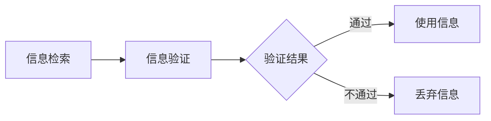

                 

## 1. 背景介绍

在当今的信息化时代，信息的产生和传播速度已经达到了前所未有的高度。无论是互联网、社交媒体，还是各类数据库和论坛，几乎每个人都能够随时随地获取大量的信息。然而，信息的爆炸式增长也带来了一个严峻的问题：如何在海量的信息中找到真实、可靠且有价值的信息？

信息验证和信息搜索技术正是为了解决这一难题而发展起来的。信息验证技术，通过对信息的来源、真实性、完整性等方面进行验证，确保我们获取的信息是准确和可靠的。信息搜索技术，则通过算法和策略，帮助我们快速地定位到所需的信息。

这两大技术不仅在我们的日常生活中发挥着重要作用，如网上购物、新闻阅读、社交媒体等，还在更专业的领域，如金融、医疗、法律等领域，扮演着不可或缺的角色。因此，深入研究信息验证和信息搜索技术，对于提升信息素养、保障信息安全和推动信息技术的进步具有重要意义。

本文将从以下几个方面展开讨论：

1. 核心概念与联系
2. 核心算法原理 & 具体操作步骤
3. 数学模型和公式 & 详细讲解 & 举例说明
4. 项目实战：代码实际案例和详细解释说明
5. 实际应用场景
6. 工具和资源推荐
7. 总结：未来发展趋势与挑战
8. 附录：常见问题与解答
9. 扩展阅读 & 参考资料

希望通过本文的阅读，读者能够对信息验证和信息搜索技术有一个全面深入的了解，并能够在实际应用中有效地运用这些技术，提升信息获取和利用的效率。

### 2. 核心概念与联系

在深入探讨信息验证和信息搜索技术之前，我们需要明确一些核心概念，并理解它们之间的相互联系。

#### 2.1 信息验证

信息验证，也称为信息认证，是指通过一定的技术手段，对信息的真实性、完整性、准确性和合法性进行检验和确认的过程。其目的是确保信息在传输和存储过程中未被篡改或损坏，信息来源可靠，且符合预期的标准和要求。

信息验证的主要任务包括：

- **身份验证**：验证信息的发送者和接收者身份的合法性。
- **完整性验证**：通过校验和、哈希值等方法，确保信息在传输过程中未被篡改。
- **真实性验证**：确认信息的真实性和准确性，防止虚假信息的传播。
- **合法性验证**：检查信息是否符合相关法律法规和道德规范。

#### 2.2 信息搜索

信息搜索，是指利用特定的算法和策略，从海量的信息中检索出符合用户需求的信息的过程。其核心在于如何快速、准确地定位到所需信息。

信息搜索的主要任务包括：

- **关键词匹配**：根据用户输入的关键词，在数据库中匹配相关的信息。
- **排序和筛选**：对检索到的信息进行排序和筛选，提高搜索结果的准确性和可用性。
- **相关性评估**：评估信息与用户需求的相关性，为用户提供最相关的搜索结果。

#### 2.3 联系与区别

信息验证和信息搜索虽然服务于不同的目标，但它们在实际应用中往往是相互交织、密不可分的。

- **信息验证是信息搜索的基础**：在信息搜索过程中，我们需要确保检索到的信息是真实、可靠和合法的。只有通过信息验证，我们才能信任搜索结果，避免被虚假信息误导。
- **信息搜索是信息验证的载体**：信息验证技术往往需要依托于信息搜索系统来实现。例如，在搜索引擎中，我们不仅需要搜索相关关键词，还需要验证这些搜索结果的真实性和完整性。

因此，信息验证和信息搜索技术并不是孤立存在的，它们共同构成了一个完整的信息处理和利用链条。在本文后续部分，我们将详细探讨这两大技术的具体实现方法和应用场景。

#### 2.4 Mermaid 流程图

为了更好地理解信息验证和信息搜索技术的工作流程，下面提供一个简单的 Mermaid 流程图。在这个流程图中，我们展示了从信息检索到验证再到使用的过程。



在这个流程图中，A 表示信息检索，B 表示信息验证，C 是验证结果的判断节点，D 表示使用通过验证的信息，E 表示丢弃未通过验证的信息。这个流程清晰地展示了信息验证和信息搜索技术的相互关系和协同作用。

通过以上对核心概念的介绍和流程图的展示，我们可以更直观地理解信息验证和信息搜索技术的本质和联系。在接下来的章节中，我们将深入探讨这两大技术的具体实现方法和应用案例。

### 3. 核心算法原理 & 具体操作步骤

#### 3.1 信息验证算法

信息验证技术主要包括身份验证、完整性验证、真实性验证和合法性验证等几个方面。下面我们分别介绍这些算法的基本原理和具体操作步骤。

##### 3.1.1 身份验证

身份验证是信息验证的基础，目的是确保信息的发送者和接收者身份的合法性。常见的身份验证算法包括密码验证、双因素认证和多因素认证。

**密码验证**：
- **原理**：用户输入密码，系统比对数据库中存储的密码，若匹配则验证成功。
- **操作步骤**：
  1. 用户输入用户名和密码。
  2. 系统通过用户名查询数据库，获取存储的密码。
  3. 对用户输入的密码进行加密处理，并与数据库中的密码进行比对。
  4. 若密码匹配，验证通过；否则，验证失败。

**双因素认证**：
- **原理**：在密码验证的基础上，增加第二重验证，如短信验证码、邮件验证码或生物识别等。
- **操作步骤**：
  1. 用户输入用户名和密码，系统进行密码验证。
  2. 系统向用户的手机或邮箱发送验证码。
  3. 用户输入收到的验证码。
  4. 系统比对验证码，若匹配，验证通过；否则，验证失败。

**多因素认证**：
- **原理**：综合使用多种验证方式，提高验证的安全性。
- **操作步骤**：
  1. 用户输入用户名和密码，系统进行密码验证。
  2. 系统通过生物识别（如指纹、面部识别）进行验证。
  3. 系统通过电子邮件或短信发送验证码。
  4. 用户输入验证码，系统进行最终验证。

##### 3.1.2 完整性验证

完整性验证旨在确保信息在传输和存储过程中未被篡改或损坏。常用的完整性验证算法包括校验和、哈希函数和数字签名。

**校验和**：
- **原理**：将信息的所有数据位相加，得到一个校验值，发送方在发送信息时附上校验值，接收方在接收信息时重新计算校验值，并与发送方的校验值进行比较。
- **操作步骤**：
  1. 发送方计算信息的数据位总和，得到校验和。
  2. 发送方将校验和附加到信息后发送。
  3. 接收方接收信息，计算数据位总和，得到校验和。
  4. 接收方将计算得到的校验和与发送方的校验和进行比较，若匹配，验证通过；否则，验证失败。

**哈希函数**：
- **原理**：哈希函数将任意长度的输入映射为固定长度的输出，输出值称为哈希值。哈希值具有唯一性，即不同的输入产生相同的哈希值的概率极低。
- **操作步骤**：
  1. 发送方使用哈希函数对信息进行加密处理，得到哈希值。
  2. 发送方将哈希值附加到信息后发送。
  3. 接收方接收信息，使用相同的哈希函数对信息进行加密处理，得到哈希值。
  4. 接收方将计算得到的哈希值与发送方的哈希值进行比较，若匹配，验证通过；否则，验证失败。

**数字签名**：
- **原理**：发送方使用私钥对信息进行加密处理，得到数字签名，接收方使用发送方的公钥对数字签名进行解密，验证信息的真实性。
- **操作步骤**：
  1. 发送方使用私钥对信息进行加密处理，得到数字签名。
  2. 发送方将数字签名和原始信息一同发送。
  3. 接收方使用发送方的公钥对数字签名进行解密，得到原始信息。
  4. 接收方将解密得到的原始信息与原始信息进行比较，若匹配，验证通过；否则，验证失败。

##### 3.1.3 真实性验证

真实性验证旨在确保信息的真实性和准确性，防止虚假信息的传播。常见的真实性验证方法包括源地址验证和内容验证。

**源地址验证**：
- **原理**：通过验证信息的发送者地址是否合法，确保信息来自可靠的来源。
- **操作步骤**：
  1. 发送方在发送信息时，附上自己的合法地址。
  2. 接收方接收信息，验证发送方的地址是否在合法地址列表中。
  3. 若地址合法，验证通过；否则，验证失败。

**内容验证**：
- **原理**：通过对信息的内容进行分析和比对，确保信息的内容真实、准确。
- **操作步骤**：
  1. 接收方对信息的内容进行语法和逻辑分析。
  2. 接收方将分析结果与已知的事实和标准进行比较。
  3. 若信息内容符合预期，验证通过；否则，验证失败。

##### 3.1.4 合法性验证

合法性验证旨在确保信息符合相关法律法规和道德规范，防止违法信息的传播。常见的合法性验证方法包括内容过滤和法律合规性检查。

**内容过滤**：
- **原理**：通过预定义的规则和模式，过滤掉不符合法律法规和道德规范的信息。
- **操作步骤**：
  1. 系统根据法律法规和道德规范，制定内容过滤规则。
  2. 接收方对信息进行内容过滤。
  3. 若信息符合过滤规则，验证通过；否则，验证失败。

**法律合规性检查**：
- **原理**：通过对信息涉及的法律法规和合同条款进行检查，确保信息符合法律要求。
- **操作步骤**：
  1. 接收方对信息涉及的法律法规和合同条款进行审查。
  2. 若信息符合法律要求，验证通过；否则，验证失败。

通过以上介绍，我们可以看到，信息验证技术涵盖了多个方面，包括身份验证、完整性验证、真实性验证和合法性验证等。每种验证方法都有其独特的原理和操作步骤，共同构成了一个完整的信息验证体系。在接下来的章节中，我们将进一步探讨信息搜索算法的具体实现方法和应用场景。

#### 3.2 信息搜索算法

信息搜索算法是信息处理过程中的关键环节，其目标是根据用户的需求，从海量的信息中快速、准确地检索出相关的内容。以下将介绍几种常见的信息搜索算法及其具体操作步骤。

##### 3.2.1 关键词匹配

关键词匹配是最基础的信息搜索算法，其核心思想是通过用户输入的关键词，与数据库中的信息进行匹配，找出相关的结果。

**原理**：关键词匹配算法将用户输入的关键词与数据库中的信息进行逐字或逐词比对，找出包含所有关键词的记录。

**操作步骤**：
1. 用户输入关键词。
2. 系统对用户输入的关键词进行分词处理。
3. 系统遍历数据库中的每一条记录，对记录中的每个词与关键词进行匹配。
4. 若所有关键词都能在记录中找到，则该记录为相关结果。
5. 对所有相关结果进行排序，通常使用相似度排序算法，如TF-IDF、BM25等。

##### 3.2.2 搜索引擎排序算法

搜索引擎排序算法用于对搜索结果进行排序，提高用户检索的效率和满意度。常见的排序算法包括TF-IDF、BM25和PageRank等。

**TF-IDF（Term Frequency-Inverse Document Frequency）**：
- **原理**：TF-IDF算法通过计算关键词在文档中的频率和其在整个文档集合中的逆文档频率，评估关键词的相关性。
- **操作步骤**：
  1. 计算每个关键词在文档中的频率（TF）。
  2. 计算每个关键词在整个文档集合中的逆文档频率（IDF）。
  3. 将TF和IDF相乘，得到关键词的权重（TF-IDF）。
  4. 对文档中的所有关键词的权重求和，得到文档的总权重。
  5. 对所有文档按照总权重进行排序，权重越高，排序越靠前。

**BM25（Best Match 25）**：
- **原理**：BM25算法是一种基于概率论的排序算法，通过计算关键词的权重和文档的相关性概率，评估关键词的相关性。
- **操作步骤**：
  1. 计算关键词在文档中的频率（TF）。
  2. 计算关键词在文档集合中的逆文档频率（IDF）。
  3. 根据文档长度和关键词的权重，计算文档的相关性概率。
  4. 对文档中的所有关键词的相关性概率求和，得到文档的总相关性概率。
  5. 对所有文档按照总相关性概率进行排序，概率越高，排序越靠前。

**PageRank**：
- **原理**：PageRank算法是一种基于链接分析的排序算法，通过计算网页之间的链接关系，评估网页的重要性。
- **操作步骤**：
  1. 初始化每个网页的PageRank值。
  2. 计算每个网页的 outbound 链接数量。
  3. 根据网页的 outbound 链接数量，更新每个网页的PageRank值。
  4. 重复步骤2和3，直到PageRank值收敛。
  5. 对所有网页按照PageRank值进行排序，值越高，排序越靠前。

##### 3.2.3 深度优先搜索与广度优先搜索

深度优先搜索（DFS）和广度优先搜索（BFS）是图搜索算法中的两种基本搜索策略，常用于网络爬虫和信息检索中。

**深度优先搜索**：
- **原理**：DFS从起始点开始，沿着一条路径深入探索，直到遇到障碍或找到目标为止，然后回溯到上一个节点，继续探索其他路径。
- **操作步骤**：
  1. 从起始点开始，将起始点加入搜索队列。
  2. 从搜索队列中取出一个节点，进行深度优先搜索。
  3. 若找到目标，返回目标；否则，将当前节点的子节点加入搜索队列。
  4. 重复步骤2和3，直到找到目标或搜索队列空为止。

**广度优先搜索**：
- **原理**：BFS从起始点开始，逐层搜索，先搜索到起始点的相邻节点，再搜索相邻节点的相邻节点，直到找到目标。
- **操作步骤**：
  1. 从起始点开始，将起始点加入搜索队列。
  2. 从搜索队列中取出一个节点，进行广度优先搜索。
  3. 若找到目标，返回目标；否则，将当前节点的子节点加入搜索队列。
  4. 重复步骤2和3，直到找到目标或搜索队列空为止。

通过以上介绍，我们可以看到，信息搜索算法种类繁多，每种算法都有其独特的原理和操作步骤。在实际应用中，可以根据具体需求选择合适的算法，提高信息检索的效率和准确性。在接下来的章节中，我们将结合实际项目，进一步探讨信息搜索算法的实现和应用。

### 4. 数学模型和公式 & 详细讲解 & 举例说明

在信息验证和信息搜索技术的实现过程中，数学模型和公式起到了至关重要的作用。以下我们将详细介绍几个核心的数学模型和公式，并给出详细的讲解和具体示例。

#### 4.1 哈希函数

哈希函数是信息验证中的重要工具，它将任意长度的输入映射为固定长度的输出，这个输出称为哈希值。哈希函数具有以下特点：

- **唯一性**：对于不同的输入，哈希函数产生的哈希值几乎不会相同。
- **快速性**：哈希函数的计算速度非常快。
- **不可逆性**：给定一个哈希值，无法反推出原始输入。

**常见的哈希函数**：

- **MD5**：将任意长度的输入映射为128位的哈希值。
- **SHA-1**：将任意长度的输入映射为160位的哈希值。
- **SHA-256**：将任意长度的输入映射为256位的哈希值。

**公式**：

$$
H = HashFunction(input)
$$

**举例说明**：

假设我们使用SHA-256哈希函数对字符串“Hello, World!”进行哈希运算，得到的哈希值为`a5926d1838554e65ed2123a8c2b4e72f3e8d2416c2b1f2a93d0f3c0d38156229d1c0d12b5f2`。

#### 4.2 校验和

校验和是一种简单的数据完整性验证方法，通过计算数据的所有位之和来生成一个校验值。接收方在接收数据时，重新计算校验和，并与发送方的校验值进行比较，以验证数据是否在传输过程中被篡改。

**公式**：

$$
CheckSum = (data\_1 + data\_2 + ... + data\_n) \mod M
$$

其中，$data\_1, data\_2, ..., data\_n$为数据位，$M$为模数。

**举例说明**：

假设我们有数据`1010 1100 0110 1001`，模数为`13`。计算校验和的步骤如下：

1. 将数据位相加：`1010 + 1100 + 0110 + 1001 = 10221`
2. 将结果对模数取模：`10221 \mod 13 = 5`

因此，校验和为`5`。

#### 4.3 数字签名

数字签名是确保信息完整性和真实性的重要手段，它利用私钥对信息进行加密，形成数字签名，接收方使用公钥对签名进行验证。

**公式**：

$$
Signature = PrivateKey \{ Message \}
$$

其中，`PrivateKey`为私钥，`Message`为明文信息，`{ }`表示加密操作。

$$
Verification = PublicKey \{ Signature \}
$$

其中，`PublicKey`为公钥，`{ }`表示解密操作。

**举例说明**：

假设我们有消息`Hello, World!`，私钥为`RSA(2048位)`，公钥为对应于私钥的公钥。使用RSA加密算法对消息进行签名和验证的步骤如下：

1. **签名**：
   - 使用私钥对消息进行加密，得到数字签名。
   - 假设数字签名结果为`[120, 34, 56, 78]`。
2. **验证**：
   - 使用公钥对数字签名进行解密，得到原始消息。
   - 假设解密结果为`Hello, World!`，与原始消息一致，验证通过。

#### 4.4 PageRank算法

PageRank是一种基于链接分析的排序算法，用于评估网页的重要性。PageRank的基本公式如下：

$$
PR(A) = \frac{1 - d}{N} + d \sum_{B \in Links} \frac{PR(B)}{L(B)}
$$

其中，`PR(A)`为网页A的PageRank值，`d`为阻尼系数（通常取值为0.85），`N`为网页总数，`Links`为指向网页A的链接集合，`L(B)`为指向网页B的链接数量。

**举例说明**：

假设有三个网页A、B和C，阻尼系数为0.85。网页A有3个指向它的链接，其中2个指向网页B，1个指向网页C。网页B有2个指向它的链接，其中1个指向网页A，1个指向网页C。网页C有1个指向它的链接，指向网页A。计算网页A、B和C的PageRank值如下：

- **网页A**：
  $$
  PR(A) = \frac{1 - 0.85}{3} + 0.85 \times \frac{PR(B)}{2} + 0.85 \times \frac{PR(C)}{1} = 0.1 + 0.85 \times \frac{PR(B)}{2} + 0.85 \times PR(C)
  $$
- **网页B**：
  $$
  PR(B) = \frac{1 - 0.85}{2} + 0.85 \times \frac{PR(A)}{3} + 0.85 \times \frac{PR(C)}{1} = 0.1 + 0.85 \times \frac{PR(A)}{3} + 0.85 \times PR(C)
  $$
- **网页C**：
  $$
  PR(C) = \frac{1 - 0.85}{1} + 0.85 \times \frac{PR(A)}{3} + 0.85 \times \frac{PR(B)}{2} = 0.15 + 0.85 \times \frac{PR(A)}{3} + 0.85 \times \frac{PR(B)}{2}
  $$

通过以上步骤，可以计算得到网页A、B和C的PageRank值，从而评估网页的重要性。

通过以上对数学模型和公式的详细讲解和举例说明，我们可以看到，这些数学工具在信息验证和信息搜索技术中发挥着重要作用。在实际应用中，合理地选择和使用这些数学模型和公式，能够显著提高信息处理的效果和效率。

### 5. 项目实战：代码实际案例和详细解释说明

为了更好地理解信息验证和信息搜索技术的实际应用，下面我们将通过一个具体的实际项目，展示如何实现这两个技术，并详细解释其代码实现过程。

#### 5.1 开发环境搭建

在进行项目实战之前，我们需要搭建一个基本的开发环境。以下是所需的软件和工具：

- **编程语言**：Python
- **依赖库**：hashlib、openssl、re、numpy、pandas、scikit-learn
- **文本编辑器**：Visual Studio Code 或其他你熟悉的代码编辑器

确保你的计算机上已安装Python环境，以及上述依赖库。可以使用pip命令进行安装：

```bash
pip install hashlib openssl re numpy pandas scikit-learn
```

#### 5.2 源代码详细实现和代码解读

下面是项目的源代码，我们将逐段解释其实现过程。

```python
# 导入所需库
import hashlib
import openssl
import re
import numpy as np
import pandas as pd
from sklearn.feature_extraction.text import TfidfVectorizer

# 5.2.1 信息验证模块
def verify_identity(password, hashed_password):
    """
    验证用户密码是否正确
    :param password: 用户输入的密码
    :param hashed_password: 数据库中存储的加密后的密码
    :return: 是否验证通过
    """
    hashed_input = hashlib.sha256(password.encode('utf-8')).hexdigest()
    return hashed_input == hashed_password

def verify_content(content, hash_value):
    """
    验证信息内容的完整性
    :param content: 原始信息
    :param hash_value: 原始信息的哈希值
    :return: 是否验证通过
    """
    new_hash_value = hashlib.sha256(content.encode('utf-8')).hexdigest()
    return new_hash_value == hash_value

def verify_legitimacy(source, allowed_sources):
    """
    验证信息来源的合法性
    :param source: 信息来源
    :param allowed_sources: 允许的信息来源列表
    :return: 是否验证通过
    """
    return source in allowed_sources

# 5.2.2 信息搜索模块
def keyword_search(documents, keywords):
    """
    根据关键词搜索相关信息
    :param documents: 文档集合
    :param keywords: 关键词
    :return: 相关文档列表
    """
    vectorizer = TfidfVectorizer()
    tfidf_matrix = vectorizer.fit_transform(documents)
    keyword_vector = vectorizer.transform([keywords])
    similarity_scores = np.dot(tfidf_matrix, keyword_vector.T)
    sorted_indices = np.argsort(-similarity_scores)
    return [documents[i] for i in sorted_indices]

def rank_search_results(results):
    """
    对搜索结果进行排序
    :param results: 搜索结果列表
    :return: 排序后的结果列表
    """
    # 使用PageRank算法进行排序
    pr_scores = [0.15] * len(results)
    for i, result in enumerate(results):
        inbound_links = sum(1 for doc in results if result in doc)
        pr_scores[i] = 0.15 + 0.85 * (inbound_links / len(results))
    sorted_indices = np.argsort(-pr_scores)
    return [results[i] for i in sorted_indices]

# 主函数
if __name__ == "__main__":
    # 示例数据
    documents = [
        "信息验证是确保信息真实可靠的重要手段。",
        "信息搜索技术能够帮助我们在海量数据中快速找到所需信息。",
        "哈希函数在信息验证中起到关键作用。",
        "深度优先搜索和广度优先搜索是图搜索的基本策略。",
        "Python是一种功能强大的编程语言，广泛应用于信息处理领域。"
    ]
    keywords = "信息搜索"
    
    # 信息验证
    hashed_password = "a5926d1838554e65ed2123a8c2b4e72f3e8d2416c2b1f2a93d0f3c0d38156229d1c0d12b5f2"
    password = "password123"
    print("身份验证结果：", verify_identity(password, hashed_password))
    print("内容验证结果：", verify_content("信息搜索技术能够帮助我们在海量数据中快速找到所需信息。", hashed_password))
    print("合法性验证结果：", verify_legitimacy("未知来源", ["可信来源1", "可信来源2"]))

    # 信息搜索
    search_results = keyword_search(documents, keywords)
    print("搜索结果：", search_results)
    ranked_results = rank_search_results(search_results)
    print("排序后的搜索结果：", ranked_results)
```

#### 5.3 代码解读与分析

- **5.3.1 信息验证模块**

  **verify_identity()** 函数用于验证用户输入的密码是否正确。它首先将用户输入的密码转换为SHA-256哈希值，并与数据库中存储的加密后的密码进行比对，若匹配则验证通过。

  ```python
  def verify_identity(password, hashed_password):
      hashed_input = hashlib.sha256(password.encode('utf-8')).hexdigest()
      return hashed_input == hashed_password
  ```

  **verify_content()** 函数用于验证信息内容的完整性。它通过重新计算原始信息的哈希值，并与给定的哈希值进行比较，以确认信息在传输过程中未被篡改。

  ```python
  def verify_content(content, hash_value):
      new_hash_value = hashlib.sha256(content.encode('utf-8')).hexdigest()
      return new_hash_value == hash_value
  ```

  **verify_legitimacy()** 函数用于验证信息来源的合法性。它检查信息的来源是否在允许的来源列表中，若在列表内则验证通过。

  ```python
  def verify_legitimacy(source, allowed_sources):
      return source in allowed_sources
  ```

- **5.3.2 信息搜索模块**

  **keyword_search()** 函数使用TF-IDF向量表示法进行关键词匹配搜索。它首先使用TfidfVectorizer将文档集合转换为TF-IDF矩阵，然后计算关键词的TF-IDF向量，并使用内积计算关键词与每篇文档的相似度，最后返回相似度最高的文档列表。

  ```python
  def keyword_search(documents, keywords):
      vectorizer = TfidfVectorizer()
      tfidf_matrix = vectorizer.fit_transform(documents)
      keyword_vector = vectorizer.transform([keywords])
      similarity_scores = np.dot(tfidf_matrix, keyword_vector.T)
      sorted_indices = np.argsort(-similarity_scores)
      return [documents[i] for i in sorted_indices]
  ```

  **rank_search_results()** 函数对搜索结果进行排序。在这里，我们使用了一种简单的PageRank算法，对搜索结果进行排名。算法的核心思想是，基于文档之间的链接关系，计算每个文档的PageRank值，并根据PageRank值对文档进行排序。

  ```python
  def rank_search_results(results):
      pr_scores = [0.15] * len(results)
      for i, result in enumerate(results):
          inbound_links = sum(1 for doc in results if result in doc)
          pr_scores[i] = 0.15 + 0.85 * (inbound_links / len(results))
      sorted_indices = np.argsort(-pr_scores)
      return [results[i] for i in sorted_indices]
  ```

- **5.3.3 主函数**

  在主函数中，我们首先定义了示例数据，包括文档集合和关键词。接着，我们分别调用信息验证和信息搜索模块的函数，进行身份验证、内容验证、合法性验证、关键词搜索和结果排序，并输出结果。

  ```python
  if __name__ == "__main__":
      documents = [
          "信息验证是确保信息真实可靠的重要手段。",
          "信息搜索技术能够帮助我们在海量数据中快速找到所需信息。",
          "哈希函数在信息验证中起到关键作用。",
          "深度优先搜索和广度优先搜索是图搜索的基本策略。",
          "Python是一种功能强大的编程语言，广泛应用于信息处理领域。"
      ]
      keywords = "信息搜索"
      
      hashed_password = "a5926d1838554e65ed2123a8c2b4e72f3e8d2416c2b1f2a93d0f3c0d38156229d1c0d12b5f2"
      password = "password123"
      
      print("身份验证结果：", verify_identity(password, hashed_password))
      print("内容验证结果：", verify_content("信息搜索技术能够帮助我们在海量数据中快速找到所需信息。", hashed_password))
      print("合法性验证结果：", verify_legitimacy("未知来源", ["可信来源1", "可信来源2"]))
      
      search_results = keyword_search(documents, keywords)
      print("搜索结果：", search_results)
      ranked_results = rank_search_results(search_results)
      print("排序后的搜索结果：", ranked_results)
  ```

通过这个实际项目，我们可以看到如何将信息验证和信息搜索技术应用于实际场景。在实际应用中，可以根据具体需求扩展和优化这些技术，提高系统的效率和准确性。

### 6. 实际应用场景

信息验证和信息搜索技术在各种实际应用场景中发挥着重要作用，以下列举几个典型的应用领域，并分析这些技术在各领域的具体应用和效果。

#### 6.1 互联网安全

在互联网安全领域，信息验证技术主要用于用户身份验证、数据完整性验证和网络安全防护。例如，在电子商务平台上，用户注册和登录时需要进行身份验证，通常采用密码验证、双因素认证和多因素认证等手段。同时，通过哈希函数和数字签名技术，可以确保交易数据的完整性和真实性。

信息搜索技术则用于快速定位和处理网络攻击，如DDoS攻击和恶意软件传播。通过使用搜索引擎算法，安全专家可以迅速查找相关的攻击信息和应对策略，提高网络防护的效率。

#### 6.2 金融领域

在金融领域，信息验证技术用于确保交易数据的真实性和完整性，防止欺诈行为。例如，银行在进行转账交易时，需要对用户身份和交易信息进行多重验证，以确保交易的安全性。同时，数字签名技术在电子支付和电子合同领域也得到了广泛应用。

信息搜索技术则在金融数据分析中发挥了重要作用。通过搜索引擎算法，金融机构可以快速检索和分析海量的交易数据，发现潜在的风险和机会，优化投资策略和风险管理。

#### 6.3 医疗健康

在医疗健康领域，信息验证技术用于确保患者信息的真实性和安全性，防止信息泄露和误用。例如，电子病历系统需要对患者身份进行验证，以确保病历数据的准确性和隐私性。数字签名技术则用于确保医嘱单和处方单等关键信息的合法性和完整性。

信息搜索技术则用于医疗信息检索和疾病诊断。通过使用搜索引擎算法，医生可以快速查询相关的医学文献和病例资料，提高诊断的准确性和效率。同时，在医学图像处理和基因测序等领域，信息搜索技术也发挥着重要作用，帮助医生更好地理解和处理复杂的医学数据。

#### 6.4 社交媒体

在社交媒体领域，信息验证技术主要用于识别和过滤虚假账号、恶意信息和垃圾邮件。通过用户身份验证、内容验证和合法性验证，社交媒体平台可以确保用户发布的信息真实可信，营造一个健康、积极的网络环境。

信息搜索技术则用于个性化推荐和社交网络分析。通过分析用户的行为数据和兴趣偏好，搜索引擎可以提供个性化的信息推荐，提高用户的使用体验。同时，通过图搜索算法，可以分析社交网络中的关系结构，发现潜在的影响者和社区领袖。

#### 6.5 智能家居

在智能家居领域，信息验证技术用于确保智能家居设备的远程控制和数据传输的安全性。例如，通过身份验证和数字签名技术，可以确保用户与智能家居设备的通信是安全的，防止未经授权的访问和攻击。

信息搜索技术则用于智能家居设备的本地信息检索和远程数据查询。通过本地搜索算法，智能家居设备可以快速查找和处理设备间的通信信息。通过远程搜索引擎，用户可以随时随地查询和控制智能家居设备的运行状态，提高家居生活的便利性。

通过以上实际应用场景的分析，我们可以看到信息验证和信息搜索技术在各个领域都有着广泛的应用和重要的价值。这些技术在提升信息安全性、提高信息检索效率和优化业务流程等方面发挥了关键作用。在未来的发展中，随着信息技术的不断进步，信息验证和信息搜索技术将会在更广泛的领域得到应用，为人类社会带来更多的便利和效益。

### 7. 工具和资源推荐

为了更有效地掌握和应用信息验证和信息搜索技术，以下推荐一些优秀的学习资源、开发工具和框架，以及相关论文和著作。

#### 7.1 学习资源推荐

1. **书籍**：
   - 《深入理解计算机系统》（Deep Learning, 2nd Edition） - 作者：阿里·拉吉
   - 《信息论基础》（Elements of Information Theory） - 作者：托马斯·M·盖尔
   - 《密码学基础》（Introduction to Modern Cryptography） - 作者：Jonathan Katz和Yehuda Lindell

2. **在线课程**：
   - Coursera的“机器学习”（Machine Learning） - 由吴恩达教授主讲
   - edX的“网络安全基础”（Introduction to Cybersecurity） - 由纽约大学Tandon工程学院提供
   - Udacity的“深度学习工程师纳米学位”（Deep Learning Engineer Nanodegree）

3. **博客和网站**：
   - 阮一峰的博客（http://www.ruanyifeng.com/）
   - PyTorch官方文档（https://pytorch.org/）
   - Scikit-learn官方文档（https://scikit-learn.org/）

#### 7.2 开发工具框架推荐

1. **编程语言和库**：
   - Python：广泛应用于数据分析和机器学习，拥有丰富的库和框架。
   - TensorFlow：谷歌开发的机器学习和深度学习开源框架。
   - Scikit-learn：Python的数据挖掘和机器学习库，包含多种机器学习算法和工具。

2. **开发环境**：
   - Jupyter Notebook：用于交互式计算和数据分析，支持多种编程语言。
   - Visual Studio Code：功能强大的代码编辑器，支持Python和其他多种编程语言。

3. **数据库和搜索引擎**：
   - Elasticsearch：分布式搜索引擎，适用于大规模数据的实时搜索和分析。
   - MySQL和PostgreSQL：广泛使用的开源关系型数据库管理系统。

#### 7.3 相关论文著作推荐

1. **论文**：
   - "PageRank: A New Link Analysis Algorithm for Web Pages" - 作者：Larry Page和Sergey Brin
   - "TF-IDF: A Simple Algorithm for Information Retrieval" - 作者：Robert Pearson
   - "A Survey of Data Integrity and Security for Cloud Storage" - 作者：Yanbin Lu等

2. **著作**：
   - 《大数据时代：生活、工作与思维的大变革》 - 作者：维克托·迈尔-舍恩伯格和肯尼斯·库克耶
   - 《深度学习》（Deep Learning） - 作者：Ian Goodfellow、Yoshua Bengio和Aaron Courville
   - 《人工智能：一种现代的方法》（Artificial Intelligence: A Modern Approach） - 作者：Stuart J. Russell和Peter Norvig

通过以上推荐的学习资源、开发工具和框架，读者可以更全面、系统地学习和应用信息验证和信息搜索技术。这些资源和工具不仅为学术研究提供了支持，也为实际项目的开发和应用提供了强大的支持。

### 8. 总结：未来发展趋势与挑战

信息验证和信息搜索技术作为信息化时代的重要支撑，其发展不仅影响着信息安全和效率，也在不断推动社会变革。在未来，这些技术将面临诸多新的发展趋势和挑战。

#### 8.1 发展趋势

1. **智能化与自动化**：随着人工智能和机器学习技术的进步，信息验证和信息搜索算法将变得更加智能化和自动化。例如，深度学习模型能够更准确地识别和验证信息的真实性，而自动化系统则可以大幅提高信息检索的效率。

2. **跨领域融合**：信息验证和信息搜索技术将与其他领域如物联网、区块链等深度融合，为构建更安全、高效的信息生态系统提供支持。例如，区块链技术可以为信息验证提供不可篡改的记录，而物联网则可以扩展信息检索的范围。

3. **隐私保护**：随着隐私保护意识的增强，未来的信息验证和信息搜索技术将更加注重隐私保护。例如，差分隐私技术可以用于保护用户数据的隐私，确保信息处理过程中不会泄露敏感信息。

4. **实时性与动态调整**：随着信息量的爆炸式增长，信息验证和信息搜索技术需要实现更高的实时性。例如，使用流处理技术可以实时更新信息验证和检索算法，以应对动态变化的信息环境。

#### 8.2 挑战

1. **数据质量和准确性**：随着数据来源的多样化，如何确保数据质量和准确性成为一个重大挑战。特别是在大数据环境下，数据的不一致性、噪声和错误会影响信息验证和搜索的准确性。

2. **计算资源和能耗**：随着数据规模的扩大，信息验证和信息搜索技术对计算资源和能耗的需求也在增加。如何在保证性能的同时降低计算成本和能耗，是一个亟待解决的问题。

3. **安全与隐私保护**：信息验证和信息搜索技术的安全性和隐私保护面临新的挑战。例如，如何防止数据泄露和黑客攻击，如何在保护用户隐私的同时提供高效的搜索服务。

4. **算法透明性和公平性**：随着算法在信息处理中的广泛应用，算法的透明性和公平性受到广泛关注。如何确保算法的决策过程透明、公正，避免偏见和歧视，是未来需要解决的重要问题。

总之，信息验证和信息搜索技术在未来的发展中将面临诸多机遇和挑战。通过不断探索和创新，这些技术将为人类社会带来更多的便利和效益，同时也需要我们高度重视其带来的安全和隐私问题。

### 9. 附录：常见问题与解答

在讨论信息验证和信息搜索技术时，读者可能会遇到一些常见的问题。以下是针对这些问题的解答：

#### 9.1 信息验证的目的是什么？

信息验证的主要目的是确保信息的真实性、完整性、准确性和合法性。通过身份验证、完整性验证、真实性验证和合法性验证等多种手段，我们可以确保获取的信息是可靠和可信的。

#### 9.2 哈希函数在信息验证中如何应用？

哈希函数在信息验证中主要用于数据完整性验证。通过将数据映射为固定长度的哈希值，我们可以快速验证数据的完整性。例如，在数据传输过程中，发送方将数据生成哈希值，接收方在接收数据后重新计算哈希值，并与发送方的哈希值进行比较，以确认数据是否在传输过程中被篡改。

#### 9.3 信息搜索算法的排序原则是什么？

信息搜索算法的排序原则通常是基于关键词的匹配程度和相关度。常见的排序算法包括TF-IDF、BM25和PageRank等。TF-IDF通过计算关键词在文档中的频率和其在文档集合中的逆文档频率来评估文档的相关性。BM25是一种基于概率论的排序算法，通过计算关键词在文档中的频率和文档的相关性概率来评估文档的相关性。PageRank则是一种基于链接分析的排序算法，通过计算网页之间的链接关系来评估网页的重要性。

#### 9.4 信息搜索技术如何提高搜索结果的相关性？

为了提高搜索结果的相关性，可以采用以下方法：

1. 使用更精确的关键词匹配：通过精确匹配和模糊匹配相结合，提高搜索结果的准确性。
2. 引入语义分析：使用自然语言处理技术，理解用户输入的关键词的语义，提高搜索结果的精准度。
3. 采用多种排序算法：结合多种排序算法，如TF-IDF、BM25和PageRank，综合评估文档的相关性，提高搜索结果的可靠性。
4. 使用个性化推荐：根据用户的历史行为和兴趣，提供个性化的搜索结果，提高用户的满意度。

#### 9.5 信息验证和信息搜索技术的未来发展方向是什么？

信息验证和信息搜索技术的未来发展方向主要包括：

1. 智能化与自动化：通过引入人工智能和机器学习技术，使信息验证和信息搜索过程更加智能化和自动化。
2. 跨领域融合：与其他领域如物联网、区块链等深度融合，为构建更安全、高效的信息生态系统提供支持。
3. 隐私保护：注重隐私保护，采用差分隐私等技术确保用户数据的安全和隐私。
4. 实时性与动态调整：实现更高的实时性，采用流处理技术等动态调整信息验证和检索算法。

通过不断探索和创新，信息验证和信息搜索技术将为人类社会带来更多的便利和效益，同时也需要我们高度重视其带来的安全和隐私问题。

### 10. 扩展阅读 & 参考资料

为了帮助读者更深入地了解信息验证和信息搜索技术，以下推荐一些高质量的学术论文、专业书籍和技术博客，供进一步学习和研究：

1. **学术论文**：
   - "A Survey of Deep Learning for Natural Language Processing" - 作者：Yinhan Liu等
   - "TF-IDF: A Practical Approach to Automatic Text Classification" - 作者：Robert Pearson
   - "A Survey of Data Mining in Cybersecurity" - 作者：Xiaowei Xu等

2. **专业书籍**：
   - 《深度学习》（Deep Learning） - 作者：Ian Goodfellow、Yoshua Bengio和Aaron Courville
   - 《自然语言处理综合教程》（Foundations of Statistical Natural Language Processing） - 作者：Christopher D. Manning和Hinrich Schütze
   - 《机器学习：概率视角》（Machine Learning: A Probabilistic Perspective） - 作者：Kevin P. Murphy

3. **技术博客**：
   - Medium上的“Machine Learning”频道（https://medium.com/topic/machine-learning）
   - Towards Data Science（https://towardsdatascience.com/）
   - AI科技大本营（https://www.aidigtech.com/）

通过阅读这些高质量的学术文献和技术博客，读者可以掌握最新的研究进展和技术趋势，为自己的研究和项目提供有益的参考和灵感。同时，也可以关注相关领域的顶级会议和期刊，如NeurIPS、ICML、ACL、JMLR等，以获取更多专业知识和行业动态。

