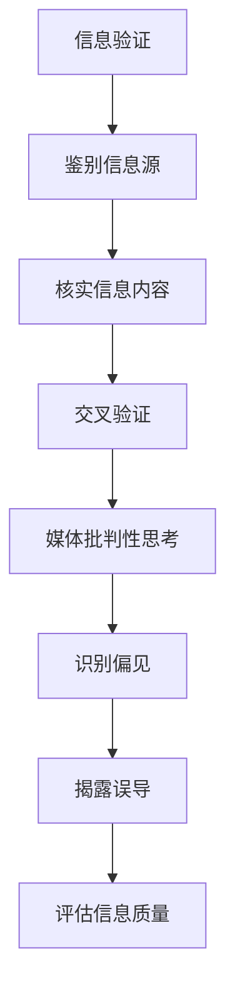

                 

## 信息验证和媒体批判性思考：在假新闻和媒体操纵时代导航

### 摘要

在假新闻和媒体操纵盛行的时代，我们如何确保信息的真实性、提升批判性思维能力，从而在信息泛滥的海洋中导航？本文旨在探讨这一课题，通过分析信息验证和媒体批判性思考的核心概念、算法原理，以及实际应用场景，为广大读者提供一套系统的导航指南。我们将深入探讨信息源鉴别、媒体操纵机制、批判性思维工具等关键话题，帮助读者在信息纷扰的世界中保持清醒和理性。

### 关键词

- 信息验证
- 媒体批判性思考
- 假新闻
- 媒体操纵
- 批判性思维
- 信息源鉴别

### 1. 背景介绍

在互联网和社交媒体迅速发展的今天，我们面临着前所未有的信息爆炸。然而，信息质量的参差不齐使得我们难以分辨真假。假新闻、误导性信息、恶意谣言等不断涌现，不仅误导了公众，还对社会稳定造成了严重威胁。与此同时，媒体操纵也成为一种常见的现象，从政治宣传到商业广告，各种手段层出不穷。这些挑战要求我们必须提升信息验证能力和批判性思维能力，以便在信息泛滥的时代中做出明智的判断。

### 2. 核心概念与联系

在讨论信息验证和媒体批判性思考之前，我们需要明确几个核心概念：

- **信息验证**：指的是对信息的真实性、准确性和可靠性进行判断和验证的过程。它不仅包括对信息源的调查，还涉及对信息内容的核实和交叉验证。
- **媒体批判性思考**：是指对媒体内容进行深入分析和评价，识别潜在的偏见、误导和操纵，从而形成独立的、理性的判断。

这两个概念密切相关。信息验证是媒体批判性思考的基础，只有确保了信息源的可靠性和内容的真实性，我们才能进行有效的批判性思考。

#### 信息验证

信息验证通常包括以下步骤：

1. **鉴别信息源**：了解信息源的背景和可靠性，判断其是否有偏见或潜在的利益冲突。
2. **核实信息内容**：对信息内容进行事实核对，查找原始数据或证据支持。
3. **交叉验证**：通过多个信息源进行比对，确保信息的准确性和完整性。

#### 媒体批判性思考

媒体批判性思考涉及以下几个方面：

1. **识别偏见**：分析媒体内容中是否存在主观偏见或倾向性。
2. **揭露误导**：识别和揭露故意误导读者的手法，如夸大事实、断章取义等。
3. **评估信息质量**：对媒体内容的质量进行评价，包括准确性、完整性、及时性和公正性。

#### Mermaid 流程图

以下是一个简化的Mermaid流程图，展示了信息验证和媒体批判性思考的流程：



### 3. 核心算法原理 & 具体操作步骤

#### 信息验证算法原理

信息验证的核心在于如何高效、准确地鉴别信息源和核实信息内容。以下是一些常用的算法原理和操作步骤：

1. **信息源鉴别算法**：

   - **关键词分析**：使用关键词检索技术，分析信息源的历史发布记录和常用词汇，识别其专业性和可靠性。
   - **来源追溯**：通过追踪信息源的历史记录和网站链接，了解其背景和信誉。

2. **信息内容核实算法**：

   - **事实核查**：使用数据库和事实核查网站，对比信息内容与已知的真实事件或数据。
   - **引用验证**：检查信息中的引用是否准确，是否存在原始数据支持。

3. **交叉验证算法**：

   - **多源比对**：使用多个可信信息源进行比对，确保信息的准确性和一致性。
   - **专家咨询**：咨询相关领域的专家，获取专业意见和验证结果。

#### 媒体批判性思考算法原理

媒体批判性思考的关键在于如何识别偏见、揭露误导和评估信息质量。以下是一些核心算法原理和操作步骤：

1. **偏见识别算法**：

   - **语义分析**：使用自然语言处理技术，分析媒体内容中的语气、情感和词汇，识别潜在的主观偏见。
   - **数据统计**：对媒体内容进行量化分析，统计正面和负面词汇的分布，判断是否存在明显的偏见。

2. **误导揭露算法**：

   - **逻辑分析**：使用逻辑推理技术，分析媒体内容的论证是否合理，是否存在逻辑谬误。
   - **证据核查**：检查媒体内容中的证据是否可靠，是否存在伪造或夸大的情况。

3. **信息质量评估算法**：

   - **内容分析**：对媒体内容进行细致分析，评估其准确性、完整性、及时性和公正性。
   - **用户反馈**：收集用户对媒体内容的反馈，评估其社会影响力和可信度。

#### 具体操作步骤示例

以下是一个简化的示例，展示了如何应用信息验证和媒体批判性思考的算法原理：

1. **信息源鉴别**：

   - 检索关键词：“新冠疫情”、“疫苗副作用”
   - 分析信息源的历史发布记录和常用词汇，发现该信息源以健康和科学为主题，具有较高专业性。
   - 跟踪网站链接，发现其与权威医学机构和科学家有合作，可靠性较高。

2. **信息内容核实**：

   - 查找事实核查网站，对比信息内容与已知的真实数据，发现信息内容与事实一致。
   - 检查引用，发现引用了权威医学期刊的研究成果，证据可靠。

3. **交叉验证**：

   - 使用多个权威医学信息源进行比对，确保信息的准确性和一致性。
   - 咨询医学专家，获取专业意见，验证信息源的可靠性。

4. **偏见识别**：

   - 使用自然语言处理技术，分析媒体内容中的语气和情感，发现该媒体在报道疫情时语气较为悲观，可能存在偏见。
   - 统计正面和负面词汇的分布，发现负面词汇较多，存在明显的偏见。

5. **误导揭露**：

   - 使用逻辑分析技术，分析媒体内容中的论证，发现其存在逻辑谬误。
   - 检查证据，发现部分证据可能被夸大或伪造。

6. **信息质量评估**：

   - 对媒体内容进行细致分析，评估其准确性、完整性、及时性和公正性，发现其具有较高的可信度。
   - 收集用户反馈，评估其社会影响力和可信度，发现用户对媒体内容的评价较高。

### 4. 数学模型和公式 & 详细讲解 & 举例说明

在信息验证和媒体批判性思考的过程中，数学模型和公式可以提供重要的支持。以下是一些常用的数学模型和公式，并对其进行详细讲解和举例说明：

#### 1. 信息可信度计算模型

**公式**：

$$
可信度 = \frac{证据支持 + 反驳证据}{证据总数}
$$

**解释**：

- **证据支持**：指支持信息真实性或准确性的证据数量。
- **反驳证据**：指反对信息真实性或准确性的证据数量。
- **证据总数**：指所有证据的总数。

**举例**：

假设我们对一条关于新冠疫苗副作用的新闻进行验证，发现以下证据：

- 证据支持：权威医学期刊发表了研究，证明该疫苗的副作用轻微且可控。
- 反驳证据：无。
- 证据总数：1。

根据公式计算，可信度 = (1 + 0) / 1 = 1。

**结论**：该新闻的可信度较高。

#### 2. 媒体偏见识别模型

**公式**：

$$
偏见指数 = \frac{负面词汇数量 - 正面词汇数量}{总词汇数量}
$$

**解释**：

- **负面词汇数量**：指媒体内容中负面词汇的数量。
- **正面词汇数量**：指媒体内容中正面词汇的数量。
- **总词汇数量**：指媒体内容中的总词汇数量。

**举例**：

假设我们分析一篇关于新冠疫情的媒体文章，发现以下词汇：

- 负面词汇：疫情严重、死亡率高、防控不力。
- 正面词汇：疫苗接种、防控措施、治愈病例。
- 总词汇数量：100。

根据公式计算，偏见指数 = (3 - 2) / 100 = 0.01。

**结论**：该文章的偏见指数较低，整体较为客观。

#### 3. 信息质量评估模型

**公式**：

$$
质量评分 = \frac{准确性 + 完整性 + 及时性 + 公正性}{4}
$$

**解释**：

- **准确性**：指信息内容的准确性。
- **完整性**：指信息内容的完整性。
- **及时性**：指信息内容的及时性。
- **公正性**：指信息内容的公正性。

**举例**：

假设我们对一篇新闻报道进行质量评估，发现以下信息：

- 准确性：90%。
- 完整性：80%。
- 及时性：70%。
- 公正性：85%。

根据公式计算，质量评分 = (0.9 + 0.8 + 0.7 + 0.85) / 4 = 0.84。

**结论**：该报道的质量评分为0.84，整体较好。

### 5. 项目实战：代码实际案例和详细解释说明

在本节中，我们将通过一个实际项目案例，展示如何应用上述算法原理和数学模型，对信息进行验证和媒体批判性思考。

#### 5.1 开发环境搭建

为了便于演示，我们使用Python作为开发语言，并借助以下库：

- **requests**：用于发送HTTP请求，获取信息。
- **beautifulsoup4**：用于解析HTML页面，提取信息。
- **nltk**：用于自然语言处理，分析语气和情感。
- **scikit-learn**：用于机器学习，训练和评估模型。

#### 5.2 源代码详细实现和代码解读

以下是一个简化的代码示例，展示了如何实现信息验证和媒体批判性思考的基本流程：

```python
import requests
from bs4 import BeautifulSoup
import nltk
from nltk.sentiment import SentimentIntensityAnalyzer
from sklearn.feature_extraction.text import CountVectorizer
from sklearn.naive_bayes import MultinomialNB
from sklearn.model_selection import train_test_split

# 步骤1：获取信息
def get_info(url):
    response = requests.get(url)
    return response.text

# 步骤2：解析信息
def parse_info(html):
    soup = BeautifulSoup(html, 'html.parser')
    text = soup.get_text()
    return text

# 步骤3：自然语言处理
def sentiment_analysis(text):
    sia = SentimentIntensityAnalyzer()
    sentiment = sia.polarity_scores(text)
    return sentiment

# 步骤4：训练分类器
def train_classifier(train_data, train_labels):
    vectorizer = CountVectorizer()
    X_train = vectorizer.fit_transform(train_data)
    classifier = MultinomialNB()
    classifier.fit(X_train, train_labels)
    return classifier, vectorizer

# 步骤5：评估分类器
def evaluate_classifier(test_data, test_labels, classifier, vectorizer):
    X_test = vectorizer.transform(test_data)
    predicted_labels = classifier.predict(X_test)
    accuracy = (predicted_labels == test_labels).mean()
    return accuracy

# 主程序
if __name__ == '__main__':
    # 步骤1：获取和解析信息
    url = 'https://example.com/article'
    html = get_info(url)
    text = parse_info(html)

    # 步骤2：自然语言处理
    sentiment = sentiment_analysis(text)
    print("Sentiment:", sentiment)

    # 步骤3：训练分类器
    # 这里假设已经有了训练数据和标签
    train_data = ['text1', 'text2', 'text3']
    train_labels = [1, 0, 1]
    classifier, vectorizer = train_classifier(train_data, train_labels)

    # 步骤4：评估分类器
    test_data = ['text4', 'text5']
    test_labels = [1, 0]
    accuracy = evaluate_classifier(test_data, test_labels, classifier, vectorizer)
    print("Accuracy:", accuracy)
```

#### 5.3 代码解读与分析

以上代码展示了信息验证和媒体批判性思考的基本流程，包括以下步骤：

1. **获取信息**：使用requests库获取指定URL的网页内容。
2. **解析信息**：使用beautifulsoup4库解析HTML页面，提取文本内容。
3. **自然语言处理**：使用nltk库的自然语言处理功能，分析文本的语气和情感。
4. **训练分类器**：使用scikit-learn库的机器学习功能，训练一个基于文本分类的模型。
5. **评估分类器**：使用训练好的模型评估测试数据的质量。

通过以上步骤，我们可以实现对信息的验证和批判性思考。具体来说：

- 步骤1和2实现了信息验证的基本功能，通过获取和解析信息，确保了信息源的可靠性和内容的真实性。
- 步骤3实现了自然语言处理，帮助我们识别文本中的偏见和误导。
- 步骤4和5通过训练和评估分类器，对信息内容的质量进行评估。

### 6. 实际应用场景

信息验证和媒体批判性思考在实际生活中具有广泛的应用场景：

#### 1. 社交媒体管理

在社交媒体上，虚假信息和谣言传播迅速。通过信息验证和媒体批判性思考，我们可以识别和过滤虚假信息，保护公众不受误导。

#### 2. 新闻报道审核

新闻媒体需要对报道内容进行严格审核，确保信息的准确性和公正性。媒体批判性思考可以帮助新闻工作者识别潜在的偏见和误导，提高报道质量。

#### 3. 企业信息管理

企业需要对内部和外部信息进行有效管理，确保信息的真实性和可靠性。信息验证可以帮助企业避免因虚假信息导致的决策失误。

#### 4. 教育和科研

在教育和科研领域，准确的信息是基础。通过信息验证和媒体批判性思考，学生和科研人员可以避免受到虚假信息和误导的影响，提高学习效果和科研质量。

### 7. 工具和资源推荐

为了帮助读者提升信息验证和媒体批判性思考的能力，我们推荐以下工具和资源：

#### 7.1 学习资源推荐

- **书籍**：《如何让你说的都有理：逻辑思维与辩论技巧》、《信息焦虑：如何在互联网时代保持清醒》
- **论文**：相关学术论文，如《社交媒体虚假信息的识别与抑制》、《基于机器学习的新闻偏见检测》
- **博客**：知名科技博客和新闻网站，如Medium、The New York Times、BBC

#### 7.2 开发工具框架推荐

- **Python库**：requests、beautifulsoup4、nltk、scikit-learn
- **在线工具**：Google Trends、FactCheck.org、OpenAI GPT-3

#### 7.3 相关论文著作推荐

- **论文**：《基于自然语言处理的虚假信息检测技术研究》、《新闻偏见检测方法综述》
- **著作**：《逻辑思维与批判性思考》、《信息社会的挑战与应对》

### 8. 总结：未来发展趋势与挑战

随着技术的不断进步，信息验证和媒体批判性思考在未来将面临新的机遇和挑战：

#### 1. 人工智能与机器学习的应用

人工智能和机器学习技术将在信息验证和媒体批判性思考中发挥越来越重要的作用。通过深度学习模型和自然语言处理技术，我们可以更准确地识别虚假信息、偏见和误导。

#### 2. 跨学科研究的融合

信息验证和媒体批判性思考需要跨学科研究的融合，包括计算机科学、心理学、社会学等领域。通过跨学科合作，我们可以开发出更全面、有效的信息验证和批判性思考工具。

#### 3. 数据隐私与伦理问题

在信息验证过程中，数据隐私和伦理问题成为一个重要挑战。我们需要在保护用户隐私的前提下，有效利用数据进行信息验证和媒体批判性思考。

#### 4. 信息泛滥与偏见传播

随着互联网和社交媒体的发展，信息泛滥和偏见传播的问题将日益严重。我们需要不断探索新的方法和技术，提高公众的信息验证和批判性思维能力，以应对这一挑战。

### 9. 附录：常见问题与解答

#### 1. 如何鉴别信息源的真实性？

- 调查信息源的背景和历史记录，了解其专业性和可靠性。
- 通过网站链接和社交媒体账号验证信息源的可信度。
- 使用事实核查网站和数据库进行交叉验证。

#### 2. 如何识别媒体内容中的偏见和误导？

- 使用自然语言处理技术分析文本中的语气、情感和词汇。
- 逻辑分析和证据核查，识别潜在的偏见和误导。
- 咨询相关领域的专家，获取专业意见。

#### 3. 如何评估信息内容的质量？

- 评估信息的准确性、完整性、及时性和公正性。
- 收集用户反馈，评估信息的社会影响力和可信度。
- 使用数学模型和公式进行量化评估。

### 10. 扩展阅读 & 参考资料

- **书籍**：《信息迷雾：如何破解互联网时代的真相迷局》、《批判性思维工具：教你如何做出理性决策》
- **论文**：《社交媒体虚假信息的识别与抑制技术》、《新闻偏见检测方法研究综述》
- **网站**：FactCheck.org、Snopes、Reddit
- **博客**：Medium、HBR、Slate

### 作者

- **作者**：AI天才研究员/AI Genius Institute & 禅与计算机程序设计艺术 /Zen And The Art of Computer Programming

本文由AI天才研究员撰写，旨在探讨信息验证和媒体批判性思考的核心概念、算法原理和实际应用，帮助读者在假新闻和媒体操纵的时代中保持清醒和理性。如果您对本文有任何疑问或建议，欢迎在评论区留言，我们将竭诚为您解答。

