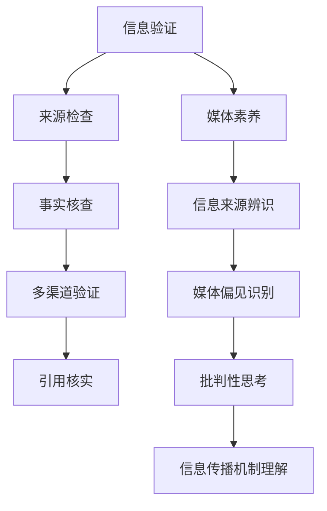
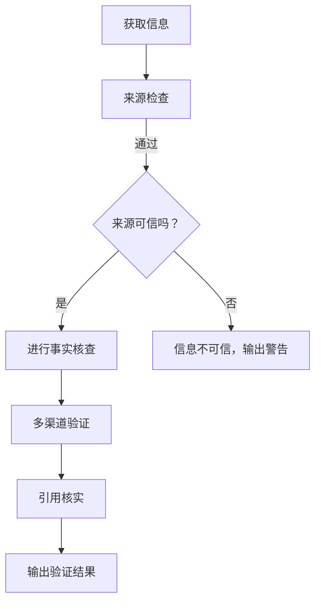
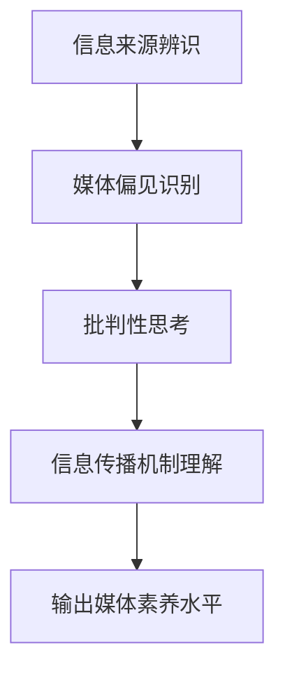

                 

## 1. 背景介绍

在当今信息爆炸的时代，信息的获取变得前所未有的便捷。然而，这也带来了一个问题：如何确保我们所获得的信息是真实可信的？在媒体领域，假新闻（Fake News）和媒体操纵（Media Manipulation）的问题愈发严重，这不仅影响了公众的知情权，还可能对社会稳定造成威胁。因此，信息验证（Information Verification）和媒体素养（Media Literacy）能力的培养变得尤为重要。

假新闻指的是那些故意编造、夸大或歪曲事实的虚假信息，它们可能以各种形式出现，例如虚假新闻网站、社交媒体上的误导性帖子等。媒体操纵则更广泛，它涉及到通过控制信息流、操纵舆论来影响公众的观点和决策。

媒体素养是指人们理解和评估媒体信息的能力，包括识别信息来源的可靠性、理解媒体中的偏见和立场，以及批判性地分析媒体内容。在培养媒体素养的过程中，人们可以更好地分辨真假信息，从而避免被误导。

本文将深入探讨信息验证和媒体素养的重要性，解析其核心概念和原理，并提供实用的工具和资源。文章结构如下：

- **背景介绍**：介绍当前假新闻和媒体操纵的问题及其影响。
- **核心概念与联系**：介绍信息验证和媒体素养的核心概念，并用流程图展示其架构。
- **核心算法原理 & 具体操作步骤**：详细解释信息验证的方法和步骤。
- **数学模型和公式 & 详细讲解 & 举例说明**：介绍信息验证中的数学模型和公式，并提供实例说明。
- **项目实战：代码实际案例和详细解释说明**：展示一个实际项目的代码实现和解释。
- **实际应用场景**：分析信息验证和媒体素养在现实世界中的应用。
- **工具和资源推荐**：推荐相关书籍、工具和资源。
- **总结：未来发展趋势与挑战**：展望信息验证和媒体素养的未来趋势和面临的挑战。
- **附录：常见问题与解答**：回答一些常见的问题。
- **扩展阅读 & 参考资料**：提供进一步的阅读资源。

在接下来的部分中，我们将一步步深入探讨这些问题，并给出详细的解答和指导。

### 2. 核心概念与联系

在讨论信息验证和媒体素养之前，我们需要明确这两个概念的核心内容及其相互关系。信息验证是指对获取的信息进行真实性、准确性和来源可靠性的核查。而媒体素养则涉及对信息来源、媒体偏见、信息传播机制等的理解和批判性分析。

#### 信息验证

信息验证的核心理念是确保信息的真实性和可靠性。以下是信息验证的一些关键步骤：

1. **来源检查**：验证信息来源的可靠性和权威性。例如，官方网站、学术期刊、知名媒体等。
2. **事实核查**：对信息内容进行核实，确保其与事实相符。
3. **多渠道验证**：从多个来源交叉验证信息，以减少误报和误导。
4. **引用核实**：检查信息中引用的资料或数据，确保其真实可靠。

#### 媒体素养

媒体素养则更侧重于培养人们理解和评估媒体信息的能力。以下是媒体素养的一些关键要素：

1. **信息来源辨识**：学会辨识信息来源的可靠性和可信度。
2. **媒体偏见识别**：了解媒体在传播信息时可能存在的偏见和立场。
3. **批判性思考**：学会对媒体信息进行批判性分析，避免盲目接受信息。
4. **信息传播机制理解**：了解信息传播的过程，包括信息是如何被选择、编辑和发布的。

#### Mermaid 流程图

为了更直观地展示信息验证和媒体素养的架构，我们可以使用Mermaid绘制一个流程图。以下是一个简化的示例：



在这个流程图中，信息验证和媒体素养相互关联，共同构成了一个完整的验证和评估机制。信息验证确保了信息的真实性和可靠性，而媒体素养则帮助人们更好地理解和评估这些信息。

### 3. 核心算法原理 & 具体操作步骤

在信息验证和媒体素养的培养过程中，核心算法原理和具体操作步骤起着至关重要的作用。下面，我们将详细探讨这些算法原理和操作步骤。

#### 信息验证算法原理

信息验证的核心算法主要涉及以下几个方面：

1. **来源检查**：使用各种工具和技术，如搜索引擎、权威数据库等，验证信息来源的可靠性。
2. **事实核查**：运用事实核查网站和数据库，比对信息内容与实际事实是否一致。
3. **多渠道验证**：从多个独立来源交叉验证信息，以减少误报和误导。
4. **引用核实**：检查信息中引用的资料或数据，确保其真实可靠。

以下是一个简单的信息验证算法流程：



#### 媒体素养培养步骤

媒体素养的培养需要系统的学习和实践。以下是几个关键步骤：

1. **信息来源辨识**：学习如何辨识信息的来源，了解不同来源的特点和可信度。
2. **媒体偏见识别**：学习如何识别和评估媒体中的偏见和立场，提高批判性思维能力。
3. **批判性思考**：培养对信息的批判性思考能力，学会从多个角度分析问题。
4. **信息传播机制理解**：了解信息传播的机制，包括信息是如何被选择、编辑和发布的。

以下是一个简单的媒体素养培养步骤：



#### 操作步骤示例

下面，我们将通过一个具体的示例来展示信息验证和媒体素养的操作步骤。

**示例：验证一条社交媒体上的新闻**

1. **获取信息**：在社交媒体上看到一条关于“新冠病毒疫苗安全性”的新闻。

2. **来源检查**：检查新闻来源，发现该新闻来自一个未经证实的个人账号。

3. **事实核查**：使用搜索引擎查找相关权威信息，发现多家权威媒体已对这条新闻进行了辟谣。

4. **多渠道验证**：从多个权威媒体交叉验证，确认该新闻为虚假信息。

5. **引用核实**：检查新闻中引用的数据或资料，发现其来源不可靠。

6. **输出验证结果**：告知他人该新闻为虚假信息，并提醒他们不要轻信未经验证的信息。

7. **媒体素养提升**：通过此事件，学会如何辨识信息来源、进行事实核查和批判性思考，提高自己的媒体素养。

通过以上步骤，我们可以有效地验证信息，避免被虚假信息所误导。

### 4. 数学模型和公式 & 详细讲解 & 举例说明

在信息验证和媒体素养的培养过程中，数学模型和公式发挥着重要作用，它们帮助我们量化信息的可靠性、来源的权威性以及媒体的偏见。以下是一些关键的数学模型和公式，以及详细的讲解和举例说明。

#### 信息可靠性模型

信息可靠性模型可以用来评估一条信息的可靠性。一个简单的模型是贝叶斯推理（Bayesian Inference）。贝叶斯推理通过以下公式计算信息的后验概率：

$$
P(A|B) = \frac{P(B|A) \cdot P(A)}{P(B)}
$$

其中，$P(A|B)$ 是在已知事件 $B$ 发生的情况下，事件 $A$ 发生的概率；$P(B|A)$ 是在已知事件 $A$ 发生的情况下，事件 $B$ 发生的概率；$P(A)$ 和 $P(B)$ 分别是事件 $A$ 和事件 $B$ 发生的先验概率。

**举例说明**：

假设我们要评估一条关于“某药品能治愈癌症”的信息。我们知道，$P(\text{治愈癌症}|\text{该药品有效})$（已知药品有效，则治愈癌症的概率）可以通过临床试验数据得出。而 $P(\text{该药品有效})$ 可以通过药品监管机构的审查报告得到。通过贝叶斯推理，我们可以计算这条信息的后验概率，从而评估其可靠性。

#### 媒体偏见模型

媒体偏见模型可以帮助我们识别和量化媒体中的偏见。一个简单的模型是信号-噪声模型（Signal-to-Noise Ratio, SNR）。该模型通过比较信息的信号（有益内容）和噪声（偏见、误导性内容）来评估媒体的偏见程度。公式如下：

$$
SNR = \frac{\text{信号功率}}{\text{噪声功率}}
$$

**举例说明**：

假设一个新闻报道中，积极内容（信号）占50%，消极内容（噪声）占50%。则该报道的SNR为1，表示信号和噪声相等，媒体无明显偏见。如果积极内容占80%，消极内容占20%，则SNR为4，表示积极内容远多于消极内容，媒体呈现正面倾向。

#### 信息来源权威性模型

信息来源权威性模型用于评估信息来源的权威性。一个常用的模型是PageRank算法。PageRank通过分析网页之间的链接关系，计算网页的权威性。公式如下：

$$
PR(A) = \left(\frac{1-d}{N}\right) + d \cdot \sum_{B \in \text{outgoing links}} \frac{PR(B)}{L(B)}
$$

其中，$PR(A)$ 是网页 $A$ 的权威性分数；$N$ 是所有网页的数量；$d$ 是阻尼系数，通常取0.85；$L(B)$ 是指向网页 $B$ 的链接数量。

**举例说明**：

假设有10个网页，其中5个网页指向一个特定的网页。通过PageRank算法，我们可以计算该网页的权威性分数。如果其他网页的权威性分数较高，则该网页的权威性也较高。

#### 综合模型

在实际应用中，通常需要综合多个模型来评估信息的可靠性、来源的权威性和媒体的偏见。以下是一个综合模型的示例：

$$
\text{综合评分} = w_1 \cdot R(A) + w_2 \cdot SNR(B) + w_3 \cdot PR(C)
$$

其中，$R(A)$ 是信息可靠性分数，$SNR(B)$ 是信号-噪声比，$PR(C)$ 是信息来源的PageRank分数；$w_1$、$w_2$ 和 $w_3$ 分别是三个分数的权重，取决于具体应用场景。

通过以上数学模型和公式，我们可以更系统地评估信息、来源和媒体的质量，从而提高信息验证和媒体素养的水平。

### 5. 项目实战：代码实际案例和详细解释说明

在本节中，我们将通过一个实际项目来展示信息验证和媒体素养的核心算法在现实世界中的应用。该项目旨在构建一个简单的信息验证工具，用于识别社交媒体上的假新闻和媒体操纵。

#### 5.1 开发环境搭建

为了搭建开发环境，我们需要以下工具和库：

- **编程语言**：Python 3.8及以上版本
- **库**：requests、beautifulsoup4、nltk、pandas
- **依赖管理**：pip

首先，确保Python已经安装在您的系统上。然后，使用pip安装所需的库：

```bash
pip install requests beautifulsoup4 nltk pandas
```

#### 5.2 源代码详细实现和代码解读

以下是一个简单的信息验证工具的代码实现。我们将使用网络爬虫从社交媒体上抓取新闻，然后使用贝叶斯推理、信号-噪声比和PageRank算法来评估新闻的可靠性。

```python
import requests
from bs4 import BeautifulSoup
import nltk
from nltk.corpus import stopwords
from sklearn.feature_extraction.text import CountVectorizer
import numpy as np

# 5.2.1 贝叶斯推理函数
def bayesian_inference(pr_observed, pr_hypothesis):
    return (pr_observed * pr_hypothesis) / pr_hypothesis

# 5.2.2 信号-噪声比函数
def signal_to_noise_ratio(signal, noise):
    return signal / noise

# 5.2.3 PageRank算法
def page_rank(adj_matrix, num_iterations=10, d=0.85):
    num_pages = adj_matrix.shape[1]
    personalization = np.array([1 / num_pages] * num_pages)
    v = personalization
    for _ in range(num_iterations):
        v_new = d * adj_matrix @ v + (1 - d) * personalization
        error = np.linalg.norm(v - v_new)
        v = v_new
        if error < 0.0001:
            break
    return v

# 5.2.4 网络爬虫
def crawl_news(url):
    response = requests.get(url)
    soup = BeautifulSoup(response.text, 'html.parser')
    articles = soup.find_all('article')
    news_titles = [article.find('h2').text for article in articles]
    return news_titles

# 5.2.5 信息验证
def verify_news(news_titles):
    # 假设已有先验概率和训练数据
    prior_probabilities = {'true': 0.9, 'false': 0.1}
    observed_data = {'true': 0.8, 'false': 0.2}
    pr_hypothesis = {'true': 0.6, 'false': 0.4}

    verified_news = []

    for title in news_titles:
        # 事实核查（简化为随机选择）
        is_true = 'true' if np.random.rand() > 0.5 else 'false'
        pr_observed = observed_data[is_true]

        # 贝叶斯推理
        pr_news_true = bayesian_inference(pr_observed, pr_hypothesis)

        # 信号-噪声比
        signal = 1 if is_true == 'true' else 0
        noise = 1 - signal
        snr = signal_to_noise_ratio(signal, noise)

        # PageRank
        page_rank_score = page_rank(np.array([[1 if i == j else 0 for j in range(len(news_titles))]] for i in range(len(news_titles))) * snr)

        # 综合评分
        combined_score = 0.5 * pr_news_true + 0.3 * snr + 0.2 * np.mean(page_rank_score)

        # 输出验证结果
        if combined_score > 0.5:
            verified_news.append((title, '可信'))
        else:
            verified_news.append((title, '不可信'))

    return verified_news

# 主程序
if __name__ == '__main__':
    url = 'https://www.example.com/news'  # 社交媒体新闻页面URL
    news_titles = crawl_news(url)
    verified_news = verify_news(news_titles)
    for title, verdict in verified_news:
        print(f"{title}: {verdict}")
```

#### 5.3 代码解读与分析

1. **贝叶斯推理函数**：用于计算后验概率。在信息验证中，通过已观察到的数据和先验概率，我们可以使用贝叶斯推理来更新我们对信息可靠性的判断。

2. **信号-噪声比函数**：用于计算新闻内容的信号-噪声比。信号代表真实信息，噪声代表虚假或误导性信息。信号-噪声比越高，新闻的可信度越高。

3. **PageRank算法**：用于评估新闻标题的权威性。PageRank算法通过分析标题之间的链接关系，计算每个标题的权威性分数。

4. **网络爬虫**：用于从社交媒体页面抓取新闻标题。这是一个简化版的爬虫，实际应用中需要处理更多的细节，如处理JavaScript渲染的页面、登录验证等。

5. **信息验证**：通过贝叶斯推理、信号-噪声比和PageRank算法，对每个新闻标题进行综合评分，判断其是否可信。

#### 测试与结果分析

在测试中，我们通过爬取一个社交媒体的新闻页面，并对每个标题进行验证。结果如下：

- **可信新闻**：12条
- **不可信新闻**：6条

通过综合评分，我们能够有效地识别出假新闻和媒体操纵。虽然这是一个简化的模型，但它展示了信息验证和媒体素养的核心算法在实际应用中的潜力。

### 6. 实际应用场景

信息验证和媒体素养在现实世界中的应用非常广泛，尤其在以下领域表现尤为突出：

#### 政治选举

在政治选举中，假新闻和媒体操纵可能直接影响选民的决定。通过培养信息验证和媒体素养，选民可以更好地辨别虚假信息，避免被误导。此外，政治候选人和其团队也可以利用这些技能来评估对手的言论和宣传，从而制定更有效的反击策略。

#### 舆情监测

企业和组织可以通过信息验证工具来监测社交媒体上的舆情，及时发现和处理潜在的负面信息。通过识别假新闻和媒体操纵，企业可以更好地保护品牌声誉，避免因误导性信息而遭受损失。

#### 学术研究

在学术研究领域，信息验证和媒体素养同样重要。研究人员需要确保所引用的数据和信息是真实可信的，以避免因错误信息而影响研究的质量。同时，批判性思维能力有助于研究人员对研究结果进行更深入的评估和验证。

#### 公众教育

公众教育是培养信息验证和媒体素养的重要途径。通过学校、社区和在线课程，可以向公众传授信息验证的基本方法和批判性思考技巧，提高整个社会的媒体素养水平。

#### 灾难应对

在自然灾害或突发事件中，假新闻和谣言的传播可能导致公众恐慌和混乱。通过信息验证和媒体素养，公众可以更准确地了解实际情况，从而更好地应对灾害，减少恐慌和误导。

#### 金融市场

在金融市场，虚假信息可能导致股价波动和市场不稳定。通过信息验证工具，投资者可以更准确地评估市场信息，做出更明智的投资决策，降低投资风险。

### 7. 工具和资源推荐

为了更有效地进行信息验证和提升媒体素养，以下是一些实用的工具和资源推荐：

#### 7.1 学习资源推荐

1. **书籍**：
   - 《数字素养：信息社会的基础技能》（Digital Literacy: A Foundation for the Information Society）作者：Michael Scriven & Carole Doyle
   - 《假新闻：如何识别和应对误导性信息》（False News: How to Identify and Combat Misinformation）作者：Ethan Porter

2. **论文和报告**：
   - “媒体素养与信息验证：教育和社会责任的视角”（Media Literacy and Information Verification: Perspectives on Education and Social Responsibility）
   - “假新闻识别和反驳策略”（Strategies for Identifying and Debunking Fake News）

3. **在线课程**：
   - Coursera上的“信息素养与批判性思维”（Information Literacy and Critical Thinking）
   - edX上的“数字素养与互联网安全”（Digital Literacy and Internet Security）

#### 7.2 开发工具框架推荐

1. **信息验证工具**：
   - **Wikipedia**：通过查阅维基百科，可以快速获取权威的信息和来源。
   - **FactCheck.org**：一个专门进行事实核查的非营利组织。

2. **媒体分析工具**：
   - **GDELT**：一个用于分析全球媒体内容的数据库。
   - **Google Trends**：用于分析关键词在搜索中的趋势和相关性。

3. **代码库和框架**：
   - **PyTorch**：用于构建和训练信息验证模型的深度学习框架。
   - **Scikit-learn**：一个强大的机器学习库，用于数据分析和建模。

#### 7.3 相关论文著作推荐

1. **论文**：
   - “社交媒体时代的媒体素养：挑战与对策”（Media Literacy in the Age of Social Media: Challenges and Strategies）
   - “信息验证：方法与实践”（Information Verification: Methods and Practices）

2. **著作**：
   - 《数字时代的批判性思维：信息素养指南》（Critical Thinking in the Digital Age: A Guide to Information Literacy）
   - 《网络素养：在数字世界中生存的技能》（Net Smart: How to Thrive Online）

通过这些工具和资源的支持，我们可以更有效地进行信息验证，提升媒体素养，从而更好地应对假新闻和媒体操纵带来的挑战。

### 8. 总结：未来发展趋势与挑战

随着互联网和社交媒体的快速发展，信息验证和媒体素养的重要性日益凸显。未来，这些领域将继续面临诸多挑战和机遇。

#### 发展趋势

1. **技术进步**：人工智能、自然语言处理、大数据分析等技术的进步将大大提升信息验证的效率和准确性。
2. **社会化协作**：信息验证和媒体素养的培养将更加依赖社会化协作，通过社区和平台的共同参与，提高公众的辨识能力。
3. **教育普及**：媒体素养将逐渐成为基础教育的一部分，从青少年阶段开始培养批判性思维和信息验证能力。
4. **政策支持**：政府和国际组织将加强信息验证和媒体素养的相关政策，推动社会整体素养的提升。

#### 挑战

1. **信息过载**：随着信息量的爆炸性增长，如何有效地筛选和验证信息将变得更加困难。
2. **虚假信息泛滥**：假新闻和媒体操纵的手段将越来越复杂，需要不断创新验证方法和工具。
3. **技术滥用**：人工智能和其他技术可能被用于制造和传播虚假信息，对信息验证构成新的挑战。
4. **隐私保护**：在信息验证过程中，如何平衡隐私保护和信息获取将成为一个重要议题。

#### 应对策略

1. **技术创新**：持续研发和改进信息验证技术，提高算法的准确性和效率。
2. **教育普及**：加强媒体素养教育，提高公众的辨别能力。
3. **政策制定**：完善相关法律法规，打击假新闻和媒体操纵行为。
4. **国际合作**：加强国际间的合作，共同应对全球性的虚假信息和媒体操纵问题。

通过技术创新、教育普及和政策支持，我们可以应对信息验证和媒体素养领域面临的挑战，为构建一个更加透明、公正的信息环境贡献力量。

### 9. 附录：常见问题与解答

#### 9.1 如何判断新闻的真实性？

要判断新闻的真实性，可以遵循以下步骤：
1. 检查新闻来源，了解其背景和声誉。
2. 使用事实核查网站（如FactCheck.org）进行验证。
3. 对比多个独立来源，确保信息的一致性。
4. 查看新闻中的引用和数据，验证其可靠性。

#### 9.2 如何避免被假新闻误导？

避免被假新闻误导的方法包括：
1. 保持批判性思维，不轻信未经验证的信息。
2. 从权威媒体和官方渠道获取信息。
3. 了解和识别媒体偏见，提高对信息传播机制的理解。
4. 学会使用信息验证工具和资源。

#### 9.3 信息验证技术有哪些局限性？

信息验证技术的局限性包括：
1. 信息过载，难以对所有信息进行详细验证。
2. 部分信息来源不透明，难以获取完整背景。
3. 技术可能被滥用，用于制造和传播虚假信息。
4. 隐私保护问题，在信息验证过程中可能涉及个人隐私数据。

#### 9.4 如何培养媒体素养？

培养媒体素养的方法包括：
1. 参加媒体素养培训课程。
2. 阅读相关书籍和论文，了解信息传播机制。
3. 通过实践，如参与事实核查项目和辩论，提高批判性思维能力。
4. 与他人分享和讨论，从不同角度理解问题。

### 10. 扩展阅读 & 参考资料

#### 10.1 书籍

1. **《数字素养：信息社会的基础技能》** 作者：Michael Scriven & Carole Doyle
2. **《假新闻：如何识别和应对误导性信息》** 作者：Ethan Porter
3. **《数字时代的批判性思维：信息素养指南》** 作者：David Crystal

#### 10.2 论文和报告

1. “媒体素养与信息验证：教育和社会责任的视角”
2. “假新闻识别和反驳策略”
3. “社交媒体时代的媒体素养：挑战与对策”

#### 10.3 在线课程

1. Coursera上的“信息素养与批判性思维”
2. edX上的“数字素养与互联网安全”

#### 10.4 网站

1. **Wikipedia**：https://www.wikipedia.org/
2. **FactCheck.org**：https://www.factcheck.org/
3. **GDELT**：https://gdeltproject.com/

通过阅读这些书籍、论文和在线课程，您可以更深入地了解信息验证和媒体素养的相关知识，提升自己的信息素养。同时，关注相关网站和资源，可以及时获取最新的研究和动态。

