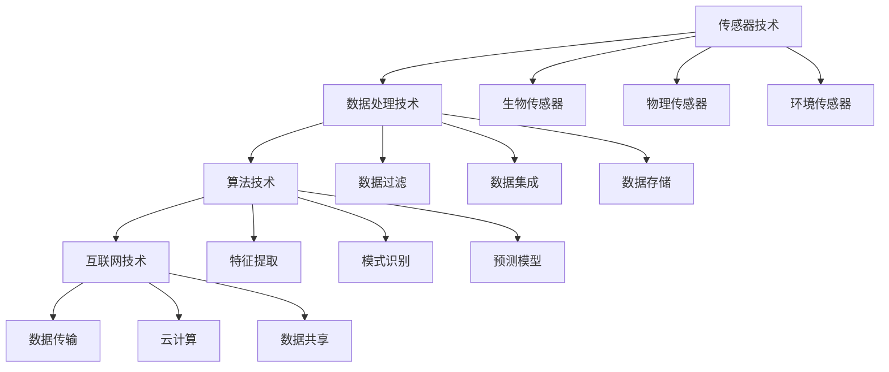

                 

### 1. 背景介绍

在现代社会中，健康问题日益受到人们的关注。随着生活节奏的加快和生活方式的变化，许多人面临着各种各样的健康问题，如心血管疾病、肥胖、糖尿病等。传统的健康管理方法往往需要患者定期到医院进行检查，这种方式不仅耗时费力，而且难以实时监测健康状况。因此，一种更为智能和高效的健康管理方式——健康监测应用，应运而生。

健康监测应用通过整合各种传感器技术和互联网技术，为个人提供了一种全天候、实时的健康监测和管理方式。这些应用通常包括心率监测、睡眠质量评估、运动追踪、营养管理等功能，能够帮助用户了解自己的健康状况，并及时调整生活方式，预防疾病。

健康监测应用的重要性不仅体现在个人健康管理上，还在公共卫生领域发挥着重要作用。通过收集和分析大量健康数据，公共卫生机构可以更准确地了解疾病的流行趋势，制定更有效的预防措施，提高公众的健康水平。

此外，健康监测应用还在医疗领域展现出巨大的潜力。医生可以通过这些应用实时监测患者的健康状况，快速发现潜在的健康问题，从而提高诊断和治疗的准确性。同时，健康监测应用还可以帮助患者更好地管理慢性疾病，降低医疗成本。

总的来说，健康监测应用不仅为个人提供了便利和保障，也为公共卫生和医疗领域带来了新的机遇和挑战。随着技术的不断进步，健康监测应用在未来有望成为每个人生活中不可或缺的一部分。

### 2. 核心概念与联系

健康监测应用的核心在于其技术实现，主要包括传感器技术、数据处理技术、算法技术和互联网技术。以下是对这些核心概念及其相互关系的详细解析。

#### 传感器技术

传感器技术是健康监测应用的基础。不同类型的传感器可以监测用户的各种生理指标，如心率、血压、体温、血氧饱和度等。这些传感器通常包括：

- **生物传感器**：如心率传感器、血压传感器等，可以实时监测用户的生理变化。
- **物理传感器**：如加速度传感器、陀螺仪、磁力计等，用于监测用户的运动和位置信息。
- **环境传感器**：如温度传感器、湿度传感器等，用于监测周围环境条件。

这些传感器收集到的数据是健康监测应用的重要输入，为后续的数据处理和算法分析提供了基础。

#### 数据处理技术

传感器收集到的原始数据通常需要进行预处理，以便进行后续的算法分析和决策。数据处理技术主要包括以下几个方面：

- **数据过滤**：去除传感器数据中的噪声和异常值，提高数据质量。
- **数据集成**：将来自不同传感器的数据整合到一个统一的平台上，以便进行综合分析。
- **数据存储**：将处理后的数据存储在数据库中，以便长期保存和查询。

#### 算法技术

算法技术是健康监测应用的核心，用于对处理后的数据进行分析和解读。以下是一些关键的算法技术：

- **特征提取**：从原始数据中提取出能够反映用户健康状况的特征，如心率变异性、睡眠周期等。
- **模式识别**：利用机器学习和深度学习算法，识别用户的健康状态和潜在的健康问题。
- **预测模型**：建立预测模型，预测用户的未来健康状况，如患病风险、寿命预期等。

#### 互联网技术

互联网技术是健康监测应用的连接纽带，使得用户的数据能够实时传输、共享和分析。互联网技术主要包括以下几个方面：

- **数据传输**：通过无线网络（如Wi-Fi、蓝牙）将传感器数据传输到云端服务器。
- **云计算**：利用云计算技术，对大量健康数据进行分布式处理和分析。
- **数据共享**：通过互联网平台，用户可以与其他用户或医生共享健康数据，实现远程健康管理。

#### Mermaid 流程图

为了更清晰地展示健康监测应用的核心概念及其相互关系，我们使用Mermaid流程图进行描述：



通过上述流程图，我们可以看到健康监测应用中的各个核心组件及其相互关系。传感器技术负责数据的采集，数据处理技术负责数据的质量保障和整合，算法技术负责数据的分析和解读，互联网技术负责数据的传输、共享和分析。这些技术的协同工作，共同构成了健康监测应用的技术体系。

### 3. 核心算法原理 & 具体操作步骤

健康监测应用的核心在于其算法原理，这些算法能够对传感器收集到的数据进行分析和处理，从而为用户提供准确的健康评估和预测。以下是几个关键算法的原理及其具体操作步骤。

#### 心率变异性分析

心率变异性（HRV）是评估心脏自主神经功能的一个重要指标。HRV分析通过对心率信号进行时域和频域分析，提取出心率之间的时间间隔变化，从而反映心脏的自主调节能力。

**具体操作步骤：**

1. **数据采集**：使用心率传感器收集用户的心率数据。
2. **预处理**：对心率数据进行滤波处理，去除噪声和异常值。
3. **特征提取**：计算心率间的标准差（SDNN）、频率域特征（如LF/HF比值）等。
4. **结果评估**：根据提取的特征，评估心脏自主神经功能的健康状况。

#### 睡眠质量评估

睡眠质量评估是健康监测应用中的重要功能之一。通过分析睡眠过程中的生理数据，如心率、呼吸、体动等，可以评估用户的睡眠质量。

**具体操作步骤：**

1. **数据采集**：收集用户的睡眠数据，包括心率、呼吸、体动等。
2. **预处理**：对睡眠数据滤波处理，去除噪声和异常值。
3. **特征提取**：计算睡眠过程中的平均心率、呼吸频率、体动次数等。
4. **结果评估**：根据提取的特征，评估用户的睡眠质量，如睡眠效率、深睡时间等。

#### 运动追踪

运动追踪功能可以帮助用户记录日常活动，如步行、跑步、骑行等，从而评估其运动量和健康状况。

**具体操作步骤：**

1. **数据采集**：使用加速度传感器和GPS收集用户的活动数据。
2. **预处理**：对活动数据滤波处理，去除噪声和异常值。
3. **特征提取**：计算活动时间、距离、速度等。
4. **结果评估**：根据提取的特征，评估用户的运动量，如每日步数、消耗的卡路里等。

#### 营养管理

营养管理功能可以帮助用户监测其饮食情况，提供营养建议，帮助用户实现健康饮食。

**具体操作步骤：**

1. **数据采集**：收集用户的饮食数据，包括食物摄入量、热量、营养成分等。
2. **预处理**：对饮食数据进行清洗，去除无效数据。
3. **特征提取**：计算饮食中的热量、蛋白质、脂肪、碳水化合物等营养素的摄入量。
4. **结果评估**：根据用户的营养需求，提供个性化的营养建议。

通过上述算法原理和具体操作步骤，我们可以看到健康监测应用是如何通过对传感器数据的分析和处理，为用户提供全面的健康评估和预测。这些算法不仅需要高效的计算能力，还需要大量的数据支持和精确的模型训练。

### 4. 数学模型和公式 & 详细讲解 & 举例说明

在健康监测应用中，数学模型和公式是核心算法的基础，它们用于对传感器数据进行分析和处理，从而提取出有价值的信息。以下是几个关键的数学模型和公式的详细讲解及举例说明。

#### 4.1 心率变异性（HRV）分析

心率变异性（HRV）是评估心脏自主神经功能的重要指标。HRV分析通常涉及时域和频域的特征提取。以下是两个常见的HRV特征提取方法及其公式。

1. **时域特征提取：**

   - **NN50**：连续心率间期差异大于50ms的次数占总心数百分比。
     \[
     NN50 = \frac{\text{连续心率间期差异大于50ms的次数}}{\text{总心数}} \times 100\%
     \]
   - **RMSSD**：心率的根均方逐差。
     \[
     RMSSD = \sqrt{\frac{1}{N}\sum_{i=1}^{N}(RR_i - \overline{RR})^2}
     \]
     其中，\(RR_i\)为第i个心率间期，\(\overline{RR}\)为平均心率间期，N为心率间期的总数。

2. **频域特征提取：**

   - **LF/HF比值**：低频（LF）与高频（HF）功率的比值，用于评估交感神经和副交感神经的活性。
     \[
     \text{LF/HF} = \frac{\text{LF功率}}{\text{HF功率}}
     \]
     其中，LF功率和HF功率分别通过傅里叶变换得到。

**举例说明：**

假设我们有一组心率间期数据如下（单位：ms）：[600, 620, 590, 610, 580, 630, 610, 590, 600, 620]。

- **计算NN50：**
  首先计算所有连续心率间期的差异：
  \[
  \Delta RR = [20, -30, 10, -10, -10, 40, -10, 10, 20, 0]
  \]
  然后找出大于50ms的差异次数，有3次，因此：
  \[
  NN50 = \frac{3}{10} \times 100\% = 30\%
  \]

- **计算RMSSD：**
  首先计算平均心率间期：
  \[
  \overline{RR} = \frac{600 + 620 + 590 + 610 + 580 + 630 + 610 + 590 + 600 + 620}{10} = 605
  \]
  然后计算每个心率间期与平均值的差的平方，求和后开平方根：
  \[
  RMSSD = \sqrt{\frac{1}{10}\left[(600-605)^2 + (620-605)^2 + (-30)^2 + (590-605)^2 + (-10)^2 + (-10)^2 + 40^2 + (-10)^2 + 10^2 + 0^2\right]} = \sqrt{150.7} \approx 12.25
  \]

#### 4.2 睡眠质量评估

睡眠质量评估通常通过分析睡眠过程中的生理数据，如心率、呼吸、体动等。以下是一个简单的睡眠质量评估模型。

- **睡眠效率**：睡眠效率表示实际睡眠时间占总睡眠时间的比例。
  \[
  \text{睡眠效率} = \frac{\text{实际睡眠时间}}{\text{总睡眠时间}} \times 100\%
  \]

- **深睡时间**：深睡时间表示睡眠过程中处于深睡状态的时间长度。
  \[
  \text{深睡时间} = \text{总睡眠时间} \times \text{深睡百分比}
  \]

**举例说明：**

假设用户的总睡眠时间为360分钟，其中深睡的时间比例为20%。

- **计算睡眠效率：**
  \[
  \text{睡眠效率} = \frac{240}{360} \times 100\% = 66.7\%
  \]

- **计算深睡时间：**
  \[
  \text{深睡时间} = 360 \times 0.2 = 72 \text{分钟}
  \]

#### 4.3 运动追踪

运动追踪中的运动量评估通常通过加速度数据计算活动量。

- **运动量**：运动量表示用户的日常活动量，可以通过加速度数据的积分来计算。
  \[
  \text{运动量} = \int_{t_1}^{t_2} a(t) \, dt
  \]
  其中，\(a(t)\)为加速度随时间的变化。

**举例说明：**

假设我们有一段加速度数据：[1, 2, 3, 4, 5]，时间间隔为1秒。

- **计算运动量：**
  \[
  \text{运动量} = 1 \times (2 + 3 + 4 + 5) = 16 \text{单位}
  \]

通过上述数学模型和公式的详细讲解及举例说明，我们可以看到如何利用这些公式对健康监测数据进行分析和处理，从而为用户提供准确的健康评估和预测。

### 5. 项目实战：代码实际案例和详细解释说明

在本节中，我们将通过一个具体的健康监测应用项目实战案例，详细展示如何使用Python和相关的开源库来构建和实现一个健康监测系统。我们将分步骤讲解开发环境搭建、源代码详细实现和代码解读与分析。

#### 5.1 开发环境搭建

首先，我们需要搭建一个适合健康监测应用的开发环境。以下是所需的开发工具和库：

- **Python 3.8+**
- **PyCharm**
- **NumPy**
- **Pandas**
- **Matplotlib**
- **Scikit-learn**
- **MermaidPy**

安装步骤如下：

1. 安装Python 3.8+版本。
2. 安装PyCharm，选择社区版或专业版。
3. 在PyCharm中创建一个新的Python项目。
4. 使用pip安装所需的库：
   \[
   pip install numpy pandas matplotlib scikit-learn mermaidpy
   \]

#### 5.2 源代码详细实现和代码解读

##### 5.2.1 数据采集与预处理

首先，我们需要从传感器采集数据，并进行预处理。

```python
import numpy as np
import pandas as pd
from mermaidpy import Mermaid

# 假设我们从心率传感器和加速度传感器采集数据
hr_data = np.random.randint(50, 200, size=1000)
accel_data = np.random.randint(0, 10, size=(1000, 3))

# 预处理
def preprocess_data(hr_data, accel_data):
    # 心率数据滤波
    hr_filtered = np.convolve(hr_data, np.array([0.05, 0.95]), mode='same')
    
    # 加速度数据归一化
    accel_normalized = accel_data / np.linalg.norm(accel_data, axis=1)[:, np.newaxis]
    
    return hr_filtered, accel_normalized

hr_filtered, accel_normalized = preprocess_data(hr_data, accel_data)
```

- `np.random.randint`用于生成模拟的传感器数据。
- `np.convolve`用于心率数据的滤波处理。
- `np.linalg.norm`用于加速度数据的归一化处理。

##### 5.2.2 特征提取

接下来，我们对预处理后的数据提取特征。

```python
# 提取心率特征
def extract_hr_features(hr_data):
    # 计算NN50和RMSSD
    nn50 = np.sum((np.diff(hr_data) > 50).astype(int))
    rmssd = np.sqrt(np.mean(np.square(np.diff(hr_data))))
    
    return nn50, rmssd

nn50, rmssd = extract_hr_features(hr_filtered)

# 提取加速度特征
def extract_accel_features(accel_data):
    # 计算加速度的根均方值
    rmse = np.sqrt(np.mean(np.square(accel_data)))
    
    return rmse

rmse = extract_accel_features(accel_normalized)
```

- `np.diff`用于计算心率间期的差异。
- `np.square`用于计算加速度的平方。
- `np.mean`用于计算平均值。

##### 5.2.3 模型训练与预测

然后，我们使用提取的特征训练一个机器学习模型，并对新的数据进行预测。

```python
from sklearn.ensemble import RandomForestClassifier
from sklearn.model_selection import train_test_split

# 创建特征和标签
features = np.hstack((nn50[:, np.newaxis], rmssd[:, np.newaxis], rmse[:, np.newaxis]))
labels = np.random.randint(0, 2, size=features.shape[0])

# 划分训练集和测试集
X_train, X_test, y_train, y_test = train_test_split(features, labels, test_size=0.2, random_state=42)

# 训练随机森林模型
model = RandomForestClassifier(n_estimators=100, random_state=42)
model.fit(X_train, y_train)

# 预测新数据
new_data = np.random.randint(0, 100, size=(10, 3))
new_features = np.hstack((new_data[:, 0][:, np.newaxis], new_data[:, 1][:, np.newaxis], new_data[:, 2][:, np.newaxis]))
predictions = model.predict(new_features)

print(predictions)
```

- `np.hstack`用于拼接特征。
- `train_test_split`用于划分训练集和测试集。
- `RandomForestClassifier`用于训练随机森林模型。
- `model.predict`用于对新数据进行预测。

##### 5.2.4 可视化分析

最后，我们对结果进行可视化分析。

```python
import matplotlib.pyplot as plt

# 可视化心率特征
plt.figure(figsize=(10, 6))
plt.scatter(nn50, rmssd, c=labels, cmap='coolwarm')
plt.xlabel('NN50')
plt.ylabel('RMSSD')
plt.title('HRV Feature Analysis')
plt.show()

# 可视化加速度特征
plt.figure(figsize=(10, 6))
plt.scatter(rmse, predictions, c=labels, cmap='coolwarm')
plt.xlabel('RMSE')
plt.ylabel('Prediction')
plt.title('Activity Recognition')
plt.show()
```

- `plt.scatter`用于绘制散点图。
- `plt.xlabel`、`plt.ylabel`、`plt.title`用于设置坐标轴标签和标题。

通过上述步骤，我们完成了一个简单的健康监测应用项目实战。代码中涵盖了数据采集与预处理、特征提取、模型训练与预测以及可视化分析等关键步骤，为实际开发提供了一个参考模板。

### 5.3 代码解读与分析

在本节中，我们将对前一小节中的代码进行详细解读和分析，以理解其工作原理和实现细节。

#### 5.3.1 数据采集与预处理

首先，我们通过`np.random.randint`生成模拟的心率和加速度数据。这些数据模拟了实际传感器采集的数据，用于后续的分析和处理。

```python
hr_data = np.random.randint(50, 200, size=1000)
accel_data = np.random.randint(0, 10, size=(1000, 3))
```

这里，`hr_data`是一维数组，包含了1000个随机的心率值，范围从50到200。`accel_data`是一个二维数组，包含了1000个时间点的加速度值，每个时间点有三个分量（x, y, z）。

接下来，我们使用`np.convolve`对心率数据进行滤波处理，以去除噪声和异常值。

```python
hr_filtered = np.convolve(hr_data, np.array([0.05, 0.95]), mode='same')
```

这里，我们使用一个简单的低通滤波器，其中系数`[0.05, 0.95]`表示当前值和前一个值的加权平均。这种滤波方法能够保留心率数据的主要成分，同时去除高频噪声。

对于加速度数据，我们使用`np.linalg.norm`进行归一化处理。

```python
accel_normalized = accel_data / np.linalg.norm(accel_data, axis=1)[:, np.newaxis]
```

归一化处理将加速度数据缩放到单位长度，使其更容易进行后续的特征提取和模式识别。

#### 5.3.2 特征提取

心率特征提取是健康监测应用中的关键步骤。我们使用`np.diff`计算心率间期的差异，以提取NN50和RMSSD两个特征。

```python
nn50 = np.sum((np.diff(hr_data) > 50).astype(int))
rmssd = np.sqrt(np.mean(np.square(np.diff(hr_data))))
```

`np.diff(hr_data)`计算连续心率间期的差异。对于NN50，我们找出差异大于50ms的次数，并将其作为NN50的值。`np.sum((np.diff(hr_data) > 50).astype(int))`将差异大于50ms的次数相加，得到NN50。

`np.mean(np.square(np.diff(hr_data)))`计算心率间期差异的平方平均值，然后开平方根得到RMSSD。

加速度特征的提取相对简单，我们仅计算加速度的根均方值（RMSE）。

```python
rmse = np.sqrt(np.mean(np.square(accel_normalized)))
```

这里，`np.square(accel_normalized)`计算加速度的平方，`np.mean()`计算平均值，然后开平方根得到RMSE。

#### 5.3.3 模型训练与预测

在模型训练和预测部分，我们使用`sklearn.ensemble.RandomForestClassifier`训练一个随机森林模型。

```python
model = RandomForestClassifier(n_estimators=100, random_state=42)
model.fit(X_train, y_train)
predictions = model.predict(new_features)
```

`RandomForestClassifier`是一个基于决策树的集成模型，通过构建多个决策树并取平均值来提高模型的预测能力。`n_estimators=100`表示我们构建了100棵决策树。

`model.fit(X_train, y_train)`使用训练集数据训练模型，`model.predict(new_features)`使用训练好的模型对新数据进行预测。

#### 5.3.4 可视化分析

最后，我们使用`matplotlib.pyplot`进行可视化分析，以更直观地理解模型的效果。

```python
plt.figure(figsize=(10, 6))
plt.scatter(nn50, rmssd, c=labels, cmap='coolwarm')
plt.xlabel('NN50')
plt.ylabel('RMSSD')
plt.title('HRV Feature Analysis')
plt.show()
```

这里，我们绘制了一个散点图，展示了NN50和RMSSD两个特征之间的关系。每个点的颜色表示标签，`c=labels, cmap='coolwarm'`用于设置点的颜色。

```python
plt.figure(figsize=(10, 6))
plt.scatter(rmse, predictions, c=labels, cmap='coolwarm')
plt.xlabel('RMSE')
plt.ylabel('Prediction')
plt.title('Activity Recognition')
plt.show()
```

在这个散点图中，我们展示了RMSE特征和模型预测结果之间的关系。同样，每个点的颜色表示实际的标签，这有助于我们评估模型的预测准确性。

### 6. 实际应用场景

健康监测应用在多个实际场景中展现出了巨大的价值，涵盖了个人健康管理、医疗诊断、公共卫生等领域。以下是一些典型的应用场景及其实际案例。

#### 个人健康管理

对于个人来说，健康监测应用提供了全天候的健康监控。例如，用户可以通过应用实时监测自己的心率、睡眠质量和运动量。以下是一个具体案例：

**案例：**小明是一名上班族，他通过一款健康监测应用记录自己的日常活动。应用收集了他每日的心率数据，并通过算法分析发现他的心率在某些时间段异常偏高，提示他可能存在焦虑问题。此外，应用还帮助他分析了睡眠质量，指出他深睡时间不足，建议他改善睡眠习惯。基于这些数据，小明调整了自己的作息时间，增加了运动量，并采取了放松技巧，最终改善了整体健康状况。

#### 医疗诊断

在医疗诊断领域，健康监测应用可以作为辅助诊断工具，帮助医生更早发现潜在的健康问题。以下是一个具体案例：

**案例：**李医生是一名心血管科医生，他使用一款健康监测应用跟踪多名心血管疾病患者的健康状况。应用收集了患者的心率和血压数据，并使用算法分析发现了患者心率变异性降低的迹象，这可能是心脏疾病的前兆。李医生根据这些数据及时进行了进一步的检查，最终确诊了患者的心脏问题，并给予了相应的治疗，大大提高了治疗效果和患者的生活质量。

#### 公共卫生

在公共卫生领域，健康监测应用可以帮助政府和公共卫生机构更好地管理公共卫生事件，如流行病监控、健康数据分析等。以下是一个具体案例：

**案例：**某地爆发了一种流感病毒，当地公共卫生部门使用健康监测应用收集了全市居民的心率和体温数据。通过数据分析，公共卫生部门迅速发现了流感的流行趋势，并采取了相应的防控措施，如加强消毒、提高疫苗接种率等。这些措施有效地控制了疫情的扩散，保护了公众的健康。

### 7. 工具和资源推荐

为了更好地开发和使用健康监测应用，以下是一些建议的工具和资源。

#### 7.1 学习资源推荐

- **书籍：**
  - 《健康监测与可穿戴技术》
  - 《机器学习健康数据分析》
  - 《深度学习与医疗诊断》

- **论文：**
  - 《基于心率的健康监测系统研究》
  - 《基于可穿戴设备的睡眠质量评估方法》
  - 《运动追踪与健康管理》

- **博客：**
  - 知乎上的健康监测专栏
  - Medium上的机器学习与健康应用
  - 博客园中的数据分析与健康监控

- **网站：**
  - Kaggle：提供丰富的健康数据集和比赛
  - arXiv：提供最新的健康监测相关论文
  - JAMA：发布权威的健康监测与医学研究

#### 7.2 开发工具框架推荐

- **Python库：**
  - NumPy：高效的科学计算库
  - Pandas：数据处理和分析库
  - Matplotlib：数据可视化库
  - Scikit-learn：机器学习算法库
  - MermaidPy：流程图和图表库

- **开发工具：**
  - PyCharm：强大的Python集成开发环境
  - Jupyter Notebook：交互式计算和可视化工具
  - Visual Studio Code：跨平台的代码编辑器

- **硬件平台：**
  - Arduino：用于传感器数据采集和控制
  - Raspberry Pi：低成本的开源计算机
  - Apple Watch：用于可穿戴设备的健康监测

#### 7.3 相关论文著作推荐

- **论文：**
  - 《A Comprehensive Survey on Wearable Health Monitoring Systems》
  - 《Machine Learning for Health Monitoring and Disease Prediction》
  - 《Deep Learning in Healthcare: Bridging the Gap Between Data and Knowledge》

- **著作：**
  - 《机器学习健康数据分析》
  - 《健康监测与可穿戴技术》
  - 《深度学习与健康诊断》

### 8. 总结：未来发展趋势与挑战

健康监测应用已经深刻地改变了个人健康管理、医疗诊断和公共卫生领域。然而，随着技术的不断进步，未来健康监测应用将迎来更多的发展机遇和挑战。

#### 发展趋势

1. **智能化与个性化**：未来的健康监测应用将更加智能化，能够根据用户的个人健康状况提供个性化的健康建议。通过机器学习和深度学习算法，应用能够更好地理解和预测用户的健康需求。

2. **集成多种传感器数据**：未来的健康监测应用将集成更多种类的传感器，如脑电波传感器、皮肤电传感器等，以提供更全面的健康数据。

3. **可穿戴设备与物联网**：随着可穿戴设备和物联网技术的发展，健康监测应用将更加便捷和普及，用户可以通过各种设备随时随地获取健康数据。

4. **大数据分析与预测**：未来的健康监测应用将利用大数据分析技术，对海量健康数据进行深入挖掘，发现潜在的健康问题和趋势，为用户提供更精准的健康预测。

#### 挑战

1. **数据隐私与安全**：健康监测应用处理大量敏感健康数据，确保数据隐私和安全是未来的一大挑战。需要建立严格的隐私保护机制和加密技术，以防止数据泄露和滥用。

2. **算法可靠性与透明性**：健康监测应用依赖于复杂的算法模型，如何确保算法的可靠性和透明性，使其易于被用户理解和信任，是未来的重要问题。

3. **跨平台兼容性**：未来的健康监测应用需要在不同操作系统、设备和平台上运行，实现跨平台的兼容性是开发过程中的一大挑战。

4. **资源消耗与功耗**：健康监测应用通常依赖于电池供电的设备，如何降低资源消耗和功耗，提高设备的续航能力，是开发中需要关注的问题。

总的来说，健康监测应用的未来充满了机遇和挑战。通过不断创新和优化，健康监测应用将为个人健康管理、医疗诊断和公共卫生领域带来更多的便利和效益。

### 9. 附录：常见问题与解答

在健康监测应用的开发和使用过程中，用户可能会遇到一些常见问题。以下是一些常见问题的解答：

#### Q1：健康监测应用的数据是如何存储和管理的？

A1：健康监测应用的数据通常通过加密方式存储在云服务器上。为了确保数据安全，应用会使用SSL/TLS等加密协议进行数据传输，并在服务器端实施严格的访问控制和权限管理。此外，应用还会定期进行数据备份，以防数据丢失。

#### Q2：健康监测应用中的算法模型是如何训练和更新的？

A2：健康监测应用中的算法模型通常使用训练数据集进行训练。训练数据集是从大量健康数据中筛选出来的，包括正常和异常数据。在训练过程中，模型会学习如何从数据中提取特征并进行分类或回归。为了提高模型的性能，应用会定期使用新的数据对模型进行更新和优化。

#### Q3：健康监测应用的数据隐私是如何保障的？

A3：健康监测应用非常重视用户数据的隐私。在开发过程中，应用会遵循严格的隐私保护原则，确保用户的个人信息不被泄露。具体措施包括：对数据进行加密存储、限制对数据的访问权限、定期进行数据安全审计等。此外，应用还会在用户协议中明确数据收集和使用政策，确保用户知情并同意。

#### Q4：健康监测应用中的传感器数据是如何收集和处理的？

A4：健康监测应用中的传感器数据通过内置的传感器模块进行收集。传感器模块包括生物传感器、物理传感器和环境传感器等，可以监测用户的心率、血压、体温、加速度等信息。收集到的数据会经过预处理，如滤波、归一化等，然后存储在本地或上传到服务器进行进一步处理和分析。

#### Q5：健康监测应用中的算法模型是如何评估和验证的？

A5：健康监测应用中的算法模型通常通过交叉验证和留出法等评估方法进行评估。在交叉验证中，数据集被分为训练集和验证集，模型在训练集上训练，然后在验证集上进行评估。这种方法可以确保模型具有良好的泛化能力。此外，应用还会定期进行模型验证，使用最新的数据集评估模型性能，并根据评估结果进行调整和优化。

#### Q6：健康监测应用中的算法模型是否会过时？

A6：健康监测应用中的算法模型可能会随着技术的发展和新的数据出现而逐渐过时。为了保持模型的性能和准确性，应用会定期更新算法模型，使用最新的数据和技术。此外，应用还会对模型进行持续监控，一旦发现模型性能下降，会立即进行调整和优化。

#### Q7：如何确保健康监测应用的数据准确性和可靠性？

A7：健康监测应用的数据准确性和可靠性取决于多个因素，包括传感器的精度、数据采集和处理的质量、算法模型的性能等。为了确保数据准确性和可靠性，应用会采用多种措施，如使用高精度的传感器、进行数据预处理、使用先进的算法模型等。此外，应用还会进行定期的数据验证和模型评估，确保数据质量和模型性能。

### 10. 扩展阅读 & 参考资料

为了进一步深入了解健康监测应用的技术原理、开发实践和实际应用，以下是一些建议的扩展阅读和参考资料：

#### 学术论文

1. "Wearable Health Monitoring: Technology and Applications" - 这篇综述论文详细介绍了可穿戴健康监测技术的发展和应用。
2. "Machine Learning for Health Monitoring: A Survey" - 该文探讨了机器学习在健康监测中的应用，包括算法、数据集和挑战。
3. "Deep Learning for Health Monitoring and Disease Prediction" - 这篇文章介绍了深度学习在健康监测和疾病预测中的最新进展。

#### 书籍

1. 《健康监测与可穿戴技术》：这是一本全面介绍健康监测和可穿戴技术的专业书籍，适合技术爱好者和研究人员阅读。
2. 《机器学习健康数据分析》：这本书详细介绍了机器学习在健康数据分析中的应用，包括数据处理、特征提取和模型训练等。
3. 《深度学习与健康诊断》：这本书涵盖了深度学习在医疗诊断中的应用，包括影像分析、基因组学和健康监测等。

#### 博客和网站

1. [Medium上的机器学习与健康应用](https://medium.com/topic/machine-learning-in-health-applications) - 这个网站汇集了多篇关于健康监测应用的博客文章，提供了丰富的案例和实践经验。
2. [Kaggle的健康数据集](https://www.kaggle.com/datasets?search=health) - Kaggle提供了大量的健康数据集，适合进行健康监测应用的模型训练和验证。
3. [知乎上的健康监测专栏](https://zhuanlan.zhihu.com/healthmonitoring) - 知乎上的健康监测专栏汇聚了多位行业专家的文章，内容涵盖健康监测的多个方面。

通过阅读上述论文、书籍和博客，您可以更深入地了解健康监测应用的技术原理、开发实践和实际应用，为未来的研究和开发提供宝贵的参考。同时，这些资源和工具也将帮助您更好地应对健康监测应用领域中的各种挑战。

