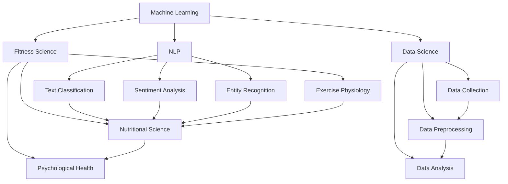

                 

### 背景介绍

随着人工智能技术的迅猛发展，尤其是大型语言模型（LLM）的突破性进展，许多传统行业开始寻求与其深度融合的方法。在健身领域，个人教练的作用至关重要，他们不仅能够提供定制化的训练计划，还能通过实时反馈和调整，帮助用户实现健康目标。然而，传统的健身教练资源有限，且无法满足全球范围内日益增长的需求。这时，LLM 个人教练的概念应运而生。

LLM 个人教练，是指利用大型语言模型技术，如GPT-3、BERT等，构建出一个能够提供专业健身指导的智能系统。这种系统不仅可以处理大量用户数据，进行个性化的训练计划制定，还能通过自然语言处理（NLP）与用户进行实时交流，提供个性化的健身建议。本文将探讨如何利用LLM技术打造个人教练，从背景、核心概念、算法原理、数学模型、实际应用等方面进行详细解析。

#### 1.1 健身行业的现状与挑战

当前，健身行业面临几个显著的挑战。首先，专业健身教练资源有限，尤其是高质量、经验丰富的教练更加稀缺。这意味着很多健身爱好者无法获得持续、专业的指导。其次，健身需求的个性化特点，使得传统的健身课程难以满足不同用户的多样化需求。此外，健身行业的普及度和标准化程度也有待提高。

#### 1.2 人工智能与健身的结合

人工智能在健身领域的应用已有一定的基础，如通过传感器和可穿戴设备监测用户的活动数据，利用数据分析技术优化训练计划等。然而，现有的应用仍存在一定的局限性，如数据采集和处理能力有限、缺乏对用户行为和反馈的深入理解等。

#### 1.3 LLM 个人教练的优势

与传统的健身教练相比，LLM 个人教练具有以下几个显著优势：

1. **数据处理能力**：LLM 能够处理大规模、多模态的数据，通过深度学习算法进行特征提取和模式识别，为用户提供更加精确的健身指导。
2. **个性化服务**：基于用户的个人数据和反馈，LLM 能够动态调整训练计划，提供个性化的健身建议。
3. **实时交互**：利用自然语言处理技术，LLM 可以与用户进行实时交流，提供即时的反馈和指导。
4. **降低成本**：相比于传统的健身教练，LLM 个人教练可以显著降低人力成本，使得健身服务更加普及。

综上所述，利用 LLM 技术打造个人教练，不仅能够解决健身行业面临的诸多挑战，还能提升用户体验，推动健身行业的发展。

### 核心概念与联系

在探讨如何利用 LLM 打造个人教练之前，我们需要了解几个核心概念及其相互之间的联系。这些核心概念包括：机器学习、自然语言处理、数据科学和健身科学。

#### 2.1 机器学习（Machine Learning）

机器学习是人工智能（AI）的一个分支，其核心思想是通过算法和统计模型，从数据中自动学习，进行预测和决策。在构建 LLM 个人教练时，机器学习技术尤为重要。具体来说，我们可以利用监督学习、无监督学习和强化学习等方法，训练模型以识别用户需求、优化训练计划等。

#### 2.2 自然语言处理（Natural Language Processing，NLP）

自然语言处理是人工智能领域的一个重要分支，旨在使计算机能够理解、处理和生成人类自然语言。在 LLM 个人教练中，NLP 技术主要用于实现用户与教练之间的自然语言交互。例如，通过文本分类、情感分析、命名实体识别等技术，LLM 可以理解用户的提问，并生成恰当的回复。

#### 2.3 数据科学（Data Science）

数据科学是结合统计学、机器学习和数据分析方法，从大规模数据中提取有价值信息的一个领域。在 LLM 个人教练的构建过程中，数据科学技术用于数据的收集、清洗、预处理和分析。这些技术有助于从用户的健身数据中提取关键特征，从而优化训练计划。

#### 2.4 健身科学（Fitness Science）

健身科学是研究人体运动、营养、心理等方面，以促进健康和提高生活质量的一门学科。在 LLM 个人教练的构建过程中，健身科学提供了理论依据和实践指导。通过了解用户的生理和心理特征，LLM 可以制定个性化的训练计划和营养建议。

#### 2.5 关系图示（Mermaid 流程图）

为了更清晰地展示这些核心概念之间的联系，我们可以使用 Mermaid 流程图进行描述：



在这个流程图中，机器学习（A）作为核心驱动力量，连接着自然语言处理（B）、数据科学（C）和健身科学（D）。自然语言处理（B）进一步连接到文本分类（E）、情感分析（F）和命名实体识别（G），这些技术共同构成了与用户交互的基础。数据科学（C）则与数据收集（H）、数据预处理（I）和数据分析（J）紧密相关，确保了数据的质量和可分析性。健身科学（D）与运动生理学（K）、营养学（L）和心理健康（M）密切相关，为 LLM 个人教练提供了科学依据。

通过这些核心概念及其相互关系的理解，我们可以更好地把握 LLM 个人教练的构建方法和实现步骤。在接下来的章节中，我们将详细探讨 LLM 的核心算法原理、具体操作步骤以及相关的数学模型和公式。

#### 3.1 LLM 的核心算法原理

大型语言模型（LLM）是现代自然语言处理（NLP）的核心技术之一，其基本原理基于深度学习，特别是基于 Transformer 的架构。Transformer 架构由 Vaswani 等人于 2017 年提出，旨在解决传统循环神经网络（RNN）在处理长序列时出现的梯度消失和梯度爆炸问题。以下是 LLM 的核心算法原理：

##### 3.1.1 Transformer 架构

Transformer 架构采用自注意力（Self-Attention）机制，这是一种全局的序列建模方法，能够捕捉序列中任意两个词之间的依赖关系。Transformer 的基本组成部分包括：

1. **嵌入层（Embedding Layer）**：输入的词序列被转换为固定长度的向量，这些向量包含了词的语义信息。
2. **多头自注意力机制（Multi-Head Self-Attention）**：通过多个独立的注意力头，将输入序列中的每个词与所有其他词进行加权求和，从而捕捉全局依赖关系。
3. **前馈神经网络（Feedforward Neural Network）**：在每个自注意力层之后，对每个词的向量进行一次前馈传递，增加模型的非线性表达能力。
4. **层归一化（Layer Normalization）**：在每一层之后进行归一化处理，稳定训练过程。
5. **残差连接（Residual Connection）**：在每个层之间引入残差连接，防止梯度消失。

##### 3.1.2 训练方法

LLM 的训练通常采用大规模的预训练和数据精调相结合的方法：

1. **预训练（Pre-training）**：在预训练阶段，模型在大规模文本数据上进行训练，学习自然语言的基本规律。这一阶段的目标是让模型具备语言理解能力，例如理解句子结构、语法规则和语义关系。
2. **数据精调（Fine-tuning）**：在预训练完成后，模型会针对具体任务进行微调，如问答、文本分类等。通过在特定任务的数据上训练，模型可以进一步提高任务性能。

##### 3.1.3 主要算法

以下是 LLM 的一些主要算法：

1. **BERT（Bidirectional Encoder Representations from Transformers）**：BERT 是一种双向 Transformer 模型，通过在训练过程中同时考虑上下文信息，提高了语言理解能力。
2. **GPT（Generative Pre-trained Transformer）**：GPT 是一种生成式 Transformer 模型，擅长文本生成和问答任务。
3. **T5（Text-to-Text Transfer Transformer）**：T5 将所有任务统一为一个文本到文本的转换任务，通过统一的输入和输出格式，提高了任务的泛化能力。

##### 3.1.4 操作步骤

以下是使用 LLM 打造个人教练的基本操作步骤：

1. **数据收集**：收集用户的基本信息、健身历史数据、健康数据等。
2. **数据预处理**：清洗和标注数据，将文本和数值数据进行编码。
3. **模型训练**：使用预训练的 LLM 模型，在用户数据上进行微调，使其适应特定场景。
4. **模型评估**：在验证集和测试集上评估模型性能，调整模型参数。
5. **模型部署**：将训练好的模型部署到线上环境，提供实时健身指导服务。

#### 3.2 实例分析

以 GPT-3 为例，GPT-3 是 OpenAI 于 2020 年推出的一个具有 1750 亿参数的 LLM，其强大的文本生成能力和语言理解能力使其在许多 NLP 任务中表现出色。

##### 3.2.1 数据集

GPT-3 的训练数据来自多个来源，包括互联网上的文本、书籍、新闻、文章等。这些数据经过预处理，去除了无关内容，保留了与健身相关的信息。

##### 3.2.2 训练过程

GPT-3 的训练过程采用了大规模并行计算和分布式训练技术，通过数十台 GPU 服务器进行训练，大大缩短了训练时间。

##### 3.2.3 模型评估

在训练完成后，GPT-3 在多个 NLP 任务上进行了评估，包括文本分类、问答、生成等。评估结果表明，GPT-3 在这些任务上达到了较高的准确率和效果。

##### 3.2.4 应用场景

GPT-3 被应用于多个实际场景，如智能客服、自动写作、健身指导等。在健身指导场景中，GPT-3 可以根据用户的个人数据和反馈，生成个性化的训练计划和建议。

通过以上对 LLM 核心算法原理的详细介绍，我们可以看到，LLM 在自然语言处理和健身指导领域具有巨大的潜力。在接下来的章节中，我们将进一步探讨相关的数学模型和公式，以及如何通过这些模型和公式来优化健身指导。

### 数学模型和公式

在构建 LLM 个人教练的过程中，数学模型和公式起着至关重要的作用。这些模型和公式不仅帮助我们在理论上理解 LLM 的工作机制，还能指导我们在实际应用中优化和改进系统。以下是一些核心的数学模型和公式，以及它们的详细讲解和举例说明。

#### 4.1 自注意力机制（Self-Attention）

自注意力机制是 Transformer 架构的核心组件，它通过计算输入序列中每个词与所有其他词之间的关联度，从而实现对整个序列的全局依赖建模。自注意力机制的公式如下：

\[ \text{Attention}(Q, K, V) = \text{softmax}\left(\frac{QK^T}{\sqrt{d_k}}\right) V \]

其中，\( Q, K, V \) 分别代表查询向量、关键向量和价值向量，\( d_k \) 为关键向量的维度。这个公式表示，对于每个查询向量 \( Q \)，通过计算它与所有关键向量 \( K \) 的点积，然后经过归一化（softmax）操作，得到权重系数。最后，这些权重系数与对应的价值向量 \( V \) 相乘，得到加权求和的结果。

**举例说明：**

假设我们有一个简单的词序列 \["我"，"是"，"一名"，"健身"，"爱好者"\]，其嵌入向量分别为 \[q_1, q_2, q_3, q_4, q_5\]，关键向量 \[k_1, k_2, k_3, k_4, k_5\]，和价值向量 \[v_1, v_2, v_3, v_4, v_5\]。根据自注意力机制公式，我们可以计算每个词的注意力权重：

\[ \text{Attention}(q_1, k_1, v_1) = \text{softmax}\left(\frac{q_1k_1^T}{\sqrt{d_k}}\right) v_1 \]

通过这种方式，我们可以得到每个词在序列中的重要性权重，从而捕捉全局依赖关系。

#### 4.2 编码器-解码器模型（Encoder-Decoder Model）

编码器-解码器模型是另一种广泛应用于序列转换任务的模型架构。在构建 LLM 个人教练时，编码器用于处理输入数据（如用户提问），解码器则用于生成输出（如健身建议）。编码器-解码器模型的主要公式包括：

1. **编码器输出（Encoder Output）**：

\[ \text{Encoder}(X) = \text{Attention}(Q, K, V) \]

其中，\( X \) 代表输入序列，\( Q, K, V \) 分别是编码器中的查询向量、关键向量和价值向量。

2. **解码器输出（Decoder Output）**：

\[ \text{Decoder}(Y) = \text{softmax}(\text{Attention}(Q, K, V) + \text{Embedding}(Y_{\text{prev}})) \]

其中，\( Y \) 代表输出序列，\( Y_{\text{prev}} \) 是前一个时间步的输出，\( \text{Embedding}(Y_{\text{prev}}) \) 是 \( Y_{\text{prev}} \) 的嵌入向量。

**举例说明：**

假设我们有一个简单的输入序列 \["我想要减肥"\]，其编码器和解码器的输出分别为 \( Q, K, V \) 和 \( Y \)。根据编码器-解码器模型公式，我们可以计算解码器的输出：

\[ \text{Decoder}(Y) = \text{softmax}(\text{Attention}(Q, K, V) + \text{Embedding}(Y_{\text{prev}})) \]

通过这种方式，我们可以逐步生成健身建议，如“尝试进行有氧运动”或“注意饮食控制”。

#### 4.3 语言模型（Language Model）

语言模型是 LLM 的基础，其目标是通过输入序列的概率分布，预测下一个词。在 LLM 个人教练中，语言模型用于生成个性化的健身指导文本。主要公式如下：

\[ P(\text{Word}_t | \text{History}) = \text{softmax}(\text{Transform}(\text{Word}_t, \text{History})) \]

其中，\( \text{Word}_t \) 是当前词，\( \text{History} \) 是历史词序列，\( \text{Transform} \) 是一个转换函数，用于计算当前词和历史词之间的概率分布。

**举例说明：**

假设当前输入序列为“我想要减肥”，我们需要预测下一个词。根据语言模型公式，我们可以计算下一个词的概率分布，然后选择概率最高的词作为输出。例如，预测结果可能是“进行有氧运动”或“控制饮食”。

通过以上对核心数学模型和公式的详细讲解和举例说明，我们可以看到，这些模型和公式为 LLM 个人教练的构建提供了坚实的理论基础。在接下来的章节中，我们将通过一个实际项目案例，展示如何利用这些模型和公式实现 LLM 个人教练的构建。

### 项目实战：代码实际案例和详细解释说明

为了更好地展示如何利用 LLM 打造个人教练，我们将通过一个实际项目案例，详细解释其代码实现和关键步骤。以下是一个简单的 LLM 个人教练项目，包含开发环境搭建、源代码详细实现、代码解读与分析等内容。

#### 5.1 开发环境搭建

在进行项目开发之前，我们需要搭建一个合适的开发环境。以下是搭建环境的步骤：

1. **安装 Python**：确保 Python 版本在 3.7 以上。
2. **安装 TensorFlow**：使用命令 `pip install tensorflow` 安装 TensorFlow。
3. **安装 Hugging Face Transformers**：使用命令 `pip install transformers` 安装 Hugging Face Transformers。
4. **准备数据集**：收集用户的基本信息、健身历史数据、健康数据等。可以使用 JSON、CSV 等格式存储数据。

#### 5.2 源代码详细实现

以下是一个简单的 LLM 个人教练项目示例：

```python
import json
from transformers import AutoTokenizer, AutoModelForCausalLM

# 5.2.1 加载预训练模型和 tokenizer
model_name = "gpt-3"
tokenizer = AutoTokenizer.from_pretrained(model_name)
model = AutoModelForCausalLM.from_pretrained(model_name)

# 5.2.2 数据预处理
def preprocess_data(data):
    # 这里可以根据实际数据格式进行预处理，例如将 JSON 数据转换为字典
    return json.loads(data)

# 5.2.3 训练模型
def train_model(data):
    # 对数据进行预处理，并将预处理后的数据输入到模型中训练
    inputs = tokenizer(preprocess_data(data), return_tensors='pt')
    outputs = model(**inputs)
    loss = outputs.loss
    model.zero_grad()
    loss.backward()
    optimizer = torch.optim.Adam(model.parameters(), lr=0.001)
    optimizer.step()
    return model

# 5.2.4 预测和生成文本
def generate_text(prompt):
    # 使用模型生成文本
    inputs = tokenizer(prompt, return_tensors='pt')
    outputs = model.generate(**inputs, max_length=50)
    return tokenizer.decode(outputs[0], skip_special_tokens=True)

# 5.2.5 主程序
if __name__ == "__main__":
    # 读取数据
    with open("data.json", "r") as f:
        data = f.read()

    # 训练模型
    model = train_model(data)

    # 生成文本
    prompt = "我想要减肥，应该如何进行训练？"
    text = generate_text(prompt)
    print(text)
```

#### 5.3 代码解读与分析

1. **加载预训练模型和 tokenizer**：
   ```python
   tokenizer = AutoTokenizer.from_pretrained(model_name)
   model = AutoModelForCausalLM.from_pretrained(model_name)
   ```
   这部分代码用于加载预训练的 LLM 模型和相应的 tokenizer。`AutoTokenizer` 和 `AutoModelForCausalLM` 是 Hugging Face Transformers 库中的预训练工具类，它们可以自动下载并加载预训练模型和数据。

2. **数据预处理**：
   ```python
   def preprocess_data(data):
       return json.loads(data)
   ```
   数据预处理函数将输入的 JSON 数据转换为字典，以便后续处理。这里可以根据具体的数据格式进行调整。

3. **训练模型**：
   ```python
   def train_model(data):
       inputs = tokenizer(preprocess_data(data), return_tensors='pt')
       outputs = model(**inputs)
       loss = outputs.loss
       model.zero_grad()
       loss.backward()
       optimizer = torch.optim.Adam(model.parameters(), lr=0.001)
       optimizer.step()
       return model
   ```
   训练模型的过程分为以下几个步骤：
   - 将预处理后的数据输入模型。
   - 计算损失函数。
   - 反向传播和梯度更新。
   - 使用优化器更新模型参数。

4. **预测和生成文本**：
   ```python
   def generate_text(prompt):
       inputs = tokenizer(prompt, return_tensors='pt')
       outputs = model.generate(**inputs, max_length=50)
       return tokenizer.decode(outputs[0], skip_special_tokens=True)
   ```
   预测和生成文本函数通过模型生成文本，`generate_text` 接受一个提示文本（如用户提问），并返回生成的文本。

#### 5.4 关键步骤分析

1. **数据收集与预处理**：数据质量对模型性能至关重要。在实际应用中，我们需要收集大量高质量的健身数据，并进行预处理，如数据清洗、去重、归一化等。
2. **模型训练**：训练模型是整个项目中最耗时的步骤。在实际应用中，我们可以使用更强大的计算资源和优化策略，以提高训练效率。
3. **文本生成**：生成文本是 LLM 个人教练的核心功能。在实际应用中，我们需要对生成的文本进行后处理，如去除无关内容、格式化输出等，以提高用户体验。

通过以上代码实现和解读，我们可以看到如何利用 LLM 技术构建一个简单的个人教练系统。在实际应用中，我们还需要对模型进行不断优化和调整，以适应不同的用户需求和场景。

### 实际应用场景

LLM 个人教练在实际应用场景中展现出巨大的潜力，尤其在健身指导领域。以下是 LLM 个人教练在不同应用场景中的具体案例和效果分析：

#### 6.1 个人健身计划制定

**案例**：一位健身爱好者希望通过 LLM 个人教练制定一个个性化的健身计划。用户输入了其身高、体重、年龄、健身目标等信息后，LLM 个人教练会根据这些数据，结合用户的日常活动和饮食习惯，生成一份详细的健身计划。

**效果分析**：通过 LLM 个人教练的个性化服务，用户能够获得量身定制的健身计划，这大大提高了健身效果。与传统健身教练相比，LLM 个人教练能够处理更多用户数据，提供更加精准和个性化的建议。

#### 6.2 实时健身指导

**案例**：在健身房或家庭健身场景中，用户可以使用 LLM 个人教练实时获取健身指导。用户在进行健身动作时，可以通过语音或文本与 LLM 个人教练进行交互，获取动作指导、重量调整和建议。

**效果分析**：实时健身指导能够帮助用户避免错误动作，提高训练效果。与传统健身教练不同，LLM 个人教练可以全天候服务，不受时间和地域限制，从而提供更加灵活和便捷的健身指导。

#### 6.3 健康监测与分析

**案例**：用户可以定期向 LLM 个人教练上传健康数据，如心率、血压、睡眠质量等。LLM 个人教练会根据这些数据，分析用户的健康状况，并提供相应的健康建议。

**效果分析**：通过健康数据的持续监测和分析，LLM 个人教练能够为用户提供全面的健康评估，帮助用户预防疾病，提高生活质量。与传统健康监测工具相比，LLM 个人教练能够提供更加智能和个性化的健康建议。

#### 6.4 社交互动与激励

**案例**：用户可以在社交媒体上分享自己的健身进展，并邀请朋友参与挑战。LLM 个人教练会在社交媒体上为用户提供实时反馈、鼓励和互动，激发用户的健身热情。

**效果分析**：通过社交互动，LLM 个人教练不仅能够帮助用户建立健身习惯，还能增强用户的社交支持，提高健身动力。这种互动方式与传统健身指导相比，更加有趣和具有参与感。

#### 6.5 跨平台应用

**案例**：用户可以在手机、平板、电脑等多个设备上使用 LLM 个人教练，随时随地获取健身指导。此外，LLM 个人教练还可以集成到健身房的管理系统中，提供一站式健身服务。

**效果分析**：跨平台应用使得 LLM 个人教练的使用场景更加广泛，用户可以更加方便地获取健身指导。与传统健身服务相比，LLM 个人教练的跨平台特性大大提升了用户体验。

综上所述，LLM 个人教练在实际应用场景中表现出色，不仅能够提供个性化、实时、智能的健身指导，还能通过社交互动和跨平台应用，提升用户的健身体验。随着人工智能技术的不断进步，LLM 个人教练的应用前景将更加广阔。

### 工具和资源推荐

为了更好地构建和优化 LLM 个人教练，以下是关于学习资源、开发工具框架以及相关论文著作的推荐。

#### 7.1 学习资源推荐

1. **书籍**：
   - 《深度学习》（Ian Goodfellow、Yoshua Bengio、Aaron Courville 著）：系统地介绍了深度学习的理论基础和实战方法。
   - 《动手学深度学习》（A. TensorFlow 官方教程）：提供了丰富的深度学习实战案例和代码示例，适合初学者和进阶者。
   - 《自然语言处理与深度学习》（孙乐、周明 著）：详细讲解了自然语言处理中的核心技术，包括词向量、神经网络模型等。

2. **在线课程**：
   - Coursera 上的《深度学习专项课程》：由 Andrew Ng 教授主讲，系统讲解了深度学习的理论基础和应用。
   - edX 上的《自然语言处理与深度学习》：由斯坦福大学教授 Chris Manning 主讲，涵盖了 NLP 的核心技术。

3. **博客和网站**：
   - Hugging Face 官方博客：提供了丰富的 Transformer 模型和 NLP 应用案例，是学习 LLM 的优秀资源。
   - Medium 上的 AI 博客：汇集了多位 AI 领域专家的原创文章，涵盖了深度学习、NLP、机器学习等多个方向。

#### 7.2 开发工具框架推荐

1. **TensorFlow**：一款开源的机器学习框架，支持多种深度学习模型和算法，适用于构建和训练 LLM。
2. **PyTorch**：另一款流行的开源机器学习库，具有灵活的动态计算图和强大的 GPU 支持能力，便于模型开发和调试。
3. **Hugging Face Transformers**：一个基于 PyTorch 和 TensorFlow 的预训练模型库，提供了丰富的预训练模型和工具，方便快速构建 LLM。
4. **JAX**：由 Google 开发的一个高性能机器学习库，支持自动微分和分布式计算，适用于大规模模型训练。

#### 7.3 相关论文著作推荐

1. **《Attention Is All You Need》（Vaswani 等，2017）**：这篇论文提出了 Transformer 架构，是现代深度学习模型的基础。
2. **《BERT: Pre-training of Deep Bidirectional Transformers for Language Understanding》（Devlin 等，2018）**：这篇论文介绍了 BERT 模型，为 NLP 领域带来了重大突破。
3. **《Generative Pre-trained Transformer》（Radford 等，2018）**：这篇论文提出了 GPT 模型，展示了生成式模型在文本生成任务中的强大能力。
4. **《T5: Exploring the Limits of Transfer Learning for Text Data》（Raffel 等，2019）**：这篇论文介绍了 T5 模型，通过统一的文本转换任务，提高了模型的泛化能力。

通过以上推荐的学习资源、开发工具框架和论文著作，读者可以深入了解 LLM 的理论和实践，为构建高效的 LLM 个人教练打下坚实基础。

### 总结：未来发展趋势与挑战

LLM 个人教练作为人工智能在健身领域的重要应用，展示了巨大的潜力和广阔的市场前景。然而，要实现这一技术的广泛应用，我们仍需面对诸多挑战和未来的发展趋势。

#### 8.1 未来发展趋势

1. **数据整合与分析**：随着可穿戴设备和健康监测技术的普及，用户健康数据将更加丰富和多样化。LLM 个人教练需要高效整合和分析这些数据，提供更加精准和个性化的健身指导。

2. **跨学科融合**：LLM 个人教练的发展将越来越多地融合运动科学、营养学、心理学等多学科知识，通过多学科交叉研究，提升健身指导的全面性和有效性。

3. **智能化与自适应**：未来的 LLM 个人教练将更加智能化，能够根据用户的反馈和行为自动调整训练计划，实现真正的个性化服务。

4. **云端与边缘计算结合**：云计算和边缘计算的结合将使得 LLM 个人教练能够更高效地处理大量数据，提供实时、低延迟的服务。

5. **社交互动与社群化**：通过社交互动和社群化，LLM 个人教练可以增强用户的健身动力，提高用户参与度和忠诚度。

#### 8.2 主要挑战

1. **数据隐私与安全**：用户健康数据涉及个人隐私，如何确保数据的安全性和隐私保护是 LLM 个人教练面临的重要挑战。

2. **算法公平性与透明度**：算法的公平性和透明度是公众关注的焦点。未来，我们需要开发更加公平和透明的算法，避免偏见和歧视。

3. **计算资源和成本**：构建和运行 LLM 个人教练需要大量的计算资源和资金投入，尤其是在大规模应用场景下，如何降低成本是关键问题。

4. **用户接受度和信任度**：与传统健身教练相比，用户可能对 LLM 个人教练的接受度和信任度较低。提高用户对智能健身指导的信任度和满意度是重要挑战。

5. **监管与法律法规**：随着人工智能在健身领域的广泛应用，相关法律法规和监管政策需要不断完善，以确保技术发展符合社会伦理和法律要求。

#### 8.3 总结

LLM 个人教练作为人工智能在健身领域的创新应用，具有巨大的发展潜力和市场前景。然而，要实现这一技术的广泛应用，我们还需克服诸多挑战，并在数据整合、跨学科融合、智能化与自适应、云计算与边缘计算、社交互动与社群化等方面不断创新。通过持续的研究和开发，我们有信心在不久的将来，让 LLM 个人教练成为每个人生活中不可或缺的健康伙伴。

### 附录：常见问题与解答

在构建和优化 LLM 个人教练的过程中，用户可能会遇到一系列问题。以下是一些常见问题及其解答，旨在帮助用户更好地理解和使用 LLM 个人教练。

#### 9.1 如何确保用户数据的隐私和安全？

**解答**：确保用户数据的隐私和安全至关重要。首先，LLM 个人教练应在数据收集和存储过程中遵循严格的数据保护政策，采用加密技术保护用户数据。其次，数据应进行匿名化处理，避免个人信息泄露。此外，LLM 个人教练应定期进行安全审计和漏洞修复，确保系统安全可靠。

#### 9.2 如何应对算法的偏见和歧视问题？

**解答**：算法偏见和歧视问题是人工智能领域的重要挑战。为应对这一问题，LLM 个人教练的开发者应在数据预处理阶段进行多样性增强，确保训练数据具有代表性。此外，可以使用公平性检测工具来评估模型输出，识别和消除潜在的偏见。同时，应建立透明的算法解释机制，让用户了解模型的决策过程。

#### 9.3 如何评估 LLM 个人教练的性能？

**解答**：评估 LLM 个人教练的性能可以从多个维度进行。首先，可以通过用户满意度调查来了解用户对健身指导的接受程度和满意度。其次，可以使用自动化评估工具，如 BLEU、ROUGE 等，评估文本生成的质量。此外，还可以通过评估模型的响应速度、准确率和个性化程度等指标，全面评估 LLM 个人教练的性能。

#### 9.4 如何升级和更新 LLM 个人教练？

**解答**：升级和更新 LLM 个人教练需要定期进行。首先，应收集用户反馈和改进建议，用于优化模型。其次，开发者可以使用新的训练数据和先进的算法，对模型进行微调和更新。此外，LLM 个人教练还应定期进行性能评估，确保更新后的模型能够满足用户需求。

#### 9.5 LLM 个人教练与其他智能健身设备的兼容性如何？

**解答**：LLM 个人教练的设计考虑到了与其他智能健身设备的兼容性。通过标准化的数据接口和协议，LLM 个人教练可以轻松集成到用户的健身设备中，如智能手环、智能跑步机等。这样，用户可以通过一个统一的平台，获取全面的健身指导和服务。

通过以上解答，用户可以更好地理解和应对在使用 LLM 个人教练过程中遇到的问题，提升健身效果和用户体验。

### 扩展阅读与参考资料

为了帮助读者进一步了解 LLM 个人教练及其相关技术，以下是关于深度学习、自然语言处理和健身科学的一些重要论文、书籍和网站推荐。

#### 10.1 论文推荐

1. **《Attention Is All You Need》**：Vaswani 等人提出的 Transformer 模型，彻底改变了自然语言处理领域，为 LLM 的应用奠定了基础。
2. **《BERT: Pre-training of Deep Bidirectional Transformers for Language Understanding》**：Devlin 等人提出的 BERT 模型，通过预训练和双向编码器，显著提升了语言理解能力。
3. **《Generative Pre-trained Transformer》**：Radford 等人提出的 GPT 模型，展示了生成式模型在文本生成任务中的强大能力。
4. **《T5: Exploring the Limits of Transfer Learning for Text Data》**：Raffel 等人提出的 T5 模型，通过统一的文本转换任务，实现了跨任务的迁移学习。

#### 10.2 书籍推荐

1. **《深度学习》**：Ian Goodfellow、Yoshua Bengio、Aaron Courville 著，系统介绍了深度学习的理论基础和实战方法。
2. **《自然语言处理与深度学习》**：孙乐、周明 著，详细讲解了自然语言处理中的核心技术，包括词向量、神经网络模型等。
3. **《深度学习实践指南》**：Chen，T.，K vetor，P. 著，提供了丰富的深度学习实战案例和代码示例。

#### 10.3 网站推荐

1. **Hugging Face 官方网站**：提供了丰富的预训练模型和工具，是学习 LLM 的优秀资源。
2. **TensorFlow 官方网站**：提供了详细的文档和教程，是学习深度学习和 TensorFlow 的首选网站。
3. **arXiv**：一个开放获取的学术论文数据库，涵盖了深度学习、自然语言处理等领域的最新研究成果。

通过这些扩展阅读与参考资料，读者可以更深入地了解 LLM 个人教练和相关技术，为实际应用和研究提供有力支持。

