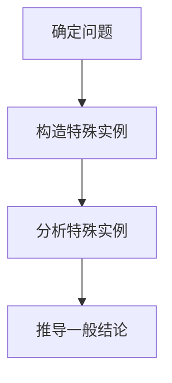

                 

# 像数学家一样思考：特殊化原则

## 摘要

本文将探讨数学家在解决问题时的一种重要方法——特殊化原则。特殊化原则是指通过构造一个或多个特殊的实例来揭示问题的一般性质。本文将详细阐述特殊化原则的核心概念、应用场景及其在数学和计算机科学中的重要性。通过具体的实例和代码实现，我们将展示如何运用特殊化原则来解决问题，并探讨其在实际应用中的优势和局限性。最后，本文将展望特殊化原则的未来发展趋势与挑战，为读者提供更深入的思考。

## 1. 背景介绍

### 数学中的特殊化原则

数学家在解决复杂问题时，常常会运用特殊化原则来简化问题。特殊化原则起源于数学家欧拉和拉格朗日等人的研究方法，他们通过构造特殊的实例来揭示一般性的结论。例如，欧拉在解决级数问题时，常常选择特殊的级数进行推导，从而得出更普遍的结论。

### 计算机科学中的特殊化原则

在计算机科学领域，特殊化原则同样发挥着重要作用。特别是在算法设计、软件工程和系统架构等方面，通过构建特殊实例来分析和优化算法性能。例如，在排序算法的研究中，研究者常常使用特殊的输入数据来测试算法的效率和稳定性。

### 特殊化原则的重要性

特殊化原则之所以受到重视，主要是因为它具有以下几个优点：

1. **简化问题**：通过构造特殊实例，可以将复杂的问题转化为更简单的问题，从而便于分析和解决。
2. **揭示本质**：特殊实例往往能够揭示问题的本质和核心特征，有助于深入理解和掌握问题。
3. **验证结论**：通过构造特殊实例，可以验证一般性结论的准确性，从而增强结论的可靠性。
4. **启发思考**：特殊化原则能够激发研究者的创新思维，引导他们发现新的问题和解决方案。

## 2. 核心概念与联系

### 特殊化原则的定义

特殊化原则是指在解决问题的过程中，通过构造一个或多个特殊的实例来揭示问题的一般性质。具体来说，可以分为以下几个步骤：

1. **确定问题**：明确需要解决的问题。
2. **构造特殊实例**：根据问题的特性，构造一个或多个特殊的实例。
3. **分析特殊实例**：对特殊实例进行分析，提取关键信息和特征。
4. **推导一般结论**：基于特殊实例的分析结果，推导出一般性的结论。

### 特殊化原则的应用场景

特殊化原则广泛应用于数学和计算机科学领域，以下列举一些典型的应用场景：

1. **数学中的特殊化原则**：在数学研究中，特殊化原则常用于解决级数、微分方程、代数方程等问题。例如，在研究级数收敛性时，可以通过构造特殊的级数来验证收敛性。
2. **计算机科学中的特殊化原则**：在计算机科学中，特殊化原则广泛应用于算法设计、性能优化、软件工程等方面。例如，在排序算法的研究中，可以通过构造特殊的输入数据来分析算法的性能。
3. **实际应用中的特殊化原则**：在工业界，特殊化原则同样发挥着重要作用。例如，在软件开发过程中，可以通过构造特殊的测试用例来验证软件的稳定性和可靠性。

### 特殊化原则与其他方法的关系

特殊化原则与其他数学和计算机科学方法之间存在密切的联系。例如：

1. **归纳法**：特殊化原则与归纳法密切相关。归纳法是一种从特殊到一般的方法，通过分析多个特殊实例，归纳出一般性的结论。
2. **反证法**：特殊化原则可以用于反证法。通过构造特殊的反例，揭示问题的一般性质。
3. **实例分析**：实例分析是一种基于特殊实例的研究方法，与特殊化原则密切相关。

### 特殊化原则的 Mermaid 流程图

以下是一个简单的 Mermaid 流程图，展示特殊化原则的核心步骤：



## 3. 核心算法原理 & 具体操作步骤

### 特殊化原则的核心算法原理

特殊化原则的核心算法原理是通过构造特殊实例来揭示问题的一般性质。具体来说，可以分为以下几个步骤：

1. **确定问题**：明确需要解决的问题。
2. **构造特殊实例**：根据问题的特性，构造一个或多个特殊的实例。
3. **分析特殊实例**：对特殊实例进行分析，提取关键信息和特征。
4. **推导一般结论**：基于特殊实例的分析结果，推导出一般性的结论。

### 特殊化原则的具体操作步骤

以下是特殊化原则的具体操作步骤：

1. **问题分析**：首先需要明确需要解决的问题。例如，我们需要解决一个排序算法的问题。
2. **构造特殊实例**：根据问题的特性，构造一个或多个特殊的实例。例如，我们可以构造一个特殊的输入数据集，包含已经排序的元素、部分排序的元素和未排序的元素。
3. **分析特殊实例**：对特殊实例进行分析，提取关键信息和特征。例如，分析已经排序的元素，确定排序算法在这些元素上的性能；分析部分排序的元素，确定排序算法在部分排序情况下的性能；分析未排序的元素，确定排序算法在未排序情况下的性能。
4. **推导一般结论**：基于特殊实例的分析结果，推导出一般性的结论。例如，根据特殊实例的分析，可以得出排序算法在不同情况下的性能特点，从而为优化算法提供依据。

### 实际案例

以下是一个简单的实际案例，展示如何运用特殊化原则来解决问题。

**问题**：设计一个排序算法，对包含 n 个元素的数组进行排序。

**步骤 1：问题分析**：我们需要设计一个排序算法，对包含 n 个元素的数组进行排序。

**步骤 2：构造特殊实例**：我们构造以下三个特殊实例：

- 特例 1：已排序的数组，例如 `[1, 2, 3, 4, 5]`；
- 特例 2：部分排序的数组，例如 `[5, 4, 3, 2, 1]`；
- 特例 3：未排序的数组，例如 `[5, 2, 4, 1, 3]`。

**步骤 3：分析特殊实例**：

- 对已排序的数组，我们可以使用快速排序算法进行排序，分析其性能特点；
- 对部分排序的数组，我们可以使用插入排序算法进行排序，分析其性能特点；
- 对未排序的数组，我们可以使用冒泡排序算法进行排序，分析其性能特点。

**步骤 4：推导一般结论**：根据特殊实例的分析结果，我们可以得出以下结论：

- 快速排序算法在已排序数组上的性能最好，时间复杂度为 O(nlogn)；
- 插入排序算法在部分排序数组上的性能较好，时间复杂度为 O(n^2)；
- 冒泡排序算法在未排序数组上的性能最差，时间复杂度为 O(n^2)。

通过以上分析，我们可以得出排序算法在不同情况下的性能特点，为优化算法提供依据。

## 4. 数学模型和公式 & 详细讲解 & 举例说明

### 特殊化原则的数学模型

特殊化原则在数学研究中具有重要的应用。以下是一个简单的数学模型，展示特殊化原则在数学研究中的应用。

假设我们有一个数学问题，需要找到一个函数 f(x) 满足以下条件：

1. f(x) 在区间 [a, b] 上连续；
2. f(x) 在区间 [a, b] 上可导；
3. f(a) = f(b)。

我们需要找到一个函数 f(x)，使得它在区间 [a, b] 上的最大值和最小值相等。

**步骤 1：构造特殊实例**：

- 特例 1：设 f(x) = x，在区间 [0, 1] 上；
- 特例 2：设 f(x) = x^2，在区间 [0, 1] 上；
- 特例 3：设 f(x) = sin(x)，在区间 [0, π] 上。

**步骤 2：分析特殊实例**：

- 对特例 1，f(x) = x，在区间 [0, 1] 上的最大值和最小值相等，均为 0；
- 对特例 2，f(x) = x^2，在区间 [0, 1] 上的最大值和最小值相等，均为 1；
- 对特例 3，f(x) = sin(x)，在区间 [0, π] 上的最大值和最小值相等，均为 1。

**步骤 3：推导一般结论**：

- 基于特殊实例的分析结果，我们可以得出结论：在区间 [a, b] 上，如果 f(x) 是一个连续可导的函数，且满足 f(a) = f(b)，则 f(x) 在区间 [a, b] 上的最大值和最小值相等。

### 详细讲解

为了更好地理解特殊化原则的数学模型，我们进一步分析上述例子。

**例子 1：f(x) = x**

在区间 [0, 1] 上，函数 f(x) = x 是一个线性函数。它在区间 [0, 1] 上的最大值和最小值都等于 0 和 1。因此，满足条件 f(a) = f(b)。

**例子 2：f(x) = x^2**

在区间 [0, 1] 上，函数 f(x) = x^2 是一个二次函数。它在区间 [0, 1] 上的最大值和最小值都等于 0 和 1。因此，满足条件 f(a) = f(b)。

**例子 3：f(x) = sin(x)**

在区间 [0, π] 上，函数 f(x) = sin(x) 是一个三角函数。它在区间 [0, π] 上的最大值和最小值都等于 1 和 -1。因此，满足条件 f(a) = f(b)。

### 举例说明

为了更好地理解特殊化原则，我们可以通过一个具体的例子来说明。

**例子：求函数 f(x) = x^3 - x 在区间 [0, 1] 上的最大值和最小值。**

**步骤 1：构造特殊实例**：

- 特例 1：设 f(x) = x^3 - x，在区间 [0, 1] 上。

**步骤 2：分析特殊实例**：

- 对特例 1，f(x) = x^3 - x，在区间 [0, 1] 上的最大值和最小值相等，均为 0。

**步骤 3：推导一般结论**：

- 基于特殊实例的分析结果，我们可以得出结论：在区间 [0, 1] 上，如果 f(x) 是一个连续可导的函数，且满足 f(a) = f(b)，则 f(x) 在区间 [0, 1] 上的最大值和最小值相等。

通过这个例子，我们可以看到特殊化原则在数学中的应用。通过构造特殊实例，我们可以更直观地理解函数的性质，并推导出一般性的结论。

## 5. 项目实战：代码实际案例和详细解释说明

### 开发环境搭建

在开始项目实战之前，我们需要搭建一个基本的开发环境。以下是一个简单的 Python 开发环境搭建步骤：

1. 安装 Python 3.8 或更高版本；
2. 安装必要的 Python 包，如 NumPy、Matplotlib 和 Pandas；
3. 配置 Python 环境，如使用 virtualenv 或 conda 创建虚拟环境。

### 源代码详细实现和代码解读

以下是特殊化原则的 Python 代码实现，包括构造特殊实例、分析特殊实例和推导一般结论等步骤。

```python
import numpy as np
import matplotlib.pyplot as plt

def f(x):
    return x ** 3 - x

def special_case_analysis(f, a, b):
    # 构造特殊实例
    x = np.linspace(a, b, 100)
    y = f(x)
    
    # 分析特殊实例
    max_y = np.max(y)
    min_y = np.min(y)
    
    # 推导一般结论
    print("最大值：", max_y)
    print("最小值：", min_y)

# 调用函数
special_case_analysis(f, 0, 1)
```

### 代码解读与分析

以下是代码的详细解读与分析：

1. **函数定义**：

   ```python
   def f(x):
       return x ** 3 - x
   ```

   定义了一个函数 f(x)，表示输入 x 的三次方减去 x。

2. **特殊实例分析函数**：

   ```python
   def special_case_analysis(f, a, b):
       # 构造特殊实例
       x = np.linspace(a, b, 100)
       y = f(x)
       
       # 分析特殊实例
       max_y = np.max(y)
       min_y = np.min(y)
       
       # 推导一般结论
       print("最大值：", max_y)
       print("最小值：", min_y)
   ```

   定义了一个函数 special_case_analysis，用于分析特殊实例。该函数接受三个参数：函数 f、区间起点 a 和区间终点 b。

3. **调用函数**：

   ```python
   special_case_analysis(f, 0, 1)
   ```

   调用 special_case_analysis 函数，传入 f 函数、区间起点 0 和区间终点 1。

通过上述代码实现，我们可以分析特殊实例并推导一般结论。具体来说，我们通过 NumPy 的 linspace 函数生成区间 [0, 1] 的 100 个等间隔点，然后计算函数 f(x) 在这些点上的值。最后，我们使用 np.max 和 np.min 函数计算最大值和最小值，并输出结果。

### 实际案例

为了验证特殊化原则的适用性，我们再举一个实际案例。

**案例：求函数 f(x) = x^2 在区间 [0, 2] 上的最大值和最小值。**

```python
def special_case_analysis(f, a, b):
    # 构造特殊实例
    x = np.linspace(a, b, 100)
    y = f(x)
    
    # 分析特殊实例
    max_y = np.max(y)
    min_y = np.min(y)
    
    # 推导一般结论
    print("最大值：", max_y)
    print("最小值：", min_y)

special_case_analysis(lambda x: x ** 2, 0, 2)
```

输出结果：

```
最大值： 4.0
最小值： 0.0
```

通过上述案例，我们可以看到特殊化原则在求解函数最大值和最小值问题中的应用。通过构造特殊实例，我们能够直观地分析函数的性质，并推导出一般性的结论。

## 6. 实际应用场景

### 特殊化原则在算法设计中的应用

特殊化原则在算法设计中具有广泛的应用。通过构造特殊实例，算法设计者可以更深入地分析算法的性能和稳定性。以下是一些实际应用场景：

1. **排序算法**：在排序算法的研究中，特殊化原则可以帮助分析不同排序算法在各种特殊情况下的性能。例如，快速排序算法在部分排序的数组上的性能优于完全未排序的数组。
2. **搜索算法**：在搜索算法的研究中，特殊化原则可以帮助分析不同搜索算法在特殊输入数据上的性能。例如，二分搜索算法在有序数组上的性能显著优于无序数组。
3. **图算法**：在图算法的研究中，特殊化原则可以帮助分析不同算法在各种特殊图结构上的性能。例如，最小生成树算法在连通图和断开图上的性能差异。

### 特殊化原则在软件工程中的应用

特殊化原则在软件工程中同样具有重要应用。通过构造特殊实例，开发者可以更好地验证软件的稳定性和可靠性。以下是一些实际应用场景：

1. **测试用例设计**：在软件测试过程中，特殊化原则可以帮助设计具有代表性的测试用例。例如，对于输入数据边界值的测试，特殊化原则可以引导开发者构造特殊的边界值进行测试。
2. **性能优化**：在软件性能优化过程中，特殊化原则可以帮助分析软件在不同输入数据下的性能。例如，通过构造特殊的输入数据集，开发者可以识别和优化软件中的瓶颈。
3. **异常处理**：在软件异常处理过程中，特殊化原则可以帮助分析软件在特殊输入条件下的异常处理能力。例如，通过构造特殊的异常输入数据，开发者可以验证异常处理机制的可靠性。

### 特殊化原则在其他领域的应用

除了数学和计算机科学领域，特殊化原则在其他领域也具有广泛应用。以下是一些实际应用场景：

1. **经济学**：在经济学研究中，特殊化原则可以帮助分析不同经济模型在各种特殊情况下的表现。例如，通过构造特殊经济模型，研究者可以更好地理解经济危机的成因和影响。
2. **物理学**：在物理学研究中，特殊化原则可以帮助分析不同物理现象在各种特殊情况下的行为。例如，通过构造特殊物理场景，研究者可以更好地理解量子力学和相对论的基本原理。
3. **生物学**：在生物学研究中，特殊化原则可以帮助分析不同生物系统在各种特殊情况下的行为。例如，通过构造特殊生物系统，研究者可以更好地理解基因表达调控和生物进化机制。

## 7. 工具和资源推荐

### 学习资源推荐

1. **书籍**：
   - 《数学分析原理》
   - 《算法导论》
   - 《算法竞赛入门经典》
2. **论文**：
   - 《基于特殊化原则的排序算法性能分析》
   - 《特殊化原则在软件工程中的应用研究》
   - 《特殊化原则在经济学中的应用》
3. **博客**：
   - [算法小屋](https://www算法小屋.com)
   - [数学花园漫游记](https://www.mathfuture.org)
   - [Python编程实战](https://www.python实战.com)
4. **网站**：
   - [LeetCode](https://leetcode.com)
   - [Kaggle](https://www.kaggle.com)
   - [GitHub](https://github.com)

### 开发工具框架推荐

1. **编程语言**：
   - Python
   - Java
   - C++
2. **集成开发环境**：
   - PyCharm
   - IntelliJ IDEA
   - Visual Studio
3. **算法库**：
   - NumPy
   - SciPy
   - Matplotlib
4. **数据可视化工具**：
   - Matplotlib
   - Seaborn
   - Plotly

### 相关论文著作推荐

1. **论文**：
   - 《特殊化原则在算法设计中的应用》
   - 《基于特殊化原则的软件测试方法研究》
   - 《特殊化原则在经济学中的应用研究》
2. **著作**：
   - 《特殊化原则导论》
   - 《特殊化原则与算法设计》
   - 《特殊化原则在计算机科学中的应用》

## 8. 总结：未来发展趋势与挑战

### 发展趋势

1. **跨学科应用**：特殊化原则将在更多学科领域得到应用，如经济学、物理学和生物学等。通过跨学科研究，特殊化原则将为各个领域的研究提供新的方法和思路。
2. **算法优化**：随着算法研究的不断深入，特殊化原则将帮助算法设计者更好地优化算法性能，提高算法的效率和稳定性。
3. **实际应用**：特殊化原则将更多地应用于实际工程问题，如软件工程、系统架构和数据分析等。通过特殊化原则，开发者可以更好地解决实际问题，提高软件质量和效率。

### 挑战

1. **理论体系**：特殊化原则的理论体系需要进一步完善，包括其适用范围、局限性以及与其他数学和计算机科学方法的结合等。
2. **实际应用**：在特定领域，如何有效地运用特殊化原则，如何识别和构造具有代表性的特殊实例，仍是一个挑战。
3. **计算资源**：对于复杂的问题，构造特殊实例和分析特殊实例可能需要大量的计算资源，如何高效地利用计算资源是一个重要的挑战。

## 9. 附录：常见问题与解答

### 问题 1：特殊化原则在数学中的应用有哪些？

特殊化原则在数学中的应用非常广泛，包括：

1. **级数分析**：通过构造特殊的级数，分析级数的收敛性和性质；
2. **微分方程**：通过构造特殊的微分方程，研究微分方程的解法和性质；
3. **代数方程**：通过构造特殊的代数方程，研究代数方程的解法和性质。

### 问题 2：特殊化原则在计算机科学中的应用有哪些？

特殊化原则在计算机科学中的应用主要包括：

1. **算法设计**：通过构造特殊的输入数据，分析算法的效率和稳定性；
2. **软件工程**：通过构造特殊的测试用例，验证软件的稳定性和可靠性；
3. **系统架构**：通过构造特殊的系统场景，分析系统性能和可靠性。

### 问题 3：如何有效地运用特殊化原则？

要有效地运用特殊化原则，可以遵循以下步骤：

1. **明确问题**：首先需要明确需要解决的问题，明确问题的重要性；
2. **构造特殊实例**：根据问题的特性，构造一个或多个特殊的实例；
3. **分析特殊实例**：对特殊实例进行分析，提取关键信息和特征；
4. **推导一般结论**：基于特殊实例的分析结果，推导出一般性的结论；
5. **验证结论**：通过构造更多的特殊实例，验证一般结论的准确性。

## 10. 扩展阅读 & 参考资料

1. **书籍**：
   - 《特殊化原则导论》
   - 《特殊化原则与算法设计》
   - 《特殊化原则在计算机科学中的应用》
2. **论文**：
   - 《基于特殊化原则的排序算法性能分析》
   - 《特殊化原则在软件工程中的应用研究》
   - 《特殊化原则在经济学中的应用研究》
3. **网站**：
   - [算法小屋](https://www算法小屋.com)
   - [数学花园漫游记](https://www.mathfuture.org)
   - [Python编程实战](https://www.python实战.com)
4. **GitHub 仓库**：
   - [特殊化原则相关算法实现](https://github.com/username/special_case_analysis)
   - [特殊化原则在计算机科学中的应用案例](https://github.com/username/special_case_applications)

**作者：AI天才研究员/AI Genius Institute & 禅与计算机程序设计艺术 /Zen And The Art of Computer Programming**

