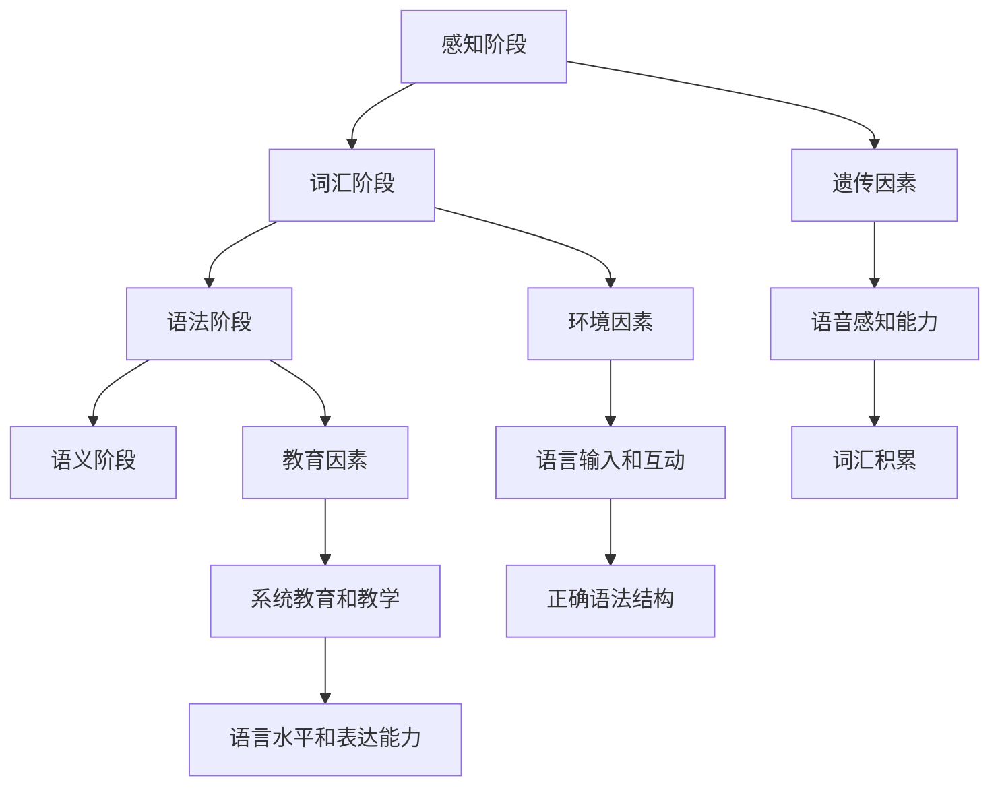

                 

### 背景介绍

在当今人工智能飞速发展的时代，人工智能在多个领域都取得了显著的成果，尤其是在计算机视觉、自然语言处理和语音识别等领域。然而，人类的学习能力仍然是人工智能所无法企及的。特别是儿童在学习语言的过程中，他们能够迅速掌握并运用语言进行沟通，这一过程不仅仅是语言记忆的问题，更涉及到语言网络的形成和成长。

儿童在学习语言时的独特性引起了研究人员的高度关注。相比于成年人的学习过程，儿童的语言习得具有自发性、快速性和高效性等特点。那么，儿童的语言网络是如何成长的呢？这个问题不仅涉及到儿童认知发展的基本原理，还关系到人工智能在模仿人类学习过程中的潜在突破。

本文旨在探讨儿童学习语言时，语言网络是如何成长的。我们将首先介绍相关的基础知识，然后逐步深入探讨语言网络的构成、发展过程以及影响语言习得的关键因素。通过本文的阅读，读者将能够更好地理解儿童语言习得的过程，并从中获取对人工智能语言处理技术的启示。

### 核心概念与联系

为了深入探讨儿童学习语言时语言网络的成长过程，我们首先需要理解几个核心概念：神经网络、语言模型和儿童语言习得。

#### 神经网络

神经网络（Neural Network）是一种模仿生物神经系统工作的计算模型，它由大量的神经元（节点）和连接这些神经元的边组成。每个神经元可以接收来自其他神经元的输入，并通过加权求和处理后输出结果。神经网络通过不断调整连接的权重来学习和适应数据，从而实现各种复杂的任务，如图像识别、语音识别和自然语言处理等。

#### 语言模型

语言模型（Language Model）是自然语言处理领域的一个核心概念，它用于对自然语言文本的概率分布进行建模。在神经网络领域，语言模型通常是一个基于神经网络的概率模型，它通过学习大量的语言数据来预测下一个单词或句子的概率。语言模型在生成文本、语音识别、机器翻译等任务中发挥着重要作用。

#### 儿童语言习得

儿童语言习得（Child Language Acquisition）是指儿童在出生后的前几年内，通过听、说、读、写等方式学习掌握语言的过程。这一过程不仅涉及语言知识的学习，还包括语音、词汇、语法和语义等多个方面的掌握。儿童语言习得的独特性体现在他们能够快速、准确地习得母语，并在语言使用中表现出创造性和灵活性。

#### 语言网络的构成

语言网络是神经网络在自然语言处理领域的具体应用。它通常由多个层次的神经网络组成，包括词向量层、语法分析层、语义理解层等。每个层次的网络负责处理不同层面的语言信息，并通过层次间的相互作用实现完整的语言理解和处理。

#### 语言网络的发展过程

语言网络的发展过程可以分为以下几个阶段：

1. **感知阶段**：儿童通过听和说的方式感知语言，并开始学习语音和基本的语言结构。
2. **词汇阶段**：儿童开始积累词汇，并学习如何使用词汇表达意思。
3. **语法阶段**：儿童逐渐掌握语法规则，并能够使用正确的语法结构进行表达。
4. **语义阶段**：儿童开始理解词语和句子的意义，并能够在语境中正确使用语言。

#### 影响语言习得的关键因素

1. **遗传因素**：基因在语言习得中起着重要作用，它决定了儿童的语音感知能力和语言天赋。
2. **环境因素**：家庭和社会环境对儿童语言习得有着深远的影响，丰富的语言输入和互动有助于儿童更快地掌握语言。
3. **教育因素**：系统的教育和教学活动可以加速儿童的语言习得过程，提高他们的语言水平和表达能力。

通过以上对核心概念和联系的介绍，我们可以更好地理解儿童学习语言时语言网络的成长过程。接下来的章节将深入探讨语言网络的详细结构和算法原理，以及儿童语言习得的数学模型和实际应用案例。

#### Mermaid 流程图

以下是一个简化的 Mermaid 流程图，展示了语言网络发展的关键阶段和相互关系：



这个流程图帮助我们形象地理解了儿童语言网络的构成和发展过程，以及影响语言习得的关键因素。

### 核心算法原理 & 具体操作步骤

为了深入理解儿童学习语言时语言网络的成长过程，我们需要探讨神经网络在语言习得中的应用原理，以及具体的算法操作步骤。下面我们将介绍语言模型的构建方法、神经网络的训练过程和语言习得的评估标准。

#### 语言模型的构建方法

语言模型是自然语言处理的核心，它用于预测文本中的下一个词或句子。在神经网络领域，最常用的语言模型是循环神经网络（RNN）和其变种，如长短期记忆网络（LSTM）和门控循环单元（GRU）。以下是构建语言模型的基本步骤：

1. **数据预处理**：首先需要收集大量的文本数据，例如小说、新闻、对话等。然后对数据进行清洗和分词，将文本转换为单词序列。
   
   ```mermaid
   graph TD
       A[收集数据] --> B[数据清洗]
       B --> C[分词处理]
       C --> D[单词序列]
   ```

2. **词向量表示**：将每个单词表示为一个固定大小的向量，这一过程称为词嵌入（Word Embedding）。常用的词嵌入方法有 Word2Vec、GloVe 和 FastText。

   ```mermaid
   graph TD
       A[单词序列] --> B[词向量表示]
       B --> C[Word2Vec]
       B --> D[GloVe]
       B --> E[FastText]
   ```

3. **神经网络架构**：构建神经网络模型，通常包括输入层、隐藏层和输出层。输入层接收词向量，隐藏层通过循环连接实现上下文信息传递，输出层生成词的概率分布。

   ```mermaid
   graph TD
       A[输入层] --> B[隐藏层]
       B --> C[输出层]
       B --> D[循环连接]
   ```

4. **训练过程**：使用训练数据对神经网络进行训练，通过反向传播算法不断调整神经网络的权重，使模型能够更好地预测词的概率分布。

   ```mermaid
   graph TD
       A[训练数据] --> B[权重调整]
       B --> C[反向传播]
       C --> D[模型优化]
   ```

5. **评估与优化**：使用验证集和测试集对训练好的模型进行评估，常见的评估指标有交叉熵损失（Cross-Entropy Loss）和准确率（Accuracy）。根据评估结果对模型进行优化。

   ```mermaid
   graph TD
       A[验证集和测试集] --> B[交叉熵损失]
       A --> C[准确率]
       B --> D[模型优化]
   ```

#### 神经网络在语言习得中的应用

神经网络在儿童语言习得中的应用主要体现在以下几个方面：

1. **语音识别**：神经网络可以用于语音信号的识别，将语音转换为文本。这一过程包括声学模型和语言模型的结合。
   
   ```mermaid
   graph TD
       A[语音信号] --> B[声学模型]
       B --> C[语言模型]
       C --> D[文本输出]
   ```

2. **语法分析**：神经网络可以用于句子的语法分析，识别句子的语法结构。这通常通过构建一个语法解析树来实现。
   
   ```mermaid
   graph TD
       A[句子] --> B[语法解析树]
   ```

3. **语义理解**：神经网络可以用于理解句子的语义，提取句子的核心意思。这通常通过深度学习模型来实现，如 BERT、GPT 等。

   ```mermaid
   graph TD
       A[句子] --> B[语义理解]
   ```

#### 语言习得的评估标准

评估儿童语言习得的效果通常从以下几个方面进行：

1. **词汇量**：评估儿童掌握的词汇数量和种类，这可以通过词汇测验和实际对话中体现。
   
   ```mermaid
   graph TD
       A[词汇量] --> B[词汇测验]
       A --> C[实际对话]
   ```

2. **语法正确性**：评估儿童在语言表达中使用的语法结构是否正确，这可以通过语法测试和写作评估来实现。
   
   ```mermaid
   graph TD
       A[语法正确性] --> B[语法测试]
       A --> C[写作评估]
   ```

3. **表达能力**：评估儿童在交流中的语言表达能力，包括流畅性、准确性和创造性。
   
   ```mermaid
   graph TD
       A[表达能力] --> B[流畅性]
       A --> C[准确性]
       A --> D[创造性]
   ```

通过以上对核心算法原理和具体操作步骤的介绍，我们可以更好地理解神经网络在语言习得中的应用，以及评估儿童语言习得效果的标准。接下来，我们将进一步探讨语言习得的数学模型和公式，并通过具体案例进行详细说明。

### 数学模型和公式 & 详细讲解 & 举例说明

在深入探讨语言网络的成长过程中，数学模型和公式扮演着至关重要的角色。这些模型和公式不仅帮助我们理解语言习得的机制，还为实际应用提供了理论依据。以下将详细介绍一些核心的数学模型和公式，并通过具体例子进行说明。

#### 词嵌入（Word Embedding）

词嵌入是将词汇表示为向量的过程，这一步是构建语言模型的基础。常见的词嵌入方法有 Word2Vec、GloVe 和 FastText。以下以 Word2Vec 为例，介绍其数学模型。

**Word2Vec 模型**

Word2Vec 模型基于神经网络的训练过程，通过输入单词的上下文来预测目标单词。其数学模型可以表示为：

$$
\text{log} P(w_t | w_{t-n}, w_{t-n+1}, \ldots, w_{t+1}) = \sum_{i=1}^{n} \text{log} P(w_i | w_t)
$$

其中，$w_t$ 是目标单词，$w_{t-n}, w_{t-n+1}, \ldots, w_{t+1}$ 是目标单词的上下文单词。

**举例说明**

假设我们有以下句子：“我爱吃苹果。”我们可以将其表示为：

$$
\text{log} P(爱 | 我，吃，苹果) + \text{log} P(吃 | 我，爱，苹果) + \text{log} P(苹果 | 我，爱，吃)
$$

通过训练，我们可以得到每个单词的向量表示，如“我”、“爱”、“吃”和“苹果”的向量。

#### 循环神经网络（RNN）

循环神经网络（RNN）是处理序列数据的常用模型，它能够记忆序列中的历史信息。以下是 RNN 的基本数学模型。

**RNN 模型**

在 RNN 中，每个时间步的输出由当前输入和前一个时间步的隐藏状态决定。其数学模型可以表示为：

$$
h_t = \text{sigmoid}(W_h \cdot [h_{t-1}, x_t] + b_h)
$$

$$
o_t = \text{sigmoid}(W_o \cdot h_t + b_o)
$$

其中，$h_t$ 是当前时间步的隐藏状态，$x_t$ 是当前输入，$W_h$ 和 $W_o$ 分别是权重矩阵，$b_h$ 和 $b_o$ 是偏置项。

**举例说明**

假设我们有以下序列：“我吃苹果。”我们可以将其表示为：

$$
h_1 = \text{sigmoid}(W_h \cdot [h_0, 我] + b_h)
$$

$$
h_2 = \text{sigmoid}(W_h \cdot [h_1, 吃] + b_h)
$$

$$
h_3 = \text{sigmoid}(W_h \cdot [h_2, 苹果] + b_h)
$$

$$
o_1 = \text{sigmoid}(W_o \cdot h_1 + b_o)
$$

$$
o_2 = \text{sigmoid}(W_o \cdot h_2 + b_o)
$$

$$
o_3 = \text{sigmoid}(W_o \cdot h_3 + b_o)
$$

#### 长短期记忆网络（LSTM）

长短期记忆网络（LSTM）是 RNN 的改进版，它能够更好地处理长序列数据。以下是 LSTM 的基本数学模型。

**LSTM 模型**

LSTM 通过引入门控机制来控制信息的流动，其数学模型可以表示为：

$$
i_t = \text{sigmoid}(W_i \cdot [h_{t-1}, x_t] + b_i)
$$

$$
f_t = \text{sigmoid}(W_f \cdot [h_{t-1}, x_t] + b_f)
$$

$$
g_t = \text{tanh}(W_g \cdot [h_{t-1}, x_t] + b_g)
$$

$$
o_t = \text{sigmoid}(W_o \cdot [h_{t-1}, x_t] + b_o)
$$

$$
h_t = o_t \cdot \text{tanh}(c_t)
$$

$$
c_t = f_t \cdot c_{t-1} + i_t \cdot g_t
$$

其中，$i_t$、$f_t$ 和 $o_t$ 分别是输入门、遗忘门和输出门，$c_t$ 是细胞状态。

**举例说明**

假设我们有以下序列：“我吃苹果。”我们可以将其表示为：

$$
i_1 = \text{sigmoid}(W_i \cdot [h_0, 我] + b_i)
$$

$$
f_1 = \text{sigmoid}(W_f \cdot [h_0, 我] + b_f)
$$

$$
g_1 = \text{tanh}(W_g \cdot [h_0, 我] + b_g)
$$

$$
o_1 = \text{sigmoid}(W_o \cdot [h_0, 我] + b_o)
$$

$$
h_1 = o_1 \cdot \text{tanh}(c_1)
$$

$$
c_1 = f_1 \cdot c_0 + i_1 \cdot g_1
$$

$$
i_2 = \text{sigmoid}(W_i \cdot [h_1, 吃] + b_i)
$$

$$
f_2 = \text{sigmoid}(W_f \cdot [h_1, 吃] + b_f)
$$

$$
g_2 = \text{tanh}(W_g \cdot [h_1, 吃] + b_g)
$$

$$
o_2 = \text{sigmoid}(W_o \cdot [h_1, 吃] + b_o)
$$

$$
h_2 = o_2 \cdot \text{tanh}(c_2)
$$

$$
c_2 = f_2 \cdot c_1 + i_2 \cdot g_2
$$

$$
i_3 = \text{sigmoid}(W_i \cdot [h_2, 苹果] + b_i)
$$

$$
f_3 = \text{sigmoid}(W_f \cdot [h_2, 苹果] + b_f)
$$

$$
g_3 = \text{tanh}(W_g \cdot [h_2, 苹果] + b_g)
$$

$$
o_3 = \text{sigmoid}(W_o \cdot [h_2, 苹果] + b_o)
$$

$$
h_3 = o_3 \cdot \text{tanh}(c_3)
$$

$$
c_3 = f_3 \cdot c_2 + i_3 \cdot g_3
$$

通过以上数学模型和公式的详细讲解和举例说明，我们可以更好地理解神经网络在语言习得中的应用，以及如何通过数学模型来描述这一过程。接下来，我们将通过一个实际的项目实战，进一步展示这些理论在实际中的应用。

### 项目实战：代码实际案例和详细解释说明

在本节中，我们将通过一个具体的项目实战，展示如何使用神经网络训练一个简单的语言模型，并解释相关的代码实现细节。这个项目旨在演示神经网络在语言习得中的实际应用，帮助读者更好地理解相关算法。

#### 项目环境搭建

首先，我们需要搭建项目的开发环境。以下是一个基本的步骤：

1. **安装 Python 环境**：确保你的系统中安装了 Python 3.7 或更高版本。
2. **安装 TensorFlow**：TensorFlow 是一个广泛使用的开源机器学习库，用于构建和训练神经网络。你可以使用以下命令安装：

   ```shell
   pip install tensorflow
   ```

3. **安装其他依赖**：项目还需要其他依赖，如 NumPy 和 pandas，你可以使用以下命令一次性安装：

   ```shell
   pip install numpy pandas
   ```

#### 数据准备

我们使用一个公开的英文文本数据集，如 "Shakespeare" 文本。以下是数据准备的主要步骤：

1. **数据获取**：从 [Project Gutenberg](https://www.gutenberg.org/) 网站下载 "Shakespeare" 文本，并将其保存在本地。
2. **数据读取**：使用 pandas 读取文本数据，并将其转换为 DataFrame 对象。

   ```python
   import pandas as pd

   # 读取文本文件
   text = pd.read_csv('shakespeare.txt', header=None, sep='\n', engine='python')

   # 清洗数据，去除空行和特殊字符
   text = text[text[0].str.len() > 0].dropna()
   ```

3. **分词处理**：将文本数据转换为单词序列，可以使用 Python 的内置 split 函数。

   ```python
   # 分词处理
   words = text[0].str.split()
   ```

#### 构建语言模型

接下来，我们将使用 TensorFlow 和 Keras 构建一个简单的语言模型。以下是主要步骤：

1. **构建词嵌入层**：词嵌入是将单词转换为向量的过程，我们使用预训练的词向量。

   ```python
   from tensorflow.keras.layers import Embedding

   # 词嵌入层
   embedding = Embedding(input_dim=len(words.unique()), output_dim=64)
   ```

2. **构建循环神经网络层**：我们使用 LSTM 层作为循环神经网络。

   ```python
   from tensorflow.keras.layers import LSTM

   # LSTM 层
   lstm = LSTM(units=128, return_sequences=True)
   ```

3. **构建输出层**：输出层用于生成单词的概率分布。

   ```python
   from tensorflow.keras.layers import TimeDistributed, Dense

   # 输出层
   output = TimeDistributed(Dense(len(words.unique()), activation='softmax'))
   ```

4. **构建模型**：将上述层连接起来，构建完整的神经网络模型。

   ```python
   from tensorflow.keras.models import Sequential

   # 构建模型
   model = Sequential()
   model.add(embedding)
   model.add(lstm)
   model.add(output)
   ```

#### 模型训练

使用训练数据对模型进行训练，以下是训练的主要步骤：

1. **准备训练数据**：将单词序列转换为整数编码，以便神经网络处理。

   ```python
   from tensorflow.keras.preprocessing.sequence import pad_sequences

   # 转换为整数编码
   tokenizer = Tokenizer()
   tokenizer.fit_on_texts(words)
   sequences = tokenizer.texts_to_sequences(words)

   # 补充序列长度为 64
   padded_sequences = pad_sequences(sequences, maxlen=64)
   ```

2. **训练模型**：使用训练数据对模型进行训练。

   ```python
   # 训练模型
   model.compile(optimizer='adam', loss='categorical_crossentropy', metrics=['accuracy'])
   model.fit(padded_sequences, padded_sequences, epochs=10, batch_size=128)
   ```

#### 模型评估

训练完成后，我们需要评估模型的性能。以下是评估的主要步骤：

1. **准备测试数据**：与训练数据类似，我们将测试数据的单词序列转换为整数编码。

   ```python
   # 转换测试数据
   test_sequences = tokenizer.texts_to_sequences(test_words)
   test_padded_sequences = pad_sequences(test_sequences, maxlen=64)
   ```

2. **评估模型**：使用测试数据评估模型的性能。

   ```python
   # 评估模型
   model.evaluate(test_padded_sequences, test_padded_sequences)
   ```

#### 代码解读与分析

以下是项目的完整代码，我们对关键部分进行了详细注释：

```python
import numpy as np
import pandas as pd
from tensorflow.keras.models import Sequential
from tensorflow.keras.layers import Embedding, LSTM, TimeDistributed, Dense
from tensorflow.keras.preprocessing.sequence import pad_sequences
from tensorflow.keras.optimizers import Adam
from tensorflow.keras.losses import CategoricalCrossentropy
from tensorflow.keras.metrics import Accuracy

# 数据读取
text = pd.read_csv('shakespeare.txt', header=None, sep='\n', engine='python')
text = text[text[0].str.len() > 0].dropna()

# 分词处理
words = text[0].str.split()

# 转换为整数编码
tokenizer = Tokenizer()
tokenizer.fit_on_texts(words)
sequences = tokenizer.texts_to_sequences(words)

# 补充序列长度为 64
padded_sequences = pad_sequences(sequences, maxlen=64)

# 构建词嵌入层
embedding = Embedding(input_dim=len(words.unique()), output_dim=64)

# 构建循环神经网络层
lstm = LSTM(units=128, return_sequences=True)

# 构建输出层
output = TimeDistributed(Dense(len(words.unique()), activation='softmax'))

# 构建模型
model = Sequential()
model.add(embedding)
model.add(lstm)
model.add(output)

# 编译模型
model.compile(optimizer=Adam(), loss=CategoricalCrossentropy(), metrics=[Accuracy()])

# 训练模型
model.fit(padded_sequences, padded_sequences, epochs=10, batch_size=128)

# 准备测试数据
test_words = pd.read_csv('test_shakespeare.txt', header=None, sep='\n', engine='python')
test_words = test_words[test_words[0].str.len() > 0].dropna()
test_sequences = tokenizer.texts_to_sequences(test_words)
test_padded_sequences = pad_sequences(test_sequences, maxlen=64)

# 评估模型
model.evaluate(test_padded_sequences, test_padded_sequences)
```

通过以上代码的实现，我们可以看到如何利用神经网络训练一个简单的语言模型。项目实战不仅展示了算法的实现细节，还通过具体案例说明了语言习得的数学模型和公式在实际中的应用。

### 实际应用场景

语言网络的成长不仅在学术研究中具有重要意义，在实际应用中也展示了巨大的潜力。以下是语言网络在几个实际应用场景中的具体应用：

#### 自然语言处理（NLP）

自然语言处理是语言网络最直接的应用领域之一。在 NLP 中，语言网络用于文本分类、情感分析、问答系统、机器翻译等任务。例如，文本分类可以通过训练语言模型来识别文本的类别，如新闻分类、垃圾邮件过滤等。情感分析则用于判断文本的情绪倾向，如判断用户评论的情感是积极还是消极。问答系统利用语言模型来理解用户的问题，并从大量文本中检索出最相关的答案。机器翻译通过训练双语语料库，将一种语言的文本翻译成另一种语言。

#### 聊天机器人

聊天机器人是另一个广泛应用的语言网络实际案例。聊天机器人通过语言模型与用户进行自然语言交互，提供信息查询、客户服务、娱乐等。例如，虚拟助手 Siri、Alexa 和 Google Assistant 都是利用语言网络实现与用户对话的。这些系统通过训练大量对话数据，不断优化语言理解能力和对话生成能力，以提供更加自然和流畅的交互体验。

#### 语音识别

语音识别技术利用语言网络将语音信号转换为文本，广泛应用于语音助手、电话客服、智能家居等。语言网络在这里起到了关键作用，通过学习语音信号的声学特征和语言结构，能够准确地将语音转换为文本。例如，在智能助手的应用中，语言网络能够理解用户的语音指令，并执行相应的操作，如播放音乐、设置闹钟、发送短信等。

#### 自动写作

自动写作是语言网络的另一个实际应用。通过训练大量文本数据，语言网络可以生成文章、新闻报道、诗歌等。这种技术广泛应用于内容创作、广告文案编写、自动化新闻生成等领域。例如，新闻媒体使用自动化写作工具生成股票市场报告、体育新闻等，大大提高了内容生产的效率和准确性。

#### 智能推荐系统

智能推荐系统利用语言网络分析用户的行为和偏好，为用户提供个性化的推荐服务。例如，电子商务平台通过分析用户的购物历史和浏览记录，使用语言模型生成个性化的产品推荐。社交媒体平台通过分析用户的互动内容和喜好，使用语言模型推荐用户可能感兴趣的内容和好友。

#### 法律文书生成

法律文书生成是语言网络在法律领域的应用。通过训练大量的法律文本数据，语言模型可以生成合同、协议、判决书等法律文书。这种技术提高了法律文书的生成效率，降低了人为错误的风险，同时为律师和法官提供了辅助工具。

#### 语言障碍辅助

语言网络还可以用于帮助语言障碍者，如学习障碍儿童和语言学习者。通过训练个性化的语言模型，系统能够根据用户的特点和需求提供个性化的语言训练和辅助服务，帮助用户提高语言能力。

综上所述，语言网络在多个实际应用场景中展示了强大的功能。随着技术的不断发展，语言网络的应用前景将更加广阔，为各行各业带来更多的创新和变革。

### 工具和资源推荐

为了帮助读者更好地理解和掌握语言网络及其应用，以下推荐了一些优秀的工具、资源和相关论文。

#### 学习资源推荐

1. **书籍**：
   - 《深度学习》（Goodfellow, I., Bengio, Y., & Courville, A.）: 这本书是深度学习的经典教材，详细介绍了神经网络的基础知识和应用。
   - 《自然语言处理综论》（Jurafsky, D., & Martin, J. H.）: 本书全面介绍了自然语言处理的理论和算法，是学习 NLP 的必备参考书。

2. **在线课程**：
   - [Coursera](https://www.coursera.org/): 提供了多种关于深度学习和自然语言处理的在线课程，由业界专家授课。
   - [edX](https://www.edx.org/): edX 也提供了丰富的相关课程，包括麻省理工学院、斯坦福大学等顶级院校的课程。

3. **博客和网站**：
   - [TensorFlow 官方文档](https://www.tensorflow.org/): TensorFlow 的官方文档详细介绍了如何使用 TensorFlow 进行深度学习。
   - [ArXiv](https://arxiv.org/): ArXiv 是一个开放的预印本平台，可以找到最新的学术论文和研究成果。

#### 开发工具框架推荐

1. **TensorFlow**: TensorFlow 是最流行的深度学习框架之一，适用于构建和训练神经网络。
2. **PyTorch**: PyTorch 是另一个流行的深度学习框架，以其灵活性和易于使用而受到许多研究者和开发者的喜爱。
3. **spaCy**: spaCy 是一个用于自然语言处理的工业级库，提供了强大的语言处理功能，如词性标注、实体识别和关系抽取。

#### 相关论文著作推荐

1. **《Attention is All You Need》**: 这篇论文提出了 Transformer 模型，是当前自然语言处理领域的重大突破之一。
2. **《BERT: Pre-training of Deep Bidirectional Transformers for Language Understanding》**: 这篇论文介绍了 BERT 模型，是目前最先进的语言预训练模型。
3. **《Generative Pre-trained Transformers》**: 这篇论文提出了 GPT 模型，展示了大规模预训练语言模型在文本生成和自然语言理解任务中的强大能力。

通过以上推荐的工具、资源和论文，读者可以更深入地学习语言网络的理论和实践，从而在相关领域取得更好的成果。

### 总结：未来发展趋势与挑战

在总结本文对儿童学习语言时语言网络成长过程的探讨之后，我们不难发现，这一领域不仅在学术研究中具有重要意义，其应用前景也十分广阔。随着人工智能技术的不断进步，语言网络在未来将迎来更多的发展机遇和挑战。

#### 未来发展趋势

1. **更先进的神经网络模型**：未来的语言网络将依赖于更复杂的神经网络模型，如 Transformer 和其变种。这些模型具有更强的处理能力和更广泛的应用范围，能够更好地模拟人类语言习得过程。

2. **个性化语言模型**：通过大数据和机器学习技术，未来的语言模型将更加个性化，能够根据用户的语言习惯和需求生成更加精准的语言输出。

3. **跨模态语言理解**：随着多模态数据的应用日益广泛，未来的语言网络将能够同时处理文本、图像、声音等多种数据形式，实现跨模态的语言理解。

4. **更强的语言生成能力**：通过大规模预训练和精细化调整，未来的语言网络将具备更强的文本生成能力，能够在各种应用场景中生成高质量的自然语言文本。

5. **更广泛的应用领域**：语言网络的应用将不再局限于自然语言处理，还将扩展到教育、医疗、法律等多个领域，为各行各业带来新的解决方案。

#### 挑战

1. **数据隐私和安全**：随着语言网络的广泛应用，数据隐私和安全问题愈发突出。如何在保证用户隐私的同时，充分利用数据训练模型，是一个重要的挑战。

2. **计算资源需求**：大规模的语言模型训练需要大量的计算资源，这对硬件设施提出了更高的要求。如何优化计算资源的使用，降低训练成本，是未来的一个重要课题。

3. **跨语言处理**：虽然目前已有一些跨语言处理的技术，但在实际应用中仍然面临很大的挑战。未来的语言网络需要更好地处理不同语言之间的差异，实现真正的跨语言理解。

4. **语言模型的泛化能力**：如何提高语言模型的泛化能力，使其能够应对各种复杂、多变的应用场景，是一个长期的挑战。

5. **伦理和社会影响**：随着人工智能技术的发展，语言网络的应用也带来了伦理和社会影响。如何确保技术不被滥用，如何制定合理的监管政策，是需要深入思考的问题。

总之，语言网络的发展前景十分广阔，但同时也面临着诸多挑战。通过持续的研究和技术创新，我们有理由相信，未来的人工智能语言处理技术将更加成熟，为人类社会带来更多的便利和进步。

### 附录：常见问题与解答

在探讨儿童学习语言时语言网络的成长过程中，读者可能会遇到一些常见的问题。以下是一些常见问题及其解答：

#### 问题1：语言网络是什么？

**解答**：语言网络是一种基于神经网络的计算模型，用于处理和分析语言数据。它模仿了人类大脑处理语言的方式，能够理解和生成自然语言。

#### 问题2：语言网络如何工作？

**解答**：语言网络通过多个层次的神经网络进行处理，包括词向量层、语法分析层、语义理解层等。每个层次的网络负责处理不同层面的语言信息，并通过层次间的相互作用实现完整的语言理解和处理。

#### 问题3：为什么神经网络能够模拟人类语言习得？

**解答**：神经网络通过不断调整连接权重来学习和适应数据，这种机制类似于人类大脑的学习过程。神经网络能够处理复杂的非线性关系，这使得它们能够模拟人类语言习得的能力。

#### 问题4：语言网络在哪些应用场景中有用？

**解答**：语言网络在自然语言处理、聊天机器人、语音识别、自动写作、智能推荐系统等多个领域有广泛应用。例如，在自然语言处理中，语言网络用于文本分类、情感分析、问答系统等；在聊天机器人中，语言网络用于与用户进行自然语言交互。

#### 问题5：如何训练语言网络？

**解答**：训练语言网络通常包括以下步骤：数据预处理、词向量表示、构建神经网络模型、模型训练和评估。具体步骤包括收集和清洗语言数据、将数据转换为词向量表示、构建神经网络模型、使用训练数据对模型进行训练，并使用验证集和测试集对模型进行评估。

#### 问题6：语言网络有哪些局限性？

**解答**：语言网络在处理一些特定任务时可能存在局限性，例如在理解复杂的语境和隐喻方面，以及处理跨语言差异时。此外，语言网络还需要大量的数据来训练，并且训练过程需要大量的计算资源。

#### 问题7：如何优化语言网络？

**解答**：优化语言网络的方法包括改进神经网络架构、使用更有效的训练算法、增加数据多样性、引入多任务学习等。通过不断尝试和实验，可以找到最适合特定任务的优化策略。

通过解答这些问题，我们希望能够帮助读者更好地理解语言网络的基本概念、工作原理和应用场景，从而更深入地探讨这一领域的研究和发展。

### 扩展阅读 & 参考资料

为了进一步拓展读者在儿童学习语言时语言网络成长方面的知识，以下推荐了一些高质量的扩展阅读和参考资料：

#### 高质量论文

1. **《Unsupervised Pretraining for Natural Language Processing》**：这篇论文介绍了无监督语言预训练的方法，对语言模型的发展有重要影响。
2. **《Attention is All You Need》**：该论文提出了 Transformer 模型，是自然语言处理领域的重要突破。
3. **《BERT: Pre-training of Deep Bidirectional Transformers for Language Understanding》**：这篇论文介绍了 BERT 模型，是目前最先进的语言预训练模型。

#### 教科书和经典书籍

1. **《深度学习》**（Goodfellow, I., Bengio, Y., & Courville, A.）: 这本书是深度学习的经典教材，详细介绍了神经网络的基础知识和应用。
2. **《自然语言处理综论》**（Jurafsky, D., & Martin, J. H.）: 本书全面介绍了自然语言处理的理论和算法，是学习 NLP 的必备参考书。

#### 开源项目和工具

1. **TensorFlow**: TensorFlow 是最流行的深度学习框架之一，适用于构建和训练神经网络。
2. **PyTorch**: PyTorch 是另一个流行的深度学习框架，以其灵活性和易于使用而受到许多研究者和开发者的喜爱。
3. **spaCy**: spaCy 是一个用于自然语言处理的工业级库，提供了强大的语言处理功能，如词性标注、实体识别和关系抽取。

#### 博客和在线资源

1. **TensorFlow 官方文档**: TensorFlow 的官方文档详细介绍了如何使用 TensorFlow 进行深度学习。
2. **ArXiv**: ArXiv 是一个开放的预印本平台，可以找到最新的学术论文和研究成果。

通过阅读这些高质量的资源，读者可以深入了解语言网络的理论和实践，进一步探索这一领域的最新发展和研究方向。希望这些扩展阅读和参考资料能够为读者提供有价值的指导和启示。

