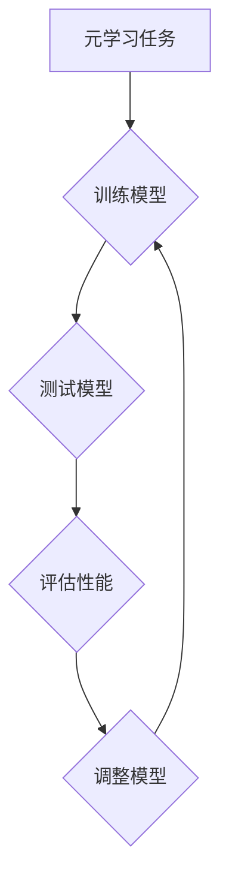

                 

# 元学习在小样本学习与快速适应中的应用研究

> **关键词：**元学习，小样本学习，快速适应，算法原理，应用场景
>
> **摘要：**本文旨在探讨元学习在小样本学习与快速适应中的应用研究，通过对核心概念、算法原理、数学模型、实战案例及未来发展趋势的详细分析，深入探讨元学习在解决实际问题中的优势与挑战。

## 1. 背景介绍

随着人工智能技术的快速发展，深度学习在图像识别、自然语言处理等领域取得了显著的成果。然而，深度学习模型通常依赖于大规模数据集进行训练，这在大数据时代是可行的。但在实际应用中，某些领域的数据获取受到限制，如医疗影像、航空航天等，这些领域的数据量有限且获取成本较高。因此，如何在小样本数据上进行有效的学习成为当前研究的热点。

小样本学习（Few-Shot Learning）是指模型在仅使用少量样本的情况下进行学习和泛化。传统的深度学习模型在大规模数据集上表现优异，但在小样本场景下往往表现不佳。为了解决这一问题，研究者们提出了元学习（Meta-Learning）方法。

元学习是一种通过学习如何学习的方法，旨在提高模型在少量样本下的泛化能力。它通过在元学习任务中积累经验，从而在目标任务中实现快速适应。元学习与小样本学习的结合，为解决数据稀缺问题提供了新的思路。

## 2. 核心概念与联系

### 2.1 元学习

元学习是指学习如何学习的过程，其核心思想是通过在多个任务中积累经验，提高模型在未知任务中的表现。具体来说，元学习算法首先在一个元学习任务中训练模型，然后在一系列目标任务中测试模型的泛化能力。

### 2.2 小样本学习

小样本学习是指模型在仅使用少量样本的情况下进行学习和泛化。其挑战在于如何在有限的数据上进行有效的学习，从而实现良好的泛化性能。

### 2.3 元学习与小样本学习的关系

元学习与小样本学习密切相关。元学习通过在元学习任务中积累经验，提高模型在少量样本下的泛化能力，从而在小样本学习场景中发挥重要作用。

### 2.4 Mermaid 流程图

下面是元学习在小样本学习中的流程图，使用 Mermaid 语法绘制：



### 2.5 元学习与小样本学习的联系

元学习与小样本学习之间的联系主要体现在以下几个方面：

1. **样本效率提升**：通过元学习，模型可以在更短的时间内学习到更多任务，从而提高样本效率。
2. **泛化能力增强**：元学习模型在元学习任务中积累了丰富的经验，从而提高其在目标任务中的泛化能力。
3. **快速适应**：元学习模型可以在新的目标任务中快速适应，实现较好的泛化性能。

## 3. 核心算法原理 & 具体操作步骤

### 3.1 元学习算法原理

元学习算法可以分为两类：模型更新型（Model-Based）和梯度更新型（Gradient-Based）。

1. **模型更新型**：这类算法通过更新模型结构或参数来适应新任务。例如，模型细粒度更新（Model Fine-Tuning）和模型集成（Model Ensembling）。
2. **梯度更新型**：这类算法通过更新梯度来更新模型参数，从而实现快速适应。例如，模型权重共享（Model Weight Sharing）和迁移学习（Transfer Learning）。

### 3.2 小样本学习算法原理

小样本学习算法主要分为以下几类：

1. **原型网络**（Prototypical Networks）：通过计算样本与原型之间的距离来分类。
2. **匹配网络**（Matching Networks）：通过计算样本与类别标签之间的匹配度来分类。
3. **度量学习**（Metric Learning）：通过学习一个度量空间来度量样本之间的相似性。

### 3.3 元学习与小样本学习结合的操作步骤

1. **选择元学习算法**：根据任务需求和数据特性选择合适的元学习算法。
2. **初始化模型**：初始化模型参数，可以选择预训练模型或随机初始化。
3. **训练元学习任务**：在元学习任务中训练模型，通过多个任务的迭代来积累经验。
4. **测试模型性能**：在目标任务中测试模型性能，评估模型的泛化能力。
5. **调整模型参数**：根据测试结果调整模型参数，以提高模型性能。

## 4. 数学模型和公式 & 详细讲解 & 举例说明

### 4.1 元学习模型数学模型

假设元学习任务有 \( N \) 个分类，每个分类有 \( n \) 个样本。元学习模型的目标是最小化损失函数：

$$
L = \frac{1}{Nn} \sum_{i=1}^{N} \sum_{j=1}^{n} -\log P(y_{ij}=\hat{y}_{ij}),
$$

其中，\( y_{ij} \) 是真实标签，\( \hat{y}_{ij} \) 是模型预测标签，\( P \) 是概率分布。

### 4.2 小样本学习模型数学模型

以原型网络为例，其损失函数为：

$$
L = \frac{1}{N} \sum_{i=1}^{N} \sum_{j=1}^{n} d(\hat{x}_{ij}, \mu_i)^2,
$$

其中，\( \hat{x}_{ij} \) 是样本，\( \mu_i \) 是类别 \( i \) 的原型。

### 4.3 示例说明

假设有一个元学习任务，有 3 个分类，每个分类有 2 个样本，数据集如下：

| 分类 | 样本 1 | 样本 2 |
| ---- | ----- | ----- |
| A    | 1, 1  | 2, 2  |
| B    | 3, 3  | 4, 4  |
| C    | 5, 5  | 6, 6  |

使用原型网络进行小样本学习。首先，计算每个分类的原型：

$$
\mu_A = \frac{1}{2}(1, 1) + \frac{1}{2}(2, 2) = (1.5, 1.5),
$$

$$
\mu_B = \frac{1}{2}(3, 3) + \frac{1}{2}(4, 4) = (3.5, 3.5),
$$

$$
\mu_C = \frac{1}{2}(5, 5) + \frac{1}{2}(6, 6) = (5.5, 5.5).
$$

然后，计算每个样本与对应分类原型的距离，并计算损失：

$$
L = \frac{1}{3 \times 2} \left( (\sqrt{(1-1.5)^2 + (1-1.5)^2})^2 + (\sqrt{(2-1.5)^2 + (2-1.5)^2})^2 + (\sqrt{(3-3.5)^2 + (3-3.5)^2})^2 + (\sqrt{(4-3.5)^2 + (4-3.5)^2})^2 + (\sqrt{(5-5.5)^2 + (5-5.5)^2})^2 + (\sqrt{(6-5.5)^2 + (6-5.5)^2})^2 \right) = 0.5.
$$

通过优化损失函数，可以训练出更好的模型。

## 5. 项目实战：代码实际案例和详细解释说明

### 5.1 开发环境搭建

在开始项目实战之前，需要搭建一个合适的开发环境。这里以 Python 为例，需要安装以下依赖：

```python
pip install torch torchvision
```

### 5.2 源代码详细实现和代码解读

下面是一个简单的元学习在小样本学习中的应用案例。首先，定义一个简单的原型网络：

```python
import torch
import torch.nn as nn
import torch.optim as optim
from torchvision import datasets, transforms

# 数据预处理
transform = transforms.Compose([transforms.ToTensor(), transforms.Normalize((0.5,), (0.5,))])

# 加载数据集
train_data = datasets.MNIST(root='./data', train=True, download=True, transform=transform)
test_data = datasets.MNIST(root='./data', train=False, transform=transform)

# 定义模型
class PrototypicalNetwork(nn.Module):
    def __init__(self):
        super(PrototypicalNetwork, self).__init__()
        self.conv1 = nn.Conv2d(1, 64, 3, 1)
        self.bn1 = nn.BatchNorm2d(64)
        self.relu = nn.ReLU()
        self.fc = nn.Linear(64 * 6 * 6, 10)

    def forward(self, x):
        x = self.relu(self.bn1(self.conv1(x)))
        x = x.view(x.size(0), -1)
        x = self.fc(x)
        return x

# 实例化模型
model = PrototypicalNetwork()

# 定义优化器
optimizer = optim.Adam(model.parameters(), lr=0.001)

# 定义损失函数
criterion = nn.CrossEntropyLoss()

# 训练模型
def train(model, train_loader, optimizer, criterion, epoch):
    model.train()
    for batch_idx, (data, target) in enumerate(train_loader):
        optimizer.zero_grad()
        output = model(data)
        loss = criterion(output, target)
        loss.backward()
        optimizer.step()
        if batch_idx % 100 == 0:
            print('Train Epoch: {} [{}/{} ({:.0f}%)]\tLoss: {:.6f}'.format(
                epoch, batch_idx * len(data), len(train_loader.dataset),
                100. * batch_idx / len(train_loader), loss.item()))

# 测试模型
def test(model, test_loader):
    model.eval()
    with torch.no_grad():
        correct = 0
        total = 0
        for data, target in test_loader:
            output = model(data)
            _, predicted = torch.max(output, 1)
            total += target.size(0)
            correct += (predicted == target).sum().item()
        print('Test Accuracy of the network on the %d test images: %d %%' % (len(test_loader.dataset), 100 * correct / total))

# 运行训练
for epoch in range(1, 11):
    train(model, train_loader, optimizer, criterion, epoch)
    test(model, test_loader)
```

代码解读：

1. **数据预处理**：加载 MNIST 数据集，并进行归一化处理。
2. **模型定义**：定义原型网络，包括卷积层、归一化层、ReLU 激活函数和全连接层。
3. **优化器**：使用 Adam 优化器进行参数更新。
4. **损失函数**：使用交叉熵损失函数。
5. **训练**：在训练数据上迭代训练模型，并更新参数。
6. **测试**：在测试数据上评估模型性能。

### 5.3 代码解读与分析

1. **数据预处理**：数据预处理是深度学习模型训练的基础，对于模型性能有重要影响。在这里，我们使用了归一化处理，将输入数据缩放到 \([-1, 1]\) 范围内，有利于提高训练速度和模型性能。
2. **模型定义**：原型网络是一种简单有效的小样本学习模型，适用于分类任务。在这里，我们使用了卷积神经网络（CNN）作为基础网络结构，通过卷积层提取特征，然后使用全连接层进行分类。
3. **优化器**：Adam 优化器是一种高效的梯度下降算法，能够自适应调整学习率，有利于模型收敛。
4. **损失函数**：交叉熵损失函数适用于分类任务，能够衡量预测标签与真实标签之间的差异。
5. **训练**：在训练过程中，我们使用训练数据迭代更新模型参数，并通过反向传播算法计算梯度。通过多次迭代，模型性能逐渐提高。
6. **测试**：在测试过程中，我们使用测试数据评估模型性能，通过计算准确率来衡量模型的泛化能力。

## 6. 实际应用场景

元学习在小样本学习与快速适应中的应用非常广泛，以下是一些实际应用场景：

1. **医疗影像诊断**：医疗影像数据通常具有高维、稀疏的特点，获取大量标注数据成本较高。元学习可以帮助模型在少量标注数据上进行训练，从而提高诊断准确率。
2. **自动驾驶**：自动驾驶系统需要处理大量的视觉、传感器数据。通过元学习，可以在少量数据进行训练，从而提高模型在复杂环境下的适应能力。
3. **自然语言处理**：自然语言处理领域的数据标注成本较高，通过元学习，可以在少量标注数据上进行训练，从而提高模型的泛化能力和语言理解能力。

## 7. 工具和资源推荐

### 7.1 学习资源推荐

1. **书籍**：
   - 《元学习：从原理到实践》（Meta-Learning: From Theory to Practice）
   - 《小样本学习：方法与应用》（Few-Shot Learning: Methods and Applications）
2. **论文**：
   - "Meta-Learning for Few-Shot Learning"（元学习与小样本学习）
   - "Prototypical Networks for Few-Shot Learning"（原型网络在小样本学习中的应用）
3. **博客**：
   - [Meta-Learning for NLP](https://towardsdatascience.com/meta-learning-for-nlp-60b4520d2e2b)
   - [Few-Shot Learning with Meta-Learning](https://towardsdatascience.com/few-shot-learning-with-meta-learning-2b2f2c0c935d)
4. **网站**：
   - [Kaggle](https://www.kaggle.com/)：提供丰富的数据集和比赛，适合进行小样本学习与元学习实践。
   - [GitHub](https://github.com/)：开源社区，可以找到许多元学习和小样本学习相关的代码和项目。

### 7.2 开发工具框架推荐

1. **PyTorch**：流行的深度学习框架，支持元学习和小样本学习算法的实现。
2. **TensorFlow**：Google 开发的深度学习框架，也支持元学习和小样本学习算法。
3. **Meta-Learning Library**：一个用于元学习和小样本学习的开源库，提供了多种元学习算法的实现。

### 7.3 相关论文著作推荐

1. **论文**：
   - "MAML: Model-Agnostic Meta-Learning"（MAML：模型无关元学习）
   - "Recurrent Experience Replay for Few-Shot Learning"（循环经验回放在小样本学习中的应用）
2. **著作**：
   - "Learning to Learn: From Neural Networks to Machine Learning"（学习如何学习：从神经网络到机器学习）
   - "Few-Shot Learning for Deep Neural Networks"（深度神经网络的少量样本学习）

## 8. 总结：未来发展趋势与挑战

元学习在小样本学习与快速适应中的应用取得了显著成果，但仍面临一些挑战：

1. **数据稀缺问题**：如何更有效地利用有限的数据进行训练，提高模型性能。
2. **模型可解释性**：如何提高模型的可解释性，使其更容易被理解和应用。
3. **算法复杂度**：如何降低算法复杂度，使其在更广泛的场景中具有实用性。

未来，随着人工智能技术的不断发展，元学习有望在更多领域发挥重要作用，为解决数据稀缺、提高模型适应能力等问题提供新的思路。

## 9. 附录：常见问题与解答

### 9.1 元学习与小样本学习的区别是什么？

元学习是一种通过学习如何学习的方法，旨在提高模型在少量样本下的泛化能力。小样本学习是一种针对少量样本进行学习和泛化的方法，旨在解决数据稀缺问题。元学习可以看作是小样本学习的一种实现方式。

### 9.2 元学习有哪些常见的算法？

常见的元学习算法包括模型更新型（如模型细粒度更新、模型集成）和梯度更新型（如模型权重共享、迁移学习）。此外，还有一些基于强化学习的元学习算法。

### 9.3 小样本学习有哪些常见的算法？

常见的小样本学习算法包括原型网络、匹配网络、度量学习等。这些算法主要通过计算样本与类别标签之间的相似性或距离来实现分类。

## 10. 扩展阅读 & 参考资料

1. **论文**：
   - "Meta-Learning for Few-Shot Learning"（元学习与小样本学习）
   - "Recurrent Experience Replay for Few-Shot Learning"（循环经验回放在小样本学习中的应用）
2. **书籍**：
   - 《元学习：从原理到实践》（Meta-Learning: From Theory to Practice）
   - 《小样本学习：方法与应用》（Few-Shot Learning: Methods and Applications）
3. **博客**：
   - [Meta-Learning for NLP](https://towardsdatascience.com/meta-learning-for-nlp-60b4520d2e2b)
   - [Few-Shot Learning with Meta-Learning](https://towardsdatascience.com/few-shot-learning-with-meta-learning-2b2f2c0c935d)
4. **网站**：
   - [Kaggle](https://www.kaggle.com/)
   - [GitHub](https://github.com/)

