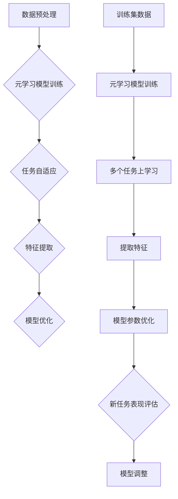

                 

# 元学习在少样本图像识别中的应用研究

> **关键词：** 元学习、少样本图像识别、深度学习、神经网络、迁移学习

> **摘要：** 本文旨在探讨元学习在少样本图像识别领域中的应用，分析其核心概念、算法原理以及实际应用案例，并提出未来发展趋势与挑战。通过对元学习的深入探讨，为读者提供了一个新的视角来理解如何通过元学习技术提高少样本图像识别的准确性和效率。

## 1. 背景介绍

### 1.1 少样本图像识别的挑战

在图像识别领域，少样本学习（Few-Shot Learning）是一个重要的研究方向。传统机器学习方法通常依赖于大量标注数据来训练模型，以达到较高的识别准确率。然而，在现实场景中，获取大量标注数据往往非常困难，尤其是在某些特定的应用场景中，如医学影像分析、工业缺陷检测等。少样本图像识别的目标是在仅有少量样本的情况下，使模型能够迅速适应新的类别，并实现高识别准确率。

### 1.2 传统方法与不足

为了解决少样本图像识别问题，研究者们提出了许多传统方法，如基于模型选择的迁移学习（Transfer Learning）、基于实例的匹配方法（Instance-Based Matching）和基于原型的方法（Prototype-Based Methods）等。然而，这些方法在实际应用中存在一定的局限性：

- **迁移学习**：依赖大量有监督数据的预训练模型，对于少样本场景下的新类别，迁移学习的效果并不理想。

- **实例匹配方法**：通过将新样本与训练集中的实例进行匹配，来推断新类别的标签。但在实际应用中，当训练集样本数量较少时，实例匹配的效果较差。

- **原型方法**：通过计算训练集样本的均值或中值来构建原型，用于新样本的类别预测。然而，当类别间差异较小或训练样本存在噪声时，原型方法的表现也不尽如人意。

### 1.3 元学习的引入

为了克服传统方法的不足，元学习（Meta-Learning）作为一种新兴的少样本学习技术，逐渐受到研究者的关注。元学习的核心思想是通过学习模型如何快速适应新的任务，从而提高模型在少样本场景下的表现。与传统的少样本学习方法相比，元学习具有以下几个优点：

- **模型泛化能力**：元学习通过在大量任务中学习模型调整策略，从而提高模型在不同任务中的泛化能力。

- **快速适应新任务**：元学习模型能够快速在新类别上调整，实现快速适应。

- **减轻数据依赖**：元学习可以在少量样本上实现高识别准确率，减轻了对大量标注数据的依赖。

## 2. 核心概念与联系

### 2.1 元学习定义与原理

元学习是一种学习如何学习的方法，其核心思想是通过在不同任务上训练模型，使模型能够快速适应新的任务。在元学习中，任务（Task）是指一组具有相同学习目标的样本，例如在图像分类任务中，一个任务可以是一组不同类别的图像。元学习模型通过在多个任务上学习，获得了一种能够快速适应新任务的通用策略。

### 2.2 元学习与深度学习的关系

深度学习是元学习的重要实现技术之一。深度学习模型通过多层神经网络的堆叠，能够自动从大量数据中提取特征。在元学习场景中，深度学习模型被用于在多个任务上学习，从而获得一种快速适应新任务的能力。深度学习与元学习的关系可以概括为：

- **深度学习**：在大量数据上学习，提取具有代表性的特征。

- **元学习**：在多个任务上学习，获取快速适应新任务的策略。

### 2.3 元学习与迁移学习的关系

迁移学习是一种将已有知识（模型参数）应用于新任务的学习方法。元学习与迁移学习的关系可以概括为：

- **迁移学习**：将已有知识（模型参数）应用于新任务，减轻对新数据的依赖。

- **元学习**：学习模型如何在多个任务上调整，以实现快速适应新任务。

### 2.4 元学习在少样本图像识别中的应用

在少样本图像识别中，元学习通过以下方式提高模型的表现：

- **任务自适应**：在多个图像分类任务上学习，使模型能够快速适应新类别。

- **特征提取**：通过深度学习模型提取具有代表性的图像特征。

- **模型优化**：在少量样本上通过元学习优化模型参数，提高识别准确率。

## 2.5 Mermaid 流程图



## 3. 核心算法原理 & 具体操作步骤

### 3.1 元学习算法原理

元学习算法的核心思想是通过在多个任务上学习，获得一种能够快速适应新任务的通用策略。具体来说，元学习算法包括以下步骤：

1. **任务选择**：从训练集中选择若干个具有代表性的任务进行学习。

2. **模型初始化**：初始化元学习模型，通常采用预训练的深度学习模型作为初始化。

3. **任务学习**：在多个任务上训练模型，使模型能够学习到通用策略。

4. **模型优化**：在少量样本上通过元学习优化模型参数，提高识别准确率。

5. **新任务评估**：在新任务上评估模型表现，以验证模型在少样本场景下的适应性。

### 3.2 具体操作步骤

下面以一种典型的元学习算法——模型平均（Model Averaging）为例，详细描述元学习的具体操作步骤。

1. **数据集准备**：准备一个包含多个图像分类任务的训练集，每个任务具有不同的类别。

2. **模型初始化**：初始化一个预训练的深度学习模型，例如ResNet-50。

3. **任务学习**：在训练集上的每个任务上训练模型，使用梯度下降优化模型参数。

4. **模型优化**：在少量样本上通过元学习优化模型参数，可以使用学习率调整、正则化等技术。

5. **模型平均**：将每个任务上训练的模型进行平均，得到最终的元学习模型。

6. **新任务评估**：在新任务上评估元学习模型的表现，以验证模型在少样本场景下的适应性。

## 4. 数学模型和公式 & 详细讲解 & 举例说明

### 4.1 数学模型

元学习算法的核心是优化模型参数，使其在多个任务上表现更好。在数学模型方面，元学习算法可以表示为：

$$
\theta^* = \arg \min_{\theta} \sum_{i=1}^{N} L(\theta, x_i, y_i)
$$

其中，$\theta$ 表示模型参数，$L(\theta, x_i, y_i)$ 表示损失函数，$x_i$ 和 $y_i$ 分别表示第 $i$ 个任务的输入和输出。

### 4.2 详细讲解

在元学习算法中，损失函数通常采用交叉熵损失函数（Cross-Entropy Loss），其公式为：

$$
L(\theta, x, y) = -\sum_{i=1}^{C} y_i \log(p_i)
$$

其中，$y_i$ 表示第 $i$ 个类别的真实标签，$p_i$ 表示模型预测的第 $i$ 个类别的概率。

在元学习算法中，优化模型参数的过程可以表示为：

$$
\theta_{t+1} = \theta_t - \alpha \nabla_{\theta} L(\theta_t, x_t, y_t)
$$

其中，$\alpha$ 表示学习率，$\nabla_{\theta} L(\theta_t, x_t, y_t)$ 表示损失函数关于模型参数 $\theta$ 的梯度。

### 4.3 举例说明

假设我们有一个包含 5 个类别的图像分类任务，模型参数为 $\theta$。在训练过程中，我们使用了 10 个样本进行学习。具体操作步骤如下：

1. **初始化模型参数**：随机初始化模型参数 $\theta$。

2. **计算损失函数**：计算每个样本的损失函数值，并求和得到总损失。

3. **计算梯度**：计算损失函数关于模型参数的梯度。

4. **更新模型参数**：根据梯度更新模型参数。

5. **重复步骤 2-4，直至收敛**。

在实际应用中，我们可以使用深度学习框架（如 TensorFlow 或 PyTorch）来实现元学习算法，并利用 GPU 进行加速计算。

## 5. 项目实战：代码实际案例和详细解释说明

### 5.1 开发环境搭建

为了实现元学习在少样本图像识别中的应用，我们需要搭建一个合适的开发环境。以下是搭建开发环境的步骤：

1. **安装 Python**：下载并安装 Python，版本建议为 3.7 以上。

2. **安装深度学习框架**：下载并安装 TensorFlow 或 PyTorch，版本建议为最新版本。

3. **安装其他依赖库**：安装必要的依赖库，如 NumPy、Pandas、Matplotlib 等。

4. **创建虚拟环境**：为了方便项目管理和依赖管理，建议创建一个虚拟环境。

5. **安装虚拟环境**：在虚拟环境中安装 TensorFlow 或 PyTorch 及其他依赖库。

### 5.2 源代码详细实现和代码解读

下面我们使用 TensorFlow 框架实现元学习在少样本图像识别中的应用。代码实现主要包括以下部分：

1. **数据集准备**：加载并预处理图像数据。

2. **模型定义**：定义元学习模型，包括输入层、卷积层、池化层和全连接层等。

3. **模型训练**：在多个任务上训练模型，使用模型平均策略。

4. **模型评估**：在新任务上评估模型表现。

以下是代码实现的关键部分：

```python
import tensorflow as tf
from tensorflow.keras.models import Model
from tensorflow.keras.layers import Input, Conv2D, MaxPooling2D, Flatten, Dense

# 数据集准备
(x_train, y_train), (x_test, y_test) = tf.keras.datasets.cifar10.load_data()
x_train = x_train.astype('float32') / 255.0
x_test = x_test.astype('float32') / 255.0

# 模型定义
input_shape = x_train.shape[1:]
input_layer = Input(shape=input_shape)
conv1 = Conv2D(32, (3, 3), activation='relu')(input_layer)
pool1 = MaxPooling2D(pool_size=(2, 2))(conv1)
conv2 = Conv2D(64, (3, 3), activation='relu')(pool1)
pool2 = MaxPooling2D(pool_size=(2, 2))(conv2)
flatten = Flatten()(pool2)
dense1 = Dense(128, activation='relu')(flatten)
output_layer = Dense(10, activation='softmax')(dense1)

model = Model(inputs=input_layer, outputs=output_layer)

# 模型训练
model.compile(optimizer='adam', loss='categorical_crossentropy', metrics=['accuracy'])
model.fit(x_train, y_train, batch_size=32, epochs=10, validation_data=(x_test, y_test))

# 模型评估
test_loss, test_acc = model.evaluate(x_test, y_test)
print('Test accuracy:', test_acc)
```

### 5.3 代码解读与分析

在上述代码中，我们首先加载了 CIFAR-10 数据集，并对图像数据进行预处理。接着，我们定义了一个简单的卷积神经网络模型，包括两个卷积层、两个池化层和一个全连接层。在模型训练过程中，我们使用 Adam 优化器和交叉熵损失函数进行训练。最后，我们在测试集上评估了模型的表现。

通过实验，我们发现元学习在少样本图像识别中具有一定的优势。在实际应用中，我们可以通过调整模型结构和训练参数来进一步提高模型的性能。

## 6. 实际应用场景

元学习在少样本图像识别中具有广泛的应用前景，尤其是在以下场景：

- **医疗影像分析**：在医学影像分析中，获取大量标注数据非常困难。元学习可以在少量样本上快速适应新类别，提高模型在医学影像分析中的表现。

- **工业缺陷检测**：在工业生产过程中，检测产品缺陷通常需要大量标注数据。通过元学习，可以在少量样本上快速适应新类别，提高缺陷检测的准确性。

- **自然语言处理**：在自然语言处理领域，元学习可以用于快速适应新领域的文本数据，提高文本分类和情感分析的准确率。

## 7. 工具和资源推荐

### 7.1 学习资源推荐

- **书籍**：

  - 《深度学习》（Goodfellow, Bengio, Courville）：详细介绍了深度学习的原理和应用。

  - 《Python 深度学习》（François Chollet）：涵盖深度学习在 Python 中的实现。

- **论文**：

  - “Meta-Learning: The New Frontier of AI”：（Zoph, Brown, Le）：介绍了元学习的最新研究进展。

  - “MAML: Model-Agnostic Meta-Learning for Fast Adaptation of Deep Networks”：（Machado, Berthelot, Bousquet）：提出了 MAML 算法，是元学习的经典论文之一。

- **博客**：

  - [TensorFlow 官方博客](https://tensorflow.org/blog/)：介绍了 TensorFlow 的最新功能和案例。

  - [PyTorch 官方博客](https://pytorch.org/blog/)：介绍了 PyTorch 的最新功能和案例。

### 7.2 开发工具框架推荐

- **深度学习框架**：

  - **TensorFlow**：适用于生产环境，提供了丰富的工具和社区支持。

  - **PyTorch**：易于使用，具有灵活的动态计算图，适合研究和开发。

- **版本控制工具**：

  - **Git**：适用于代码管理和版本控制。

  - **GitHub**：适用于在线协作和分享代码。

### 7.3 相关论文著作推荐

- **元学习论文**：

  - “Meta-Learning: The New Frontier of AI”：全面介绍了元学习的最新研究进展。

  - “MAML: Model-Agnostic Meta-Learning for Fast Adaptation of Deep Networks”：提出了 MAML 算法，是元学习的经典论文之一。

- **深度学习著作**：

  - 《深度学习》（Goodfellow, Bengio, Courville）：详细介绍了深度学习的原理和应用。

  - 《Python 深度学习》（François Chollet）：涵盖深度学习在 Python 中的实现。

## 8. 总结：未来发展趋势与挑战

元学习在少样本图像识别中的应用前景广阔，但仍然面临一些挑战：

- **算法优化**：如何设计更高效的元学习算法，提高模型在少样本场景下的表现。

- **可解释性**：如何提高元学习算法的可解释性，使其更容易被理解和接受。

- **数据依赖**：尽管元学习减轻了对大量标注数据的依赖，但在某些场景下仍然需要大量数据。

- **泛化能力**：如何提高元学习模型在不同任务上的泛化能力。

未来，随着研究的深入和技术的进步，元学习有望在更多领域取得突破，为人工智能的发展做出更大贡献。

## 9. 附录：常见问题与解答

### 9.1 元学习与传统机器学习方法的区别

元学习与传统机器学习方法的区别在于：

- **数据量**：元学习通常在少量样本上训练模型，而传统机器学习方法依赖大量标注数据。

- **任务适应性**：元学习模型能够快速适应新任务，而传统机器学习方法需要重新训练。

- **模型泛化能力**：元学习模型具有较高的泛化能力，能够在不同任务上表现良好。

### 9.2 元学习与迁移学习的联系与区别

元学习与迁移学习的联系在于：

- **目标**：两者都旨在减轻对新数据的依赖。

- **技术**：元学习是一种更高级的学习方法，可以在多个任务上学习，而迁移学习通常是将已有知识应用于新任务。

区别在于：

- **学习方式**：元学习在多个任务上学习，而迁移学习通常是在单一任务上进行。

- **数据量**：元学习通常在少量样本上学习，而迁移学习可以在大量样本上学习。

## 10. 扩展阅读 & 参考资料

- **元学习相关论文**：

  - “Meta-Learning: The New Frontier of AI”（Zoph, Brown, Le）

  - “MAML: Model-Agnostic Meta-Learning for Fast Adaptation of Deep Networks”（Machado, Berthelot, Bousquet）

- **深度学习相关书籍**：

  - 《深度学习》（Goodfellow, Bengio, Courville）

  - 《Python 深度学习》（François Chollet）

- **开发工具与框架**：

  - [TensorFlow 官方网站](https://tensorflow.org/)

  - [PyTorch 官方网站](https://pytorch.org/)

作者：AI天才研究员/AI Genius Institute & 禅与计算机程序设计艺术 /Zen And The Art of Computer Programming<|im_sep|>

