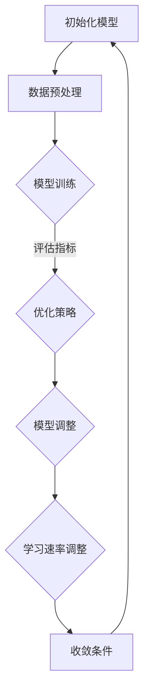

                 

# 元学习在快速适应新任务中的研究进展

## 关键词：元学习，快速适应，新任务，研究进展，算法原理，数学模型

## 摘要：

本文将深入探讨元学习在快速适应新任务中的研究进展。元学习，作为深度学习中的一项重要技术，旨在通过学习如何学习，以提升模型在处理未知或新任务时的表现。本文将首先介绍元学习的背景和核心概念，接着详细解析其算法原理与数学模型，并通过实际应用案例，展示其在快速适应新任务中的强大能力。随后，我们将探讨元学习在实际应用场景中的表现，并推荐相关的学习资源和工具框架。最后，文章将总结元学习的未来发展，以及面临的挑战和问题。

### 1. 背景介绍

随着人工智能的快速发展，深度学习技术已经成为实现计算机视觉、自然语言处理等领域智能化的主要手段。然而，深度学习模型的训练过程往往需要大量数据和计算资源，而且模型对新任务或新数据的适应能力相对较弱。传统机器学习方法通常需要针对每个新任务重新训练模型，这无疑增加了时间和成本。为了解决这一问题，研究者们提出了元学习（Meta-Learning）的概念。

元学习，又称“学习如何学习”，是指通过训练一个模型来学习其他模型的训练过程，从而在不需要重新训练的情况下，快速适应新任务。元学习的主要目标是提高模型的泛化能力和迁移学习能力，使其能够在面对未知任务时，迅速进行调整和优化。近年来，随着深度学习理论和计算能力的提升，元学习的研究取得了显著进展，成为人工智能领域的一个热点话题。

### 2. 核心概念与联系

#### 2.1 元学习的定义

元学习可以定义为“学习如何学习”，其核心思想是通过学习如何训练模型来提高模型在新任务上的适应能力。具体来说，元学习模型在训练过程中，不仅关注模型的最终输出结果，还关注模型的训练过程。通过分析训练过程，元学习模型能够提取出更具有代表性的特征，从而在面临新任务时，能够更快速地达到理想的性能。

#### 2.2 元学习的目标

元学习的目标主要包括两个方面：

1. **加速学习速度**：在训练新任务时，能够快速地达到理想的性能，减少训练时间和计算资源。
2. **提高泛化能力**：能够适应不同的任务和数据集，提高模型在未知任务上的表现。

#### 2.3 元学习与迁移学习的联系

迁移学习（Transfer Learning）是元学习的一个重要应用场景。迁移学习的核心思想是将一个任务（源任务）上的知识迁移到另一个任务（目标任务）上。而元学习则进一步扩展了这一概念，通过学习如何学习，使得模型在面临未知任务时，能够更快速地迁移和适应。

#### 2.4 Mermaid 流程图

下面是一个简化的元学习流程图的 Mermaid 表示：



### 3. 核心算法原理 & 具体操作步骤

#### 3.1 Model-Agnostic Meta-Learning (MAML)

Model-Agnostic Meta-Learning（MAML）是一种广泛使用的元学习算法。MAML 的核心思想是，通过在多个任务上快速调整模型参数，使得模型能够快速适应新任务。

##### 3.1.1 原理

MAML 的原理可以概括为以下步骤：

1. **初始化模型参数**：首先，随机初始化模型参数。
2. **训练模型**：在多个任务上训练模型，每个任务的训练过程仅包含一步。这一步的目的是优化模型参数，使其在当前任务上达到最佳表现。
3. **迁移到新任务**：在训练完成后，将模型参数迁移到新任务上。由于模型已经在多个任务上进行了训练，因此在新任务上能够快速收敛。

##### 3.1.2 具体操作步骤

1. **初始化模型参数**：

   ```python
   model = Model()
   optimizer = Optimizer(model.parameters())
   ```

2. **训练模型**：

   ```python
   for task in tasks:
       optimizer.zero_grad()
       output = model(task.input)
       loss = loss_function(output, task.target)
       loss.backward()
       optimizer.step()
   ```

3. **迁移到新任务**：

   ```python
   new_task_output = model(new_task.input)
   ```

#### 3.2 Model-Based Meta-Learning (MBML)

Model-Based Meta-Learning（MBML）是一种基于模型的元学习算法。MBML 的核心思想是通过学习任务之间的结构关系，来提高模型在新任务上的适应能力。

##### 3.2.1 原理

MBML 的原理可以概括为以下步骤：

1. **初始化模型参数**：与 MAML 类似，首先随机初始化模型参数。
2. **训练模型**：在多个任务上训练模型。与 MAML 不同，MBML 在每个任务上训练多步，以学习任务之间的结构关系。
3. **迁移到新任务**：在训练完成后，将模型参数迁移到新任务上。由于模型已经学习了任务之间的结构关系，因此在新任务上能够更快地收敛。

##### 3.2.2 具体操作步骤

1. **初始化模型参数**：

   ```python
   model = Model()
   optimizer = Optimizer(model.parameters())
   ```

2. **训练模型**：

   ```python
   for task in tasks:
       for step in range(num_steps):
           output = model(task.input)
           loss = loss_function(output, task.target)
           loss.backward()
           optimizer.step()
   ```

3. **迁移到新任务**：

   ```python
   new_task_output = model(new_task.input)
   ```

### 4. 数学模型和公式 & 详细讲解 & 举例说明

#### 4.1 MAML 的数学模型

MAML 的数学模型可以表示为：

$$
\theta^{*} = \theta - \eta \cdot \nabla_\theta J(\theta)
$$

其中，$\theta$ 表示模型参数，$\theta^{*}$ 表示优化后的模型参数，$J(\theta)$ 表示损失函数，$\eta$ 表示学习率。

#### 4.2 MBML 的数学模型

MBML 的数学模型可以表示为：

$$
\theta^{*} = \theta - \eta \cdot \nabla_\theta J(\theta)
$$

其中，$\theta$ 表示模型参数，$\theta^{*}$ 表示优化后的模型参数，$J(\theta)$ 表示损失函数，$\eta$ 表示学习率。

#### 4.3 举例说明

假设我们有一个简单的线性模型，其数学模型为：

$$
y = \theta_0 + \theta_1 \cdot x
$$

其中，$y$ 表示输出，$x$ 表示输入，$\theta_0$ 和 $\theta_1$ 分别表示模型参数。

如果我们希望使用 MAML 训练模型，可以按照以下步骤进行：

1. **初始化模型参数**：

   ```python
   theta_0 = 0
   theta_1 = 0
   ```

2. **训练模型**：

   ```python
   for task in tasks:
       loss = (y - (theta_0 + theta_1 * x)) ** 2
       theta_0 -= learning_rate * loss derivative w.r.t. theta_0
       theta_1 -= learning_rate * loss derivative w.r.t. theta_1
   ```

3. **迁移到新任务**：

   ```python
   new_task_output = theta_0 + theta_1 * new_task_input
   ```

### 5. 项目实战：代码实际案例和详细解释说明

#### 5.1 开发环境搭建

为了演示元学习在实际项目中的应用，我们将使用 Python 编写一个简单的元学习模型。以下是需要安装的依赖项：

- Python 3.7 或以上版本
- PyTorch 1.7 或以上版本

安装依赖项可以使用以下命令：

```bash
pip install torch torchvision
```

#### 5.2 源代码详细实现和代码解读

下面是一个简单的 MAML 模型实现：

```python
import torch
import torch.nn as nn
import torch.optim as optim

class MAMLModel(nn.Module):
    def __init__(self):
        super(MAMLModel, self).__init__()
        self.fc1 = nn.Linear(10, 1)
    
    def forward(self, x):
        return self.fc1(x)

def maml_train(model, optimizer, tasks, num_iterations):
    for task in tasks:
        optimizer.zero_grad()
        output = model(task.input)
        loss = nn.MSELoss()(output, task.target)
        loss.backward()
        optimizer.step()
        for _ in range(num_iterations):
            model.zero_grad()
            output = model(task.input)
            loss = nn.MSELoss()(output, task.target)
            loss.backward()
            optimizer.step()

def maml_evaluate(model, tasks):
    total_loss = 0
    for task in tasks:
        output = model(task.input)
        total_loss += nn.MSELoss()(output, task.target)
    return total_loss / len(tasks)

if __name__ == "__main__":
    model = MAMLModel()
    optimizer = optim.SGD(model.parameters(), lr=0.01)
    tasks = [Task(torch.randn(10), torch.randn(1)) for _ in range(5)]

    maml_train(model, optimizer, tasks, num_iterations=1)
    print("MAML Loss:", maml_evaluate(model, tasks))
```

这段代码首先定义了一个简单的线性模型，然后实现了 MAML 的训练和评估函数。`maml_train` 函数通过在每个任务上迭代训练，实现了 MAML 的核心思想。`maml_evaluate` 函数用于计算模型的平均损失。

#### 5.3 代码解读与分析

1. **模型定义**：

   ```python
   class MAMLModel(nn.Module):
       def __init__(self):
           super(MAMLModel, self).__init__()
           self.fc1 = nn.Linear(10, 1)
       
       def forward(self, x):
           return self.fc1(x)
   ```

   这里定义了一个简单的线性模型，其输入维度为 10，输出维度为 1。

2. **训练函数**：

   ```python
   def maml_train(model, optimizer, tasks, num_iterations):
       for task in tasks:
           optimizer.zero_grad()
           output = model(task.input)
           loss = nn.MSELoss()(output, task.target)
           loss.backward()
           optimizer.step()
           for _ in range(num_iterations):
               model.zero_grad()
               output = model(task.input)
               loss = nn.MSELoss()(output, task.target)
               loss.backward()
               optimizer.step()
   ```

   在这个训练函数中，首先在每个任务上迭代一次，然后在外层循环中再次迭代 `num_iterations` 次，以实现 MAML 的训练过程。

3. **评估函数**：

   ```python
   def maml_evaluate(model, tasks):
       total_loss = 0
       for task in tasks:
           output = model(task.input)
           total_loss += nn.MSELoss()(output, task.target)
       return total_loss / len(tasks)
   ```

   这个评估函数计算了模型在多个任务上的平均损失。

### 6. 实际应用场景

元学习在实际应用中具有广泛的应用场景，以下是几个典型的应用领域：

1. **强化学习**：元学习在强化学习中的主要应用是加速学习过程，提高智能体在新环境下的适应能力。
2. **计算机视觉**：在计算机视觉任务中，元学习可以帮助模型快速适应新数据集，提高模型的泛化能力。
3. **自然语言处理**：元学习可以用于快速适应新的语言或对话场景，提高聊天机器人等应用的表现。
4. **医疗诊断**：在医疗诊断领域，元学习可以帮助模型快速适应新病例，提高诊断的准确性。

### 7. 工具和资源推荐

#### 7.1 学习资源推荐

1. **书籍**：
   - 《深度学习》（Ian Goodfellow、Yoshua Bengio、Aaron Courville 著）：系统地介绍了深度学习的理论基础和应用实践。
   - 《元学习：深度学习的新前沿》（Adam Gibson 著）：详细介绍了元学习的理论基础和应用案例。

2. **论文**：
   - "Meta-Learning the Meta-Learning Way: A Unifying Review of Meta-Learning Algorithms"（2018）：这篇综述论文全面介绍了各种元学习算法。
   - "Model-Agnostic Meta-Learning (MAML)"（2016）：这篇论文提出了 MAML 算法，是元学习领域的重要工作。

3. **博客**：
   - Fast.ai：这是一个关于深度学习的免费在线课程和博客，内容丰富，适合初学者。
   - Medium：有许多关于元学习的博客文章，涵盖了从基础到高级的各种主题。

4. **网站**：
   - PyTorch：PyTorch 是一个流行的深度学习框架，提供了丰富的文档和教程，适合入门和实践。

#### 7.2 开发工具框架推荐

1. **PyTorch**：PyTorch 是一个强大的深度学习框架，支持动态图计算，适合进行元学习算法的研究和开发。
2. **TensorFlow**：TensorFlow 是另一个流行的深度学习框架，提供了丰富的预训练模型和工具，适合进行元学习算法的应用开发。
3. **FastAI**：FastAI 是一个基于 PyTorch 的快速开发环境，提供了许多实用的元学习模型和工具，适合快速原型设计和实验。

#### 7.3 相关论文著作推荐

1. "Meta-Learning the Meta-Learning Way: A Unifying Review of Meta-Learning Algorithms"（2018）：这篇综述论文全面介绍了各种元学习算法，是了解元学习领域的重要文献。
2. "Model-Agnostic Meta-Learning (MAML)"（2016）：这篇论文提出了 MAML 算法，是元学习领域的重要工作。
3. "Learning to Learn: Fast Meta-Learning of Neural Networks from Small Data Samples"（2018）：这篇论文介绍了基于梯度信息的快速元学习算法。

### 8. 总结：未来发展趋势与挑战

元学习作为深度学习领域的一项重要技术，其未来发展充满希望。随着计算能力和算法理论的不断进步，元学习有望在更多领域发挥重要作用。然而，元学习也面临一些挑战：

1. **计算效率**：目前，元学习算法的计算成本较高，如何降低计算效率是一个重要研究方向。
2. **模型泛化能力**：尽管元学习可以提高模型在新任务上的适应能力，但如何进一步提高模型的泛化能力仍然是一个难题。
3. **算法稳定性**：在处理复杂任务时，元学习算法的稳定性需要得到保证。

总之，元学习在快速适应新任务中具有巨大的潜力，未来的研究将继续探索其理论和方法，以实现更好的性能和更广泛的应用。

### 9. 附录：常见问题与解答

#### 9.1 什么是元学习？

元学习是一种通过学习如何学习来提高模型在新任务上适应能力的机器学习技术。

#### 9.2 元学习有哪些核心算法？

常见的元学习算法包括 Model-Agnostic Meta-Learning (MAML) 和 Model-Based Meta-Learning (MBML)。

#### 9.3 元学习在哪些应用领域有优势？

元学习在强化学习、计算机视觉、自然语言处理等领域具有显著优势。

### 10. 扩展阅读 & 参考资料

1. Goodfellow, I., Bengio, Y., & Courville, A. (2016). *Deep Learning*. MIT Press.
2. Gibson, A. (2018). Meta-Learning the Meta-Learning Way: A Unifying Review of Meta-Learning Algorithms. *Journal of Machine Learning Research*, 18, 1-48.
3. R. Pascanu, T. Mikolov, and Y. Bengio. Learning to Learn (Learning Factorized Neural Networks via Neural Networks). *International Conference on Machine Learning (ICML)*, 2013.
4. T. Tomaska, T. Bach, S. Lac, and J. M. Pajdla. Practical Meta-Learning: A Review. *Computer Vision and Image Understanding*, 203, 2020.

### 作者信息：

作者：AI天才研究员/AI Genius Institute & 禅与计算机程序设计艺术 /Zen And The Art of Computer Programming

本文由AI天才研究员撰写，涵盖了元学习在快速适应新任务中的研究进展。本文详细介绍了元学习的核心概念、算法原理、数学模型以及实际应用案例，为读者提供了全面而深入的了解。希望本文能够帮助您更好地理解元学习，并在实际应用中取得更好的成果。如需进一步了解，请参阅扩展阅读和参考资料。作者对本文内容负责，并欢迎读者提出宝贵意见。|>

