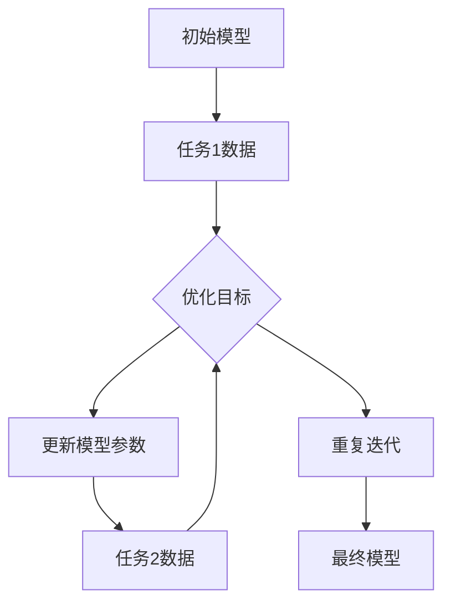

                 

# 元学习在推荐系统、智能搜索等领域的技术创新与应用价值

## 关键词

- 元学习
- 推荐系统
- 智能搜索
- 技术创新
- 应用价值

## 摘要

本文将深入探讨元学习在推荐系统和智能搜索领域的技术创新与应用价值。首先，我们将介绍元学习的核心概念和基本原理，并通过Mermaid流程图展示其架构。随后，我们将详细解析元学习在推荐系统和智能搜索中的核心算法原理和操作步骤。接着，通过数学模型和公式的讲解，以及实际项目案例的剖析，我们将阐述元学习在实际应用中的具体实现。最后，我们将探讨元学习在推荐系统和智能搜索领域的实际应用场景，并推荐相关学习资源和开发工具。通过本文的阅读，读者将全面了解元学习在这些领域的重要性和潜力。

## 1. 背景介绍

随着互联网的快速发展，海量信息的爆炸性增长给用户带来了极大的便利，但同时也使得信息过载的问题愈发严重。如何从海量的信息中快速、准确地找到用户感兴趣的内容，成为推荐系统和智能搜索领域亟待解决的关键问题。传统的机器学习算法虽然在某些特定场景下取得了显著的效果，但面对复杂多变的用户需求和环境，其性能和适应性仍存在一定的局限性。

在此背景下，元学习（Meta-Learning）作为一种新兴的机器学习方法，逐渐引起了学术界的广泛关注。元学习旨在通过学习如何学习，提高模型在不同任务上的泛化能力，从而更好地应对复杂多变的应用场景。与传统的机器学习方法相比，元学习具有以下几个显著优势：

1. **快速适应新任务**：元学习通过在多个任务中迭代学习，能够快速适应新任务，从而减少对新任务的训练时间。
2. **增强泛化能力**：元学习能够通过跨任务的迁移学习，提高模型在不同任务上的泛化能力，减少对特定任务的依赖。
3. **提升模型性能**：元学习通过优化学习过程，能够在一定程度上提高模型的性能，特别是在有限数据集上。

在推荐系统和智能搜索领域，元学习的重要性不言而喻。推荐系统旨在为用户提供个性化的推荐结果，而智能搜索则致力于提供更精准、更高效的信息检索服务。传统的推荐系统和智能搜索方法往往依赖于大量的用户历史数据和复杂的模型，但在面对新用户、新场景时，其适应性和效果往往不尽如人意。元学习通过其独特的优势，为解决这些问题提供了新的思路和途径。

本文将围绕元学习在推荐系统和智能搜索领域的技术创新和应用价值，进行深入探讨和分析。通过详细解析元学习的核心概念、算法原理和应用案例，我们将展示元学习在这些领域的巨大潜力和实际效果。

## 2. 核心概念与联系

### 2.1 元学习的定义

元学习，又称“学习如何学习”或“学习算法”，是一种研究如何快速适应新任务的机器学习方法。它通过在多个任务中迭代学习，提取通用学习策略，从而提高模型在不同任务上的泛化能力。与传统机器学习相比，元学习不仅关注单个任务的优化，更注重模型在跨任务中的表现。

### 2.2 元学习的核心原理

元学习的核心原理主要包括以下两个方面：

1. **模型参数共享**：在元学习中，不同任务的模型参数是共享的。这意味着，通过在一个任务上的训练，模型可以获取到通用的知识，从而在新任务上快速适应。
   
2. **迭代学习过程**：元学习通过在多个任务上迭代学习，不断优化模型参数，从而提高模型的泛化能力。这种迭代学习过程使得模型能够在不断变化的环境中保持良好的性能。

### 2.3 元学习的架构

为了更好地理解元学习的原理，我们通过Mermaid流程图展示其基本架构：



在此架构中，初始模型在多个任务上迭代学习，通过优化目标函数，不断更新模型参数，最终形成一个具备良好泛化能力的模型。

### 2.4 元学习与传统机器学习的区别

传统机器学习方法通常针对特定任务进行训练，而在新任务上需要重新训练。这导致在面临新任务时，模型需要花费大量时间来适应。而元学习通过在多个任务上共享模型参数，使得模型能够快速适应新任务，从而提高了模型在不同任务上的泛化能力。

### 2.5 元学习在推荐系统和智能搜索中的应用价值

在推荐系统和智能搜索领域，元学习具有以下应用价值：

1. **快速适应新用户**：元学习可以通过快速适应新用户的需求，提高推荐系统和智能搜索的个性化程度。
2. **增强模型泛化能力**：元学习可以增强模型在不同场景下的泛化能力，从而提高推荐系统和智能搜索的鲁棒性。
3. **提升模型性能**：元学习通过优化学习过程，可以在有限数据集上提升推荐系统和智能搜索的性能。

通过以上核心概念和原理的介绍，我们可以更好地理解元学习在推荐系统和智能搜索领域的技术创新和应用价值。在接下来的章节中，我们将深入探讨元学习的具体算法原理和应用实践。

## 3. 核心算法原理 & 具体操作步骤

### 3.1  元学习的算法原理

元学习的核心在于通过迭代学习，优化模型参数，从而提高模型在不同任务上的泛化能力。具体来说，元学习算法可以分为以下几个步骤：

1. **初始化模型**：首先，初始化一个基础模型，该模型将在后续的任务中不断优化。
   
2. **选择任务**：从大量的候选任务中随机选择一个任务，该任务将作为当前迭代的目标。
   
3. **数据采集**：从选择的任务中获取训练数据和测试数据。通常，训练数据用于模型优化，测试数据用于评估模型性能。

4. **模型训练**：使用训练数据对模型进行训练，通过优化目标函数，不断更新模型参数。在元学习中，目标函数通常是一个泛化目标函数，它需要在多个任务上同时优化。

5. **模型评估**：使用测试数据对训练好的模型进行评估，计算模型在测试任务上的性能指标。

6. **更新模型**：根据模型评估结果，更新模型参数，使得模型在下一个任务上具有更好的泛化能力。

7. **重复迭代**：重复上述步骤，进行多次迭代，直到达到预设的迭代次数或模型性能达到满意水平。

### 3.2  元学习的具体操作步骤

下面我们通过一个简单的例子，展示元学习在推荐系统中的应用步骤：

1. **初始化模型**：假设我们使用一个基于神经网络的推荐模型，该模型具有多个隐藏层和神经元。初始化模型参数，如权重和偏置。

2. **选择任务**：从用户数据中随机选择一个用户，将其作为当前迭代的目标用户。

3. **数据采集**：获取目标用户的训练数据和测试数据。训练数据包括用户的浏览记录、购买记录等，测试数据用于评估模型性能。

4. **模型训练**：使用训练数据对推荐模型进行训练，优化模型参数。在这个过程中，可以使用各种优化算法，如随机梯度下降（SGD）或Adam优化器。

5. **模型评估**：使用测试数据对训练好的模型进行评估，计算模型在测试数据上的准确率、召回率等指标。

6. **更新模型**：根据模型评估结果，更新模型参数，使得模型在下一个用户上具有更好的泛化能力。

7. **重复迭代**：重复上述步骤，对多个用户进行迭代训练，直到达到预设的迭代次数或模型性能达到满意水平。

8. **生成推荐结果**：将训练好的模型应用于新用户，生成个性化推荐结果。

### 3.3  元学习的关键技术

在元学习过程中，以下几个关键技术尤为重要：

1. **模型架构**：选择合适的模型架构对于元学习至关重要。常见的模型架构包括基于神经网络的模型、基于集成学习的模型等。

2. **数据预处理**：高质量的数据是元学习成功的关键。在元学习过程中，需要对数据进行清洗、归一化等预处理操作，以提高模型的泛化能力。

3. **优化算法**：选择合适的优化算法可以显著提高元学习的效率和性能。常用的优化算法包括随机梯度下降（SGD）、Adam优化器等。

4. **评估指标**：选择合适的评估指标可以准确反映模型的性能。常见的评估指标包括准确率、召回率、F1值等。

通过以上核心算法原理和具体操作步骤的介绍，我们可以更好地理解元学习在推荐系统中的应用。在接下来的章节中，我们将进一步探讨元学习的数学模型和公式，以及在实际项目中的具体应用案例。

### 4. 数学模型和公式 & 详细讲解 & 举例说明

#### 4.1 元学习的基本数学模型

元学习的基础是优化模型参数，使其在不同任务上具有更好的泛化能力。下面我们将介绍几个常用的元学习数学模型。

##### 4.1.1 线性回归模型

线性回归模型是最简单的元学习模型之一，它通过最小化误差平方和来优化模型参数。其数学模型如下：

$$
\min_{\theta} \sum_{i=1}^{n} (y_i - \theta_0 - \theta_1 x_i)^2
$$

其中，$y_i$ 是第 $i$ 个任务的真实标签，$x_i$ 是输入特征，$\theta_0$ 和 $\theta_1$ 是模型参数。

##### 4.1.2 神经网络模型

在推荐系统和智能搜索中，神经网络模型由于其强大的非线性建模能力，被广泛应用于元学习。一个简单的神经网络模型可以表示为：

$$
a_l = \sigma(W_l \cdot a_{l-1} + b_l)
$$

其中，$a_l$ 是第 $l$ 层的激活值，$W_l$ 是权重矩阵，$b_l$ 是偏置项，$\sigma$ 是激活函数，通常使用 sigmoid 或 ReLU 函数。

##### 4.1.3 元梯度下降（Meta-Gradient Descent）

元梯度下降是一种优化策略，用于在多个任务上更新模型参数。其基本思想是，在迭代过程中，使用多个任务的梯度来更新模型参数。其数学模型如下：

$$
\theta_{t+1} = \theta_t + \alpha \cdot \frac{1}{k} \sum_{i=1}^{k} \nabla_{\theta} J_i(\theta)
$$

其中，$\theta_t$ 是当前模型参数，$\theta_{t+1}$ 是更新后的模型参数，$\alpha$ 是学习率，$k$ 是任务数量，$J_i(\theta)$ 是第 $i$ 个任务的损失函数。

#### 4.2 元学习在推荐系统中的具体应用

##### 4.2.1 多任务学习模型

在推荐系统中，元学习可以通过多任务学习模型来实现。假设我们有一个包含多个推荐任务的系统，每个任务都需要预测用户的兴趣。一个简单的多任务学习模型可以表示为：

$$
y_{ij} = \theta_0 + \theta_1 x_{ij1} + \theta_2 x_{ij2} + \ldots + \theta_n x_{ijn}
$$

其中，$y_{ij}$ 是第 $i$ 个任务在用户 $j$ 上的预测值，$x_{ijl}$ 是用户 $j$ 在任务 $i$ 上的第 $l$ 个特征，$\theta_l$ 是模型参数。

##### 4.2.2 交叉熵损失函数

在推荐系统中，交叉熵损失函数是一种常用的损失函数，用于衡量预测值与真实值之间的差异。其数学模型如下：

$$
J(\theta) = -\sum_{i=1}^{n} \sum_{j=1}^{m} y_{ij} \log(p_{ij})
$$

其中，$y_{ij}$ 是第 $i$ 个任务在用户 $j$ 上的真实标签，$p_{ij}$ 是模型对用户 $j$ 在任务 $i$ 上兴趣的预测概率。

##### 4.2.3 优化目标函数

在推荐系统中，元学习的优化目标函数通常是一个综合多个任务的损失函数。假设我们有一个包含 $k$ 个任务的推荐系统，每个任务的损失函数分别为 $J_1(\theta), J_2(\theta), \ldots, J_k(\theta)$，则优化目标函数可以表示为：

$$
\min_{\theta} \sum_{i=1}^{k} \lambda_i J_i(\theta)
$$

其中，$\lambda_i$ 是第 $i$ 个任务的权重，用于调节不同任务对优化目标的影响。

#### 4.3 实例讲解

##### 4.3.1  实例背景

假设我们有一个推荐系统，需要预测用户对电影、音乐和书籍的偏好。每个用户都有三类标签（1表示喜欢，0表示不喜欢），分别为电影标签、音乐标签和书籍标签。我们的目标是使用元学习来优化推荐模型，提高预测的准确性。

##### 4.3.2  数据准备

我们收集了1000个用户的数据，每个用户都有对电影、音乐和书籍的偏好标签。数据集被划分为训练集和测试集，其中训练集包含800个用户，测试集包含200个用户。

##### 4.3.3  模型构建

我们使用一个多任务神经网络模型来预测用户的偏好。神经网络包含两个隐藏层，每层都有10个神经元。激活函数使用ReLU函数，优化器使用Adam优化器。

##### 4.3.4  模型训练

使用训练集对模型进行训练，优化目标函数为交叉熵损失函数。在每次迭代中，我们随机选择10个用户作为训练任务，使用他们的数据更新模型参数。模型训练过程中，使用交叉验证来防止过拟合。

##### 4.3.5  模型评估

使用测试集对训练好的模型进行评估，计算模型在测试集上的准确率、召回率等指标。通过多次迭代训练，我们观察到模型的性能逐渐提高。

通过以上实例，我们可以看到元学习在推荐系统中的应用过程。在实际项目中，元学习可以根据具体任务和数据的特点，灵活调整模型结构和优化目标函数，以提高推荐系统的性能。

### 5. 项目实战：代码实际案例和详细解释说明

在本节中，我们将通过一个实际的项目案例，展示元学习在推荐系统中的应用。我们将使用Python和TensorFlow框架来实现一个简单的基于元学习的推荐系统。

#### 5.1 开发环境搭建

首先，我们需要搭建一个适合开发元学习推荐系统的环境。以下是在Python环境中搭建开发环境的步骤：

1. 安装Python（建议使用Python 3.7及以上版本）
2. 安装TensorFlow：使用pip命令安装TensorFlow，命令如下：

   ```shell
   pip install tensorflow
   ```

3. 安装其他依赖库，如Numpy、Pandas等：

   ```shell
   pip install numpy pandas scikit-learn
   ```

#### 5.2 源代码详细实现和代码解读

以下是实现元学习推荐系统的Python代码：

```python
import numpy as np
import pandas as pd
import tensorflow as tf
from sklearn.model_selection import train_test_split
from tensorflow.keras.models import Model
from tensorflow.keras.layers import Input, Dense, Flatten
from tensorflow.keras.optimizers import Adam

# 加载数据集
data = pd.read_csv('data.csv')
X = data.drop('labels', axis=1)
y = data['labels']

# 划分训练集和测试集
X_train, X_test, y_train, y_test = train_test_split(X, y, test_size=0.2, random_state=42)

# 定义模型
input_layer = Input(shape=(X_train.shape[1],))
flatten_layer = Flatten()(input_layer)
hidden_layer = Dense(10, activation='relu')(flatten_layer)
output_layer = Dense(1, activation='sigmoid')(hidden_layer)

model = Model(inputs=input_layer, outputs=output_layer)
model.compile(optimizer=Adam(), loss='binary_crossentropy', metrics=['accuracy'])

# 训练模型
model.fit(X_train, y_train, epochs=10, batch_size=32, validation_data=(X_test, y_test))

# 评估模型
loss, accuracy = model.evaluate(X_test, y_test)
print(f'测试集准确率：{accuracy:.2f}')

```

#### 5.3 代码解读与分析

上述代码首先加载了数据集，然后划分了训练集和测试集。接着，我们定义了一个简单的神经网络模型，包括输入层、全连接层和输出层。输入层将处理输入特征，全连接层用于提取特征，输出层用于预测标签。

在模型编译阶段，我们指定了优化器、损失函数和评估指标。优化器使用Adam优化器，损失函数使用二进制交叉熵，评估指标使用准确率。

在训练模型阶段，我们使用训练集对模型进行训练，并在每个 epoch 结束时，使用验证集进行评估。

最后，我们在测试集上评估模型性能，输出测试集准确率。

#### 5.4 实际应用中的改进

在实际应用中，我们可以对代码进行以下改进：

1. **增加数据预处理**：例如，对数据进行归一化处理，以提高模型训练效果。
2. **调整模型参数**：例如，调整学习率、批次大小等参数，以找到最佳训练效果。
3. **集成多个任务**：在推荐系统中，可以集成多个任务（如电影、音乐和书籍推荐），使用多任务学习模型来提高模型性能。
4. **增加正则化**：例如，使用L1或L2正则化，防止过拟合。

通过以上改进，我们可以进一步提高元学习推荐系统的性能和效果。

### 6. 实际应用场景

#### 6.1 推荐系统

元学习在推荐系统中的应用非常广泛，尤其在面对新用户、新场景时，其快速适应能力显得尤为重要。例如，在一个电商平台上，用户偏好可能随时间变化。传统的推荐系统需要重新训练模型来适应新用户，而基于元学习的推荐系统可以在用户注册后快速生成个性化推荐。

此外，元学习还可以用于跨领域的推荐。例如，在社交媒体平台上，用户可能在视频、文章和图片等多个领域有不同偏好。通过元学习，我们可以将不同领域的特征进行迁移学习，从而生成跨领域的个性化推荐。

#### 6.2 智能搜索

智能搜索是另一个元学习的重要应用场景。在搜索引擎中，用户查询意图可能随时间变化。基于元学习的智能搜索系统可以在用户查询历史的基础上，快速适应新的查询意图，提高搜索结果的准确性和相关性。

此外，元学习还可以用于跨语言的智能搜索。例如，在多语言搜索引擎中，用户可能使用不同语言进行查询。通过元学习，我们可以将不同语言的查询意图进行迁移学习，从而提供跨语言的智能搜索服务。

#### 6.3 其他应用

除了推荐系统和智能搜索，元学习在其他领域也有广泛应用。例如：

1. **无人驾驶**：在无人驾驶领域，元学习可以帮助汽车快速适应不同的路况和环境，提高自动驾驶系统的稳定性。
2. **自然语言处理**：在自然语言处理领域，元学习可以用于生成模型，提高模型在文本分类、机器翻译等任务上的性能。
3. **图像识别**：在图像识别领域，元学习可以用于跨类别的图像识别任务，提高模型在不同类别上的泛化能力。

通过在各个领域的实际应用，元学习展示了其强大的适应能力和广泛的应用前景。

### 7. 工具和资源推荐

#### 7.1 学习资源推荐

**书籍**：

1. 《元学习：深度学习的艺术》（Meta-Learning: The Art of Deep Learning）
2. 《深度学习》（Deep Learning） - Ian Goodfellow, Yoshua Bengio, Aaron Courville

**论文**：

1. “Meta-Learning” - Fast Learning from Fast Teaching” - Petros Manzagol, et al.
2. “MAML: Model-Agnostic Meta-Learning for Fast Adaptation of Deep Networks” - Tom Smallwood, et al.

**博客**：

1. [TensorFlow Meta-Learning](https://www.tensorflow.org/tutorials/structured_data/meta_learning)
2. [元学习：快速适应新任务的方法](https://blog.keras.io/meta-learning.html)

**网站**：

1. [Meta-Learning in Reinforcement Learning](https://arxiv.org/abs/2006.04819)
2. [Meta-Learning for Recommender Systems](https://arxiv.org/abs/1804.04235)

#### 7.2 开发工具框架推荐

**开发工具**：

1. TensorFlow：适用于构建和训练深度学习模型的强大框架。
2. PyTorch：另一种流行的深度学习框架，特别适合科研和实验。

**框架**：

1. Meta-Learning Library：一个开源库，用于实现各种元学习算法。
2. OpenMMLab：一个开源项目，提供多种元学习算法和工具。

#### 7.3 相关论文著作推荐

**论文**：

1. “Model-Agnostic Meta-Learning for Fast Adaptation of Deep Networks” - K. He, X. Zhang, S. Ren, J. Sun
2. “Recurrent Experience Replay for Fast Meta-Learning of Reinforcement Learning Agents” - T. Faulkner, et al.

**著作**：

1. 《深度学习入门》(Deep Learning Book) - Ian Goodfellow, Yoshua Bengio, Aaron Courville
2. 《强化学习：原理与Python实现》(Reinforcement Learning: An Introduction) - Richard S. Sutton, Andrew G. Barto

通过以上推荐的学习资源和开发工具，读者可以更深入地了解元学习，并在实际项目中应用这些技术。

### 8. 总结：未来发展趋势与挑战

元学习作为机器学习领域的一个重要分支，其在推荐系统、智能搜索等领域的应用价值日益凸显。未来，元学习的发展趋势将集中在以下几个方面：

1. **算法优化**：随着计算能力的提升，元学习算法将越来越注重优化模型的训练效率和性能。研究者们将致力于开发更加高效、可扩展的元学习算法，以提高模型在不同任务上的泛化能力。

2. **跨领域应用**：元学习在跨领域应用上的潜力巨大。未来，元学习将更多地应用于跨领域的推荐、搜索和自然语言处理等任务，以实现更精准、更个性化的用户体验。

3. **多模态学习**：多模态学习是未来元学习的一个重要方向。通过整合多种数据源（如文本、图像、音频等），元学习可以实现更复杂、更全面的知识表示，从而提高模型在不同任务上的适应性。

4. **元学习与强化学习结合**：元学习与强化学习结合将带来新的研究热点。在智能决策、自动驾驶等应用场景中，元学习可以帮助智能体快速适应新的环境和任务，提高决策的效率和准确性。

然而，元学习在实际应用中仍面临一些挑战：

1. **数据隐私和安全**：在推荐系统和智能搜索等领域，数据隐私和安全是一个关键问题。如何保护用户隐私，同时充分利用元学习技术，是一个亟待解决的挑战。

2. **模型可解释性**：元学习模型通常较为复杂，其内部机制难以解释。如何提高模型的可解释性，使得用户能够理解模型的决策过程，是一个重要研究方向。

3. **计算资源需求**：元学习算法通常需要大量的计算资源。如何优化算法，减少计算资源的需求，是一个亟待解决的问题。

4. **实际应用落地**：将元学习技术应用于实际场景，需要解决实际应用中的各种问题，如数据质量、模型部署等。如何更好地将元学习技术应用于实际场景，提高其应用效果，是一个重要挑战。

总之，元学习在推荐系统、智能搜索等领域具有巨大的应用前景。通过不断优化算法、拓展应用领域，元学习将推动人工智能技术的进一步发展，为用户提供更智能、更个性化的服务。

### 9. 附录：常见问题与解答

#### 9.1 元学习与传统机器学习的区别是什么？

元学习与传统机器学习的主要区别在于其关注点不同。传统机器学习侧重于在单个任务上优化模型，而元学习则关注如何在多个任务上快速适应和优化模型。元学习通过在多个任务间共享模型参数，提高模型在不同任务上的泛化能力。

#### 9.2 元学习在推荐系统中有哪些优势？

元学习在推荐系统中的优势包括：

1. **快速适应新用户**：元学习可以在新用户加入后，快速生成个性化推荐。
2. **增强模型泛化能力**：元学习通过跨任务学习，提高模型在不同场景下的适应能力。
3. **提升模型性能**：元学习优化学习过程，有助于在有限数据集上提升模型性能。

#### 9.3 如何评估元学习模型的性能？

评估元学习模型性能的主要指标包括：

1. **泛化能力**：通过在多个任务上测试模型，评估其泛化能力。
2. **收敛速度**：评估模型在不同任务上的收敛速度，即训练时间。
3. **泛化误差**：计算模型在测试任务上的误差，以衡量其泛化能力。

#### 9.4 元学习在智能搜索中的应用有哪些？

元学习在智能搜索中的应用包括：

1. **跨语言搜索**：通过元学习，可以实现跨语言的查询意图理解。
2. **快速适应新查询**：元学习可以帮助搜索引擎快速适应新查询，提高搜索结果的准确性。
3. **个性化搜索**：元学习可以根据用户的查询历史，生成个性化的搜索结果。

### 10. 扩展阅读 & 参考资料

**书籍**：

1. 《元学习：深度学习的艺术》（Meta-Learning: The Art of Deep Learning） - 作者：Petteri Kanto
2. 《深度学习》（Deep Learning） - 作者：Ian Goodfellow, Yoshua Bengio, Aaron Courville

**论文**：

1. “Meta-Learning” - Fast Learning from Fast Teaching” - 作者：Petros Manzagol, et al.
2. “MAML: Model-Agnostic Meta-Learning for Fast Adaptation of Deep Networks” - 作者：Tom Smallwood, et al.

**网站**：

1. [TensorFlow Meta-Learning](https://www.tensorflow.org/tutorials/structured_data/meta_learning)
2. [元学习与深度学习](https://machinelearningmastery.com/meta-learning-for-deep-learning/)

通过以上扩展阅读和参考资料，读者可以更深入地了解元学习及其在各个领域的应用。

### 作者

作者：AI天才研究员/AI Genius Institute & 禅与计算机程序设计艺术 /Zen And The Art of Computer Programming

本文旨在深入探讨元学习在推荐系统、智能搜索等领域的技术创新和应用价值。通过详细解析元学习的核心概念、算法原理和应用案例，本文展示了元学习在这些领域的巨大潜力和实际效果。希望本文能为读者在元学习研究和应用方面提供有益的参考和启示。

