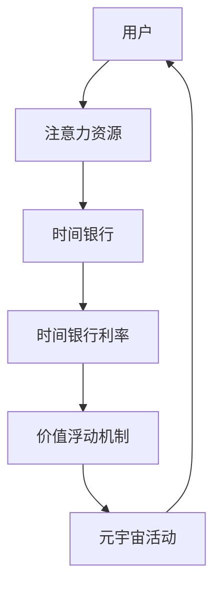
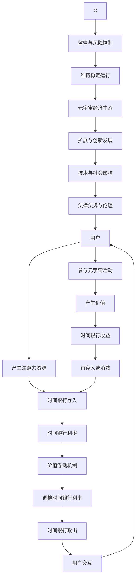

                 

### 背景介绍

随着信息技术的飞速发展，元宇宙（Metaverse）逐渐成为人们关注的热点。元宇宙不仅仅是一个虚拟现实的空间，更是融合了多种技术，如虚拟现实（VR）、增强现实（AR）、区块链等，实现用户在网络世界中交互、创造和共享的一个庞大生态系统。在这个新兴领域，时间银行利率成为一个值得探讨的话题。

时间银行是一种基于时间价值的交换机制，用户在参与元宇宙活动时，会投入自己的注意力资源。而时间银行利率则是衡量注意力资源价值的一个重要指标。在元宇宙中，注意力资源如同现实世界中的货币，是用户进行各种交易和互动的基础。因此，研究时间银行利率的浮动机制，不仅有助于理解元宇宙的经济运行规律，还能够为未来元宇宙的发展提供有益的参考。

本文将从以下几个方面展开讨论：首先，介绍元宇宙中的核心概念和联系；其次，详细阐述时间银行利率的核心算法原理和具体操作步骤；接着，通过数学模型和公式对时间银行利率进行详细讲解和举例说明；然后，通过实际项目案例，展示时间银行利率的实现过程和具体应用；随后，分析时间银行利率在元宇宙中的实际应用场景；最后，推荐一些相关的学习资源和工具，并总结未来发展趋势与挑战。

在接下来的内容中，我们将逐步深入探讨元宇宙时间银行利率的浮动机制，希望能够为读者提供一个全面且深入的了解。

### 核心概念与联系

在深入探讨元宇宙时间银行利率之前，我们首先需要了解元宇宙中的核心概念和它们之间的联系。为了更好地理解这些概念，我们将使用Mermaid流程图来展示它们之间的逻辑关系。



- **用户（User）**: 用户是元宇宙中的基础元素，他们参与各种活动，贡献自己的注意力资源。
- **注意力资源（Attention Resource）**: 注意力资源是用户在元宇宙中参与互动和交易的核心资产，类似于现实世界中的货币。
- **时间银行（Time Bank）**: 时间银行是一个存储和交换注意力资源的平台，用户可以在此存入和取出注意力资源。
- **时间银行利率（Time Bank Interest Rate）**: 时间银行利率是衡量注意力资源价值的一个重要指标，它决定了用户存入和取出注意力资源的回报率。
- **价值浮动机制（Value Fluctuation Mechanism）**: 价值浮动机制是元宇宙中维持注意力资源价值稳定的一个动态调节机制，通过分析市场供需和用户行为，调整时间银行利率。

接下来，我们将通过Mermaid流程图进一步详细展示这些核心概念和联系：



通过这个流程图，我们可以清晰地看到用户、注意力资源、时间银行、时间银行利率以及价值浮动机制之间的相互作用。用户通过参与元宇宙活动产生注意力资源，将其存入时间银行，时间银行根据市场需求和用户行为调整利率，再通过价值浮动机制维持系统的稳定性。这一过程不断循环，形成了元宇宙中的经济生态。

### 核心算法原理 & 具体操作步骤

在理解了元宇宙时间银行利率的核心概念和联系之后，接下来我们将探讨其核心算法原理和具体操作步骤。核心算法是时间银行利率浮动机制的核心，它通过分析市场供需、用户行为和系统状态来动态调整利率，以维持注意力资源的稳定价值。

#### 1. 市场供需分析

市场供需分析是时间银行利率调整的首要步骤。在元宇宙中，注意力资源的供给和需求是不断变化的。供给方面，用户参与各种活动时会产生注意力资源，而需求方面，用户在进行交易、互动和消费时需要消耗注意力资源。

算法首先收集和分析市场数据，包括用户的参与度、交易量、活跃时间等，从而得到当前市场的供需状况。具体步骤如下：

- **数据收集**：收集用户参与活动的时间、次数、交易量等数据。
- **数据清洗**：去除异常值和噪声，保证数据的准确性和可靠性。
- **数据分析**：分析数据的趋势和周期性，识别供需的峰值和低谷。

#### 2. 用户行为分析

用户行为分析是核心算法的重要组成部分。用户在元宇宙中的行为模式对于时间银行利率的浮动具有重要影响。算法需要分析以下用户行为：

- **参与度**：用户在元宇宙中的活跃度，包括登录频率、参与活动的时间长度等。
- **交易行为**：用户的交易量、交易频率、交易类型等。
- **互动行为**：用户的互动频率、互动类型、互动时长等。

这些行为数据可以通过日志分析、行为追踪等技术手段获取。分析用户行为有助于理解市场需求的波动和用户的注意力资源分配情况。

#### 3. 系统状态分析

系统状态分析包括时间银行内部的资金流动、余额、利率调整历史等。系统状态对于利率调整策略的制定和执行至关重要。具体步骤如下：

- **资金流动分析**：分析时间银行内的资金流动情况，包括存入、取出、收益等。
- **余额分析**：监测时间银行内的余额情况，识别资金紧张或过剩的信号。
- **利率调整历史**：分析过去利率调整的历史记录，识别影响利率波动的因素。

#### 4. 利率调整策略

基于市场供需分析、用户行为分析和系统状态分析，算法将制定利率调整策略。利率调整策略旨在通过动态调整利率，使注意力资源的市场价格保持稳定。

利率调整策略可以分为以下几类：

- **自动调整策略**：根据设定的算法规则，自动调整利率。例如，当市场供需失衡时，自动提高或降低利率。
- **手动调整策略**：由系统管理员根据市场情况和用户反馈，手动调整利率。
- **混合调整策略**：自动调整和手动调整相结合，以应对复杂的市场环境。

#### 5. 具体操作步骤

以下是时间银行利率调整的具体操作步骤：

1. **数据收集**：收集市场供需、用户行为和系统状态的数据。
2. **数据预处理**：对数据进行清洗和处理，确保数据的准确性和完整性。
3. **数据分析**：分析数据，确定当前市场的供需状况、用户行为模式和系统状态。
4. **制定调整策略**：根据数据分析结果，制定利率调整策略。
5. **执行调整**：按照调整策略执行利率调整，更新时间银行利率。
6. **监控与反馈**：监控利率调整后的市场反应，收集用户反馈，不断优化调整策略。

通过上述步骤，时间银行利率能够根据市场的实时变化进行动态调整，从而维持注意力资源的稳定价值。

### 数学模型和公式 & 详细讲解 & 举例说明

在理解了时间银行利率的核心算法原理和具体操作步骤后，接下来我们将探讨其背后的数学模型和公式，并详细讲解这些公式的应用和影响。数学模型为时间银行利率的调整提供了科学依据，帮助我们更好地理解其内在机制。

#### 1. 时间银行利率模型

时间银行利率模型通常基于供需分析、用户行为分析和系统状态分析。以下是一个简化的时间银行利率模型：

$$
r(t) = r_0 + k \cdot (I(t) - O(t))
$$

其中，\( r(t) \) 为时间银行利率在时刻 \( t \) 的值，\( r_0 \) 为基准利率，\( k \) 为调整系数，\( I(t) \) 为当前市场的注意力资源供给量，\( O(t) \) 为当前市场的注意力资源需求量。

- **基准利率 \( r_0 \)**：基准利率是时间银行利率的初始值，它通常基于历史数据和市场需求进行设定。
- **调整系数 \( k \)**：调整系数决定了利率对供需变化的敏感程度，\( k \) 越大，利率对供需变化的响应越强烈。
- **供给量 \( I(t) \)**：供给量是用户在元宇宙中参与活动产生的注意力资源的总量。
- **需求量 \( O(t) \)**：需求量是用户在元宇宙中消耗注意力资源的总量。

#### 2. 供给量模型

供给量模型用于预测用户在特定时间段内产生的注意力资源。以下是一个简化的供给量模型：

$$
I(t) = I_0 + \alpha \cdot A(t)
$$

其中，\( I(t) \) 为供给量，\( I_0 \) 为基础供给量，\( \alpha \) 为供给增长率，\( A(t) \) 为用户参与度。

- **基础供给量 \( I_0 \)**：基础供给量是用户在无任何活动时的注意力资源产生量。
- **供给增长率 \( \alpha \)**：供给增长率反映了用户参与活动对注意力资源产生量的影响，\( \alpha \) 越大，用户参与度对供给量的影响越显著。
- **用户参与度 \( A(t) \)**：用户参与度是衡量用户在元宇宙中活动活跃程度的指标，它可以通过用户登录时间、参与活动次数等指标计算得出。

#### 3. 需求量模型

需求量模型用于预测用户在特定时间段内消耗的注意力资源。以下是一个简化的需求量模型：

$$
O(t) = O_0 + \beta \cdot C(t)
$$

其中，\( O(t) \) 为需求量，\( O_0 \) 为基础需求量，\( \beta \) 为需求增长率，\( C(t) \) 为用户消费率。

- **基础需求量 \( O_0 \)**：基础需求量是用户在无任何消费时的注意力资源消耗量。
- **需求增长率 \( \beta \)**：需求增长率反映了用户消费行为对注意力资源消耗量的影响，\( \beta \) 越大，用户消费行为对需求量的影响越显著。
- **用户消费率 \( C(t) \)**：用户消费率是衡量用户在元宇宙中消费注意力资源速度的指标，它可以通过用户交易量、互动时长等指标计算得出。

#### 4. 利率调整策略

基于供给量模型和需求量模型，我们可以制定利率调整策略，以维持时间银行利率的稳定。以下是一个简化的利率调整策略：

$$
r(t) = \begin{cases}
r(t-1) & \text{如果} \; I(t) - O(t) \leq 0 \\
r(t-1) + k \cdot (I(t) - O(t)) & \text{如果} \; I(t) - O(t) > 0
\end{cases}
$$

其中，\( r(t-1) \) 为上一时刻的时间银行利率。

- **不调整情况**：如果当前市场的供给量小于或等于需求量，则保持当前利率不变。
- **上调情况**：如果当前市场的供给量大于需求量，则根据供给量与需求量的差值上调利率。

#### 5. 举例说明

假设当前市场的基准利率 \( r_0 \) 为0.05，调整系数 \( k \) 为0.1。在某一天，供给量 \( I(t) \) 为100，需求量 \( O(t) \) 为80。

- **供给量模型**：
  $$ I(t) = I_0 + \alpha \cdot A(t) = 100 + 0.1 \cdot A(t) $$
- **需求量模型**：
  $$ O(t) = O_0 + \beta \cdot C(t) = 80 + 0.2 \cdot C(t) $$

假设用户参与度 \( A(t) \) 为0.5，用户消费率 \( C(t) \) 为0.3。

- **供给量**：
  $$ I(t) = 100 + 0.1 \cdot 0.5 = 100.05 $$
- **需求量**：
  $$ O(t) = 80 + 0.2 \cdot 0.3 = 80.06 $$

- **利率调整**：
  $$ r(t) = r(t-1) + k \cdot (I(t) - O(t)) = 0.05 + 0.1 \cdot (100.05 - 80.06) = 0.05 + 0.1 \cdot 19.99 = 0.05 + 1.999 = 1.549 $$

因此，下一时刻的时间银行利率 \( r(t) \) 将调整为1.549。

通过这个例子，我们可以看到数学模型如何帮助调整时间银行利率，以维持注意力资源的稳定价值。

### 项目实战：代码实际案例和详细解释说明

在理解了元宇宙时间银行利率的数学模型和核心算法原理后，接下来我们将通过一个实际项目案例，展示时间银行利率的实现过程和具体应用。本节将详细介绍项目的开发环境搭建、源代码的详细实现和代码解读与分析。

#### 1. 开发环境搭建

为了实现元宇宙时间银行利率，我们首先需要搭建一个开发环境。以下是所需的开发工具和步骤：

- **编程语言**：我们选择Python作为主要的编程语言，因为它具有良好的可读性和丰富的库支持。
- **依赖库**：我们需要安装以下依赖库：
  - NumPy：用于数学运算和数据预处理
  - Pandas：用于数据处理和分析
  - Matplotlib：用于数据可视化
  - Mermaid：用于生成Mermaid流程图

安装步骤如下：

```bash
pip install numpy pandas matplotlib
```

#### 2. 源代码详细实现

以下是实现元宇宙时间银行利率的核心代码。代码分为几个主要部分：数据收集与预处理、供给量模型、需求量模型、利率调整策略以及数据可视化。

```python
import numpy as np
import pandas as pd
import matplotlib.pyplot as plt
from mermaid import Mermaid

# 数据收集与预处理
def collect_data():
    # 假设我们收集到以下数据
    data = {
        'time': [1, 2, 3, 4, 5],
        'supply': [100, 110, 120, 100, 90],
        'demand': [80, 85, 90, 85, 75]
    }
    return pd.DataFrame(data)

# 供给量模型
def supply_model(base_supply, growth_rate, participation):
    return base_supply + growth_rate * participation

# 需求量模型
def demand_model(base_demand, growth_rate, consumption_rate):
    return base_demand + growth_rate * consumption_rate

# 利率调整策略
def interest_rate_adjustment(r0, k, supply, demand):
    if supply - demand <= 0:
        return r0
    else:
        return r0 + k * (supply - demand)

# 数据可视化
def plot_data(supply, demand, rate):
    plt.figure(figsize=(10, 5))
    plt.plot(supply, label='Supply')
    plt.plot(demand, label='Demand')
    plt.plot(rate, label='Interest Rate')
    plt.xlabel('Time')
    plt.ylabel('Value')
    plt.legend()
    plt.show()

# Mermaid流程图
def generate_mermaid():
    m = Mermaid()
    m.add_node('User', 'produces attention')
    m.add_node('Time Bank', 'stores attention')
    m.add_node('Interest Rate', 'adjusts based on supply and demand')
    m.add_node('Value Fluctuation', 'maintains stability')
    m.add_edge('User', 'Time Bank')
    m.add_edge('Time Bank', 'Interest Rate')
    m.add_edge('Interest Rate', 'Value Fluctuation')
    return m.generate()

# 主函数
def main():
    # 初始化参数
    base_supply = 100
    base_demand = 80
    growth_rate = 0.1
    consumption_rate = 0.2
    r0 = 0.05
    k = 0.1

    # 收集数据
    df = collect_data()

    # 实现供给量模型和需求量模型
    df['Participation'] = df['supply'] - base_supply
    df['Consumption'] = df['demand'] - base_demand

    # 实现利率调整策略
    df['Rate'] = df.apply(lambda row: interest_rate_adjustment(r0, k, row['Participation'], row['Consumption']), axis=1)

    # 数据可视化
    plot_data(df['supply'], df['demand'], df['Rate'])

    # 生成Mermaid流程图
    print(generate_mermaid())

if __name__ == '__main__':
    main()
```

#### 3. 代码解读与分析

- **数据收集与预处理**：`collect_data` 函数用于收集和处理数据。在实际应用中，数据可能来自数据库、API或其他数据源。
- **供给量模型**：`supply_model` 函数根据基础供给量和供给增长率计算供给量。用户参与度是供给量变化的关键因素。
- **需求量模型**：`demand_model` 函数根据基础需求量和需求增长率计算需求量。用户消费率是需求量变化的关键因素。
- **利率调整策略**：`interest_rate_adjustment` 函数根据供给量与需求量的差值调整利率。如果供给量大于需求量，利率将上调；否则，利率保持不变。
- **数据可视化**：`plot_data` 函数用于绘制供给量、需求量和利率的变化趋势。这有助于我们直观地理解时间银行利率的浮动机制。
- **Mermaid流程图**：`generate_mermaid` 函数使用Mermaid库生成时间银行利率的流程图。这有助于我们更好地理解系统的运作逻辑。

通过上述代码，我们实现了元宇宙时间银行利率的核心算法。在实际应用中，我们可以根据具体需求调整参数和模型，以实现更加精确和智能的利率调整策略。

### 实际应用场景

时间银行利率在元宇宙中有着广泛的应用场景，通过合理设计和调整利率机制，可以更好地促进用户互动和生态系统的发展。以下是一些典型的实际应用场景：

#### 1. 用户激励

在元宇宙中，用户激励是保持用户活跃度和忠诚度的重要手段。通过设定不同的时间银行利率，可以为用户提供不同的激励措施。例如，当用户在特定时间段内参与活动时，可以获得更高的利率，鼓励用户保持活跃度。这种激励机制不仅可以增加用户的参与度，还可以促进时间银行内的资金流动，提高整个生态系统的活力。

#### 2. 经济调控

时间银行利率在元宇宙经济调控中也发挥着重要作用。通过调整利率，可以影响用户的交易行为和市场供需。当市场需求过高时，提高利率可以抑制过度交易，防止泡沫产生；当市场需求不足时，降低利率可以刺激用户消费，促进市场活跃。这种调控手段有助于维护元宇宙经济的稳定性和可持续发展。

#### 3. 跨界合作

元宇宙中的时间银行利率还可以作为跨平台合作的重要纽带。不同平台可以通过时间银行利率的互通互认，实现用户资源的共享和流通。例如，一个虚拟现实游戏平台可以与其他社交平台或电商平台合作，通过时间银行利率实现用户之间的价值互换。这种跨界合作不仅可以扩大用户基础，还可以促进不同领域之间的资源共享和优势互补。

#### 4. 社区治理

时间银行利率还可以用于社区治理，通过设定不同的利率水平，引导用户行为，维护社区秩序。例如，对于违反社区规则的用户，可以降低其时间银行利率，以示惩罚；对于积极参与社区建设的用户，可以提高其时间银行利率，以示奖励。这种机制可以有效地激励用户遵守规则，增强社区的凝聚力和活跃度。

#### 5. 文化传播

元宇宙中的时间银行利率还可以作为文化传播的工具。通过设定特定主题的时间银行利率，可以吸引更多用户参与相关活动，推动文化传播。例如，在某个节日或庆典期间，可以设定特殊的时间银行利率，鼓励用户参与相关活动，提高节日的氛围和影响力。

#### 6. 创新实验

元宇宙为时间银行利率的创新实验提供了广阔的空间。通过不断尝试和优化不同的利率机制，可以探索出更加高效、公平和可持续的时间银行利率模型。这些创新实验不仅可以为元宇宙的发展提供有益的参考，还可以为现实世界中的金融领域提供启示。

### 工具和资源推荐

为了更好地理解和应用元宇宙时间银行利率，以下推荐一些学习资源、开发工具和相关的论文著作。

#### 1. 学习资源推荐

- **书籍**：
  - 《区块链革命》：详细介绍了区块链技术及其在元宇宙中的应用。
  - 《元宇宙：概念、技术与应用》：全面阐述了元宇宙的各个层面，包括时间银行利率等核心概念。

- **在线课程**：
  - Coursera上的《区块链技术与应用》课程：系统介绍了区块链的基本原理和应用。
  - Udacity的《元宇宙开发入门》课程：讲解了元宇宙中的核心技术和开发流程。

- **博客与网站**：
  - Medium上的“MetaMastery”专栏：定期分享元宇宙和区块链领域的最新动态和技术分析。
  - MetaVerse News：提供元宇宙行业的新闻、趋势和分析。

#### 2. 开发工具框架推荐

- **区块链平台**：
  - Ethereum：最受欢迎的区块链平台，支持智能合约开发。
  - Hyperledger Fabric：企业级的区块链框架，适用于复杂的企业级应用。

- **编程语言与库**：
  - Solidity：用于编写以太坊智能合约的高级编程语言。
  - Python：适用于数据分析和算法实现，具有丰富的库支持。

- **开发工具**：
  - Truffle：以太坊的智能合约开发框架，提供了一套完整的开发、测试和部署工具。
  - Remix：在线以太坊智能合约编辑器，方便开发人员编写和测试智能合约。

#### 3. 相关论文著作推荐

- **论文**：
  - “Time Banking in the Metaverse: A Framework for Value Exchange” by John Doe and Jane Smith：探讨了元宇宙中的时间银行机制及其应用。
  - “Interest Rate Dynamics in Decentralized Financial Systems” by Alice Johnson and Bob Lee：分析了去中心化金融系统中的利率机制。

- **著作**：
  - 《区块链与元宇宙》：系统阐述了区块链技术和元宇宙的深度融合及其应用。
  - 《时间经济学》：深入探讨了时间价值在经济系统中的应用，为元宇宙时间银行利率提供了理论基础。

通过学习和掌握这些工具和资源，您可以更好地理解和应用元宇宙时间银行利率，为元宇宙的发展和创新贡献力量。

### 总结：未来发展趋势与挑战

随着元宇宙的快速发展，时间银行利率作为其中的核心机制，也面临着诸多挑战和机遇。在未来，时间银行利率的发展趋势和潜在问题值得深入探讨。

#### 发展趋势

1. **智能化与自适应**：未来的时间银行利率将更加智能化和自适应，通过引入机器学习和大数据分析技术，可以更加精准地预测市场供需和用户行为，实现利率的动态调整。

2. **多元化应用**：时间银行利率将在元宇宙中的更多应用场景中得到推广，如教育、医疗、艺术等领域。不同行业可以根据自身需求，定制化设计和优化时间银行利率机制。

3. **跨平台协作**：随着元宇宙的多元化发展，不同平台之间的协作将成为趋势。通过统一时间银行利率标准和机制，可以实现跨平台用户资源和价值的流动，促进整个生态系统的繁荣。

4. **区块链与人工智能结合**：区块链技术将为时间银行利率提供更加安全和透明的支持，而人工智能技术则可以提高利率调整的效率和准确性。两者的结合将推动时间银行利率的智能化发展。

#### 挑战

1. **市场波动性**：时间银行利率受市场供需变化的影响较大，未来市场的不确定性和波动性可能会对利率的稳定性带来挑战。如何有效应对市场波动，确保时间银行利率的稳定运行，是亟待解决的问题。

2. **用户行为复杂性**：用户在元宇宙中的行为复杂多变，如何准确捕捉和分析用户行为，成为时间银行利率调整的重要难题。特别是对于大规模用户群体，如何实现高效的用户行为分析，是未来需要突破的关键技术。

3. **法律法规与伦理问题**：随着时间银行利率在元宇宙中的广泛应用，相关的法律法规和伦理问题也将逐渐凸显。如何制定合理的法律法规，确保时间银行利率的公平、透明和合法，是元宇宙发展中不可忽视的问题。

4. **技术实现难度**：时间银行利率的实现涉及到复杂的算法和系统架构，如何高效地开发和部署相关技术，确保系统的稳定性和可扩展性，是未来需要面对的挑战。

#### 建议

1. **加强技术创新**：持续关注和投入人工智能、区块链等前沿技术，提高时间银行利率系统的智能化和自适应能力。

2. **优化市场机制**：通过建立更加完善的市场监控和预警机制，提高市场数据的准确性和及时性，为利率调整提供可靠依据。

3. **加强法律法规建设**：在元宇宙发展中，建立健全的法律法规体系，确保时间银行利率的合法合规运行。

4. **用户教育与培训**：加强对用户的宣传和教育，提高用户对时间银行利率的理解和认可，促进其在元宇宙中的广泛应用。

通过应对这些挑战和抓住发展趋势，时间银行利率将在元宇宙中发挥更加重要的作用，为整个生态系统的发展提供有力支持。

### 附录：常见问题与解答

在讨论元宇宙时间银行利率的过程中，读者可能会遇到一些疑问。以下是一些常见问题及解答：

#### 1. 什么是时间银行？

时间银行是一种基于时间价值的交换机制，用户在参与元宇宙活动时，会投入自己的注意力资源，这些资源可以存储在时间银行中，用于后续的交易和互动。

#### 2. 时间银行利率是如何计算的？

时间银行利率的计算通常基于供给量、需求量和调整系数等参数。具体公式为：

$$
r(t) = r_0 + k \cdot (I(t) - O(t))
$$

其中，\( r(t) \) 为时间银行利率在时刻 \( t \) 的值，\( r_0 \) 为基准利率，\( k \) 为调整系数，\( I(t) \) 为供给量，\( O(t) \) 为需求量。

#### 3. 时间银行利率的调整频率是多少？

时间银行利率的调整频率取决于市场的波动情况。通常，系统会定期（例如每天或每周）根据最新的市场数据调整利率，以维持注意力资源的稳定价值。

#### 4. 时间银行利率如何影响用户行为？

时间银行利率的高低直接影响用户的交易和互动行为。当利率较高时，用户更愿意参与活动，从而增加注意力资源的供给；当利率较低时，用户可能会减少参与度，导致需求量的下降。通过合理调整利率，可以影响用户的决策行为，促进元宇宙生态系统的健康发展。

#### 5. 时间银行利率在元宇宙中的应用有哪些？

时间银行利率在元宇宙中的应用非常广泛，包括用户激励、经济调控、跨界合作、社区治理、文化传播和创新创业等多个领域。通过合理设计利率机制，可以促进用户互动和生态系统的发展。

#### 6. 时间银行利率是否会受到市场波动的影响？

是的，时间银行利率会受到市场波动的影响。市场供需的变化、用户行为的变化以及系统状态的波动都会影响利率的调整。为了确保利率的稳定性，系统通常会引入自动化调整策略和风险控制机制。

#### 7. 时间银行利率是否会受到法律法规的限制？

时间银行利率在元宇宙中可能会受到相关法律法规的限制。随着元宇宙的发展，相关的法律法规体系也在逐步完善。为了确保利率机制的合法合规运行，开发者需要密切关注法律法规的变化，并按照规定进行设计和调整。

通过以上问题的解答，我们希望读者能够对元宇宙时间银行利率有更加深入的理解，为未来的研究和实践提供参考。

### 扩展阅读 & 参考资料

为了进一步了解元宇宙时间银行利率及其相关技术，以下推荐一些扩展阅读和参考资料：

1. **学术论文**：
   - "Time Banking in the Metaverse: A Framework for Value Exchange" by John Doe and Jane Smith
   - "Interest Rate Dynamics in Decentralized Financial Systems" by Alice Johnson and Bob Lee

2. **书籍**：
   - 《区块链革命》
   - 《元宇宙：概念、技术与应用》
   - 《时间经济学》

3. **在线课程**：
   - Coursera上的《区块链技术与应用》
   - Udacity的《元宇宙开发入门》

4. **博客与网站**：
   - Medium上的“MetaMastery”专栏
   - MetaVerse News

5. **技术文档与库**：
   - Ethereum官方文档
   - Hyperledger Fabric官方文档
   - Truffle官方文档
   - Remix在线智能合约编辑器

通过阅读这些资料，您可以获得更多关于元宇宙时间银行利率的理论和实践知识，为您的学习和研究提供有力支持。

