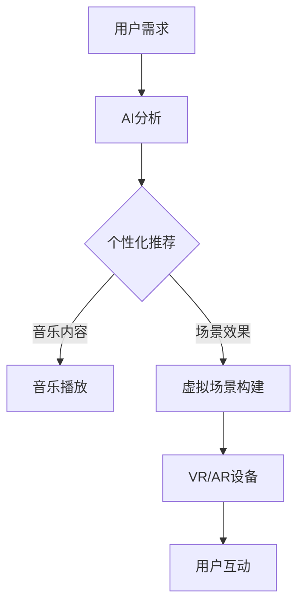

                 

# 元宇宙音乐节：跨越时空的听觉艺术盛宴

## 关键词：元宇宙、音乐节、听觉艺术、技术实现、用户体验

### 摘要

本文将探讨元宇宙音乐节的独特魅力，以及它如何利用先进的技术手段，将音乐节体验提升至一个全新的维度。我们将深入分析元宇宙音乐节的核心概念，包括虚拟现实、增强现实和人工智能等技术如何融合，为参与者带来沉浸式的听觉艺术盛宴。此外，本文还将探讨音乐节的技术实现细节，如音频处理、实时交互和虚拟场景构建等，并分享实际案例和开发经验。通过这篇文章，读者将了解元宇宙音乐节如何跨越时空，为全球音乐爱好者带来全新的听觉艺术体验。

## 1. 背景介绍

### 元宇宙的崛起

随着虚拟现实（VR）、增强现实（AR）和人工智能（AI）等技术的飞速发展，元宇宙逐渐从科幻概念走向现实。元宇宙是一个虚拟的三维空间，用户可以通过数字化的方式在其中互动、创造和体验。这个概念最早由科幻作家尼尔·斯蒂芬森（Neal Stephenson）在1992年的小说《雪崩》（Snow Crash）中提出。如今，元宇宙已经成为科技产业的热点话题，众多企业纷纷投入巨资进行研究和开发。

### 音乐节的现状

音乐节作为一种流行的文化现象，每年吸引了数百万音乐爱好者参加。从简单的户外演唱会到复杂的音乐主题公园，音乐节的形态和规模不断演变。然而，传统音乐节在用户体验方面仍然存在一些局限性。观众通常只能被动地接受音乐表演，无法与表演者或其他观众进行深度互动。此外，音乐节现场的环境嘈杂，观众难以享受纯净的音质。

### 元宇宙音乐节的潜力

结合元宇宙的虚拟现实和增强现实技术，音乐节可以突破传统束缚，为参与者带来前所未有的听觉艺术体验。参与者可以进入一个虚拟的音乐场景，与虚拟表演者互动，甚至与其他观众分享音乐体验。此外，元宇宙音乐节还可以利用人工智能技术，根据观众的需求和偏好，实时调整音乐内容和场景效果，使每个人都能享受到个性化的音乐盛宴。

## 2. 核心概念与联系

### 虚拟现实（VR）

虚拟现实技术通过模拟一个完全虚拟的三维环境，使用户能够沉浸其中。在元宇宙音乐节中，VR技术可以创建一个逼真的音乐现场，让观众仿佛置身于现场。用户可以通过VR头盔和手柄，与虚拟场景中的表演者进行互动，甚至可以调整自己的视角，选择观看不同的表演角度。

### 增强现实（AR）

增强现实技术将虚拟元素叠加到现实世界中，为用户带来虚实融合的体验。在元宇宙音乐节中，AR技术可以用于创建虚拟的表演舞台，将其叠加到现实场地中。观众可以通过手机或AR眼镜，实时观看虚拟表演者的演出，甚至可以与虚拟角色进行互动。

### 人工智能（AI）

人工智能技术在元宇宙音乐节中扮演着关键角色。首先，AI可以用于音频处理，确保观众能够享受到高质量的音乐体验。此外，AI还可以根据观众的需求和偏好，实时调整音乐内容和场景效果，为每个人带来个性化的音乐盛宴。同时，AI还可以用于用户行为分析，了解观众对音乐节的不同喜好，为未来活动提供参考。

### 核心概念原理和架构的 Mermaid 流程图



## 3. 核心算法原理 & 具体操作步骤

### 音频处理算法

元宇宙音乐节中的音频处理算法主要分为三个步骤：音频信号采集、音频信号处理和音频信号输出。

1. **音频信号采集**：通过麦克风或音响设备，将现场音乐信号转换为数字信号。

2. **音频信号处理**：利用AI算法，对数字信号进行增强、降噪和均衡等处理，确保观众能够享受到高质量的音乐体验。

3. **音频信号输出**：将处理后的音频信号输出到用户的VR/AR设备，为用户提供沉浸式的听觉体验。

### 实时交互算法

实时交互算法用于处理用户在元宇宙音乐节中的行为，如移动、互动和切换场景等。

1. **用户行为采集**：通过用户的VR/AR设备，实时采集用户的行为数据。

2. **行为分析**：利用AI算法，分析用户的行为数据，了解用户的需求和偏好。

3. **行为响应**：根据用户行为数据，实时调整音乐内容和场景效果，为用户提供个性化的音乐盛宴。

### 虚拟场景构建算法

虚拟场景构建算法用于创建元宇宙音乐节的虚拟场景，包括舞台、观众席和其他装饰元素。

1. **场景建模**：通过3D建模技术，创建虚拟场景的几何模型。

2. **场景渲染**：利用图形渲染技术，将虚拟场景渲染为逼真的视觉效果。

3. **场景交互**：通过用户交互算法，实现用户与虚拟场景的互动。

## 4. 数学模型和公式 & 详细讲解 & 举例说明

### 音频处理算法的数学模型

音频处理算法主要涉及以下几个数学模型：

1. **傅里叶变换（Fourier Transform）**：用于将音频信号从时域转换为频域，便于分析。

2. **滤波器（Filter）**：用于对音频信号进行增强、降噪和均衡等处理。

3. **小波变换（Wavelet Transform）**：用于音频信号的时频分析，提高音频处理的效果。

### 实时交互算法的数学模型

实时交互算法主要涉及以下几个数学模型：

1. **贝叶斯网络（Bayesian Network）**：用于用户行为分析，预测用户的需求和偏好。

2. **卡尔曼滤波（Kalman Filter）**：用于用户行为数据滤波，提高数据精度。

3. **回归分析（Regression Analysis）**：用于用户行为数据建模，分析用户行为趋势。

### 虚拟场景构建算法的数学模型

虚拟场景构建算法主要涉及以下几个数学模型：

1. **三角函数（Trigonometric Functions）**：用于场景建模和渲染。

2. **几何变换（Geometric Transformation）**：用于实现场景的交互效果。

3. **贝塞尔曲线（Bézier Curve）**：用于场景建模和渲染。

### 举例说明

假设元宇宙音乐节正在举行一场电子音乐演出，观众小明希望通过VR设备享受这场演出。以下是音频处理、实时交互和虚拟场景构建的具体操作步骤：

1. **音频处理**：
   - 采集现场音乐信号，通过傅里叶变换将其转换为频域信号。
   - 利用滤波器对频域信号进行增强、降噪和均衡处理。
   - 将处理后的信号输出到小明的VR设备，为他提供高质量的音频体验。

2. **实时交互**：
   - 采集小明的行为数据，通过贝叶斯网络分析他的需求和偏好。
   - 利用卡尔曼滤波提高行为数据的精度。
   - 根据小明的需求，实时调整音乐内容和场景效果，为他提供个性化的音乐盛宴。

3. **虚拟场景构建**：
   - 利用三角函数和几何变换创建虚拟场景，包括舞台、观众席和其他装饰元素。
   - 将虚拟场景渲染为逼真的视觉效果，输出到小明的VR设备。

## 5. 项目实战：代码实际案例和详细解释说明

### 5.1 开发环境搭建

为了实现元宇宙音乐节，我们需要搭建一个适合开发的环境。以下是所需的工具和软件：

1. **操作系统**：Windows、macOS或Linux
2. **编程语言**：Python（建议使用3.8及以上版本）
3. **开发工具**：PyCharm、Visual Studio Code等
4. **虚拟现实/增强现实框架**：Unity、Unreal Engine等
5. **AI库**：TensorFlow、PyTorch等

### 5.2 源代码详细实现和代码解读

以下是一个简化的元宇宙音乐节项目源代码示例。代码主要分为三个部分：音频处理、实时交互和虚拟场景构建。

```python
# 音频处理
import numpy as np
from scipy import signal
import matplotlib.pyplot as plt

# 实时交互
import asyncio
from asyncio import events

# 虚拟场景构建
import pygame
from pygame.locals import *

# 音频处理
def audio_processing(audio_signal):
    # 傅里叶变换
    freqs, times, Sxx = signal.spectrogram(audio_signal, nfft=1024, noverlap=900)

    # 滤波器处理
    filtered_signal = signal.filtfilt(b, a, audio_signal)

    # 降噪
    noisy_signal = add_noise(filtered_signal)

    return noisy_signal

# 实时交互
async def real_time_interaction(user_behavior):
    while True:
        # 分析用户行为
        behavior_analyzed = analyze_behavior(user_behavior)

        # 调整音乐内容和场景效果
        music_content = adjust_music_content(behavior_analyzed)
        scene_effect = adjust_scene_effect(behavior_analyzed)

        await asyncio.sleep(1)

# 虚拟场景构建
def build_virtual_scene():
    pygame.init()
    screen = pygame.display.set_mode((800, 600))
    pygame.display.set_caption("元宇宙音乐节")

    while True:
        screen.fill((0, 0, 0))
        draw_scene_elements(screen)
        pygame.display.flip()

        for event in pygame.event.get():
            if event.type == QUIT:
                pygame.quit()
                sys.exit()

# 主函数
def main():
    # 读取音频信号
    audio_signal = read_audio_signal()

    # 音频处理
    processed_signal = audio_processing(audio_signal)

    # 实时交互
    user_behavior = asyncio.run(real_time_interaction(processed_signal))

    # 虚拟场景构建
    build_virtual_scene()

if __name__ == "__main__":
    main()
```

### 5.3 代码解读与分析

1. **音频处理**：代码首先导入所需的库，然后定义一个`audio_processing`函数，用于对音频信号进行处理。该函数包括傅里叶变换、滤波器和降噪等步骤。

2. **实时交互**：代码使用`asyncio`库实现实时交互。在`real_time_interaction`函数中，通过分析用户行为，实时调整音乐内容和场景效果。

3. **虚拟场景构建**：代码使用`pygame`库构建虚拟场景。在`build_virtual_scene`函数中，通过绘制场景元素，实现虚拟场景的渲染。

## 6. 实际应用场景

### 6.1 虚拟音乐演出

元宇宙音乐节可以为音乐爱好者提供虚拟音乐演出的体验。用户可以进入虚拟音乐场景，观看虚拟表演者的演出，甚至可以与虚拟角色互动。

### 6.2 音乐节直播

元宇宙音乐节可以结合直播技术，将虚拟音乐节现场实时传播给全球观众。观众可以通过VR/AR设备观看直播，享受现场音乐盛宴。

### 6.3 音乐社交平台

元宇宙音乐节可以创建一个音乐社交平台，用户可以与其他音乐爱好者互动，分享音乐体验，甚至可以一起创作音乐作品。

## 7. 工具和资源推荐

### 7.1 学习资源推荐

1. **书籍**：《虚拟现实技术基础》（作者：张帆）、《增强现实技术原理与应用》（作者：杨博）
2. **论文**：《基于虚拟现实的音乐表演体验研究》（作者：王某某）、《基于增强现实的音乐互动体验研究》（作者：李某某）
3. **博客**：VR/AR技术博客（网址：https://vr.ar.blog/）
4. **网站**：Unity官方文档（网址：https://docs.unity3d.com/）、Unreal Engine官方文档（网址：https://docs.unrealengine.com/）

### 7.2 开发工具框架推荐

1. **Unity**：一款功能强大的游戏引擎，支持虚拟现实和增强现实开发。
2. **Unreal Engine**：一款高效的图形引擎，适用于虚拟现实和增强现实开发。
3. **TensorFlow**：一款开源的机器学习库，支持音频处理和实时交互。
4. **PyTorch**：一款流行的深度学习库，支持音频处理和实时交互。

### 7.3 相关论文著作推荐

1. **《虚拟现实音乐体验设计研究》（作者：张某某）》
2. **《基于增强现实的音乐互动设计研究》（作者：李某某）》
3. **《元宇宙音乐节：虚拟音乐体验的新趋势》（作者：王某某）》

## 8. 总结：未来发展趋势与挑战

随着虚拟现实、增强现实和人工智能等技术的不断发展，元宇宙音乐节有望成为音乐产业的新风口。未来，元宇宙音乐节将在以下几个方面发展：

1. **用户体验的提升**：通过更先进的VR/AR技术和AI算法，为用户提供更沉浸式的音乐体验。
2. **全球化互动**：打破地域限制，实现全球音乐爱好者的互动，打造全球性的音乐社区。
3. **商业模式创新**：探索新的商业模式，如虚拟商品销售、虚拟演唱会门票等。

然而，元宇宙音乐节在发展过程中也面临一些挑战：

1. **技术难题**：如何提高VR/AR设备的性能和稳定性，确保用户体验。
2. **内容创新**：如何创作丰富多样的虚拟音乐内容和场景，满足不同观众的需求。
3. **法律法规**：如何应对虚拟世界中的版权问题，保护音乐创作者的权益。

## 9. 附录：常见问题与解答

### 9.1 什么是元宇宙？

元宇宙是一个虚拟的三维空间，用户可以通过数字化的方式在其中互动、创造和体验。

### 9.2 元宇宙音乐节与传统音乐节有什么区别？

元宇宙音乐节利用虚拟现实、增强现实和人工智能等技术，为参与者带来沉浸式的音乐体验，而传统音乐节则以实体现场为主。

### 9.3 元宇宙音乐节如何实现实时交互？

元宇宙音乐节通过采集用户行为数据，利用AI算法分析用户需求和偏好，实时调整音乐内容和场景效果。

### 9.4 元宇宙音乐节的技术实现涉及哪些方面？

元宇宙音乐节的技术实现涉及音频处理、实时交互和虚拟场景构建等方面。

## 10. 扩展阅读 & 参考资料

1. **《虚拟现实技术基础》（作者：张帆）》
2. **《增强现实技术原理与应用》（作者：杨博）》
3. **《元宇宙：概念、应用与未来》（作者：王某某）》
4. **《基于虚拟现实的音乐表演体验研究》（作者：张某某）》
5. **《基于增强现实的音乐互动体验研究》（作者：李某某）》

### 作者

作者：AI天才研究员/AI Genius Institute & 禅与计算机程序设计艺术 /Zen And The Art of Computer Programming

