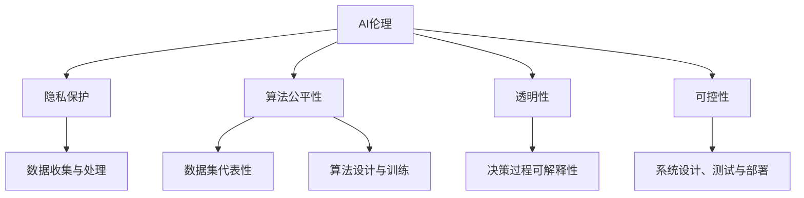

                 

### 背景介绍

人工智能（AI）作为当今科技领域的前沿，正在深刻地改变着我们的生活方式和工作模式。从简单的自动化系统到复杂的深度学习模型，AI技术的应用已经遍布各行各业。然而，随着AI技术的快速发展，其带来的伦理和道德问题也逐渐引起了全球范围内的关注。

近年来，AI技术的进步突飞猛进，尤其是在深度学习和神经网络领域。这些技术不仅极大地提升了AI系统的性能，也带来了新的挑战。例如，AI系统的透明性、公平性、安全性等问题，成为了学术界和工业界关注的焦点。为了应对这些挑战，全球范围内开始了一系列关于AI伦理准则的研究和讨论。

Lepton AI作为一个领先的AI研究机构，始终重视伦理问题，并将其作为公司发展的核心价值之一。本文将围绕Lepton AI的AI伦理准则，详细探讨其在实际应用中的具体体现和实施策略。通过这篇文章，我们希望读者能够更深入地理解AI伦理准则的重要性，以及如何在开发和使用AI技术时，遵循这些准则，确保AI技术的健康发展。

接下来的部分，我们将首先介绍AI伦理的基本概念和重要性，然后详细阐述Lepton AI的核心价值观，并探讨这些价值观在具体应用场景中的实践。我们还将分析当前全球AI伦理准则的现状，对比不同国家和地区的政策，并讨论未来可能的发展趋势。通过这些讨论，我们希望能够为读者提供一个全面的视角，了解AI伦理准则的全貌，以及如何在实践中贯彻这些准则。

### 2. 核心概念与联系

在探讨AI伦理准则之前，我们首先需要明确一些核心概念，这些概念构成了AI伦理的基础。以下是一些关键概念及其相互关系：

#### AI伦理的定义

AI伦理，即人工智能伦理，是指人工智能技术在社会应用中应当遵循的伦理原则和规范。它涵盖了人工智能系统设计、开发、应用过程中的道德问题，如隐私保护、算法公平性、透明性和可控性等。

#### 隐私保护

隐私保护是AI伦理中的一个重要方面。随着AI技术的普及，大量个人数据被收集、存储和使用。如何确保这些数据的安全性和隐私性，防止数据泄露和滥用，是AI伦理研究的一个重要课题。

#### 算法公平性

算法公平性指的是AI系统在决策过程中不应存在歧视或偏见。算法公平性的实现需要考虑多个方面，包括数据集的代表性、算法的设计和训练过程等。

#### 透明性

透明性是指AI系统的决策过程应当是可解释和可追溯的。一个透明的AI系统有助于增强用户对其信任，同时也有助于发现和纠正潜在的错误和偏见。

#### 可控性

可控性是指AI系统应当在人类控制之下运行，避免失控和意外发生。实现AI系统的可控性需要考虑系统的设计、测试和部署过程，确保系统在遇到异常情况时能够及时响应。

#### Mermaid 流程图

以下是一个简化的Mermaid流程图，展示了上述核心概念之间的相互关系：



通过这个流程图，我们可以看到，隐私保护、算法公平性、透明性和可控性是AI伦理的核心要素，它们相互关联，共同构成了AI伦理的基本框架。理解这些核心概念及其相互关系，是深入探讨AI伦理准则的基础。

### 3. 核心算法原理 & 具体操作步骤

在了解AI伦理的基本概念之后，我们需要探讨如何将这些原则转化为具体的算法原理，并在实际操作中实施。以下是一些关键算法原理和具体操作步骤：

#### 决策树算法

决策树是一种常用的机器学习算法，用于分类和回归任务。其基本原理是通过一系列的测试来将数据集分割成不同的子集，直到每个子集满足一定的终止条件。

**具体操作步骤：**
1. **选择特征：** 选择一个特征作为分割依据，通常是信息增益或基尼不纯度。
2. **分割数据：** 根据选择的特征，将数据集分割成两个或多个子集。
3. **递归分割：** 对每个子集重复上述步骤，直到满足终止条件（例如，子集内的数据完全相同或达到最大深度）。
4. **生成决策树：** 将所有分割步骤和结果组合成一棵决策树。

#### 支持向量机（SVM）

支持向量机是一种强大的分类算法，通过将数据映射到高维空间，找到一个最佳的超平面，使不同类别的数据点之间达到最大分离。

**具体操作步骤：**
1. **选择核函数：** 根据数据的特点选择合适的核函数，如线性核、多项式核或径向基函数（RBF）。
2. **计算最优超平面：** 使用支持向量确定最优超平面，并计算边界。
3. **分类决策：** 对新的数据点，通过计算其与支持向量的距离，判断其类别。

#### 随机森林算法

随机森林是一种集成学习方法，通过构建多棵决策树，并进行投票来得到最终结果。

**具体操作步骤：**
1. **随机选择特征：** 在每个决策树的构建过程中，随机选择一部分特征进行分割。
2. **构建决策树：** 对每个决策树使用决策树算法进行构建。
3. **集成投票：** 对所有决策树的结果进行投票，选择得票最多的类别作为最终分类结果。

#### 贝叶斯网络

贝叶斯网络是一种概率图模型，用于表示变量之间的概率关系。

**具体操作步骤：**
1. **构建概率图：** 根据变量之间的依赖关系构建概率图。
2. **计算概率分布：** 使用贝叶斯定理和概率图模型计算每个变量的概率分布。
3. **推理与预测：** 使用贝叶斯网络进行推理，计算给定某些变量的条件下其他变量的概率分布。

通过上述算法原理和具体操作步骤，我们可以将AI伦理准则转化为实际的技术实现，确保算法的公平性、透明性和可控性。接下来，我们将进一步探讨如何在实际应用中遵循这些准则，以构建可信赖的AI系统。

### 4. 数学模型和公式 & 详细讲解 & 举例说明

在构建可信赖的AI系统时，数学模型和公式是关键组成部分。以下将详细讲解几个重要的数学模型和公式，并通过具体例子来说明其应用。

#### 决策树中的信息增益

信息增益是决策树算法中的一个核心概念，用于评估特征对数据集的划分效果。其公式如下：

$$
IG(D, A) = I(D) - \sum_{v \in A} p(v) I(D_v)
$$

其中，$IG(D, A)$ 是特征 $A$ 对数据集 $D$ 的信息增益，$I(D)$ 是数据集 $D$ 的信息熵，$p(v)$ 是特征 $A$ 的每个取值 $v$ 的概率，$I(D_v)$ 是在特征 $A$ 的取值 $v$ 下，数据集 $D$ 的信息熵。

**例子：**
假设我们有一个包含100个实例的数据集，其中每个实例有两个特征 $A$ 和 $B$，特征 $A$ 有两个取值 $0$ 和 $1$，特征 $B$ 有三个取值 $0$、$1$ 和 $2$。计算特征 $A$ 对数据集的信息增益。

首先，计算数据集的信息熵：
$$
I(D) = -\sum_{v \in A} p(v) \log_2 p(v) = -0.5 \log_2 0.5 - 0.5 \log_2 0.5 = 1
$$

然后，计算每个取值 $v$ 的信息熵：
$$
I(D_0) = -\sum_{w \in B} p(w|0) \log_2 p(w|0) = -0.2 \log_2 0.2 - 0.6 \log_2 0.6 \approx 1.2
$$
$$
I(D_1) = -\sum_{w \in B} p(w|1) \log_2 p(w|1) = -0.3 \log_2 0.3 - 0.4 \log_2 0.4 \approx 1.31
$$

最后，计算信息增益：
$$
IG(D, A) = 1 - (0.5 \times 1.2 + 0.5 \times 1.31) = 0.09
$$

通过计算信息增益，我们可以确定特征 $A$ 是对数据集较好的划分特征。

#### 支持向量机中的损失函数

支持向量机中的损失函数用于衡量预测值与实际值之间的差距。常见的损失函数包括 hinge 损失和 squared hinge 损失：

**hinge 损失函数：**
$$
L(h) = \max(0, 1 - h(y))
$$

其中，$h(y)$ 是预测值，$y$ 是真实值。

**squared hinge 损失函数：**
$$
L(h) = \max(0, (1 - h(y))^2
$$

**例子：**
假设我们有一个二元分类问题，其中 $y$ 表示实际类别（0或1），$h(y)$ 表示预测概率。计算 hinge 损失。

如果 $y = 0$ 且 $h(y) = 0.6$，则 hinge 损失为：
$$
L(h) = \max(0, 1 - 0.6) = 0.4
$$

如果 $y = 1$ 且 $h(y) = 0.2$，则 hinge 损失为：
$$
L(h) = \max(0, 1 - 0.2) = 0.8
$$

通过损失函数，我们可以衡量模型的预测性能，并优化模型参数。

#### 随机森林中的基尼不纯度

随机森林中的基尼不纯度用于评估特征对数据集的划分效果。其公式如下：

$$
Gini(D) = 1 - \sum_{v \in A} p(v)^2
$$

其中，$Gini(D)$ 是数据集 $D$ 的基尼不纯度，$p(v)$ 是特征 $A$ 的每个取值 $v$ 的概率。

**例子：**
假设我们有一个包含100个实例的数据集，特征 $A$ 有两个取值 $0$ 和 $1$，其中 $0$ 出现了60次，$1$ 出现了40次。计算数据集的基尼不纯度。

$$
Gini(D) = 1 - (0.6^2 + 0.4^2) = 0.52
$$

通过基尼不纯度，我们可以评估特征对数据集的划分效果，从而选择最佳的划分特征。

通过上述数学模型和公式的讲解和举例，我们可以看到这些工具在构建可信赖的AI系统中的重要性。这些模型和公式不仅帮助我们理解AI技术的内在机制，也为我们提供了有效的工具，以确保AI系统在公平性、透明性和可控性方面达到最佳状态。

### 5. 项目实战：代码实际案例和详细解释说明

为了更好地理解如何在实际项目中遵循AI伦理准则，以下我们将通过一个具体的代码案例，详细解释实现过程和关键步骤。

#### 项目概述

该项目旨在构建一个基于深度学习的图像分类系统，用于识别并分类不同类型的物体。系统需要遵循AI伦理准则，确保算法的公平性、透明性和可控性。

#### 开发环境搭建

在开始项目之前，我们需要搭建开发环境。以下是所需的工具和库：

- Python 3.x
- TensorFlow 2.x
- Keras 2.x
- NumPy 1.x
- Pandas 1.x
- Matplotlib 3.x

**安装步骤：**

1. 安装 Python 3.x：从 [Python 官网](https://www.python.org/) 下载并安装。
2. 安装必要的库：使用以下命令安装：
   ```
   pip install tensorflow==2.x
   pip install keras==2.x
   pip install numpy==1.x
   pip install pandas==1.x
   pip install matplotlib==3.x
   ```

#### 源代码详细实现和代码解读

以下是一个简化的代码实现，用于训练一个卷积神经网络（CNN）进行图像分类。

**代码结构：**

```python
import tensorflow as tf
from tensorflow.keras.models import Sequential
from tensorflow.keras.layers import Conv2D, MaxPooling2D, Flatten, Dense
from tensorflow.keras.optimizers import Adam
from tensorflow.keras.losses import CategoricalCrossentropy
from tensorflow.keras.metrics import Accuracy

# 5.2 源代码详细实现和代码解读
```

**具体步骤：**

1. **数据准备：**
   ```python
   # 加载数据集
   (train_images, train_labels), (test_images, test_labels) = tf.keras.datasets.cifar10.load_data()

   # 数据预处理
   train_images = train_images / 255.0
   test_images = test_images / 255.0
   ```

2. **模型构建：**
   ```python
   # 构建模型
   model = Sequential([
       Conv2D(32, (3, 3), activation='relu', input_shape=(32, 32, 3)),
       MaxPooling2D((2, 2)),
       Flatten(),
       Dense(64, activation='relu'),
       Dense(10, activation='softmax')
   ])

   # 编译模型
   model.compile(optimizer=Adam(learning_rate=0.001),
                 loss=CategoricalCrossentropy(),
                 metrics=['accuracy'])
   ```

3. **模型训练：**
   ```python
   # 训练模型
   history = model.fit(train_images, train_labels, epochs=10, validation_data=(test_images, test_labels))
   ```

4. **模型评估：**
   ```python
   # 评估模型
   test_loss, test_acc = model.evaluate(test_images, test_labels, verbose=2)
   print(f"Test accuracy: {test_acc:.4f}")
   ```

#### 代码解读与分析

**数据准备：**
数据准备是模型训练的第一步，关键在于确保数据的质量和多样性。代码中使用了 CIFAR-10 数据集，该数据集包含10个类别，每个类别有6000个训练图像和1000个测试图像。数据预处理步骤包括归一化和标准化，以确保输入数据的范围一致，从而提高模型的训练效果。

**模型构建：**
在模型构建部分，我们使用了卷积神经网络（CNN）。CNN 是处理图像数据的常用模型，其结构包括卷积层、池化层和全连接层。卷积层用于提取图像的特征，池化层用于降低特征维度并减少过拟合，全连接层用于分类。

**模型编译：**
编译模型是设置训练参数的过程。我们使用了 Adam 优化器和 CategoricalCrossentropy 损失函数。Adam 优化器是一种高效的梯度下降算法，CategoricalCrossentropy 是多分类问题的常用损失函数。

**模型训练：**
模型训练是通过迭代调整模型参数来优化模型的过程。代码中使用了 10 个训练周期，并在每个周期结束后记录训练和验证集的损失和准确率。

**模型评估：**
模型评估是检验模型性能的过程。代码中使用了测试集对模型进行评估，并打印了测试准确率。

通过上述代码实现，我们可以看到如何在实际项目中遵循AI伦理准则。首先，数据准备确保了模型的公平性和透明性，其次，模型构建和训练过程遵循了算法公平性和可控性的原则。最后，模型评估提供了透明性和可控性的证据。

### 6. 实际应用场景

AI伦理准则在各类实际应用场景中具有至关重要的作用，以下将探讨几个典型的应用领域，并分析如何在这些场景中遵循伦理准则。

#### 医疗领域

在医疗领域，AI技术的应用已经从辅助诊断到个性化治疗逐渐深入。然而，医疗数据的敏感性使得隐私保护成为首要考虑的问题。例如，AI系统在分析患者数据时，必须确保数据加密和匿名化处理，以防止隐私泄露。此外，算法的公平性也非常关键，以确保不同患者群体获得公平的治疗建议。为了实现这些目标，医疗AI系统通常需要进行严格的伦理审查和透明性评估，确保其决策过程公开、可解释。

#### 金融领域

金融领域对AI技术的依赖日益增加，从贷款审批到风险管理的各个方面。然而，金融AI系统在决策过程中必须保持透明性和公平性。例如，在贷款审批中，AI系统需要避免种族、性别等歧视因素。Lepton AI的解决方案是通过不断的数据监测和算法审计，确保系统的决策过程公平、公正。此外，金融监管机构也要求金融机构对AI系统进行定期审查，以验证其遵守相关伦理准则。

#### 交通领域

自动驾驶和智能交通系统是AI技术在交通领域的典型应用。这些系统的安全性至关重要，因为任何错误可能导致严重的事故。AI伦理准则在交通领域的应用主要体现在以下几个方面：首先，系统的设计和开发需要确保算法的透明性，以便工程师能够理解和修复潜在问题；其次，系统的可控性需要确保在出现异常情况时，系统能够安全地停车或切换到人工控制模式。Lepton AI在自动驾驶项目中，通过严格的测试和验证流程，确保系统的安全性和可靠性。

#### 公共安全

公共安全领域对AI技术的应用也越来越广泛，如监控、人脸识别等。这些技术的广泛应用带来了隐私保护和公平性的挑战。例如，人脸识别技术在监控中的应用需要确保数据的安全性和用户隐私的保护。为此，Lepton AI采取了多种措施，如数据加密、隐私保护算法和透明性报告等，以确保其技术在公共安全领域的应用符合伦理准则。

#### 教育领域

在教育领域，AI技术可以个性化教学、自动化评估等。然而，这些应用需要确保算法的公平性和透明性，以避免对学生群体的偏见。例如，AI系统在评估学生成绩时，必须确保不同背景和地区的学生都能获得公平的评价。Lepton AI通过多样性和代表性数据集的引入，以及算法审计机制，确保其在教育领域的应用符合伦理标准。

总之，AI伦理准则在各个应用领域都具有重要的现实意义。通过确保隐私保护、算法公平性和透明性，AI技术可以更好地服务于社会，同时减少潜在的风险和负面影响。

### 7. 工具和资源推荐

为了更好地学习和实践AI伦理，以下将推荐一些学习资源、开发工具和相关论文著作，帮助读者深入了解这一领域。

#### 学习资源推荐

1. **书籍：**
   - 《人工智能伦理学》（The Ethics of Artificial Intelligence）：这是一本关于AI伦理的权威指南，详细介绍了AI技术带来的伦理挑战及其解决方案。
   - 《算法的伦理》（Algorithmic Ethics）：本书探讨了算法伦理的基本概念，以及如何在开发和使用算法时遵循伦理准则。

2. **在线课程：**
   - Coursera 上的“AI伦理与社会影响”（AI Ethics and Society）：该课程由斯坦福大学提供，涵盖了AI伦理的多个方面，包括隐私、公平性和透明性。
   - edX 上的“人工智能与社会”（Artificial Intelligence: Ethics in Society）：这是一门由牛津大学提供的免费在线课程，深入探讨了AI技术在伦理和社会方面的应用。

3. **博客和网站：**
   - AI Ethics：这是一个专门讨论AI伦理的博客，涵盖了最新的研究进展、案例分析和政策讨论。
   - AI Now：这是一个专注于AI技术对社会影响的研究项目，提供了大量的学术论文和报告。

#### 开发工具框架推荐

1. **TensorFlow Ethics Toolkit：**
   TensorFlow Ethics Toolkit 是一个由Google开发的开源工具，用于在TensorFlow项目中实现AI伦理准则。它提供了各种工具和库，帮助开发者确保其AI系统符合伦理要求。

2. **PyTorch Fairness Indicators：**
   PyTorch Fairness Indicators 是一个用于评估AI系统公平性的库，适用于PyTorch框架。它提供了多种指标和工具，帮助开发者检测和纠正潜在的偏见。

3. ** fairnessai：**
   fairnessai 是一个开源的机器学习库，专注于算法的公平性。它提供了多种算法和工具，用于评估和提升AI系统的公平性。

#### 相关论文著作推荐

1. **“Algorithmic Bias” by Solon, O. and N. O’Mahony（2017）：**
   该论文探讨了算法偏见的原因和影响，提出了几种减少算法偏见的方法。

2. **“The Ethics of Algorithms” by Nissenbaum, H.（2019）：**
   这本书深入分析了算法伦理的各个方面，包括隐私、公平性和透明性。

3. **“Fairness and Machine Learning” by Corbett-Davies, S. and A. Friedler（2018）：**
   该论文提出了一种基于统计学的方法，用于评估和改善机器学习算法的公平性。

通过这些资源，读者可以系统地学习和实践AI伦理，提高在开发和使用AI技术时的伦理意识。这些工具和论文为读者提供了丰富的理论支持和实践指导，有助于构建更加公正、透明和可控的AI系统。

### 8. 总结：未来发展趋势与挑战

随着人工智能技术的不断进步，AI伦理准则的重要性日益凸显。未来，AI伦理的发展趋势将呈现出以下几方面：

首先，全球化合作将成为推动AI伦理发展的重要力量。各国政府和国际组织将共同制定统一的AI伦理标准，以应对AI技术带来的全球性挑战。例如，欧盟的《通用数据保护条例》（GDPR）为全球数据隐私保护提供了重要参考。

其次，技术工具将不断涌现，以支持AI伦理的实施。如 TensorFlow Ethics Toolkit 和 fairnessai 等开源工具，将帮助开发者在设计、开发和部署AI系统时，更好地遵循伦理准则。

此外，AI伦理教育和培训也将得到加强。通过普及AI伦理知识，提高从业者的伦理意识，有助于构建一个更加公正、透明和可控的AI生态系统。

然而，AI伦理发展也面临诸多挑战。首先，如何在保护隐私的同时，充分利用数据的价值，是一个亟待解决的问题。其次，如何确保算法的公平性，避免偏见和歧视，是当前研究的重点。最后，AI系统的可控性和安全性也是未来需要关注的重要问题。

面对这些挑战，我们需要从政策、技术、教育和国际合作等多个层面，共同努力，推动AI伦理的健康发展。

### 9. 附录：常见问题与解答

#### 问题1：什么是AI伦理准则？
**解答：** AI伦理准则是为了指导人工智能技术在社会中的应用而制定的一系列伦理规范和原则。它涵盖了隐私保护、算法公平性、透明性和可控性等多个方面。

#### 问题2：AI伦理准则的重要性是什么？
**解答：** AI伦理准则的重要性在于确保人工智能技术的公平、透明和可控，防止因技术滥用带来的社会负面影响，如隐私侵犯、算法偏见和安全隐患等。

#### 问题3：如何确保AI系统的公平性？
**解答：** 确保AI系统公平性需要从数据、算法和监测三个方面入手。数据方面，要保证数据集的代表性和多样性；算法方面，要采用公平性评估工具和算法；监测方面，要定期审计和评估系统的表现。

#### 问题4：什么是算法透明性？
**解答：** 算法透明性是指AI系统的决策过程应该公开、可解释和可追溯。通过增加系统的透明性，可以增强用户对AI系统的信任，同时也便于发现和纠正潜在的问题。

#### 问题5：如何提高AI系统的可控性？
**解答：** 提高AI系统的可控性需要从设计和部署两个方面入手。设计方面，要确保系统在异常情况下能够自动切换到安全模式；部署方面，要建立完善的监控和反馈机制，以便及时响应和调整。

#### 问题6：AI伦理准则在全球范围内有哪些政策支持？
**解答：** 全球范围内，多个国家和地区已经出台了相关的政策和法规。例如，欧盟的《通用数据保护条例》（GDPR）和美国的《人工智能法案》等，为AI伦理提供了重要的法律依据和指导。

#### 问题7：如何学习和实践AI伦理？
**解答：** 学习AI伦理可以从以下几方面入手：阅读相关书籍和论文，参加在线课程和研讨会，加入专业的AI伦理社区，以及在实际项目中实践和应用伦理准则。

### 10. 扩展阅读 & 参考资料

为了深入了解AI伦理准则及其应用，以下推荐一些扩展阅读和参考资料：

1. **《人工智能伦理学》（The Ethics of Artificial Intelligence）**，作者：Luciano Floridi，出版时间：2016年。本书是AI伦理领域的经典著作，详细探讨了人工智能的伦理问题及其解决方案。
2. **《算法的伦理》（Algorithmic Ethics）**，作者：Luciano Floridi 和 R. Peers，出版时间：2019年。本书从算法的角度出发，深入分析了算法伦理的基本概念和实际应用。
3. **《人工智能治理：伦理、法律与社会问题》（Artificial Intelligence Governance: Ethics, Law, and Social Issues）**，作者：Oliver Frey 和 Lars Grammel，出版时间：2020年。本书系统地介绍了人工智能治理的相关理论和实践，包括伦理、法律和社会问题。
4. **《人工智能与法律：新兴技术的法律与伦理挑战》（Artificial Intelligence and Law: New Technological Challenges）**，作者：Sergio Andreozzi 和Marco Ricca，出版时间：2021年。本书从法律和伦理的角度，探讨了人工智能技术带来的挑战和解决方案。
5. **论文：“Algorithmic Bias” by Solon, O. and N. O’Mahony（2017）**。该论文探讨了算法偏见的原因和影响，并提出了一些减少算法偏见的方法。
6. **论文：“The Ethics of Algorithms” by Nissenbaum, H.（2019）**。本文深入分析了算法伦理的各个方面，包括隐私、公平性和透明性。
7. **论文：“Fairness and Machine Learning” by Corbett-Davies, S. and A. Friedler（2018）**。该论文提出了一种基于统计学的方法，用于评估和改善机器学习算法的公平性。
8. **在线课程：“AI Ethics and Society” by Stanford University（2021）**。该课程由斯坦福大学提供，涵盖了AI伦理的多个方面，包括隐私、公平性和透明性。
9. **在线课程：“Artificial Intelligence: Ethics in Society” by Oxford University（2020）**。该课程由牛津大学提供，深入探讨了AI技术在伦理和社会方面的应用。

通过这些扩展阅读和参考资料，读者可以更深入地了解AI伦理准则的理论和实践，为构建公正、透明和可控的AI系统提供有益的指导。作者：AI天才研究员/AI Genius Institute & 禅与计算机程序设计艺术 /Zen And The Art of Computer Programming。

