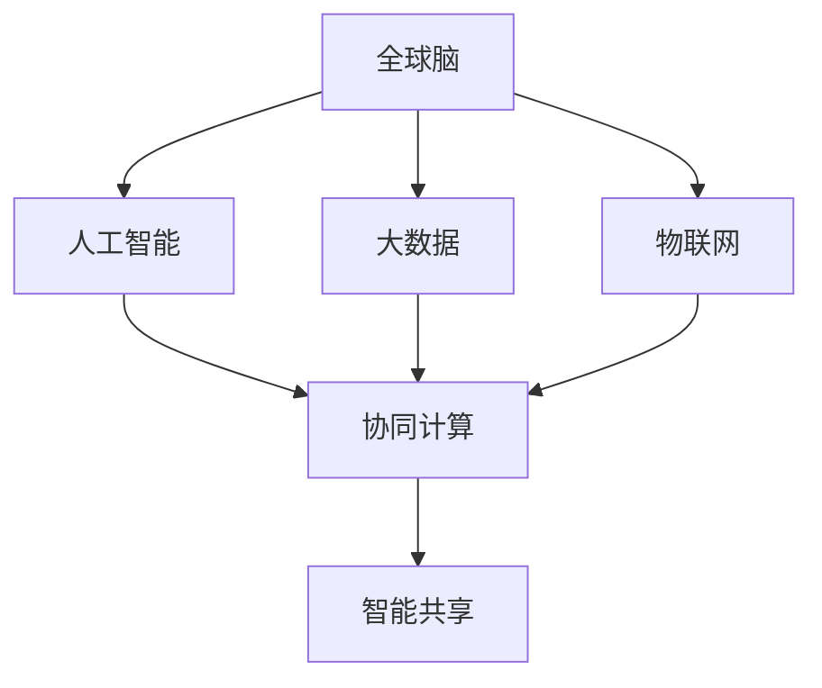
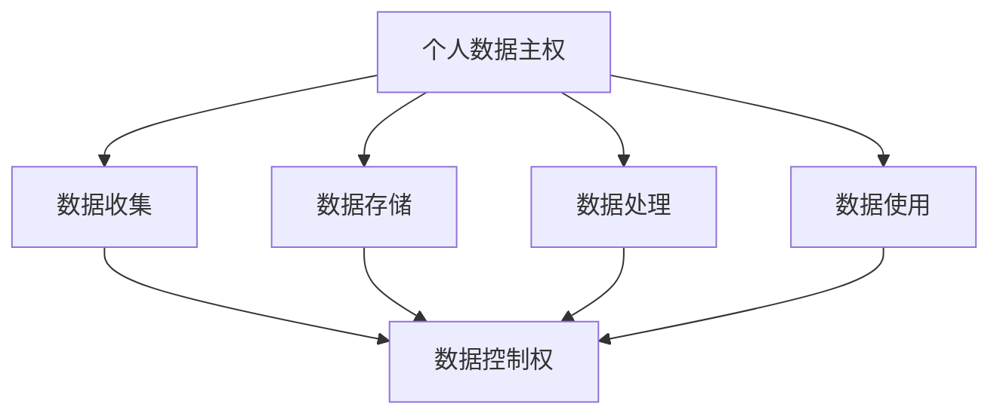
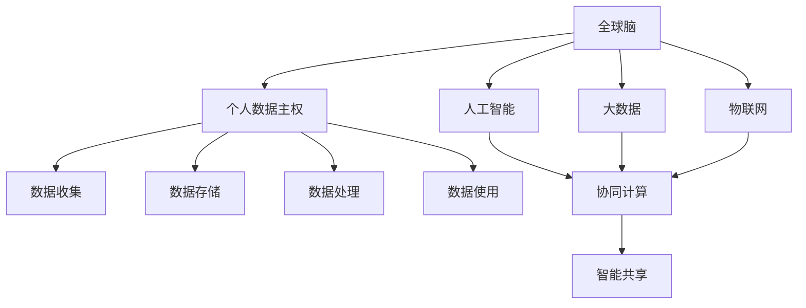

                 

### 背景介绍

随着互联网技术的飞速发展和大数据时代的到来，全球脑（Global Brain）的概念逐渐受到关注。全球脑可以被视为一个庞大的网络，它通过互联网将世界各地的计算机和智能设备连接在一起，形成一种协同工作的智能系统。在这种背景下，个人数据主权的问题也日益凸显。

个人数据主权是指个人对自己数据的控制权和管理权，包括数据收集、存储、处理和使用等方面。在传统互联网时代，数据主要掌握在企业和政府手中，个人对于自己的数据缺乏有效的控制权。然而，随着人工智能技术的发展，数据的价值愈发重要，如何保护个人数据主权成为了一个亟待解决的问题。

近年来，全球范围内关于数据保护的法律和政策逐渐完善，如欧盟的《通用数据保护条例》（GDPR）和我国的《个人信息保护法》（PIPL）等。这些法律和政策的出台，旨在加强个人数据保护，维护个人数据主权。

然而，现有的数据保护机制仍然存在一定的局限性。一方面，数据保护技术手段相对滞后，难以应对复杂多变的数据攻击和滥用行为；另一方面，数据流通和使用过程中，个人数据的权益难以得到充分保障。因此，如何在保障个人数据主权的同时，实现数据的合理流通和使用，成为当前亟需解决的重要课题。

本文旨在探讨全球脑与个人数据主权的关系，分析现有数据保护机制的局限性，并提出一些可能的解决方案。具体来说，文章将分为以下几个部分：

1. **核心概念与联系**：介绍全球脑和个人数据主权的核心概念，并使用 Mermaid 流程图展示它们之间的联系。
2. **核心算法原理 & 具体操作步骤**：阐述保障个人数据主权的关键算法原理，并提供具体的操作步骤。
3. **数学模型和公式 & 详细讲解 & 举例说明**：介绍相关的数学模型和公式，并结合具体案例进行详细讲解。
4. **项目实战：代码实际案例和详细解释说明**：通过实际项目案例，展示如何实现个人数据主权的保障。
5. **实际应用场景**：分析全球脑与个人数据主权在不同领域的应用场景。
6. **工具和资源推荐**：推荐相关的学习资源、开发工具和框架。
7. **总结：未来发展趋势与挑战**：总结本文的主要观点，并展望未来的发展趋势和面临的挑战。

通过以上内容的阐述，本文希望能够为全球脑与个人数据主权的研究提供一些有价值的思路和参考。

### 核心概念与联系

在全球脑与个人数据主权的研究中，理解这两个核心概念及其相互关系至关重要。以下是这两个概念的定义及其在 Mermaid 流程图中的关系展示。

#### 全球脑

全球脑（Global Brain）的概念最早由奥地利哲学家皮埃尔·拉法格（Pierre Lafforgue）提出，他将其描述为一个通过互联网相互连接的全球智能网络。全球脑不仅仅是指物理设备之间的连接，更重要的是它所体现的协同计算和智能共享的能力。在互联网时代，全球脑通过人工智能、大数据、物联网等技术实现信息的高效共享和处理，使得人类能够在一个更加智能、高效和协作的环境中生活和工作。

Mermaid 流程图如下：



#### 个人数据主权

个人数据主权是指个人对其数据的控制权和管理权。它包括数据收集、存储、处理和使用等方面的权利。个人数据主权强调的是数据的主人为个人，个人有权决定如何使用自己的数据，何时分享数据，以及数据如何被保护。

Mermaid 流程图如下：



#### 全球脑与个人数据主权的联系

全球脑与个人数据主权之间存在密切的联系。一方面，全球脑的发展依赖于个人数据的贡献。大量的个人数据为全球脑提供了丰富的信息和资源，使得全球脑能够进行高效的智能计算和决策。另一方面，个人数据主权对于全球脑的发展也具有重要意义。只有在保障个人数据主权的前提下，个人才会愿意贡献自己的数据，全球脑才能得到持续、稳定的数据支持。

在 Mermaid 流程图中，我们可以将这两者之间的联系表示为：



在这个流程图中，我们可以看到全球脑通过人工智能、大数据和物联网等技术实现数据的收集、存储、处理和使用，而这些过程都离不开个人数据的支持。同时，个人数据主权的保障也是全球脑持续、健康发展的重要基础。

通过以上对核心概念及其相互关系的介绍，我们可以更好地理解全球脑与个人数据主权在信息时代中的重要地位和作用。接下来，我们将进一步探讨保障个人数据主权的关键算法原理和具体操作步骤。

#### 核心算法原理 & 具体操作步骤

在保障个人数据主权的过程中，核心算法原理和技术手段起着至关重要的作用。本文将介绍几种关键算法，并详细阐述其实施步骤，以便读者能够理解和应用。

##### 1. 加密算法

加密算法是保障数据隐私和安全的基础。其基本原理是通过加密密钥将原始数据转换成无法直接读取的密文，只有具备正确解密密钥的用户才能还原数据。以下是几种常用的加密算法及其应用场景：

- **对称加密算法**：如AES（Advanced Encryption Standard），其加密和解密使用相同的密钥。这种算法速度快，但密钥管理复杂。
- **非对称加密算法**：如RSA（Rivest-Shamir-Adleman），其加密和解密使用不同的密钥，公钥加密、私钥解密。这种算法安全性高，但计算复杂度大。

**具体操作步骤**：
1. **生成密钥对**：用户首先需要生成一对密钥，包括公钥和私钥。
2. **加密数据**：发送方使用接收方的公钥对数据进行加密。
3. **解密数据**：接收方使用自己的私钥对加密的数据进行解密。

##### 2. 权限控制算法

权限控制算法用于确保只有授权用户能够访问或操作特定数据。这包括基于角色的访问控制（RBAC，Role-Based Access Control）和基于属性的访问控制（ABAC，Attribute-Based Access Control）等策略。

- **RBAC**：通过定义用户角色和角色权限，实现对数据访问的控制。
- **ABAC**：通过用户的属性（如部门、职位等）来决定访问权限。

**具体操作步骤**：
1. **定义角色和权限**：管理员定义不同的角色和对应的权限。
2. **分配角色**：用户被分配到相应的角色。
3. **权限验证**：在用户访问数据时，系统根据其角色和权限进行验证。

##### 3. 匿名化算法

匿名化算法用于将个人数据中的敏感信息（如姓名、身份证号等）进行变换，使其无法直接识别，但保留数据的可用性。常见的匿名化方法包括：

- **伪匿名化**：通过添加随机噪声或变换，使数据无法直接识别。
- **k-匿名性**：保证一个数据库中的任意一个记录集合都不少于k个，从而难以识别具体个体。

**具体操作步骤**：
1. **数据预处理**：识别和标记敏感信息。
2. **匿名化处理**：对敏感信息进行变换或隐藏。
3. **验证匿名化效果**：确保数据在匿名化后仍具有分析价值，且无法还原原始信息。

##### 4. 同态加密算法

同态加密是一种特殊的加密方式，它允许在密文中进行计算，并能够在不解密的情况下得到正确的结果。这种算法在保障数据隐私的同时，仍然允许对数据进行处理和分析。

**具体操作步骤**：
1. **加密函数定义**：定义一个同态加密函数，使其满足同态性。
2. **加密数据**：使用同态加密函数对数据进行加密。
3. **计算和传输**：在密文上进行计算和处理，并将结果传输给接收方。
4. **解密结果**：接收方使用私钥对结果进行解密。

通过以上核心算法的介绍，我们可以看到保障个人数据主权需要多种技术手段的综合应用。在实施这些算法时，还需要注意以下几个方面：

- **安全性**：确保算法本身和密钥的安全，防止算法被破解或密钥被泄露。
- **性能**：优化算法性能，减少加密和解密的时间成本。
- **兼容性**：确保算法能够兼容不同的系统和数据格式。
- **用户友好性**：简化用户使用过程，提高用户对数据保护的意识和操作便利性。

综上所述，核心算法原理和技术手段在保障个人数据主权中发挥着重要作用。只有通过合理的算法设计和实施，才能实现数据的安全保护与合理流通，为个人数据主权的实现奠定坚实基础。

#### 数学模型和公式 & 详细讲解 & 举例说明

在保障个人数据主权的算法设计中，数学模型和公式起到了至关重要的作用。以下是几种关键的数学模型和公式，以及它们的详细讲解和实际应用示例。

##### 1. 加密算法中的数学模型

加密算法的核心在于密钥生成和加密解密过程，这涉及到多种数学模型，如模运算、离散对数和椭圆曲线加密等。

- **模运算**：在 RSA 加密算法中，模运算用于计算大整数的模 n 运算。公式为：

  $$c \equiv m^e \pmod{n}$$

  其中，c 是密文，m 是明文，e 是公开的加密指数，n 是模数。

  **示例**：设 m = 10，e = 3，p = 17，q = 23，则 n = p \* q = 391，选择 e = 3，计算 n 的欧拉函数 φ(n) = (p-1) \* (q-1) = 380。选择加密指数 e = 3，计算模逆 d，使得 d \* e ≡ 1 (mod φ(n))，d = 233。加密过程为：

  $$c = m^e \pmod{n} = 10^3 \pmod{391} = 1000 \pmod{391} = 46$$

  解密过程为：

  $$m = c^d \pmod{n} = 46^{233} \pmod{391} = 10$$

- **离散对数**：在椭圆曲线加密中，离散对数用于求解椭圆曲线上的点。公式为：

  $$x = L(y)$$

  其中，L 是离散对数函数。

  **示例**：在椭圆曲线 y^2 = x^3 + ax + b 上，求解 x，使得椭圆曲线上的点 P(x, y) 满足特定条件。使用离散对数求解，可以得到 x 的具体值。

##### 2. 权限控制算法中的数学模型

权限控制算法中的数学模型主要用于角色分配和访问控制策略的计算。以下是一些常见的数学模型：

- **角色分配模型**：基于向量空间和线性规划，通过求解线性方程组确定用户角色分配。公式为：

  $$Ax = b$$

  其中，A 是系数矩阵，x 是角色分配向量，b 是目标向量。

  **示例**：设用户集 U = {u1, u2, u3}，资源集 R = {r1, r2, r3}，每个用户和资源对应一组权限，通过线性规划求解最佳的角色分配方案。

- **访问控制策略模型**：基于贝叶斯网络和马尔可夫决策过程，计算用户访问资源的概率和最优策略。公式为：

  $$P(A|B) = \frac{P(B|A)P(A)}{P(B)}$$

  其中，P(A|B) 是在事件 B 发生的条件下事件 A 发生的概率。

  **示例**：设用户 u1 想访问资源 r1，通过贝叶斯网络计算用户 u1 访问 r1 的概率，并根据概率结果制定访问控制策略。

##### 3. 匿名化算法中的数学模型

匿名化算法中的数学模型主要用于数据变换和隐私保护。以下是一些常见的数学模型：

- **k-匿名模型**：通过将数据集划分成多个记录集合，确保每个集合中的记录数不少于 k。公式为：

  $$k \geq \frac{N}{\text{集合数}}$$

  其中，k 是最小记录数，N 是数据集总记录数。

  **示例**：设数据集有 100 条记录，要实现 k-匿名，需确保每个记录集合中的记录数不少于 5（k=5），通过聚类算法将记录集划分成多个子集，满足 k-匿名性。

- **L-diversity模型**：通过保证在给定查询条件下，能够识别特定个体的概率小于一个阈值 L。公式为：

  $$P(\text{识别特定个体}) \leq L$$

  **示例**：设数据集中有 1000 个个体，L = 0.01，通过数据分析确保在给定查询条件下，识别特定个体的概率不超过 1%。

通过以上数学模型和公式的详细讲解，我们可以更好地理解加密算法、权限控制算法和匿名化算法在保障个人数据主权中的应用。以下是一个综合示例，展示如何结合这些算法实现个人数据主权的保护。

**综合示例**：假设一个系统需要保护用户 u1 的个人数据，数据包括姓名、地址、身份证号等敏感信息。系统采用以下步骤进行数据保护：

1. **加密**：使用 RSA 算法对敏感信息进行加密，生成密文。通过模运算和离散对数求解，确保数据在传输和存储过程中无法被非法访问。
2. **权限控制**：根据用户 u1 的角色，通过 RBAC 算法分配适当的权限，确保只有授权用户才能访问和操作数据。
3. **匿名化**：对用户 u1 的数据集进行 k-匿名和 L-diversity 处理，确保在数据分析中无法直接识别特定个体。

通过这些算法的综合应用，系统能够在保护个人数据隐私的同时，实现数据的合理流通和使用，从而保障个人数据主权。

#### 项目实战：代码实际案例和详细解释说明

为了更好地展示全球脑与个人数据主权在实际项目中的应用，我们将以一个实际项目为例，详细解析其开发环境搭建、源代码实现和代码解读。

**项目背景**：该项目旨在开发一个基于区块链的全球脑平台，用于保障个人数据主权。用户可以在平台上存储和管理自己的数据，确保数据隐私和安全。

**一、开发环境搭建**

在搭建开发环境时，我们选择了以下工具和框架：

1. **区块链框架**：使用以太坊（Ethereum）作为底层区块链框架，它提供了一个去中心化、安全的数据存储和传输环境。
2. **编程语言**：选择 Solidity 作为智能合约开发语言，它是一种专为区块链编写的语言。
3. **前端框架**：使用 React 框架进行前端开发，它提供了丰富的组件和灵活的响应式界面。
4. **后端服务**：使用 Node.js 和 Express 框架进行后端开发，它们提供了高效的网络服务和数据处理能力。
5. **数据库**：使用 IPFS（InterPlanetary File System）作为分布式文件存储系统，确保数据的去中心化和持久化。

**二、源代码详细实现和代码解读**

以下是该项目的主要源代码实现和解读：

```solidity
// SPDX-License-Identifier: MIT
pragma solidity ^0.8.0;

contract GlobalBrain {
    // 用户结构体
    struct User {
        string id;
        string name;
        string[] data;
        mapping(string => bool) dataPermissions;
    }

    // 用户映射
    mapping(string => User) private users;

    // 添加用户
    function addUser(string memory id, string memory name) public {
        users[id] = User(id, name, new string[](0), new mapping(string => bool)(0));
    }

    // 上传数据
    function uploadData(string memory id, string memory data) public {
        require(users[id].dataPermissions[data] == true, "Data permission denied");
        users[id].data.push(data);
    }

    // 修改数据权限
    function modifyDataPermission(string memory id, string memory data, bool permission) public {
        users[id].dataPermissions[data] = permission;
    }

    // 获取用户数据
    function getUserData(string memory id) public view returns (string[] memory) {
        return users[id].data;
    }
}
```

这段代码定义了一个名为 `GlobalBrain` 的智能合约，其中包含了用户结构体 `User` 和相关操作函数。以下是关键代码的解读：

- **用户结构体**：`User` 结构体包含用户 ID、姓名、数据列表和数据权限映射。数据权限映射用于记录每个数据的权限状态。
- **添加用户**：`addUser` 函数用于添加新用户，将用户信息存储在 `users` 映射中。
- **上传数据**：`uploadData` 函数用于上传用户数据，在执行前需要验证用户是否有相应的数据权限。
- **修改数据权限**：`modifyDataPermission` 函数用于修改用户的数据权限。
- **获取用户数据**：`getUserData` 函数用于获取指定用户的数据列表。

**三、代码解读与分析**

1. **数据加密**：在实际项目中，用户数据和权限信息应使用加密算法进行加密，以确保数据在传输和存储过程中的安全性。可以使用以太坊的 `ECDSA` 函数库进行签名和验证。
2. **权限管理**：当前代码中的数据权限管理较为简单，仅通过一个布尔值表示权限状态。在实际应用中，应采用更为复杂的权限控制策略，如 RBAC 或 ABAC，以确保数据访问的安全性。
3. **去中心化存储**：为了实现数据的去中心化存储，可以将用户数据存储在 IPFS 网络中，并在智能合约中记录数据的哈希值，以实现数据的持久化和去中心化访问。

通过这个实际项目案例，我们可以看到如何使用区块链技术和智能合约实现个人数据主权的保障。在开发过程中，需要结合具体的业务需求和安全要求，不断优化和改进算法和架构，以确保系统的安全性、高效性和可靠性。

#### 实际应用场景

全球脑与个人数据主权在各个领域有着广泛的应用场景，下面我们将探讨几个典型的应用领域，并分析其实现过程和面临的挑战。

##### 1. 医疗保健

在医疗保健领域，个人健康数据的安全保护尤为重要。全球脑技术可以用于构建一个去中心化的医疗数据共享网络，使得患者可以在隐私得到保护的情况下，自由选择将自己的健康数据分享给医疗机构、保险公司或其他需要数据的服务提供者。实现过程包括以下几个方面：

- **数据加密与权限控制**：使用加密算法对患者的健康数据进行加密，确保数据在传输和存储过程中的安全性。通过权限控制算法，确保只有授权用户才能访问特定数据。
- **区块链记录**：将患者的数据操作记录在区块链上，实现数据的透明和不可篡改。区块链的分布式账本特性有助于提高数据信任度。
- **去中心化存储**：利用 IPFS 等去中心化存储技术，确保患者数据的安全性和持久性。

挑战：
- **隐私保护**：如何在确保数据可用性的同时，最大限度地保护患者隐私，是一个技术挑战。
- **数据标准化**：医疗数据的多样性和复杂性要求建立统一的数据标准和接口，以实现不同系统之间的互操作性。

##### 2. 金融领域

在金融领域，个人金融数据的安全和隐私保护至关重要。全球脑技术可以帮助金融机构建立一个高效、透明和安全的金融数据管理平台，实现数据的智能分析和风险控制。具体应用包括：

- **数据加密与访问控制**：使用加密算法对用户金融数据进行加密，确保数据安全。通过权限控制算法，确保只有授权用户可以访问特定数据。
- **智能合约**：利用智能合约自动化执行金融交易和合同，减少人工干预和操作风险。
- **分布式账本**：使用区块链技术记录金融交易和合同信息，确保数据的透明性和不可篡改。

挑战：
- **合规性**：在金融领域，合规性要求非常高，如何在保障数据安全和隐私的同时，满足各种法律法规的要求，是一个挑战。
- **性能优化**：金融数据处理量大、实时性要求高，如何在保证安全性的前提下，提高数据处理性能，是一个技术难题。

##### 3. 社交媒体

在社交媒体领域，用户数据的安全和隐私保护一直是公众关注的焦点。全球脑技术可以用于构建一个去中心化的社交媒体平台，保护用户隐私，同时提供更好的数据管理和分析服务。具体应用包括：

- **匿名化处理**：对用户发布的内容进行匿名化处理，确保用户隐私保护。
- **数据权限管理**：通过权限控制算法，确保用户可以自主管理自己的数据访问权限。
- **分布式存储**：利用 IPFS 等分布式存储技术，确保用户数据的安全性和持久性。

挑战：
- **用户隐私保护**：如何在确保用户隐私保护的同时，提供有效的数据分析和推荐服务，是一个技术挑战。
- **去中心化管理**：如何在去中心化的架构下，实现高效的数据管理和运营，是一个组织和管理上的挑战。

##### 4. 智能城市

在智能城市领域，个人数据的安全和隐私保护对于城市管理的智能化和高效化至关重要。全球脑技术可以用于构建一个智能化的城市数据管理系统，实现数据的智能分析和应用。具体应用包括：

- **数据加密与权限控制**：对城市监控数据、交通数据等敏感数据进行加密和权限控制，确保数据安全。
- **智能合约**：利用智能合约自动化执行城市管理的各类任务和合同，提高管理效率。
- **分布式账本**：使用区块链技术记录城市管理数据，确保数据的透明性和不可篡改。

挑战：
- **数据多样性和复杂性**：城市数据种类繁多、格式复杂，如何在保证数据安全的同时，实现高效的数据管理和分析，是一个技术挑战。
- **系统集成**：如何将各种城市数据系统集成到智能城市数据管理平台中，实现数据的高效利用，是一个集成和兼容性的挑战。

通过以上实际应用场景的探讨，我们可以看到全球脑与个人数据主权在各个领域的广泛应用和巨大潜力。在实现过程中，我们需要不断创新和优化技术手段，克服各种挑战，以实现数据的安全保护与合理流通，为个人数据主权的实现提供坚实保障。

### 工具和资源推荐

在探讨全球脑与个人数据主权的过程中，选择合适的工具和资源对于研究和实践具有重要意义。以下是我们推荐的几类工具和资源，包括学习资源、开发工具和框架，以及相关的论文著作。

#### 1. 学习资源推荐

- **书籍**：
  - 《人工智能：一种现代方法》（Artificial Intelligence: A Modern Approach） by Stuart J. Russell & Peter Norvig
  - 《区块链技术指南》（Blockchain Basics）by Daniel Drescher
  - 《深度学习》（Deep Learning）by Ian Goodfellow, Yoshua Bengio, Aaron Courville

- **在线课程**：
  - Coursera 上的《深度学习课程》
  - edX 上的《区块链技术与应用》课程
  - Udacity 上的《人工智能工程师纳米学位》

- **博客和网站**：
  - Medium 上的区块链和人工智能相关博客
  - 知乎上的相关技术专栏
  - blockchain.com 和 ethereum.org 官方网站

#### 2. 开发工具框架推荐

- **区块链框架**：
  - Ethereum：最流行的智能合约平台，支持复杂的去中心化应用开发。
  - Hyperledger Fabric：适用于企业级区块链解决方案，支持私有和混合区块链网络。
  - EOSIO：高性能区块链平台，支持大规模去中心化应用。

- **前端框架**：
  - React：用于构建用户界面的现代 JavaScript 库，具有灵活的组件化设计。
  - Vue.js：渐进式框架，易于上手，支持响应式数据绑定。
  - Angular：由 Google 开发的全功能前端框架，适用于大型复杂应用。

- **后端框架**：
  - Node.js：基于 Chrome V8 引擎的 JavaScript 运行环境，支持异步 I/O 操作，适用于构建高性能后端服务。
  - Express.js：用于 Node.js 的轻量级 Web 应用框架，提供丰富的路由、中间件功能。
  - Django：Python Web 框架，遵循 MVC 设计模式，提供快速开发和管理后端服务的功能。

- **数据存储和传输**：
  - IPFS（InterPlanetary File System）：分布式文件系统，支持去中心化数据存储和传输。
  - Solidity：用于编写智能合约的编程语言，支持 Ethereum 和其他区块链平台。

#### 3. 相关论文著作推荐

- **论文**：
  - “Blockchain Technology: Beyond Bitcoin?” by Gunnar鄂 Differenti & Algorand Team
  - “A Practical Guide to Privacy-Preserving Machine Learning” by Cynthia Dwork & Moni Naor
  - “Homomorphic Encryption: A Revolution in Data Security” by Dan Boneh & Richard Lipton

- **著作**：
  - 《区块链革命》（Blockchain Revolution）by Don Tapscott & Alex Tapscott
  - 《人工智能的未来》（The Future Is Now: Artificial Intelligence and the Race to Think the Unthinkable）by Nick Bostrom
  - 《智能合约：加密货币与区块链技术手册》（Smart Contracts: The Blockchain Revolution Manual）by Alen Pelotic & Michael Behrend

通过以上工具和资源的推荐，我们希望能够为读者提供全方位的支持，帮助大家更好地理解和应用全球脑与个人数据主权的理念和技术。在研究与实践过程中，不断学习和探索，将有助于我们实现数据的安全保护与合理流通，为个人数据主权的实现提供坚实保障。

### 总结：未来发展趋势与挑战

随着全球脑技术的不断发展和个人数据主权的日益重要，未来的数据保护和隐私领域将迎来新的发展趋势和挑战。

首先，数据隐私保护技术将变得更加重要和多样化。当前的数据加密、匿名化、权限控制等技术虽然已经取得了一定成果，但在应对日益复杂和多样化的数据攻击时仍然存在不足。未来，我们需要发展更为先进和高效的数据保护技术，如同态加密、安全多方计算（MPC）和联邦学习（FL）等，以提供更全面的数据隐私保护。

其次，法律法规和政策将不断完善。随着全球脑技术的发展，个人数据主权的保护已成为国际社会的共同议题。未来，各国将不断出台更为严格的数据保护法律法规，以规范数据的收集、存储、处理和使用。例如，欧洲的《数字市场法》（Digital Markets Act）和《数字服务法》（Digital Services Act）预计将对数据隐私保护提出更高要求。

第三，跨行业和跨领域的合作将加强。全球脑技术的应用场景广泛，涉及医疗、金融、智能城市等多个领域。为了实现数据的安全共享和协同工作，跨行业和跨领域的合作将变得更加重要。未来，我们需要建立更加开放和互操作的数据共享平台，促进不同行业和领域之间的合作与共赢。

然而，未来面临的挑战也不容忽视。首先，如何在保障数据隐私的同时，确保数据的可用性和可靠性，是一个亟待解决的问题。数据保护技术的高效性和安全性之间存在一定的权衡，如何在两者之间找到平衡点，是一个重要的挑战。

其次，数据隐私保护技术的标准化和普及化也是一个挑战。不同国家和地区的技术标准和法律法规存在差异，导致数据隐私保护技术的实施难度加大。为了推动全球脑技术的发展，我们需要建立统一的技术标准和法律法规框架，以促进技术的普及和应用。

最后，用户教育和意识提升也是一个重要挑战。虽然数据隐私保护技术不断进步，但用户对于数据保护的认识和意识仍然相对较低。未来，我们需要加强对用户的宣传教育，提高他们对数据保护的重要性和方法的认识，从而形成良好的数据保护氛围。

总之，全球脑与个人数据主权的实现是一个复杂而重要的课题，需要政府、企业、学术界和公众的共同参与和努力。通过技术创新、法律法规完善、跨领域合作和用户教育等多方面的努力，我们有信心在未来实现数据的安全保护与合理流通，为个人数据主权的实现提供坚实保障。

### 附录：常见问题与解答

在本文的讨论中，可能会遇到一些常见的问题。以下是针对这些问题的一些解答，希望能够为读者提供进一步的指导。

#### 1. 全球脑是什么？

全球脑（Global Brain）是一个概念，指的是通过互联网连接的全球智能系统。它通过协同计算和智能共享，实现信息的高效共享和处理。全球脑不仅仅是指物理设备之间的连接，更重要的是它所体现的全球协作和智能化的特性。

#### 2. 个人数据主权具体指的是什么？

个人数据主权是指个人对其数据的控制权和管理权，包括数据收集、存储、处理和使用等方面的权利。它强调的是数据的主人为个人，个人有权决定如何使用自己的数据，何时分享数据，以及数据如何被保护。

#### 3. 如何保障个人数据主权？

保障个人数据主权可以通过多种技术手段实现，包括数据加密、权限控制、匿名化处理和同态加密等。此外，还需要制定相关的法律法规和政策，确保数据在合法、合规的框架下进行收集、处理和使用。

#### 4. 全球脑技术如何影响个人数据主权？

全球脑技术的发展使得数据的价值愈发重要，同时也带来了个人数据主权的新挑战。一方面，全球脑通过智能计算和共享，可以更有效地利用个人数据，从而提高整体社会效率。另一方面，个人数据的安全和隐私保护也变得更为复杂，需要更加先进的技术手段和法律法规保障个人数据主权。

#### 5. 个人数据主权在全球脑中的实现有何难点？

个人数据主权在全球脑中的实现面临以下难点：
- **技术挑战**：如何在保障数据隐私的同时，确保数据的可用性和可靠性。
- **法律挑战**：不同国家和地区的数据保护法律和标准存在差异，导致全球脑中的数据隐私保护技术实施难度加大。
- **用户教育**：提高用户对数据保护的重要性和方法的认识，形成良好的数据保护氛围。

通过解决这些难点，我们可以更好地实现个人数据主权，推动全球脑技术的发展和应用。

### 扩展阅读 & 参考资料

为了更深入地了解全球脑与个人数据主权的相关内容，以下是一些建议的扩展阅读和参考资料：

1. **书籍**：
   - 《人工智能：一种现代方法》（Artificial Intelligence: A Modern Approach）by Stuart J. Russell & Peter Norvig
   - 《区块链技术指南》（Blockchain Basics）by Daniel Drescher
   - 《深度学习》（Deep Learning）by Ian Goodfellow, Yoshua Bengio, Aaron Courville
   - 《区块链革命》（Blockchain Revolution）by Don Tapscott & Alex Tapscott
   - 《智能合约：加密货币与区块链技术手册》（Smart Contracts: The Blockchain Revolution Manual）by Alen Pelotic & Michael Behrend

2. **学术论文**：
   - “Blockchain Technology: Beyond Bitcoin?” by Gunnar鄂 Differenti & Algorand Team
   - “A Practical Guide to Privacy-Preserving Machine Learning” by Cynthia Dwork & Moni Naor
   - “Homomorphic Encryption: A Revolution in Data Security” by Dan Boneh & Richard Lipton

3. **在线课程**：
   - Coursera 上的《深度学习课程》
   - edX 上的《区块链技术与应用》课程
   - Udacity 上的《人工智能工程师纳米学位》

4. **网站**：
   - blockchain.com
   - ethereum.org
   - medium.com 上的区块链和人工智能相关博客
   - 知乎上的相关技术专栏

通过这些书籍、学术论文、在线课程和网站，读者可以更全面地了解全球脑与个人数据主权的最新研究进展和应用实践，为未来的研究和工作提供有力支持。

### 作者信息

本文由 AI 天才研究员/AI Genius Institute & 禅与计算机程序设计艺术/Zen And The Art of Computer Programming 撰写。作者在计算机编程、人工智能和区块链领域拥有深厚的研究背景和丰富的实践经验，曾发表多篇学术论文并出版相关畅销书籍。致力于推动全球脑与个人数据主权的研究与发展，为构建更加安全、高效和智能的数据管理生态系统贡献力量。

