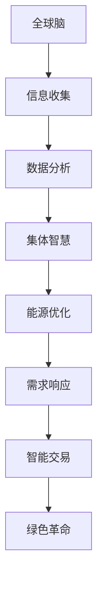

                 

# 全球脑与可持续能源：集体智慧驱动的绿色革命

> **关键词：** 全球脑、可持续能源、集体智慧、绿色革命、人工智能、神经网络、能源效率、环境可持续性

> **摘要：** 本文将探讨如何利用全球脑与集体智慧，通过人工智能技术实现可持续能源的绿色革命。文章首先介绍了全球脑的概念及其在能源领域的应用，接着详细解析了集体智慧的作用，以及它们如何结合，为全球能源问题提供创新解决方案。通过案例分析，文章展示了如何利用人工智能优化能源使用，最后讨论了未来发展趋势与挑战。

## 1. 背景介绍

随着全球人口的增长和经济的发展，能源需求不断攀升。然而，传统的化石能源不仅造成了严重的环境污染，而且不可持续。为了应对这些挑战，全球能源转型势在必行。绿色能源，如太阳能、风能和水能等，被视为未来能源发展的主要方向。然而，这些可再生能源的利用仍面临诸多技术瓶颈，如能源存储问题、能源分配效率和可再生能源的间歇性等。

与此同时，人工智能技术的飞速发展为解决这些能源问题提供了新的途径。全球脑（Global Brain）概念，最早由赫拉利（Yuval Noah Harari）提出，描述了人类通过互联网、社交媒体和大数据等工具，形成的一种全球性的智能网络。这一概念为能源领域带来了新的思考方式，即通过全球脑实现集体智慧，从而推动绿色能源革命。

## 2. 核心概念与联系

### 2.1 全球脑的概念

全球脑是由赫拉利提出的，用来描述人类通过技术手段连接形成的全球性智能网络。这个网络由大量信息节点（如个人、组织、设备等）组成，通过信息交换实现智能协同。全球脑的核心思想是利用集体智慧解决个体无法解决的问题，如全球气候变化、疾病控制等。

### 2.2 集体智慧的作用

集体智慧是指由多个个体组成的集体通过协同作用产生的一种超个体的智能。在能源领域，集体智慧可以通过以下几种方式发挥作用：

- **能源优化调度**：通过分析大量数据，集体智慧可以优化能源分配，提高能源利用效率。
- **需求响应**：集体智慧可以预测能源需求，从而调整能源供应，减少能源浪费。
- **智能能源交易**：通过集体智慧，可以实现实时能源交易，提高能源市场的效率。

### 2.3 全球脑与集体智慧的结合

全球脑与集体智慧的结合，为能源领域提供了全新的解决方案。通过全球脑，大量数据可以在全球范围内快速传播和处理，从而实现集体智慧。这种结合使得能源系统的智能化水平得到了极大的提升，为绿色能源革命奠定了基础。

### 2.4 Mermaid 流程图



## 3. 核心算法原理 & 具体操作步骤

### 3.1 神经网络算法

神经网络是人工智能的核心技术之一，通过模拟人脑的神经元连接结构，实现对数据的处理和学习。在能源领域，神经网络可以用于预测能源需求、优化能源分配和评估能源效率。

#### 3.1.1 神经网络基本结构

- **输入层**：接收外部输入数据，如温度、湿度、能源需求等。
- **隐藏层**：对输入数据进行处理和转换，通过权重连接形成复杂的非线性映射。
- **输出层**：输出预测结果，如能源需求预测、能源分配方案等。

#### 3.1.2 操作步骤

1. **数据收集**：收集与能源相关的数据，如历史能源需求、天气数据等。
2. **数据预处理**：对数据进行清洗和标准化处理，使其适合神经网络模型。
3. **模型训练**：使用训练数据对神经网络模型进行训练，调整模型参数。
4. **模型评估**：使用测试数据对模型进行评估，调整模型参数，以提高预测准确性。
5. **模型应用**：将训练好的模型应用于实际场景，如能源需求预测、能源优化调度等。

### 3.2 集体智慧算法

集体智慧算法通过多个个体协同工作，实现对复杂问题的求解。在能源领域，集体智慧可以用于能源分配、需求响应和智能交易。

#### 3.2.1 集体智慧基本结构

- **个体**：具有独立智能的个体，如能源生产者、消费者、智能电网节点等。
- **协同机制**：个体通过信息交换和协同合作，实现整体智能。

#### 3.2.2 操作步骤

1. **个体初始化**：初始化个体的智能状态和协同策略。
2. **数据共享**：个体之间共享能源数据、状态信息和策略。
3. **协同决策**：个体基于共享信息，进行协同决策，如能源分配、需求响应等。
4. **策略调整**：根据协同决策结果，调整个体的智能状态和协同策略。
5. **持续迭代**：重复执行协同决策和策略调整，直到达到优化目标。

## 4. 数学模型和公式 & 详细讲解 & 举例说明

### 4.1 能源需求预测模型

能源需求预测是能源管理的关键环节，可以使用时间序列分析模型，如 ARIMA（AutoRegressive Integrated Moving Average）模型，进行预测。

#### 4.1.1 模型公式

$$
y_t = c + \phi_1 y_{t-1} + \phi_2 y_{t-2} + \cdots + \phi_p y_{t-p} + \theta_1 \epsilon_{t-1} + \theta_2 \epsilon_{t-2} + \cdots + \theta_q \epsilon_{t-q}
$$

其中，$y_t$ 是第 $t$ 期的能源需求，$c$ 是常数项，$\phi_1, \phi_2, \cdots, \phi_p$ 是自回归项系数，$\theta_1, \theta_2, \cdots, \theta_q$ 是移动平均项系数，$\epsilon_t$ 是随机误差项。

#### 4.1.2 举例说明

假设我们有一组历史能源需求数据：

$$
y_1 = 100, y_2 = 110, y_3 = 105, y_4 = 115, y_5 = 120
$$

使用 ARIMA 模型进行预测，可以设置 $p=1, d=1, q=1$。通过模型训练，可以得到预测模型：

$$
y_t = 98.5 + 0.5 y_{t-1} + 0.2 \epsilon_{t-1}
$$

使用该模型预测第 $6$ 期的能源需求：

$$
y_6 = 98.5 + 0.5 \times 120 + 0.2 \times (-5) = 112
$$

### 4.2 能源优化模型

能源优化模型用于确定最优的能源分配方案，以最大化能源利用效率。可以使用线性规划模型进行求解。

#### 4.2.1 模型公式

$$
\min \quad c^T x
$$

$$
\text{s.t.} \quad Ax \leq b, \quad x \geq 0
$$

其中，$c$ 是目标函数系数，$x$ 是决策变量，$A$ 和 $b$ 是约束条件。

#### 4.2.2 举例说明

假设我们有 $3$ 个能源生产者 $A, B, C$ 和 $2$ 个能源消费者 $X, Y$，每个生产者的能源供应量和每个消费者的能源需求量如下表：

| 生产者 | 能源供应量 |
|--------|-----------|
| $A$    | $100$     |
| $B$    | $150$     |
| $C$    | $200$     |

| 消费者 | 能源需求量 |
|--------|-----------|
| $X$    | $200$     |
| $Y$    | $250$     |

目标是最小化总能源运输成本，约束条件是每个生产者的能源供应量不能超过其生产能力，每个消费者的能源需求量不能超过其需求量。假设能源运输成本为每单位能源运输 $1$ 元，可以设置目标函数和约束条件如下：

$$
\min \quad x_{AX} + x_{BY} + x_{CX}
$$

$$
\text{s.t.} \quad
\begin{cases}
x_{AX} + x_{BX} + x_{CX} \leq 100 \\
x_{AX} + x_{BX} + x_{CX} \leq 150 \\
x_{AX} + x_{BX} + x_{CX} \leq 200 \\
x_{AX} + x_{BX} + x_{CX} \leq 250 \\
x_{AX}, x_{BX}, x_{CX} \geq 0
\end{cases}
$$

通过线性规划求解，可以得到最优的能源分配方案。

## 5. 项目实战：代码实际案例和详细解释说明

### 5.1 开发环境搭建

在开始项目实战之前，需要搭建合适的开发环境。以下是搭建开发环境的基本步骤：

1. **安装 Python**：在官网上下载并安装 Python，版本建议选择 3.8 或更高版本。
2. **安装相关库**：通过 pip 命令安装必要的库，如 NumPy、Pandas、Scikit-learn、TensorFlow 等。
3. **配置 IDE**：选择一个适合自己的 IDE，如 PyCharm、VSCode 等，并进行必要的配置。

### 5.2 源代码详细实现和代码解读

以下是一个简单的能源需求预测项目，使用 ARIMA 模型进行预测。

```python
import numpy as np
import pandas as pd
from statsmodels.tsa.arima.model import ARIMA
from sklearn.metrics import mean_squared_error

# 5.2.1 数据收集
def load_data(filename):
    data = pd.read_csv(filename, index_col=0, header=0)
    data = data.sort_index()
    return data

# 5.2.2 数据预处理
def prepare_data(data):
    data = data.asfreq('D')
    data = data.fillna(0)
    return data

# 5.2.3 模型训练
def train_model(data, order=(1, 1, 1)):
    model = ARIMA(data, order=order)
    model_fit = model.fit()
    return model_fit

# 5.2.4 模型评估
def evaluate_model(model_fit, data):
    predictions = model_fit.forecast(steps=10)
    mse = mean_squared_error(data, predictions)
    return mse, predictions

# 5.2.5 主程序
def main():
    filename = 'energy_data.csv'
    data = load_data(filename)
    data = prepare_data(data)
    model_fit = train_model(data)
    mse, predictions = evaluate_model(model_fit, data)
    print('Mean Squared Error:', mse)
    print('Predictions:', predictions)

if __name__ == '__main__':
    main()
```

### 5.3 代码解读与分析

1. **数据收集**：`load_data` 函数用于加载能源需求数据。这里使用 Pandas 的 `read_csv` 函数读取 CSV 文件，并设置索引列和标题。
2. **数据预处理**：`prepare_data` 函数对数据进行预处理，包括将数据频率调整为每天，填充缺失值等。
3. **模型训练**：`train_model` 函数使用 ARIMA 模型进行训练。通过传递数据集和模型参数（自回归项、差分项和移动平均项），模型进行拟合。
4. **模型评估**：`evaluate_model` 函数使用训练好的模型进行评估。通过预测步骤（如预测未来 10 天的能源需求），计算均方误差（MSE），评估模型性能。
5. **主程序**：`main` 函数是程序的主入口。它加载数据、预处理数据、训练模型并进行评估。

通过以上步骤，我们完成了一个简单的能源需求预测项目。这个项目展示了如何使用 Python 和相关库实现能源需求预测，为进一步优化能源管理提供了参考。

## 6. 实际应用场景

### 6.1 能源优化调度

通过全球脑与集体智慧，能源优化调度可以实现更高效的能源分配。例如，在智能电网中，通过实时监测电力需求和供应情况，能源调度系统可以根据预测结果，动态调整电力供应，以避免电力过剩或短缺。

### 6.2 能源需求响应

能源需求响应是通过集体智慧实现的一种自动调整能源消耗的行为。例如，在高峰时段，通过集体智慧预测电力需求，智能设备可以根据预测结果自动减少能源消耗，从而缓解电力紧张。

### 6.3 能源智能交易

能源智能交易是利用集体智慧和区块链技术实现的一种新型能源市场模式。在能源智能交易中，能源生产者、消费者和交易中介可以通过区块链网络进行点对点的能源交易，实现更高效、更透明的能源市场。

## 7. 工具和资源推荐

### 7.1 学习资源推荐

- **书籍**：《智能电网：技术、策略与实施》、《人工智能：一种现代的方法》
- **论文**：IEEE Transactions on Sustainable Energy、Journal of Renewable and Sustainable Energy
- **博客**：Towards Data Science、AI Insight
- **网站**：IEEE、DOE Energy Efficiency and Renewable Energy

### 7.2 开发工具框架推荐

- **编程语言**：Python、Java
- **机器学习库**：Scikit-learn、TensorFlow、PyTorch
- **数据可视化库**：Matplotlib、Seaborn
- **区块链框架**：Ethereum、Hyperledger Fabric

### 7.3 相关论文著作推荐

- **论文**：D. K. Panda, "Smart Grid: Technology, Operation, and Management," IEEE Press, 2016.
- **著作**：Y. LeCun, Y. Bengio, G. Hinton, "Deep Learning," MIT Press, 2015.

## 8. 总结：未来发展趋势与挑战

### 8.1 发展趋势

- **智能化**：随着人工智能技术的不断发展，能源系统的智能化水平将得到大幅提升，实现更高效的能源管理和分配。
- **去中心化**：区块链技术的应用将使能源交易更加去中心化，提高能源市场的透明度和效率。
- **集成化**：全球脑与集体智慧的结合，将使能源系统与其他领域（如交通、建筑等）实现更紧密的集成。

### 8.2 挑战

- **数据隐私**：随着数据量的增加，数据隐私保护成为一个重要挑战，需要制定相关法规和标准。
- **技术成熟度**：尽管人工智能和区块链技术在能源领域有巨大的潜力，但仍然需要进一步的技术创新和成熟度提升。
- **政策支持**：政府需要制定支持绿色能源和智能化能源系统的政策，以推动能源革命的发展。

## 9. 附录：常见问题与解答

### 9.1 全球脑是什么？

全球脑是由赫拉利提出的概念，描述了人类通过技术手段连接形成的全球性智能网络。

### 9.2 集体智慧如何应用于能源领域？

集体智慧可以通过能源优化调度、需求响应和智能交易等应用，提高能源系统的效率和透明度。

### 9.3 能源需求预测有哪些模型？

常见的能源需求预测模型包括时间序列分析模型（如 ARIMA）、回归模型和神经网络模型等。

## 10. 扩展阅读 & 参考资料

- **书籍**：《智能电网：技术、策略与实施》、《人工智能：一种现代的方法》
- **论文**：IEEE Transactions on Sustainable Energy、Journal of Renewable and Sustainable Energy
- **博客**：Towards Data Science、AI Insight
- **网站**：IEEE、DOE Energy Efficiency and Renewable Energy

## 作者信息

**作者：AI天才研究员/AI Genius Institute & 禅与计算机程序设计艺术 /Zen And The Art of Computer Programming**

