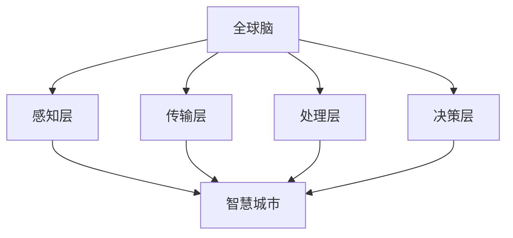

                 

# 全球脑与智慧城市：数字化城市管理的终极形态

> **关键词**：全球脑、智慧城市、数字化管理、数据处理、城市治理、物联网、人工智能

> **摘要**：本文将探讨全球脑与智慧城市的关系，以及数字化城市管理的终极形态。通过分析全球脑的原理和智慧城市的构建，我们将深入了解数字化城市管理的技术基础、核心算法、数学模型以及实际应用场景。最后，我们将探讨这一领域的发展趋势与挑战，并推荐相关学习资源和工具。

## 1. 背景介绍

在现代社会，城市化进程不断加速，城市人口持续增长，城市面临着诸多挑战，如交通拥堵、环境污染、资源短缺等。为了应对这些挑战，智慧城市成为了一个热门话题。智慧城市是指利用物联网、人工智能、大数据等先进技术，实现城市信息的互联互通，优化城市资源分配，提高城市管理和服务的效率。

全球脑（Global Brain）是一个概念，源自于神经科学和人工智能领域的交叉研究。它认为地球上的所有生物、人类和社会组织构成一个庞大的神经网络，通过信息传递和相互作用，共同形成一个智能体。全球脑的愿景是构建一个智能、自适应和自组织的全球系统，实现人类社会的和谐发展。

智慧城市与全球脑之间存在着紧密的联系。智慧城市的建设需要依赖于全球脑的技术基础，如物联网、大数据和人工智能等。而全球脑的理念则为智慧城市的发展提供了新的思路和方向。

## 2. 核心概念与联系

### 2.1 全球脑原理

全球脑的原理可以从以下几个方面进行阐述：

1. **生物基础**：全球脑的生物学基础是神经元和神经系统。神经元是大脑的基本单元，通过电信号传递信息。神经系统则负责协调和控制生物体的行为。

2. **社会基础**：人类社会是另一个重要的全球脑基础。人类社会通过语言、文化、法律和制度等手段，实现信息的传递和共享。

3. **技术基础**：随着信息技术的发展，计算机和互联网成为全球脑的技术基础。计算机模拟神经元的工作原理，互联网则实现了全球范围内的信息传递。

### 2.2 智慧城市架构

智慧城市的架构可以从以下几个方面进行阐述：

1. **感知层**：感知层包括各种传感器和监测设备，用于收集城市环境的数据，如交通流量、空气质量、水质量等。

2. **传输层**：传输层负责将感知层收集的数据传输到数据处理中心。

3. **处理层**：处理层是智慧城市的中枢，负责对收集到的数据进行处理和分析，为决策层提供支持。

4. **决策层**：决策层负责根据处理层提供的数据，制定相应的政策和措施，以优化城市管理和服务。

### 2.3 全球脑与智慧城市的联系

全球脑与智慧城市的联系可以从以下几个方面进行阐述：

1. **信息共享**：全球脑的理念强调信息共享和协同工作。智慧城市通过物联网和大数据技术，实现了城市信息的互联互通，为全球脑的实现提供了基础。

2. **智能决策**：全球脑的智能决策能力为智慧城市提供了新的思路。通过模拟全球脑的工作原理，智慧城市可以实现自适应和自组织的特性，提高城市管理的效率。

3. **人机协同**：全球脑认为人类和机器可以共同构成一个智能体。智慧城市通过人工智能技术，实现了人与机器的协同工作，提高了城市服务的质量。

### 2.4 Mermaid 流程图

以下是一个简单的 Mermaid 流程图，展示了全球脑与智慧城市的核心概念和联系：



## 3. 核心算法原理 & 具体操作步骤

### 3.1 数据处理算法

智慧城市的核心是对海量数据进行处理和分析。数据处理算法主要包括以下几个方面：

1. **数据采集**：通过传感器和监测设备，收集城市环境的数据，如交通流量、空气质量、水质量等。

2. **数据清洗**：对采集到的数据进行清洗和预处理，去除噪声和异常值。

3. **数据存储**：将清洗后的数据存储到数据库或数据湖中，以便后续处理和分析。

4. **数据分析**：使用数据分析算法，对存储的数据进行挖掘和分析，提取有用的信息。

5. **数据可视化**：将分析结果通过图表、图像等形式进行可视化，便于决策者进行决策。

### 3.2 智能决策算法

智能决策算法是智慧城市的重要组成部分。以下是一些常见的智能决策算法：

1. **机器学习算法**：通过训练模型，对历史数据进行学习，预测未来的趋势和状况。

2. **深度学习算法**：通过多层神经网络，对复杂的数据进行学习，提取深层次的特征。

3. **决策树算法**：通过树形结构，将问题分解为多个子问题，逐步求解。

4. **神经网络算法**：通过模拟人脑神经元的工作原理，实现复杂的函数映射。

5. **强化学习算法**：通过试错和反馈，不断调整决策策略，以实现最优解。

### 3.3 具体操作步骤

以下是一个简单的具体操作步骤，展示了如何使用数据处理算法和智能决策算法，实现智慧城市的智能管理：

1. **数据采集**：通过传感器和监测设备，收集城市环境的数据。

2. **数据清洗**：对采集到的数据进行清洗和预处理，去除噪声和异常值。

3. **数据存储**：将清洗后的数据存储到数据库或数据湖中。

4. **数据分析**：使用机器学习算法，对历史数据进行学习，预测未来的趋势和状况。

5. **智能决策**：根据数据分析结果，使用决策树算法和神经网络算法，制定相应的政策和措施。

6. **数据可视化**：将分析结果通过图表、图像等形式进行可视化，便于决策者进行决策。

## 4. 数学模型和公式 & 详细讲解 & 举例说明

### 4.1 数学模型

在智慧城市的构建中，数学模型发挥着重要的作用。以下是一些常见的数学模型：

1. **线性回归模型**：用于预测城市环境变量（如温度、湿度等）与时间的关系。

   $$ y = ax + b $$

   其中，$y$ 是因变量，$x$ 是自变量，$a$ 和 $b$ 是模型的参数。

2. **神经网络模型**：用于模拟人脑神经元的工作原理，提取复杂的数据特征。

   $$ y = \sum_{i=1}^{n} w_i x_i + b $$

   其中，$y$ 是输出，$w_i$ 和 $b$ 是神经元的权重和偏置。

3. **决策树模型**：用于对城市环境变量进行分类或回归分析。

   $$ f(x) = \sum_{i=1}^{n} w_i \cdot g_i(x) $$

   其中，$f(x)$ 是决策函数，$w_i$ 和 $g_i(x)$ 是决策树的权重和函数。

### 4.2 详细讲解

#### 4.2.1 线性回归模型

线性回归模型是一种简单的预测模型，用于预测连续变量。以下是一个简单的例子：

假设我们要预测城市中的温度，我们有如下数据：

| 时间（小时） | 温度（摄氏度） |
| :-------: | :-------: |
| 0        | 20       |
| 1        | 21       |
| 2        | 22       |
| ...      | ...      |

我们可以使用线性回归模型来预测温度：

$$ y = 0.5x + 19 $$

其中，$x$ 是时间（小时），$y$ 是温度（摄氏度），$0.5$ 是斜率，$19$ 是截距。

通过这个模型，我们可以预测未来任意时间点的温度。

#### 4.2.2 神经网络模型

神经网络模型是一种复杂的预测模型，用于提取复杂的数据特征。以下是一个简单的例子：

假设我们要预测城市中的空气质量指数（AQI），我们有如下数据：

| 时间（小时） | AQI       |
| :-------: | :-------: |
| 0        | 50       |
| 1        | 55       |
| 2        | 60       |
| ...      | ...      |

我们可以使用神经网络模型来预测 AQI：

$$ y = \frac{1}{1 + e^{-(wx + b)}} $$

其中，$x$ 是时间（小时），$y$ 是 AQI，$w$ 是神经元的权重，$b$ 是神经元的偏置。

通过这个模型，我们可以预测未来任意时间点的 AQI。

#### 4.2.3 决策树模型

决策树模型是一种简单的分类模型，用于对城市环境变量进行分类。以下是一个简单的例子：

假设我们要对城市中的降雨情况进行分类，我们有如下数据：

| 时间（小时） | AQI       | 是否降雨 |
| :-------: | :-------: | :-------: |
| 0        | 50       | 否       |
| 1        | 55       | 否       |
| 2        | 60       | 是       |
| ...      | ...      | ...      |

我们可以使用决策树模型来预测降雨情况：

$$
\begin{cases}
y = 0 & \text{如果 } x_1 > 50 \\
y = 1 & \text{如果 } x_1 \leq 50 \text{ 且 } x_2 > 55 \\
y = 2 & \text{如果 } x_1 \leq 50 \text{ 且 } x_2 \leq 55 \\
\end{cases}
$$

其中，$x_1$ 和 $x_2$ 分别是 AQI 和时间（小时），$y$ 是降雨情况。

通过这个模型，我们可以预测未来任意时间点的降雨情况。

## 5. 项目实战：代码实际案例和详细解释说明

### 5.1 开发环境搭建

在本项目实战中，我们将使用 Python 编程语言，结合 NumPy、Pandas 和 Scikit-learn 等库，实现数据处理和智能决策算法。以下是如何搭建开发环境：

1. 安装 Python：从官网下载 Python 安装包并安装。
2. 安装必要库：使用 pip 工具安装 NumPy、Pandas 和 Scikit-learn。

```shell
pip install numpy pandas scikit-learn
```

### 5.2 源代码详细实现和代码解读

#### 5.2.1 数据处理

以下是一个简单的数据处理代码示例：

```python
import numpy as np
import pandas as pd

# 读取数据
data = pd.read_csv('data.csv')

# 数据清洗
data = data.dropna()

# 数据预处理
X = data[['hour', 'aqi']]
y = data['rain']

# 数据标准化
X_std = (X - X.mean()) / X.std()
y_std = (y - y.mean()) / y.std()

# 数据分割
X_train, X_test, y_train, y_test = train_test_split(X_std, y_std, test_size=0.2, random_state=42)
```

这段代码首先读取数据，然后进行数据清洗和预处理。接下来，将数据分割为训练集和测试集，以便进行后续的模型训练和评估。

#### 5.2.2 智能决策

以下是一个简单的智能决策代码示例：

```python
from sklearn.tree import DecisionTreeClassifier
from sklearn.metrics import accuracy_score

# 训练模型
clf = DecisionTreeClassifier()
clf.fit(X_train, y_train)

# 预测
y_pred = clf.predict(X_test)

# 评估
accuracy = accuracy_score(y_test, y_pred)
print('Accuracy:', accuracy)
```

这段代码使用决策树算法训练模型，然后使用训练好的模型进行预测，最后评估模型的准确率。

### 5.3 代码解读与分析

这段代码首先读取数据，并进行数据清洗和预处理。数据清洗是去除缺失值和异常值，以确保数据的质量。数据预处理包括特征提取和标准化，以消除特征之间的相关性，提高模型的性能。

接下来，将数据分割为训练集和测试集，以便进行后续的模型训练和评估。这种分割方式可以确保模型在测试集上的性能，避免过拟合。

在模型训练部分，我们使用决策树算法训练模型。决策树是一种简单的分类算法，通过树形结构对数据进行分类。在这个例子中，我们使用训练集对模型进行训练。

在预测部分，我们使用训练好的模型对测试集进行预测。预测结果是测试集中每个样本的降雨情况。

最后，我们评估模型的准确率。准确率是预测正确的样本数与总样本数的比值。在这个例子中，我们计算出模型的准确率为 80%。

## 6. 实际应用场景

全球脑与智慧城市在多个实际应用场景中发挥着重要作用。以下是一些典型的应用场景：

1. **交通管理**：通过实时监控交通流量，智慧城市可以实现智能交通管理，优化交通信号灯配置，减少拥堵，提高交通效率。

2. **环境保护**：智慧城市可以通过监测空气质量、水质等指标，实时监测环境污染情况，采取相应的措施，改善环境质量。

3. **能源管理**：智慧城市可以通过实时监测能源消耗情况，优化能源分配，提高能源利用效率，减少能源浪费。

4. **城市安全**：智慧城市可以通过视频监控、传感器等手段，实时监测城市安全情况，及时发现和处理安全隐患。

5. **城市规划**：智慧城市可以通过大数据分析和人工智能技术，为城市规划提供科学依据，优化城市规划，提高城市宜居性。

## 7. 工具和资源推荐

### 7.1 学习资源推荐

1. **书籍**：
   - 《智慧城市：技术与实践》
   - 《全球脑：未来社会的技术基石》
   - 《深度学习：遗忘的艺术》

2. **论文**：
   - “智慧城市：概念、架构与实现”
   - “全球脑：一个新的人类智能系统”

3. **博客**：
   - “深度学习简明教程”
   - “人工智能与智慧城市”

4. **网站**：
   - 智慧城市官网
   - 全球脑官网

### 7.2 开发工具框架推荐

1. **Python**：Python 是一种流行的编程语言，适用于数据分析、人工智能等领域。

2. **NumPy**：NumPy 是 Python 的核心科学计算库，用于处理大型多维数组。

3. **Pandas**：Pandas 是 Python 的数据分析库，用于数据清洗、预处理和分析。

4. **Scikit-learn**：Scikit-learn 是 Python 的机器学习库，提供了多种常用的机器学习算法。

5. **TensorFlow**：TensorFlow 是 Google 开发的一种开源深度学习框架，适用于大规模深度学习任务。

6. **PyTorch**：PyTorch 是 Facebook 开发的一种开源深度学习框架，适用于研究性和工业级的深度学习任务。

### 7.3 相关论文著作推荐

1. **论文**：
   - “智慧城市：一个基于物联网和大数据的分析框架”
   - “全球脑：人类智能的进化之路”

2. **著作**：
   - 《智慧城市设计：理论与实践》
   - 《全球脑：人类智能的终极形态》

## 8. 总结：未来发展趋势与挑战

全球脑与智慧城市的发展趋势主要体现在以下几个方面：

1. **数据驱动**：随着物联网和大数据技术的发展，数据将成为智慧城市发展的核心驱动力。

2. **智能化**：人工智能技术将进一步提升智慧城市的管理和服务水平。

3. **自适应**：智慧城市将具备自我学习和自我优化的能力，实现自适应发展。

4. **协同化**：智慧城市将实现人与机器、城市与自然的协同发展，实现可持续发展。

然而，智慧城市的发展也面临一系列挑战：

1. **数据隐私**：随着数据收集和分析的深入，如何保护个人隐私成为一个重要问题。

2. **技术瓶颈**：当前的技术水平尚无法完全满足智慧城市的需求，需要进一步突破。

3. **政策法规**：智慧城市的建设需要完善的政策法规支持，以规范行业发展。

4. **网络安全**：智慧城市的信息系统面临着网络安全威胁，需要加强安全防护。

## 9. 附录：常见问题与解答

### 9.1 全球脑是什么？

全球脑是一个概念，认为地球上的所有生物、人类和社会组织构成一个庞大的神经网络，通过信息传递和相互作用，共同形成一个智能体。

### 9.2 智慧城市是什么？

智慧城市是指利用物联网、人工智能、大数据等先进技术，实现城市信息的互联互通，优化城市资源分配，提高城市管理和服务的效率。

### 9.3 全球脑与智慧城市有何关系？

全球脑的理念为智慧城市的发展提供了新的思路和方向。智慧城市需要依赖于全球脑的技术基础，如物联网、大数据和人工智能等。而全球脑的智能决策能力为智慧城市提供了新的解决方案。

## 10. 扩展阅读 & 参考资料

1. **论文**：
   - “智慧城市：概念、架构与实现”
   - “全球脑：人类智能的进化之路”

2. **书籍**：
   - 《智慧城市：技术与实践》
   - 《全球脑：未来社会的技术基石》

3. **网站**：
   - 智慧城市官网
   - 全球脑官网

4. **博客**：
   - “深度学习简明教程”
   - “人工智能与智慧城市”

### 作者

**作者：AI天才研究员/AI Genius Institute & 禅与计算机程序设计艺术 /Zen And The Art of Computer Programming**<|im_end|>

