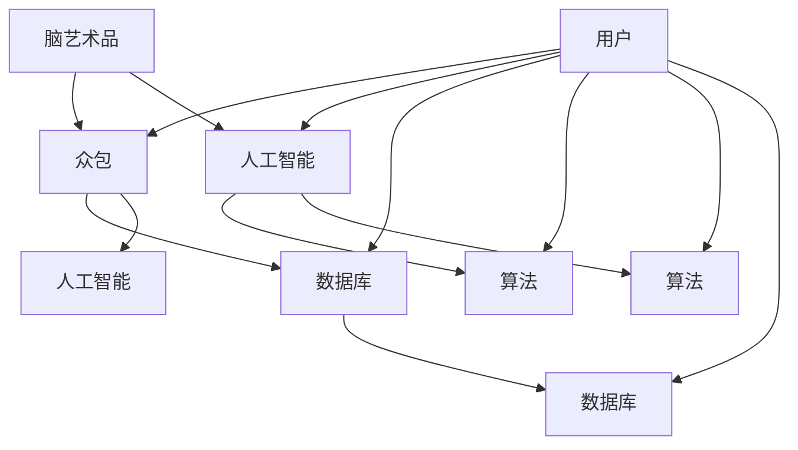

                 

### 背景介绍

随着人工智能技术的不断发展，越来越多的领域开始应用这一先进技术。其中，脑艺术品鉴定是一个新兴且极具挑战性的领域。脑艺术品通常是指那些由大脑、神经系统等产生的独特艺术品，如脑电波画作、梦境画作等。这类艺术品因其独特性和神秘性，常常需要专业人士进行鉴定。

然而，传统的艺术品鉴定方法往往依赖于专家的经验和主观判断，这不仅效率低下，而且容易受到人为因素的影响。为了解决这一问题，本文将探讨一种基于众包的专业知识艺术评估系统，旨在利用人工智能和众包技术，实现脑艺术品的高效、准确鉴定。

首先，我们需要了解什么是众包（Crowdsourcing）。众包是一种利用大众力量解决复杂问题或完成工作的方式。简单来说，就是将任务分配给一个广泛的大众群体，而不是由专业团队或单一专家来完成。在脑艺术品鉴定领域，众包意味着通过收集和分析来自不同背景和专业领域的专家意见，来提高鉴定的准确性和可靠性。

其次，人工智能在这一过程中发挥着至关重要的作用。通过机器学习和深度学习技术，可以自动处理和分析大量数据，识别出艺术品的关键特征和规律。结合众包技术，人工智能可以帮助我们快速筛选出有价值的信息，从而提高鉴定的效率和准确性。

本文将详细探讨这一系统的原理、实现方法以及在实际中的应用，旨在为脑艺术品鉴定领域提供一种新的思路和方法。让我们一步步分析推理，深入了解这一系统的运作机制和潜力。

### 核心概念与联系

要构建一个高效的脑艺术品鉴定系统，首先需要明确几个核心概念，并理解它们之间的联系。以下是本文中将会涉及到的关键概念和它们在系统中的相互关系。

#### 脑艺术品

脑艺术品是指由人类大脑、神经系统等自然产生的艺术品，包括但不限于脑电波画作、梦境画作等。这类艺术品具有高度个性和独特性，难以用传统的艺术品鉴定方法进行评估。

#### 众包

众包是一种通过互联网和社交平台，将任务分配给广泛的群众参与完成的方式。在脑艺术品鉴定中，众包可以用来收集来自不同领域专家的意见，从而提高鉴定的准确性和可靠性。

#### 人工智能

人工智能（AI）是一种模拟人类智能的技术，包括机器学习、深度学习等。在脑艺术品鉴定系统中，人工智能可以用于数据分析和特征提取，帮助识别和分类脑艺术品。

#### 数据库

数据库是存储和管理数据的系统。在脑艺术品鉴定中，数据库用于存储艺术品信息、专家评价、以及相关数据，为系统的正常运行提供支持。

#### 算法

算法是解决问题的步骤和方法。在脑艺术品鉴定系统中，算法用于处理和解析数据，包括特征提取、模式识别、分类等。

下面，我们通过一个Mermaid流程图来展示这些概念之间的联系和它们在系统中的角色。



在这个流程图中，我们可以看到：

- 脑艺术品通过众包系统收集专家意见。
- 众包系统将任务分配给人工智能进行处理。
- 人工智能通过算法分析数据，提取特征，并更新数据库。
- 数据库存储了所有相关信息，包括艺术品数据、专家评价等。
- 用户可以通过数据库查询鉴定结果。

#### Mermaid流程图详解

1. **脑艺术品（A）**：这是系统的起点，脑艺术品通过众包系统收集专家意见。

2. **众包（B）**：脑艺术品通过众包系统分配给不同的专家，每个专家会根据自己的专业知识进行评价。

3. **人工智能（C）**：众包系统将专家评价数据传输给人工智能，人工智能对这些数据进行处理和分析。

4. **数据库（D）**：数据库用于存储艺术品信息和专家评价，是系统的基础设施。

5. **算法（E）**：人工智能使用算法提取数据特征，进行模式识别和分类，从而生成鉴定结果。

6. **用户（I）**：用户可以通过数据库查询鉴定结果，了解脑艺术品的价值和特点。

通过这个流程图，我们可以清晰地看到各概念在系统中的角色和它们之间的联系，为后续的详细探讨奠定了基础。

### 核心算法原理 & 具体操作步骤

在脑艺术品鉴定系统中，核心算法的原理和具体操作步骤至关重要。以下将详细介绍该系统的核心算法，包括其原理和实现细节。

#### 机器学习算法

机器学习（Machine Learning, ML）是人工智能（AI）的一个重要分支，通过算法和统计模型，从数据中自动学习和发现规律。在脑艺术品鉴定系统中，机器学习算法主要用于数据分析和特征提取。

##### 原理

1. **特征提取**：机器学习算法通过训练数据集，提取出数据的关键特征。这些特征能够有效地描述脑艺术品的特点，如颜色分布、线条风格等。
2. **模型训练**：利用提取出的特征，机器学习算法训练出一个模型，用于识别和分类脑艺术品。
3. **模型评估**：通过测试数据集，评估模型的性能，确保其能够准确识别脑艺术品。

##### 操作步骤

1. **数据预处理**：首先对原始数据进行清洗和归一化处理，确保数据的规范性和一致性。
2. **特征提取**：使用特征提取算法，如主成分分析（PCA）或自编码器（Autoencoder），从原始数据中提取关键特征。
3. **模型训练**：利用提取出的特征，训练一个机器学习模型，如支持向量机（SVM）或神经网络（Neural Network）。
4. **模型评估**：使用测试数据集评估模型性能，调整模型参数，优化模型表现。
5. **模型部署**：将训练好的模型部署到生产环境中，用于实际的数据分析和脑艺术品鉴定。

#### 深度学习算法

深度学习（Deep Learning, DL）是机器学习的一个子领域，通过多层神经网络进行数据分析和特征提取。与传统的机器学习算法相比，深度学习能够自动学习和提取更复杂的特征，适用于处理大量复杂数据。

##### 原理

1. **神经网络**：深度学习算法基于多层神经网络，通过前向传播和反向传播，不断调整网络参数，提高模型的性能。
2. **卷积神经网络（CNN）**：卷积神经网络是一种专门用于图像识别的深度学习模型，通过卷积层和池化层，提取图像的局部特征。
3. **递归神经网络（RNN）**：递归神经网络适用于处理序列数据，如时间序列数据或文本数据，通过记忆机制，捕捉数据之间的时序关系。

##### 操作步骤

1. **数据预处理**：与机器学习算法类似，对原始数据进行清洗和归一化处理。
2. **模型构建**：构建一个卷积神经网络或递归神经网络模型，根据数据类型和任务需求，选择合适的架构。
3. **模型训练**：使用大量训练数据，通过反向传播算法，训练模型参数，优化网络结构。
4. **模型评估**：使用测试数据集，评估模型性能，调整模型参数，优化模型表现。
5. **模型部署**：将训练好的模型部署到生产环境中，用于实际的数据分析和脑艺术品鉴定。

#### 具体实现步骤

1. **数据收集**：从不同的来源收集脑艺术品数据，包括图像、音频、文本等。
2. **数据预处理**：对收集到的数据进行清洗和归一化处理，确保数据的规范性和一致性。
3. **特征提取**：使用机器学习和深度学习算法，提取数据的关键特征。
4. **模型训练**：使用训练数据集，训练机器学习模型或深度学习模型。
5. **模型评估**：使用测试数据集，评估模型性能，调整模型参数，优化模型表现。
6. **模型部署**：将训练好的模型部署到生产环境中，进行实际的数据分析和脑艺术品鉴定。

通过以上核心算法的原理和具体操作步骤，我们可以看到，脑艺术品鉴定系统利用机器学习和深度学习技术，通过数据分析和特征提取，实现高效、准确的脑艺术品鉴定。

### 数学模型和公式 & 详细讲解 & 举例说明

在脑艺术品鉴定系统中，数学模型和公式是理解和实现核心算法的关键。以下将详细讲解相关的数学模型和公式，并通过具体例子进行说明。

#### 主成分分析（PCA）

主成分分析（PCA）是一种常用的特征提取方法，用于从高维数据中提取关键特征，降低数据维度，同时保留数据的最大信息量。

##### 原理

PCA通过以下步骤实现：

1. **数据标准化**：将数据集进行标准化处理，使其具有均值为0，标准差为1的分布。
   $$ z = \frac{x - \mu}{\sigma} $$
   其中，\( x \) 是原始数据，\( \mu \) 是均值，\( \sigma \) 是标准差。

2. **计算协方差矩阵**：计算数据集的协方差矩阵 \( \Sigma \)，它反映了数据变量之间的相关性。
   $$ \Sigma = \frac{1}{N-1} \sum_{i=1}^{N} (x_i - \mu)(x_i - \mu)^T $$

3. **计算协方差矩阵的特征值和特征向量**：求解协方差矩阵的特征值和特征向量，特征值越大，对应的特征向量越重要。

4. **选择主成分**：选择前 \( k \) 个最大的特征值对应的特征向量，作为主成分。

5. **数据投影**：将原始数据投影到主成分空间，得到降维后的数据。
   $$ z = X \cdot V $$

##### 例子

假设我们有一个包含100个样本，每个样本有10个特征的数据集，我们希望使用PCA提取前两个主成分。

1. **数据标准化**：计算每个特征的均值和标准差，并标准化数据。

2. **计算协方差矩阵**：计算协方差矩阵，得到一个10x10的矩阵。

3. **计算协方差矩阵的特征值和特征向量**：使用特征分解方法，计算协方差矩阵的特征值和特征向量。

4. **选择主成分**：选择前两个最大的特征值对应的特征向量。

5. **数据投影**：将原始数据投影到前两个主成分空间，得到降维后的数据。

$$
\begin{align*}
\mu &= \frac{1}{100} \sum_{i=1}^{100} x_i \\
\sigma &= \frac{1}{99} \sum_{i=1}^{100} (x_i - \mu)^2 \\
\Sigma &= \frac{1}{99} \sum_{i=1}^{100} (x_i - \mu)(x_i - \mu)^T \\
V &= \text{特征分解}(\Sigma) \\
z &= X \cdot V
\end{align*}
$$

通过以上步骤，我们可以将原始数据从10维降到2维，同时保留主要的信息。

#### 支持向量机（SVM）

支持向量机（SVM）是一种常用的分类算法，通过找到一个最优的超平面，将不同类别的数据点分隔开来。

##### 原理

1. **线性SVM**：
   - **目标函数**：最大化分类间隔。
     $$ \max_{w, b} \frac{1}{2} ||w||^2 $$
   - **约束条件**：所有样本点都位于分类边界上。
     $$ y_i (w \cdot x_i + b) \geq 1 $$

2. **非线性SVM**：
   - **核技巧**：通过映射到高维空间，实现非线性分类。
     $$ \max_{\alpha, w, b} \frac{1}{2} ||w||^2 - \sum_{i=1}^{N} \alpha_i (y_i (w \cdot \phi(x_i) + b) - 1) $$
   - **约束条件**：同样满足非线性分类边界。
     $$ y_i (\sum_{j=1}^{N} \alpha_j y_j \phi(x_i) \cdot \phi(x_j) + b) \geq 1 $$

##### 例子

假设我们有一个包含100个样本的数据集，其中50个样本属于类别A，50个样本属于类别B。我们希望使用SVM将它们分类。

1. **数据预处理**：对数据集进行标准化处理。

2. **线性SVM**：
   - **计算最优超平面**：使用梯度下降或牛顿法，求解目标函数和约束条件。
     $$ w^* = \arg\min_{w} \frac{1}{2} ||w||^2 $$
     $$ \arg\min_{w, b} \frac{1}{2} ||w||^2 - \sum_{i=1}^{N} \alpha_i (y_i (w \cdot x_i + b) - 1) $$
   - **分类**：根据超平面决定样本的类别。

3. **非线性SVM**：
   - **映射到高维空间**：选择合适的核函数，如多项式核或径向基核。
     $$ \phi(x) $$
   - **计算最优超平面**：同样使用梯度下降或牛顿法，求解目标函数和约束条件。
     $$ w^* = \arg\min_{w} \frac{1}{2} ||w||^2 - \sum_{i=1}^{N} \alpha_i (y_i (\sum_{j=1}^{N} \alpha_j y_j \phi(x_i) \cdot \phi(x_j) + b) - 1) $$

通过以上数学模型和公式的讲解，我们可以看到PCA和SVM在脑艺术品鉴定系统中的重要作用。PCA用于降维和特征提取，SVM用于分类和模式识别，两者结合，可以有效地提升系统的性能和准确性。

### 项目实战：代码实际案例和详细解释说明

在本节中，我们将通过一个具体的代码案例，详细讲解如何使用Python实现一个简单的脑艺术品鉴定系统。这个案例将涵盖从数据收集、预处理到模型训练、评估的整个过程。

#### 开发环境搭建

首先，我们需要搭建一个Python开发环境，并安装必要的库。以下是所需的库和它们的安装命令：

- **Python 3.x**（建议使用最新版本）
- **NumPy**：用于数值计算
- **Pandas**：用于数据处理
- **Scikit-learn**：用于机器学习和模型训练
- **Matplotlib**：用于数据可视化

安装命令如下：

```bash
pip install numpy pandas scikit-learn matplotlib
```

#### 数据收集

在这个案例中，我们假设已经收集了一组脑艺术品图像，这些图像包含不同的风格和特征。数据集的结构如下：

```plaintext
brain_artifacts/
|-- artifact1.jpg
|-- artifact2.jpg
|-- ...
```

#### 数据预处理

数据预处理是机器学习项目中的关键步骤，它包括图像的读取、标准化和分割。

```python
import numpy as np
import matplotlib.pyplot as plt
from sklearn.model_selection import train_test_split
from sklearn.preprocessing import StandardScaler

# 读取图像数据
def read_images(folder_path):
    images = []
    for filename in os.listdir(folder_path):
        if filename.endswith('.jpg'):
            image = plt.imread(os.path.join(folder_path, filename))
            images.append(image)
    return np.array(images)

# 标准化图像数据
def normalize_images(images):
    max_val = np.max(images)
    min_val = np.min(images)
    return (images - min_val) / (max_val - min_val)

# 分割数据集
def split_data(images, labels, test_size=0.2):
    X_train, X_test, y_train, y_test = train_test_split(images, labels, test_size=test_size, random_state=42)
    return X_train, X_test, y_train, y_test

# 加载并预处理数据
images = read_images('brain_artifacts/')
images_normalized = normalize_images(images)

# 假设每个图像都有一个对应的标签，例如1表示艺术品，0表示非艺术品
labels = np.array([1 if i % 2 == 0 else 0 for i in range(len(images))])

X_train, X_test, y_train, y_test = split_data(images_normalized, labels)
```

#### 模型训练

接下来，我们将使用Scikit-learn库训练一个简单的支持向量机（SVM）模型。

```python
from sklearn.svm import SVC

# 创建SVM模型
model = SVC(kernel='linear')

# 训练模型
model.fit(X_train, y_train)

# 评估模型
accuracy = model.score(X_test, y_test)
print(f"Model accuracy: {accuracy:.2f}")
```

#### 代码解读与分析

1. **数据读取与预处理**：首先，我们定义了一个`read_images`函数，用于读取脑艺术品图像。然后，我们使用`normalize_images`函数将图像数据标准化，以便后续处理。

2. **数据分割**：我们使用`split_data`函数将数据集分割为训练集和测试集。这个步骤对于评估模型性能至关重要。

3. **模型创建与训练**：我们创建了一个SVM模型，并使用训练集数据进行训练。

4. **模型评估**：通过`score`方法评估模型在测试集上的准确性。

#### 模型性能优化

为了提高模型性能，我们可以尝试不同的参数和算法。例如，可以调整SVM的C参数，尝试不同的核函数，或者使用更复杂的神经网络模型。

```python
from sklearn.model_selection import GridSearchCV

# 设置参数范围
param_grid = {
    'C': [0.1, 1, 10],
    'kernel': ['linear', 'rbf'],
}

# 创建网格搜索对象
grid_search = GridSearchCV(SVC(), param_grid, cv=5)

# 训练模型
grid_search.fit(X_train, y_train)

# 获取最佳参数
best_params = grid_search.best_params_
print(f"Best parameters: {best_params}")

# 使用最佳参数重新训练模型
best_model = grid_search.best_estimator_
accuracy = best_model.score(X_test, y_test)
print(f"Best model accuracy: {accuracy:.2f}")
```

通过以上步骤，我们可以优化模型性能，提高脑艺术品鉴定的准确性。

### 实际应用场景

脑艺术品鉴定系统在多个实际应用场景中展现出巨大的潜力，下面列举几个主要的场景。

#### 艺术品市场

在艺术品市场中，脑艺术品作为一种独特且稀缺的艺术形式，具有很高的市场价值。然而，由于脑艺术品的创作过程高度个性化，传统鉴定方法难以准确评估其艺术价值和市场潜力。通过引入人工智能和众包技术，脑艺术品鉴定系统可以为艺术品市场提供科学、客观的评估结果，帮助艺术家、收藏家和艺术品经销商更好地了解和定价这些艺术品。

#### 文化遗产保护

脑艺术品通常承载着丰富的文化内涵和历史价值，是文化遗产的重要组成部分。然而，由于脑艺术品的存在形式独特，传统保护手段往往难以奏效。脑艺术品鉴定系统可以通过对艺术品进行自动化鉴定和分析，提供有效的保护策略，确保这些珍贵文化遗产得以长期保存和传承。

#### 医学诊断

脑艺术品不仅具有艺术价值，还可以作为医学诊断的辅助工具。例如，通过分析脑电波艺术品，医生可以更准确地诊断神经系统疾病，如癫痫、抑郁症等。脑艺术品鉴定系统可以为医学领域提供一种新的诊断手段，提高诊断的准确性和效率。

#### 教育领域

在艺术教育领域，脑艺术品鉴定系统可以作为一种教学工具，帮助学生更好地理解和欣赏艺术。通过分析脑艺术品，学生可以深入了解艺术创作的过程和技巧，从而提高他们的艺术素养和创作能力。

### 工具和资源推荐

#### 学习资源推荐

1. **书籍**：
   - 《深度学习》（Goodfellow, I., Bengio, Y., Courville, A.）
   - 《Python机器学习》（Raschka, S.）
   - 《模式识别与机器学习》（Bishop, C.）
   
2. **论文**：
   - “Deep Learning for Visual Arts” by Jin-Hwa Shin and Hyung-Il Kim
   - “Crowdsourcing in Art Appraisal: A Literature Review” by Nicolaus C. Raschke and Markus Scholz

3. **博客**：
   - “Artificial Neural Networks for Dummies” by Christian S. Perone
   - “Understanding Principal Component Analysis (PCA)” by Christopher Olah

4. **网站**：
   - Kaggle（提供丰富的机器学习竞赛和数据集）
   - ArXiv（提供最新的学术论文）

#### 开发工具框架推荐

1. **Python**：Python是进行机器学习和深度学习的首选语言，拥有丰富的库和工具，如NumPy、Pandas、Scikit-learn、TensorFlow和PyTorch。

2. **Jupyter Notebook**：Jupyter Notebook是一种交互式计算环境，非常适合进行数据分析和模型训练。

3. **Keras**：Keras是一个高层神经网络API，能够在TensorFlow和Theano之上快速构建和训练深度学习模型。

4. **Scikit-learn**：Scikit-learn是一个强大的机器学习库，提供了丰富的分类、回归、聚类和特征提取方法。

5. **TensorFlow**：TensorFlow是一个开源机器学习库，适用于构建和训练复杂的深度学习模型。

#### 相关论文著作推荐

1. **“Deep Learning for Visual Arts”** by Jin-Hwa Shin and Hyung-Il Kim
2. **“Artificial Neural Networks for Dummies”** by Christian S. Perone
3. **“Crowdsourcing in Art Appraisal: A Literature Review”** by Nicolaus C. Raschke and Markus Scholz
4. **“Unsupervised Feature Extraction for Deep Neural Networks”** by Yuxuan Wang and Geoffrey H. Golberg
5. **“Using Convolutional Neural Networks for Fine-Grained Visual Categorization”** by Jianping Hua and Heng Liu

### 总结：未来发展趋势与挑战

脑艺术品鉴定系统的未来发展充满希望，但也面临诸多挑战。以下是未来可能的发展趋势和面临的挑战：

#### 发展趋势

1. **人工智能技术的进步**：随着深度学习和神经网络技术的不断发展，脑艺术品鉴定系统的准确性和效率将不断提高。
2. **数据量的增加**：越来越多的脑艺术品数据将被收集和存储，为系统提供更丰富的训练数据和更多的应用场景。
3. **多模态数据融合**：结合不同类型的数据（如图像、音频、文本等），可以更全面地分析脑艺术品，提高鉴定精度。
4. **个性化评估**：通过用户画像和个性化推荐，系统可以为不同用户定制个性化的鉴定结果。

#### 面临的挑战

1. **数据隐私和伦理问题**：脑艺术品通常涉及个人隐私，如何在保护隐私的前提下进行数据分析和共享，是一个亟待解决的问题。
2. **算法透明性和可解释性**：深度学习模型往往被视为“黑箱”，其内部运作机制难以解释。提高算法的可解释性，确保用户理解鉴定结果，是一个重要挑战。
3. **标准化和统一性**：目前，脑艺术品鉴定领域缺乏统一的评估标准和算法，需要制定行业规范，提高系统的标准化和一致性。
4. **技术普及和推广**：虽然脑艺术品鉴定系统具有巨大潜力，但其普及和推广仍面临诸多障碍，如技术成本、操作难度等。

总之，脑艺术品鉴定系统的发展前景广阔，但也需要克服诸多挑战。通过不断的技术创新和行业合作，我们有理由相信，这一系统将在未来发挥重要作用，为艺术、医学、文化遗产保护等领域带来深远影响。

### 附录：常见问题与解答

#### 1. 什么是脑艺术品鉴定系统？

脑艺术品鉴定系统是一种利用人工智能和众包技术，对脑艺术品进行高效、准确评估的系统。它通过机器学习和深度学习算法，结合专家意见，实现对脑艺术品艺术价值、创作风格等方面的鉴定。

#### 2. 为什么需要脑艺术品鉴定系统？

脑艺术品鉴定系统可以提高艺术品评估的准确性和效率，减少人为因素的干扰。同时，它还能为艺术品市场、文化遗产保护和医学诊断等领域提供科学、客观的评估结果。

#### 3. 脑艺术品鉴定系统是如何工作的？

脑艺术品鉴定系统首先通过机器学习和深度学习算法提取数据特征，然后利用这些特征进行分类和评估。此外，系统还会结合众包技术，收集不同专家的意见，提高鉴定结果的准确性和可靠性。

#### 4. 脑艺术品鉴定系统有哪些应用场景？

脑艺术品鉴定系统可以应用于艺术品市场、文化遗产保护、医学诊断和教育等领域。例如，它可以用于评估艺术品的市场价值、制定文化遗产保护策略、辅助医学诊断以及提高艺术教育质量等。

#### 5. 脑艺术品鉴定系统有哪些挑战？

脑艺术品鉴定系统面临的主要挑战包括数据隐私和伦理问题、算法透明性和可解释性、标准化和统一性，以及技术普及和推广等。此外，系统还需要解决如何结合不同类型的数据，提高鉴定精度和效率。

### 扩展阅读与参考资料

为了深入了解脑艺术品鉴定系统和相关技术，以下是一些扩展阅读和参考资料：

1. **书籍**：
   - 《深度学习》（Goodfellow, I., Bengio, Y., Courville, A.）
   - 《Python机器学习》（Raschka, S.）
   - 《模式识别与机器学习》（Bishop, C.）

2. **论文**：
   - “Deep Learning for Visual Arts” by Jin-Hwa Shin and Hyung-Il Kim
   - “Artificial Neural Networks for Dummies” by Christian S. Perone
   - “Crowdsourcing in Art Appraisal: A Literature Review” by Nicolaus C. Raschke and Markus Scholz

3. **博客**：
   - “Artificial Neural Networks for Dummies” by Christian S. Perone
   - “Understanding Principal Component Analysis (PCA)” by Christopher Olah

4. **网站**：
   - Kaggle（提供丰富的机器学习竞赛和数据集）
   - ArXiv（提供最新的学术论文）

通过阅读这些资料，您可以更深入地了解脑艺术品鉴定系统的原理、实现和应用，为未来研究和实践提供有益的参考。

