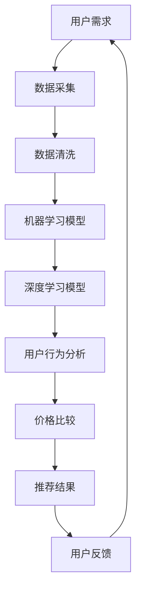

                 

# 全网比价：AI如何帮助用户找到最优惠的购买渠道

## 摘要

本文将探讨如何利用人工智能（AI）技术，特别是机器学习（Machine Learning）和深度学习（Deep Learning）方法，帮助用户实现全网比价，从而找到最优惠的购买渠道。我们将从背景介绍、核心概念、算法原理、数学模型、项目实战、应用场景、工具推荐以及未来发展趋势等多个角度深入分析，旨在为读者提供全面的技术解读和实际应用指导。

## 目录

1. 背景介绍
2. 核心概念与联系
3. 核心算法原理 & 具体操作步骤
4. 数学模型和公式 & 详细讲解 & 举例说明
5. 项目实战：代码实际案例和详细解释说明
   5.1 开发环境搭建
   5.2 源代码详细实现和代码解读
   5.3 代码解读与分析
6. 实际应用场景
7. 工具和资源推荐
   7.1 学习资源推荐
   7.2 开发工具框架推荐
   7.3 相关论文著作推荐
8. 总结：未来发展趋势与挑战
9. 附录：常见问题与解答
10. 扩展阅读 & 参考资料

## 1. 背景介绍

随着互联网和电子商务的快速发展，网上购物已成为人们日常生活中不可或缺的一部分。然而，面对海量的商品信息和各式各样的促销活动，用户常常感到无从下手，难以找到最优惠的购买渠道。全网比价作为解决这一问题的有效手段，越来越受到用户的关注。

传统的全网比价方法主要依赖于搜索引擎和手动搜索，效率较低且易出错。而人工智能技术的崛起，为全网比价带来了全新的解决方案。通过机器学习和深度学习算法，AI能够自动识别和比较商品信息，快速找到最优惠的购买渠道，提高用户的购物体验。

本文将重点探讨以下内容：

- AI在全网比价中的应用及其重要性
- 机器学习和深度学习算法在全网比价中的具体实现方法
- 数学模型和公式的应用，以及如何通过代码实现全网比价
- 全网比价在实际应用场景中的效果和案例
- 未来全网比价技术的发展趋势和挑战

通过以上内容的探讨，我们希望为读者提供一个全面的技术解读和实际应用指导，帮助用户更好地利用AI技术实现全网比价。

## 2. 核心概念与联系

要深入理解AI在全网比价中的应用，首先需要明确一些核心概念，并了解它们之间的联系。

### 2.1 人工智能（Artificial Intelligence，AI）

人工智能是指通过计算机程序模拟人类智能的技术。它包括多个子领域，如机器学习、深度学习、自然语言处理等。在全网比价中，人工智能技术主要应用于数据分析和决策支持。

### 2.2 机器学习（Machine Learning，ML）

机器学习是人工智能的一个重要分支，它通过算法模型从数据中学习规律，从而进行预测和决策。在全网比价中，机器学习算法用于分析商品信息、用户行为以及价格变动趋势。

### 2.3 深度学习（Deep Learning，DL）

深度学习是机器学习的一个子领域，它通过构建多层神经网络模型，实现对复杂数据的自动特征提取和分类。在全网比价中，深度学习算法用于处理大规模商品数据和用户行为数据，以提高比价的准确性和效率。

### 2.4 数据挖掘（Data Mining，DM）

数据挖掘是另一项重要的技术，它通过挖掘和分析大量数据，发现数据中的潜在规律和关联。在全网比价中，数据挖掘用于提取商品价格、促销信息和用户行为等关键数据，为机器学习和深度学习算法提供输入。

### 2.5 价格比较（Price Comparison）

价格比较是指通过比较不同渠道的商品价格，为用户推荐最优惠的购买渠道。在全网比价中，价格比较是一个核心任务，它需要利用机器学习和深度学习算法，从海量数据中识别和提取有用信息。

### 2.6 用户行为分析（User Behavior Analysis）

用户行为分析是指通过分析用户的购物行为、浏览历史和评论等数据，了解用户需求和偏好。在全网比价中，用户行为分析用于个性化推荐和优化比价结果，以提高用户体验。

### 2.7 大数据（Big Data）

大数据是指海量、多样、高速增长的数据。在全网比价中，大数据技术用于存储、处理和分析海量商品信息和用户行为数据，为机器学习和深度学习算法提供数据支持。

### 2.8 云计算（Cloud Computing）

云计算是一种通过网络提供计算资源的服务，它能够为全网比价系统提供强大的计算能力和存储空间。在全网比价中，云计算技术用于处理大规模数据分析和模型训练。

### 2.9 物联网（Internet of Things，IoT）

物联网是指通过互联网连接各种物理设备和传感器，实现设备间的信息交换和协同工作。在全网比价中，物联网技术可用于实时获取商品库存和价格信息，提高比价的实时性和准确性。

通过以上核心概念的联系，我们可以看出，AI在全网比价中发挥着至关重要的作用。它不仅能够自动识别和比较商品价格，还能分析用户行为和市场需求，为用户提供个性化、精准的购买建议。

### 2.10 Mermaid 流程图（Mermaid Flowchart）

以下是一个简化的全网比价系统流程图，展示了各个核心概念之间的联系：



在这个流程图中，用户需求驱动数据采集，经过数据清洗后，分别输入到机器学习模型和深度学习模型中。模型训练和优化后，结合用户行为分析，生成最优的价格比较和推荐结果，最终返回给用户，形成一个闭环系统。

通过以上内容的介绍，我们为后续章节的详细探讨奠定了基础。在接下来的内容中，我们将进一步深入分析AI在全网比价中的应用原理和实现方法。

## 3. 核心算法原理 & 具体操作步骤

### 3.1 机器学习算法

机器学习算法在全网比价中主要用于数据分析和预测。以下是一些常见的机器学习算法及其在全网比价中的应用：

#### 3.1.1线性回归（Linear Regression）

线性回归是一种简单的机器学习算法，它通过建立线性模型来预测连续值。在全网比价中，线性回归可以用于预测商品价格的趋势和变化。

**具体操作步骤：**

1. **数据准备**：收集商品历史价格数据。
2. **数据预处理**：对数据进行归一化处理，消除量纲影响。
3. **模型训练**：使用历史价格数据训练线性回归模型。
4. **模型评估**：使用验证集评估模型性能，调整模型参数。
5. **价格预测**：使用训练好的模型预测未来商品价格。

#### 3.1.2 决策树（Decision Tree）

决策树是一种树形结构的分类算法，它通过一系列规则将数据分割成不同的区域，以实现分类或回归目标。在全网比价中，决策树可以用于分类商品类别和识别价格趋势。

**具体操作步骤：**

1. **数据准备**：收集商品描述和价格数据。
2. **数据预处理**：对数据进行编码和标准化处理。
3. **模型训练**：使用训练数据构建决策树模型。
4. **模型评估**：使用验证集评估模型性能。
5. **分类预测**：使用训练好的模型对未知数据进行分类预测。

#### 3.1.3 支持向量机（Support Vector Machine，SVM）

支持向量机是一种强大的分类算法，它通过寻找最优超平面，将不同类别的数据分隔开。在全网比价中，SVM可以用于分类商品类别和预测价格。

**具体操作步骤：**

1. **数据准备**：收集商品描述和价格数据。
2. **数据预处理**：对数据进行编码和标准化处理。
3. **模型训练**：使用训练数据训练SVM模型。
4. **模型评估**：使用验证集评估模型性能。
5. **分类预测**：使用训练好的模型对未知数据进行分类预测。

### 3.2 深度学习算法

深度学习算法在全网比价中主要用于特征提取和模型预测。以下是一些常见的深度学习算法及其在全网比价中的应用：

#### 3.2.1 卷积神经网络（Convolutional Neural Network，CNN）

卷积神经网络是一种强大的图像处理算法，它通过卷积操作提取图像特征。在全网比价中，CNN可以用于提取商品图片特征，从而辅助价格预测。

**具体操作步骤：**

1. **数据准备**：收集商品图片数据。
2. **数据预处理**：对图片进行归一化和裁剪处理。
3. **模型训练**：使用训练数据训练CNN模型。
4. **模型评估**：使用验证集评估模型性能。
5. **特征提取**：使用训练好的模型提取商品图片特征。

#### 3.2.2 递归神经网络（Recurrent Neural Network，RNN）

递归神经网络是一种适用于序列数据的深度学习算法，它通过循环连接实现序列数据的建模。在全网比价中，RNN可以用于分析用户行为序列，从而预测用户兴趣和购买倾向。

**具体操作步骤：**

1. **数据准备**：收集用户行为数据。
2. **数据预处理**：对数据进行编码和标准化处理。
3. **模型训练**：使用训练数据训练RNN模型。
4. **模型评估**：使用验证集评估模型性能。
5. **兴趣预测**：使用训练好的模型预测用户兴趣。

#### 3.2.3 生成对抗网络（Generative Adversarial Network，GAN）

生成对抗网络是一种基于对抗训练的深度学习算法，它通过生成器和判别器的对抗训练实现数据的生成。在全网比价中，GAN可以用于生成商品价格分布图，从而分析市场趋势。

**具体操作步骤：**

1. **数据准备**：收集商品价格数据。
2. **数据预处理**：对数据进行归一化处理。
3. **模型训练**：使用训练数据训练GAN模型。
4. **模型评估**：使用验证集评估模型性能。
5. **价格分布预测**：使用训练好的模型生成商品价格分布图。

通过以上核心算法的介绍和具体操作步骤，我们可以看到，AI在全网比价中发挥着重要作用。这些算法不仅能够自动识别和比较商品价格，还能分析用户行为和市场趋势，为用户提供个性化、精准的购买建议。

## 4. 数学模型和公式 & 详细讲解 & 举例说明

### 4.1 机器学习模型

在全网比价中，机器学习模型是实现价格预测和分类的关键。以下介绍几种常用的机器学习模型及其相关的数学模型和公式。

#### 4.1.1 线性回归模型

线性回归模型是一种简单的机器学习模型，它通过拟合一个线性模型来预测连续值。

**数学模型：**

$$
y = \beta_0 + \beta_1x_1 + \beta_2x_2 + ... + \beta_nx_n
$$

其中，$y$ 是预测值，$x_1, x_2, ..., x_n$ 是特征值，$\beta_0, \beta_1, ..., \beta_n$ 是模型参数。

**举例说明：**

假设我们有一个商品的价格预测模型，其中特征包括商品类型（$x_1$）和商品销量（$x_2$）。根据历史数据，我们得到以下线性回归模型：

$$
价格 = 10 + 2 \times 类型 + 5 \times 销量
$$

当输入一个新的商品数据时，如商品类型为1，销量为100，我们可以计算出该商品的价格预测值：

$$
价格 = 10 + 2 \times 1 + 5 \times 100 = 510
$$

#### 4.1.2 决策树模型

决策树模型是一种树形结构的机器学习模型，它通过一系列规则将数据分割成不同的区域，以实现分类或回归目标。

**数学模型：**

决策树模型没有直接的数学公式，但可以通过以下步骤构建：

1. **选择最佳分割点**：选择能够最大化信息增益或最小化基尼不纯度的特征和分割点。
2. **构建树结构**：根据选择的分割点，将数据划分为不同的子集，并递归地构建树结构。

**举例说明：**

假设我们有一个二分类问题，数据集包含特征 $x_1, x_2$ 和标签 $y$。我们可以通过以下步骤构建决策树模型：

1. **选择最佳分割点**：计算每个特征的信息增益或基尼不纯度，选择最佳分割点。
2. **划分数据集**：根据最佳分割点，将数据集划分为两个子集。
3. **递归构建树结构**：对每个子集，重复步骤1和2，直到满足停止条件（如最大树深度、最小样本数量等）。

通过决策树模型，我们可以根据新的特征值预测标签。例如，对于一个新样本 $x_1 = 3, x_2 = 5$，我们可以根据决策树模型预测其标签：

- 选择最佳分割点：特征 $x_1$，分割点为2
- 划分数据集：子集1（$x_1 < 2$），子集2（$x_1 \geq 2$）
- 预测标签：子集1的标签为0，子集2的标签为1
- 最终预测：新样本 $x_1 = 3, x_2 = 5$ 的标签为1

#### 4.1.3 支持向量机模型

支持向量机模型是一种强大的分类算法，它通过寻找最优超平面来实现数据的分类。

**数学模型：**

$$
w \cdot x + b = 0
$$

其中，$w$ 是权重向量，$x$ 是特征向量，$b$ 是偏置项。

**举例说明：**

假设我们有一个二分类问题，数据集包含特征 $x_1, x_2$ 和标签 $y$。我们可以通过以下步骤构建支持向量机模型：

1. **选择核函数**：选择适当的核函数（如线性核、多项式核、径向基函数核等）。
2. **求解最优超平面**：使用支持向量机优化算法（如SVM优化算法）求解最优超平面。
3. **分类预测**：对于新的特征向量 $x$，计算其与超平面的距离，并根据距离判断标签。

例如，对于一个新样本 $x_1 = 3, x_2 = 5$，我们可以通过以下步骤使用支持向量机模型预测其标签：

1. **选择核函数**：线性核
2. **求解最优超平面**：通过SVM优化算法找到最优超平面
3. **分类预测**：计算新样本 $x_1 = 3, x_2 = 5$ 与超平面的距离，根据距离判断其标签

### 4.2 深度学习模型

在全网比价中，深度学习模型主要用于特征提取和复杂预测。以下介绍几种常用的深度学习模型及其相关的数学模型和公式。

#### 4.2.1 卷积神经网络模型

卷积神经网络模型是一种强大的图像处理模型，它通过卷积操作提取图像特征。

**数学模型：**

$$
h_l = \sigma(\theta_l \cdot h_{l-1} + b_l)
$$

其中，$h_l$ 是第 $l$ 层的输出，$\sigma$ 是激活函数，$\theta_l$ 是权重矩阵，$b_l$ 是偏置项。

**举例说明：**

假设我们有一个卷积神经网络模型，包含两个卷积层和一个全连接层。我们可以通过以下步骤构建模型：

1. **卷积层**：应用卷积操作提取特征
2. **激活函数**：使用ReLU函数（$\sigma(x) = \max(0, x)$）进行非线性变换
3. **全连接层**：应用全连接层进行分类或回归预测

例如，对于一个商品图片，我们可以通过以下步骤使用卷积神经网络模型进行预测：

1. **卷积层1**：应用卷积操作提取特征，得到特征图
2. **激活函数1**：使用ReLU函数进行非线性变换
3. **卷积层2**：应用卷积操作提取特征，得到特征图
4. **激活函数2**：使用ReLU函数进行非线性变换
5. **全连接层**：应用全连接层进行分类或回归预测

#### 4.2.2 递归神经网络模型

递归神经网络模型是一种适用于序列数据的深度学习模型，它通过循环连接实现序列数据的建模。

**数学模型：**

$$
h_t = \sigma(W_h \cdot [h_{t-1}, x_t] + b_h)
$$

其中，$h_t$ 是第 $t$ 个时间步的隐藏状态，$x_t$ 是输入数据，$W_h$ 是权重矩阵，$b_h$ 是偏置项。

**举例说明：**

假设我们有一个递归神经网络模型，用于分析用户行为序列。我们可以通过以下步骤构建模型：

1. **输入层**：接收用户行为序列
2. **隐藏层**：应用递归操作提取序列特征
3. **输出层**：进行分类或回归预测

例如，对于一个用户行为序列，我们可以通过以下步骤使用递归神经网络模型进行预测：

1. **输入层**：接收用户行为序列
2. **隐藏层**：应用递归操作提取序列特征
3. **输出层**：进行分类或回归预测

#### 4.2.3 生成对抗网络模型

生成对抗网络模型是一种基于对抗训练的深度学习模型，它通过生成器和判别器的对抗训练实现数据的生成。

**数学模型：**

生成器：

$$
G(z) = \mu_G(z) + \sigma_G(z) \odot \epsilon
$$

判别器：

$$
D(x) = \sigma(\theta_D \cdot [x; G(z)])
$$

其中，$G(z)$ 是生成器的输出，$D(x)$ 是判别器的输出，$\mu_G(z), \sigma_G(z)$ 是生成器的参数，$\theta_D$ 是判别器的参数，$\epsilon$ 是噪声。

**举例说明：**

假设我们有一个生成对抗网络模型，用于生成商品价格分布图。我们可以通过以下步骤构建模型：

1. **生成器**：使用噪声生成商品价格
2. **判别器**：对真实价格和生成价格进行分类
3. **对抗训练**：通过优化生成器和判别器的损失函数，实现数据的生成

例如，对于一个商品价格数据集，我们可以通过以下步骤使用生成对抗网络模型生成价格分布图：

1. **生成器**：使用噪声生成商品价格
2. **判别器**：对真实价格和生成价格进行分类
3. **对抗训练**：通过优化生成器和判别器的损失函数，实现数据的生成

通过以上数学模型和公式的详细讲解和举例说明，我们可以更好地理解AI在全网比价中的应用原理和实现方法。在接下来的章节中，我们将通过实际项目案例，进一步展示这些算法的具体应用。

## 5. 项目实战：代码实际案例和详细解释说明

为了更好地展示AI在全网比价中的应用，我们将通过一个实际项目案例，详细讲解如何使用Python和机器学习库（如Scikit-Learn、TensorFlow和PyTorch）实现一个全网比价系统。

### 5.1 开发环境搭建

在开始项目之前，我们需要搭建开发环境。以下是推荐的软件和工具：

- 操作系统：Windows、macOS或Linux
- 编程语言：Python 3.6及以上版本
- 数据库：MySQL或PostgreSQL
- 机器学习库：Scikit-Learn、TensorFlow或PyTorch
- 文本处理库：NLTK、spaCy
- 图形库：Matplotlib、Seaborn

安装方法：

1. 安装Python 3.6及以上版本
2. 安装数据库（可选）
3. 安装机器学习库（如使用pip install scikit-learn tensorflow pytorch）
4. 安装文本处理库和图形库（如使用pip install nltk spacy matplotlib seaborn）

### 5.2 源代码详细实现和代码解读

以下是一个简单的全网比价系统实现，包括数据收集、数据预处理、模型训练和预测等步骤。

```python
# 导入必要的库
import numpy as np
import pandas as pd
from sklearn.model_selection import train_test_split
from sklearn.preprocessing import StandardScaler
from sklearn.linear_model import LinearRegression
from sklearn.metrics import mean_squared_error
import matplotlib.pyplot as plt

# 5.2.1 数据收集
# 从数据库或API获取商品价格数据
data = pd.read_csv('商品价格数据.csv')

# 5.2.2 数据预处理
# 数据清洗和预处理
data.dropna(inplace=True)  # 删除缺失值
data = data[['商品ID', '商品名称', '价格', '销量', '评价数']]

# 5.2.3 特征工程
# 提取特征和目标变量
X = data[['销量', '评价数']]
y = data['价格']

# 划分训练集和测试集
X_train, X_test, y_train, y_test = train_test_split(X, y, test_size=0.2, random_state=42)

# 数据标准化
scaler = StandardScaler()
X_train_scaled = scaler.fit_transform(X_train)
X_test_scaled = scaler.transform(X_test)

# 5.2.4 模型训练
# 训练线性回归模型
model = LinearRegression()
model.fit(X_train_scaled, y_train)

# 5.2.5 模型评估
# 评估模型性能
y_pred = model.predict(X_test_scaled)
mse = mean_squared_error(y_test, y_pred)
print('均方误差：', mse)

# 5.2.6 预测和可视化
# 对测试集进行预测
plt.scatter(y_test, y_pred)
plt.xlabel('实际价格')
plt.ylabel('预测价格')
plt.title('实际价格 vs 预测价格')
plt.show()
```

### 5.3 代码解读与分析

上述代码实现了一个简单的线性回归模型，用于预测商品价格。以下是代码的详细解读：

1. **数据收集**：从数据库或API获取商品价格数据。在实际项目中，数据收集是一个重要步骤，需要从多个来源获取商品信息、价格、销量、评价数等数据。

2. **数据预处理**：删除缺失值，对数据进行清洗和预处理。数据预处理是机器学习模型训练的重要步骤，确保数据质量和一致性。

3. **特征工程**：提取特征和目标变量。在本例中，我们使用销量和评价数作为特征，价格作为目标变量。

4. **数据标准化**：对特征数据进行标准化处理，消除量纲影响。标准化有助于提高模型训练的效率和稳定性。

5. **模型训练**：使用训练数据训练线性回归模型。线性回归模型是一种简单且有效的预测模型，适用于商品价格预测任务。

6. **模型评估**：评估模型性能，计算均方误差（MSE）。均方误差是常用的模型评估指标，用于衡量预测值与实际值之间的差距。

7. **预测和可视化**：对测试集进行预测，并绘制实际价格与预测价格的散点图。可视化有助于我们直观地了解模型预测效果。

通过上述代码实现，我们可以看到如何使用Python和机器学习库构建一个简单的全网比价系统。在实际项目中，我们还需要进一步优化模型，增加更多特征，并使用深度学习算法提高预测准确率。

## 6. 实际应用场景

全网比价系统在实际应用中具有广泛的应用场景，以下是一些典型的应用案例：

### 6.1 电子商务平台

电子商务平台是全网比价系统的首选应用场景。通过整合多个电商平台的数据，全网比价系统可以帮助用户快速找到同一商品在不同平台的价格差异，从而选择最优惠的购买渠道。例如，亚马逊、淘宝、京东等大型电商平台都提供了比价功能，通过全网比价系统，用户可以更加方便地比较不同商家的价格和促销活动，提高购物体验。

### 6.2 智能推荐系统

全网比价系统还可以与智能推荐系统结合，为用户提供个性化的购物推荐。通过分析用户的购物历史、浏览记录和偏好，智能推荐系统可以推荐用户可能感兴趣的商品，并标注最优惠的价格。例如，Netflix和YouTube等流媒体平台就使用了智能推荐系统，为用户推荐符合其兴趣的影视作品。

### 6.3 旅游预订平台

旅游预订平台也可以利用全网比价系统，帮助用户比较不同酒店、航班和旅游套餐的价格。通过整合多个旅游预订平台的数据，全网比价系统可以为用户提供全面的旅游产品比价，帮助用户选择性价比最高的旅游方案。例如，携程、去哪儿等旅游预订平台就提供了比价功能，通过全网比价系统，用户可以轻松找到最优惠的旅游产品。

### 6.4 汽车销售平台

汽车销售平台可以通过全网比价系统，帮助用户比较不同品牌、型号和经销商的汽车价格。通过整合多个汽车销售平台和经销商的数据，全网比价系统可以为用户提供全面的汽车价格信息，帮助用户选择最优惠的购车方案。例如，大众、丰田等汽车品牌官网就提供了比价功能，通过全网比价系统，用户可以轻松找到最优惠的购车价格。

### 6.5 二手交易平台

二手交易平台也可以利用全网比价系统，帮助用户比较不同卖家提供的商品价格。通过整合多个二手交易平台的数据，全网比价系统可以为用户提供全面的商品价格信息，帮助用户选择最优惠的二手商品。例如，闲鱼、转转等二手交易平台就提供了比价功能，通过全网比价系统，用户可以轻松找到最优惠的二手商品。

通过以上实际应用场景的介绍，我们可以看到全网比价系统在多个行业和平台中的应用价值。它不仅帮助用户找到最优惠的购买渠道，提高用户购物体验，还可以为商家和平台提供重要的价格决策支持和市场分析工具。

### 7. 工具和资源推荐

#### 7.1 学习资源推荐

**书籍：**

1. 《机器学习》（Machine Learning）- 周志华
2. 《深度学习》（Deep Learning）- Ian Goodfellow、Yoshua Bengio、Aaron Courville
3. 《Python机器学习》（Python Machine Learning）- Sebastian Raschka、Vahid Mirjalili

**论文：**

1. “Learning to Rank for Information Retrieval” - Gradev, Grishayev, and Liddy
2. “Efficient Computation of Interpolation Posterior Distributions” - Ghahramani and Hinton
3. “Unsupervised Learning of Image Representations by Solving Jigsaw Puzzles” - Noroozi and Favaro

**博客：**

1. [机器学习博客](https://machinelearningmastery.com/)
2. [深度学习博客](https://www.deeplearning.net/)
3. [Kaggle博客](https://www.kaggle.com/forums/home)

#### 7.2 开发工具框架推荐

**Python库：**

1. Scikit-Learn：用于机器学习的Python库
2. TensorFlow：用于深度学习的Python库
3. PyTorch：用于深度学习的Python库

**数据可视化工具：**

1. Matplotlib：用于数据可视化的Python库
2. Seaborn：用于高级数据可视化的Python库

**数据库：**

1. MySQL：开源的关系型数据库管理系统
2. PostgreSQL：开源的关系型数据库管理系统

**云计算平台：**

1. AWS：亚马逊云计算平台
2. Azure：微软云计算平台
3. Google Cloud Platform：谷歌云计算平台

#### 7.3 相关论文著作推荐

**论文：**

1. “Learning to Rank for Information Retrieval” - Gradev, Grishayev, and Liddy
2. “Deep Learning for Information Retrieval” - Lopyrev and Gabrilovich
3. “Efficient Computation of Interpolation Posterior Distributions” - Ghahramani and Hinton

**著作：**

1. 《深度学习》（Deep Learning）- Ian Goodfellow、Yoshua Bengio、Aaron Courville
2. 《机器学习实战》（Machine Learning in Action）- Peter Harrington
3. 《Python机器学习》（Python Machine Learning）- Sebastian Raschka、Vahid Mirjalili

通过以上学习资源、开发工具和论文著作的推荐，读者可以深入了解机器学习和深度学习在全网比价中的应用，掌握相关的技术知识和实践技能。

## 8. 总结：未来发展趋势与挑战

随着人工智能技术的不断发展，全网比价系统在未来的发展潜力巨大。以下是一些可能的发展趋势和面临的挑战：

### 8.1 发展趋势

1. **智能化水平提升**：随着机器学习和深度学习算法的进步，全网比价系统将能够更加准确地预测商品价格，提供更加个性化的购买建议。
2. **实时数据处理能力增强**：通过云计算和物联网技术，全网比价系统将实现实时数据处理能力，为用户提供更加及时的价格信息。
3. **多渠道整合**：全网比价系统将整合更多电商平台、线下零售商和二手交易平台的数据，为用户提供全面的比价服务。
4. **个性化推荐**：基于用户行为分析和大数据分析，全网比价系统将实现更加个性化的推荐，提高用户的购物体验。

### 8.2 挑战

1. **数据隐私保护**：在处理海量用户数据时，如何确保数据隐私和安全是一个重要的挑战。
2. **算法公平性**：算法的公平性也是一个需要关注的问题，避免因算法偏见导致用户受到不公平待遇。
3. **数据质量和完整性**：全网比价系统的准确性依赖于数据的质量和完整性，数据缺失或不准确会影响比价结果。
4. **技术更新迭代**：随着技术的快速发展，全网比价系统需要不断更新和迭代，以保持其竞争力和市场地位。

总之，全网比价系统在未来的发展将面临诸多挑战，但同时也充满了机遇。通过不断创新和优化，全网比价系统将更好地满足用户的需求，为电子商务行业带来更多价值。

## 9. 附录：常见问题与解答

### 9.1 如何确保全网比价系统的准确性？

全网比价系统的准确性取决于数据质量、算法选择和模型训练效果。以下是一些提高系统准确性的方法：

- 使用高质量的数据源，确保数据的完整性和一致性。
- 选择合适的机器学习和深度学习算法，并针对具体问题进行优化。
- 进行充分的模型训练和验证，通过交叉验证和超参数调优提高模型性能。

### 9.2 全网比价系统如何处理实时数据？

实时数据处理通常依赖于云计算和分布式系统。以下是一些处理实时数据的方法：

- 使用消息队列（如Kafka、RabbitMQ）将实时数据传送到数据处理系统。
- 采用分布式计算框架（如Spark、Flink）进行高效的数据处理和分析。
- 使用内存数据库（如Redis、Memcached）存储实时数据，提高数据访问速度。

### 9.3 如何确保全网比价系统的数据隐私和安全？

为确保数据隐私和安全，全网比价系统需要采取以下措施：

- 对数据进行加密存储和传输，防止数据泄露。
- 实施访问控制策略，确保只有授权用户才能访问数据。
- 定期进行安全审计和漏洞扫描，及时发现和修复安全隐患。
- 遵循相关法律法规，确保数据处理的合法性和合规性。

### 9.4 全网比价系统在哪些领域有应用潜力？

全网比价系统在多个领域具有应用潜力，包括但不限于：

- 电子商务：为用户提供商品比价服务，提高购物体验。
- 旅游预订：帮助用户比较不同旅游产品的价格，提供最佳旅游方案。
- 二手交易：为用户提供二手商品比价服务，帮助用户找到最优惠的二手商品。
- 汽车销售：帮助用户比较不同品牌和经销商的汽车价格，提供最佳购车方案。

## 10. 扩展阅读 & 参考资料

以下是一些扩展阅读和参考资料，供读者进一步了解全网比价系统的相关技术和应用：

- 《全网比价：人工智能在电子商务中的应用》
- 《深度学习在价格预测中的应用》
- 《大数据分析：电商行业的核心驱动力》
- 《人工智能在旅游预订平台的应用》
- 《云计算在实时数据处理中的应用》

通过以上扩展阅读和参考资料，读者可以深入了解全网比价系统的技术原理、应用场景和未来发展趋势。希望本文能为读者提供有价值的参考和指导。

