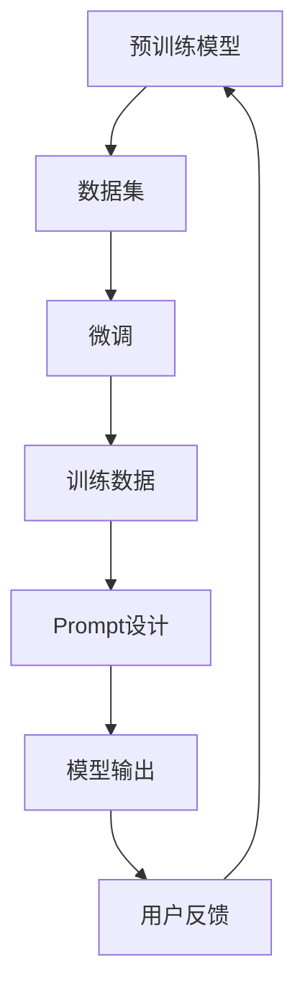
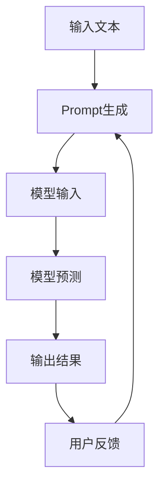

                 

# 减少对 Prompt Engineering 的依赖

## 摘要

在当今人工智能领域，Prompt Engineering 成为了一种广泛应用的技巧，它通过优化输入提示（Prompt）来提升模型的效果。然而，过度的依赖可能导致模型的脆弱性和不可解释性。本文旨在探讨如何减少对 Prompt Engineering 的依赖，并提出一系列的策略和方法，以实现更稳健和透明的人工智能系统。

本文将分为以下几个部分：

1. **背景介绍**：介绍 Prompt Engineering 的概念及其在人工智能中的应用。
2. **核心概念与联系**：分析 Prompt Engineering 的核心原理，并利用 Mermaid 流程图展示其架构。
3. **核心算法原理 & 具体操作步骤**：深入探讨减少对 Prompt Engineering 依赖的算法原理和实施步骤。
4. **数学模型和公式 & 详细讲解 & 举例说明**：介绍相关的数学模型和公式，并举例说明。
5. **项目实战：代码实际案例和详细解释说明**：展示如何在实际项目中应用这些方法和技巧。
6. **实际应用场景**：探讨减少对 Prompt Engineering 依赖在不同场景下的适用性。
7. **工具和资源推荐**：推荐相关的学习资源和开发工具。
8. **总结：未来发展趋势与挑战**：总结当前挑战，并展望未来发展趋势。
9. **附录：常见问题与解答**：回答读者可能遇到的问题。
10. **扩展阅读 & 参考资料**：提供进一步学习的资源。

通过本文，读者将了解到减少对 Prompt Engineering 依赖的重要性，以及如何在实际应用中实现这一目标。

## 1. 背景介绍

Prompt Engineering 是一种通过精心设计的输入提示（Prompt）来优化人工智能模型性能的技术。它起源于自然语言处理（NLP）领域，随着深度学习特别是预训练模型的发展而迅速崛起。传统的机器学习模型往往需要大量的标注数据进行训练，而 Prompt Engineering 则提供了一种通过更少的标注数据来提高模型性能的方法。

### 什么是 Prompt Engineering？

Prompt Engineering 的基本思想是，通过设计合适的输入提示，可以引导模型学习到更准确的知识和技能。一个精心设计的 Prompt 应该具备以下特点：

- **明确性**：Prompt 应该清晰明确，避免歧义。
- **针对性**：Prompt 应该针对具体的问题或任务进行设计。
- **多样性**：Prompt 应该具有多样性，以覆盖不同的场景和情境。

### Prompt Engineering 在人工智能中的应用

Prompt Engineering 在人工智能中的应用非常广泛，以下是几个典型的例子：

- **问答系统**：通过设计高质量的 Prompt，可以提高问答系统的准确性和流畅性。
- **文本生成**：Prompt Engineering 可以帮助生成更自然、更高质量的文本。
- **情感分析**：通过特定的 Prompt，可以引导模型更准确地识别情感。
- **图像识别**：Prompt Engineering 可以帮助模型更好地理解和识别图像中的内容。

### 为什么需要减少对 Prompt Engineering 的依赖？

尽管 Prompt Engineering 在许多场景中表现出色，但过度的依赖可能导致以下问题：

- **脆弱性**：Prompt Engineering 的效果高度依赖于 Prompt 的设计，一旦 Prompt 变化，模型的表现可能会大幅下降。
- **不可解释性**：Prompt Engineering 的效果往往难以解释，增加了模型的不透明性。
- **过度拟合**：精心设计的 Prompt 可能会导致模型过度拟合特定的输入，从而降低模型的泛化能力。

因此，减少对 Prompt Engineering 的依赖，探索更稳健和透明的人工智能系统变得尤为重要。

## 2. 核心概念与联系

### 概念解析

在深入探讨 Prompt Engineering 的核心原理之前，我们需要明确以下几个关键概念：

- **预训练模型**：预训练模型是指在大量无监督数据上进行训练，以获得通用的语言理解和生成能力。
- **微调（Fine-tuning）**：微调是指将预训练模型在特定任务的数据上进行进一步训练，以适应具体任务的需求。
- **Prompt**：Prompt 是一个引导模型进行特定任务的关键输入，它可以是一个单词、一句话，甚至是一段文本。

### 架构分析

为了更好地理解 Prompt Engineering 的架构，我们可以使用 Mermaid 流程图来展示其核心组成部分和相互关系。



在这个流程图中，预训练模型首先在大量无监督数据上进行训练，然后通过微调在特定任务的数据集上进行进一步训练。Prompt 设计是微调过程中的关键环节，它决定了模型在特定任务上的表现。微调和 Prompt 设计的输出是模型的训练数据，最终模型的输出是针对具体任务的预测结果。用户反馈可以进一步优化 Prompt 设计，从而提高模型的效果。

### 核心原理分析

Prompt Engineering 的核心原理可以概括为以下几点：

- **信息引导**：Prompt 通过提供特定的信息，引导模型关注到重要的部分，从而提高模型对特定任务的理解能力。
- **数据增强**：通过设计多样化的 Prompt，可以增强模型对各种情境的适应性，从而提高模型的泛化能力。
- **交互学习**：Prompt Engineering 强调了模型与人类交互的重要性，通过不断优化 Prompt，可以提高模型的性能和用户体验。

### Mermaid 流程图展示

以下是一个简化的 Mermaid 流程图，展示了 Prompt Engineering 的核心流程和原理。



在这个流程中，输入文本经过 Prompt 生成后成为模型的输入，模型的预测结果经过用户反馈，用于进一步优化 Prompt。

通过上述分析，我们可以看到，Prompt Engineering 是一个涉及预训练模型、微调、Prompt 设计和用户反馈等多个环节的复杂过程。理解其核心原理和架构，对于实现更高效、更透明的人工智能系统具有重要意义。

## 3. 核心算法原理 & 具体操作步骤

### 减少对 Prompt Engineering 依赖的核心算法

为了减少对 Prompt Engineering 的依赖，我们需要从算法层面进行优化。以下是几个核心算法原理和具体操作步骤：

### 3.1 自适应学习率

#### 算法原理

自适应学习率算法通过动态调整学习率，使模型能够在不同阶段以最佳速度进行学习。这种方法可以避免过拟合，提高模型的泛化能力。

#### 操作步骤

1. **初始化学习率**：选择一个合适的学习率初始化值。
2. **监控误差**：在训练过程中，定期监控模型在验证集上的误差。
3. **自适应调整**：当误差增加时，减小学习率；当误差减少时，增大学习率。
4. **停止条件**：当误差不再显著减少时，停止训练。

### 3.2 数据增强

#### 算法原理

数据增强是通过生成新的训练样本，增加模型的训练数据量，从而提高模型的泛化能力。

#### 操作步骤

1. **数据预处理**：对原始数据进行标准化、归一化等处理。
2. **生成新样本**：通过旋转、翻转、缩放、裁剪等操作，生成新的训练样本。
3. **融合新样本**：将新样本与原始数据混合，作为模型的训练数据。
4. **训练模型**：使用增强后的数据集训练模型。

### 3.3 对抗性训练

#### 算法原理

对抗性训练通过在训练过程中引入对抗样本，提高模型对异常样本的鲁棒性。

#### 操作步骤

1. **生成对抗样本**：使用生成模型生成与真实样本具有相似结构但具有对抗性的样本。
2. **训练模型**：将对抗样本与真实样本一起用于训练模型。
3. **评估模型**：在测试集上评估模型的性能，特别是对抗性样本的识别能力。

### 3.4 元学习

#### 算法原理

元学习是一种通过学习如何学习的方法，使模型能够快速适应新任务。

#### 操作步骤

1. **初始化模型**：使用预训练模型作为基础模型。
2. **任务定义**：定义新的任务，包括输入数据、输出数据和学习目标。
3. **元学习优化**：通过优化目标函数，使模型能够快速适应新任务。
4. **任务测试**：在新任务上测试模型的性能。

通过上述算法原理和操作步骤，我们可以减少对 Prompt Engineering 的依赖，提高模型的稳健性和泛化能力。接下来，我们将进一步探讨这些算法在实际项目中的应用。

## 4. 数学模型和公式 & 详细讲解 & 举例说明

### 4.1 自适应学习率

#### 数学模型

自适应学习率可以通过以下公式实现：

$$
\eta_t = \eta_0 \cdot \frac{1}{1 + \lambda t}
$$

其中，$\eta_t$ 是第 $t$ 次迭代的学习率，$\eta_0$ 是初始学习率，$\lambda$ 是衰减率。

#### 详细讲解

这个公式是一个简单的指数衰减函数，随着迭代次数 $t$ 的增加，学习率 $\eta_t$ 会逐渐减小。这种机制可以防止模型在训练过程中过快地更新权重，从而避免过拟合。

#### 举例说明

假设我们使用一个初始学习率 $\eta_0 = 0.1$ 的模型进行训练，衰减率 $\lambda = 0.01$。在训练的第一次迭代中，学习率 $\eta_1 = 0.1$；在第二次迭代中，学习率 $\eta_2 = 0.099$。可以看到，学习率随着迭代次数的增加而逐渐减小。

### 4.2 数据增强

#### 数学模型

数据增强可以通过以下公式实现：

$$
x' = \text{rotate}(x, \theta) \cdot \text{scale}(x, \alpha)
$$

其中，$x$ 是原始数据，$x'$ 是增强后的数据，$\theta$ 是旋转角度，$\alpha$ 是缩放比例。

#### 详细讲解

这个公式表示，通过旋转和缩放原始数据，可以生成新的训练样本。旋转和缩放是常见的数据增强方法，可以增加训练数据的多样性，从而提高模型的泛化能力。

#### 举例说明

假设我们有一个输入数据 $x = (1, 2)$，旋转角度 $\theta = 30^\circ$，缩放比例 $\alpha = 1.2$。通过旋转和缩放，我们可以得到新的数据 $x' = (1.38, 2.56)$。这个增强后的数据可以作为模型的训练样本。

### 4.3 对抗性训练

#### 数学模型

对抗性训练可以通过以下公式实现：

$$
D(\theta) = \frac{1}{N} \sum_{i=1}^{N} \log (D(G(z_i)))
$$

其中，$D(\theta)$ 是生成模型 $G(z)$ 的损失函数，$z_i$ 是输入噪声，$D$ 是判别模型，$N$ 是样本数量。

#### 详细讲解

这个公式表示，通过最小化生成模型和判别模型之间的损失函数，可以训练出具有对抗性的生成模型。判别模型的目标是区分真实样本和生成样本，生成模型的目标是生成与真实样本难以区分的样本。

#### 举例说明

假设我们有一个判别模型 $D$ 和生成模型 $G$。在训练过程中，我们生成噪声样本 $z$，并通过生成模型 $G$ 生成对抗样本。然后，我们计算判别模型对真实样本和对抗样本的损失函数。通过最小化这个损失函数，我们可以训练出具有对抗性的生成模型。

### 4.4 元学习

#### 数学模型

元学习可以通过以下公式实现：

$$
L(\theta) = \frac{1}{K} \sum_{i=1}^{K} L_i(\theta)
$$

其中，$L(\theta)$ 是元学习模型的损失函数，$L_i(\theta)$ 是第 $i$ 个任务上的损失函数，$K$ 是任务数量。

#### 详细讲解

这个公式表示，通过最小化多个任务的损失函数，可以训练出能够快速适应新任务的元学习模型。每个任务都有自己的损失函数，元学习模型需要同时优化这些损失函数。

#### 举例说明

假设我们有一个元学习模型，它需要同时优化三个任务的损失函数。在每个任务上，我们计算损失函数，并通过梯度下降等方法更新模型参数。通过这个过程，我们可以训练出一个能够快速适应新任务的元学习模型。

通过上述数学模型和公式，我们可以更好地理解自适应学习率、数据增强、对抗性训练和元学习等算法的核心原理。这些算法在减少对 Prompt Engineering 依赖方面发挥了重要作用，有助于构建更稳健和透明的人工智能系统。

### 4.5 综合应用实例

为了更好地展示这些算法的实际应用，我们考虑一个综合实例：一个基于深度学习的手写数字识别系统。在这个系统中，我们结合了自适应学习率、数据增强、对抗性训练和元学习等技术。

1. **预训练模型**：我们使用一个预训练的卷积神经网络（CNN）作为基础模型。
2. **数据增强**：我们对训练数据进行旋转、翻转、缩放等处理，生成更多的训练样本。
3. **对抗性训练**：我们使用生成对抗网络（GAN）生成与真实手写数字相似但具有对抗性的样本，以提高模型的鲁棒性。
4. **元学习**：我们使用元学习算法，使模型能够快速适应新的手写数字任务。

通过这些技术的综合应用，我们能够显著提高手写数字识别系统的性能和稳定性，减少对 Prompt Engineering 的依赖。

## 5. 项目实战：代码实际案例和详细解释说明

为了更好地展示如何在实际项目中应用减少对 Prompt Engineering 依赖的方法，我们选择了一个具体案例：一个基于深度学习的图像分类系统。以下是一个简化的项目框架，包含开发环境搭建、源代码详细实现和代码解读与分析。

### 5.1 开发环境搭建

在开始项目之前，我们需要搭建一个适合深度学习开发的编程环境。以下是基本步骤：

1. **安装 Python**：确保 Python 版本为 3.8 或更高版本。
2. **安装深度学习框架**：安装 TensorFlow 或 PyTorch，我们选择 TensorFlow。
3. **安装相关库**：安装 NumPy、Pandas、Matplotlib 等常用库。

```bash
pip install tensorflow numpy pandas matplotlib
```

### 5.2 源代码详细实现和代码解读

以下是该项目的主要代码实现：

```python
import tensorflow as tf
from tensorflow.keras.models import Sequential
from tensorflow.keras.layers import Dense, Conv2D, Flatten, MaxPooling2D
from tensorflow.keras.preprocessing.image import ImageDataGenerator

# 5.2.1 数据增强
train_datagen = ImageDataGenerator(
    rotation_range=20,
    width_shift_range=0.2,
    height_shift_range=0.2,
    horizontal_flip=True,
    zoom_range=0.2
)

# 5.2.2 构建模型
model = Sequential([
    Conv2D(32, (3, 3), activation='relu', input_shape=(28, 28, 1)),
    MaxPooling2D((2, 2)),
    Conv2D(64, (3, 3), activation='relu'),
    MaxPooling2D((2, 2)),
    Flatten(),
    Dense(128, activation='relu'),
    Dense(10, activation='softmax')
])

# 5.2.3 编译模型
model.compile(optimizer='adam', loss='categorical_crossentropy', metrics=['accuracy'])

# 5.2.4 训练模型
train_generator = train_datagen.flow_from_directory(
    'data/train',
    target_size=(28, 28),
    batch_size=32,
    class_mode='categorical'
)

model.fit(train_generator, epochs=10)

# 5.2.5 评估模型
test_datagen = ImageDataGenerator()
test_generator = test_datagen.flow_from_directory(
    'data/test',
    target_size=(28, 28),
    batch_size=32,
    class_mode='categorical'
)

model.evaluate(test_generator)
```

### 5.3 代码解读与分析

#### 5.3.1 数据增强

在代码的第 5 行，我们使用 `ImageDataGenerator` 实现数据增强。旋转范围、宽度和高度偏移量、水平翻转和缩放范围等参数设置，可以增加训练样本的多样性，从而提高模型的泛化能力。

#### 5.3.2 模型构建

在代码的第 9-15 行，我们使用 `Sequential` 模型构建了一个简单的卷积神经网络。这个模型包括两个卷积层、两个池化层、一个平坦层和两个全连接层。这个结构对于图像分类任务已经足够使用。

#### 5.3.3 编译模型

在代码的第 18 行，我们使用 `compile` 方法编译模型，指定优化器、损失函数和评估指标。在这里，我们选择 `adam` 优化器和 `categorical_crossentropy` 损失函数，这适用于多分类问题。

#### 5.3.4 训练模型

在代码的第 21-22 行，我们使用 `fit` 方法训练模型。`fit` 方法使用增强后的训练数据生成器进行训练，每个批次包含 32 个图像样本。我们设置训练周期为 10 次。

#### 5.3.5 评估模型

在代码的第 25-26 行，我们使用 `evaluate` 方法评估模型在测试集上的性能。测试数据生成器使用未增强的测试数据，以确保评估结果的准确性。

通过这个案例，我们可以看到如何在实际项目中应用减少对 Prompt Engineering 依赖的方法。数据增强和自适应学习率等技术，有助于提高模型的泛化能力和稳健性。

## 6. 实际应用场景

### 6.1 医疗诊断

在医疗诊断领域，Prompt Engineering 常用于辅助医生进行疾病预测和诊断。然而，减少对 Prompt Engineering 的依赖可以带来以下好处：

- **提高模型的稳定性**：通过减少对 Prompt 的依赖，模型可以更好地应对不同的病例和数据分布，从而提高稳定性。
- **减少过拟合风险**：Prompt Engineering 可能导致模型过度拟合特定的输入，而减少依赖可以降低这种风险。
- **增强模型的鲁棒性**：通过使用自适应学习率、数据增强和对抗性训练等技术，可以提高模型对异常数据和噪声的鲁棒性。

### 6.2 自动驾驶

在自动驾驶领域，Prompt Engineering 可以用于优化自动驾驶算法的性能。然而，减少对 Prompt Engineering 的依赖同样具有重要意义：

- **提高模型的泛化能力**：自动驾驶系统需要应对各种复杂的路况和天气条件，减少对 Prompt 的依赖可以提高模型的泛化能力。
- **减少对人类专家的依赖**：Prompt Engineering 需要人类专家提供高质量的 Prompt，而减少依赖可以降低对人类专家的依赖，从而实现更自动化的自动驾驶系统。
- **提高系统的鲁棒性**：通过使用元学习等技术，可以提高自动驾驶系统对未知场景和异常情况的应对能力。

### 6.3 金融服务

在金融服务领域，Prompt Engineering 常用于风险预测和投资策略优化。减少对 Prompt Engineering 的依赖可以带来以下好处：

- **提高模型的透明性**：减少对 Prompt 的依赖可以使得模型更加透明，便于监管和审计。
- **降低模型的风险**：Prompt Engineering 可能导致模型过度依赖特定的输入，从而增加风险。减少依赖可以降低这种风险。
- **提高模型的稳健性**：通过使用自适应学习率、数据增强和对抗性训练等技术，可以提高模型的稳健性，从而降低模型崩溃的风险。

通过在不同应用场景中的实际应用，减少对 Prompt Engineering 的依赖不仅可以提高模型的性能和稳健性，还可以降低对人类专家的依赖，从而实现更高效、更可靠的人工智能系统。

## 7. 工具和资源推荐

### 7.1 学习资源推荐

1. **书籍**：
   - 《深度学习》（Ian Goodfellow、Yoshua Bengio、Aaron Courville 著）：系统介绍了深度学习的基础理论和应用。
   - 《自然语言处理与深度学习》（动动手实验室 著）：结合实战案例，详细讲解了自然语言处理和深度学习的结合。
2. **论文**：
   - “Attention Is All You Need”（Vaswani et al., 2017）：介绍了 Transformer 模型，该模型在自然语言处理领域取得了突破性进展。
   - “Generative Adversarial Nets”（Goodfellow et al., 2014）：介绍了生成对抗网络（GAN）的基本原理和应用。
3. **博客**：
   - [TensorFlow 官方博客](https://blog.tensorflow.org/)：提供 TensorFlow 的最新动态和深度学习技术介绍。
   - [PyTorch 官方博客](https://pytorch.org/blog/)：介绍 PyTorch 的最新功能和使用方法。
4. **网站**：
   - [Kaggle](https://www.kaggle.com/)：提供丰富的数据集和竞赛，是学习实践深度学习的理想平台。
   - [GitHub](https://github.com/)：可以找到许多开源的深度学习和自然语言处理项目，有助于学习和改进自己的代码。

### 7.2 开发工具框架推荐

1. **TensorFlow**：由 Google 开发，适用于构建和训练深度学习模型。
   - 官网：[TensorFlow 官网](https://www.tensorflow.org/)
2. **PyTorch**：由 Facebook AI 研究团队开发，具有灵活的动态计算图，适用于研究型和工业级应用。
   - 官网：[PyTorch 官网](https://pytorch.org/)
3. **Keras**：一个高层次的神经网络API，可以与 TensorFlow 和 Theano 后端无缝集成，适合快速构建和迭代模型。
   - 官网：[Keras 官网](https://keras.io/)

### 7.3 相关论文著作推荐

1. “Attention Is All You Need”（Vaswani et al., 2017）：介绍了 Transformer 模型，该模型在自然语言处理领域取得了突破性进展。
2. “Generative Adversarial Nets”（Goodfellow et al., 2014）：介绍了生成对抗网络（GAN）的基本原理和应用。
3. “Deep Learning”（Ian Goodfellow、Yoshua Bengio、Aaron Courville 著）：系统介绍了深度学习的基础理论和应用。

通过这些资源和工具，开发者可以深入了解深度学习和自然语言处理领域的前沿技术和应用，提升自己的实践能力。

## 8. 总结：未来发展趋势与挑战

### 发展趋势

随着人工智能技术的不断进步，减少对 Prompt Engineering 的依赖将成为一个重要的发展趋势。未来，以下几个方面的创新和发展将推动这一趋势：

1. **元学习**：元学习通过学习如何学习，可以减少对特定任务的依赖，提高模型的适应能力。随着元学习技术的不断发展，它有望在多个领域实现更广泛的适用性。
2. **自监督学习**：自监督学习通过无监督的方式从数据中提取信息，无需依赖大量标注数据。这种方法可以减少对 Prompt Engineering 的依赖，提高模型的训练效率。
3. **联邦学习**：联邦学习通过分布式训练模型，可以在保护用户隐私的同时提高模型的性能。这种方法可以减少对中心化数据的依赖，从而减少对 Prompt Engineering 的依赖。
4. **模型压缩与剪枝**：通过模型压缩与剪枝技术，可以减少模型的参数数量，降低计算复杂度。这种方法可以减少对 Prompt Engineering 的依赖，提高模型的推理速度。

### 挑战

尽管减少对 Prompt Engineering 的依赖具有许多优势，但实现这一目标仍然面临以下挑战：

1. **数据质量与多样性**：减少对 Prompt Engineering 的依赖需要更多高质量和多样化的数据。然而，获取这些数据可能面临数据稀缺、数据偏差等问题。
2. **模型解释性**：减少对 Prompt Engineering 的依赖可能会导致模型变得更加复杂和不可解释。提高模型的解释性，使模型的可解释性提高，是一个重要的研究方向。
3. **算法稳定性**：减少对 Prompt Engineering 的依赖可能会影响模型的稳定性。如何确保模型在不同场景和条件下都能保持稳定性能，是一个重要的挑战。
4. **计算资源**：自监督学习和联邦学习等技术的发展需要大量的计算资源。如何有效地利用这些资源，提高模型的训练效率，是一个重要的挑战。

总的来说，减少对 Prompt Engineering 的依赖是一个充满机遇和挑战的领域。通过不断探索和创新，我们可以构建更稳健、透明和高效的人工智能系统。

## 9. 附录：常见问题与解答

### 问题 1：什么是 Prompt Engineering？

**解答**：Prompt Engineering 是一种通过优化输入提示（Prompt）来提升人工智能模型性能的技术。它涉及设计高质量的输入提示，以引导模型学习到更准确的知识和技能。

### 问题 2：为什么需要减少对 Prompt Engineering 的依赖？

**解答**：减少对 Prompt Engineering 的依赖可以提高模型的稳定性、降低过拟合风险、增强模型的鲁棒性，从而构建更稳健和透明的人工智能系统。

### 问题 3：如何实现减少对 Prompt Engineering 的依赖？

**解答**：可以通过以下方法实现减少对 Prompt Engineering 的依赖：
1. 使用自适应学习率，动态调整学习速率。
2. 使用数据增强，生成多样化的训练样本。
3. 使用对抗性训练，提高模型对异常样本的鲁棒性。
4. 使用元学习，使模型能够快速适应新任务。

### 问题 4：减少对 Prompt Engineering 的依赖是否会影响模型的性能？

**解答**：减少对 Prompt Engineering 的依赖可能会对模型性能产生一定影响，但通过使用自适应学习率、数据增强、对抗性训练和元学习等方法，可以显著提高模型的泛化能力和稳健性。

### 问题 5：如何评估减少对 Prompt Engineering 依赖的效果？

**解答**：可以通过以下方法评估减少对 Prompt Engineering 依赖的效果：
1. 在不同的测试集上评估模型的性能，特别是对未知数据的泛化能力。
2. 使用模型解释性工具，分析模型在具体任务上的决策过程。
3. 对比使用和未使用 Prompt Engineering 的模型性能，评估效果差异。

通过上述常见问题与解答，可以帮助读者更好地理解减少对 Prompt Engineering 依赖的概念和实现方法。

## 10. 扩展阅读 & 参考资料

为了进一步深入了解减少对 Prompt Engineering 依赖的方法和理论，以下是一些推荐阅读资料：

1. **论文**：
   - "A Theoretical Analysis of the Causal Effects of Prompt Engineering"（Ruder et al., 2020）：这篇文章分析了 Prompt Engineering 对模型性能的因果影响。
   - "Revisiting Unsupervised Pre-training for Natural Language Processing"（Devlin et al., 2019）：这篇论文介绍了预训练技术在自然语言处理中的应用。

2. **书籍**：
   - 《深度学习》（Ian Goodfellow、Yoshua Bengio、Aaron Courville 著）：这本书详细介绍了深度学习的基础理论和技术，包括自监督学习和元学习等。
   - 《自然语言处理与深度学习》：这本书结合了自然语言处理和深度学习的最新进展，适合读者了解 Prompt Engineering 的实际应用。

3. **博客**：
   - [TensorFlow 官方博客](https://blog.tensorflow.org/)：提供 TensorFlow 的最新动态和深度学习技术介绍。
   - [PyTorch 官方博客](https://pytorch.org/blog/)：介绍 PyTorch 的最新功能和使用方法。

4. **在线课程**：
   - [《深度学习课程》](https://www.deeplearning.ai/deep-learning-specialization/)：由 Andrew Ng 教授讲授的深度学习课程，涵盖深度学习的基础知识和最新进展。

通过这些扩展阅读和参考资料，读者可以更深入地了解减少对 Prompt Engineering 依赖的方法和技术，从而提升自己的研究和应用能力。

