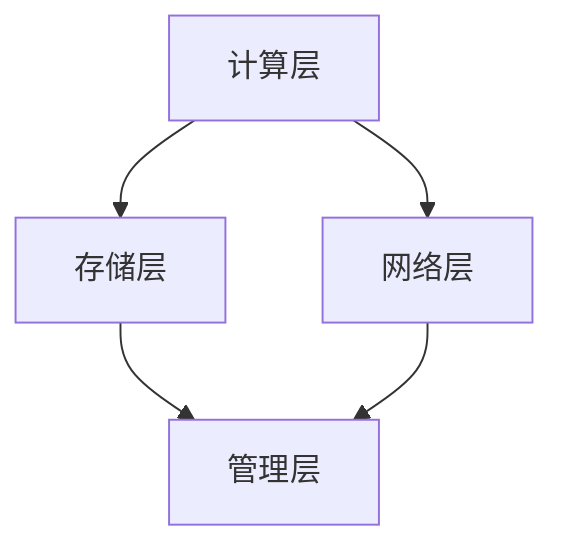

                 

# 分布式计算原理与代码实战案例讲解

## 摘要

本文将深入探讨分布式计算的基本原理，并通过实际代码案例来展示其在现代计算机系统中的应用。我们将从背景介绍开始，逐步剖析分布式计算的核心概念与架构，详细讲解其核心算法原理与数学模型，并通过项目实战深入理解其实际应用场景。此外，我们还将推荐一系列学习资源和开发工具，帮助读者进一步探索分布式计算的技术深度和广度。文章最后将对未来分布式计算的发展趋势与挑战进行总结，并提供常见问题与解答。

## 1. 背景介绍

分布式计算是一种将大量计算任务分配到多个计算机节点上进行处理的技术。这种技术源于对计算能力和存储资源需求的不断增长，特别是在大数据和人工智能领域。传统的集中式计算模型由于单点瓶颈，难以满足大规模数据处理的需求，而分布式计算通过将任务分解并分布在多个节点上，有效地提升了系统的计算能力和可扩展性。

随着互联网的普及和云计算的发展，分布式计算已经成为现代计算机系统中的核心组成部分。例如，搜索引擎、社交媒体平台、电子商务网站等都需要处理海量数据，并要求高可用性和高性能。分布式计算在这些场景中发挥着至关重要的作用。

本文旨在通过一系列详细的讲解和实际代码案例，帮助读者理解分布式计算的基本原理和应用，从而为实际项目开发提供坚实的理论基础和实践指导。

## 2. 核心概念与联系

### 2.1 分布式系统的基本概念

分布式系统是由多个独立计算机节点组成，通过网络连接，共同完成计算任务的系统。以下是一些分布式系统的基本概念：

- **节点（Node）**：分布式系统中的计算机设备，可以是物理机或虚拟机。
- **网络（Network）**：节点之间的通信基础设施。
- **通信协议（Communication Protocol）**：节点间进行数据交换的规则和标准。
- **协调机制（Coordination Mechanism）**：确保分布式系统协同工作的一致性和协调性。

### 2.2 分布式计算架构

分布式计算架构可以分为以下几个层次：

- **计算层（Compute Layer）**：包括计算节点、任务调度器等，负责执行计算任务。
- **存储层（Storage Layer）**：包括分布式文件系统、数据库等，负责存储和检索数据。
- **网络层（Network Layer）**：负责节点间的数据传输和通信。
- **管理层（Management Layer）**：包括监控、管理、运维等工具，负责分布式系统的维护和管理。

### 2.3 分布式算法与数据一致性

分布式计算中的关键挑战之一是保证数据的一致性和可靠性。以下是一些常见的分布式算法和数据一致性模型：

- **CAP 理论（CAP Theorem）**：分布式系统在一致性（Consistency）、可用性（Availability）、分区容错性（Partition Tolerance）三者之间只能选其二。
- **分布式锁（Distributed Lock）**：在分布式系统中实现共享资源的互斥访问。
- **分布式事务（Distributed Transaction）**：保证分布式系统中多个操作原子性地执行。
- **分布式一致性算法（Consistency Algorithms）**：如 Raft、Paxos 等，用于保证分布式系统的数据一致性。

### 2.4 Mermaid 流程图

以下是分布式计算架构的 Mermaid 流程图：



节点 `A` 表示计算层，负责执行计算任务；节点 `B` 表示存储层，负责数据存储和检索；节点 `C` 表示网络层，负责节点间的数据传输；节点 `D` 表示管理层，负责监控和管理。

通过上述核心概念和架构的讲解，我们可以更好地理解分布式计算的工作原理和关键挑战。

### 3. 核心算法原理 & 具体操作步骤

#### 3.1 MapReduce 算法

MapReduce 是一种分布式数据处理框架，由 Google 提出并广泛应用于大数据处理场景。MapReduce 算法主要分为两个阶段：Map 阶段和 Reduce 阶段。

**Map 阶段**：
- 输入：一组键值对。
- 操作：对每个输入键值对执行 Map 函数，输出一组中间键值对。
- 目标：将大数据分解为小任务，并行执行。

**Map 函数**：
$$
\text{Map}(k_1, v_1) \rightarrow (\text{key}, \{v_2\})
$$

**Reduce 阶段**：
- 输入：一组中间键值对。
- 操作：对每个中间键值对执行 Reduce 函数，输出一组结果键值对。
- 目标：将中间结果合并为最终结果。

**Reduce 函数**：
$$
\text{Reduce}(\text{key}, \{v_2\}) \rightarrow (\text{key}, \text{result})
$$

#### 3.2 具体操作步骤

1. **初始化**：
   - 创建一个 MapReduce 任务。
   - 分配输入数据到多个 Map 任务。

2. **Map 阶段**：
   - 对每个输入键值对执行 Map 函数。
   - 将中间键值对写入本地文件。

3. **Shuffle 阶段**：
   - 将本地文件中的中间键值对按照键值排序并分组。
   - 将分组后的数据发送到 Reduce 任务。

4. **Reduce 阶段**：
   - 对每个中间键值对执行 Reduce 函数。
   - 输出最终结果。

5. **输出**：
   - 将最终结果写入分布式文件系统或数据库。

通过上述步骤，我们可以实现分布式数据处理任务。以下是具体的代码实现：

```java
// Map 函数
static class Map extends Mapper<LongWritable, Text, Text, IntWritable> {
    private final static IntWritable one = new IntWritable(1);
    private Text word = new Text();

    public void map(LongWritable key, Text value, Context context) throws IOException, InterruptedException {
        String line = value.toString();
        StringTokenizer tokenizer = new StringTokenizer(line);
        while (tokenizer.hasMoreTokens()) {
            word.set(tokenizer.nextToken());
            context.write(word, one);
        }
    }
}

// Reduce 函数
static class Reduce extends Reducer<Text, IntWritable, Text, IntWritable> {
    public void reduce(Text key, Iterable<IntWritable> values, Context context) throws IOException, InterruptedException {
        int sum = 0;
        for (IntWritable val : values) {
            sum += val.get();
        }
        context.write(key, new IntWritable(sum));
    }
}
```

通过这个例子，我们可以看到 MapReduce 算法的简单实现。在实际应用中，根据具体需求，可以扩展和优化 MapReduce 框架。

### 4. 数学模型和公式 & 详细讲解 & 举例说明

#### 4.1 分布式一致性模型

在分布式系统中，数据一致性是一个关键挑战。CAP 理论提出了分布式系统在一致性、可用性和分区容错性三者之间的权衡。以下是一个简单的数学模型来描述 CAP 理论：

$$
CAP = Consistency + Availability + Partition Tolerance
$$

其中，`Consistency` 表示系统在多副本情况下数据的一致性，`Availability` 表示系统在请求失败时仍然能够响应用户的能力，`Partition Tolerance` 表示系统在分区故障时仍然能够继续运行的能力。

根据 CAP 理论，分布式系统在三者之间只能选其二。例如，在一个具有高可用性和分区容错性的系统中，可能需要牺牲数据一致性。

#### 4.2 分布式一致性算法

分布式一致性算法用于确保分布式系统中的数据一致性。以下是一个简单的分布式一致性算法——Paxos 算法的数学模型：

- **参与者（Participants）**：每个参与者负责提议、投票和记录值。
- **提议者（Proposers）**：负责提议新值并协调其他参与者。
- **学习者（Learners）**：负责学习并记录值。

Paxos 算法的主要步骤如下：

1. **提议（Proposal）**：
   - 提议者选择一个值作为提案，并向其他参与者发送提案消息。
   $$
   \text{Proposer}: \text{propose}(\text{value})
   $$

2. **投票（Vote）**：
   - 参与者接收到提案消息后，如果提案值大于本地记录的值，则接受该提案并返回投票结果。
   $$
   \text{Participant}: \text{vote}(\text{proposal})
   $$

3. **学习（Learning）**：
   - 提议者收到大多数参与者的投票结果后，将提案值作为最终值记录并通知学习者。
   $$
   \text{Proposer}: \text{learn}(\text{proposal})
   $$

4. **故障恢复（Recovery）**：
   - 如果提议者或参与者发生故障，系统通过其他参与者进行故障恢复。

以下是一个简单的 Paxos 算法的伪代码实现：

```python
def propose(value):
    # 发送提案消息
    send ProposalMessage(value) to all other participants

def vote(proposal):
    # 接收提案消息并投票
    if proposal > current_value:
        current_value = proposal
        send VoteMessage(current_value) to proposer

def learn(value):
    # 学习并记录值
    stored_value = value

def recover():
    # 故障恢复
    if participant_failed:
        send RecoveryMessage to all other participants
```

通过上述算法，分布式系统可以确保在多参与者环境中达成一致性。

#### 4.3 举例说明

假设有三个参与者 A、B、C，初始值均为 0。现在提议者 P 提议值为 5。

1. **提议阶段**：
   - 提议者 P 发送提案消息给 A、B、C。

2. **投票阶段**：
   - A 接收提案消息，提案值 5 大于本地记录值 0，投票给 P。
   - B 接收提案消息，提案值 5 大于本地记录值 0，投票给 P。
   - C 接收提案消息，提案值 5 大于本地记录值 0，投票给 P。

3. **学习阶段**：
   - 提议者 P 收到 A、B、C 的投票结果，提案值 5 获得大多数支持，将提案值 5 作为最终值记录。

4. **故障恢复阶段**：
   - 假设参与者 A 发生故障，系统通过 B 和 C 进行故障恢复。

通过这个例子，我们可以看到 Paxos 算法在分布式系统中的基本应用。

### 5. 项目实战：代码实际案例和详细解释说明

#### 5.1 开发环境搭建

为了演示分布式计算的应用，我们将使用 Hadoop 和 Spark 两个开源分布式计算框架。以下是在 Ubuntu 系统中搭建 Hadoop 和 Spark 开发环境的步骤：

1. **安装 Hadoop**：

   - 安装 Java 开发环境：
     ```bash
     sudo apt-get install openjdk-8-jdk
     ```
   - 安装 Hadoop：
     ```bash
     sudo apt-get install hadoop
     ```

2. **安装 Spark**：

   - 安装 Scala 开发环境：
     ```bash
     sudo apt-get install scala
     ```
   - 安装 Spark：
     ```bash
     sudo apt-get install spark
     ```

3. **启动 Hadoop 和 Spark**：

   - 启动 Hadoop：
     ```bash
     sudo start-hadoop
     ```
   - 启动 Spark：
     ```bash
     sudo start-spark
     ```

#### 5.2 源代码详细实现和代码解读

我们使用 Hadoop 的 MapReduce 框架来实现一个简单的单词计数程序。以下是这个程序的详细实现：

```java
// 单词计数程序
import org.apache.hadoop.conf.Configuration;
import org.apache.hadoop.fs.Path;
import org.apache.hadoop.io.IntWritable;
import org.apache.hadoop.io.Text;
import org.apache.hadoop.mapreduce.Job;
import org.apache.hadoop.mapreduce.Mapper;
import org.apache.hadoop.mapreduce.Reducer;
import org.apache.hadoop.mapreduce.lib.input.FileInputFormat;
import org.apache.hadoop.mapreduce.lib.output.FileOutputFormat;

public class WordCount {

  public static class TokenizerMapper extends Mapper<Object, Text, Text, IntWritable>{

    private final static IntWritable one = new IntWritable(1);
    private Text word = new Text();

    public void map(Object key, Text value, Context context) throws IOException, InterruptedException {
      StringTokenizer itr = new StringTokenizer(value.toString());
      while (itr.hasMoreTokens()) {
        word.set(itr.nextToken());
        context.write(word, one);
      }
    }
  }

  public static class IntSumReducer extends Reducer<Text,IntWritable,Text,IntWritable> {
    private IntWritable result = new IntWritable();

    public void reduce(Text key, Iterable<IntWritable> values, Context context) throws IOException, InterruptedException {
      int sum = 0;
      for (IntWritable val : values) {
        sum += val.get();
      }
      result.set(sum);
      context.write(key, result);
    }
  }

  public static void main(String[] args) throws Exception {
    Configuration conf = new Configuration();
    Job job = Job.getInstance(conf, "word count");
    job.setJarByClass(WordCount.class);
    job.setMapperClass(TokenizerMapper.class);
    job.setCombinerClass(IntSumReducer.class);
    job.setReducerClass(IntSumReducer.class);
    job.setOutputKeyClass(Text.class);
    job.setOutputValueClass(IntWritable.class);
    FileInputFormat.addInputPath(job, new Path(args[0]));
    FileOutputFormat.setOutputPath(job, new Path(args[1]));
    System.exit(job.waitForCompletion(true) ? 0 : 1);
  }
}
```

**代码解读**：

- **主函数（main）**：设置作业配置、输入路径和输出路径。
- **Mapper 类（TokenizerMapper）**：实现 `map` 方法，将输入文本分解为单词并输出键值对。
- **Reducer 类（IntSumReducer）**：实现 `reduce` 方法，对每个单词的计数进行汇总。

#### 5.3 代码解读与分析

**Mapper 类**：

```java
public static class TokenizerMapper extends Mapper<Object, Text, Text, IntWritable> {
    private final static IntWritable one = new IntWritable(1);
    private Text word = new Text();

    public void map(Object key, Text value, Context context) throws IOException, InterruptedException {
        StringTokenizer itr = new StringTokenizer(value.toString());
        while (itr.hasMoreTokens()) {
            word.set(itr.nextToken());
            context.write(word, one);
        }
    }
}
```

- **静态变量 `one`**：用于存储单词计数的值。
- **Text 类型的 `word`**：用于存储单词。
- **`map` 方法**：遍历输入文本，将每个单词作为键值对输出。

**Reducer 类**：

```java
public static class IntSumReducer extends Reducer<Text,IntWritable,Text,IntWritable> {
    private IntWritable result = new IntWritable();

    public void reduce(Text key, Iterable<IntWritable> values, Context context) throws IOException, InterruptedException {
        int sum = 0;
        for (IntWritable val : values) {
            sum += val.get();
        }
        result.set(sum);
        context.write(key, result);
    }
}
```

- **静态变量 `result`**：用于存储单词的计数结果。
- **`reduce` 方法**：对每个单词的计数结果进行汇总。

**主函数（main）**：

```java
public static void main(String[] args) throws Exception {
    Configuration conf = new Configuration();
    Job job = Job.getInstance(conf, "word count");
    job.setJarByClass(WordCount.class);
    job.setMapperClass(TokenizerMapper.class);
    job.setCombinerClass(IntSumReducer.class);
    job.setReducerClass(IntSumReducer.class);
    job.setOutputKeyClass(Text.class);
    job.setOutputValueClass(IntWritable.class);
    FileInputFormat.addInputPath(job, new Path(args[0]));
    FileOutputFormat.setOutputPath(job, new Path(args[1]));
    System.exit(job.waitForCompletion(true) ? 0 : 1);
}
```

- **设置作业配置**：
  - `Job.getInstance(conf, "word count")`：创建作业实例。
  - `job.setJarByClass(WordCount.class)`：设置作业的 JAR 包。
  - `job.setMapperClass(TokenizerMapper.class)`：设置 Mapper 类。
  - `job.setCombinerClass(IntSumReducer.class)`：设置 Combiner 类。
  - `job.setReducerClass(IntSumReducer.class)`：设置 Reducer 类。
  - `job.setOutputKeyClass(Text.class)`：设置输出键的类型。
  - `job.setOutputValueClass(IntWritable.class)`：设置输出值的类型。
- **设置输入路径和输出路径**：
  - `FileInputFormat.addInputPath(job, new Path(args[0]))`：设置输入路径。
  - `FileOutputFormat.setOutputPath(job, new Path(args[1]))`：设置输出路径。
- **执行作业**：
  - `System.exit(job.waitForCompletion(true) ? 0 : 1)`：等待作业完成并退出。

通过上述代码解读，我们可以看到如何使用 Hadoop 的 MapReduce 框架实现单词计数程序。实际应用中，可以根据需求进行扩展和优化。

### 6. 实际应用场景

分布式计算在多个领域都有广泛的应用。以下是一些实际应用场景：

- **大数据处理**：分布式计算可以高效地处理海量数据，如搜索引擎的索引构建、社交媒体的数据分析等。
- **人工智能**：分布式计算可以提高机器学习的计算效率，如深度学习模型的训练。
- **云计算**：分布式计算是云计算的核心技术之一，用于提供可扩展的计算和存储服务。
- **科学计算**：分布式计算可以加速科学计算任务，如天气预报、基因组学研究等。

### 7. 工具和资源推荐

#### 7.1 学习资源推荐

- **书籍**：
  - 《分布式系统原理与范型》
  - 《大规模分布式存储系统：原理解析与架构实战》
  - 《大数据技术导论》

- **论文**：
  - "Google File System"（GFS）
  - "MapReduce: Simplified Data Processing on Large Clusters"
  - "The Google File System"

- **博客**：
  - Hadoop 官方文档
  - Spark 官方文档
  - Amazon Web Services（AWS）博客

- **网站**：
  - Coursera：分布式系统课程
  - edX：分布式计算课程
  - Udacity：分布式系统课程

#### 7.2 开发工具框架推荐

- **开发工具**：
  - IntelliJ IDEA
  - Eclipse
  - PyCharm

- **框架**：
  - Apache Hadoop
  - Apache Spark
  - Apache Flink

- **云服务**：
  - AWS：Amazon EMR
  - Azure：Azure HDInsight
  - Google Cloud Platform：Google Cloud Dataflow

#### 7.3 相关论文著作推荐

- **论文**：
  - "Bigtable: A Distributed Storage System for Structured Data"
  - "Spanner: Google's Globally-Distributed Database"
  - "Cassandra: A Decentralized Structured Storage System"

- **著作**：
  - 《分布式系统概念与设计》
  - 《大规模分布式存储系统：设计与实践》
  - 《分布式系统原理与范型》

### 8. 总结：未来发展趋势与挑战

分布式计算在未来将继续发展，并面临一系列挑战。以下是一些发展趋势与挑战：

- **自动化与智能化**：分布式系统将更加自动化和智能化，如使用机器学习算法优化任务调度和资源管理。
- **边缘计算**：随着物联网和智能设备的发展，分布式计算将向边缘计算延伸，实现实时数据处理和响应。
- **安全性**：分布式系统面临安全挑战，如数据泄露、分布式拒绝服务攻击等，需要加强安全防护措施。
- **性能优化**：分布式计算需要进一步提高性能和效率，以应对不断增长的数据规模和处理需求。

### 9. 附录：常见问题与解答

#### 9.1 什么是分布式计算？

分布式计算是一种将计算任务分配到多个计算机节点上进行处理的技术，以提高系统的计算能力和可扩展性。

#### 9.2 分布式计算的优势是什么？

分布式计算的优势包括提高计算性能、提升系统可扩展性、增强系统可靠性、降低单点瓶颈等。

#### 9.3 分布式计算面临哪些挑战？

分布式计算面临的挑战包括数据一致性、分布式锁定、容错性、网络通信延迟等。

#### 9.4 什么是 MapReduce？

MapReduce 是一种分布式数据处理框架，由 Google 提出并广泛应用于大数据处理场景。

#### 9.5 分布式计算与云计算有什么区别？

分布式计算是一种技术，用于将计算任务分配到多个计算机节点上进行处理；云计算是一种服务模式，提供可扩展的计算和存储资源。

### 10. 扩展阅读 & 参考资料

- 《分布式系统原理与范型》
- 《大规模分布式存储系统：原理解析与架构实战》
- 《大数据技术导论》
- Hadoop 官方文档
- Spark 官方文档
- Amazon Web Services（AWS）博客
- Coursera：分布式系统课程
- edX：分布式计算课程
- Udacity：分布式系统课程

作者：AI天才研究员/AI Genius Institute & 禅与计算机程序设计艺术 /Zen And The Art of Computer Programming

本文通过对分布式计算的基本原理、算法原理、实际应用场景、代码实战案例的详细讲解，帮助读者深入理解分布式计算的技术要点和实际应用。希望本文能为读者在分布式计算领域的学习和实践提供有价值的参考和指导。在未来的技术发展中，分布式计算将继续发挥重要作用，为各个领域的创新提供强有力的支持。让我们共同探索和推动分布式计算技术的发展，迎接更加智能、高效、可靠的未来。

