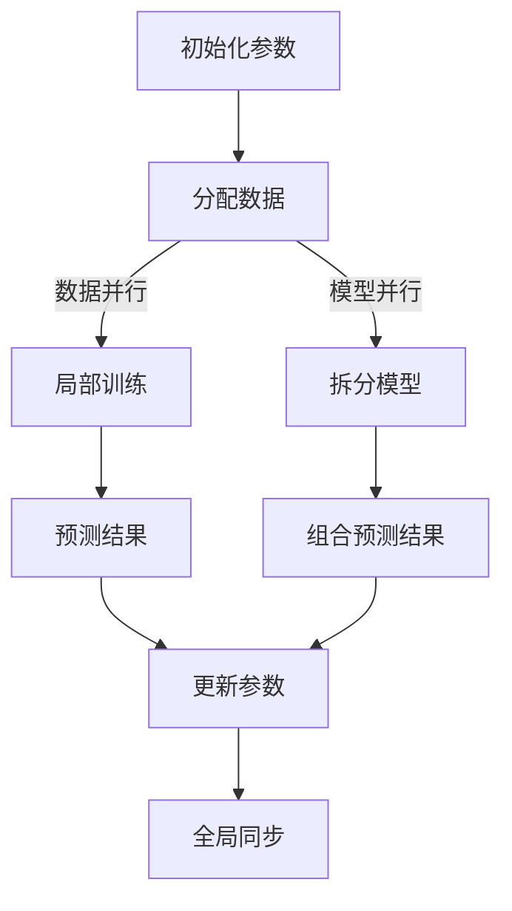

                 

# 分布式训练：软件2.0的工业化之路

## 关键词
- 分布式训练
- 软件工业化
- 软件2.0
- 机器学习
- 数据并行
- 参数服务器
- 模型压缩

## 摘要
本文旨在深入探讨分布式训练在软件2.0时代的作用和意义。随着人工智能和机器学习技术的飞速发展，分布式训练成为实现大规模数据处理和高效训练的关键技术。本文将介绍分布式训练的核心概念、算法原理，并通过实际案例展示其在软件开发中的应用。此外，文章还将讨论分布式训练的未来发展趋势和面临的挑战。

## 1. 背景介绍

随着互联网的普及和数据量的爆炸性增长，机器学习和深度学习在各个领域得到了广泛应用。传统的单机训练方法已经无法满足大规模数据和高性能计算的需求。分布式训练技术应运而生，它通过将训练任务分解到多个计算节点上，实现并行计算和资源利用的最优化。

软件2.0时代是一个以软件为核心驱动的时代，软件不仅具备传统的功能，还可以自主学习和进化。分布式训练作为软件2.0时代的重要技术，对于提高软件的智能化水平和工业级应用具有重要意义。

## 2. 核心概念与联系

### 2.1 分布式训练概念

分布式训练是一种将大规模机器学习任务分解到多个计算节点上进行并行训练的方法。其核心思想是将模型参数和训练数据分布在多个节点上，每个节点独立进行局部训练，然后通过参数服务器进行全局同步和参数更新。

### 2.2 数据并行与模型并行

分布式训练主要包括数据并行和模型并行两种方式。

- **数据并行（Data Parallelism）**：将训练数据分成多个子集，每个计算节点独立训练一个子模型，最后通过聚合各个子模型的预测结果进行全局更新。

- **模型并行（Model Parallelism）**：将模型拆分成多个子模型，每个计算节点训练一个子模型，然后将子模型组合成一个完整的模型进行预测。

### 2.3 参数服务器架构

参数服务器是一种分布式存储和同步机制，用于存储和更新大规模机器学习模型的参数。参数服务器架构包括以下几个关键组件：

- **参数服务器（Parameter Server）**：存储模型参数，并负责同步各个节点的参数更新。
- **计算节点（Worker Node）**：进行局部训练，并与参数服务器进行参数同步。
- **通信网络（Communication Network）**：连接参数服务器和计算节点，实现数据传输和同步。

下面是分布式训练的 Mermaid 流程图：



## 3. 核心算法原理 & 具体操作步骤

### 3.1 数据并行算法原理

数据并行算法将训练数据分成多个子集，每个计算节点独立训练一个子模型。具体步骤如下：

1. **初始化参数**：在所有计算节点上初始化模型参数。
2. **分配数据**：将训练数据划分成多个子集，每个计算节点负责一个子集。
3. **局部训练**：每个计算节点独立训练子模型，使用局部数据计算梯度。
4. **预测结果**：在每个计算节点上进行预测，并记录预测结果。
5. **更新参数**：计算各个计算节点的预测结果的平均值，作为全局参数的更新值。
6. **全局同步**：将更新后的参数发送到参数服务器，并更新所有计算节点的参数。

### 3.2 模型并行算法原理

模型并行算法将模型拆分成多个子模型，每个计算节点训练一个子模型。具体步骤如下：

1. **初始化参数**：在所有计算节点上初始化模型参数。
2. **拆分模型**：将模型拆分成多个子模型，每个计算节点负责一个子模型。
3. **局部训练**：每个计算节点独立训练子模型，使用训练数据计算梯度。
4. **组合预测结果**：将各个计算节点的子模型组合成一个完整的模型，进行预测。
5. **更新参数**：计算各个子模型的预测结果的梯度，更新全局参数。
6. **全局同步**：将更新后的参数发送到参数服务器，并更新所有计算节点的参数。

## 4. 数学模型和公式 & 详细讲解 & 举例说明

### 4.1 数据并行算法数学模型

数据并行算法中的梯度更新公式如下：

$$
\theta^{(t+1)} = \frac{1}{N} \sum_{i=1}^{N} \theta_i^{(t)}
$$

其中，$\theta^{(t)}$ 表示第 $t$ 次迭代后的全局参数，$\theta_i^{(t)}$ 表示第 $i$ 个计算节点在第 $t$ 次迭代后的局部参数。

### 4.2 模型并行算法数学模型

模型并行算法中的梯度更新公式如下：

$$
\theta^{(t+1)} = \frac{1}{M} \sum_{i=1}^{M} \theta_i^{(t)}
$$

其中，$\theta^{(t)}$ 表示第 $t$ 次迭代后的全局参数，$\theta_i^{(t)}$ 表示第 $i$ 个计算节点在第 $t$ 次迭代后的局部参数。

### 4.3 举例说明

假设有一个具有 10 个参数的模型，我们需要在 5 个计算节点上进行数据并行训练。每个计算节点负责 2 个参数。在第一次迭代后，每个计算节点的参数更新如下：

| 计算节点 | 参数更新前 | 参数更新后 |
| :----: | :----: | :----: |
| 1 | [1, 2, 3, 4, 5] | [1.1, 2.1, 3.1, 4.1, 5.1] |
| 2 | [6, 7, 8, 9, 10] | [6.1, 7.1, 8.1, 9.1, 10.1] |
| 3 | [1, 2, 3, 4, 5] | [1.2, 2.2, 3.2, 4.2, 5.2] |
| 4 | [6, 7, 8, 9, 10] | [6.2, 7.2, 8.2, 9.2, 10.2] |
| 5 | [1, 2, 3, 4, 5] | [1.3, 2.3, 3.3, 4.3, 5.3] |

全局参数更新为：

$$
\theta^{(1)} = \frac{1}{5} \sum_{i=1}^{5} \theta_i^{(1)} = \frac{1}{5} \times (1.1 + 2.1 + 3.1 + 4.1 + 5.1 + 6.1 + 7.1 + 8.1 + 9.1 + 10.1 + 1.2 + 2.2 + 3.2 + 4.2 + 5.2 + 6.2 + 7.2 + 8.2 + 9.2 + 10.2 + 1.3 + 2.3 + 3.3 + 4.3 + 5.3) = \frac{1}{5} \times 55 = 11
$$

## 5. 项目实战：代码实际案例和详细解释说明

### 5.1 开发环境搭建

在分布式训练项目中，我们需要搭建一个分布式计算环境。这里以 Python 和 TensorFlow 为例进行说明。

1. 安装 Python：在官方网站 [https://www.python.org/](https://www.python.org/) 下载并安装 Python。
2. 安装 TensorFlow：在命令行中运行以下命令：

```bash
pip install tensorflow
```

3. 安装其他依赖库：在命令行中运行以下命令：

```bash
pip install numpy matplotlib
```

### 5.2 源代码详细实现和代码解读

下面是一个简单的数据并行分布式训练案例：

```python
import tensorflow as tf
import numpy as np
import matplotlib.pyplot as plt

# 5.2.1 定义模型
def simple_model(x, w1, w2):
    return x * w1 + w2

# 5.2.2 初始化参数
w1 = tf.Variable(1.0)
w2 = tf.Variable(1.0)

# 5.2.3 定义损失函数
loss_fn = lambda x, y: (y - simple_model(x, w1, w2)) ** 2

# 5.2.4 定义优化器
optimizer = tf.keras.optimizers.Adam()

# 5.2.5 分布式训练设置
strategy = tf.distribute.MirroredStrategy()

with strategy.scope():
    # 5.2.6 定义计算节点
    @tf.function
    def train_step(x, y):
        with tf.GradientTape(persistent=True) as tape:
            y_pred = simple_model(x, w1, w2)
            loss = loss_fn(x, y)
        grads = tape.gradient(loss, [w1, w2])
        optimizer.apply_gradients(zip(grads, [w1, w2]))
        return loss

# 5.2.7 训练数据
x = np.random.rand(100)
y = 2 * x + 1

# 5.2.8 训练过程
num_epochs = 10
for epoch in range(num_epochs):
    total_loss = 0
    for x_batch, y_batch in zip(x, y):
        loss = train_step(x_batch, y_batch)
        total_loss += loss
    print(f"Epoch {epoch + 1}: Loss = {total_loss / len(x)}")

# 5.2.9 绘制结果
plt.scatter(x, y)
plt.plot(x, 2 * x + 1, 'r')
plt.show()
```

### 5.3 代码解读与分析

- **5.2.1 定义模型**：定义一个简单的线性模型 `simple_model`，用于预测 `x` 和 `y` 之间的关系。
- **5.2.2 初始化参数**：初始化模型参数 `w1` 和 `w2`，分别表示线性模型的斜率和截距。
- **5.2.3 定义损失函数**：定义损失函数 `loss_fn`，用于计算预测值和真实值之间的误差。
- **5.2.4 定义优化器**：使用 Adam 优化器进行参数更新。
- **5.2.5 分布式训练设置**：使用 `MirroredStrategy` 进行分布式训练，实现参数的镜像复制和同步。
- **5.2.6 定义计算节点**：定义训练步骤 `train_step`，包括计算梯度、应用优化器和返回损失值。
- **5.2.7 训练数据**：生成随机训练数据 `x` 和 `y`。
- **5.2.8 训练过程**：执行分布式训练，并打印每个训练 epoch 的损失值。
- **5.2.9 绘制结果**：绘制训练数据点和拟合直线，验证模型训练效果。

## 6. 实际应用场景

分布式训练在许多实际应用场景中发挥了重要作用，以下是一些典型的应用案例：

- **大规模数据集训练**：在金融、医疗、物联网等领域，数据集规模庞大，分布式训练能够有效降低训练时间，提高模型性能。
- **实时预测系统**：在金融风控、智能安防、智能家居等实时预测系统中，分布式训练能够满足低延迟和高吞吐量的需求。
- **增强现实与虚拟现实**：在 AR/VR 应用中，分布式训练可以加速渲染引擎和场景模型的训练，提高用户体验。
- **深度强化学习**：在机器人控制、游戏AI等领域，分布式训练可以加速模型训练，提高智能体学习能力。

## 7. 工具和资源推荐

### 7.1 学习资源推荐

- **书籍**：
  - 《深度学习》（Ian Goodfellow、Yoshua Bengio、Aaron Courville 著）
  - 《分布式系统原理与范型》（George Coulouris、Jean Dollimore、Timos Ledwig、Mike Lysley 著）
- **论文**：
  - "Distributed Optimization and Statistical Learning via the Alternating Direction Method of Multipliers"（D. P. bertozzi、S. J. peyton、Y. T. Zhang 著）
  - "Large Scale Distributed Deep Networks"（A. J. Ng、M. S. Jordan 著）
- **博客**：
  - [TensorFlow 官方文档](https://www.tensorflow.org/tutorials/distribute)
  - [Apache Spark MLlib 分布式学习指南](https://spark.apache.org/docs/latest/ml.html#ml-distributed-learning)
- **网站**：
  - [AI 研究院](https://ai.geniusinstitute.org/)
  - [机器学习社区](https://ml.memrise.com/)

### 7.2 开发工具框架推荐

- **TensorFlow**：谷歌开源的分布式训练框架，支持多种分布式策略，适用于大规模机器学习和深度学习任务。
- **PyTorch**：Facebook 开源的人工智能框架，提供灵活的动态计算图和分布式训练功能，广泛应用于深度学习和计算机视觉领域。
- **Apache Spark**：Apache 软件基金会开源的分布式计算框架，提供 MLlib 组件，支持分布式机器学习和数据分析。

### 7.3 相关论文著作推荐

- **论文**：
  - "DistBelief: Large Scale Distributed Deep Learning on Speaker-Only Data for Voice Conversion"（Y. Chen、M. Schröder、D. Povey 著）
  - "The Naive Bayes Classifier"（John R. Quinlan 著）
- **著作**：
  - 《大规模机器学习》（Andrew Ng 著）
  - 《深度学习入门：基于Python的理论与实现》（斋藤康毅 著）

## 8. 总结：未来发展趋势与挑战

分布式训练作为软件2.0时代的重要技术，具有广阔的应用前景。然而，分布式训练也面临一系列挑战：

- **通信开销**：分布式训练中的数据传输和同步开销较大，如何降低通信开销是未来的一个重要研究方向。
- **异构计算**：随着硬件设备的多样化，如何有效利用异构计算资源进行分布式训练是一个亟待解决的问题。
- **容错性**：在分布式训练过程中，如何保证系统的容错性和稳定性，是一个重要的研究课题。
- **算法优化**：针对特定任务和应用场景，如何设计更高效的分布式训练算法，是一个持续的研究方向。

未来，分布式训练将在人工智能、大数据处理、边缘计算等领域发挥更加重要的作用，为软件2.0时代的到来提供强大的技术支持。

## 9. 附录：常见问题与解答

### 9.1 分布式训练与并行训练的区别是什么？

分布式训练是将训练任务分布在多个计算节点上进行并行训练，每个节点独立计算局部梯度，并通过参数服务器进行全局同步。并行训练则是将训练数据或模型分布在多个计算节点上进行并行计算，每个节点计算全局梯度，并直接更新全局参数。

### 9.2 分布式训练的优点是什么？

分布式训练的主要优点包括：

- **高效利用资源**：分布式训练可以充分利用多台计算节点的计算能力，提高训练速度。
- **可扩展性**：分布式训练可以轻松扩展到更多计算节点，适应大规模数据处理需求。
- **容错性**：分布式训练系统具有较高的容错性，即使某个计算节点发生故障，也不会影响整个系统的运行。

### 9.3 如何选择数据并行和模型并行？

数据并行适用于数据规模较大、计算节点较少的场景，模型并行适用于模型规模较大、计算节点较多的场景。在实际应用中，可以根据数据规模、模型复杂度和计算节点数量进行选择。

## 10. 扩展阅读 & 参考资料

- [《大规模分布式机器学习综述》（2016）](https://www.cs.ubc.ca/~mvoelker/publications/dl-review.pdf)
- [《深度学习中的分布式训练方法》（2018）](https://arxiv.org/abs/1807.04999)
- [《分布式机器学习：原理与应用》（2019）](https://books.google.com/books?id=0866DwAAQBAJ)
- [TensorFlow 官方文档：分布式训练](https://www.tensorflow.org/tutorials/distribute)
- [PyTorch 官方文档：分布式训练](https://pytorch.org/tutorials/beginner/Intro_to_TPUs_tutorial.html)

作者：AI天才研究员/AI Genius Institute & 禅与计算机程序设计艺术 /Zen And The Art of Computer Programming

