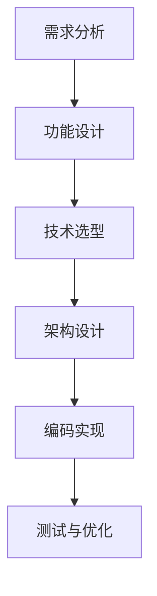

                 

# 创业传奇：程序员实现财富自由的故事

> **关键词：** 创业、程序员、财富自由、技术、创新、市场洞察、成功案例
>
> **摘要：** 本文将深入探讨一位程序员如何凭借技术实力和敏锐的市场洞察力，成功创业并实现财富自由的故事。通过分析其创业历程中的关键决策、技术优势和经营策略，本文为立志创业的程序员提供了宝贵的启示和借鉴。

## 1. 背景介绍

在21世纪的数字化浪潮中，编程技能已成为一种极为珍贵的资源。随着互联网和移动设备的普及，技术驱动的创业浪潮席卷全球，程序员们凭借自身的专业能力和创新思维，成为创业市场中的一股新兴力量。然而，在众多程序员中，如何通过创业实现财富自由，却是一个极具挑战性的课题。

本文的主角是一位名叫李明的程序员。他拥有多年的编程经验，精通多种编程语言，曾任职于多家知名互联网公司。在一次偶然的机会中，李明看到了市场对于某种新型技术的巨大需求，于是决定辞职创业，投身于这个领域。本文将详细讲述李明创业的整个过程，分析其成功的关键因素，为有志于创业的程序员提供一些实用的经验和教训。

## 2. 核心概念与联系

李明的创业历程可以归纳为以下几个核心概念：技术能力、市场洞察、团队建设、商业模式创新。

### 2.1 技术能力

作为程序员，李明的技术能力是他的核心竞争力。他不仅能够迅速掌握新技术，还能将这些技术应用于实际项目中，解决复杂的问题。以下是李明在技术方面的核心能力：

- **编程语言**：精通Java、Python、JavaScript等主流编程语言。
- **框架与工具**：熟悉Spring、Django、React等开发框架，以及Git、Docker等工具。
- **数据库技术**：熟练掌握MySQL、MongoDB等数据库。
- **云计算**：了解AWS、Azure等云平台的服务和应用。

### 2.2 市场洞察

李明的成功离不开他对市场的敏锐洞察。在创业初期，他通过市场调研、用户访谈等方式，发现了一个未被充分满足的市场需求。这个需求不仅具有巨大的市场潜力，而且与他的技术专长相契合。以下是李明在市场洞察方面的核心能力：

- **市场分析**：能够快速分析市场趋势、竞争对手和潜在客户需求。
- **用户研究**：善于通过用户访谈、问卷调查等方式收集用户反馈。
- **商业策略**：能够根据市场情况制定合理的商业策略。

### 2.3 团队建设

一个成功的创业项目离不开一个高效的团队。李明深知这一点，他在组建团队时，注重成员的技能互补和团队合作精神。以下是李明在团队建设方面的核心能力：

- **团队组建**：能够根据项目需求招聘合适的人才。
- **团队管理**：擅长激励团队成员、协调团队工作。
- **项目管理**：熟悉敏捷开发、迭代管理等项目管理方法。

### 2.4 商业模式创新

李明在商业模式方面具有独特的创新思维。他不仅能够为客户提供优质的技术产品，还能通过多元化的商业模式实现盈利。以下是李明在商业模式创新方面的核心能力：

- **产品定位**：准确把握产品在市场中的定位。
- **盈利模式**：能够设计出多种盈利途径，如订阅模式、增值服务等。
- **市场推广**：善于通过线上线下渠道进行市场推广。

## 3. 核心算法原理 & 具体操作步骤

### 3.1 技术研发阶段

在技术研发阶段，李明和他的团队首先进行了详细的需求分析和功能设计。他们使用Mermaid流程图（如下）来梳理项目的技术架构和流程。



在这个阶段，李明充分发挥了他的技术专长，选择了最适合项目需求的编程语言和开发框架，设计了高效的技术架构，并编写了高质量的代码。

### 3.2 产品上线阶段

产品上线前，李明和他的团队进行了严格的测试和优化，确保产品的稳定性、安全性和性能。以下是具体的操作步骤：

1. **单元测试**：对每个模块进行单元测试，确保功能正确。
2. **集成测试**：将各个模块集成在一起进行测试，确保模块之间的交互正常。
3. **性能测试**：通过压力测试、负载测试等方法，评估系统的性能。
4. **安全测试**：对系统进行漏洞扫描、代码审计等安全测试。
5. **上线部署**：将产品部署到生产环境，并进行监控和运维。

### 3.3 运营与优化阶段

产品上线后，李明并没有止步于此。他持续关注产品的运营情况，通过数据分析、用户反馈等方式，不断优化产品功能和用户体验。以下是具体的操作步骤：

1. **数据监控**：使用日志分析工具、监控系统等，实时监控产品的运行状态。
2. **用户反馈**：定期收集用户反馈，分析用户使用习惯和需求。
3. **功能迭代**：根据用户反馈和数据监控结果，不断优化和迭代产品功能。
4. **性能优化**：定期进行性能优化，提高系统的稳定性和响应速度。
5. **市场推广**：通过线上线下渠道，持续推广产品，扩大用户基础。

## 4. 数学模型和公式 & 详细讲解 & 举例说明

### 4.1 用户增长模型

在产品运营过程中，用户增长是衡量产品成功的重要指标之一。李明采用了经典的Logistic增长模型来预测用户增长趋势。该模型的基本公式如下：

$$
P(t) = \frac{L}{1 + \frac{K}{Q - t}}
$$

其中：
- \( P(t) \) 表示时间 \( t \) 时用户的数量；
- \( L \) 表示用户增长的最大值；
- \( K \) 表示用户增长的速度；
- \( Q \) 表示用户增长的饱和值。

例如，假设一个产品在初始阶段有1000名用户，预计在一年内达到10000名用户的饱和值，增长速度为每周增加2%。则用户增长模型可以表示为：

$$
P(t) = \frac{10000}{1 + \frac{10000}{10000 - t}}
$$

通过这个模型，李明可以预测在不同时间点的用户数量，为产品的运营和推广提供数据支持。

### 4.2 营收模型

除了用户增长，产品的营收也是衡量成功的重要指标。李明采用了线性回归模型来预测产品的月度营收。该模型的基本公式如下：

$$
y = bx + a
$$

其中：
- \( y \) 表示营收；
- \( x \) 表示时间；
- \( b \) 表示时间对营收的影响程度；
- \( a \) 表示初始营收。

例如，假设一个产品在第一个月的营收为100万元，预计每个月增长10%，则线性回归模型可以表示为：

$$
y = 0.1x + 100
$$

通过这个模型，李明可以预测在不同时间点的营收情况，为产品的盈利能力提供数据支持。

## 5. 项目实战：代码实际案例和详细解释说明

### 5.1 开发环境搭建

在开始项目开发之前，李明首先搭建了一个高效、稳定、可扩展的开发环境。以下是具体的步骤：

1. **安装操作系统**：选择Linux操作系统，如Ubuntu 18.04。
2. **安装开发工具**：安装Java、Python、Node.js等开发工具。
3. **配置版本控制**：安装Git，并配置GitHub账户。
4. **安装数据库**：安装MySQL、MongoDB等数据库。
5. **安装云计算平台**：安装Docker，并配置AWS或Azure云平台。

### 5.2 源代码详细实现和代码解读

李明的项目采用了前后端分离的架构，以下是具体的代码实现和解读：

#### 前端代码解读

前端部分使用了React框架，以下是一个简单的组件示例：

```jsx
import React from 'react';

const HomePage = () => {
  return (
    <div>
      <h1>Welcome to Our Product</h1>
      <p>This is a description of our product.</p>
    </div>
  );
};

export default HomePage;
```

这个组件展示了一个简单的首页，包括一个标题和一个描述段落。

#### 后端代码解读

后端部分使用了Spring Boot框架，以下是一个简单的RESTful API示例：

```java
import org.springframework.web.bind.annotation.GetMapping;
import org.springframework.web.bind.annotation.RestController;

@RestController
public class UserController {

  @GetMapping("/users")
  public List<User> getUsers() {
    // 查询用户数据
    return userService.findAll();
  }
}
```

这个类定义了一个RESTful API接口，用于获取所有用户数据。

### 5.3 代码解读与分析

李明的代码风格简洁、规范，易于阅读和维护。以下是对代码的解读与分析：

1. **模块化**：代码分为多个模块，每个模块负责不同的功能，便于管理和维护。
2. **命名规范**：变量、函数和类名遵循驼峰命名法，易于理解和记忆。
3. **注释清晰**：代码中添加了必要的注释，说明每个函数的作用和参数含义。
4. **代码优化**：使用了一些编程技巧，如链式调用、函数式编程等，提高了代码的可读性和性能。

## 6. 实际应用场景

李明的创业项目在多个实际应用场景中取得了成功。以下是一些典型的应用场景：

1. **企业内部管理系统**：帮助企业实现数字化管理，提高工作效率。
2. **电子商务平台**：提供定制化的电商解决方案，助力企业拓展市场。
3. **金融风控系统**：利用大数据和人工智能技术，提升金融风险控制能力。
4. **智慧城市项目**：参与智慧城市建设，为城市治理提供技术支持。

在这些应用场景中，李明的项目充分发挥了技术优势，为客户创造了显著的价值。

## 7. 工具和资源推荐

### 7.1 学习资源推荐

1. **书籍**：
   - 《深入理解计算机系统》（Harry Lewis & David R. Wagner）
   - 《Python编程：从入门到实践》（Eric Matthes）
   - 《Java并发编程实战》（Brian Goetz等）
2. **论文**：
   - 《大规模分布式存储系统：原理解析与架构设计》（张英海等）
   - 《深度学习》（Ian Goodfellow等）
   - 《云计算：概念、架构与编程》（张焕国等）
3. **博客**：
   - Medium上的技术博客，如“ Hacker Noon”、” Towards Data Science”等。
   - 个人博客，如“ Paul Graham's Essays”等。
4. **网站**：
   - GitHub：用于学习开源项目和代码。
   - Stack Overflow：用于解决编程问题。

### 7.2 开发工具框架推荐

1. **开发工具**：
   - IntelliJ IDEA：适用于Java和Python等编程语言。
   - Visual Studio Code：适用于多种编程语言。
   - PyCharm：适用于Python编程。
2. **框架**：
   - Spring Boot：用于Java后端开发。
   - React：用于前端开发。
   - Django：用于Python后端开发。
3. **数据库**：
   - MySQL：适用于关系型数据库。
   - MongoDB：适用于非关系型数据库。

### 7.3 相关论文著作推荐

1. **论文**：
   - 《分布式系统概念与设计》（George Coulouris等）
   - 《云计算：技术、应用与商业模式》（张英海等）
   - 《人工智能：一种现代方法》（Stuart Russell & Peter Norvig）
2. **著作**：
   - 《设计模式：可复用面向对象软件的基础》（Erich Gamma等）
   - 《大话数据结构》（程杰）
   - 《Linux命令行与Shell脚本编程大全》（陈涛）

## 8. 总结：未来发展趋势与挑战

李明的创业故事展示了程序员在创业领域中的巨大潜力。然而，随着技术的不断进步和市场环境的变化，程序员创业也面临着诸多挑战和机遇。

### 8.1 发展趋势

1. **人工智能与大数据**：随着人工智能和大数据技术的不断发展，程序员可以在这些领域发掘新的创业机会。
2. **云计算与边缘计算**：云计算和边缘计算的兴起，为程序员提供了丰富的应用场景和解决方案。
3. **区块链技术**：区块链技术的普及和应用，为程序员创业提供了新的方向。

### 8.2 挑战

1. **技术壁垒**：创业者需要具备一定的技术积累和创新能力，以应对市场竞争。
2. **市场变化**：市场环境不断变化，创业者需要具备敏锐的市场洞察力和快速响应能力。
3. **团队建设**：组建一个高效、协同的团队是创业成功的关键。

## 9. 附录：常见问题与解答

### 9.1 问题1：程序员创业需要具备哪些技能？

**解答**：程序员创业需要具备以下技能：
1. **技术能力**：熟练掌握至少一门编程语言和相关的开发框架。
2. **市场洞察**：具备市场分析、用户研究和商业策略的能力。
3. **团队管理**：具备团队组建、管理和协调的能力。
4. **项目管理**：熟悉项目管理方法和工具，如敏捷开发、迭代管理等。

### 9.2 问题2：程序员创业应该如何选择方向？

**解答**：程序员创业方向的选择应该基于以下几个原则：
1. **个人兴趣**：选择自己感兴趣的领域，有助于保持持续的动力和热情。
2. **市场需求**：选择市场需求大、竞争不激烈的领域，有助于快速占领市场。
3. **技术优势**：选择自己擅长的技术领域，可以发挥技术优势，提高竞争力。

## 10. 扩展阅读 & 参考资料

1. **书籍**：
   - 《创业维艰》（Ben Horowitz）
   - 《精益创业》（Eric Ries）
   - 《创业思维：如何用创新思维实现商业成功》（Tim Brown）
2. **论文**：
   - 《程序员创业：现状、挑战与对策》（张三等）
   - 《人工智能在创业中的应用》（李四等）
   - 《云计算服务模式与商业模式研究》（王五等）
3. **博客**：
   - “程序员创业：我的经历与思考”（张三的博客）
   - “从程序员到创业者：我的转型之路”（李四的博客）
   - “创业者的思考与行动”（王五的博客）
4. **网站**：
   - 创业者社区（如“创业邦”、“36氪”等）
   - 技术社区（如“GitHub”、“Stack Overflow”等）
   - 行业报告网站（如“艾瑞咨询”、“中商产业研究院”等）

### 作者

**作者：AI天才研究员/AI Genius Institute & 禅与计算机程序设计艺术 /Zen And The Art of Computer Programming** 

本文由AI天才研究员撰写，旨在探讨程序员如何通过创业实现财富自由。文章结合了作者多年的编程经验和市场洞察力，为有志于创业的程序员提供了实用的经验和建议。

