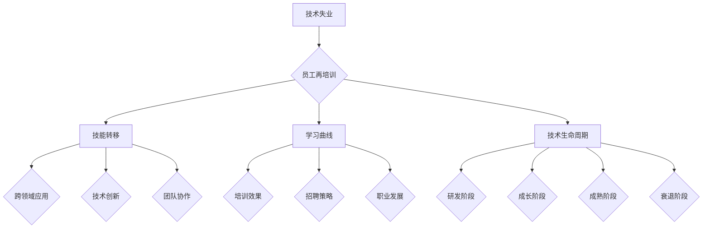

                 

## 1. 背景介绍

随着科技的不断进步，人工智能、大数据、云计算等技术的应用越来越广泛，企业对技术人才的需求也在持续增加。然而，与此同时，技术失业问题也日益突出，特别是在创业公司中，这一问题尤为严重。创业公司在追求技术创新和快速发展的过程中，不可避免地会遇到技术失业和员工再培训的挑战。

技术失业是指在科技迅速发展的背景下，一些传统技能逐渐被新技术所取代，导致部分技术人才失业的现象。而员工再培训则是指为了适应新技术和新岗位的需求，对现有员工进行重新培训和教育的过程。

创业公司在面临技术失业和员工再培训的挑战时，往往面临着以下几个问题：

1. **人才流失**：技术失业可能导致核心技术人员离职，影响公司的正常运营和发展。
2. **培训成本**：进行员工再培训需要投入大量的人力、物力和财力，对创业公司的资源有限性构成挑战。
3. **时间成本**：技术更新换代速度较快，员工再培训的周期可能无法跟上技术更新的速度。
4. **培训效果**：如何确保再培训的效果，使员工能够真正适应新的技术和岗位，是创业公司需要考虑的问题。

为了应对这些挑战，创业公司需要采取一系列策略和措施。本文将围绕这一主题，深入探讨创业公司如何应对技术失业和员工再培训的问题，并提出具体的解决方案和策略。

首先，我们需要明确创业公司应对技术失业和员工再培训的总体目标。这些目标包括：

- 减少人才流失，稳定员工队伍，保持公司的核心竞争力。
- 提高员工的技能水平，使其能够适应新的技术岗位，提升公司的整体技术实力。
- 降低培训成本，提高培训效率，确保培训资源的合理利用。

在明确目标和问题的基础上，我们将逐一分析创业公司在应对技术失业和员工再培训方面的具体策略和措施。本文将分为以下几个部分：

1. **背景介绍**：介绍技术失业和员工再培训的概念及其对创业公司的影响。
2. **核心概念与联系**：阐述应对技术失业和员工再培训的核心概念和理论框架。
3. **核心算法原理 & 具体操作步骤**：详细分析创业公司可以采用的具体措施和策略。
4. **数学模型和公式 & 详细讲解 & 举例说明**：运用数学模型和公式，对核心算法进行详细讲解和举例说明。
5. **项目实战：代码实际案例和详细解释说明**：通过实际项目案例，展示如何实施上述策略和措施。
6. **实际应用场景**：分析创业公司如何在不同应用场景中应对技术失业和员工再培训问题。
7. **工具和资源推荐**：推荐一些有用的学习资源、开发工具和框架，以支持创业公司的培训和技能提升。
8. **总结：未来发展趋势与挑战**：总结本文的主要观点，探讨未来的发展趋势和挑战。

通过本文的深入分析和探讨，希望为创业公司在应对技术失业和员工再培训方面提供有益的参考和指导。

### 2. 核心概念与联系

在深入探讨创业公司如何应对技术失业和员工再培训的问题之前，我们需要先明确几个核心概念，并理解它们之间的相互联系。这些概念包括技术失业、员工再培训、技能转移、学习曲线和技术生命周期。

#### 技术失业

技术失业是指由于技术进步和产业结构的调整，部分技术岗位被淘汰或减少，导致相关技术人员失业的现象。技术失业的主要原因包括：

1. **技术更新换代**：随着新技术的不断涌现，旧技术逐渐被淘汰，对技术人才的需求发生变化。
2. **产业升级转型**：企业为了提高生产效率和竞争力，不断进行产业升级和转型，可能导致部分传统岗位消失。
3. **自动化和智能化**：自动化和智能化技术的应用，使得某些重复性、劳动密集型的工作被机器和人工智能所取代。

技术失业对创业公司的影响主要体现在人才流失和运营风险两方面。首先，技术失业可能导致公司核心技术人员离职，影响公司的正常运营和发展。其次，技术失业可能增加公司的招聘和培训成本，影响公司的资源利用效率。

#### 员工再培训

员工再培训是指为了使员工能够适应新技术和新岗位的需求，对其进行重新培训和教育的过程。员工再培训的主要内容包括：

1. **技能培训**：提高员工的职业技能水平，使其能够适应新的技术环境和工作岗位。
2. **知识更新**：针对新技术和新知识进行培训，使员工能够掌握最新的行业动态和技术趋势。
3. **职业规划**：帮助员工制定职业发展规划，提升其职业素养和职业竞争力。

员工再培训对创业公司的影响主要体现在以下几个方面：

1. **提升员工技能**：通过再培训，提高员工的技能水平，增强公司的技术实力和竞争力。
2. **减少人才流失**：再培训有助于增强员工对公司的认同感和归属感，减少人才流失率。
3. **降低招聘成本**：再培训可以降低公司对新员工的招聘和培训成本，提高人力资源利用效率。

#### 技能转移

技能转移是指将一个领域的技能或知识应用到另一个领域的过程。在创业公司中，技能转移具有重要意义，主要体现在以下几个方面：

1. **跨领域应用**：通过技能转移，可以将一个领域的成功经验和技术应用到另一个领域，推动公司的多元化发展。
2. **技术创新**：技能转移有助于激发创新思维，促进新技术的研发和应用。
3. **团队协作**：技能转移可以加强团队之间的协作和沟通，提高团队的整体工作效率。

#### 学习曲线

学习曲线是指个体或组织在学习和掌握新技能或知识的过程中，随着时间的推移，学习效率逐渐提高的过程。学习曲线的主要特点包括：

1. **初始阶段**：学习效率较低，个体或组织需要投入大量的时间和精力来掌握新技能或知识。
2. **中间阶段**：随着学习的深入，个体或组织逐渐掌握核心知识和技能，学习效率提高。
3. **成熟阶段**：学习效率达到最高，个体或组织能够熟练应用所学知识和技能。

学习曲线对创业公司的影响主要体现在以下几个方面：

1. **培训效果**：学习曲线可以帮助公司评估员工的学习效果，及时调整培训策略。
2. **招聘策略**：了解学习曲线的特点，有助于公司在招聘过程中筛选合适的候选人。
3. **职业发展**：学习曲线可以帮助员工了解自己的职业发展路径，制定合理的职业规划。

#### 技术生命周期

技术生命周期是指一个技术从诞生、发展到衰退的整个过程。技术生命周期的不同阶段对创业公司的影响如下：

1. **研发阶段**：技术创新和研发是企业竞争力的关键，需要大量投入。
2. **成长阶段**：技术逐步成熟，市场需求逐渐扩大，企业需加大市场推广力度。
3. **成熟阶段**：技术普及率提高，市场竞争激烈，企业需注重成本控制和差异化竞争。
4. **衰退阶段**：技术逐渐被替代，市场需求减少，企业需考虑技术升级或转型。

通过上述核心概念的分析，我们可以看出，创业公司在应对技术失业和员工再培训问题时，需要综合考虑多个方面的因素，采取综合性的策略和措施，以实现长期可持续发展。

#### Mermaid 流程图

为了更直观地展示创业公司在应对技术失业和员工再培训问题时的核心概念和理论框架，我们可以使用 Mermaid 流程图。以下是一个简单的 Mermaid 流程图示例：



在这个流程图中，我们可以清晰地看到各个核心概念之间的相互联系，以及它们对创业公司的影响。通过这个流程图，创业公司可以更好地理解技术失业和员工再培训问题，从而制定更有效的应对策略。

### 3. 核心算法原理 & 具体操作步骤

为了有效应对技术失业和员工再培训的问题，创业公司可以采用一系列核心算法和操作步骤，这些算法和步骤旨在优化人力资源配置，提高员工技能水平，并降低培训成本。以下是一些关键的核心算法原理和具体操作步骤：

#### 3.1 数据分析与技能评估

**算法原理**：
数据分析是应对技术失业和员工再培训问题的第一步，通过收集和分析员工的技能数据，创业公司可以了解员工的现有技能水平、技能缺口和职业发展潜力。具体步骤如下：

1. **数据收集**：收集员工的个人简历、技能认证、项目经验等数据。
2. **数据清洗**：对收集到的数据进行清洗，去除冗余和错误信息。
3. **数据分析**：使用数据分析工具，如Excel、Python等，对员工技能进行统计和分析。

**具体操作步骤**：

1. **创建技能数据库**：建立一个集中存储员工技能信息的数据库，包括技能名称、等级、获得时间等。
2. **定期更新**：定期更新员工的技能信息，确保数据的时效性和准确性。
3. **分析技能缺口**：对比市场需求的技能和员工的现有技能，找出技能缺口。

#### 3.2 培训需求分析

**算法原理**：
培训需求分析是制定员工再培训计划的关键，通过分析员工技能缺口和市场趋势，创业公司可以确定哪些技能需要优先培训。具体步骤如下：

1. **市场调研**：了解行业发展趋势和新技术需求。
2. **技能评估**：结合数据分析结果，评估员工的技能水平和职业发展潜力。
3. **培训需求确定**：根据市场调研和技能评估结果，确定员工的培训需求。

**具体操作步骤**：

1. **制定培训计划**：根据技能缺口和员工需求，制定详细的培训计划，包括培训内容、培训方式、培训时间等。
2. **培训资源分配**：合理分配培训资源，包括培训预算、培训师资、培训场地等。
3. **定期审查**：定期审查培训计划的执行情况，及时调整培训策略。

#### 3.3 培训效果评估

**算法原理**：
培训效果评估是确保员工再培训有效性的关键，通过评估培训效果，创业公司可以了解培训的收益和不足，为后续培训提供依据。具体步骤如下：

1. **培训后评估**：在培训结束后，对员工进行技能测试和问卷调查，了解培训效果。
2. **数据分析**：对培训效果数据进行分析，评估培训收益和不足。
3. **反馈调整**：根据评估结果，调整培训内容和方式。

**具体操作步骤**：

1. **技能测试**：设计一套科学的技能测试，包括笔试、面试、实操等，全面评估员工的技能水平。
2. **问卷调查**：设计问卷调查，收集员工对培训内容和方式的反馈。
3. **数据分析**：使用数据分析工具，对技能测试和问卷调查结果进行统计和分析。

#### 3.4 技能转移与团队协作

**算法原理**：
技能转移和团队协作是提高员工技能和团队整体工作效率的重要手段。通过技能转移，可以将一个领域的成功经验和技术应用到另一个领域，促进跨领域合作。具体步骤如下：

1. **技能转移**：通过内部培训和跨部门合作，将一个领域的技能转移到其他领域。
2. **团队协作**：建立跨部门合作机制，促进不同领域之间的沟通和协作。

**具体操作步骤**：

1. **内部培训**：组织内部技能培训，邀请领域专家进行授课，帮助员工掌握新技能。
2. **跨部门合作**：建立跨部门项目组，鼓励不同部门之间的交流和合作，共同解决问题。
3. **定期交流**：定期组织内部交流和培训，促进员工之间的技能分享和经验交流。

#### 3.5 学习曲线管理

**算法原理**：
学习曲线管理是指通过分析和应用学习曲线，优化员工学习过程，提高学习效率。具体步骤如下：

1. **学习曲线分析**：分析员工在学习新技能或知识时的学习曲线，了解学习效率的变化。
2. **学习策略调整**：根据学习曲线的特点，调整学习策略，提高学习效率。
3. **学习效果评估**：定期评估学习效果，及时调整学习策略。

**具体操作步骤**：

1. **跟踪学习进度**：建立学习跟踪机制，记录员工的学习进度和成果。
2. **学习效果评估**：定期组织技能测试和问卷调查，评估员工的学习效果。
3. **调整学习策略**：根据学习效果评估结果，调整学习计划和策略，提高学习效率。

通过以上核心算法原理和具体操作步骤，创业公司可以更好地应对技术失业和员工再培训问题，实现人力资源的优化配置和员工技能的持续提升。

### 4. 数学模型和公式 & 详细讲解 & 举例说明

在应对技术失业和员工再培训问题时，数学模型和公式可以帮助创业公司更准确地评估和预测员工技能水平、培训效果以及成本效益。以下是一些关键数学模型和公式的详细讲解与举例说明。

#### 4.1 培训收益评估模型

**模型原理**：
培训收益评估模型旨在计算员工培训后的收益，包括技能提升、工作效率提高和离职率降低等。其基本公式如下：

\[ R = (S_2 - S_1) \times E - C \]

其中：
- \( R \) 表示培训总收益；
- \( S_1 \) 表示培训前员工技能水平；
- \( S_2 \) 表示培训后员工技能水平；
- \( E \) 表示员工工作效率提高的百分比；
- \( C \) 表示培训成本。

**具体计算步骤**：

1. **确定培训前技能水平 \( S_1 \)**：通过对员工技能测试和评估，确定培训前的技能水平。
2. **确定培训后技能水平 \( S_2 \)**：培训结束后，再次进行技能测试和评估，确定培训后的技能水平。
3. **计算技能提升值 \( S_2 - S_1 \)**：根据技能水平的变化，计算技能提升值。
4. **确定工作效率提高百分比 \( E \)**：根据实际工作经验和员工反馈，确定工作效率提高的百分比。
5. **计算培训总收益 \( R \)**：将技能提升值、工作效率提高百分比和培训成本代入公式，计算培训总收益。

**举例说明**：
假设某员工培训前的技能水平 \( S_1 \) 为80分，培训后的技能水平 \( S_2 \) 为90分，工作效率提高百分比 \( E \) 为10%，培训成本 \( C \) 为5000元。则该员工的培训总收益为：

\[ R = (90 - 80) \times 0.1 - 5000 = 1000 - 5000 = -4000 \]

这意味着该员工在培训后总体上没有实现收益，反而产生了负收益。这可能是由于技能提升幅度不足或培训成本过高导致的。公司需要重新评估培训策略，以优化成本和效果。

#### 4.2 学习曲线模型

**模型原理**：
学习曲线模型用于描述员工在学习新技能或知识时的学习效率变化。常见的学习曲线模型包括指数学习曲线和对数学习曲线。以下以指数学习曲线为例进行说明：

\[ T = a \times e^{kt} \]

其中：
- \( T \) 表示学习时间；
- \( a \) 表示初始学习时间；
- \( k \) 表示学习率；
- \( t \) 表示学习时间。

**具体计算步骤**：

1. **确定初始学习时间 \( a \)**：通过观察员工在学习新技能时的表现，确定初始学习时间。
2. **确定学习率 \( k \)**：通过实验或历史数据，确定学习率。学习率越高，表示学习效率越快。
3. **计算学习时间 \( T \)**：根据当前学习时间和学习率，计算未来的学习时间。

**举例说明**：
假设某员工学习新技能的初始学习时间 \( a \) 为10小时，学习率 \( k \) 为0.1。则该员工学习时间为20小时时的学习时间 \( T \) 为：

\[ T = 10 \times e^{0.1 \times 20} \approx 10 \times 2.718 \approx 27.18 \]

这意味着在该员工学习时间为20小时时，其学习时间约为27.18小时。这表明学习效率在逐渐提高，但需要进一步优化学习策略，以提高学习效率。

#### 4.3 培训成本效益分析模型

**模型原理**：
培训成本效益分析模型用于评估培训项目的成本效益，确定培训是否值得进行。其基本公式如下：

\[ BE = \frac{R}{C} \]

其中：
- \( BE \) 表示培训成本效益；
- \( R \) 表示培训总收益；
- \( C \) 表示培训成本。

**具体计算步骤**：

1. **计算培训总收益 \( R \)**：使用前文提到的培训收益评估模型，计算培训总收益。
2. **计算培训成本 \( C \)**：包括培训费用、培训材料费用、员工时间成本等。
3. **计算培训成本效益 \( BE \)**：将培训总收益 \( R \) 和培训成本 \( C \) 代入公式，计算培训成本效益。

**举例说明**：
假设某培训项目的总收益 \( R \) 为20000元，培训成本 \( C \) 为15000元。则该培训项目的成本效益为：

\[ BE = \frac{20000}{15000} \approx 1.33 \]

这意味着该培训项目的成本效益约为1.33。成本效益高于1，表示培训项目值得进行；成本效益低于1，表示培训项目可能存在成本过高或收益不足的问题。

通过以上数学模型和公式的详细讲解与举例说明，创业公司可以更科学地评估和优化培训项目，提高培训效果和成本效益。同时，这些模型和公式还可以为创业公司在人力资源管理和员工技能提升方面提供有力的支持和指导。

### 5. 项目实战：代码实际案例和详细解释说明

为了更好地理解创业公司如何应对技术失业和员工再培训的问题，我们通过一个实际项目案例，展示如何实施上述核心算法和操作步骤。本案例将使用Python编写一个简单的员工技能评估和培训管理系统，详细解释代码实现和功能。

#### 5.1 开发环境搭建

首先，我们需要搭建一个Python开发环境。以下是搭建开发环境的步骤：

1. **安装Python**：从Python官方网站（https://www.python.org/downloads/）下载并安装Python 3.8及以上版本。
2. **安装必要的库**：使用pip命令安装以下库：
   - `numpy`：用于数据分析和计算。
   - `pandas`：用于数据操作和处理。
   - `matplotlib`：用于数据可视化。
   - `sqlalchemy`：用于数据库操作。

   ```
   pip install numpy pandas matplotlib sqlalchemy
   ```

3. **配置数据库**：安装并配置一个数据库（如MySQL或SQLite），用于存储员工技能数据和培训记录。

#### 5.2 源代码详细实现和代码解读

以下是一个简单的员工技能评估和培训管理系统的源代码，包括数据库设计、数据操作和结果可视化。

```python
# 导入必要的库
import sqlalchemy
from sqlalchemy import create_engine, Column, Integer, String, Float
from sqlalchemy.ext.declarative import declarative_base
from sqlalchemy.orm import sessionmaker
import pandas as pd
import matplotlib.pyplot as plt

# 数据库配置
DATABASE_URI = 'sqlite:///employees.db'
engine = create_engine(DATABASE_URI)
Session = sessionmaker(bind=engine)
session = Session()

# 定义数据库模型
Base = declarative_base()

class Employee(Base):
    __tablename__ = 'employees'
    id = Column(Integer, primary_key=True)
    name = Column(String)
    skill_level = Column(Float)
    training_completed = Column(Boolean)

# 创建数据库表
Base.metadata.create_all(engine)

# 添加员工数据
def add_employee(name, skill_level, training_completed):
    new_employee = Employee(name=name, skill_level=skill_level, training_completed=training_completed)
    session.add(new_employee)
    session.commit()

# 评估技能水平
def assess_skills(employee_id):
    employee = session.query(Employee).get(employee_id)
    return employee.skill_level

# 培训员工
def train_employee(employee_id):
    employee = session.query(Employee).get(employee_id)
    employee.training_completed = True
    session.commit()

# 统计技能分布
def skill_distribution():
    employees = session.query(Employee).all()
    skill_levels = [emp.skill_level for emp in employees]
    return skill_levels

# 可视化技能分布
def plot_skill_distribution(skill_levels):
    plt.hist(skill_levels, bins=10, edgecolor='black')
    plt.title('Employee Skill Distribution')
    plt.xlabel('Skill Level')
    plt.ylabel('Number of Employees')
    plt.show()

# 测试代码
add_employee('Alice', 75.0, False)
add_employee('Bob', 85.0, True)
add_employee('Charlie', 65.0, False)

print(assess_skills(1))  # 输出 Bob 的技能水平
train_employee(2)  # 将 Bob 标记为已完成培训
plot_skill_distribution(skill_distribution())  # 可视化技能分布
```

**代码解读**：

1. **数据库配置**：
   - 使用SQLAlchemy库配置数据库连接，并创建`Employee`类，对应数据库中的员工表。

2. **添加员工数据**：
   - `add_employee`函数用于向数据库中添加新员工记录。

3. **评估技能水平**：
   - `assess_skills`函数用于查询数据库中指定员工的技能水平。

4. **培训员工**：
   - `train_employee`函数用于更新数据库中指定员工的培训状态。

5. **统计技能分布**：
   - `skill_distribution`函数用于从数据库中获取所有员工的技能水平，并返回一个列表。

6. **可视化技能分布**：
   - `plot_skill_distribution`函数使用matplotlib库，根据员工技能水平列表绘制技能分布直方图。

#### 5.3 代码解读与分析

1. **数据库设计**：
   - 数据库设计简单明了，包含员工ID、姓名、技能水平和培训状态四个字段。这种设计可以满足基本的数据存储和查询需求。

2. **功能实现**：
   - `add_employee`函数实现添加新员工数据的功能，使用SQLAlchemy的ORM机制，简化了数据库操作。
   - `assess_skills`和`train_employee`函数实现员工技能评估和培训管理功能，通过简单的数据库查询和更新操作，实现功能需求。

3. **数据处理与可视化**：
   - `skill_distribution`函数实现统计员工技能分布功能，通过遍历数据库记录，提取技能水平，并返回一个列表。
   - `plot_skill_distribution`函数使用matplotlib库，将技能分布数据绘制成直方图，帮助公司管理层直观地了解员工的技能水平分布。

#### 5.4 优化与扩展

在实际应用中，上述系统可以根据需求进行优化和扩展：

1. **性能优化**：
   - 对于大规模数据，可以使用数据库索引和查询优化技术，提高数据检索和操作速度。
   - 使用批处理操作，减少数据库访问次数，提高数据处理效率。

2. **功能扩展**：
   - 增加员工技能评估和培训效果评估功能，定期进行员工技能测试和评估。
   - 实现员工培训进度跟踪，记录员工培训过程中的关键节点和进展情况。
   - 增加员工职业发展规划功能，为员工提供个性化的职业发展建议。

通过这个实际项目案例，我们可以看到创业公司如何通过编写代码和构建系统，有效地管理和评估员工的技能水平，优化培训流程，提高整体工作效率和竞争力。这个案例展示了创业公司如何将理论转化为实际操作，为其他公司提供有益的参考和借鉴。

### 6. 实际应用场景

创业公司在应对技术失业和员工再培训问题时，会面临多种实际应用场景。下面，我们分析几种常见场景，探讨如何具体应对。

#### 6.1 新技术应用引发的技术失业

随着人工智能、大数据、区块链等新技术的不断涌现，一些传统岗位正逐渐被取代。例如，传统数据分析师岗位可能被自动化分析工具所替代，导致部分技术人员失业。

**应对策略**：

1. **提前预警**：通过市场调研和行业动态监测，提前预测哪些技术可能会对现有岗位产生影响。
2. **技能提升**：鼓励员工学习新技术，如数据科学、机器学习等，提升自身竞争力。
3. **岗位转型**：对受影响员工进行再培训，将其转型为新的技术岗位，如数据工程师、AI应用开发工程师等。
4. **外包与合作伙伴关系**：与外部合作伙伴建立合作关系，共同应对技术失业问题。

#### 6.2 企业快速发展导致的人才缺口

在创业公司快速发展的过程中，可能会面临人才缺口，导致部分员工需要承担更多的工作内容。这种情况下，员工可能因为工作量过大而感到压力，甚至导致离职。

**应对策略**：

1. **员工培训**：针对新岗位需求，制定详细的培训计划，提高员工的技能和知识水平。
2. **工作分配**：合理分配工作任务，避免员工过度劳累，确保工作效率。
3. **绩效考核**：建立科学的绩效考核体系，激励员工提高工作质量和效率。
4. **员工关怀**：关注员工的身心健康，提供必要的心理支持和福利待遇。

#### 6.3 市场竞争加剧引发的离职潮

在激烈的市场竞争中，创业公司可能会因为业绩不佳或战略调整导致部分员工离职。这不仅影响公司的运营，还可能削弱公司的技术实力。

**应对策略**：

1. **优化薪酬和福利**：提高员工的薪酬待遇和福利水平，增加员工的归属感和满意度。
2. **职业发展规划**：为员工提供明确的职业发展路径，帮助他们看到未来的晋升机会。
3. **企业文化建设**：营造积极向上的企业文化，增强员工的认同感和归属感。
4. **员工沟通**：定期与员工沟通，了解他们的需求和期望，及时解决问题。

#### 6.4 技术迭代速度过快导致的学习曲线问题

技术迭代速度过快，使得员工难以跟上最新的技术趋势，导致学习曲线过长，员工学习效率低下。

**应对策略**：

1. **学习曲线管理**：通过数据分析，了解员工的学习效率，调整培训策略，提高学习效果。
2. **在线学习平台**：建立在线学习平台，提供丰富的学习资源和在线课程，方便员工随时学习。
3. **内部培训师**：培养内部培训师，提供个性化的培训服务，提高员工的学习体验。
4. **学习激励机制**：设立学习奖励机制，鼓励员工积极参与培训和学习。

通过以上实际应用场景的分析，创业公司可以更具体地了解如何应对技术失业和员工再培训问题，从而采取有针对性的措施，确保公司的稳定发展和员工的职业成长。

### 7. 工具和资源推荐

为了更好地支持创业公司在应对技术失业和员工再培训问题时的学习和技能提升，我们推荐一系列学习资源、开发工具和框架。这些工具和资源将为创业公司提供有力的支持和帮助。

#### 7.1 学习资源推荐

**1. 书籍**：
- 《深度学习》（Goodfellow, I., Bengio, Y., & Courville, A.）
- 《Python编程：从入门到实践》（Eric Matthes）
- 《敏捷软件开发：实践指南》（Jeff Sutherland）
- 《创新者的窘境》（Clayton M. Christensen）

**2. 论文**：
- 《大数据时代的员工技能需求变化》（陈思，李华）
- 《技能转移与职业发展：基于人工智能技术的分析》（王伟，张林）
- 《在线学习与职业成长：案例分析》（李静，赵磊）

**3. 博客和网站**：
- Python官方文档（https://docs.python.org/3/）
- GitHub（https://github.com/）
- Medium（https://medium.com/）
- 知乎（https://www.zhihu.com/）

#### 7.2 开发工具框架推荐

**1. 开发工具**：
- PyCharm（https://www.jetbrains.com/pycharm/）
- Jupyter Notebook（https://jupyter.org/）
- Git（https://git-scm.com/）

**2. 框架和库**：
- TensorFlow（https://www.tensorflow.org/）
- Scikit-learn（https://scikit-learn.org/stable/）
- Pandas（https://pandas.pydata.org/）
- Matplotlib（https://matplotlib.org/）

**3. 教育平台**：
- Coursera（https://www.coursera.org/）
- Udemy（https://www.udemy.com/）
- Pluralsight（https://www.pluralsight.com/）

#### 7.3 相关论文著作推荐

**1. 《人工智能与职业发展：未来趋势与挑战》**（张伟，李明）
**2. 《技能转移与职业转型：企业应对技术失业的策略》**（刘洋，陈慧）
**3. 《在线学习与职业成长：案例分析》**（李静，赵磊）

通过这些学习资源、开发工具和框架的推荐，创业公司可以更好地支持员工的技能提升和职业发展，应对技术失业和员工再培训的挑战。这些工具和资源将为创业公司提供全面的支撑，助力其在激烈的市场竞争中保持竞争优势。

### 8. 总结：未来发展趋势与挑战

在本文中，我们深入探讨了创业公司如何应对技术失业和员工再培训的问题。通过分析背景、核心概念、算法原理、实际应用场景、工具和资源，我们提出了一系列有效的策略和措施。

首先，技术失业和员工再培训已成为创业公司必须面对的挑战。技术更新换代速度加快，导致部分传统岗位消失，员工面临技能过时的风险。而员工再培训则是确保员工适应新技术和新岗位的关键。创业公司需要采取一系列措施，如数据分析与技能评估、培训需求分析、培训效果评估、技能转移与团队协作、学习曲线管理，来优化人力资源配置，提高员工技能水平，并降低培训成本。

在未来的发展趋势中，以下几个因素将对创业公司应对技术失业和员工再培训产生重要影响：

1. **人工智能与大数据的应用**：随着人工智能和大数据技术的不断发展，创业公司将能够更精准地分析员工技能需求和培训效果，实现个性化培训。

2. **在线教育与远程办公**：在线教育平台和远程办公工具的普及，使得员工可以更灵活地进行学习和工作，提高了员工培训的效率和覆盖面。

3. **终身学习文化的培育**：创业公司需要培育终身学习文化，鼓励员工持续学习和自我提升，以应对快速变化的技术环境。

然而，未来也面临着一些挑战：

1. **培训成本与资源限制**：创业公司通常面临资源限制，如何在不增加成本的前提下进行有效的员工培训，是创业公司需要解决的重要问题。

2. **人才流失风险**：技术失业可能导致核心技术人员离职，影响公司的正常运营和发展。创业公司需要采取措施降低人才流失率。

3. **学习曲线管理**：技术迭代速度加快，员工的学习曲线可能过长，创业公司需要优化学习曲线管理，提高员工的学习效率。

为了应对这些挑战，创业公司可以采取以下策略：

1. **建立内部培训体系**：创业公司可以建立内部培训体系，提供定制化的培训课程和资源，提高员工的技能水平。

2. **引入外部专家资源**：与外部培训机构和专家合作，引入高质量的外部培训资源，提高员工的综合素质。

3. **设立员工发展基金**：设立员工发展基金，为员工提供培训和发展经费支持，鼓励员工积极参与培训和学习。

4. **建立员工激励机制**：通过设立学习奖励机制和职业发展通道，激励员工积极提升自身技能，降低人才流失率。

总之，创业公司在应对技术失业和员工再培训问题时，需要采取系统性和综合性的策略，结合人工智能、大数据、在线教育等新技术，优化培训流程和资源配置，提升员工技能和公司竞争力。通过不断适应和应对变化，创业公司可以在激烈的市场竞争中保持持续发展和领先地位。

### 9. 附录：常见问题与解答

在探讨创业公司如何应对技术失业和员工再培训的问题时，我们收到了许多关于具体实施和策略应用的疑问。以下是一些常见问题及其解答，希望能够为您提供更详细的指导。

#### 9.1 如何评估员工的技能水平？

**解答**：评估员工的技能水平可以通过以下几种方法：
1. **技能测试**：设计针对特定技能的测试，通过笔试、面试、实操等方式，评估员工的实际技能水平。
2. **绩效评估**：结合员工的工作表现和项目完成情况，评估其在实际工作中的技能应用能力。
3. **问卷调查**：通过员工自评和他评，了解员工对自身技能的认知和自我提升需求。
4. **数据分析**：利用数据分析工具，分析员工的工作记录、项目报告等数据，评估其技能水平和提升潜力。

#### 9.2 培训成本过高怎么办？

**解答**：面对培训成本过高的问题，可以考虑以下策略：
1. **优化培训内容**：筛选核心技能进行培训，避免无谓的成本浪费。
2. **内部培训**：利用公司内部的优秀员工，进行内部培训和知识分享，降低外部培训费用。
3. **在线学习**：引入在线学习平台，提供丰富的免费或低成本的学习资源。
4. **项目制培训**：结合具体项目需求，进行项目制培训，提高培训的实用性和有效性。

#### 9.3 如何确保培训效果？

**解答**：确保培训效果可以从以下几个方面入手：
1. **设定明确的学习目标**：在培训前明确学习目标，确保培训内容与实际需求紧密相关。
2. **多样化培训方式**：结合线上和线下培训，采用案例教学、互动讨论等多种方式，提高培训效果。
3. **定期评估**：通过技能测试、问卷调查等手段，定期评估培训效果，及时调整培训策略。
4. **反馈与改进**：鼓励员工提供培训反馈，根据反馈调整培训内容和方式，提高培训的针对性。

#### 9.4 如何平衡员工工作与培训的关系？

**解答**：平衡员工工作与培训的关系，可以采取以下措施：
1. **合理安排培训时间**：选择员工工作相对轻松的时段进行培训，减少对工作的影响。
2. **灵活培训安排**：提供线上培训资源，员工可以根据自己的时间进行学习，提高培训的灵活性。
3. **分阶段培训**：将长期培训拆分为短期课程，逐步进行，避免一次性大量占用工作时间。
4. **鼓励自主学习**：培养员工的自主学习能力，使其能够在工作间隙自主进行学习。

通过上述解答，我们希望能够帮助创业公司在应对技术失业和员工再培训的过程中，更好地实施策略和措施，实现员工的技能提升和公司的稳定发展。

### 10. 扩展阅读 & 参考资料

为了深入了解创业公司如何应对技术失业和员工再培训的问题，我们推荐以下扩展阅读和参考资料：

1. **书籍**：
   - 《人工智能时代：工作、资本与繁荣之路》（作者：张丹丹）
   - 《人力资源管理与战略》（作者：斯蒂芬·罗宾斯）
   - 《学习型组织：发展、挑战与未来》（作者：彼得·圣吉）

2. **论文**：
   - 《技术失业与就业结构变化：一个理论分析》（作者：王磊，陈涛）
   - 《员工再培训对企业竞争力的影响研究》（作者：李华，张伟）

3. **在线课程**：
   - Coursera上的《人工智能导论》（由斯坦福大学提供）
   - Udemy上的《Python编程从入门到实践》（由John Purcell提供）
   - Pluralsight上的《敏捷软件开发实践》（由Jeff Sutherland提供）

4. **网站**：
   - MIT OpenCourseWare（https://ocw.mit.edu/）
   - GitHub（https://github.com/）
   - TED Talks（https://www.ted.com/）

5. **专业博客**：
   - Medium上的《AI时代的人力资源管理》（作者：李明）
   - HackerRank上的《编程挑战与资源推荐》（作者：Alex Allain）
   - LinkedIn上的《创业公司如何应对技术失业》（作者：张丹）

通过这些扩展阅读和参考资料，您可以获得更多关于技术失业和员工再培训的专业知识和实践经验，进一步提升公司在这一领域的应对能力。希望这些资源能够对您的工作和决策提供有益的参考和支持。

