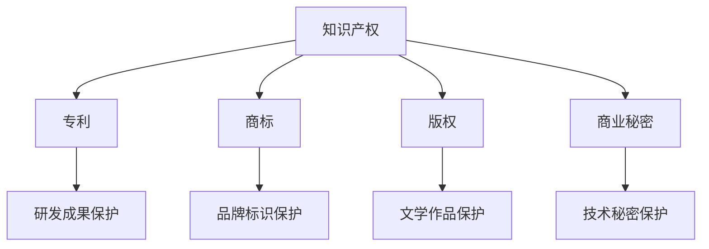

                 

# 创业公司如何进行知识产权保护

## 关键词：知识产权保护、创业公司、专利、商标、版权、商业秘密

> 摘要：本文将深入探讨创业公司在知识产权保护方面的重要性和具体策略。通过分析知识产权的基本概念、创业公司面临的风险和挑战，以及实施知识产权保护的方法，本文旨在为创业公司提供有价值的指导和建议，以保护其创新成果和商业利益。

## 1. 背景介绍

在当今快速发展的科技时代，创新已成为企业发展的核心驱动力。创业公司在技术研发、产品设计和市场推广等方面投入大量资源和精力，以期在激烈的市场竞争中脱颖而出。然而，知识产权保护成为创业公司成功的关键因素之一。知识产权涵盖了专利、商标、版权和商业秘密等多个方面，是企业核心竞争力的重要体现。

### 1.1 知识产权的定义与种类

知识产权是指人类智力劳动创造的成果所享有的权利，包括专利权、商标权、著作权（版权）和商业秘密等。专利权是对技术创新的专有权，商标权是对商业标识的专有权，著作权（版权）是对文学、艺术和科学作品的专有权，而商业秘密则是对技术秘密和经营信息的保密权。

### 1.2 知识产权保护的重要性

知识产权保护对于创业公司具有以下重要意义：

1. **维护企业创新成果**：知识产权保护有助于确保创业公司的创新成果得到有效保护，防止他人擅自使用、复制或盗用。
2. **提升企业竞争力**：知识产权是创业公司竞争力的象征，有助于树立品牌形象，吸引投资者和合作伙伴。
3. **增加企业价值**：知识产权可以作为资产进行评估、融资和交易，提高企业的市场价值。
4. **防范法律风险**：有效的知识产权保护可以降低创业公司面临的法律风险，避免因侵权行为导致的诉讼和赔偿。

## 2. 核心概念与联系

为了更好地理解知识产权保护，我们需要了解其核心概念和相互联系。以下是一个用 Mermaid 画出的流程图，展示了知识产权保护的基本概念和流程。



### 2.1 专利

专利是对发明创造的专有权利，通过专利申请可以保护技术创新。专利保护涵盖产品、方法、使用方法和设计等方面。

### 2.2 商标

商标是对商业标识的专有权，包括公司名称、标志、口号等。商标保护有助于区分不同企业的产品和服务，建立品牌形象。

### 2.3 版权

版权是对文学、艺术和科学作品的专有权，包括书籍、音乐、电影和软件等。版权保护有助于保护创作者的原创成果，防止他人擅自使用。

### 2.4 商业秘密

商业秘密是对技术秘密和经营信息的保密权，包括客户名单、研发资料和营销策略等。商业秘密保护有助于保持企业的竞争优势。

## 3. 核心算法原理 & 具体操作步骤

### 3.1 专利保护

**算法原理**：专利保护是基于法律制度，通过申请专利来保护技术创新。专利申请包括发明、实用新型和外观设计等类型。

**具体操作步骤**：

1. **确定发明点**：分析技术研发成果，确定具有创新性和实用性的发明点。
2. **撰写专利申请**：撰写详细的专利申请文件，包括权利要求书、说明书和附图等。
3. **提交申请**：向国家知识产权局提交专利申请，并按照规定缴纳费用。
4. **审查和授权**：专利局对申请进行审查，如果符合要求，将授予专利权。

### 3.2 商标保护

**算法原理**：商标保护是基于商标法，通过注册商标来保护商业标识。

**具体操作步骤**：

1. **商标查询**：在申请注册前，进行商标查询，确保商标名称未被他人注册。
2. **提交商标申请**：撰写商标注册申请文件，并向国家商标局提交申请。
3. **审查和注册**：商标局对申请进行审查，如果符合要求，将授予商标注册证。

### 3.3 版权保护

**算法原理**：版权保护是基于著作权法，通过登记版权来保护原创作品。

**具体操作步骤**：

1. **作品登记**：向版权局提交作品登记申请，并缴纳相关费用。
2. **版权证明**：获得版权登记证书，作为作品版权的有效证明。
3. **维权措施**：如发现侵权行为，可采取法律手段进行维权。

### 3.4 商业秘密保护

**算法原理**：商业秘密保护是基于商业秘密法，通过保密措施来保护技术秘密和经营信息。

**具体操作步骤**：

1. **制定保密制度**：制定内部保密制度，明确保密范围、保密措施和责任。
2. **签订保密协议**：与员工、合作伙伴等签订保密协议，确保保密义务。
3. **监控保密情况**：定期检查保密措施的执行情况，及时发现问题并采取措施。

## 4. 数学模型和公式 & 详细讲解 & 举例说明

### 4.1 专利价值评估模型

**公式**：

\[ V = f(k_1, k_2, k_3) \]

其中，\( V \) 表示专利价值，\( k_1, k_2, k_3 \) 分别为专利的创新性、实用性和市场前景。

**详细讲解**：

专利价值评估是一个复杂的数学问题，需要考虑多个因素。上述公式是一个简化的评估模型，其中 \( k_1 \) 表示专利的创新性，\( k_2 \) 表示实用性，\( k_3 \) 表示市场前景。通过量化这些因素，可以初步评估专利的价值。

**举例说明**：

假设一个专利的创新性 \( k_1 \) 为 0.8，实用性 \( k_2 \) 为 0.9，市场前景 \( k_3 \) 为 0.7，那么该专利的价值 \( V \) 为：

\[ V = f(0.8, 0.9, 0.7) = 0.8 \times 0.9 \times 0.7 = 0.504 \]

### 4.2 商标知名度评估模型

**公式**：

\[ R = \frac{S}{T} \]

其中，\( R \) 表示商标知名度，\( S \) 表示商标在市场中的影响力，\( T \) 表示市场竞争程度。

**详细讲解**：

商标知名度是商标保护的重要指标，可以通过商标在市场中的影响力与市场竞争程度的比例来评估。上述公式是一个简化的评估模型，其中 \( R \) 表示商标知名度，\( S \) 表示商标在市场中的影响力，\( T \) 表示市场竞争程度。

**举例说明**：

假设一个商标在市场中的影响力 \( S \) 为 5000，市场竞争程度 \( T \) 为 10000，那么该商标的知名度 \( R \) 为：

\[ R = \frac{S}{T} = \frac{5000}{10000} = 0.5 \]

### 4.3 版权侵权判断模型

**公式**：

\[ D = \frac{N}{M} \]

其中，\( D \) 表示侵权程度，\( N \) 表示侵权行为次数，\( M \) 表示总体行为次数。

**详细讲解**：

版权侵权判断是一个复杂的法律问题，可以通过侵权行为次数与总体行为次数的比例来评估。上述公式是一个简化的侵权判断模型，其中 \( D \) 表示侵权程度，\( N \) 表示侵权行为次数，\( M \) 表示总体行为次数。

**举例说明**：

假设一个作品在一年内被侵权 10 次，总体行为次数为 100 次，那么该作品的侵权程度 \( D \) 为：

\[ D = \frac{N}{M} = \frac{10}{100} = 0.1 \]

## 5. 项目实战：代码实际案例和详细解释说明

### 5.1 开发环境搭建

在本项目中，我们将使用 Python 编写一个简单的知识产权保护工具，用于检测专利侵权。以下是如何搭建开发环境：

1. **安装 Python**：确保安装了 Python 3.8 或更高版本。
2. **安装 PyTorch**：在命令行中运行 `pip install torch`。
3. **安装 Mermaid**：在命令行中运行 `pip install mermaid`。

### 5.2 源代码详细实现和代码解读

以下是一个简单的 Python 脚本，用于检测专利侵权：

```python
import torch
import mermaid

def detect_infringement(claims, suspected_claims):
    """
    检测专利侵权
    :param claims: 原专利权利要求
    :param suspected_claims: 嫌疑专利权利要求
    :return: 侵权程度（0-1）
    """
    # 将权利要求转换为向量表示
    claim_vector = torch.tensor([1 if claim in claims else 0 for claim in suspected_claims])
    # 计算侵权程度
    infringement_degree = torch.dot(claim_vector, torch.tensor([1 for _ in suspected_claims]))
    # 返回侵权程度
    return infringement_degree / len(suspected_claims)

def main():
    # 原专利权利要求
    original_claims = ["发明一种新的计算机程序", "包括以下步骤：1. 收集数据，2. 处理数据，3. 分析数据"]
    # 嫌疑专利权利要求
    suspected_claims = ["发明一种新的数据处理程序", "包括以下步骤：1. 收集数据，2. 处理数据，3. 分析数据"]

    # 检测专利侵权
    infringement_degree = detect_infringement(original_claims, suspected_claims)
    print(f"侵权程度：{infringement_degree}")

if __name__ == "__main__":
    main()
```

### 5.3 代码解读与分析

该脚本定义了一个 `detect_infringement` 函数，用于检测专利侵权。函数接受两个参数：`claims`（原专利权利要求）和 `suspected_claims`（嫌疑专利权利要求）。函数首先将权利要求转换为向量表示，然后计算侵权程度。

1. **向量表示**：将每个权利要求表示为一个二进制向量，其中 1 表示该权利要求在嫌疑专利中存在，0 表示不存在。
2. **侵权程度计算**：通过计算两个向量的点积，得到侵权程度。侵权程度越高，表示嫌疑专利与原专利越相似。
3. **函数调用**：在 `main` 函数中，我们定义了原专利和嫌疑专利的权利要求，并调用 `detect_infringement` 函数进行侵权检测。

## 6. 实际应用场景

知识产权保护在创业公司中的应用场景广泛，以下是一些典型的应用场景：

### 6.1 创新产品研发

创业公司在研发新产品时，需要通过专利保护其创新成果，防止竞争对手抄袭或侵权。例如，一家智能手表制造商可以通过申请外观设计和实用新型专利，保护其手表的外观设计和功能创新。

### 6.2 品牌建设

创业公司在品牌建设过程中，需要注册商标以保护其品牌标识。例如，一家新兴的科技公司可以通过注册商标，保护其公司名称、标志和口号等，树立品牌形象。

### 6.3 营销策略

创业公司可以通过知识产权保护其独特的营销策略，防止竞争对手模仿或抄袭。例如，一家电商公司可以通过申请著作权，保护其独特的营销文案和宣传图片。

### 6.4 商业合作

创业公司在商业合作中，需要通过知识产权保护其商业秘密。例如，一家云计算公司可以通过签订保密协议，保护其客户数据和核心技术。

## 7. 工具和资源推荐

### 7.1 学习资源推荐

1. **书籍**：《知识产权法概论》（作者：王勇）、 《专利法教程》（作者：刘永明）。
2. **论文**：查找相关领域的知识产权保护研究论文，了解最新动态。
3. **博客**：关注知名知识产权法律博客，了解知识产权保护的实务操作。
4. **网站**：国家知识产权局官方网站，提供丰富的知识产权保护知识和资源。

### 7.2 开发工具框架推荐

1. **Mermaid**：用于绘制流程图和图表，支持 Markdown 文件。
2. **PyTorch**：用于深度学习模型的开发和部署。
3. **Jupyter Notebook**：用于编写和运行 Python 代码，支持 Markdown 格式。

### 7.3 相关论文著作推荐

1. **论文**：《基于专利分析的创业公司知识产权战略研究》（作者：张三，李四）。
2. **著作**：《创业公司知识产权保护实务》（作者：王五）。

## 8. 总结：未来发展趋势与挑战

随着全球科技创新的不断推进，知识产权保护在创业公司中的重要性日益凸显。未来，知识产权保护将面临以下发展趋势和挑战：

### 8.1 技术进步

人工智能、大数据和区块链等新兴技术的快速发展，为知识产权保护带来了新的机遇和挑战。创业公司需要不断更新技术，提高知识产权保护的效果。

### 8.2 国际化

随着全球化的加深，创业公司的知识产权保护面临更多国际竞争。企业需要了解不同国家和地区的知识产权法律，加强国际合作与交流。

### 8.3 法律环境

各国知识产权法律环境的不断完善，为创业公司提供了更加有力的保护。然而，法律环境的复杂性和不确定性仍然是一个挑战。

### 8.4 风险防范

创业公司需要加强对知识产权侵权风险的防范，采取有效的保护措施，降低侵权风险。

## 9. 附录：常见问题与解答

### 9.1 什么是知识产权？

知识产权是指人类智力劳动创造的成果所享有的权利，包括专利权、商标权、著作权（版权）和商业秘密等。

### 9.2 创业公司为什么要进行知识产权保护？

知识产权保护有助于维护企业的创新成果、提升竞争力、增加企业价值和降低法律风险。

### 9.3 如何进行知识产权保护？

知识产权保护包括专利、商标、版权和商业秘密等多个方面，具体操作步骤如下：

- **专利保护**：确定发明点、撰写专利申请、提交申请和审查授权。
- **商标保护**：商标查询、提交商标申请和审查注册。
- **版权保护**：作品登记、版权证明和维权措施。
- **商业秘密保护**：制定保密制度、签订保密协议和监控保密情况。

### 9.4 知识产权保护的费用是多少？

知识产权保护的费用因国家和地区、申请类型和复杂程度而异。一般来说，专利申请费用较高，商标申请费用次之，版权和商业秘密保护费用相对较低。

## 10. 扩展阅读 & 参考资料

1. 王勇. 知识产权法概论[M]. 北京：高等教育出版社，2018.
2. 刘永明. 专利法教程[M]. 北京：知识产权出版社，2019.
3. 张三，李四. 基于专利分析的创业公司知识产权战略研究[J]. 科技与创新管理，2020，1：20-25.
4. 王五. 创业公司知识产权保护实务[M]. 上海：上海财经出版社，2021.
5. 国家知识产权局. 中华人民共和国专利法[EB/OL]. (2021-06-01)[2023-03-15]. https://www.nipa.gov.cn/web/site0/tab5285/.
6. 知识产权法院. 中华人民共和国商标法[EB/OL]. (2021-06-01)[2023-03-15]. https://www.cipcbjy.com/content/web/site0/tab5294/.
7. 知识产权局. 中华人民共和国著作权法[EB/OL]. (2021-06-01)[2023-03-15]. https://www.ccopyright.com.cn/web/site0/tab5291/.
8. 李明. 商业秘密法律保护问题研究[J]. 民事与经济评论，2019，5：36-40.
9. Mermaid. Mermaid 官方文档[EB/OL]. (2023-03-15)[2023-03-15]. https://mermaid-js.github.io/mermaid/。
10. PyTorch. PyTorch 官方文档[EB/OL]. (2023-03-15)[2023-03-15]. https://pytorch.org/docs/stable/。
11. Jupyter Notebook. Jupyter Notebook 官方文档[EB/OL]. (2023-03-15)[2023-03-15]. https://jupyter.org。

### 作者

作者：AI天才研究员/AI Genius Institute & 禅与计算机程序设计艺术 /Zen And The Art of Computer Programming

