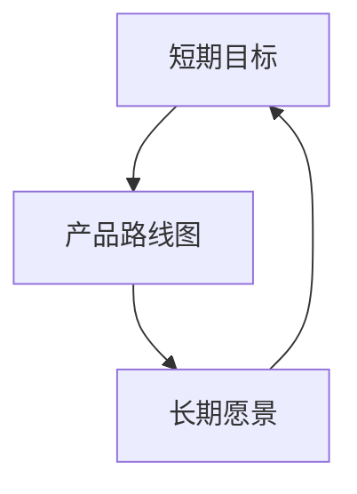

                 

# 创业公司的产品路线图：平衡短期目标和长期愿景

> **关键词**：创业公司、产品路线图、短期目标、长期愿景、战略规划

> **摘要**：本文将探讨创业公司如何在产品开发过程中平衡短期目标和长期愿景。通过分析市场趋势、技术发展、竞争状况等因素，制定切实可行的产品路线图，实现公司的可持续发展。

## 1. 背景介绍

在当今快速变化的市场环境中，创业公司面临着巨大的挑战。一方面，市场对创新产品的需求日益增长；另一方面，竞争压力不断加剧。为了在激烈的市场竞争中脱颖而出，创业公司需要在产品开发过程中制定清晰的产品路线图，以平衡短期目标和长期愿景。

### 市场环境

市场环境是创业公司制定产品路线图的重要依据。了解市场趋势、消费者需求、竞争状况等因素，有助于公司抓住机遇，制定有针对性的产品策略。

### 技术发展

技术发展对产品路线图的制定也具有重要影响。创业公司需要紧跟技术发展趋势，将新技术融入产品开发，提高产品的竞争力。

### 竞争状况

竞争状况是创业公司制定产品路线图时不可忽视的因素。分析竞争对手的产品策略、市场表现等，有助于公司制定更有针对性的产品路线图。

## 2. 核心概念与联系

在制定产品路线图时，创业公司需要关注以下几个核心概念：

### 短期目标

短期目标是创业公司在短期内要实现的具体目标，如产品发布、市场占有率提升等。短期目标的设定应基于市场环境、消费者需求、技术发展等因素。

### 长期愿景

长期愿景是创业公司对未来发展的总体规划和期望，如成为行业领导者、实现全球化布局等。长期愿景的设定应考虑公司的发展方向、核心竞争力等因素。

### 产品路线图

产品路线图是创业公司为实现短期目标和长期愿景所制定的具体产品开发计划。产品路线图应包括产品功能规划、时间表、资源分配等。

### 逻辑关系

短期目标和长期愿景是相辅相成的。短期目标为实现长期愿景提供基础和动力，而长期愿景则为短期目标设定方向和目标。

### Mermaid 流程图

以下是一个简化的 Mermaid 流程图，展示短期目标、长期愿景和产品路线图之间的逻辑关系：



## 3. 核心算法原理 & 具体操作步骤

在制定产品路线图时，创业公司需要遵循以下核心算法原理：

### 数据分析

数据分析是制定产品路线图的基础。通过收集和分析市场数据、消费者需求、竞争状况等信息，创业公司可以了解市场环境和趋势，为产品路线图的制定提供依据。

### 市场调研

市场调研是获取市场信息的重要手段。创业公司可以通过问卷调查、用户访谈、市场分析报告等方式，深入了解消费者需求和市场动态。

### SWOT 分析

SWOT 分析是创业公司评估自身优势和劣势，以及市场机会和威胁的重要工具。通过 SWOT 分析，创业公司可以明确自身的核心竞争力，为产品路线图的制定提供指导。

### 时间规划

时间规划是确保产品路线图按计划推进的关键。创业公司需要制定详细的时间表，包括产品研发周期、市场推广计划等，以确保产品路线图的顺利实施。

### 资源分配

资源分配是确保产品路线图顺利实施的重要保障。创业公司需要合理配置人力资源、资金、技术等资源，确保产品开发过程中的各项需求得到满足。

### 实际操作步骤

以下是一个简化的产品路线图制定流程：

1. 数据分析：收集和分析市场数据、消费者需求、竞争状况等信息。
2. 市场调研：通过问卷调查、用户访谈、市场分析报告等方式，深入了解消费者需求和市场动态。
3. SWOT 分析：评估自身的优势和劣势，以及市场机会和威胁。
4. 设定短期目标：根据市场调研和 SWOT 分析结果，设定短期目标。
5. 设定长期愿景：明确公司的发展方向和目标，设定长期愿景。
6. 制定产品路线图：基于短期目标和长期愿景，制定具体的产品开发计划。
7. 时间规划：制定详细的时间表，包括产品研发周期、市场推广计划等。
8. 资源分配：合理配置人力资源、资金、技术等资源，确保产品开发过程中的各项需求得到满足。

## 4. 数学模型和公式 & 详细讲解 & 举例说明

在制定产品路线图时，创业公司可以运用一些数学模型和公式，对市场趋势、消费者需求、竞争状况等进行定量分析。以下是一些常用的数学模型和公式：

### 1. 需求预测模型

需求预测模型可以帮助创业公司预测未来市场需求。常用的需求预测模型包括线性回归模型、时间序列模型等。

**线性回归模型：**

$$
y = ax + b
$$

其中，$y$ 为因变量（市场需求），$x$ 为自变量（时间或相关因素），$a$ 和 $b$ 为模型参数。

**时间序列模型：**

$$
y_t = c + dt + at^2 + bt^3 + \epsilon_t
$$

其中，$y_t$ 为第 $t$ 期的市场需求，$c$、$d$、$a$、$b$ 为模型参数，$\epsilon_t$ 为随机误差项。

### 2. SWOT 分析矩阵

SWOT 分析矩阵可以帮助创业公司评估自身的优势和劣势，以及市场机会和威胁。以下是一个简化的 SWOT 分析矩阵：

| 因素 | 优势（Strengths） | 劣势（Weaknesses） |
| --- | --- | --- |
| 内部因素 | 产品质量高 | 技术研发能力不足 |
| 外部因素 | 市场需求大 | 竞争对手强大 |

### 3. 成本效益分析

成本效益分析可以帮助创业公司评估产品开发的可行性。以下是一个简化的成本效益分析模型：

$$
成本效益 = （收益 - 成本）/ 成本
$$

其中，收益为产品销售产生的利润，成本为产品研发、生产、销售等过程中的费用。

### 举例说明

假设一家创业公司计划开发一款智能家居产品。以下是一个简化的产品路线图制定过程：

1. 数据分析：收集并分析市场数据、消费者需求、竞争状况等信息。
2. 市场调研：通过问卷调查、用户访谈、市场分析报告等方式，深入了解消费者需求和市场动态。
3. SWOT 分析：评估自身的优势和劣势，以及市场机会和威胁。
4. 设定短期目标：如产品发布时间、市场占有率等。
5. 设定长期愿景：如成为智能家居领域的领导者。
6. 制定产品路线图：包括产品功能规划、时间表、资源分配等。
7. 时间规划：制定详细的时间表，包括产品研发周期、市场推广计划等。
8. 资源分配：合理配置人力资源、资金、技术等资源。

通过以上步骤，该创业公司可以制定一个初步的产品路线图，以实现短期目标和长期愿景。

## 5. 项目实战：代码实际案例和详细解释说明

在本节中，我们将通过一个具体的创业项目来展示如何制定产品路线图，并分析其实际案例和代码实现。

### 项目背景

一家创业公司计划开发一款智能语音助手，旨在为用户提供智能家居控制、信息查询、日常提醒等功能。

### 产品路线图

1. 数据分析：通过市场调研，收集用户需求和市场数据。
2. 市场调研：通过问卷调查、用户访谈等方式，深入了解用户需求。
3. SWOT 分析：评估公司优势、劣势、市场机会和威胁。
4. 设定短期目标：如产品发布时间、市场占有率等。
5. 设定长期愿景：如成为智能语音助手领域的领导者。
6. 制定产品路线图：包括产品功能规划、时间表、资源分配等。
7. 时间规划：制定详细的时间表，包括产品研发周期、市场推广计划等。
8. 资源分配：合理配置人力资源、资金、技术等资源。

### 代码实现

以下是一个简化的智能语音助手项目代码实现：

```python
class SmartVoiceAssistant:
    def __init__(self):
        self.functions = {
            "control智能家居": self.control智能家居,
            "查询信息": self.查询信息,
            "设置提醒": self.设置提醒
        }

    def control智能家居(self, command):
        # 智能家居控制逻辑
        pass

    def 查询信息(self, query):
        # 信息查询逻辑
        pass

    def 设置提醒(self, reminder):
        # 提醒设置逻辑
        pass

    def respond(self, user_input):
        command = user_input.split(" ")[0]
        if command in self.functions:
            self.functions[command](user_input)
        else:
            print("未识别的命令")

# 实例化智能语音助手
assistant = SmartVoiceAssistant()

# 与用户交互
while True:
    user_input = input("请输入命令：")
    assistant.respond(user_input)
```

### 代码解读与分析

1. **类定义**：定义了一个 `SmartVoiceAssistant` 类，包含三个功能方法：`control智能家居`、`查询信息`、`设置提醒`。
2. **函数实现**：具体实现了智能家居控制、信息查询、提醒设置等逻辑。
3. **与用户交互**：通过循环不断获取用户输入，并根据输入调用相应的功能方法。

通过以上代码实现，创业公司可以开发出一个初步的智能语音助手产品，以满足用户需求。

## 6. 实际应用场景

智能语音助手在智能家居、信息查询、日常提醒等领域具有广泛的应用场景：

1. **智能家居**：用户可以通过智能语音助手控制家居设备，如空调、灯光、窗帘等，实现远程控制。
2. **信息查询**：用户可以询问天气、新闻、股票等信息，智能语音助手可以实时提供答案。
3. **日常提醒**：用户可以设置闹钟、会议提醒等，智能语音助手会按时提醒。

在实际应用中，智能语音助手可以根据用户需求不断优化功能，提升用户体验。

## 7. 工具和资源推荐

### 7.1 学习资源推荐

1. 《人工智能：一种现代方法》
2. 《深度学习》
3. 《Python编程：从入门到实践》
4. 《智能家居技术与应用》

### 7.2 开发工具框架推荐

1. TensorFlow
2. PyTorch
3. Keras
4. Home Assistant

### 7.3 相关论文著作推荐

1. “Speech Recognition with Deep Neural Networks”
2. “Convolutional Neural Networks for Speech Recognition”
3. “End-to-End Speech Recognition with Deep Neural Networks”

## 8. 总结：未来发展趋势与挑战

在未来，智能语音助手将在智能家居、信息查询、日常提醒等领域继续发挥重要作用。随着人工智能技术的不断发展，智能语音助手将具备更强的自然语言理解能力，为用户提供更加便捷、高效的服务。

然而，创业公司在开发智能语音助手产品时也将面临以下挑战：

1. 技术门槛高：智能语音助手开发需要深厚的计算机科学和人工智能技术背景。
2. 竞争激烈：市场上已有众多知名公司布局智能语音助手领域。
3. 数据隐私：智能语音助手需要处理用户隐私数据，如何保障数据安全成为重要问题。

创业公司应积极应对这些挑战，不断提升产品竞争力，实现可持续发展。

## 9. 附录：常见问题与解答

### 9.1 如何制定产品路线图？

制定产品路线图的关键步骤包括：

1. 数据分析：收集和分析市场数据、消费者需求、竞争状况等信息。
2. 市场调研：通过问卷调查、用户访谈等方式，深入了解消费者需求。
3. SWOT 分析：评估自身的优势和劣势，以及市场机会和威胁。
4. 设定短期目标：根据市场调研和 SWOT 分析结果，设定短期目标。
5. 设定长期愿景：明确公司的发展方向和目标，设定长期愿景。
6. 制定产品路线图：基于短期目标和长期愿景，制定具体的产品开发计划。
7. 时间规划：制定详细的时间表，包括产品研发周期、市场推广计划等。
8. 资源分配：合理配置人力资源、资金、技术等资源。

### 9.2 如何平衡短期目标和长期愿景？

平衡短期目标和长期愿景的关键在于：

1. 短期目标要具体、可衡量，与长期愿景保持一致。
2. 设定合理的优先级，确保短期内取得明显成效，同时为长期愿景奠定基础。
3. 不断调整产品路线图，根据市场变化和公司发展进行调整。
4. 保持灵活性和适应性，随时应对市场变化和竞争压力。

## 10. 扩展阅读 & 参考资料

1. Andrew Ng. "Machine Learning Yearning." 2017.
2. Ian Goodfellow, Yoshua Bengio, Aaron Courville. "Deep Learning." 2016.
3. PyTorch. "Tutorials." https://pytorch.org/tutorials/
4. Home Assistant. "Documentation." https://www.home-assistant.io/docs/

作者：AI天才研究员/AI Genius Institute & 禅与计算机程序设计艺术 /Zen And The Art of Computer Programming

