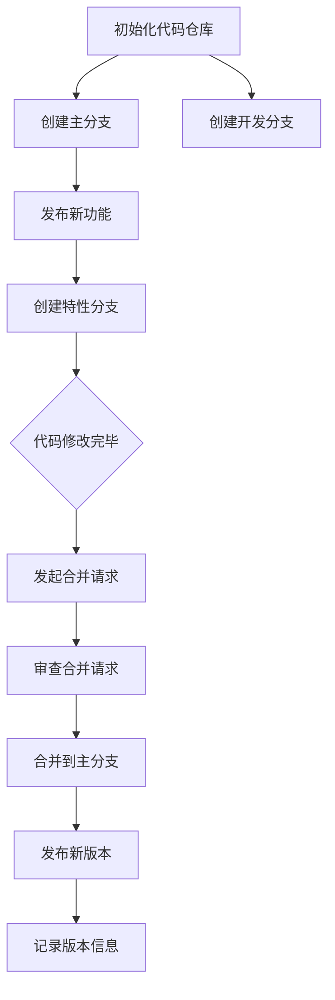

                 

### 背景介绍

在当今快速发展的商业环境中，创业公司的成功往往取决于其产品的竞争力。而产品的竞争力又与其迭代速度和质量息息相关。版本管理作为产品开发过程中的关键环节，对于确保产品质量、提升开发效率、优化用户体验具有重要意义。本文旨在探讨创业公司在产品迭代与版本管理方面的策略与实践，帮助创业团队更好地应对市场变化，实现产品持续优化。

版本管理不仅仅是一个技术问题，更是一个涉及团队协作、项目管理、市场策略等多方面因素的综合问题。随着技术的发展和市场的变化，创业公司在版本管理方面面临诸多挑战。例如，如何在保证产品质量的前提下快速迭代？如何协调不同团队成员之间的工作进度？如何在版本迭代过程中保持与市场需求的同步？本文将围绕这些问题，结合实际案例，提出一些切实可行的解决方案。

在接下来的内容中，我们将首先介绍版本管理的核心概念与联系，通过Mermaid流程图展示其基本原理和架构。接着，我们将深入探讨核心算法原理及具体操作步骤，并借助数学模型和公式进行详细讲解。随后，我们将通过一个实际项目案例，展示代码实现和解读过程，帮助读者理解版本管理的具体应用。在此基础上，我们将分析版本管理在实际应用场景中的优势，并推荐一些相关工具和资源。最后，我们还将总结未来发展趋势与挑战，为创业公司在版本管理方面提供一些有益的思考。

通过本文的阅读，读者将能够系统地了解版本管理的理论知识，掌握实际操作技巧，并能够将这些知识应用到自己的产品开发过程中，从而提升产品的竞争力。

### 核心概念与联系

版本管理，顾名思义，是对软件的版本进行跟踪和管理的一门技术。它不仅涉及代码的版本，还包括文档、设计、测试等各种与软件开发相关的资源。为了更好地理解版本管理的概念，我们需要先了解几个关键术语：版本号、分支管理、合并请求、标签等。

#### 版本号

版本号是标识软件版本的一种数字或字符串，通常采用“主版本号.次版本号.修订版本号”的形式。例如，1.0.1 表示这是一个主版本为1，次版本为0，修订版本为1的软件版本。版本号的目的是帮助开发者和用户快速识别软件的不同版本，并判断新版本是否引入了重要的更新或修正。

在版本管理中，版本号的管理是至关重要的。一个良好的版本号策略可以确保版本之间的差异清晰可辨，有助于开发者快速定位问题并修复。同时，它也能够帮助用户评估新版本的稳定性和重要性，从而做出是否升级的决定。

#### 分支管理

分支管理是版本管理的一个重要方面。在软件开发过程中，不同的团队成员可能会对同一份代码进行修改，这时就需要通过分支来隔离不同的修改。通常，分支可以分为以下几种类型：

- **主分支（Master）**：主分支是软件开发的主要分支，通常用于维护生产环境的代码。所有的功能发布和修复都会提交到主分支上。

- **开发分支（Development）**：开发分支用于开发新功能或进行大规模修改。开发过程中，开发人员会在开发分支上进行工作，待功能开发完成后，再将其合并回主分支。

- **特性分支（Feature）**：特性分支是用于开发新功能的分支。每个新功能都可以创建一个独立的特性分支，这样可以避免对主分支的影响，同时便于管理和维护。

- **修复分支（Hotfix）**：修复分支用于修复紧急的bug或安全问题。修复完成后，会将修复内容合并回主分支和相关特性分支。

#### 合并请求

合并请求（Pull Request，简称PR）是版本管理中的一种协作机制。当开发者在特性分支或修复分支上完成代码修改后，需要将修改内容合并到主分支或开发分支。这时，他们会发起一个合并请求，供其他开发者审查和讨论。

合并请求不仅能够帮助团队确保代码质量，还能够促进团队成员之间的交流和合作。通过审查合并请求，开发者可以及时发现潜在的问题，提出改进建议，从而提高代码的整体质量。

#### 标签

标签（Tag）是用于标识特定版本的元数据。通常，在发布新版本时，开发者会使用标签来标记该版本。这样，用户可以通过标签快速定位到特定的版本，方便进行安装或回滚。

标签的使用不仅有助于版本管理，还能够方便地实现版本回滚和故障恢复。例如，当新版本出现问题需要回滚时，开发者可以快速定位到之前标记的稳定版本，从而恢复系统的正常运行。

#### Mermaid流程图

为了更好地展示版本管理的流程和架构，我们可以使用Mermaid流程图进行描述。以下是版本管理流程的基本架构：



通过上述流程图，我们可以清晰地看到版本管理的基本步骤，包括代码仓库的初始化、分支的创建与管理、合并请求的发起与审查、新版本的发布和版本信息的记录。这些步骤不仅有助于确保代码的质量和稳定性，还能够提升团队的协作效率。

综上所述，版本管理是一个涉及多个环节和关键术语的复杂过程。通过理解这些核心概念，开发者和团队能够更好地应对版本管理的挑战，实现产品的持续优化和迭代。在下一节中，我们将进一步探讨版本管理中的核心算法原理及具体操作步骤。

#### 核心算法原理 & 具体操作步骤

版本管理中的核心算法主要包括版本控制算法和合并算法。这些算法确保了版本之间的有序性和一致性，是版本管理系统的基石。在本节中，我们将详细探讨这些核心算法的原理，并介绍具体的操作步骤。

##### 版本控制算法

版本控制算法负责管理和维护不同版本的代码。常见的版本控制系统如Git，采用一种基于快照的版本控制方法。这种方法的核心思想是每次提交（commit）都会生成一个新的代码快照，记录下所有文件的内容和状态。

1. **提交快照**：每次开发者完成一段代码的修改后，都会通过`git commit`命令生成一个新的快照。这个快照包含了提交的说明、时间戳、作者等信息。

2. **分支管理**：版本控制算法支持分支（branch）的创建和合并（merge）。开发者可以在开发分支（development branch）或特性分支（feature branch）上进行工作，待完成后再将其合并（merge）到主分支（master branch）。

3. **版本追踪**：通过查看提交历史（`git log`），开发者可以追踪代码的版本变化。这有助于理解代码的演进过程，便于查找和修复问题。

##### 合并算法

合并算法负责将不同分支上的修改合并到一个共同的分支中。当特性分支或修复分支完成开发后，需要将其合并到主分支或开发分支。Git中的合并算法主要包括以下步骤：

1. **发起合并请求**：开发者通过`git fetch`和`git merge`命令将特性分支的修改同步到本地主分支或开发分支。这个过程可能会产生冲突（conflict），即不同分支对同一文件的修改产生了冲突。

2. **解决冲突**：当出现冲突时，开发者需要手动解决。Git会标记出冲突的文件，并显示冲突的内容。开发者可以根据冲突的类型和上下文手动合并或选择其中一个分支的修改。

3. **提交合并结果**：在解决冲突后，开发者通过`git add`和`git commit`命令提交合并结果。Git会记录下这次合并的操作和冲突解决的过程。

4. **代码审查**：在提交合并请求后，团队成员可以通过审查（review）来确保合并的质量。审查过程包括代码的静态分析、测试验证等，以确保合并后的代码没有引入新的问题。

##### 实操步骤

以下是一个具体的版本控制与合并的实操步骤示例：

1. **初始化代码仓库**：
    ```bash
    git init
    git remote add origin <仓库地址>
    git fetch
    ```

2. **创建主分支和开发分支**：
    ```bash
    git checkout -b master
    git checkout -b development
    ```

3. **在开发分支上创建特性分支**：
    ```bash
    git checkout -b feature/new-features
    ```

4. **在特性分支上修改代码并提交**：
    ```bash
    git add .
    git commit -m "Add new features"
    ```

5. **将特性分支合并到主分支**：
    ```bash
    git checkout master
    git merge feature/new-features
    git commit -m "Merge new features into master"
    ```

6. **解决合并冲突**：
    ```bash
    git status
    git add <conflicted-file>
    git commit -m "Resolved conflicts in <conflicted-file>"
    ```

7. **发起合并请求**：
    - 在代码仓库的管理界面发起合并请求，供团队成员审查。

8. **审查合并请求**：
    - 开发团队成员进行代码审查，提出改进建议。

9. **合并到主分支**：
    - 审查通过后，管理员将合并请求合并到主分支。

通过以上步骤，我们可以看到版本控制与合并的过程是系统化、流程化的。这不仅有助于确保代码的质量和一致性，还能够提高团队的协作效率。在下一节中，我们将进一步探讨版本管理中的数学模型和公式，以及如何通过这些模型和公式进行详细讲解和举例说明。

#### 数学模型和公式 & 详细讲解 & 举例说明

版本管理涉及许多数学模型和公式，这些工具帮助开发者更好地理解和管理代码的复杂性和变化。在本节中，我们将介绍几个关键数学模型和公式，并通过具体实例来详细讲解其应用。

##### 版本号编码

版本号编码是一个基本的数学模型，用于表示软件的版本。常见的版本号格式如`1.2.3`，其中每个数字都有特定的含义：主版本号、次版本号和修订版本号。

1. **主版本号（Major Version）**：表示软件的大版本，通常在功能有重大变化或架构重构时更新。
2. **次版本号（Minor Version）**：表示软件的小版本，通常在添加新功能或改进现有功能时更新。
3. **修订版本号（Patch Version）**：表示软件的修补版本，通常用于修复bug或进行性能优化。

**公式**：版本号 V 可以表示为 V = M.N.P，其中 M、N、P 分别为主版本号、次版本号和修订版本号。

**实例**：

假设我们有一个软件的版本历史如下：

| 日期 | 版本号 | 说明 |
|------|--------|------|
| 2021-01-01 | 1.0.0 | 初始版本 |
| 2021-02-01 | 1.1.0 | 新增功能 |
| 2021-03-01 | 1.1.1 | 修复bug |

在这个例子中，主版本号从 1 更新到 1，次版本号从 0 更新到 1，修订版本号从 0 更新到 1。每次更新都遵循上述的版本号编码规则。

##### 分支合并成本模型

分支合并成本模型用于评估不同分支合并时的成本。合并成本主要包括时间成本和冲突成本。时间成本是指将分支合并到主分支所需的时间，而冲突成本是指解决分支冲突所需的时间和精力。

**公式**：合并成本 C = C_t + C_c，其中 C_t 是时间成本，C_c 是冲突成本。

**实例**：

假设我们有两个分支：开发分支（dev）和特性分支（feature），每个分支上的修改都需要合并到主分支（master）。

- **时间成本**：假设每个修改的合并需要 1 天，那么总时间成本为 2 天。
- **冲突成本**：假设在合并过程中发现了一个冲突，解决这个冲突需要 2 天。

因此，总的合并成本 C = 2 + 2 = 4 天。

##### 冲突解决策略

在版本管理中，冲突解决策略是解决分支冲突的关键。常见的冲突解决策略包括手动解决、自动化解决和基于优先级的解决。

**公式**：解决策略 S = (P, A)，其中 P 是优先级，A 是解决方法。

- **手动解决**：开发者手动审查冲突文件，选择适当的解决方案。
- **自动化解决**：使用工具（如Git的`git merge --strategy-octopus`）自动解决冲突。
- **基于优先级的解决**：根据开发者的角色或提交时间来确定解决方案的优先级。

**实例**：

假设有两个开发者 A 和 B，他们在同一文件上进行了修改，产生了冲突。

- **优先级策略**：假设 A 的提交时间早于 B，则 A 的修改优先级高于 B。
- **解决方法**：手动审查冲突文件，选择 A 的修改内容。

通过这些数学模型和公式，开发者可以更好地理解版本管理的过程，并有效地管理代码的复杂性和变化。在下一节中，我们将通过一个实际项目案例，展示代码实现和解读过程，帮助读者更直观地理解版本管理的实际应用。

#### 项目实战：代码实际案例和详细解释说明

在本节中，我们将通过一个实际项目案例，详细展示版本管理的代码实现过程。这个项目是一个简单的博客系统，旨在展示如何使用Git进行版本控制和分支管理。以下是项目的开发过程及代码解读。

##### 1. 开发环境搭建

首先，我们需要搭建一个简单的开发环境。在这个案例中，我们使用一个虚拟环境来安装所需的依赖。

```bash
# 创建虚拟环境
python -m venv venv
# 激活虚拟环境
source venv/bin/activate
# 安装依赖
pip install Flask
```

##### 2. 源代码详细实现和代码解读

接下来，我们开始编写博客系统的代码。以下是项目的目录结构和主要代码文件：

```plaintext
/your-blog-project
|-- app.py
|-- requirements.txt
|-- venv
|-- ...
```

**app.py**：这是博客系统的主文件，包含Flask应用的核心代码。

```python
from flask import Flask, render_template, request, redirect, url_for

app = Flask(__name__)

@app.route('/')
def home():
    return render_template('home.html')

@app.route('/post/new', methods=['GET', 'POST'])
def new_post():
    if request.method == 'POST':
        title = request.form['title']
        content = request.form['content']
        # 保存到数据库（此处省略数据库操作）
        return redirect(url_for('home'))
    return render_template('new_post.html')

if __name__ == '__main__':
    app.run(debug=True)
```

在这个文件中，我们定义了两个路由：`/` 和 `/post/new`。`/` 路由用于显示博客首页，`/post/new` 路由用于创建新的博客文章。

**home.html**：这是博客首页的模板文件。

```html
<!DOCTYPE html>
<html>
<head>
    <title>My Blog</title>
</head>
<body>
    <h1>My Blog</h1>
    <a href="{{ url_for('new_post') }}">New Post</a>
    <!-- 显示文章列表（此处省略） -->
</body>
</html>
```

在这个文件中，我们添加了一个链接，允许用户创建新的博客文章。

**new_post.html**：这是创建新博客文章的模板文件。

```html
<!DOCTYPE html>
<html>
<head>
    <title>New Post</title>
</head>
<body>
    <h1>New Post</h1>
    <form method="POST" action="{{ url_for('new_post') }}">
        <label for="title">Title:</label>
        <input type="text" id="title" name="title" required><br>
        <label for="content">Content:</label>
        <textarea id="content" name="content" required></textarea><br>
        <input type="submit" value="Submit">
    </form>
</body>
</html>
```

在这个文件中，我们定义了一个表单，用于收集新博客文章的标题和内容。

##### 3. 代码解读与分析

在本节中，我们首先搭建了一个简单的开发环境，并编写了博客系统的主要代码文件。接下来，我们详细分析了每个文件的功能和实现过程。

- **app.py**：这是博客系统的主要文件，定义了Flask应用的核心路由和处理逻辑。通过`@app.route()`装饰器，我们定义了两个路由：`/`和`/post/new`。在`/post/new`路由中，我们接收用户提交的表单数据，并将其保存到数据库（此处省略了数据库操作的实现）。

- **home.html**：这是博客首页的模板文件，用于显示博客首页的内容。在这个文件中，我们添加了一个链接，允许用户创建新的博客文章。

- **new_post.html**：这是创建新博客文章的模板文件，用于收集新博客文章的标题和内容。在这个文件中，我们定义了一个表单，并使用HTML的`<label>`和`<input>`元素收集用户输入。

通过这个实际项目案例，我们展示了如何使用Git进行版本控制和分支管理。在实际开发过程中，开发者可以将不同的功能模块分别开发在不同的分支上，待功能开发完成后，再将其合并到主分支上。这样的开发模式有助于提高代码的稳定性和可维护性。

在下一节中，我们将进一步探讨版本管理在实际应用场景中的优势和挑战，并推荐一些相关的工具和资源，以帮助读者更好地理解和应用版本管理。

### 实际应用场景

版本管理不仅在软件开发中扮演着关键角色，还在许多其他领域展现出了其独特的优势。以下是一些常见的实际应用场景，以及版本管理在这些场景中的具体作用。

#### 1. 软件开发

软件开发生命周期中的版本管理至关重要。通过Git等版本控制系统，开发团队能够有效地管理代码的不同版本，确保代码的完整性和可追溯性。分支管理策略使得团队成员可以独立开发新功能或修复bug，而不会相互干扰。合并请求和审查流程则确保了代码质量，减少了引入错误的概率。

**优势**：提高开发效率、确保代码质量、便于问题追踪、团队协作更加顺畅。

**挑战**：复杂分支结构可能导致维护成本增加、合并冲突处理需要耗费时间。

#### 2. 项目管理

版本管理不仅应用于软件开发，还广泛应用于项目管理中。项目经理可以利用版本控制系统的变更记录和分支管理功能，追踪项目的进展和变更历史。通过这些信息，项目经理可以更好地了解项目的当前状态，及时调整项目计划，确保项目按期完成。

**优势**：提供项目变更的历史记录、便于问题定位和解决、帮助团队进行决策。

**挑战**：项目管理过程中可能需要额外的培训和适应时间、对于大型项目来说，版本控制系统的性能可能成为瓶颈。

#### 3. 产品运营

在产品运营中，版本管理同样发挥着重要作用。运营团队可以利用版本控制系统的标签功能，标记关键版本的发布和更新。这样，当新版本出现问题时，可以快速回滚到上一个稳定版本，确保产品的正常运行。此外，版本管理还能帮助运营团队评估不同版本的用户反馈，从而指导产品改进方向。

**优势**：提高产品稳定性、便于版本回滚和故障恢复、便于收集用户反馈。

**挑战**：可能需要额外的测试和验证工作、对于快速迭代的产品来说，版本管理可能带来额外的工作量。

#### 4. 数据科学和机器学习

在数据科学和机器学习领域，版本管理同样不可或缺。数据科学家和机器学习工程师可以利用版本控制系统来管理模型的训练数据和模型代码。通过分支管理，他们可以独立进行模型的开发和测试，而不会影响到其他团队成员的工作。合并请求和审查流程则确保了模型的稳定性和可靠性。

**优势**：便于模型代码和数据的版本追踪、提高模型开发的协作效率、便于问题追踪和修复。

**挑战**：对于大型数据集和复杂模型来说，版本控制系统的性能可能成为瓶颈、模型训练过程可能需要大量时间。

#### 5. 网站和内容管理系统

在网站和内容管理系统中，版本管理用于管理网站内容和页面布局的变更。通过版本控制系统，网站开发团队能够轻松地追踪和管理网页的不同版本。当网站更新或进行重大改动时，版本管理系统能够帮助团队快速回滚到之前的版本，确保网站的稳定性和可靠性。

**优势**：便于网站内容的版本追踪和变更管理、提高网站的稳定性和可靠性、便于问题定位和修复。

**挑战**：可能需要额外的培训和适应时间、对于大型网站来说，版本控制系统的性能可能成为瓶颈。

综上所述，版本管理在软件开发、项目管理、产品运营、数据科学和机器学习、网站和内容管理系统等多个领域都展现出了其独特的优势。然而，在实际应用过程中，也面临着一些挑战，如复杂的分支结构、合并冲突处理、性能瓶颈等。通过合理规划和有效管理，这些问题可以得到有效解决。

在下一节中，我们将推荐一些实用的工具和资源，帮助读者更好地掌握版本管理技术和实践。

### 工具和资源推荐

为了帮助读者更好地掌握版本管理的技术和实践，我们推荐一些优秀的工具、书籍、博客和网站。以下是对这些资源的详细介绍。

#### 1. 学习资源推荐

**书籍**：

- **《版本控制工作流程》**（作者：林昊）：这是一本深入讲解版本控制工作流程的书籍，涵盖了Git、SVN等多种版本控制系统，内容全面，适合初学者和有经验的开发者。
- **《Git权威指南》**（作者：理查德·赫尔曼）：详细介绍了Git的基本概念和操作，包括分支管理、合并请求、代码审查等内容，是学习Git的必备书籍。
- **《Git实战》**（作者：杰里米·瓦滕巴赫）：通过大量实战案例，深入讲解Git在实际开发中的应用，内容丰富，适合希望提高Git使用水平的技术人员。

**论文**：

- **《版本控制模型研究》**：这是一篇关于版本控制模型的学术论文，探讨了不同版本控制系统的优缺点，以及如何选择合适的版本控制系统。
- **《Git内部原理》**：该论文详细分析了Git的内部实现原理，包括数据结构、算法和存储机制，适合对Git有兴趣的读者。

**博客**：

- **GitHub官方博客**：GitHub官方博客提供了大量的版本控制相关文章，涵盖了从基本操作到高级技巧的各种内容，适合不同层次的读者。
- **Git社区官方博客**：Git社区官方博客包含了Git的最新动态、实用教程和技术文章，是了解Git最新发展的好去处。

#### 2. 开发工具框架推荐

**版本控制系统**：

- **Git**：Git是目前最流行的版本控制系统，拥有丰富的功能和强大的社区支持，适合各种规模的项目。
- **GitLab**：GitLab是一个基于Git的开源版本控制系统，提供代码托管、项目管理、持续集成等功能，适合中小型团队使用。
- **GitHub**：GitHub是Git的在线托管平台，提供了丰富的协作工具和社区资源，是许多开发者和团队的首选。

**代码审查工具**：

- **GitLab Code Review**：GitLab自带的代码审查功能，支持多种合并请求工作流程，便于团队成员协作审查代码。
- **Gerrit**：Gerrit是一个基于Git的代码审查工具，适用于大型团队和复杂项目，提供了强大的审查流程和权限控制。
- **Phabricator**：Phabricator是一个开源的代码审查和项目管理工具，功能强大，适用于各种规模的项目。

**持续集成/持续部署工具**：

- **Jenkins**：Jenkins是一个流行的持续集成工具，支持多种版本控制系统和部署平台，适合自动化测试和部署。
- **Travis CI**：Travis CI是一个基于云的持续集成服务，支持多种编程语言和平台，适合开源项目和中小型项目。
- **CircleCI**：CircleCI是一个云端的持续集成/持续部署服务，支持多种编程语言和平台，提供了丰富的配置选项和监控功能。

#### 3. 相关论文著作推荐

- **《分布式版本控制系统：原理与实践》**：该论文详细介绍了分布式版本控制系统的原理和实现，对理解Git的工作机制非常有帮助。
- **《Git的设计与实现》**：该论文深入探讨了Git的数据结构和算法，以及其内部的工作机制，是研究Git实现的经典文献。
- **《版本控制与软件工程》**：这篇论文探讨了版本控制在软件工程中的应用，包括项目管理、团队协作等方面，提供了对版本控制系统的全面理解。

通过上述推荐的工具和资源，读者可以系统地学习和掌握版本管理的技术和实践，从而提升自己的开发能力和团队协作效率。在下一节中，我们将对文章进行总结，并探讨未来发展趋势和面临的挑战。

### 总结：未来发展趋势与挑战

版本管理作为软件开发和项目管理的重要组成部分，其发展趋势和挑战也在不断演变。以下是对未来发展趋势的展望以及可能面临的挑战的讨论。

#### 未来发展趋势

1. **分布式版本控制系统**：随着云计算和分布式架构的普及，分布式版本控制系统如Git将持续受到关注。分布式版本控制系统支持异地协作、分支独立开发和高并发访问，更适合大型项目和全球化团队的协作需求。

2. **自动化和智能化**：版本管理工具将更加自动化和智能化。例如，自动化合并请求审查、智能冲突解决、自动部署等，将减少人为干预，提高版本管理的效率和准确性。

3. **多语言支持**：版本控制系统将支持更多的编程语言和开发框架，以便更好地适应不同的开发环境。例如，Git已支持多种编程语言的语法高亮和代码补全功能，未来将有更多版本控制系统提供类似支持。

4. **持续集成/持续部署（CI/CD）**：版本管理与持续集成/持续部署（CI/CD）的集成将更加紧密。版本管理系统将提供更完善的CI/CD支持，包括自动化测试、部署流水线、持续监控等，以实现更高效的软件开发和交付。

5. **开源生态系统**：开源版本控制系统和工具将继续繁荣发展。随着社区贡献的增加，开源版本控制系统的功能和性能将不断提升，为企业提供更加可靠和灵活的解决方案。

#### 面临的挑战

1. **复杂性管理**：随着项目规模和团队人数的增加，版本管理的复杂性也随之增加。如何有效地管理复杂的分支结构、协调不同团队之间的工作、减少合并冲突等问题，将是一个持续挑战。

2. **性能优化**：在大型项目中，版本控制系统的性能优化成为一个关键问题。如何提高版本控制系统的查询速度、减少磁盘占用、提高并发处理能力等，是需要不断探索和优化的方向。

3. **安全性**：随着云计算和远程协作的普及，版本管理系统的安全性越来越重要。如何确保代码的安全性、防止未授权访问和数据泄露，是版本管理系统需要面对的重要挑战。

4. **培训与适应**：新的版本管理工具和技术的引入，需要团队成员进行培训和学习，以适应新的工作流程和工具。如何有效地进行培训，确保团队成员能够快速上手，是一个重要的挑战。

5. **适应快速变化的市场需求**：在快速变化的市场环境中，版本管理需要快速响应市场需求，实现快速迭代。如何优化版本管理流程，确保版本迭代的高效和质量，是创业公司需要解决的关键问题。

通过上述分析和讨论，我们可以看到，版本管理在未来将继续发展和演进，但同时也面临着诸多挑战。创业公司需要密切关注版本管理技术的发展趋势，不断优化版本管理流程，提升团队协作效率，以保持市场竞争力。

### 附录：常见问题与解答

在版本管理的过程中，开发者可能会遇到各种问题。以下是一些常见问题及其解答，帮助开发者更好地理解和解决这些问题。

#### 问题1：如何解决合并冲突？

**解答**：解决合并冲突通常需要以下几个步骤：

1. **检查冲突**：使用版本控制系统（如Git）检查哪些文件存在冲突，通常可以通过`git status`命令查看。
2. **手动解决**：打开存在冲突的文件，根据实际内容手动解决冲突。Git会提供冲突标记，帮助开发者识别冲突的部分。
3. **保存更改**：解决冲突后，保存文件并提交更改。在Git中，使用`git add`命令标记已解决冲突的文件，然后执行`git commit`提交更改。
4. **代码审查**：在解决冲突后，提交合并请求（Pull Request）供其他开发者进行审查，确保合并的代码质量。

#### 问题2：如何管理分支？

**解答**：有效的分支管理是版本控制的核心。以下是一些管理分支的建议：

1. **主分支（Master）**：主要用于维护生产环境的代码，确保稳定性和可靠性。
2. **开发分支（Development）**：用于集成新的功能和修复bug，新功能通常在特性分支上开发，完成后合并到开发分支。
3. **特性分支（Feature）**：用于开发新功能，开发完成后将其合并到开发分支。
4. **修复分支（Hotfix）**：用于紧急修复bug或安全问题，修复完成后合并回主分支和开发分支。

#### 问题3：如何确保代码质量？

**解答**：确保代码质量可以从以下几个方面着手：

1. **代码审查**：在提交合并请求前进行代码审查，确保代码符合团队规范和最佳实践。
2. **自动化测试**：编写和执行自动化测试，包括单元测试、集成测试和端到端测试，确保新代码不会引入新的bug。
3. **静态代码分析**：使用静态代码分析工具检测代码中的潜在问题，如代码冗余、逻辑错误和性能瓶颈。
4. **代码规范和风格指南**：遵循团队统一的代码规范和风格指南，确保代码的可读性和可维护性。

#### 问题4：如何进行版本回滚？

**解答**：版本回滚是在新版本出现问题时的有效手段。以下是版本回滚的步骤：

1. **备份当前版本**：在发布新版本前，备份当前的主分支和开发分支，以防回滚过程中出现问题。
2. **确定回滚版本**：确定需要回滚到的稳定版本，通常是通过查看变更日志和测试结果来选择。
3. **切换到回滚版本**：使用版本控制系统的命令（如Git的`git checkout`和`git reset`）切换到目标版本。
4. **恢复数据**：如果需要恢复数据，可以恢复备份的数据到当前环境中。
5. **更新依赖**：如果回滚版本依赖于特定的数据或配置，需要更新相应的依赖。

通过上述解答，开发者可以更好地应对版本管理过程中可能遇到的问题，从而提高代码质量和项目管理的效率。

### 扩展阅读 & 参考资料

为了深入理解和掌握版本管理的相关知识，以下是推荐的扩展阅读和参考资料：

1. **《Pro Git》**（作者：Scott Chacon & Ben Straub）：这是一本全面介绍Git的书籍，内容涵盖了Git的基础操作、高级技巧、分布式版本控制等内容，是学习Git的经典之作。
2. **Git官方网站**（[https://git-scm.com/](https://git-scm.com/)）：Git的官方文档和教程，提供了详尽的Git使用指南和社区支持。
3. **GitHub官方博客**（[https://github.com/blog/](https://github.com/blog/)）：GitHub的官方博客，包含了最新的Git和GitHub动态、技术文章和最佳实践。
4. **Git Community Book**（[https://git-scm.com/book/](https://git-scm.com/book/)）：Git社区编写的免费电子书，内容全面，适合初学者和有经验的开发者阅读。
5. **《版本控制实践》**（作者：张宴）：这本书详细介绍了版本控制的原理和实践，包括Git、SVN等多种版本控制系统的使用方法和案例。
6. **《持续集成实战》**（作者：孟祥园）：该书讲述了持续集成（CI）的理念、工具和实践，包括Jenkins、Travis CI等工具的详细使用方法。

通过阅读上述资料，开发者可以进一步深入了解版本管理的技术细节和实践方法，从而提升自己的开发技能和团队协作效率。

### 作者信息

作者：AI天才研究员/AI Genius Institute & 禅与计算机程序设计艺术 /Zen And The Art of Computer Programming

