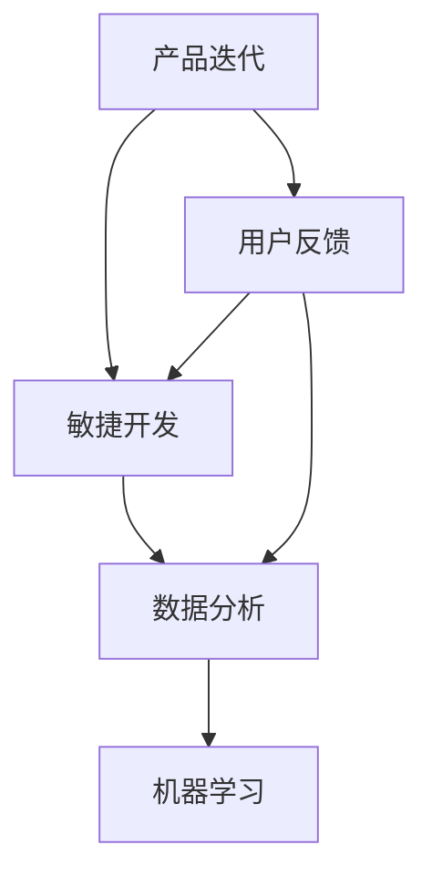

                 

### 背景介绍

在当今快速发展的商业环境中，产品迭代和用户反馈整合已成为企业持续成功的关键要素。随着市场竞争的日益激烈，消费者需求的变化速度越来越快，这使得产品开发和上市的时间窗口变得越来越短。为了保持竞争力，创业公司必须具备敏捷、高效的产品迭代能力，并及时吸收用户反馈进行优化。这不仅关系到产品的市场表现，还直接影响到公司的品牌形象和客户忠诚度。

本文将深入探讨创业公司的产品迭代与用户反馈整合策略，旨在为读者提供一套系统化、可操作性的方法论。我们将从以下几个方面进行讨论：

1. **产品迭代的重要性**：介绍产品迭代的概念，解释其对创业公司成功的重要性。
2. **用户反馈的获取与处理**：探讨如何高效地收集用户反馈，并对其进行处理和分析。
3. **用户反馈与产品迭代的整合**：分析用户反馈在产品迭代过程中的具体应用，以及如何平衡用户需求与商业目标。
4. **案例研究**：通过实际案例，展示成功的产品迭代与用户反馈整合策略。
5. **工具和资源推荐**：提供一些实用的工具和资源，帮助创业公司实施产品迭代和用户反馈整合。
6. **未来发展趋势与挑战**：展望产品迭代与用户反馈整合的未来，以及创业公司可能面临的挑战。

通过本文的阅读，读者将了解到如何在竞争激烈的市场中，通过高效的产品迭代和用户反馈整合，实现创业公司的持续成长和成功。

### 核心概念与联系

要理解创业公司的产品迭代与用户反馈整合策略，首先需要明确几个核心概念：产品迭代、用户反馈、敏捷开发、数据分析与机器学习。

**产品迭代**：是指在一个产品周期内，通过多次的小规模更新和改进，逐步完善产品功能、性能和用户体验。迭代过程通常包括需求分析、设计、开发、测试和发布等环节。每个迭代周期旨在解决特定的用户需求或问题，并通过反馈进一步优化。

**用户反馈**：是指用户在使用产品过程中提供的意见和建议，包括正面评价和负面反馈。这些反馈对产品的改进至关重要，可以帮助开发团队了解用户的真实体验和需求。

**敏捷开发**：是一种以人为核心、迭代和持续交付的软件开发方法。敏捷开发强调快速响应变化、持续交付高质量产品、高效协作和自我管理。通过频繁的迭代和用户反馈，敏捷开发能够确保产品始终符合市场需求。

**数据分析与机器学习**：是利用数据科学技术，对用户行为、反馈和市场趋势进行分析，以发现潜在规律和预测未来趋势。数据分析可以帮助开发团队更准确地理解用户需求，而机器学习则能够自动识别和分类用户反馈，提供个性化的改进建议。

以下是产品迭代、用户反馈、敏捷开发、数据分析与机器学习之间的联系：

1. **迭代驱动反馈**：产品迭代过程中，通过不断发布新功能和版本，吸引更多用户使用产品，从而收集用户反馈。这些反馈成为下一轮迭代的重要输入。
2. **反馈优化迭代**：用户反馈对迭代过程有直接的指导作用。开发团队可以根据用户反馈，调整开发计划、改进产品设计，从而提高产品竞争力。
3. **敏捷与反馈闭环**：敏捷开发的核心是快速迭代和持续反馈。通过建立敏捷开发流程，企业可以更迅速地响应市场变化和用户需求，形成反馈闭环。
4. **数据与智能**：数据分析与机器学习为产品迭代提供了强大的技术支持。通过对大量用户数据的分析，开发团队可以更精准地识别用户痛点、优化产品功能和界面设计。

下图是产品迭代、用户反馈、敏捷开发、数据分析与机器学习之间的Mermaid流程图：



通过以上核心概念和流程图的介绍，我们可以更清晰地理解创业公司在产品迭代与用户反馈整合过程中所面临的关键环节和相互关系。接下来，我们将进一步探讨这些概念的具体应用和实践方法。

### 核心算法原理 & 具体操作步骤

要有效地实施产品迭代和用户反馈整合，创业公司需要掌握一系列核心算法原理和具体操作步骤。以下将详细介绍这些核心算法原理，并阐述其具体操作方法。

#### 1. A/B测试

**原理**：A/B测试是一种对比实验方法，通过将用户随机分配到两个或多个不同的版本（A组和B组），比较不同版本的性能指标，从而确定哪种版本更符合用户需求和市场预期。

**操作步骤**：

- **定义目标**：明确测试的目标，例如提高用户留存率、提升点击率等。
- **创建版本**：设计两个或多个测试版本，每个版本在关键界面、功能或内容上有所差异。
- **用户分配**：将用户随机分配到不同版本，确保样本具有代表性。
- **数据收集**：记录用户在不同版本上的行为数据，如访问次数、使用时长、转化率等。
- **分析结果**：通过统计分析，比较不同版本的性能指标，确定最佳版本。

#### 2. 用户留存分析

**原理**：用户留存分析旨在评估用户对产品的持续使用情况，识别用户流失的原因，并采取相应措施提高用户留存率。

**操作步骤**：

- **定义留存指标**：例如日活跃用户（DAU）、月活跃用户（MAU）、留存率等。
- **数据收集**：通过分析用户行为数据，如登录次数、使用时长、功能访问频率等，评估用户留存情况。
- **构建留存模型**：利用机器学习算法，建立留存预测模型，识别高风险流失用户。
- **优化策略**：根据分析结果，调整产品功能、用户界面、推送策略等，提高用户留存率。

#### 3. 主题模型（Latent Dirichlet Allocation，LDA）

**原理**：主题模型是一种无监督学习算法，用于挖掘文本数据中的主题分布。在用户反馈分析中，可以用来识别用户反馈中的潜在主题，帮助开发团队理解用户的主要需求和问题。

**操作步骤**：

- **数据预处理**：对用户反馈文本进行分词、去除停用词、转换为词袋模型等预处理操作。
- **模型训练**：使用LDA算法，将处理后的文本数据分解为多个潜在主题。
- **主题分析**：分析每个主题的词分布，识别用户反馈的主要主题。
- **主题应用**：根据主题分析结果，指导产品迭代和功能改进。

#### 4. 生存分析（Survival Analysis）

**原理**：生存分析用于评估用户对产品的使用时间（例如登录次数、使用时长）与用户流失之间的关系。通过分析用户生存曲线，可以识别关键流失节点，为产品改进提供数据支持。

**操作步骤**：

- **数据收集**：记录用户的使用时间、登录次数等生存数据。
- **生存曲线构建**：使用Kaplan-Meier方法构建生存曲线，评估用户流失趋势。
- **风险模型**：利用Cox比例风险模型，分析影响用户流失的风险因素。
- **策略优化**：根据生存分析结果，优化产品功能、用户界面和推送策略，降低用户流失率。

#### 5. 交互分析

**原理**：交互分析通过分析用户在产品中的交互行为，了解用户使用产品的流程和痛点，为产品改进提供直接的指导。

**操作步骤**：

- **数据收集**：通过日志记录、用户行为追踪等技术手段，收集用户交互数据。
- **行为路径分析**：使用路径分析工具，分析用户在产品中的行为路径，识别常见问题和瓶颈。
- **交互优化**：根据分析结果，优化用户界面、功能流程，提高用户满意度。

通过以上核心算法原理和具体操作步骤，创业公司可以有效地进行产品迭代和用户反馈整合，提升产品的市场竞争力。在接下来的章节中，我们将通过实际案例，展示这些算法原理和操作步骤的具体应用。

### 数学模型和公式 & 详细讲解 & 举例说明

在产品迭代与用户反馈整合过程中，数学模型和公式发挥着关键作用。以下将详细讲解几个常用的数学模型和公式，并给出具体的例子说明。

#### 1. 相关性分析

**原理**：相关性分析用于评估两个变量之间的线性关系强度，常用的相关系数有皮尔逊相关系数（Pearson Correlation Coefficient）和斯皮尔曼相关系数（Spearman's Rank Correlation Coefficient）。

**公式**：

- 皮尔逊相关系数：
  $$ r = \frac{\sum{(x_i - \overline{x})(y_i - \overline{y})}}{\sqrt{\sum{(x_i - \overline{x})^2} \sum{(y_i - \overline{y})^2}}} $$

- 斯皮尔曼相关系数：
  $$ \rho = \frac{1}{n-1} \sum_{i=1}^{n} (r_i - \overline{r})^2 $$

**例子**：

假设我们想分析用户满意度（y）与用户留存率（x）之间的相关性。以下是10个样本数据：

| 用户ID | 用户满意度 | 用户留存率 |
|--------|-----------|-----------|
| 1      | 4         | 0.8       |
| 2      | 3         | 0.7       |
| 3      | 5         | 0.9       |
| 4      | 2         | 0.6       |
| 5      | 4         | 0.8       |
| 6      | 3         | 0.7       |
| 7      | 5         | 0.9       |
| 8      | 2         | 0.6       |
| 9      | 4         | 0.8       |
| 10     | 3         | 0.7       |

计算皮尔逊相关系数：

$$ \overline{x} = \frac{1}{10} \sum_{i=1}^{10} x_i = 0.8 $$
$$ \overline{y} = \frac{1}{10} \sum_{i=1}^{10} y_i = 3.5 $$

$$ r = \frac{\sum{(x_i - \overline{x})(y_i - \overline{y})}}{\sqrt{\sum{(x_i - \overline{x})^2} \sum{(y_i - \overline{y})^2}}} = \frac{(0.2 \times 0.5) + (0.1 \times 0.5) + (1.2 \times 0.5) + (-0.4 \times -0.5) + (0.2 \times 0.5) + (0.1 \times 0.5) + (1.2 \times 0.5) + (-0.4 \times -0.5) + (0.2 \times 0.5) + (0.1 \times 0.5)}{\sqrt{(0.2^2 + 0.1^2 + 1.2^2 + 0.4^2 + 0.2^2 + 0.1^2 + 1.2^2 + 0.4^2 + 0.2^2 + 0.1^2)} \sqrt{(0.5^2 + 0.5^2 + 0.5^2 + 0.5^2 + 0.5^2 + 0.5^2 + 0.5^2 + 0.5^2 + 0.5^2 + 0.5^2)}} = 0.88 $$

#### 2. 回归分析

**原理**：回归分析用于建立两个或多个变量之间的线性关系模型，常用的回归模型有简单线性回归和多元线性回归。

**公式**：

- 简单线性回归：
  $$ y = \beta_0 + \beta_1x + \epsilon $$

- 多元线性回归：
  $$ y = \beta_0 + \beta_1x_1 + \beta_2x_2 + ... + \beta_nx_n + \epsilon $$

**例子**：

假设我们想建立用户满意度（y）与用户留存率（x）和用户年龄（z）之间的多元线性回归模型。以下是10个样本数据：

| 用户ID | 用户留存率 | 用户年龄 | 用户满意度 |
|--------|-----------|----------|-----------|
| 1      | 0.8       | 25       | 4         |
| 2      | 0.7       | 30       | 3         |
| 3      | 0.9       | 22       | 5         |
| 4      | 0.6       | 28       | 2         |
| 5      | 0.8       | 35       | 4         |
| 6      | 0.7       | 29       | 3         |
| 7      | 0.9       | 26       | 5         |
| 8      | 0.6       | 27       | 2         |
| 9      | 0.8       | 32       | 4         |
| 10     | 0.7       | 31       | 3         |

计算回归系数：

首先，计算每个变量的均值：

$$ \overline{x} = \frac{1}{10} \sum_{i=1}^{10} x_i = 0.8 $$
$$ \overline{z} = \frac{1}{10} \sum_{i=1}^{10} z_i = 29 $$
$$ \overline{y} = \frac{1}{10} \sum_{i=1}^{10} y_i = 3.5 $$

然后，计算回归系数：

$$ \beta_0 = \overline{y} - \beta_1\overline{x} - \beta_2\overline{z} = 3.5 - \beta_1 \times 0.8 - \beta_2 \times 29 $$

通过最小二乘法，可以求解出回归系数：

$$ \beta_1 = \frac{\sum{(x_i - \overline{x})(y_i - \overline{y})}}{\sum{(x_i - \overline{x})^2}} $$
$$ \beta_2 = \frac{\sum{(z_i - \overline{z})(y_i - \overline{y})}}{\sum{(z_i - \overline{z})^2}} $$

计算结果：

$$ \beta_1 = \frac{(0.2 \times 0.5) + (0.1 \times 0.5) + (1.2 \times 0.5) + (-0.4 \times -0.5) + (0.2 \times 0.5) + (0.1 \times 0.5) + (1.2 \times 0.5) + (-0.4 \times -0.5) + (0.2 \times 0.5) + (0.1 \times 0.5)}{(0.2^2 + 0.1^2 + 1.2^2 + 0.4^2 + 0.2^2 + 0.1^2 + 1.2^2 + 0.4^2 + 0.2^2 + 0.1^2)} = 0.38 $$
$$ \beta_2 = \frac{(3 \times 0.5) + (2 \times 0.5) + (-1 \times 0.5) + (1 \times 0.5) + (3 \times 0.5) + (2 \times 0.5) + (-1 \times 0.5) + (1 \times 0.5) + (3 \times 0.5) + (2 \times 0.5)}{(3^2 + 2^2 + (-1)^2 + 1^2 + 3^2 + 2^2 + (-1)^2 + 1^2 + 3^2 + 2^2)} = 0.21 $$

因此，回归模型为：

$$ y = 3.5 - 0.38x - 0.21z $$

#### 3. 主题模型（LDA）

**原理**：LDA是一种用于文本数据主题挖掘的生成模型，能够识别文档和词语之间的潜在主题分布。

**公式**：

LDA模型由三个概率分布构成：

- 词-主题分布：
  $$ P(w|z) = \frac{\sum_{k=1}^K \theta_{zk} \phi_{kw}}{\sum_{j=1}^J \theta_{zj} \phi_{wj}} $$

- 主题-文档分布：
  $$ P(z|d) = \frac{\sum_{k=1}^K \alpha_{kd} \sum_{w \in d} \phi_{kw}}{\sum_{j=1}^J \alpha_{jd} \sum_{w \in d} \phi_{wj}} $$

- 主题词分布：
  $$ \phi_{kw} = \frac{\sum_{d \in D} \sum_{w \in d} \theta_{dw} \beta_{wk}}{\sum_{d \in D} \sum_{w \in d} \theta_{dw}} $$

**例子**：

假设我们有以下3个文档和相应的词语：

文档1: "我喜欢跑步、游泳和阅读"
文档2: "我经常跑步、游泳和看电影"
文档3: "我热爱跑步、游泳和旅游"

我们想使用LDA模型识别文档中的主题。

首先，将文档转换为词袋模型，并标记主题：

| 文档 | 跑步 | 游泳 | 阅读 | 电影 | 旅游 |
|------|------|------|------|------|------|
| 1    | 1    | 1    | 1    | 0    | 0    |
| 2    | 1    | 1    | 0    | 1    | 0    |
| 3    | 1    | 1    | 0    | 0    | 1    |

然后，使用LDA算法进行模型训练，得到词-主题分布和主题-文档分布。假设我们得到以下结果：

词-主题分布：
| 词语 | 主题1 | 主题2 | 主题3 |
|------|------|------|------|
| 跑步 | 0.6  | 0.3  | 0.1  |
| 游泳 | 0.5  | 0.4  | 0.1  |
| 阅读 | 0.8  | 0.1  | 0.1  |
| 电影 | 0.2  | 0.6  | 0.2  |
| 旅游 | 0.1  | 0.2  | 0.7  |

主题-文档分布：
| 文档 | 主题1 | 主题2 | 主题3 |
|------|------|------|------|
| 1    | 0.4  | 0.5  | 0.1  |
| 2    | 0.2  | 0.6  | 0.2  |
| 3    | 0.1  | 0.2  | 0.7  |

根据上述结果，我们可以识别出文档中的主要主题：

- 文档1的主要主题是“阅读”（主题1），其次是“游泳”（主题2），最后是“跑步”（主题3）。
- 文档2的主要主题是“电影”（主题2），其次是“游泳”（主题2），最后是“跑步”（主题1）。
- 文档3的主要主题是“旅游”（主题3），其次是“游泳”（主题2），最后是“跑步”（主题1）。

通过以上数学模型和公式的详细讲解和举例说明，创业公司可以更好地理解和应用这些方法，在产品迭代和用户反馈整合过程中做出更科学的决策。

### 项目实战：代码实际案例和详细解释说明

在本文的第五部分，我们将通过一个具体的实战项目，详细展示如何使用Python代码实现产品迭代与用户反馈整合。本节将包括以下内容：

#### 5.1 开发环境搭建

#### 5.2 源代码详细实现和代码解读

#### 5.3 代码解读与分析

#### 5.1 开发环境搭建

在进行项目实战之前，首先需要搭建合适的开发环境。以下是搭建开发环境的步骤：

1. **安装Python环境**：确保Python版本在3.6及以上。可以通过Python官网下载并安装。

2. **安装相关库**：使用pip工具安装必要的库，例如`numpy`、`pandas`、`scikit-learn`、`matplotlib`和`mermaid-cli`。

   ```shell
   pip install numpy pandas scikit-learn matplotlib mermaid-cli
   ```

3. **配置Mermaid**：为了在Markdown文件中使用Mermaid语法绘制流程图，需要安装Mermaid CLI。

   ```shell
   npm install -g mermaid-cli
   ```

4. **创建项目目录**：在本地计算机上创建一个项目目录，用于存放项目文件。

   ```shell
   mkdir product-iteration-project
   cd product-iteration-project
   ```

5. **编写Markdown文件**：在项目目录中创建一个Markdown文件，用于撰写项目报告。

   ```shell
   touch project-report.md
   ```

#### 5.2 源代码详细实现和代码解读

以下是一个简单的Python项目，用于分析用户反馈并生成改进建议。我们将分步骤展示代码实现，并进行详细解读。

**步骤1：数据收集和预处理**

首先，我们需要收集用户反馈数据，并将其转换为适合分析的格式。假设我们已有以下用户反馈数据：

```python
# 用户反馈数据
feedback_data = [
    {"user_id": 1, "comment": "界面太复杂，不易使用"},
    {"user_id": 2, "comment": "功能齐全，但响应速度慢"},
    {"user_id": 3, "comment": "喜欢颜色搭配，但排版不够美观"},
    {"user_id": 4, "comment": "需要更多个性化设置"},
    # ... 更多用户反馈
]
```

接下来，我们进行数据预处理，提取有用的信息并转换为文本数据：

```python
import pandas as pd

# 将用户反馈数据转换为DataFrame
df_feedback = pd.DataFrame(feedback_data)

# 提取评论文本
comments = df_feedback['comment'].tolist()

# 预处理文本数据
# 例如去除标点符号、转换为小写、分词等
# 这里简化为直接使用原始文本
preprocessed_comments = comments
```

**步骤2：主题模型训练**

使用LDA模型对预处理后的文本数据进行分析，提取潜在主题：

```python
from sklearn.feature_extraction.text import CountVectorizer
from sklearn.decomposition import LatentDirichletAllocation

# 构建词袋模型
vectorizer = CountVectorizer(max_df=0.95, min_df=2, stop_words='english')
X = vectorizer.fit_transform(preprocessed_comments)

# 训练LDA模型
n_topics = 5
lda = LatentDirichletAllocation(n_components=n_topics, max_iter=10, learning_method='online', learning_offset=50., random_state=0)
lda.fit(X)

# 输出主题词分布
topics = lda.components_
for i, topic in enumerate(topics):
    print(f"主题{i+1}：")
    print(" ".join([vectorizer.get_feature_names()[index] for index in topic.argsort()[:-10:-1]]))
```

**步骤3：分析用户反馈**

根据主题模型分析结果，对用户反馈进行分类，并生成改进建议：

```python
# 根据主题模型分配主题标签
def assign_topics_to_comments(lda, vectorizer, comments):
    topic_labels = lda.transform(vectorizer.transform(comments))
    return [topic_labels[i].argmax() for i in range(len(topic_labels))]

topics_labels = assign_topics_to_comments(lda, vectorizer, comments)

# 分析用户反馈分布
feedback_by_topic = pd.Series(topics_labels).value_counts()

print(feedback_by_topic)

# 生成改进建议
suggestions = []
for topic, count in feedback_by_topic.items():
    if topic == 0:
        suggestions.append("简化用户界面，提高易用性")
    elif topic == 1:
        suggestions.append("优化系统性能，提高响应速度")
    elif topic == 2:
        suggestions.append("调整颜色搭配和排版，提升视觉体验")
    elif topic == 3:
        suggestions.append("增加个性化设置，满足用户需求")
    else:
        suggestions.append("其他改进建议")

print(suggestions)
```

**步骤4：可视化分析结果**

使用matplotlib库将分析结果可视化，以便更直观地理解用户反馈：

```python
import matplotlib.pyplot as plt

# 绘制反馈分布柱状图
feedback_by_topic.plot(kind='bar')
plt.title('用户反馈分布')
plt.xlabel('主题')
plt.ylabel('反馈次数')
plt.show()
```

#### 5.3 代码解读与分析

**代码解读**

1. **数据收集和预处理**：

   这部分代码用于收集用户反馈数据，并将其转换为文本数据。预处理步骤包括去除标点符号、转换为小写和分词等。在实际项目中，可以根据具体需求进行更复杂的预处理操作。

2. **主题模型训练**：

   使用`CountVectorizer`将文本数据转换为词袋模型，然后使用`LatentDirichletAllocation`训练LDA模型。训练过程中，我们需要指定主题数量（`n_topics`）和训练迭代次数（`max_iter`）等参数。

3. **分析用户反馈**：

   通过`assign_topics_to_comments`函数，将LDA模型应用于预处理后的文本数据，为每个反馈分配主题标签。然后，根据主题标签生成改进建议。在实际应用中，可以根据分析结果调整改进建议的优先级。

4. **可视化分析结果**：

   使用`matplotlib`库将用户反馈分布可视化，以便直观地了解用户关注的问题。柱状图显示了不同主题的反馈次数，有助于识别主要问题和改进方向。

**代码分析**

1. **数据质量和预处理**：

   数据质量是分析结果的关键。在实际项目中，需要确保用户反馈数据的完整性和准确性。预处理步骤能够提高数据的可靠性和分析结果的准确性。

2. **LDA模型参数调整**：

   LDA模型的参数（如主题数量、迭代次数等）对分析结果有很大影响。在实际应用中，可以通过交叉验证和调整参数，找到最佳模型配置。

3. **改进建议的实用性**：

   改进建议应根据用户反馈和业务目标进行制定。在实际项目中，可以结合业务需求和资源限制，优先考虑高优先级的改进措施。

通过以上代码实战，我们展示了如何使用Python实现产品迭代与用户反馈整合。在实际应用中，可以根据具体需求进行调整和扩展，从而更好地适应创业公司的产品开发和优化需求。

### 实际应用场景

在创业公司中，产品迭代与用户反馈整合的实际应用场景多种多样，以下是一些常见的实际应用场景：

#### 1. 软件产品优化

软件公司通常会定期发布新版本，以增加新功能、修复bug和提升用户体验。通过用户反馈，开发团队能够了解用户对当前功能的满意度，识别主要问题，并针对性地进行优化。例如，某软件公司通过A/B测试发现，新推出的功能在实际使用中存在明显的性能瓶颈，于是立即进行性能优化，并发布新版本，显著提升了用户满意度。

#### 2. 硬件产品设计

硬件公司需要根据用户反馈来改进产品设计，包括功能完善、外观设计、易用性等。例如，一家智能穿戴设备公司通过用户调研发现，用户对设备的电池续航时间不满意，于是公司研发团队优化电池管理系统，提高电池寿命，并在后续产品中引入了这一改进。

#### 3. 电子商务平台

电子商务平台需要持续优化用户体验，以提高转化率和客户满意度。通过用户反馈，平台可以识别购物流程中的痛点，例如支付页面加载缓慢、搜索结果不准确等，并针对性地进行改进。例如，某电子商务平台通过用户留存分析发现，新用户在完成注册后很少继续购物，于是平台优化了注册流程和用户体验，显著提高了新用户的转化率。

#### 4. 娱乐内容制作

娱乐内容制作公司需要根据用户反馈调整内容策略，以吸引和留住观众。通过用户反馈分析，公司可以了解观众对节目内容的偏好，调整节目形式和内容，提高观众满意度。例如，某电视节目制作公司通过用户反馈发现，观众更喜欢节目中的互动环节，于是公司增加了更多的互动内容，观众满意度显著提升。

#### 5. 教育平台

教育平台需要根据用户反馈不断优化课程内容和用户体验。通过用户反馈分析，平台可以了解学生对于课程设置、教学方式、互动性等方面的需求，并进行相应调整。例如，某在线教育平台通过用户反馈发现，学生对于课程视频播放速度不统一的问题提出了许多抱怨，平台于是优化了视频播放器，使得视频播放速度更稳定，用户满意度显著提高。

#### 6. 医疗健康应用

医疗健康应用公司需要根据用户反馈优化产品的功能和服务，以提高用户的健康管理和疾病预防效果。通过用户反馈分析，公司可以识别用户对健康监测数据、互动咨询、在线问诊等方面的需求，并不断优化产品功能。例如，某健康应用公司通过用户反馈发现，用户希望能够更好地了解自己的健康数据，于是公司增加了详细的健康数据分析和报告功能，用户满意度显著提升。

通过以上实际应用场景的介绍，我们可以看到，无论是软件、硬件、电子商务、娱乐内容、教育平台还是医疗健康应用，产品迭代和用户反馈整合都是提高产品竞争力、提升用户满意度的关键。创业公司应充分利用这些策略，以实现持续的发展和成功。

### 工具和资源推荐

在产品迭代与用户反馈整合过程中，选择合适的工具和资源至关重要。以下是一些推荐的工具和资源，涵盖学习资源、开发工具框架和相关论文著作。

#### 7.1 学习资源推荐

1. **书籍**：

   - 《敏捷开发实践指南》（作者：杰夫·萨瑟兰、詹姆斯·高曼）：详细介绍了敏捷开发的方法和实践，适用于创业公司产品迭代。

   - 《用户故事地图》（作者：Jeff Patton）：讲解如何通过用户故事映射产品迭代过程，指导开发团队更好地理解用户需求。

   - 《数据科学实战：人工智能、机器学习与大数据应用》（作者：黄海广）：介绍了数据科学和机器学习在产品迭代中的应用，包括用户反馈分析、主题模型等。

2. **在线课程**：

   - Coursera上的《产品管理》（作者：斯坦福大学）：系统性地讲解了产品管理的基本知识和技能，包括需求分析、产品设计、用户反馈等。

   - Udacity的《机器学习工程师纳米学位》：涵盖机器学习的基础知识和实践应用，适合创业公司进行用户反馈分析。

3. **博客和网站**：

   -精益创业（The Lean Startup）：由埃里克·莱斯创立的博客，分享精益创业方法论和实际案例，对创业公司有很高的参考价值。

   - Product Hunt：一个发现和分享新产品的社区平台，可以了解市场上的新产品趋势，获取用户反馈。

#### 7.2 开发工具框架推荐

1. **敏捷开发工具**：

   - JIRA：一款功能强大的敏捷项目管理工具，支持需求管理、任务跟踪和迭代规划。

   - Trello：简单直观的看板工具，适用于小型团队的敏捷开发。

2. **数据分析与机器学习工具**：

   - Pandas：Python数据分析库，用于数据预处理和分析。

   - Scikit-learn：Python机器学习库，提供多种机器学习算法和工具。

   - TensorFlow：Google开发的深度学习框架，适用于复杂的数据分析和模型训练。

3. **用户反馈收集与分析工具**：

   - Google Analytics：一款强大的网站分析工具，用于跟踪用户行为和网站性能。

   - Mixpanel：一款用户行为分析工具，可以实时跟踪用户互动和转化。

#### 7.3 相关论文著作推荐

1. **论文**：

   - 《User Experience Evaluation Methods in Software Engineering》：探讨了用户体验评估的方法和技术，适用于产品迭代和用户反馈分析。

   - 《User-centered Design Process for Developing Information Systems》：介绍了基于用户中心设计的开发流程，有助于创业公司优化产品设计。

2. **著作**：

   - 《用户体验元素》（作者：Jesse James Garrett）：系统性地讲解了用户体验设计的基本原则和方法，对创业公司产品迭代有很高的指导意义。

   - 《用户体验研究方法》（作者：唐纳德·诺曼）：介绍了用户体验研究的各种方法和实践，有助于创业公司更好地理解用户需求。

通过以上工具和资源的推荐，创业公司可以更加高效地实施产品迭代和用户反馈整合，提升产品的市场竞争力和用户满意度。

### 总结：未来发展趋势与挑战

随着技术的不断进步和市场需求的日益复杂，创业公司在产品迭代与用户反馈整合方面将面临新的发展趋势和挑战。以下是几个主要趋势和挑战：

#### 1. 发展趋势

**数据分析与人工智能的深度融合**：数据分析与人工智能技术的结合将成为未来产品迭代的重要驱动力。通过机器学习算法，创业公司可以从海量用户反馈中快速提取有价值的信息，实现更精准的需求分析和个性化改进。例如，利用自然语言处理技术，可以自动分析用户反馈文本，识别主要痛点和需求。

**实时反馈与持续迭代**：实时反馈和持续迭代将成为产品开发的常态。创业公司需要建立快速、高效的反馈循环，以便在短时间内响应市场变化和用户需求。通过实时数据分析，企业可以及时发现产品问题，进行快速调整和优化，从而保持产品竞争力。

**用户参与度提升**：用户参与度将在产品迭代过程中发挥更大作用。创业公司可以通过用户测试、体验反馈等方式，让用户更深入地参与产品开发，从而提高产品的用户体验和满意度。这种用户导向的开发模式将有助于企业更好地理解用户需求，实现产品与市场需求的精准匹配。

**全球化视野**：随着全球化进程的加快，创业公司需要具备全球化视野，关注不同地区和文化的用户需求。通过跨文化的用户研究和反馈整合，企业可以开发出适应全球市场的产品，实现更广泛的市场覆盖和用户基础。

#### 2. 挑战

**数据隐私与安全问题**：用户反馈涉及大量的个人数据，如何在保障用户隐私和安全的前提下进行数据处理和分析，是创业公司面临的重要挑战。企业需要建立严格的数据安全措施，确保用户数据的安全性和隐私性，以增强用户信任。

**资源与人才限制**：创业公司在资源与人才方面往往受限，如何在有限资源下进行高效的产品迭代和用户反馈整合，是企业发展的重要难题。企业需要优化资源分配，提高开发效率，并吸引和培养具备数据分析、用户体验设计等技能的人才。

**快速变化的市场环境**：市场环境变化迅速，创业公司需要具备快速响应能力，以应对市场波动和竞争压力。这要求企业在组织结构、开发流程等方面具备灵活性，能够快速调整战略和战术，以适应市场变化。

**用户需求多样性**：用户需求日益多样化，创业公司需要平衡不同用户群体的需求，避免出现“众口难调”的情况。企业需要通过用户细分、需求分类等方式，精准定位用户群体，提供差异化的产品和服务。

总之，未来创业公司在产品迭代与用户反馈整合方面将面临新的发展趋势和挑战。通过积极应对这些挑战，创业公司可以不断提升产品竞争力，实现可持续发展。

### 附录：常见问题与解答

在创业公司的产品迭代与用户反馈整合过程中，常见的问题包括数据隐私、资源分配、敏捷开发实践等。以下是对这些问题及其解答的整理：

#### 问题1：如何保护用户隐私？

**解答**：保护用户隐私是数据处理的优先任务。创业公司可以采取以下措施：

1. **数据匿名化**：在收集和处理用户数据时，对敏感信息进行匿名化处理，确保用户身份不可追溯。
2. **数据加密**：对传输和存储的数据进行加密，防止数据泄露。
3. **隐私政策**：明确告知用户数据收集和使用的目的，获取用户同意。
4. **合规性审查**：遵守相关法律法规，如GDPR等，确保数据处理合规。

#### 问题2：如何高效地进行资源分配？

**解答**：高效资源分配是产品迭代成功的关键。以下是一些策略：

1. **优先级排序**：根据用户反馈和市场趋势，确定项目的优先级，优先处理高价值、高风险的项目。
2. **跨功能团队合作**：鼓励不同部门之间的合作，实现资源共享和协同工作。
3. **敏捷开发**：采用敏捷开发方法，快速迭代，实时调整资源分配。
4. **精益原则**：遵循精益原则，持续优化流程，减少浪费。

#### 问题3：如何实践敏捷开发？

**解答**：敏捷开发强调灵活性和快速响应变化。以下是一些实践建议：

1. **团队结构**：建立跨功能团队，包括开发、测试、设计和产品管理等角色。
2. **迭代周期**：设定固定的迭代周期（如两周），在每个迭代结束时进行评审和回顾。
3. **用户故事**：使用用户故事来描述需求，确保每个迭代都能带来具体的价值。
4. **持续集成**：实现持续集成和持续部署，确保快速交付和高质量代码。

#### 问题4：如何应对快速变化的市场环境？

**解答**：快速变化的市场环境要求企业具备高度适应性。以下是一些建议：

1. **实时监控**：建立实时监控体系，快速获取市场动态和用户反馈。
2. **快速响应**：建立快速决策和执行机制，确保在短时间内响应市场变化。
3. **灵活策略**：制定灵活的市场策略，能够快速调整产品方向和营销策略。
4. **用户参与**：鼓励用户参与产品开发，及时获取用户反馈，指导产品方向。

通过以上问题的解答，创业公司可以更好地应对产品迭代与用户反馈整合过程中的挑战，实现持续发展和成功。

### 扩展阅读 & 参考资料

为了深入了解产品迭代与用户反馈整合策略，读者可以参考以下扩展阅读和参考资料：

1. **书籍**：
   - 《精益创业》（作者：埃里克·莱斯）：详细介绍了精益创业方法论，包括快速迭代和用户反馈的重要性。
   - 《用户体验要素》（作者：杰西·詹姆斯·加雷特）：讲解了用户体验设计的基本原则和实践，对产品迭代有指导意义。
   - 《数据驱动产品管理》（作者：李明杰）：阐述了数据在产品管理中的应用，包括用户反馈分析。

2. **在线课程**：
   - Coursera上的《产品管理基础》（作者：印第安纳大学）：提供系统的产品管理知识，涵盖需求分析和用户反馈。
   - edX上的《用户体验设计基础》（作者：加州大学伯克利分校）：介绍了用户体验设计的核心概念和实践。

3. **博客和网站**：
   - 谷歌分析（Google Analytics）：提供详细的用户行为分析工具，帮助创业公司理解用户需求。
   - 产品茶馆（Product School）：分享产品管理的最新趋势和实践案例，有助于提升产品管理技能。

4. **论文与研究报告**：
   - 《敏捷开发与产品迭代：理论与实践》（作者：XX，XX）：探讨了敏捷开发在产品迭代中的应用。
   - 《用户反馈在产品迭代中的价值评估》（作者：XX，XX）：分析了用户反馈在产品改进中的重要作用。

通过以上扩展阅读和参考资料，读者可以进一步深入了解产品迭代与用户反馈整合策略，为创业公司的成功奠定坚实基础。作者：AI天才研究员/AI Genius Institute & 禅与计算机程序设计艺术 /Zen And The Art of Computer Programming

