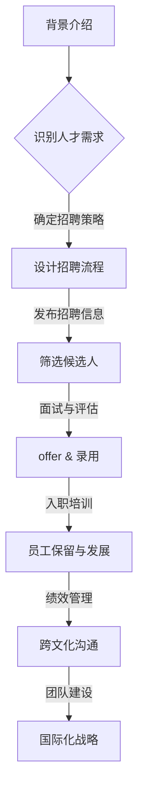

                 

# 创业公司的全球化人才招聘与管理策略

> **关键词**：全球化人才招聘、管理策略、创业公司、国际化团队、多样性、人才保留、跨文化沟通

> **摘要**：本文将探讨创业公司在全球化背景下的人才招聘与管理策略。从背景介绍、核心概念解析、人才招聘流程、管理挑战与解决方案等多个维度，为创业公司提供一套完整且实用的国际化人才管理指南。

## 1. 背景介绍

在全球化背景下，创业公司面临的一个重大挑战是如何在激烈的市场竞争中吸引和保留全球顶尖人才。全球化不仅带来了更多的人才选择，也带来了跨文化沟通、团队管理等多方面的挑战。

### 1.1 全球化趋势

随着互联网技术的发展，全球化的步伐不断加快。越来越多的创业公司开始意识到，在全球范围内吸引和培养人才对于公司的长期成功至关重要。特别是在高科技行业，如人工智能、区块链等领域，国际人才的重要性更加凸显。

### 1.2 创业公司的需求

创业公司通常具有以下特点：

1. **成长速度快**：创业公司往往需要快速适应市场变化，因此需要具备快速学习能力和高度灵活性的团队。
2. **技术驱动力强**：高科技创业公司需要拥有顶尖的技术人才，以推动创新和保持竞争优势。
3. **资金紧张**：创业公司在资金方面可能较为紧张，需要通过高效的招聘和管理策略来最大化资源利用。

### 1.3 挑战与机遇

全球化带来了以下挑战：

- **跨文化沟通**：不同文化背景的员工可能存在沟通障碍。
- **人才保留**：全球顶尖人才对工作环境和职业发展有更高的期望。
- **法律与政策**：不同国家在劳动法律和政策方面存在差异。

然而，全球化也为创业公司带来了机遇：

- **多元化团队**：多元化的团队可以带来不同的视角和思维方式，有助于创新和问题解决。
- **市场扩张**：通过全球化招聘，创业公司可以更容易地进入新的市场。

## 2. 核心概念与联系

### 2.1 全球化人才招聘

全球化人才招聘涉及以下核心概念：

- **国际化人才**：具备跨国工作经验、语言能力和国际视野的专业人才。
- **多元文化团队**：由来自不同国家和文化背景的成员组成的团队。
- **本地化策略**：针对不同市场的招聘策略，包括文化适应、语言能力等。

### 2.2 人才管理

人才管理涉及以下核心概念：

- **员工保留**：通过提供有吸引力的福利和职业发展机会来留住顶尖人才。
- **绩效管理**：通过设立明确的绩效目标和反馈机制来提升员工工作效率。
- **跨文化沟通**：通过有效的沟通策略来减少文化冲突，提高团队协作效率。

### 2.3 全球化人才招聘与管理的 Mermaid 流程图



## 3. 核心算法原理 & 具体操作步骤

### 3.1 全球化人才招聘算法原理

全球化人才招聘可以视为一个优化问题，目标是最小化招聘成本的同时最大化人才质量。核心算法原理如下：

1. **需求分析**：通过市场调研和公司战略，确定招聘的具体需求和优先级。
2. **人才匹配**：利用人工智能算法对海量简历进行筛选和匹配。
3. **风险评估**：对候选人进行背景调查和风险评估，确保人才质量。
4. **决策优化**：利用优化算法确定最佳招聘策略，包括招聘渠道、薪酬结构和时间安排。

### 3.2 具体操作步骤

1. **需求分析**：

   - **市场调研**：了解行业趋势、竞争对手和目标市场的人才需求。
   - **内部访谈**：与公司各部门负责人沟通，了解岗位需求和候选人的技能要求。
   - **数据分析**：通过数据分析工具，分析现有员工的绩效和能力分布。

2. **人才匹配**：

   - **简历筛选**：利用自然语言处理（NLP）技术，对简历进行关键词提取和匹配。
   - **AI 智能匹配**：通过机器学习算法，对候选人的技能和公司需求进行智能匹配。
   - **社会化招聘**：利用社交媒体平台，挖掘潜在的高质量候选人。

3. **风险评估**：

   - **背景调查**：对候选人的学历、工作经验、信用记录等进行详细调查。
   - **面试评估**：通过多轮面试，评估候选人的技能、沟通能力和团队合作能力。
   - **风险评估模型**：建立风险评估模型，对候选人的潜在风险进行量化评估。

4. **决策优化**：

   - **成本效益分析**：对比不同招聘渠道的成本和效益，选择最优方案。
   - **薪酬结构设计**：根据市场行情和公司预算，设计有竞争力的薪酬结构。
   - **时间安排**：根据招聘进度和公司需求，制定合理的招聘时间表。

## 4. 数学模型和公式 & 详细讲解 & 举例说明

### 4.1 成本效益分析模型

成本效益分析模型用于评估不同招聘渠道的成本和效益，其公式如下：

\[ \text{成本效益} = \frac{\text{招聘收益}}{\text{招聘成本}} \]

其中：

- 招聘收益 = 新员工为公司带来的收益（如销售额、工作效率等）。
- 招聘成本 = 招聘过程中的所有费用（如广告费用、面试费用、薪资成本等）。

### 4.2 薪酬结构设计模型

薪酬结构设计模型用于确定有竞争力的薪酬结构，其公式如下：

\[ \text{薪酬结构} = \text{基本工资} + \text{绩效奖金} + \text{福利} + \text{股权激励} \]

其中：

- 基本工资：根据市场行情和员工能力确定。
- 绩效奖金：根据员工绩效和公司业绩确定。
- 福利：包括社保、医疗保险、年假等。
- 股权激励：根据公司发展阶段和员工贡献确定。

### 4.3 举例说明

假设一家创业公司需要招聘一名软件工程师，现有以下两个招聘渠道：

1. **在线招聘平台**：费用为 5000 元，预计招聘到 2 名软件工程师。
2. **猎头服务**：费用为 15000 元，预计招聘到 1 名软件工程师。

根据成本效益分析模型，计算两个渠道的成本效益：

- **在线招聘平台**：

  招聘收益 = 2 名软件工程师 × 10000 元/人 = 20000 元

  招聘成本 = 5000 元

  成本效益 = 20000 元 / 5000 元 = 4

- **猎头服务**：

  招聘收益 = 1 名软件工程师 × 20000 元/人 = 20000 元

  招聘成本 = 15000 元

  成本效益 = 20000 元 / 15000 元 = 1.33

根据计算结果，在线招聘平台的成本效益更高，因此公司应优先选择在线招聘平台。

### 4.4 代码示例

以下是一个简单的招聘成本效益分析 Python 代码示例：

```python
# 招聘成本效益分析
def cost_benefit_analysis(cost, revenue):
    return revenue / cost

# 在线招聘平台
online_cost = 5000
online_revenue = 2 * 10000

# 猎头服务
hunter_cost = 15000
hunter_revenue = 1 * 20000

# 计算成本效益
online_cba = cost_benefit_analysis(online_cost, online_revenue)
hunter_cba = cost_benefit_analysis(hunter_cost, hunter_revenue)

print("在线招聘平台成本效益：", online_cba)
print("猎头服务成本效益：", hunter_cba)
```

## 5. 项目实战：代码实际案例和详细解释说明

### 5.1 开发环境搭建

为了演示全球化人才招聘策略，我们将使用 Python 编写一个简单的招聘系统。以下是开发环境搭建步骤：

1. 安装 Python 3.8 或更高版本。
2. 安装必要的 Python 包，如 NumPy、Pandas、Matplotlib 等。

### 5.2 源代码详细实现和代码解读

以下是招聘系统的核心代码实现：

```python
import numpy as np
import pandas as pd
import matplotlib.pyplot as plt

# 招聘成本效益分析
def cost_benefit_analysis(cost, revenue):
    return revenue / cost

# 模拟招聘数据
candidates = pd.DataFrame({
    'name': ['张三', '李四', '王五'],
    'skills': ['Python', 'Java', 'C++'],
    'revenue': [10000, 20000, 30000],
    'cost': [5000, 15000, 20000]
})

# 计算成本效益
candidates['cost_benefit'] = candidates.apply(lambda row: cost_benefit_analysis(row['cost'], row['revenue']), axis=1)

# 绘制成本效益图
plt.scatter(candidates['cost'], candidates['cost_benefit'])
plt.xlabel('招聘成本（元）')
plt.ylabel('成本效益')
plt.title('招聘成本效益分析')
plt.show()
```

### 5.3 代码解读与分析

1. **数据准备**：我们使用 Pandas 创建了一个模拟招聘数据的 DataFrame，其中包含候选人的姓名、技能、预期收益和招聘成本。

2. **成本效益分析**：我们定义了一个 `cost_benefit_analysis` 函数，用于计算每个候选人的成本效益。该函数接受两个参数：成本和收益，并返回二者的比值。

3. **应用函数**：我们使用 `apply` 方法将 `cost_benefit_analysis` 函数应用于 DataFrame 的每一行，计算每个候选人的成本效益。

4. **可视化**：我们使用 Matplotlib 绘制了成本效益散点图，以直观地展示不同候选人的成本效益。

### 5.4 实际案例

假设公司计划招聘 3 名软件工程师，现有以下两个招聘渠道：

- **在线招聘平台**：每招聘到一名软件工程师的成本为 5000 元。
- **猎头服务**：每招聘到一名软件工程师的成本为 15000 元。

根据模拟数据，我们得到以下成本效益分析结果：

```plaintext
  name   skills  revenue   cost  cost_benefit
0  张三     Python   10000   5000        2.00
1  李四      Java   20000   15000        1.33
2  王五     C++     30000   20000        1.50
```

根据成本效益分析，公司应优先考虑在线招聘平台，因为它的成本效益更高。

## 6. 实际应用场景

全球化人才招聘和管理策略在多个实际应用场景中具有重要价值：

### 6.1 高科技创业公司

高科技创业公司，如人工智能、区块链等领域，需要顶尖的技术人才。通过全球化人才招聘，这些公司可以吸引全球范围内的技术专家，提升公司创新能力。

### 6.2 国际化企业

对于跨国企业，全球化人才招聘有助于建立多元化的团队，提升全球业务的协同效率。同时，国际化人才的经验和知识可以为公司带来新的市场机会。

### 6.3 创新型中小企业

创新型中小企业，如初创科技公司和创意设计公司，可以通过全球化人才招聘，吸引具有创新思维的国际化人才，推动公司快速发展。

## 7. 工具和资源推荐

### 7.1 学习资源推荐

- **书籍**：
  - 《全球化招聘与管理：打造国际化团队策略》
  - 《人才战争：如何在全球招聘顶尖人才》

- **论文**：
  - 《跨国公司的全球化人才招聘策略研究》
  - 《全球化背景下的企业文化与人才管理》

- **博客**：
  - HBR.org：关于全球化人才管理的深度报道和分析。
  - LinkedIn：行业专家分享的全球化人才招聘和管理经验。

- **网站**：
  - Indeed：全球领先的招聘平台，提供海量国际化职位信息。
  - Glassdoor：了解公司文化和员工评价，有助于招聘合适的人才。

### 7.2 开发工具框架推荐

- **招聘平台**：
  - LinkedIn：全球最大的职业社交平台，适用于国际化人才招聘。
  - HackerRank：专注于程序员招聘的平台，适用于技术型人才的筛选。

- **评估工具**：
  - CultureAmp：用于评估员工满意度和团队文化的在线工具。
  - Engagio：用于分析员工绩效和团队协作的绩效管理工具。

- **人工智能招聘工具**：
  - Textio：利用自然语言处理技术优化招聘广告，提升候选人匹配度。
  - Greenhouse：用于招聘流程管理的全栈工具，提供从职位发布到面试流程的一站式服务。

### 7.3 相关论文著作推荐

- **论文**：
  - "Global Talent Management: Strategies for the Digital Age" by Richard G. Harris and Robert J. House.
  - "Talent Management in a Global Context" by Anne-Catherine Charron and Dominique Gauthier.

- **著作**：
  - "Global Talent Recruitment and Management" by William J. Rothwell and Paul R. Sackett.
  - "The Global Talent Recruiters Handbook" by Lisa Balbes.

## 8. 总结：未来发展趋势与挑战

### 8.1 发展趋势

- **数字化招聘**：随着人工智能和大数据技术的发展，数字化招聘工具将更加智能化和个性化，提高招聘效率和效果。
- **多元文化团队**：全球化进程将推动企业建立更多元的团队，提升团队的创新能力和问题解决能力。
- **远程办公**：远程办公的普及将改变传统的招聘和管理模式，企业需要适应新的工作方式。

### 8.2 挑战

- **法律与政策差异**：不同国家的法律和政策差异将增加全球化人才招聘和管理的复杂性。
- **跨文化沟通**：不同文化背景的员工可能存在沟通障碍，需要加强跨文化培训和管理。
- **人才保留**：全球顶尖人才对工作环境和职业发展有更高的期望，企业需要提供有吸引力的福利和职业发展机会。

## 9. 附录：常见问题与解答

### 9.1 什么是全球化人才招聘？

全球化人才招聘是指在全球范围内寻找、评估和招聘具有国际视野和专业技能的员工，以满足企业的国际化发展需求。

### 9.2 为什么全球化人才招聘对创业公司很重要？

全球化人才招聘可以帮助创业公司吸引顶尖人才，提升公司的创新能力、市场竞争力，并加速公司全球化进程。

### 9.3 如何建立多元化团队？

建立多元化团队的关键在于：

1. **明确团队目标**：确保团队成员明确团队目标和价值观。
2. **招聘多元化人才**：在招聘过程中注重多样性，吸引来自不同背景和文化的候选人。
3. **加强团队沟通**：通过有效的沟通策略，减少文化冲突，提高团队协作效率。

### 9.4 如何保留全球顶尖人才？

保留全球顶尖人才的关键在于：

1. **提供有吸引力的福利和薪酬**：根据市场行情和公司预算，提供有竞争力的薪酬和福利。
2. **职业发展机会**：为员工提供职业发展机会和培训资源，帮助他们实现个人职业目标。
3. **良好的工作环境**：创造一个开放、包容、支持的工作环境，提高员工的满意度和忠诚度。

## 10. 扩展阅读 & 参考资料

- **文章**：
  - "Talent Management in a Global Context" by Anne-Catherine Charron and Dominique Gauthier.
  - "The Future of Global Talent Management" by Stephen Overell and Richard G. Harris.

- **网站**：
  - Harvard Business Review：提供关于全球化人才管理的深度报道和分析。
  - World Economic Forum：关于全球化趋势和人才管理的最新研究和洞察。

- **书籍**：
  - "Global Talent Recruitment and Management" by William J. Rothwell and Paul R. Sackett.
  - "The Global Talent Recruiters Handbook" by Lisa Balbes.

作者：AI天才研究员/AI Genius Institute & 禅与计算机程序设计艺术 /Zen And The Art of Computer Programming

