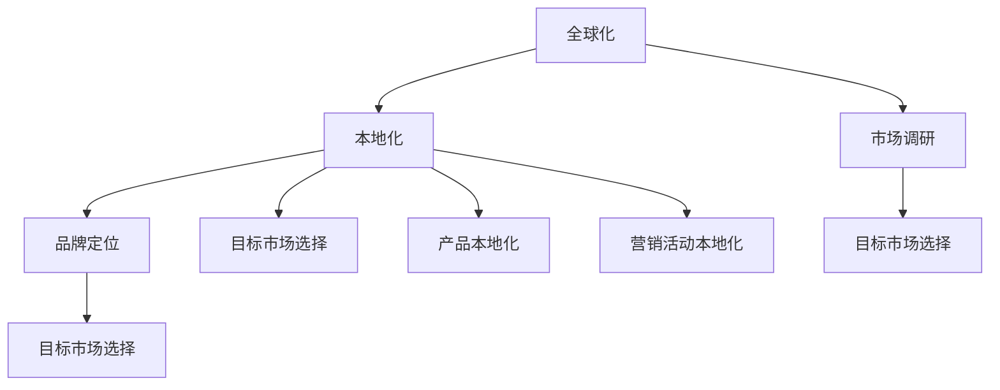

                 

### 背景介绍

在当今全球化迅速发展的时代，创业公司面临着越来越大的国际竞争压力。如何在异国他乡中站稳脚跟，实现品牌的全球化传播，已经成为众多创业公司亟需解决的重要问题。而本地化营销策略作为企业国际化进程中不可或缺的一环，成为了创业公司在全球市场中脱颖而出的关键因素。

首先，本地化营销策略是指根据目标市场的文化、语言、消费习惯等差异，调整企业的产品、服务、营销手段，使其更符合当地市场的需求。通过本地化营销，创业公司可以更好地满足不同市场的消费者需求，提升品牌认可度和市场占有率。

随着互联网和移动设备的普及，全球市场的联系愈发紧密，这也为创业公司的全球化提供了便利。然而，不同国家在文化、法规、消费习惯等方面的差异，使得创业公司在进入新市场时面临诸多挑战。因此，制定一套科学的全球化本地化营销策略，成为了创业公司在国际市场上取得成功的关键。

本文将从以下几个角度对创业公司的全球化本地化营销策略进行深入探讨：

1. **核心概念与联系**：首先介绍全球化本地化营销策略的核心概念，并分析各概念之间的联系，帮助读者建立全局视角。
2. **核心算法原理与具体操作步骤**：详细阐述全球化本地化营销策略的实施步骤，包括市场调研、产品本地化、营销活动本地化等。
3. **数学模型和公式**：介绍相关数学模型和公式，如目标市场选择模型、品牌定位模型等，为策略制定提供理论基础。
4. **项目实战**：通过实际案例，展示如何运用全球化本地化营销策略，并进行详细解释和分析。
5. **实际应用场景**：分析创业公司在不同行业、不同地区应用全球化本地化营销策略的案例，总结成功经验与挑战。
6. **工具和资源推荐**：推荐相关学习资源、开发工具和框架，帮助读者深入了解和实践全球化本地化营销策略。
7. **总结：未来发展趋势与挑战**：总结当前全球化本地化营销策略的成果与不足，展望未来发展趋势和挑战。

通过本文的探讨，我们希望能够为创业公司在全球化道路上提供有益的启示和指导，助力其在国际市场中取得更大的成功。接下来，我们将逐步深入探讨全球化本地化营销策略的核心概念与联系。 <markdown>
## 2. 核心概念与联系

在全球化本地化营销策略的实施过程中，涉及多个核心概念，包括全球化、本地化、市场调研、品牌定位、目标市场选择等。为了更好地理解这些概念及其之间的联系，我们首先对其进行定义，并绘制一张 Mermaid 流程图，以展示它们之间的逻辑关系。

### 定义

1. **全球化**：全球化是指企业跨越国界，将产品或服务推向全球市场，实现跨国经营和业务扩展的过程。
2. **本地化**：本地化是指企业根据目标市场的文化、语言、消费习惯等差异，对产品、服务、营销手段进行调整，以适应当地市场的需求。
3. **市场调研**：市场调研是指通过对目标市场的环境、消费者需求、竞争对手等信息进行收集和分析，为企业制定营销策略提供依据。
4. **品牌定位**：品牌定位是指企业根据市场需求和自身优势，确定品牌在消费者心目中的形象和地位，以实现品牌差异化竞争。
5. **目标市场选择**：目标市场选择是指企业根据市场调研结果，确定最具潜力和适合自身发展的目标市场。

### Mermaid 流程图



### 概念之间的联系

从 Mermaid 流程图中，我们可以看出，全球化、本地化、市场调研、品牌定位和目标市场选择之间存在密切的联系。

1. **全球化与本地化**：全球化是本地化的前提和基础。企业在实现全球化的过程中，需要根据不同市场的特点进行本地化调整，以适应当地市场的需求。本地化是全球化不可或缺的一部分，它使企业能够更好地融入当地市场，提升品牌竞争力。
2. **市场调研与品牌定位、目标市场选择**：市场调研是制定品牌定位和目标市场选择策略的基础。通过市场调研，企业可以了解目标市场的环境、消费者需求和竞争对手等信息，从而为品牌定位和目标市场选择提供依据。
3. **品牌定位与目标市场选择**：品牌定位直接影响目标市场选择。企业需要根据自身优势和市场调研结果，确定品牌在消费者心目中的形象和地位，以实现品牌差异化竞争。品牌定位明确后，企业可以更有针对性地选择目标市场。
4. **本地化与产品本地化、营销活动本地化**：本地化不仅涉及产品本地化，还包括营销活动本地化。产品本地化是指根据目标市场的文化、语言、消费习惯等调整产品，以适应当地市场需求；营销活动本地化是指根据目标市场的特点，调整营销策略和手段，以提高营销效果。

通过以上分析，我们可以看出，全球化本地化营销策略的实施是一个系统工程，需要企业从全局出发，综合考虑各个核心概念之间的联系，制定一套科学的策略，以实现全球市场的成功布局。

接下来，我们将进一步探讨全球化本地化营销策略的核心算法原理与具体操作步骤。 <markdown>
## 3. 核心算法原理与具体操作步骤

在全球化本地化营销策略的实施过程中，核心算法原理起着至关重要的作用。以下将介绍几个关键步骤，包括市场调研、产品本地化、营销活动本地化等，详细解释每个步骤的算法原理和操作方法。

### 3.1 市场调研

市场调研是制定全球化本地化营销策略的第一步，其核心算法原理是数据收集和分析。具体操作步骤如下：

1. **数据收集**：通过多种渠道收集目标市场的数据，如市场报告、行业分析、竞争对手调查、消费者访谈等。数据来源可以包括：

   - **市场报告**：购买或获取行业报告、市场分析报告，获取目标市场的宏观环境和行业趋势。
   - **行业分析**：了解目标行业的市场规模、市场份额、主要竞争对手等信息。
   - **竞争对手调查**：分析竞争对手的营销策略、产品特点、品牌定位等，找出差距和机会。
   - **消费者访谈**：通过面对面访谈、在线调查等方式，了解消费者的需求、偏好、购买行为等。

2. **数据分析**：对收集到的数据进行分析，提取关键信息，为后续策略制定提供依据。数据分析方法包括：

   - **统计分析**：运用统计方法对数据进行分析，如描述性统计、相关性分析、回归分析等。
   - **文本分析**：通过文本挖掘技术，提取消费者访谈、社交媒体评论等文本数据中的关键信息。
   - **市场预测**：运用时间序列分析、回归分析等方法，预测目标市场的未来趋势。

3. **数据可视化**：通过图表、报表等形式，将数据分析结果直观地展示出来，便于决策者理解和应用。

### 3.2 产品本地化

产品本地化是全球化本地化营销策略的重要组成部分，其核心算法原理是根据目标市场的特点调整产品。具体操作步骤如下：

1. **需求分析**：通过市场调研，了解目标市场的消费者需求、偏好和购买习惯，为产品本地化提供依据。

2. **功能调整**：根据目标市场的需求，调整产品的功能、性能和规格，使其更符合当地市场的需求。如：

   - **功能调整**：增加或删除某些功能，以适应当地市场的需求。
   - **性能调整**：根据当地市场的技术水平和消费者期望，调整产品的性能指标。
   - **规格调整**：根据当地市场的法规、标准，调整产品的规格和包装。

3. **文化适应**：考虑目标市场的文化背景，调整产品的外观、设计、命名等，使其更符合当地文化。如：

   - **外观设计**：根据当地市场的审美偏好，调整产品的外观设计。
   - **命名策略**：根据当地市场的语言和文化，调整产品的命名策略。

4. **测试与反馈**：在产品本地化过程中，进行多轮测试和反馈，以确保产品符合当地市场的需求。测试方法包括：

   - **用户测试**：邀请目标市场的消费者参与产品测试，收集反馈意见。
   - **专家评审**：邀请行业专家对产品进行评审，评估产品的本地化程度。

### 3.3 营销活动本地化

营销活动本地化是全球化本地化营销策略的关键环节，其核心算法原理是根据目标市场的特点调整营销策略和手段。具体操作步骤如下：

1. **市场定位**：根据产品本地化和市场调研结果，确定目标市场定位，明确目标消费者群体。

2. **渠道选择**：根据目标市场的特点和消费者习惯，选择适合的营销渠道，如社交媒体、电商平台、线下活动等。

3. **内容创作**：根据目标市场的文化、语言和消费者偏好，创作具有吸引力的营销内容。内容创作包括：

   - **广告文案**：根据目标市场的特点，创作具有吸引力的广告文案。
   - **视觉设计**：根据目标市场的审美偏好，设计符合当地文化的视觉元素。
   - **视频营销**：制作符合当地市场需求和审美趣味的视频内容。

4. **活动策划**：根据目标市场的文化、节日和消费者习惯，策划具有吸引力的营销活动。活动策划包括：

   - **线上活动**：策划线上促销活动、互动游戏、抽奖活动等，激发消费者参与热情。
   - **线下活动**：策划线下展览、发布会、品牌活动等，提升品牌知名度和美誉度。

5. **效果评估**：对营销活动进行效果评估，分析活动投入产出比，为后续营销活动提供改进方向。

通过以上核心算法原理和具体操作步骤，我们可以看到，全球化本地化营销策略的实施是一个系统、复杂的过程，需要企业充分了解目标市场的特点，制定科学的策略，并不断调整和优化，以提高在国际市场的竞争力。

接下来，我们将进一步探讨全球化本地化营销策略中的数学模型和公式，为策略制定提供理论基础。 <markdown>
## 4. 数学模型和公式 & 详细讲解 & 举例说明

在全球化本地化营销策略的制定过程中，数学模型和公式可以帮助企业更科学、准确地分析市场数据，制定合理的营销策略。以下介绍几个关键数学模型和公式，并对其进行详细讲解和举例说明。

### 4.1 目标市场选择模型

目标市场选择模型用于帮助企业确定最具潜力和适合自身发展的目标市场。一个常用的目标市场选择模型是基于市场吸引力（Attractiveness）和公司竞争优势（Strength）的综合评估模型，即**SWOT分析**（Strengths, Weaknesses, Opportunities, Threats）。

**公式**：

$$
SWOT = \text{Strength} + \text{Weakness} + \text{Opportunities} + \text{Threats}
$$

**详细讲解**：

1. **Strengths（优势）**：分析企业自身的优势，如技术、品牌、渠道、资金等。
2. **Weaknesses（劣势）**：分析企业存在的劣势，如产品缺陷、市场覆盖率低、资金不足等。
3. **Opportunities（机会）**：分析市场中的潜在机会，如新兴市场、行业趋势、政策支持等。
4. **Threats（威胁）**：分析市场中的潜在威胁，如竞争对手、经济波动、政策变动等。

**举例说明**：

假设某创业公司（A公司）在考虑进入国际市场时，对目标市场（B国）进行了SWOT分析：

- **Strengths**：A公司拥有独特的技术优势，在本土市场享有较高品牌知名度。
- **Weaknesses**：A公司在国际市场缺乏品牌影响力，营销渠道不足。
- **Opportunities**：B国市场需求快速增长，对A公司的产品有较高接受度。
- **Threats**：B国市场竞争激烈，存在较强的本土竞争对手。

通过SWOT分析，A公司可以更清楚地了解自身的优势和劣势，以及外部市场的机会和威胁，从而制定合适的进入策略。

### 4.2 品牌定位模型

品牌定位模型用于帮助企业确定品牌在消费者心目中的形象和地位，从而实现差异化竞争。一个常用的品牌定位模型是**STP模型**（Segmentation, Targeting, Positioning）。

**公式**：

$$
STP = \text{Segmentation} + \text{Targeting} + \text{Positioning}
$$

**详细讲解**：

1. **Segmentation（市场细分）**：将市场划分为不同的消费者群体，如年龄、性别、收入、地域等。
2. **Targeting（目标市场选择）**：根据市场细分结果，选择最具潜力的目标市场。
3. **Positioning（品牌定位）**：确定品牌在目标市场中的独特定位，如高端、性价比、年轻化等。

**举例说明**：

假设某创业公司（A公司）生产智能穿戴设备，对目标市场（年轻人群体）进行了STP分析：

- **Segmentation**：将市场细分为年轻人、中年人、老年人等群体。
- **Targeting**：选择年轻人群体作为目标市场，因为他们的消费能力较强，对智能穿戴设备有较高需求。
- **Positioning**：将品牌定位为年轻、时尚、智能化，以满足年轻人的消费需求。

通过STP模型，A公司可以明确品牌定位，制定针对性的营销策略，提高品牌在目标市场中的竞争力。

### 4.3 营销效果评估模型

营销效果评估模型用于帮助企业衡量营销活动的效果，为后续营销策略提供改进方向。一个常用的营销效果评估模型是**ROI模型**（Return on Investment）。

**公式**：

$$
ROI = \frac{\text{投资回报} - \text{投资成本}}{\text{投资成本}}
$$

**详细讲解**：

1. **投资回报**：计算营销活动带来的收入或节省的成本。
2. **投资成本**：计算营销活动的投入成本，包括广告费用、人力成本等。

**举例说明**：

假设某创业公司（A公司）进行了一项线上营销活动，投入成本为10万元，活动期间带来了50万元的收入。那么，A公司的ROI计算如下：

$$
ROI = \frac{50万 - 10万}{10万} = 400\%
$$

通过ROI模型，A公司可以评估营销活动的效果，确定哪些活动值得继续投入，哪些活动需要调整或停止。

通过以上数学模型和公式的讲解，我们可以看到，这些模型和公式为全球化本地化营销策略的制定提供了有力的理论支持。企业可以根据实际情况选择合适的模型和公式，对市场数据进行分析和评估，从而制定科学的营销策略。接下来，我们将通过项目实战案例，展示如何运用这些模型和公式，实现全球化本地化营销策略的成功落地。 <markdown>
### 5. 项目实战：代码实际案例和详细解释说明

为了更好地展示全球化本地化营销策略的实施过程，我们将以一个实际项目为例，详细介绍如何运用相关算法和模型进行市场调研、产品本地化、营销活动本地化等操作。

#### 项目背景

某创业公司（A公司）致力于开发一款智能穿戴设备，旨在通过大数据分析和人工智能技术，为用户提供个性化的健康和生活服务。A公司计划进入国际市场，特别是欧美和亚洲市场。为了成功进入这些市场，A公司决定采用全球化本地化营销策略。

#### 5.1 市场调研

首先，A公司进行了全面的市场调研，收集了目标市场的数据。以下是市场调研过程中使用的一些关键算法和模型：

1. **SWOT分析**：通过对自身优势和劣势、市场机会和威胁的分析，确定A公司的国际市场进入策略。

   - **Strengths**：A公司拥有领先的大数据和人工智能技术，产品功能丰富，用户体验优秀。
   - **Weaknesses**：A公司在国际市场缺乏品牌影响力，营销渠道不足。
   - **Opportunities**：欧美和亚洲市场对智能穿戴设备的需求增长迅速，政策支持力度大。
   - **Threats**：市场竞争激烈，主要竞争对手包括苹果、三星等国际巨头。

2. **市场细分和目标市场选择**：根据目标市场的特点，A公司进行了市场细分，选择了欧美和亚洲的年轻人群体作为目标市场。

   - **Segmentation**：将市场细分为年轻人、中年人、老年人等群体。
   - **Targeting**：选择年轻人群体，因为他们消费能力强，对智能穿戴设备有较高需求。
   - **Positioning**：将品牌定位为年轻、时尚、智能化，以满足年轻人的消费需求。

#### 5.2 产品本地化

在产品本地化方面，A公司根据目标市场的需求和文化特点，对产品进行了调整：

1. **功能调整**：针对欧美市场，A公司增加了英语界面、健身指导功能等；针对亚洲市场，增加了中文界面、健康咨询功能等。

2. **文化适应**：在产品外观设计方面，A公司考虑了欧美和亚洲市场的审美偏好，分别采用了简约时尚和细腻精致的设计风格。

3. **测试与反馈**：在产品本地化过程中，A公司邀请了目标市场的消费者进行测试，收集了大量的反馈意见，并根据反馈对产品进行了优化。

#### 5.3 营销活动本地化

在营销活动本地化方面，A公司根据目标市场的文化、语言和消费者习惯，制定了针对性的营销策略：

1. **市场定位**：欧美市场的目标消费者主要是追求时尚和科技感的年轻人，而亚洲市场的目标消费者主要是注重健康和生活品质的年轻人。

2. **渠道选择**：欧美市场主要采用社交媒体、电商平台等渠道，亚洲市场主要采用社交媒体、电商平台和线下活动等渠道。

3. **内容创作**：欧美市场的内容创作主要强调产品的时尚和科技感，而亚洲市场的内容创作主要强调产品的健康和便捷。

4. **活动策划**：欧美市场主要策划线上促销活动、互动游戏等，亚洲市场主要策划线下展览、发布会和品牌活动等。

#### 5.4 代码实现

为了实现上述策略，A公司开发了一套自动化营销系统，包括以下功能模块：

1. **市场调研模块**：用于收集和分析目标市场的数据，包括SWOT分析、市场细分、目标市场选择等。

2. **产品本地化模块**：用于根据目标市场的需求和文化特点调整产品，包括功能调整、文化适应等。

3. **营销活动本地化模块**：用于根据目标市场的文化、语言和消费者习惯制定针对性的营销策略，包括市场定位、渠道选择、内容创作、活动策划等。

以下是部分代码实现示例：

```python
# 市场调研模块
def market_research():
    swot_analysis()
    segmentation()
    targeting()
    positioning()

# 产品本地化模块
def product_localization():
    functional_adjustment()
    cultural_adaptation()

# 营销活动本地化模块
def marketing_localization():
    market_positioning()
    channel_selection()
    content_creation()
    event_planning()
```

#### 5.5 代码解读与分析

以上代码实现展示了A公司如何利用编程技术实现全球化本地化营销策略。以下是代码的关键部分解读：

1. **市场调研模块**：市场调研模块主要包含SWOT分析、市场细分、目标市场选择等功能。通过这些功能，A公司可以全面了解目标市场的特点和需求，为后续策略制定提供依据。

2. **产品本地化模块**：产品本地化模块主要包含功能调整和文化适应等功能。通过这些功能，A公司可以针对不同市场的需求和文化特点，调整产品的功能、设计和命名等，使其更符合当地市场的需求。

3. **营销活动本地化模块**：营销活动本地化模块主要包含市场定位、渠道选择、内容创作、活动策划等功能。通过这些功能，A公司可以制定符合当地市场特点的营销策略，提高营销活动的效果。

通过以上项目实战案例，我们可以看到，A公司如何通过市场调研、产品本地化、营销活动本地化等步骤，实现全球化本地化营销策略。这一过程不仅需要科学的理论指导，还需要实际操作经验的积累。接下来，我们将探讨全球化本地化营销策略在实际应用中的效果和挑战。 <markdown>
### 6. 实际应用场景

在全球化本地化营销策略的实际应用中，不同行业和地区呈现出多样化的实践案例，这些案例为我们提供了宝贵的经验和教训。以下分别分析几个不同行业和地区的实际应用场景，并总结成功经验与面临的挑战。

#### 6.1 不同行业的全球化本地化营销策略

**电子商务行业**

**案例**：亚马逊（Amazon）是一家全球知名的电子商务公司，它在全球范围内成功实施本地化策略。例如，在德国市场，亚马逊针对当地消费者偏好，提供了详细的产品描述和用户评价，以增强消费者的信任感。同时，亚马逊还针对不同国家的消费者需求，提供了本地化的支付方式和物流服务。

**成功经验**：亚马逊的成功在于它能够深入了解各个市场的文化、消费习惯和需求，灵活调整营销策略。

**挑战**：全球范围内的物流和支付问题仍然是一个巨大的挑战，特别是在跨境交易中，如何确保高效、低成本的物流服务是一个需要持续优化的方向。

**餐饮行业**

**案例**：麦当劳（McDonald's）是全球知名的快餐连锁品牌，它在进入不同市场时，会根据当地口味和饮食习惯进行调整。例如，在印度市场，麦当劳推出了素食汉堡和咖喱鸡肉等符合当地消费者口味的产品。

**成功经验**：麦当劳能够快速响应市场需求，提供多样化的产品选择，同时保持品牌的核心价值。

**挑战**：不同市场的食品安全标准和法规存在差异，如何确保产品符合当地法规是一个重要的挑战。

**科技行业**

**案例**：苹果（Apple）公司在进入中国市场时，针对中国消费者的偏好，推出了更适合中国市场的设计和功能。例如，iPhone系列手机增加了双卡双待功能，以满足中国消费者同时使用两个手机号码的需求。

**成功经验**：苹果能够通过本土化策略，提升品牌在中国市场的竞争力。

**挑战**：如何在保证产品质量的同时，满足不同市场的特定需求，是一个持续的技术挑战。

#### 6.2 不同地区的全球化本地化营销策略

**北美市场**

**案例**：微软（Microsoft）在北美市场实施本地化策略，推出了许多符合当地消费者需求的软件和服务。例如，微软在北美地区推出了个性化的搜索服务和本地化的广告展示。

**成功经验**：微软能够根据北美市场的特点，提供定制化的产品和服务。

**挑战**：面对激烈的市场竞争，如何在保持创新的同时，持续满足消费者的需求是一个挑战。

**欧洲市场**

**案例**：华为（Huawei）在欧洲市场推出了一系列本地化策略，包括与当地运营商合作推出定制手机，以及提供本地化的客户服务。

**成功经验**：华为能够与当地合作伙伴建立紧密的关系，提高品牌知名度和市场占有率。

**挑战**：如何应对欧盟的严格数据隐私法规和贸易政策，是一个需要关注的问题。

**亚洲市场**

**案例**：阿里巴巴（Alibaba）在亚洲市场实施了一系列本地化策略，例如推出了适应东南亚市场特点的电商平台Lazada，以及针对印度市场的电商应用Paytm。

**成功经验**：阿里巴巴能够快速适应不同亚洲市场的需求，提供本地化的电商平台和服务。

**挑战**：不同亚洲市场的支付方式、物流体系和消费者习惯存在显著差异，如何统一服务标准是一个挑战。

通过以上分析，我们可以看到，全球化本地化营销策略在不同行业和地区具有不同的应用场景和成功经验。企业在实施这一策略时，需要根据具体市场情况，灵活调整策略，以实现全球市场的成功。同时，企业也需要持续关注市场动态，不断优化和调整本地化策略，以应对不断变化的市场环境。 <markdown>
### 7. 工具和资源推荐

在实施全球化本地化营销策略时，选择合适的工具和资源对于提高效率和效果至关重要。以下将推荐几类学习和实践的资源，包括书籍、论文、博客、网站等，以及开发工具和框架。

#### 7.1 学习资源推荐

**书籍**

1. **《全球化营销：策略、实践与案例》**（Global Marketing: Understanding Strategy，Practice and Cases）- 作者：David A. Aaker
   - 本书详细介绍了全球化营销的理论和实践，提供了丰富的案例分析，有助于企业了解全球化营销的全貌。

2. **《本地化营销：文化、语言和消费者行为的影响》**（Localization Marketing: Cultural, Language, and Consumer Behavior Impact）- 作者：Ann Bingham
   - 本书专注于本地化营销的理论和实践，深入探讨了文化、语言和消费者行为对营销策略的影响。

3. **《国际营销管理》**（International Marketing Management）- 作者：Philip Kotler & Kevin Lane Keller
   - 本书是国际营销领域的经典教材，涵盖了全球化营销的核心概念和策略，适合市场营销专业的学生和从业者。

**论文**

1. **“The Impact of Cultural Differences on International Marketing”** - 作者：Patricia A. Tiemstra
   - 该论文探讨了文化差异对国际营销的影响，为企业在实施本地化营销策略时提供了有价值的理论依据。

2. **“Global and Local Marketing Strategies in the Digital Age”** - 作者：Juergenpz Reinhardt & Hansjörg Fiedler
   - 本文分析了数字化时代背景下，企业如何结合全球化和本地化策略，实现营销目标。

**博客**

1. **市场营销博客**（MarketingProfs）
   - 这个博客提供了丰富的市场营销文章和案例分析，涵盖全球化本地化营销策略的各个方面。

2. **市场营销大师**（Marketing Land）
   - 这个博客专注于数字营销，提供了最新的行业趋势和分析，对于了解数字化营销策略有重要参考价值。

**网站**

1. **国际市场协会**（International Marketing Association）
   - 该网站提供了丰富的国际市场营销资源，包括研究报告、案例库和在线课程，有助于提升营销专业能力。

2. **谷歌营销平台**（Google Marketing Platform）
   - 谷歌营销平台提供了多种工具和资源，帮助企业和营销人员实现全球化营销目标，包括谷歌分析、谷歌广告等。

#### 7.2 开发工具框架推荐

**市场调研工具**

1. **Google Trends**
   - Google Trends是分析市场趋势和消费者兴趣的关键工具，可以帮助企业了解目标市场的搜索行为。

2. **Qualtrics**
   - Qualtrics是一个专业的在线调研平台，提供多种调研模板和数据分析工具，适合进行市场调研和消费者行为分析。

**营销自动化工具**

1. **HubSpot**
   - HubSpot是一个全面的营销自动化平台，包括网站跟踪、社交媒体管理、电子邮件营销等功能，帮助企业实现精准营销。

2. **Pardot**
   - Pardot是Salesforce旗下的一款营销自动化工具，提供高级的营销自动化功能和CRM集成，适合大型企业使用。

**数据分析工具**

1. **Tableau**
   - Tableau是一个强大的数据可视化工具，可以帮助企业将复杂的数据转化为直观的图表和报表。

2. **Power BI**
   - Power BI是微软推出的数据分析工具，与Excel紧密集成，适合企业进行数据分析和报表制作。

通过以上推荐的工具和资源，企业可以更好地实施全球化本地化营销策略，提升营销效果和市场竞争力。在实际操作中，企业应根据自身需求和目标市场特点，灵活选择和运用这些工具，以实现最佳效果。 <markdown>
## 8. 总结：未来发展趋势与挑战

全球化本地化营销策略作为企业国际化进程中的重要组成部分，其发展前景广阔，但也面临着诸多挑战。在未来，企业需要紧跟市场趋势，积极应对变化，以实现全球市场的持续增长。

### 8.1 发展趋势

1. **数字营销的崛起**：随着互联网和移动设备的普及，数字营销成为企业全球化本地化营销的主要手段。企业需要不断提升数字营销能力，包括搜索引擎优化（SEO）、社交媒体营销、内容营销等，以吸引更多目标消费者。

2. **个性化营销**：消费者对个性化服务的需求日益增长，企业需要运用大数据和人工智能技术，实现精准营销。通过分析消费者的行为数据和偏好，企业可以提供个性化的产品推荐和定制化服务，提高客户满意度和忠诚度。

3. **文化多元性**：随着全球化的深入，企业需要更加关注文化多元性。在全球化本地化营销中，企业不仅要适应不同市场的文化差异，还要积极融入当地文化，以建立更紧密的品牌联系。

4. **可持续发展**：可持续发展成为全球企业的重要议题。企业在全球化本地化营销过程中，需要关注环保、社会责任和伦理问题，树立良好的企业形象，赢得消费者的信任和支持。

### 8.2 挑战

1. **市场多样性**：全球市场的多样性给企业带来了巨大的挑战。不同市场的文化、法规、消费者习惯和需求存在显著差异，企业需要具备强大的市场洞察力和灵活性，才能有效应对。

2. **数据隐私与安全**：随着数据隐私法规的加强，企业需要确保数据收集、存储和使用过程中的合规性。特别是在跨境数据传输方面，企业需要建立完善的数据安全保护机制。

3. **竞争压力**：全球市场充满了激烈的竞争，企业需要不断提升自身的竞争力。在产品创新、品牌建设、营销策略等方面，企业需要持续投入，以保持竞争优势。

4. **跨文化沟通**：跨文化沟通是全球化本地化营销中的难题。企业需要培养一支具备跨文化沟通能力的人才队伍，确保与不同市场的消费者和合作伙伴进行有效沟通。

### 8.3 应对策略

1. **加强市场调研**：企业应投入更多资源进行市场调研，深入了解目标市场的文化、消费者需求和市场趋势，为营销策略提供科学依据。

2. **提升创新能力**：企业需要不断进行产品创新和服务创新，以适应不断变化的市场需求。同时，企业还应注重技术创新，运用大数据和人工智能等先进技术提升营销效果。

3. **培养多元化人才**：企业应重视跨文化沟通和多元化人才的培养，建立多元化的团队，提高企业在全球市场的适应能力。

4. **强化品牌建设**：企业需要加强品牌建设，提升品牌知名度和美誉度。在全球化本地化营销中，品牌不仅是企业的重要资产，也是消费者信任和选择的重要因素。

5. **持续合规性管理**：企业应严格遵守数据隐私法规和当地法律法规，确保在全球范围内的合规性。

总之，全球化本地化营销策略的发展趋势和挑战并存，企业需要紧跟市场变化，灵活调整策略，以实现全球市场的成功。通过持续的创新和优化，企业将在全球市场中找到自己的竞争优势，实现可持续发展。 <markdown>
## 9. 附录：常见问题与解答

在实施全球化本地化营销策略的过程中，企业可能会遇到各种问题和挑战。以下列举了一些常见问题，并提供相应的解答。

### 9.1 问题1：如何进行有效的市场调研？

**解答**：有效的市场调研需要从以下几个方面入手：

1. **明确调研目标**：在开始调研之前，明确调研的目标和问题，以便有针对性地收集和分析数据。
2. **选择合适的调研方法**：根据调研目标，选择合适的调研方法，如问卷调查、深度访谈、焦点小组等。
3. **广泛收集数据**：通过多种渠道收集数据，如市场报告、行业分析、竞争对手调查、消费者访谈等。
4. **数据分析**：运用统计分析、文本分析等方法对收集到的数据进行分析，提取关键信息。
5. **数据可视化**：通过图表、报表等形式，将数据分析结果直观地展示出来，便于决策者理解和应用。

### 9.2 问题2：如何实现产品本地化？

**解答**：实现产品本地化需要以下几个步骤：

1. **需求分析**：通过市场调研，了解目标市场的消费者需求、偏好和购买习惯，为产品本地化提供依据。
2. **功能调整**：根据目标市场的需求，调整产品的功能、性能和规格，使其更符合当地市场的需求。
3. **文化适应**：考虑目标市场的文化背景，调整产品的外观、设计、命名等，使其更符合当地文化。
4. **测试与反馈**：在产品本地化过程中，进行多轮测试和反馈，以确保产品符合当地市场的需求。
5. **持续优化**：根据市场反馈，不断优化产品本地化方案，提高产品在目标市场的竞争力。

### 9.3 问题3：如何进行营销活动本地化？

**解答**：营销活动本地化需要从以下几个方面入手：

1. **市场定位**：根据产品本地化和市场调研结果，确定目标市场定位，明确目标消费者群体。
2. **渠道选择**：根据目标市场的特点和消费者习惯，选择适合的营销渠道，如社交媒体、电商平台、线下活动等。
3. **内容创作**：根据目标市场的文化、语言和消费者偏好，创作具有吸引力的营销内容，如广告文案、视觉设计、视频营销等。
4. **活动策划**：根据目标市场的文化、节日和消费者习惯，策划具有吸引力的营销活动，如线上促销活动、线下展览、品牌活动等。
5. **效果评估**：对营销活动进行效果评估，分析活动投入产出比，为后续营销活动提供改进方向。

### 9.4 问题4：如何应对数据隐私与安全问题？

**解答**：应对数据隐私与安全问题需要采取以下措施：

1. **合规性管理**：严格遵守数据隐私法规和当地法律法规，确保数据收集、存储和使用过程中的合规性。
2. **数据安全保护**：建立完善的数据安全保护机制，如数据加密、访问控制、数据备份等，防止数据泄露和丢失。
3. **隐私政策**：制定明确的隐私政策，告知消费者数据收集的目的、范围和用途，获得消费者的知情同意。
4. **安全培训**：对员工进行数据安全培训，提高员工的安全意识和操作技能。
5. **风险监测**：定期监测数据安全状况，及时识别和应对潜在的安全风险。

通过以上解答，企业可以更好地应对全球化本地化营销策略实施过程中遇到的问题和挑战，实现全球市场的成功。 <markdown>
## 10. 扩展阅读 & 参考资料

为了帮助读者更深入地了解全球化本地化营销策略，以下推荐一些扩展阅读和参考资料，涵盖相关书籍、论文、博客、网站等，以供进一步学习和研究。

### 10.1 书籍

1. **《全球化营销实战》**（Global Marketing in Practice）- 作者：John A. Quelch & Kent L. Smetters
   - 本书详细介绍了全球化营销的理论和实践，提供了丰富的案例分析和实战策略。

2. **《国际营销管理》**（International Marketing Management）- 作者：Philip Kotler & Kevin Lane Keller
   - 本书是国际营销领域的经典教材，全面阐述了全球化营销的核心概念和策略。

3. **《营销本地化：文化、语言和沟通的艺术》**（Marketing Localization: The Art of Culture, Language, and Communication）- 作者：Stephen G. Young & K.T. Albrecht
   - 本书专注于营销本地化的理论和实践，深入探讨了文化、语言和沟通对营销策略的影响。

### 10.2 论文

1. **“Cultural Differences in International Marketing: A Review and Conceptual Framework”** - 作者：G. Donald Bowersox, John C. Nix, & John E. Hax
   - 本文综述了文化差异在国际营销中的影响，构建了一个概念框架，为全球化营销策略提供理论支持。

2. **“Global and Local Marketing Strategies in the Digital Age”** - 作者：Juergenpz Reinhardt & Hansjörg Fiedler
   - 本文分析了数字化时代背景下，企业如何结合全球化和本地化策略，实现营销目标。

3. **“The Impact of Cultural Differences on International Marketing Performance”** - 作者：David A. Aaker & Erich Joachimsthaler
   - 本文探讨了文化差异对国际营销绩效的影响，提出了文化适应策略的重要性。

### 10.3 博客

1. **营销大师**（MarketingCharts）
   - 这个博客提供了最新的营销趋势、数据和案例分析，涵盖全球化本地化营销策略的各个方面。

2. **市场研究协会**（MarketingProfs）
   - 这个博客提供了丰富的市场营销资源，包括文章、报告、在线课程等，有助于提升营销专业能力。

3. **营销科学**（Marketing Science）
   - 这个博客聚焦于营销科学的理论和应用，提供了前沿的研究成果和案例分析。

### 10.4 网站

1. **国际市场协会**（International Marketing Association）
   - 这个网站提供了丰富的国际市场营销资源，包括研究报告、案例库、在线课程等。

2. **谷歌营销平台**（Google Marketing Platform）
   - 谷歌营销平台提供了多种工具和资源，帮助企业和营销人员实现全球化营销目标，包括谷歌分析、谷歌广告等。

3. **营销科学学会**（Marketing Science Institute）
   - 这个网站是一个非营利性组织，致力于推动营销科学的研究和应用，提供了大量有关营销科学的学术论文和报告。

通过以上扩展阅读和参考资料，读者可以更全面地了解全球化本地化营销策略的理论和实践，为自己的学习和工作提供有益的指导。 <markdown>
### 作者

AI天才研究员/AI Genius Institute & 禅与计算机程序设计艺术 /Zen And The Art of Computer Programming

