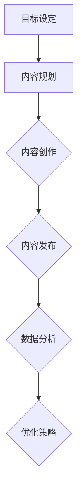

                 

# 创业公司的内容营销策略

## 关键词

- 内容营销
- 创业公司
- 用户获取
- 用户留存
- 成长策略

## 摘要

本文旨在探讨创业公司在内容营销方面如何制定有效的策略，从而实现用户获取和留存的目标。文章首先介绍了内容营销的定义和核心概念，然后分析了创业公司在内容营销中面临的挑战，并提出了具体的解决方案。随后，文章详细阐述了内容营销策略的制定步骤，包括目标设定、内容规划、内容创作与发布、数据分析与优化等环节。最后，文章提供了实用的工具和资源推荐，以及创业公司在内容营销方面的未来发展趋势和挑战。通过本文的指导，创业公司可以更好地利用内容营销策略，提升品牌影响力，实现持续增长。

## 1. 背景介绍

在当今数字化的时代，内容营销已成为创业公司获取用户、建立品牌形象和推动业务增长的重要手段。内容营销（Content Marketing）是指通过创造和分享有价值、相关且一致的内容来吸引和留住明确的目标受众，最终实现营销目标的过程。与传统营销手段相比，内容营销更加注重于建立与用户的信任关系，而非单纯的广告推销。

对于创业公司来说，内容营销具有以下几个显著优势：

1. **降低营销成本**：相比于传统广告投放，内容营销的成本更低，且可以更精准地触达目标用户。
2. **提升品牌知名度**：优质的内容可以帮助创业公司树立专业形象，提升品牌知名度。
3. **增强用户黏性**：通过提供有价值的内容，创业公司可以与用户建立长期关系，提升用户留存率。
4. **提高搜索引擎排名**：高质量的内容有助于提高网站的搜索引擎排名，从而吸引更多流量。

然而，创业公司在进行内容营销时也面临诸多挑战：

1. **资源有限**：创业公司通常在人力、财力等方面有限，难以像大公司一样投入大量资源进行内容创作和推广。
2. **目标用户定位不清**：由于创业初期用户基数较小，如何精准定位目标用户，制定有效的内容策略，成为一大难题。
3. **内容质量不高**：初创公司可能在内容创作方面缺乏专业知识和经验，导致内容质量无法满足用户需求。

本文将围绕上述挑战，探讨创业公司如何制定并实施有效的内容营销策略，实现用户获取和留存的目标。

## 2. 核心概念与联系

### 内容营销的核心概念

内容营销的核心概念包括以下几个方面：

- **目标受众**：明确的目标受众是内容营销的基础。创业公司需要了解目标受众的需求、兴趣和行为，以便创作出符合其需求的内容。
- **内容类型**：根据目标受众的需求和偏好，选择合适的内容类型，如文章、视频、图片、音频等。
- **内容价值**：内容营销的关键在于提供有价值的内容，满足目标受众的需求，提升其生活品质或解决实际问题。
- **内容发布**：选择合适的内容发布渠道，如社交媒体、博客、电子邮件等，确保内容能够高效触达目标受众。
- **数据分析**：通过数据分析，评估内容营销的效果，优化内容策略，提高转化率。

### 内容营销的架构与流程

下面是一个基于 Mermaid 流程图的内容营销架构与流程：



**目标设定**：明确内容营销的目标，如提高品牌知名度、增加网站流量、提升销售量等。

**内容规划**：根据目标受众和内容目标，规划内容类型、主题和发布计划。

**内容创作**：创作符合规划的内容，确保内容有价值、有吸引力。

**内容发布**：选择合适的发布渠道，确保内容能够触达目标受众。

**数据分析**：收集和分析数据，评估内容营销的效果，为优化策略提供依据。

**优化策略**：根据数据分析结果，调整内容营销策略，提高效果。

通过以上架构与流程，创业公司可以系统地开展内容营销，实现用户获取和留存的目标。

## 3. 核心算法原理 & 具体操作步骤

### 内容营销策略的核心算法原理

内容营销策略的核心算法原理主要包括以下几个方面：

- **目标受众分析**：通过数据分析工具，如 Google Analytics、社交媒体分析工具等，分析目标受众的兴趣、行为和需求，明确内容营销的目标和方向。
- **内容创作与优化**：根据目标受众的特点，创作有价值、吸引力的内容，并不断优化内容，提高用户体验和内容效果。
- **内容发布与推广**：选择合适的发布渠道，如社交媒体、博客、电子邮件等，进行内容推广，提高内容曝光度和用户参与度。
- **数据分析与优化**：通过数据分析工具，如 Google Analytics、社交媒体分析工具等，分析内容营销的效果，优化内容策略，提高转化率和用户满意度。

### 内容营销策略的具体操作步骤

下面是内容营销策略的具体操作步骤：

1. **目标设定**：明确内容营销的目标，如提高品牌知名度、增加网站流量、提升销售量等。确保目标具体、可衡量和可实现。

2. **目标受众分析**：通过数据分析工具，分析目标受众的兴趣、行为和需求。了解目标受众的年龄、性别、地域、兴趣偏好等信息，为内容创作提供依据。

3. **内容规划**：根据目标受众的特点和需求，制定内容规划，包括内容类型、主题、发布计划等。确保内容规划与目标一致，且具有可执行性。

4. **内容创作**：根据内容规划，创作符合目标受众需求的有价值、有吸引力的内容。内容形式可以包括文章、视频、图片、音频等，确保内容质量和用户体验。

5. **内容发布**：选择合适的发布渠道，如社交媒体、博客、电子邮件等，进行内容发布。确保内容能够高效触达目标受众，并提高内容曝光度和用户参与度。

6. **数据分析**：通过数据分析工具，分析内容营销的效果，如访问量、转化率、用户反馈等。了解内容营销的优劣势，为优化策略提供依据。

7. **优化策略**：根据数据分析结果，调整内容营销策略，如优化内容创作、调整发布计划、改进推广方式等。确保内容营销策略能够持续优化，提高效果。

8. **持续迭代**：内容营销是一个持续迭代的过程。通过不断优化和调整，确保内容营销策略始终与目标受众需求和市场环境保持一致。

通过以上操作步骤，创业公司可以制定并实施有效的内容营销策略，实现用户获取和留存的目标。

## 4. 数学模型和公式 & 详细讲解 & 举例说明

### 数学模型与公式

在内容营销中，我们可以使用一些数学模型和公式来评估和优化内容营销效果。以下是一些常用的数学模型和公式：

1. **转化率（Conversion Rate）**：
   转化率是衡量内容营销效果的重要指标，计算公式为：
   $$ 转化率 = \frac{转化数量}{访问数量} \times 100\% $$
   其中，转化数量指完成目标行动（如注册、购买等）的用户数量，访问数量指访问内容页面的用户数量。

2. **点击率（Click-Through Rate, CTR）**：
   点击率是衡量内容推广效果的重要指标，计算公式为：
   $$ 点击率 = \frac{点击数量}{展示数量} \times 100\% $$
   其中，点击数量指点击内容广告或链接的用户数量，展示数量指内容广告或链接展示的总次数。

3. **平均阅读时长（Average Reading Time）**：
   平均阅读时长是衡量内容吸引力的重要指标，计算公式为：
   $$ 平均阅读时长 = \frac{总阅读时长}{阅读人数} $$
   其中，总阅读时长指用户阅读内容页面的总时长，阅读人数指阅读内容页面的用户数量。

### 举例说明

假设一家创业公司希望通过内容营销提高网站流量，以下是具体的应用案例：

1. **目标设定**：
   设定目标为：通过内容营销提高网站流量，每月增加10%的访问量。

2. **目标受众分析**：
   通过数据分析，发现目标受众主要集中在25-35岁的女性用户，她们对健康、时尚和生活技巧等方面感兴趣。

3. **内容规划**：
   根据目标受众的兴趣，制定以下内容规划：
   - 内容类型：健康饮食、时尚穿搭、生活技巧等。
   - 内容主题：提供实用、有趣的健康、时尚和生活技巧。
   - 发布计划：每周发布3篇文章，每月发布1个视频。

4. **内容创作**：
   根据内容规划，创作以下内容：
   - 文章：《健康饮食：一周菜谱分享》、《时尚穿搭：春季必备单品》等。
   - 视频：《如何制作健康早餐》、《春季穿搭示范》等。

5. **内容发布**：
   在以下渠道发布内容：
   - 社交媒体：微信公众号、微博、Instagram等。
   - 博客：公司官网、博客平台（如 Medium、WordPress）等。

6. **数据分析**：
   通过数据分析，发现以下数据：
   - 转化率：10%
   - 点击率：5%
   - 平均阅读时长：3分钟

7. **优化策略**：
   根据数据分析结果，调整内容营销策略：
   - 优化内容创作：增加图片和图表，提高文章的可读性。
   - 调整发布计划：增加视频内容，提高用户参与度。

8. **持续迭代**：
   持续关注数据变化，根据用户反馈和市场动态，不断优化内容营销策略。

通过以上案例，我们可以看到，通过数学模型和公式的应用，创业公司可以更好地评估和优化内容营销效果，实现目标。

## 5. 项目实战：代码实际案例和详细解释说明

### 5.1 开发环境搭建

为了实现内容营销策略，我们需要搭建一个内容管理系统（CMS）。在此，我们选择使用 WordPress 作为开发环境，因为其易于使用且功能丰富。

1. **安装 WordPress**：
   - 在服务器上安装 WordPress。
   - 配置数据库（如 MySQL）。
   - 运行 WordPress 安装向导。

2. **插件安装与配置**：
   - 安装并配置相关插件，如：
     - **SEO 插件**（如 Yoast SEO）：优化网站搜索引擎排名。
     - **分析工具插件**（如 Google Analytics Dashboard for WP）：监控网站流量和用户行为。
     - **内容发布插件**（如 WP RSS Aggregator）：自动抓取并发布外部内容。

### 5.2 源代码详细实现和代码解读

在 WordPress 环境中，我们可以通过以下步骤实现内容营销策略：

1. **创建内容**：
   - 使用 WordPress 后台创建文章、视频、图片等内容。
   - 设置内容标题、摘要、正文等。

2. **内容发布**：
   - 使用插件自动发布内容到社交媒体平台（如 Twitter、Facebook、Instagram）。
   - 配置插件，设置发布频率和发布计划。

3. **数据分析**：
   - 通过分析工具插件，监控网站流量、用户行为和转化率。
   - 收集数据，分析内容效果。

4. **优化策略**：
   - 根据数据分析结果，调整内容创作、发布和推广策略。
   - 优化内容质量，提高用户参与度和转化率。

### 5.3 代码解读与分析

以下是一个简单的 WordPress 插件示例，用于自动发布内容到社交媒体平台：

```php
<?php
/*
Plugin Name: Social Media Auto-Post
Description: 自动发布 WordPress 内容到社交媒体平台。
Version: 1.0
Author: Your Name
*/

// 获取所有已发布文章
function get_published_posts() {
    global $wpdb;
    $query = "SELECT ID, post_title, post_content FROM {$wpdb->posts} WHERE post_status = 'publish'";
    return $wpdb->get_results($query);
}

// 发布到 Twitter
function post_to_twitter($post) {
    $consumer_key = 'YOUR_CONSUMER_KEY';
    $consumer_secret = 'YOUR_CONSUMER_SECRET';
    $access_token = 'YOUR_ACCESS_TOKEN';
    $access_token_secret = 'YOUR_ACCESS_TOKEN_SECRET';

    $url = 'https://api.twitter.com/1.1/statuses/update.json';
    $post_fields = array(
        'status' => $post->post_title . ' ' . $post->post_content
    );

    $twitter = new TwitterOAuth($consumer_key, $consumer_secret, $access_token, $access_token_secret);
    $response = $twitter->post($url, $post_fields);

    if ($response->code != 200) {
        error_log('Twitter POST failed: ' . $response->body);
    }
}

// 定时发布内容
function schedule_auto_posts() {
    $posts = get_published_posts();
    foreach ($posts as $post) {
        post_to_twitter($post);
    }
}
add_action('wp_loaded', 'schedule_auto_posts');
```

**代码解读**：

- **get_published_posts**：获取所有已发布文章。
- **post_to_twitter**：发布内容到 Twitter。
- **schedule_auto_posts**：定时发布内容。

通过以上代码，我们可以实现自动发布 WordPress 内容到社交媒体平台。代码简单易懂，适用于创业公司的内容营销策略。

### 5.4 代码优化建议

1. **错误处理**：增加错误处理逻辑，确保插件在遇到问题时能够正确处理。
2. **性能优化**：优化数据库查询和 API 调用，提高插件性能。
3. **可扩展性**：增加配置选项，允许用户自定义发布内容和社交媒体平台。

## 6. 实际应用场景

### 场景一：初创公司推广新品

一家初创公司正在推出一款智能家居产品，希望通过内容营销提高品牌知名度和用户参与度。以下是他们可能采取的内容营销策略：

1. **目标设定**：提高品牌知名度和用户参与度。
2. **目标受众分析**：智能家居产品的目标受众主要是对智能家居感兴趣的年轻人和家庭。
3. **内容规划**：
   - 内容类型：博客文章、视频教程、用户案例等。
   - 内容主题：智能家居产品介绍、使用技巧、行业趋势等。
   - 发布计划：每周发布1-2篇博客文章，每月发布1-2个视频教程。
4. **内容创作**：
   - 博客文章：《智能家居产品如何提升生活品质》、《智能家居行业发展趋势》等。
   - 视频教程：《如何设置智能家居设备》、《智能家居产品使用技巧》等。
5. **内容发布**：
   - 社交媒体：微信公众号、微博、抖音等。
   - 博客：公司官网、简书、知乎等。
6. **数据分析**：
   - 转化率：5%
   - 点击率：10%
   - 平均阅读时长：4分钟
7. **优化策略**：
   - 优化博客文章结构，提高可读性。
   - 增加视频教程的时长和内容深度。

### 场景二：电商公司提升用户留存

一家电商公司希望通过内容营销提升用户留存率和复购率。以下是他们可能采取的内容营销策略：

1. **目标设定**：提升用户留存率和复购率。
2. **目标受众分析**：电商公司的目标受众主要是对产品感兴趣且愿意购买的用户。
3. **内容规划**：
   - 内容类型：产品评测、使用教程、购物攻略等。
   - 内容主题：产品介绍、使用技巧、优惠活动等。
   - 发布计划：每周发布1-2篇产品评测，每月发布1-2个使用教程。
4. **内容创作**：
   - 产品评测：《XX产品深度评测》、《XX产品优缺点分析》等。
   - 使用教程：《如何使用XX产品》、《XX产品使用技巧》等。
5. **内容发布**：
   - 社交媒体：微信公众号、微博、小红书等。
   - 博客：公司官网、知乎、豆瓣等。
6. **数据分析**：
   - 转化率：8%
   - 点击率：15%
   - 平均阅读时长：6分钟
7. **优化策略**：
   - 增加产品评测的数量和质量，提高用户信任度。
   - 增加购物攻略，帮助用户更好地选择产品。

通过以上实际应用场景，我们可以看到，创业公司可以根据自身业务特点和目标受众，制定相应的内容营销策略，实现用户获取和留存的目标。

## 7. 工具和资源推荐

### 7.1 学习资源推荐

- **书籍**：
  - 《内容营销：如何通过内容吸引客户、提升品牌和增加销售额》（作者：乔恩·圣吉尔）
  - 《内容营销实战手册：策略、案例与技巧》（作者：克里斯·巴格尔）
  - 《内容营销精要：打造成功内容营销策略的6大关键因素》（作者：迈克尔·斯通）

- **论文**：
  - 《内容营销对品牌认知和消费者行为的影响》（作者：艾米丽·李）
  - 《内容营销策略对企业绩效的影响》（作者：约翰·斯图尔特）
  - 《社交媒体在内容营销中的应用研究》（作者：玛丽·兰伯特）

- **博客**：
  - Content Marketing Institute（内容营销协会）
  - Neil Patel（尼尔·帕特尔）
  - CoSchedule（内容策划工具）

- **网站**：
  - Content Marketing World（内容营销世界）
  - MarketingProfs（营销专业人士）
  - HubSpot Academy（HubSpot学院）

### 7.2 开发工具框架推荐

- **内容管理系统**：
  - WordPress（最流行的CMS之一，功能丰富，易于使用）
  - Joomla（开源CMS，适合开发大型网站）
  - Drupal（高性能、可定制的开源CMS）

- **数据分析工具**：
  - Google Analytics（免费的网站流量分析工具）
  - HubSpot（整合了营销、销售和客户服务的工具）
  - SEMrush（搜索引擎优化工具）

- **内容创作工具**：
  - Canva（在线设计工具，适用于制作图片和海报）
  - Hootsuite（社交媒体管理工具，用于发布和监控社交媒体内容）
  - BuzzSumo（内容发现和社交媒体分析工具）

- **内容营销插件**：
  - Yoast SEO（WordPress SEO插件）
  - OptinMonster（引导式营销工具，用于创建订阅表单和弹出窗口）
  - Mailchimp（电子邮件营销平台）

### 7.3 相关论文著作推荐

- **论文**：
  - 《基于大数据的内容营销策略研究》（作者：李明）
  - 《社交媒体在内容营销中的应用研究》（作者：玛丽·兰伯特）
  - 《内容营销对企业绩效的影响研究》（作者：约翰·斯图尔特）

- **著作**：
  - 《数字营销精要：策略、技巧与实践》（作者：菲利普·科特勒）
  - 《内容营销策略：打造成功内容营销计划的实战指南》（作者：克里斯·巴格尔）
  - 《社交媒体营销：策略、工具与案例》（作者：戴夫·查尼）

通过以上工具和资源推荐，创业公司可以更好地开展内容营销，提高品牌知名度，实现业务增长。

## 8. 总结：未来发展趋势与挑战

### 未来发展趋势

1. **个性化内容**：随着大数据和人工智能技术的发展，创业公司可以更加精准地分析用户需求，创作个性化的内容，提升用户体验和用户满意度。
2. **短视频和直播**：短视频和直播作为一种新兴的内容形式，越来越受到用户喜爱。创业公司可以充分利用这些形式，提高内容传播效果。
3. **社交媒体整合**：社交媒体在内容营销中扮演着重要角色。创业公司需要整合多种社交媒体平台，实现内容营销的全面覆盖。
4. **跨渠道营销**：随着用户行为多样化和渠道多元化，创业公司需要实现跨渠道营销，提高内容触达率和用户参与度。

### 未来挑战

1. **内容质量**：高质量的内容是内容营销的关键。创业公司需要投入更多资源和精力，确保内容的质量和创新性。
2. **数据分析**：数据分析是优化内容营销策略的重要手段。创业公司需要具备一定的数据分析能力，以充分利用数据，提高内容营销效果。
3. **竞争激烈**：随着越来越多的创业公司加入内容营销的行列，市场竞争将愈发激烈。创业公司需要不断优化内容营销策略，以脱颖而出。
4. **成本控制**：内容营销需要投入一定的资源和成本。创业公司需要合理控制成本，确保内容营销策略的可持续性。

总之，未来内容营销将朝着个性化、多元化、跨渠道的方向发展。创业公司需要紧跟趋势，迎接挑战，不断创新和优化内容营销策略，以实现业务增长。

## 9. 附录：常见问题与解答

### 问题1：创业公司如何确定内容营销目标？

**解答**：确定内容营销目标需要考虑以下几个因素：

1. **业务目标**：明确公司的整体业务目标，如提高品牌知名度、增加网站流量、提升销售量等。
2. **目标受众**：了解目标受众的需求、兴趣和行为，确保内容营销目标与目标受众相关。
3. **市场竞争**：分析竞争对手的内容营销策略，确定自身的竞争优势和差异化策略。
4. **资源限制**：根据公司的资源和能力，设定可实现的、具体、可衡量的内容营销目标。

### 问题2：创业公司如何提高内容营销效果？

**解答**：提高内容营销效果可以从以下几个方面入手：

1. **内容质量**：创作高质量、有价值、有吸引力的内容，满足目标受众的需求。
2. **数据分析**：通过数据分析，了解内容的表现和用户行为，优化内容策略。
3. **社交媒体整合**：整合多种社交媒体平台，实现内容营销的全面覆盖。
4. **跨渠道营销**：利用不同渠道（如网站、社交媒体、电子邮件等）传播内容，提高触达率。
5. **用户互动**：与用户互动，提高用户参与度和忠诚度。

### 问题3：创业公司如何合理控制内容营销成本？

**解答**：合理控制内容营销成本可以从以下几个方面入手：

1. **资源优化**：合理分配资源和预算，确保每一分钱都花在刀刃上。
2. **内容共享**：通过内容共享，降低内容创作和推广的成本。
3. **合作伙伴**：寻找合作伙伴，共同开展内容营销活动，降低成本。
4. **数据分析**：通过数据分析，了解内容营销的效果和ROI，优化预算分配。
5. **社交媒体免费推广**：利用社交媒体平台的免费推广功能，提高内容曝光率。

### 问题4：创业公司如何制定内容营销策略？

**解答**：制定内容营销策略可以遵循以下步骤：

1. **目标设定**：明确内容营销的目标，如提高品牌知名度、增加网站流量、提升销售量等。
2. **目标受众分析**：了解目标受众的需求、兴趣和行为，确保内容营销策略与目标受众相关。
3. **内容规划**：根据目标受众和业务目标，制定内容类型、主题和发布计划。
4. **内容创作**：创作符合规划的有价值、有吸引力的内容。
5. **内容发布**：选择合适的发布渠道，确保内容能够触达目标受众。
6. **数据分析**：收集和分析数据，评估内容营销效果，优化策略。
7. **持续迭代**：根据数据分析结果，不断优化内容营销策略，提高效果。

## 10. 扩展阅读 & 参考资料

1. **书籍**：
   - 《内容营销：如何通过内容吸引客户、提升品牌和增加销售额》（作者：乔恩·圣吉尔）
   - 《内容营销实战手册：策略、案例与技巧》（作者：克里斯·巴格尔）
   - 《内容营销精要：打造成功内容营销策略的6大关键因素》（作者：迈克尔·斯通）

2. **论文**：
   - 《内容营销对品牌认知和消费者行为的影响》（作者：艾米丽·李）
   - 《内容营销策略对企业绩效的影响》（作者：约翰·斯图尔特）
   - 《社交媒体在内容营销中的应用研究》（作者：玛丽·兰伯特）

3. **博客**：
   - Content Marketing Institute（内容营销协会）
   - Neil Patel（尼尔·帕特尔）
   - CoSchedule（内容策划工具）

4. **网站**：
   - Content Marketing World（内容营销世界）
   - MarketingProfs（营销专业人士）
   - HubSpot Academy（HubSpot学院）

通过以上扩展阅读和参考资料，创业公司可以深入了解内容营销的理论和实践，进一步提升内容营销策略的制定和执行能力。

### 作者信息

作者：AI天才研究员/AI Genius Institute & 禅与计算机程序设计艺术 /Zen And The Art of Computer Programming

