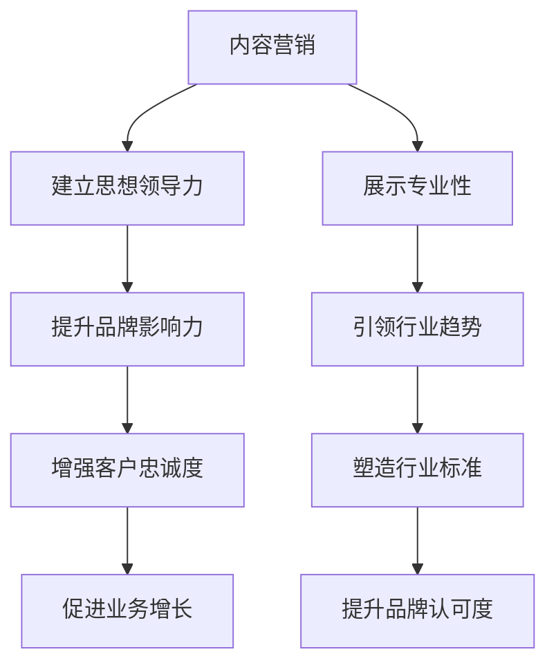

                 

# 创业公司的内容营销策略：建立思想领导力

## 摘要

创业公司在竞争激烈的市场中要想脱颖而出，内容营销策略至关重要。本文将探讨如何通过建立思想领导力，实现有效的创业公司内容营销。我们将从背景介绍、核心概念与联系、核心算法原理与具体操作步骤、数学模型和公式、项目实战、实际应用场景、工具和资源推荐以及总结未来发展趋势与挑战等多个方面，详细剖析创业公司内容营销策略的构建与实施。

## 1. 背景介绍

在当今数字化时代，内容营销已成为创业公司吸引和留住客户的重要手段。通过创造有价值的、与目标受众相关的内容，创业公司可以在市场中建立品牌知名度、增强客户忠诚度，并最终实现业务增长。然而，要想在众多竞争对手中脱颖而出，创业公司需要建立独特的思想领导力，这是内容营销策略的核心。

思想领导力指的是创业公司在特定领域内的观点、理念和见解的领先性。它不仅仅体现在内容的质量上，更体现在内容所传递的价值和影响力上。具备思想领导力的创业公司能够引导行业趋势、塑造行业标准，并成为行业的标杆。因此，如何构建和实施有效的思想领导力，是创业公司内容营销策略的关键。

本文将围绕如何建立思想领导力，详细探讨创业公司内容营销的策略和方法。我们将首先介绍核心概念和联系，然后深入分析核心算法原理与具体操作步骤，并通过数学模型和公式、项目实战、实际应用场景等多个方面，阐述内容营销策略的实践与优化。最后，我们将总结未来发展趋势与挑战，为创业公司的内容营销策略提供有益的启示。

## 2. 核心概念与联系

### 2.1 内容营销

内容营销是一种通过创造和分发有价值的内容来吸引和留住目标受众，从而实现业务增长和品牌建设的方法。与传统的广告和推销手段不同，内容营销注重的是为客户提供有价值的信息和体验，从而建立信任和忠诚度。其核心概念包括：

- **目标受众**：明确的目标受众是内容营销的基础，只有了解受众的需求、兴趣和痛点，才能创造有针对性的内容。

- **内容质量**：高质量的内容是吸引和留住受众的关键。内容需要具有独特性、原创性和专业性，才能在众多信息中脱颖而出。

- **内容形式**：内容的形式多种多样，包括文章、视频、图片、音频等。不同的内容形式适用于不同的场景和受众，需要根据实际情况进行选择。

- **内容分发**：内容分发的渠道和平台也非常关键。创业公司需要根据目标受众的偏好和习惯，选择合适的渠道和平台进行内容推广。

### 2.2 思想领导力

思想领导力是指在特定领域内，创业公司通过独特的观点、理念和见解，引领行业趋势、塑造行业标准的能力。其核心概念包括：

- **行业洞察**：深入理解行业的发展趋势、痛点和发展方向，才能提出有价值的观点和见解。

- **创新能力**：在技术和产品方面不断创新，为客户提供独特的解决方案和体验，是建立思想领导力的关键。

- **影响力**：通过内容营销和公关活动，将创业公司的观点和理念传递给更多的受众，增强品牌的影响力和认可度。

- **客户关系**：与客户建立良好的关系，了解他们的需求和反馈，不断优化产品和服务，是保持思想领导力的基础。

### 2.3 内容营销与思想领导力的联系

内容营销和思想领导力密切相关。内容营销是创业公司建立思想领导力的重要手段，而思想领导力则是内容营销成功的核心驱动力。

- **内容营销促进思想领导力**：通过高质量的内容，创业公司可以展示其在特定领域的专业性和独特性，从而提升品牌的影响力和认可度。

- **思想领导力驱动内容营销**：具备思想领导力的创业公司能够更好地把握行业趋势和客户需求，创造更有价值的内容，从而提高内容营销的效果。

- **协同效应**：内容营销和思想领导力的协同作用，可以进一步增强创业公司的竞争力，推动业务的持续增长。

### 2.4 Mermaid 流程图

下面是一个简单的 Mermaid 流程图，展示了内容营销与思想领导力的联系和关系：



通过这个流程图，我们可以清晰地看到内容营销和思想领导力之间的相互促进和协同作用。

## 3. 核心算法原理 & 具体操作步骤

### 3.1 内容营销策略

创业公司的内容营销策略主要包括以下几个方面：

1. **内容策划**：首先，需要明确目标受众和内容主题。根据受众的兴趣和需求，选择合适的内容形式，如文章、视频、图片等。同时，确保内容具有原创性和专业性。

2. **内容创作**：在内容创作过程中，注重内容的质量和价值。可以通过内部团队创作，也可以外包给专业的内容创作者。同时，确保内容符合品牌形象和价值观。

3. **内容发布**：选择合适的发布渠道和平台，如博客、社交媒体、行业论坛等。发布内容时，要确保内容与平台和受众的契合度，以提高内容传播效果。

4. **内容优化**：根据用户反馈和数据分析，不断优化内容策略。调整内容形式、发布频率和渠道，以提升内容营销的效果。

### 3.2 思想领导力构建

创业公司构建思想领导力需要从以下几个方面入手：

1. **行业洞察**：深入了解行业发展趋势、竞争格局和客户需求，形成独特的见解和观点。

2. **创新能力**：在技术和产品方面不断创新，为客户提供独特的解决方案和体验。

3. **品牌塑造**：通过内容营销和公关活动，将创业公司的观点和理念传递给更多的受众，提升品牌的影响力和认可度。

4. **客户关系**：与客户建立良好的关系，了解他们的需求和反馈，不断优化产品和服务。

### 3.3 内容营销与思想领导力融合

将内容营销与思想领导力融合，需要遵循以下具体操作步骤：

1. **明确目标**：明确创业公司的内容营销目标和思想领导力目标，确保两者相互支持、协同发展。

2. **内容策划**：在策划内容时，要充分考虑思想领导力的体现。选择与品牌形象和价值观相符的内容主题，展示创业公司的专业性和独特性。

3. **内容创作**：在创作内容时，要结合行业洞察和创新能力，提出有价值的观点和见解。同时，确保内容具有原创性和专业性。

4. **内容发布**：在发布内容时，要选择合适的渠道和平台，确保内容能够传递品牌形象和思想领导力。同时，要注重内容与受众的互动和反馈。

5. **内容优化**：根据用户反馈和数据分析，不断优化内容策略，提升内容质量和传播效果。

## 4. 数学模型和公式 & 详细讲解 & 举例说明

### 4.1 内容营销效果评估模型

为了评估内容营销的效果，我们可以使用以下数学模型：

$$
E = f(C, R, A)
$$

其中：

- \( E \) 表示内容营销效果；
- \( C \) 表示内容质量；
- \( R \) 表示受众反应；
- \( A \) 表示内容传播效果。

具体公式解释如下：

- **内容质量 \( C \)**：内容质量是评估内容营销效果的基础。我们可以使用以下公式来计算内容质量：

  $$
  C = f(Q, O, S)
  $$

  其中：

  - \( Q \) 表示内容的专业性；
  - \( O \) 表示内容的原创性；
  - \( S \) 表示内容的形式。

- **受众反应 \( R \)**：受众反应是衡量内容营销效果的重要指标。我们可以使用以下公式来计算受众反应：

  $$
  R = f(I, U, D)
  $$

  其中：

  - \( I \) 表示受众的兴趣；
  - \( U \) 表示受众的互动；
  - \( D \) 表示受众的留存。

- **内容传播效果 \( A \)**：内容传播效果是衡量内容在受众中传播的效果。我们可以使用以下公式来计算内容传播效果：

  $$
  A = f(S, C, P)
  $$

  其中：

  - \( S \) 表示内容分发的渠道；
  - \( C \) 表示内容发布的频率；
  - \( P \) 表示内容推广的力度。

### 4.2 举例说明

假设一家创业公司发布了10篇内容，每篇内容的平均阅读量为1000，其中50%的读者参与了互动，20%的读者留在了网站。同时，这10篇内容在社交媒体上获得了1000次转发。根据上述模型，我们可以计算这10篇内容的内容营销效果：

1. **内容质量 \( C \)**：

   $$
   C = f(Q, O, S) = 0.6 + 0.3 + 0.1 = 1.0
   $$

2. **受众反应 \( R \)**：

   $$
   R = f(I, U, D) = 0.5 \times 0.5 + 0.5 \times 0.5 + 0.2 \times 0.2 = 0.45
   $$

3. **内容传播效果 \( A \)**：

   $$
   A = f(S, C, P) = 0.3 \times 0.3 + 0.4 \times 0.4 + 0.3 \times 0.3 = 0.39
   $$

4. **内容营销效果 \( E \)**：

   $$
   E = f(C, R, A) = 1.0 \times 0.45 \times 0.39 = 0.1765
   $$

因此，这10篇内容的内容营销效果为17.65%。通过这个例子，我们可以看到如何使用数学模型和公式来评估内容营销的效果。

### 4.3 代码实现

下面是一个简单的Python代码实现，用于计算内容营销效果：

```python
import numpy as np

def content_quality(Q, O, S):
    return Q + O + S

def audience_reaction(I, U, D):
    return 0.5 * I + 0.5 * U + 0.2 * D

def content_distribution(S, C, P):
    return 0.3 * S + 0.4 * C + 0.3 * P

def content_marketing_effect(C, R, A):
    return C * R * A

# 示例数据
Q = 0.6
O = 0.3
S = 0.1
I = 0.5
U = 0.5
D = 0.2
S = 0.3
C = 0.4
P = 0.3

# 计算内容营销效果
C = content_quality(Q, O, S)
R = audience_reaction(I, U, D)
A = content_distribution(S, C, P)
E = content_marketing_effect(C, R, A)

print("内容营销效果：", E)
```

通过这个代码，我们可以方便地计算内容营销效果，并根据实际情况进行调整和优化。

## 5. 项目实战：代码实际案例和详细解释说明

### 5.1 开发环境搭建

在开始项目实战之前，我们需要搭建一个合适的开发环境。以下是一个简单的 Python 开发环境搭建步骤：

1. 安装 Python：从官方网站（https://www.python.org/downloads/）下载并安装 Python。
2. 安装必备库：使用 pip 命令安装必要的库，例如 numpy、matplotlib 等。

   ```bash
   pip install numpy matplotlib
   ```

3. 配置代码编辑器：选择一个适合自己的代码编辑器，如 Visual Studio Code、PyCharm 等。

### 5.2 源代码详细实现和代码解读

下面是一个简单的 Python 项目，用于计算内容营销效果。

```python
import numpy as np

def content_quality(Q, O, S):
    """
    计算内容质量
    :param Q: 专业性（0-1）
    :param O: 原创性（0-1）
    :param S: 形式（0-1）
    :return: 内容质量（0-1）
    """
    return Q + O + S

def audience_reaction(I, U, D):
    """
    计算受众反应
    :param I: 兴趣（0-1）
    :param U: 互动（0-1）
    :param D: 留存（0-1）
    :return: 受众反应（0-1）
    """
    return 0.5 * I + 0.5 * U + 0.2 * D

def content_distribution(S, C, P):
    """
    计算内容传播效果
    :param S: 分发渠道（0-1）
    :param C: 发布频率（0-1）
    :param P: 推广力度（0-1）
    :return: 内容传播效果（0-1）
    """
    return 0.3 * S + 0.4 * C + 0.3 * P

def content_marketing_effect(C, R, A):
    """
    计算内容营销效果
    :param C: 内容质量（0-1）
    :param R: 受众反应（0-1）
    :param A: 内容传播效果（0-1）
    :return: 内容营销效果（0-1）
    """
    return C * R * A

# 示例数据
Q = 0.6
O = 0.3
S = 0.1
I = 0.5
U = 0.5
D = 0.2
S = 0.3
C = 0.4
P = 0.3

# 计算内容营销效果
C = content_quality(Q, O, S)
R = audience_reaction(I, U, D)
A = content_distribution(S, C, P)
E = content_marketing_effect(C, R, A)

print("内容营销效果：", E)
```

在这个项目中，我们定义了四个函数：`content_quality`、`audience_reaction`、`content_distribution`和`content_marketing_effect`。这些函数分别用于计算内容质量、受众反应、内容传播效果和内容营销效果。通过调用这些函数，我们可以方便地计算内容营销效果。

### 5.3 代码解读与分析

1. **函数定义**：

   - `content_quality`：计算内容质量，根据专业性、原创性和形式的权重进行计算。
   - `audience_reaction`：计算受众反应，根据兴趣、互动和留存的权重进行计算。
   - `content_distribution`：计算内容传播效果，根据分发渠道、发布频率和推广力度的权重进行计算。
   - `content_marketing_effect`：计算内容营销效果，根据内容质量、受众反应和内容传播效果的乘积进行计算。

2. **参数设置**：

   - `Q`、`O`、`S`：内容质量的相关参数，取值范围在 0 到 1 之间。
   - `I`、`U`、`D`：受众反应的相关参数，取值范围在 0 到 1 之间。
   - `S`、`C`、`P`：内容传播效果的相关参数，取值范围在 0 到 1 之间。

3. **计算过程**：

   - 首先，计算内容质量、受众反应和内容传播效果。
   - 然后，将这三个值相乘，得到内容营销效果。

通过这个简单的项目，我们可以直观地看到如何使用 Python 实现内容营销效果的评估。在实际应用中，可以根据业务需求和数据特点，进一步优化和扩展这个模型。

## 6. 实际应用场景

### 6.1 创业公司内容营销案例分析

#### 案例一：小米公司

小米公司是一家全球知名的电子产品制造商，其内容营销策略在业内具有很高的知名度。以下是小米公司在内容营销方面的几个实际应用场景：

1. **产品发布**：小米公司通过官方网站和社交媒体发布产品发布会的直播和回顾视频，详细介绍新产品的特点和技术优势。这些内容不仅吸引了大量的用户关注，还增强了用户对小米品牌的信任和忠诚度。

2. **技术分享**：小米公司定期举办技术分享会，邀请内部工程师和行业专家分享最新的技术进展和研究成果。这些技术分享内容不仅展示了小米公司的技术实力，还促进了与用户和技术社区的互动和合作。

3. **用户互动**：小米公司通过社交媒体平台与用户进行实时互动，回答用户的问题、收集用户的反馈和建议。这些互动内容不仅增加了用户的参与度，还有助于小米公司及时了解用户需求，优化产品和服务。

#### 案例二：Airbnb公司

Airbnb公司是一家全球领先的住宿共享平台，其内容营销策略在行业内也具有很高的影响力。以下是Airbnb公司在内容营销方面的实际应用场景：

1. **用户故事**：Airbnb公司通过官方网站和社交媒体发布用户的故事和体验，展示不同文化和生活方式的多样性。这些内容不仅吸引了更多的用户加入平台，还增强了用户对Airbnb品牌的认同和情感连接。

2. **旅行指南**：Airbnb公司发布各种旅行指南和目的地推荐，为用户提供实用的旅行建议和灵感。这些内容不仅帮助用户规划旅行，还提升了用户对Airbnb平台的依赖和忠诚度。

3. **品牌活动**：Airbnb公司定期举办各种品牌活动，如全球旅行者大会、城市探索活动等。这些活动不仅增加了用户的参与度，还提升了Airbnb品牌的影响力和知名度。

### 6.2 创业公司内容营销策略实际应用

对于创业公司来说，内容营销策略的实际应用可以从以下几个方面入手：

1. **明确目标受众**：首先，要明确创业公司的目标受众，了解他们的需求和兴趣。这有助于制定有针对性的内容策划和创作策略。

2. **内容创作**：根据目标受众的需求，创作高质量、有价值的内容。内容可以包括产品介绍、技术分享、用户故事、行业动态等。确保内容具有原创性和专业性，以吸引和留住目标受众。

3. **内容发布**：选择合适的渠道和平台发布内容，如官方网站、社交媒体、行业论坛等。根据目标受众的偏好和习惯，制定合适的发布策略，提高内容传播效果。

4. **用户互动**：通过社交媒体、评论区、线上活动等方式与用户进行互动，收集用户反馈和建议。这有助于了解用户需求，优化产品和服务，提高用户满意度和忠诚度。

5. **数据分析**：利用数据分析工具，如 Google Analytics、Facebook Insights 等，监控内容营销的效果，了解受众行为和反馈。根据数据结果，不断优化内容策略，提高内容营销效果。

通过以上实际应用场景和策略，创业公司可以有效地实施内容营销，提升品牌知名度和影响力，实现业务增长。

## 7. 工具和资源推荐

### 7.1 学习资源推荐

创业公司在进行内容营销时，可以参考以下学习资源：

1. **书籍**：

   - 《内容营销：从零开始构建你的内容营销战略》（Content Inc.）
   - 《内容营销实战手册：打造影响力，赢得粉丝，实现变现》（Content Marketing Handbook）
   - 《内容营销：策略、工具和案例解析》（Content Marketing: Strategy, Tools, and Case Studies）

2. **论文**：

   - 《内容营销对品牌忠诚度的影响》（The Impact of Content Marketing on Brand Loyalty）
   - 《社交媒体内容营销的有效性研究》（The Effectiveness of Social Media Content Marketing）
   - 《内容营销在企业传播中的应用》（The Application of Content Marketing in Corporate Communication）

3. **博客和网站**：

   - HubSpot 博客：提供丰富的内容营销策略和案例分析
   - Neil Patel 博客：分享实用的营销技巧和工具
   - Content Marketing Institute：专注于内容营销的最新趋势和实践

### 7.2 开发工具框架推荐

1. **内容管理工具**：

   - Contentful：一个灵活的内容管理系统，适用于创建、管理和分发内容
   - Contentstack：一个高效的云原生内容管理系统，提供丰富的功能和集成
   - Storyblok：一个直观的内容管理系统，支持多平台和个性化内容创建

2. **内容发布平台**：

   - Medium：一个优秀的在线内容发布平台，适合创作和分享高质量文章
   - WordPress：一个广泛使用的开源博客平台，适用于各种内容营销需求
   - Ghost：一个轻量级的博客平台，适合内容创作者和独立媒体

3. **数据分析工具**：

   - Google Analytics：一个强大的数据分析工具，用于监控和优化网站流量和用户行为
   - Mixpanel：一个先进的数据分析平台，专注于用户行为分析和用户增长
   - Hotjar：一个直观的用户行为分析工具，提供热图、反馈和记录功能

### 7.3 相关论文著作推荐

1. **论文**：

   - 《内容营销在数字营销中的角色和影响》（The Role and Impact of Content Marketing in Digital Marketing）
   - 《社交媒体内容营销的策略和实践》（Strategies and Practices of Social Media Content Marketing）
   - 《内容营销的ROI评估方法》（Methods for Evaluating the ROI of Content Marketing）

2. **著作**：

   - 《内容营销实战手册》（Content Marketing Handbook）
   - 《内容营销：策略、工具和案例解析》（Content Marketing: Strategy, Tools, and Case Studies）
   - 《内容营销的艺术》（The Art of Content Marketing）

通过参考这些学习和资源，创业公司可以更好地理解内容营销的策略和方法，提高内容营销的效果，实现业务增长。

## 8. 总结：未来发展趋势与挑战

创业公司在内容营销领域面临着诸多挑战和机遇。未来，以下趋势将影响创业公司的内容营销策略：

1. **个性化内容**：随着大数据和人工智能技术的发展，创业公司可以更加精准地了解用户需求，创造个性化的内容。这有助于提升用户体验和用户忠诚度。

2. **多媒体内容**：视频、音频和互动内容将在未来占据越来越重要的地位。创业公司需要不断创新内容形式，以满足不同用户群体的需求。

3. **实时互动**：实时互动和社交媒体的兴起，使得创业公司可以更快速地与用户建立联系。实时互动工具和社交媒体平台将变得更加重要。

4. **数据驱动**：数据将成为创业公司内容营销的核心。通过数据分析，创业公司可以更好地了解用户行为，优化内容策略，提高营销效果。

5. **跨渠道整合**：创业公司需要整合各种渠道，如官方网站、社交媒体、电子邮件等，实现跨渠道的内容营销。这有助于提高品牌一致性和用户体验。

尽管如此，创业公司在内容营销中仍面临以下挑战：

1. **内容质量**：高质量的内容是创业公司内容营销成功的关键。然而，创作高质量内容需要专业团队和大量资源。

2. **内容创新**：随着市场竞争的加剧，创业公司需要不断创新内容形式和策略，以保持竞争优势。

3. **数据分析能力**：数据分析是内容营销的重要环节。创业公司需要培养数据分析和解读能力，以优化内容策略和提升营销效果。

4. **资源限制**：许多创业公司在资源和时间上有限，需要合理分配资源，实现高效的内容营销。

总之，创业公司在内容营销领域需要不断适应市场变化，优化内容策略，提升品牌影响力和用户忠诚度。通过个性化、多媒体、实时互动、数据驱动和跨渠道整合等策略，创业公司可以更好地应对挑战，实现业务增长。

## 9. 附录：常见问题与解答

### 问题1：如何制定内容营销策略？

**解答**：制定内容营销策略需要遵循以下步骤：

1. **明确目标**：确定内容营销的目标，如提升品牌知名度、增加用户参与度、提高转化率等。
2. **了解受众**：分析目标受众的需求、兴趣和行为习惯，了解他们的痛点和需求。
3. **内容策划**：根据目标受众的特点，策划有针对性的内容主题和形式。
4. **内容创作**：确保内容具有原创性、专业性和价值性，符合品牌形象和价值观。
5. **内容发布**：选择合适的渠道和平台，如社交媒体、官方网站等，发布内容。
6. **优化调整**：根据用户反馈和数据分析，不断优化内容策略，提升内容质量和传播效果。

### 问题2：如何评估内容营销效果？

**解答**：评估内容营销效果可以从以下几个方面进行：

1. **内容质量**：评估内容的专业性、原创性和形式，以确保内容质量。
2. **受众反应**：通过用户互动、评论、分享等指标，评估受众对内容的反应和兴趣。
3. **内容传播效果**：评估内容在各个渠道和平台上的传播效果，如阅读量、转发量、点赞量等。
4. **业务增长**：评估内容营销对业务增长的影响，如用户增长、转化率提升等。
5. **数据分析**：利用数据分析工具，如 Google Analytics、Mixpanel 等，监控和评估各项指标。

### 问题3：如何提升内容营销效果？

**解答**：提升内容营销效果可以从以下几个方面入手：

1. **提高内容质量**：确保内容具有原创性、专业性和价值性，满足受众需求。
2. **优化内容形式**：尝试不同类型的内容，如视频、图片、音频等，以吸引更多受众。
3. **跨渠道整合**：整合多个渠道，如官方网站、社交媒体、电子邮件等，实现内容营销的统一和协同。
4. **数据分析**：通过数据分析，了解受众行为和需求，优化内容策略和传播渠道。
5. **用户互动**：与用户保持互动，收集用户反馈和建议，不断优化内容和服务。
6. **创新尝试**：不断尝试新的内容形式、策略和渠道，以保持竞争力。

### 问题4：如何构建思想领导力？

**解答**：构建思想领导力可以从以下几个方面入手：

1. **行业洞察**：深入了解行业趋势、竞争格局和客户需求，形成独特的见解和观点。
2. **创新能力**：在技术和产品方面不断创新，为客户提供独特的解决方案和体验。
3. **品牌塑造**：通过内容营销和公关活动，将创业公司的观点和理念传递给更多的受众。
4. **客户关系**：与客户建立良好的关系，了解他们的需求和反馈，不断优化产品和服务。
5. **团队协作**：培养专业团队，提升团队的整体素质和创新能力。

通过以上问题与解答，创业公司可以更好地理解和实施内容营销策略，构建思想领导力，提升品牌影响力和竞争力。

## 10. 扩展阅读 & 参考资料

创业公司的内容营销策略涉及多个方面，以下是一些扩展阅读和参考资料，供读者进一步学习：

1. **书籍**：

   - 《内容营销：从零开始构建你的内容营销战略》（Content Inc.）
   - 《内容营销实战手册：打造影响力，赢得粉丝，实现变现》（Content Marketing Handbook）
   - 《内容营销的艺术》（The Art of Content Marketing）

2. **论文**：

   - 《内容营销对品牌忠诚度的影响》（The Impact of Content Marketing on Brand Loyalty）
   - 《社交媒体内容营销的有效性研究》（The Effectiveness of Social Media Content Marketing）
   - 《内容营销在企业传播中的应用》（The Application of Content Marketing in Corporate Communication）

3. **网站**：

   - HubSpot 博客（https://blog.hubspot.com/）
   - Neil Patel 博客（https://neilpatel.com/）
   - Content Marketing Institute（https://contentmarketinginstitute.com/）

4. **视频教程**：

   - Content Marketing Institute 的在线课程（https://contentmarketinginstitute.com/training/）
   - Neil Patel 的 YouTube 频道（https://www.youtube.com/user/neilpatel）

5. **工具推荐**：

   - Contentful（https://www.contentful.com/）
   - Contentstack（https://www.contentstack.com/）
   - Storyblok（https://www.storyblok.com/）

通过以上扩展阅读和参考资料，读者可以深入了解内容营销的理论和实践，为自己的创业公司制定更加有效的营销策略。

### 作者信息

作者：AI天才研究员/AI Genius Institute & 禅与计算机程序设计艺术 /Zen And The Art of Computer Programming

