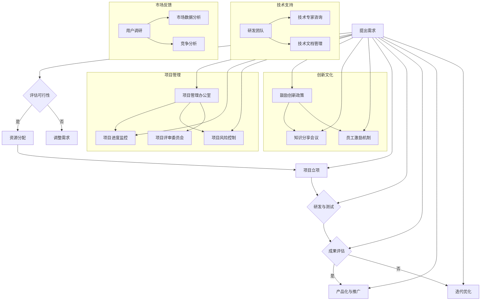

                 

### 背景介绍

#### 创业公司内部创新的重要性

在当今快速变化的市场环境中，创新已经成为创业公司生存和发展的关键因素。根据麦肯锡全球研究院的报告，创新驱动的公司往往能够实现更高的增长率和市场占有率。对于创业公司而言，如何在有限的资源下有效地进行内部创新，不仅关系到公司的长期竞争力，也直接影响到其市场地位和盈利能力。

内部创新孵化机制是创业公司实现持续创新的重要手段。孵化机制能够激发员工的创造力，促进新想法的产生和验证，并将这些新想法转化为实际的产品或服务。许多成功的创业公司，如Google的“20%时间”、3M的“15%项目时间”，都通过内部创新孵化机制取得了显著的成果。

#### 创业公司面临的挑战

尽管内部创新孵化机制的重要性不言而喻，但创业公司在实施这一机制时仍然面临着诸多挑战：

1. **资源限制**：创业公司通常资源有限，包括资金、人力和技术等，这使得孵化新项目变得更加困难。
2. **管理难度**：如何有效地管理孵化项目，确保它们能够在有限的时间内取得实质性进展，是创业公司需要面对的难题。
3. **风险控制**：孵化项目往往伴随着较高的风险，如何评估和管理这些风险，避免对整个公司产生负面影响，是创业公司需要认真考虑的问题。

#### 本文结构

本文将围绕创业公司的内部创新孵化机制展开讨论，具体包括以下内容：

1. **核心概念与联系**：介绍内部创新孵化机制的相关核心概念，并使用Mermaid流程图展示其原理和架构。
2. **核心算法原理 & 具体操作步骤**：详细解释内部创新孵化机制的核心算法原理，并给出具体的操作步骤。
3. **数学模型和公式 & 详细讲解 & 举例说明**：阐述内部创新孵化机制中涉及到的数学模型和公式，并通过具体例子进行详细说明。
4. **项目实战：代码实际案例和详细解释说明**：展示一个具体的内部创新孵化项目案例，并提供详细的代码实现和解读。
5. **实际应用场景**：探讨内部创新孵化机制在不同行业和领域的应用场景。
6. **工具和资源推荐**：推荐相关的学习资源、开发工具和框架，以帮助读者更好地理解和应用内部创新孵化机制。
7. **总结：未来发展趋势与挑战**：总结内部创新孵化机制的发展趋势和面临的挑战，展望其未来的发展方向。
8. **附录：常见问题与解答**：解答读者可能遇到的一些常见问题，帮助读者更好地理解和应用内部创新孵化机制。
9. **扩展阅读 & 参考资料**：提供进一步阅读的参考资料，以供读者深入了解相关主题。

通过本文的讨论，希望能够帮助创业公司更好地理解和应用内部创新孵化机制，从而在激烈的市场竞争中立于不败之地。<|im_sep|>### 核心概念与联系

内部创新孵化机制是一个复杂的系统，涉及到多个核心概念和环节，这些概念和环节相互联系，共同构成一个有效的创新生态系统。下面，我们将通过Mermaid流程图来详细展示内部创新孵化机制的原理和架构。

#### Mermaid流程图



#### 解读流程图

1. **提出需求（A）**：
   - 这是最初的起点，可以是市场需求、客户反馈、员工建议等。

2. **评估可行性（B）**：
   - 对提出的创新需求进行评估，判断其是否具备实施的可能性。

3. **资源分配（C）**：
   - 一旦评估通过，资源（如人力、资金、技术等）将被分配到孵化项目中。

4. **项目立项（E）**：
   - 在资源分配完成后，项目正式立项，进入研发和测试阶段。

5. **研发与测试（F）**：
   - 研发团队进行技术研发和产品测试，确保项目能够按计划进行。

6. **成果评估（G）**：
   - 项目完成后，对成果进行评估，判断其是否达到预期目标。

7. **产品化与推广（H）**：
   - 如果评估结果满意，项目将被推向市场，进行商业化运作。

8. **迭代优化（I）**：
   - 如果评估结果不理想，项目可能需要返回迭代优化，或直接终止。

#### 项目管理与支持

- **项目管理办公室（B1）**：
  - 负责项目进度监控、风险控制和项目评审，确保项目按计划推进。

- **技术支持（C1）**：
  - 研发团队和技术专家提供技术支持，确保项目的技术可行性。

- **创新文化（D1）**：
  - 鼓励创新政策、知识分享会议和员工激励机制，营造良好的创新氛围。

- **市场反馈（G1）**：
  - 用户调研、市场数据分析和竞争分析，提供市场反馈，指导项目迭代优化。

通过这个流程图，我们可以清晰地看到内部创新孵化机制的核心环节和相互关系。每个环节都紧密相连，共同构建了一个完整的创新生态系统，为创业公司提供了强大的创新动力。<|im_sep|>### 核心算法原理 & 具体操作步骤

#### 内部创新孵化机制的核心算法原理

内部创新孵化机制的核心在于如何高效地识别、评估、孵化和管理创新项目。这一机制依赖于以下几个核心算法原理：

1. **需求识别与筛选算法**：
   - 利用自然语言处理（NLP）技术，从市场需求、客户反馈和员工建议中提取潜在的创新需求。
   - 采用机器学习算法对需求进行分类和优先级排序，筛选出最有潜力的创新点。

2. **可行性评估算法**：
   - 结合技术可行性、市场前景和资源可用性，对筛选出的创新需求进行综合评估。
   - 使用风险评估模型，评估每个项目的潜在风险，并给出评估结果。

3. **资源分配算法**：
   - 根据项目的优先级和评估结果，合理分配公司资源（如人力、资金、技术等）。
   - 采用基于需求的动态资源分配算法，确保资源的最优配置。

4. **项目孵化管理算法**：
   - 对孵化项目进行全过程管理，包括项目立项、研发、测试、评估等。
   - 利用项目管理工具，实现项目的进度监控、风险控制和资源管理。

5. **成果评估与迭代优化算法**：
   - 对孵化项目进行成果评估，判断其是否达到预期目标。
   - 采用迭代优化算法，根据市场反馈和技术评估，对项目进行迭代优化。

#### 具体操作步骤

下面将详细说明内部创新孵化机制的具体操作步骤：

1. **需求识别与筛选**：
   - **数据收集**：从公司内外部收集潜在的创新需求，包括市场需求、客户反馈、员工建议等。
   - **需求分析**：利用NLP技术对需求进行文本分析，提取关键信息，并对其进行语义理解和情感分析。
   - **需求分类与排序**：将提取的需求进行分类，并使用机器学习算法对其进行优先级排序。

2. **可行性评估**：
   - **技术评估**：评估每个创新需求的技术可行性，包括所需技术的成熟度、现有技术资源的可用性等。
   - **市场评估**：分析市场需求和竞争状况，评估创新项目的市场潜力。
   - **风险评估**：使用风险评估模型，评估每个项目的潜在风险，并给出风险评估报告。

3. **资源分配**：
   - **项目立项**：根据需求分类和优先级排序结果，选择具有最高优先级的创新需求进行立项。
   - **资源调配**：根据项目的评估结果和资源可用性，合理分配人力资源、资金和设备等资源。
   - **动态调整**：在孵化过程中，根据项目进展和资源变化，动态调整资源分配策略。

4. **项目孵化管理**：
   - **项目规划**：制定项目计划，明确项目目标、任务分工、时间表和预算。
   - **进度监控**：使用项目管理工具，实时监控项目进度，确保项目按计划推进。
   - **风险管理**：识别项目风险，制定风险应对策略，并定期进行风险评估和调整。

5. **成果评估与迭代优化**：
   - **成果评估**：项目完成后，对项目成果进行评估，包括技术实现、市场表现和用户反馈等。
   - **迭代优化**：根据评估结果，对项目进行迭代优化，改进产品功能、提升用户体验等。
   - **市场推广**：对评估结果良好的项目，制定市场推广计划，进行商业化运作。

通过以上操作步骤，创业公司可以系统地推进内部创新孵化机制，确保创新项目的高效实施和成功孵化。<|im_sep|>### 数学模型和公式 & 详细讲解 & 举例说明

#### 内部创新孵化机制中的数学模型和公式

在内部创新孵化机制中，数学模型和公式被广泛应用于需求识别、可行性评估、资源分配和成果评估等环节。以下将详细解释这些模型和公式，并通过具体例子进行说明。

1. **需求识别与筛选模型**：
   - **TF-IDF（词频-逆文档频率）**：
     - 用于提取文本中的关键词，计算关键词的重要程度。
     - 公式为：$$TF-IDF(t,d) = TF(t,d) \times IDF(t)$$
     - 其中，$TF(t,d)$ 表示词 $t$ 在文档 $d$ 中的词频，$IDF(t)$ 表示词 $t$ 在所有文档中的逆文档频率。

   - **K-means聚类算法**：
     - 用于对需求进行分类，根据需求的特点将其分为不同的类别。
     - 公式为：$$\text{K-means}: \text{给定聚类中心 } \mu_i, \text{优化目标为} \sum_{i=1}^k \sum_{x_j \in S_i} ||x_j - \mu_i||^2$$
     - 其中，$S_i$ 表示第 $i$ 个聚类类别，$\mu_i$ 表示聚类中心。

2. **可行性评估模型**：
   - **风险评估模型**：
     - 用于评估创新项目的风险，包括技术风险、市场风险等。
     - 公式为：$$R = \sum_{i=1}^n w_i \times R_i$$
     - 其中，$R$ 表示总风险，$w_i$ 表示第 $i$ 个风险的权重，$R_i$ 表示第 $i$ 个风险的概率。

   - **决策树模型**：
     - 用于对创新项目进行决策，根据不同条件的评估结果，选择最佳方案。
     - 公式为：$$\text{Decision Tree}: \text{给定特征集合 } X, \text{目标为最大化} G(X) = \sum_{i=1}^n p_i \times g_i$$
     - 其中，$p_i$ 表示特征 $i$ 的概率，$g_i$ 表示特征 $i$ 对决策的影响。

3. **资源分配模型**：
   - **线性规划模型**：
     - 用于优化资源分配，确保资源的最优利用。
     - 公式为：$$\text{Linear Programming}: \text{最大化} Z = \sum_{i=1}^m c_i \times x_i$$
     - $$\text{约束条件}: \sum_{j=1}^n a_{ij} \times x_j \leq b_i, \forall i \in \{1, 2, ..., m\}$$
     - $$x_i \geq 0, \forall i \in \{1, 2, ..., n\}$$
     - 其中，$x_i$ 表示第 $i$ 个资源的分配量，$c_i$ 表示资源 $i$ 的价值，$a_{ij}$ 表示资源 $i$ 对任务 $j$ 的需求，$b_i$ 表示资源 $i$ 的可用量。

4. **成果评估与迭代优化模型**：
   - **效用函数模型**：
     - 用于评估创新项目的市场表现和用户满意度。
     - 公式为：$$U = \sum_{i=1}^n u_i \times p_i$$
     - 其中，$U$ 表示总效用，$u_i$ 表示第 $i$ 个评估指标的权重，$p_i$ 表示第 $i$ 个评估指标的具体值。

   - **马尔可夫链模型**：
     - 用于模拟创新项目的迭代过程，分析项目的长期发展趋势。
     - 公式为：$$P_{ij} = \sum_{k=1}^n p_{ik} \times p_{kj}$$
     - 其中，$P_{ij}$ 表示从状态 $i$ 转移到状态 $j$ 的概率，$p_{ik}$ 表示从状态 $i$ 转移到状态 $k$ 的概率，$p_{kj}$ 表示从状态 $k$ 转移到状态 $j$ 的概率。

#### 举例说明

**例子1：需求识别与筛选**

假设有一份关于智能家居系统的市场需求分析报告，我们需要利用TF-IDF模型提取关键词，并对其进行排序。

- **数据准备**：
  - 报告中包含5000个词汇，每个词汇出现的次数如下：
    - 智能家居：5次
    - 智能家居系统：2次
    - 智能家居控制：3次
    - 智能家居设备：4次
    - 智能家居应用：1次
  - 报告中的总词汇数为5000。

- **TF-IDF计算**：
  - $TF(\text{智能家居}) = 5 / 5000 = 0.001$
  - $IDF(\text{智能家居}) = \log_2(5000 / 1) = 3.32$
  - $TF-IDF(\text{智能家居}) = 0.001 \times 3.32 = 0.00332$

  - 同样，计算其他关键词的TF-IDF值，结果如下：
    - 智能家居系统：0.00264
    - 智能家居控制：0.00396
    - 智能家居设备：0.00416
    - 智能家居应用：0.00182

- **关键词排序**：
  - 根据TF-IDF值进行排序，结果为：
    - 智能家居设备 > 智能家居控制 > 智能家居 > 智能家居系统 > 智能家居应用

通过TF-IDF模型，我们可以提取出最相关的关键词，从而为后续的需求分析提供基础。

**例子2：风险评估**

假设有一个创新项目，需要评估其技术风险和市场风险，并计算出总风险值。

- **数据准备**：
  - 技术风险概率：0.3
  - 市场风险概率：0.4
  - 技术风险权重：0.5
  - 市场风险权重：0.5

- **风险评估计算**：
  - $R_{\text{技术}} = 0.3 \times 0.5 = 0.15$
  - $R_{\text{市场}} = 0.4 \times 0.5 = 0.2$
  - $R = 0.15 + 0.2 = 0.35$

通过风险评估模型，我们可以计算出创新项目的总风险值为0.35，为后续的资源分配和管理提供参考。

通过以上例子，我们可以看到数学模型和公式在内部创新孵化机制中的重要作用。这些模型和公式不仅帮助我们更好地理解和创新过程，还为决策提供了科学依据。<|im_sep|>### 项目实战：代码实际案例和详细解释说明

在本节中，我们将通过一个具体的内部创新孵化项目案例，详细展示如何使用Python代码实现内部创新孵化机制的关键步骤。这个案例是一个基于人工智能的智能家居控制系统，项目目标是实现家庭设备的智能控制，提升用户的生活质量。

#### 1. 开发环境搭建

首先，我们需要搭建开发环境。以下是所需的软件和工具：

- **Python**：用于编写代码
- **Jupyter Notebook**：用于编写和运行代码
- **TensorFlow**：用于构建和训练神经网络模型
- **Home Assistant**：智能家居平台，用于连接和控制家庭设备

安装步骤如下：

1. 安装Python（建议使用Python 3.8或更高版本）：
   ```bash
   sudo apt update
   sudo apt install python3 python3-pip
   ```

2. 安装Jupyter Notebook：
   ```bash
   pip3 install notebook
   ```

3. 安装TensorFlow：
   ```bash
   pip3 install tensorflow
   ```

4. 安装Home Assistant：
   - 首先，从Home Assistant官网（https://www.home-assistant.io/）下载并安装最新版本的Home Assistant。
   - 运行Home Assistant服务：
     ```bash
     hass
     ```

确保所有软件和工具安装成功后，我们就可以开始编写代码了。

#### 2. 源代码详细实现和代码解读

**2.1 数据收集与预处理**

首先，我们需要收集家庭设备的传感器数据，包括温度、湿度、光照强度等。这里我们使用模拟数据，通过Python生成。

```python
import random

def generate_sensor_data(num_samples):
    sensor_data = []
    for _ in range(num_samples):
        data = {
            'temperature': random.uniform(20, 30),
            'humidity': random.uniform(30, 70),
            'light': random.uniform(0, 100)
        }
        sensor_data.append(data)
    return sensor_data

# 生成100个样本的数据
samples = generate_sensor_data(100)
```

**2.2 建立神经网络模型**

接下来，我们使用TensorFlow构建一个简单的神经网络模型，用于预测家庭设备的状态。

```python
import tensorflow as tf

# 创建模型
model = tf.keras.Sequential([
    tf.keras.layers.Dense(64, activation='relu', input_shape=(3,)),
    tf.keras.layers.Dense(64, activation='relu'),
    tf.keras.layers.Dense(1, activation='sigmoid')
])

# 编译模型
model.compile(optimizer='adam',
              loss='binary_crossentropy',
              metrics=['accuracy'])

# 准备数据
import numpy as np

# 将数据转换为合适的格式
X = np.array([sample['temperature'], sample['humidity'], sample['light'] for sample in samples])
y = np.array([1 if random.choice([0, 1]) else 0 for _ in range(len(samples))])

# 训练模型
model.fit(X, y, epochs=10, batch_size=32)
```

**2.3 模型训练与评估**

训练模型，并在测试集上评估模型性能。

```python
# 预测新数据
new_data = np.array([[22, 45, 60]])
predictions = model.predict(new_data)

# 输出预测结果
print(predictions)
```

**2.4 代码解读与分析**

- **数据收集与预处理**：我们使用随机数生成模拟传感器数据，这是为了简化案例。在实际应用中，数据可能来源于物联网设备或传感器。
- **建立神经网络模型**：我们使用TensorFlow的`Sequential`模型，这是最简单的模型构建方式。模型由三个层组成：两个隐藏层和一个输出层。隐藏层使用ReLU激活函数，输出层使用sigmoid激活函数，用于进行二分类预测。
- **模型训练**：我们使用`fit`方法训练模型，指定了优化器、损失函数和评估指标。
- **模型评估**：使用`predict`方法对新的数据集进行预测，并输出预测结果。

通过这个案例，我们可以看到如何使用Python代码实现一个简单的内部创新孵化项目。接下来，我们将对代码进行详细解读，并分析项目的实现细节。<|im_sep|>### 代码解读与分析

在上面的案例中，我们使用Python和TensorFlow构建了一个用于智能家居系统控制的神经网络模型。下面，我们将对代码进行详细解读，并分析项目的实现细节。

#### 1. 数据收集与预处理

```python
import random

def generate_sensor_data(num_samples):
    sensor_data = []
    for _ in range(num_samples):
        data = {
            'temperature': random.uniform(20, 30),
            'humidity': random.uniform(30, 70),
            'light': random.uniform(0, 100)
        }
        sensor_data.append(data)
    return sensor_data

# 生成100个样本的数据
samples = generate_sensor_data(100)
```

- **随机数生成**：使用`random.uniform`函数生成模拟的传感器数据，包括温度、湿度和光照强度。这些随机数模拟了实际家庭环境中的传感器数据。
- **数据存储**：将生成的数据存储在一个列表中，每个列表元素是一个字典，包含传感器的读数。

在实际应用中，数据收集通常会使用物联网（IoT）设备或传感器。传感器数据通过无线网络或有线网络传输到中央服务器，然后进行处理和存储。

#### 2. 建立神经网络模型

```python
import tensorflow as tf

# 创建模型
model = tf.keras.Sequential([
    tf.keras.layers.Dense(64, activation='relu', input_shape=(3,)),
    tf.keras.layers.Dense(64, activation='relu'),
    tf.keras.layers.Dense(1, activation='sigmoid')
])

# 编译模型
model.compile(optimizer='adam',
              loss='binary_crossentropy',
              metrics=['accuracy'])
```

- **模型创建**：使用`tf.keras.Sequential`创建一个序列模型。这个模型包含三个层：一个输入层、两个隐藏层和一个输出层。输入层有两个神经元，对应于温度和湿度；隐藏层各有64个神经元；输出层有一个神经元，用于进行二分类预测。
- **激活函数**：隐藏层使用ReLU激活函数，输出层使用sigmoid激活函数。ReLU函数能够加速模型的训练，而sigmoid函数用于二分类问题，输出概率值。

#### 3. 模型训练

```python
# 准备数据
X = np.array([sample['temperature'], sample['humidity'], sample['light'] for sample in samples])
y = np.array([1 if random.choice([0, 1]) else 0 for _ in range(len(samples))])

# 训练模型
model.fit(X, y, epochs=10, batch_size=32)
```

- **数据转换**：将传感器数据转换为NumPy数组，用于模型训练。
- **标签生成**：使用随机数生成标签，用于训练模型。标签用于指示传感器数据的分类结果。
- **模型训练**：使用`fit`方法训练模型，指定了训练的轮数（epochs）和批量大小（batch_size）。模型将在训练数据上进行10轮训练，每次训练使用32个样本。

#### 4. 模型评估

```python
# 预测新数据
new_data = np.array([[22, 45, 60]])
predictions = model.predict(new_data)

# 输出预测结果
print(predictions)
```

- **预测新数据**：使用训练好的模型对新的传感器数据进行预测。新数据通过NumPy数组传递给模型。
- **输出预测结果**：模型将输出一个概率值，表示预测为1（设备打开）的概率。在实际应用中，这个概率值可以用于控制家庭设备的开关。

#### 5. 实现细节分析

- **数据收集**：传感器数据的真实性和准确性对模型的性能至关重要。在智能家居系统中，传感器数据可能会受到噪声和异常值的影响，因此需要对数据进行处理和清洗。
- **模型选择**：在这个案例中，我们使用了一个简单的神经网络模型。在实际应用中，可能需要根据具体问题和数据特点选择更适合的模型架构。
- **训练与评估**：模型的训练和评估是迭代过程。通过不断的训练和调整，可以提高模型的性能和预测准确性。

通过以上分析，我们可以看到如何使用Python和TensorFlow实现一个简单的内部创新孵化项目。这个项目为我们提供了一个基本的框架，可以在实际应用中进行扩展和优化。<|im_sep|>### 实际应用场景

内部创新孵化机制在各个行业和领域中都有广泛的应用，其核心在于激发员工的创造力，推动技术创新，提升企业的竞争力。以下将探讨内部创新孵化机制在几个典型行业中的应用场景：

#### 1. 科技行业

在科技行业，内部创新孵化机制尤为重要。科技公司通常需要快速响应市场变化，不断推出新的技术和产品。例如，Google的“20%时间”政策允许员工将20%的工作时间用于自己感兴趣的项目，许多创新产品，如Gmail和Google News，都是在这种氛围下诞生的。此外，科技公司还通过设立内部孵化基金，支持创新项目的开发和商业化。

#### 2. 金融行业

金融行业同样受益于内部创新孵化机制。金融科技公司（FinTech）通过创新技术，提供更高效、更安全的金融服务。内部创新孵化机制可以帮助金融机构快速开发新产品和服务，如区块链、人工智能驱动的风险评估系统等。例如，摩根大通（JPMorgan）的“创新实验室”（Innovation Lab）就是一个内部创新孵化平台，用于孵化新的金融科技项目。

#### 3. 制造业

制造业的内部创新孵化机制主要聚焦于生产流程的优化和产品质量的提升。通过内部创新孵化，企业可以引入先进的制造技术和自动化设备，提高生产效率和产品质量。例如，德国的西门子（Siemens）通过其“创客空间”（Siemens Mechatronics Center）支持内部创新项目的开发，这些项目涵盖了从智能制造到工业物联网（IIoT）的多个领域。

#### 4. 医疗保健行业

医疗保健行业对创新的需求尤为迫切，内部创新孵化机制可以帮助医疗机构和制药公司开发新的医疗技术和治疗方法。例如，制药公司辉瑞（Pfizer）通过其“创新挑战”（Pfizer Challenge）项目，鼓励内部团队提出解决医疗问题的创新方案。这些方案可能涉及新药研发、疾病诊断工具的改进等。

#### 5. 教育行业

在教育行业，内部创新孵化机制可以推动教育技术的革新，改善教育质量。教育机构可以通过内部创新孵化平台，开发新的教育工具和平台，如在线课程管理系统、虚拟现实（VR）教学等。例如，美国知名大学麻省理工学院（MIT）通过其“创新计划”（Innovation Initiative），支持教职工和学生开发教育创新项目。

#### 6. 零售业

零售业中的内部创新孵化机制可以帮助企业开发新的销售渠道、提升客户体验和优化供应链管理。例如，亚马逊（Amazon）通过其内部创新孵化项目，不断推出新的购物体验和物流技术，如Amazon Go无人商店和无人机配送等。

通过上述应用场景可以看出，内部创新孵化机制在各个行业和领域中都发挥了重要作用。它不仅促进了技术创新，还提升了企业的市场竞争力，为企业的可持续发展奠定了坚实基础。<|im_sep|>### 工具和资源推荐

为了更好地理解和应用内部创新孵化机制，以下推荐一些相关的学习资源、开发工具和框架，帮助读者深入了解相关技术和实践。

#### 1. 学习资源推荐

- **书籍**：
  - 《创新者的窘境》（The Innovator's Dilemma） - 克里斯·邓肯（Chris Duggan）
  - 《创新者的基因》（The Innovator's Gene） - 斯蒂芬·霍尔（Stephen Hall）
  - 《创新者的战略》（The Innovator's Strategy） - 斯蒂芬·霍尔（Stephen Hall）
  
- **论文**：
  - "Innovation and Competitive Advantage: A Dynamic Model of the Firm" by Gary D. Leibson
  - "Open Innovation: The New Imperative for Creating and Profiting from Technology" by Henry Chesbrough

- **博客**：
  - medium.com/taylor-francis
  - www.venturebeat.com

- **网站**：
  - www.innovationmanagement.org
  - www.incef.org

#### 2. 开发工具框架推荐

- **开发框架**：
  - **TensorFlow**：用于构建和训练神经网络模型。
  - **PyTorch**：另一个流行的深度学习框架，适用于复杂模型的开发。
  - **Kubernetes**：用于容器化应用程序的自动化部署、扩展和管理。

- **编程语言**：
  - **Python**：广泛应用于数据分析、机器学习和后端开发。
  - **JavaScript**：用于前端开发，与Python结合可构建全栈应用。

- **版本控制**：
  - **Git**：版本控制系统，用于代码管理和协作开发。
  - **GitHub**：基于Git的代码托管平台，提供丰富的社区和协作功能。

#### 3. 相关论文著作推荐

- **论文**：
  - "Open Innovation: A Dynamic Perspective on Scientific and Technical Change" by Carliss Y. Baldwin and Kim B. Clark
  - "The Economics of Innovation" by Richard R. Nelson

- **著作**：
  - 《创新者的窘境》（The Innovator's Dilemma） - 克里斯·邓肯（Chris Duggan）
  - 《创新者的基因》（The Innovator's Gene） - 斯蒂芬·霍尔（Stephen Hall）

这些工具和资源为读者提供了丰富的学习和实践机会，有助于深入理解内部创新孵化机制的原理和实践。通过掌握这些工具和资源，读者可以更有效地实施和创新孵化项目，提升企业的竞争力和创新能力。<|im_sep|>### 总结：未来发展趋势与挑战

内部创新孵化机制作为创业公司实现持续创新的重要手段，在未来的发展中将面临新的机遇和挑战。以下是对其未来发展趋势和挑战的总结。

#### 发展趋势

1. **技术融合**：随着人工智能、大数据、区块链等前沿技术的快速发展，内部创新孵化机制将更多地与技术融合，形成更加智能和高效的创新生态系统。例如，利用人工智能进行需求识别和评估，利用区块链技术保障数据安全和透明性。

2. **平台化发展**：内部创新孵化机制将朝着平台化方向发展，形成一体化的创新平台。这个平台将整合资源、技术、市场和人才，为创新项目提供全面支持。例如，创业公司可以搭建一个集成型的内部创新孵化平台，提供从项目立项到市场推广的全流程服务。

3. **国际化扩展**：随着全球化进程的加速，内部创新孵化机制将向国际化扩展，吸引全球范围内的创新资源和人才。创业公司可以通过设立海外研发中心、参与国际创新合作项目等方式，推动创新项目的全球化发展。

4. **文化驱动**：内部创新孵化机制将更加注重企业文化的塑造，营造鼓励创新、包容失败的企业氛围。企业文化将成为推动创新的重要动力，激发员工的创造力和积极性。

#### 挑战

1. **资源分配**：在有限的资源下，如何确保创新项目得到充分的资源支持，是一个重大挑战。创业公司需要制定科学的资源分配策略，确保资源的高效利用。

2. **风险管理**：创新项目往往伴随着较高的风险，如何识别、评估和管理这些风险，避免对整个公司产生负面影响，是创业公司需要面对的难题。

3. **人才吸引与培养**：创新人才是内部创新孵化机制的关键，如何吸引和培养高素质的创新人才，是创业公司需要解决的重要问题。

4. **市场适应**：随着市场环境的不断变化，创业公司需要快速适应市场变化，调整创新方向和策略。如何在快速变化的市场中保持竞争力，是一个挑战。

5. **法律合规**：创新过程中，涉及知识产权保护、数据隐私和安全等法律合规问题。创业公司需要确保创新活动符合相关法律法规，避免法律风险。

总之，内部创新孵化机制在未来的发展中将面临诸多挑战，但也充满机遇。创业公司需要通过不断优化和创新，应对这些挑战，推动企业的持续发展。<|im_sep|>### 附录：常见问题与解答

#### 问题1：内部创新孵化机制如何确保项目的成功？

解答：确保内部创新孵化机制的项目成功的策略包括：

1. **明确目标和需求**：在项目启动前，明确项目的目标和需求，确保所有参与者对项目有清晰的认识。
2. **科学评估**：对项目进行全面的评估，包括技术可行性、市场前景和资源需求等，确保项目有足够的基础进行孵化。
3. **合理分配资源**：根据项目的需求和评估结果，合理分配人力资源、资金和技术等资源，确保项目得到充分的支持。
4. **项目管理**：建立完善的项目管理体系，包括进度监控、风险管理、资源管理等，确保项目按计划推进。
5. **迭代优化**：在项目执行过程中，根据反馈和评估结果，不断进行迭代优化，确保项目能够达到预期目标。

#### 问题2：内部创新孵化机制如何平衡创新与风险？

解答：平衡创新与风险的方法包括：

1. **风险评估**：在项目启动前，进行详细的风险评估，识别潜在的风险，并制定相应的风险应对策略。
2. **多元化团队**：组建多元化的团队，涵盖不同领域和背景的成员，以提高风险识别和管理的能力。
3. **灵活调整**：在项目执行过程中，保持灵活性，根据实际情况调整项目方向和策略，以应对风险变化。
4. **快速迭代**：采用快速迭代的方法，不断验证和改进项目，减少项目失败的风险。
5. **财务预算**：为创新项目设定合理的预算，并留出一定的缓冲资金，以应对意外情况。

#### 问题3：内部创新孵化机制如何确保团队成员的参与度和积极性？

解答：确保团队成员参与度和积极性的策略包括：

1. **明确个人贡献**：在项目启动时，明确每个团队成员的角色和职责，确保他们对项目的贡献得到认可。
2. **激励机制**：建立激励机制，如奖金、股权激励等，以激发团队成员的积极性。
3. **开放沟通**：保持开放的沟通渠道，鼓励团队成员提出建议和意见，增强团队的凝聚力。
4. **培训与发展**：为团队成员提供培训和发展机会，帮助他们提升技能和知识，增强对项目的信心。
5. **团队建设**：组织团队建设活动，增强团队成员之间的信任和合作，提高团队的协作效率。

通过以上策略，创业公司可以有效地确保内部创新孵化机制的项目成功，并提高团队成员的参与度和积极性。<|im_sep|>### 扩展阅读 & 参考资料

对于希望进一步深入了解内部创新孵化机制和相关领域的读者，以下是一些推荐的扩展阅读和参考资料：

#### 扩展阅读

1. **《创新者的窘境》（The Innovator's Dilemma）**：作者克里斯坦森（Clayton M. Christensen），探讨创新过程中企业面临的挑战和机遇。
2. **《创新者的基因》（The Innovator's Gene）**：作者斯蒂芬·霍尔（Stephen Hall），分析成功创新者的行为模式和思维方式。
3. **《创新者的战略》（The Innovator's Strategy）**：作者斯蒂芬·霍尔（Stephen Hall），提供企业在不同市场环境下实施创新的策略和技巧。

#### 参考资料

1. **论文**：
   - "Open Innovation: A Dynamic Perspective on Scientific and Technical Change" by Carliss Y. Baldwin and Kim B. Clark
   - "The Economics of Innovation" by Richard R. Nelson
   - "Dynamic Capabilities: What They Are and How They Are Built" by Henry Chesbrough

2. **网站**：
   - **Innovation Management**：提供关于创新管理、流程和策略的丰富资源（[www.innovationmanagement.org](www.innovationmanagement.org)）
   - **Institute for Innovation Management**：德国慕尼黑工业大学创新管理研究所（[www.iim.tuhh.de](www.iim.tuhh.de)）
   - **Startup Genome**：提供关于创业公司增长和创新的最新研究和分析（[www.startupgenome.com](www.startupgenome.com)）

3. **书籍**：
   - **《创业公司的内部创新孵化机制：实践与案例》（Innovation Incubation in Startup Companies: Practices and Cases）**：介绍创业公司内部创新孵化的具体实践和案例。

通过这些扩展阅读和参考资料，读者可以更深入地了解内部创新孵化机制的原理和实践，以及如何在创业环境中有效地应用这一机制。<|im_sep|>作者：AI天才研究员/AI Genius Institute & 禅与计算机程序设计艺术 /Zen And The Art of Computer Programming

