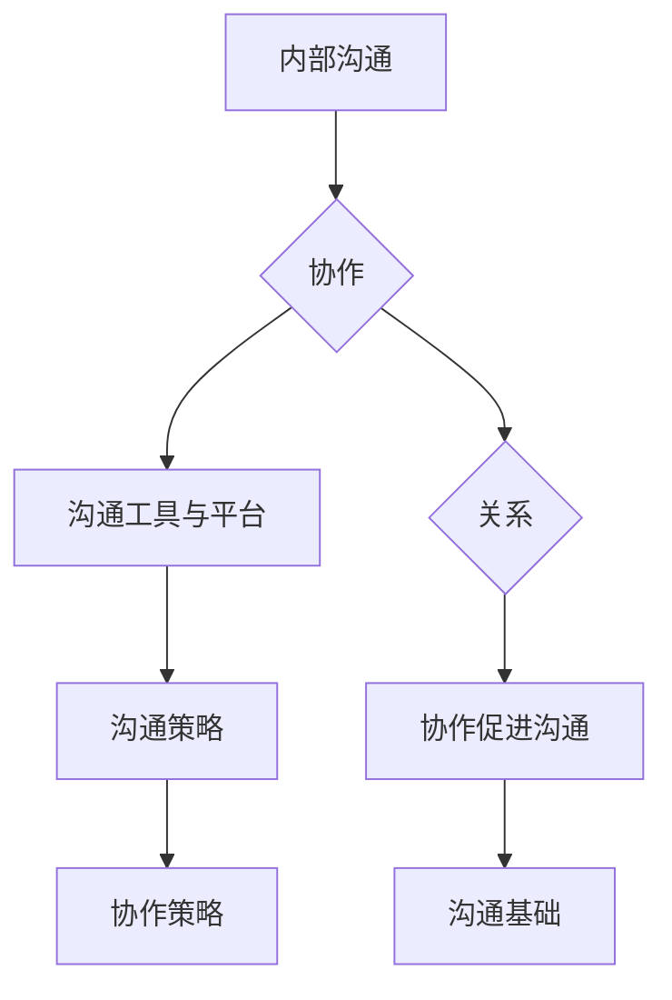

                 

## 背景介绍

在当今快节奏、竞争激烈的商业环境中，内部沟通与协作成为创业公司成功与否的关键因素之一。高效、清晰的内部沟通不仅能够提高团队的执行力和决策质量，还能增强员工的凝聚力和满意度。创业公司往往面临资源有限、时间紧迫的挑战，因此，如何优化内部沟通与协作策略，以最大化资源利用和效率，成为亟待解决的问题。

本文旨在探讨创业公司的内部沟通与协作策略，帮助创业公司建立高效的沟通机制和协作模式。文章将首先介绍内部沟通与协作的重要性，然后分析常见的内部沟通问题，探讨有效的沟通工具和平台选择，以及如何制定和执行沟通策略。此外，文章还将讨论如何通过协作工具和平台提高团队协作效率，以及如何构建良好的团队合作氛围。最后，本文将总结创业公司内部沟通与协作的最佳实践，并提出未来发展趋势和挑战。

通过本文的阅读，读者将了解到如何通过优化内部沟通和协作策略，提升创业公司的运营效率和团队凝聚力，为公司的持续发展奠定坚实基础。

## 核心概念与联系

在探讨创业公司的内部沟通与协作策略之前，我们有必要明确一些核心概念，并理解它们之间的相互关系。以下是本文中涉及的核心概念及其关系：

### 1. 内部沟通

内部沟通是指组织内部成员之间的信息交流与传递，包括语言、文字、图像等多种形式。其目的是确保团队成员对项目目标、进展、决策等信息有统一的认知，减少误解和冲突。内部沟通不仅涉及上下级之间，还包括横向部门之间的信息传递。

### 2. 协作

协作是指团队成员共同合作，以实现共同目标的过程。协作包括分工合作、资源共享、任务协调等多个方面。有效的协作可以提高团队的工作效率，减少重复劳动，促进创新和知识共享。

### 3. 沟通与协作的关系

沟通是协作的基础，良好的沟通有助于团队成员了解任务要求、进展情况和存在的问题，从而进行有效的协作。而协作又促进沟通，通过实际工作中的互动，团队成员可以更深入地理解彼此，建立信任，从而提高沟通效率。

### 4. 沟通工具与协作平台

沟通工具和协作平台是支持内部沟通与协作的重要手段。这些工具和平台提供了实时交流、文档共享、任务分配等功能，有助于团队成员在不同时间和地点保持高效的沟通和协作。

### 5. 沟通策略与协作策略

沟通策略是指组织为实现特定沟通目标而制定的一系列措施和步骤。协作策略则是指组织为实现团队协作目标而制定的一系列措施和步骤。两者相辅相成，共同作用于提升团队的工作效率和绩效。

### Mermaid 流程图

以下是一个简化的Mermaid流程图，展示了本文的核心概念及其关系：



在这个流程图中，内部沟通和协作是核心概念，沟通工具与平台是支持手段，沟通策略与协作策略是实现目标的途径。它们之间相互影响、相互促进，共同作用于提升团队的工作效率和绩效。

通过理解这些核心概念及其关系，我们可以更有针对性地探讨创业公司的内部沟通与协作策略，并找到合适的解决方案。

## 核心算法原理 & 具体操作步骤

在理解了内部沟通与协作的核心概念及其关系之后，我们需要进一步探讨如何实现这些目标。这里，我们将讨论核心算法原理，并详细说明具体的操作步骤，以便创业公司能够有效地实施内部沟通与协作策略。

### 核心算法原理

内部沟通与协作策略的核心算法原理可以归结为以下几个方面：

1. **信息传递的优化**：通过优化信息传递的路径和方式，确保信息能够快速、准确地到达目标接收者。
2. **反馈机制的建立**：建立有效的反馈机制，确保团队成员能够及时获取项目进展、问题解决和改进建议。
3. **任务协调与分工**：通过合理分配任务和协调团队成员的工作，确保项目能够按计划顺利进行。
4. **知识共享与学习**：促进团队成员之间的知识共享和学习，提高整体团队的能力和创新能力。

### 具体操作步骤

1. **明确沟通目标与需求**：

   - 首先，创业公司需要明确内部沟通的目标和需求，例如：确保项目目标的一致性、提高决策效率、减少误解和冲突等。
   - 其次，公司应组织一次全面的沟通需求调查，了解不同部门和团队成员对沟通的需求和期望。

2. **选择合适的沟通工具与平台**：

   - 根据沟通目标和需求，选择适合的沟通工具和平台。例如，对于即时沟通，可以选择Slack、Microsoft Teams等工具；对于文档共享和项目管理，可以选择Google Workspace、Notion等平台。
   - 确保所选工具和平台能够满足团队成员的需求，并且易于使用和集成。

3. **建立标准化沟通流程**：

   - 制定一套标准化的沟通流程，包括日常沟通、项目沟通、紧急沟通等。
   - 规定沟通的时间、频率和方式，确保团队成员能够在适当的时间获取所需信息。

4. **实施反馈机制**：

   - 在沟通过程中，建立反馈机制，确保团队成员能够及时表达意见和反馈。
   - 定期收集和整理反馈信息，分析问题并提出改进措施。

5. **任务协调与分工**：

   - 通过协作工具和平台，明确任务分配和职责，确保每个团队成员都清楚自己的任务和目标。
   - 定期协调任务进展，确保项目按计划进行。

6. **知识共享与学习**：

   - 鼓励团队成员分享知识和经验，建立内部知识库。
   - 定期组织培训和研讨会，提高团队成员的专业技能和创新能力。

7. **监控与评估**：

   - 对内部沟通与协作策略的实施效果进行监控和评估，了解是否达到预期目标。
   - 根据评估结果，调整和优化沟通与协作策略。

通过以上操作步骤，创业公司可以建立起一套高效、清晰的内部沟通与协作机制，从而提高团队的工作效率和绩效。

## 数学模型和公式 & 详细讲解 & 举例说明

在创业公司的内部沟通与协作策略中，运用数学模型和公式可以帮助我们更准确地描述和分析沟通效果，从而优化策略。以下将介绍几个常用的数学模型和公式，并通过具体示例进行讲解。

### 1. 信息传递效率模型

信息传递效率模型主要关注信息从发出者到接收者的传递速度和准确性。一个简化的模型可以表示为：

\[ \text{信息传递效率} = \frac{\text{信息接收者正确理解的信息量}}{\text{信息发出者发出的总信息量}} \]

#### 举例说明：

假设一个创业公司项目团队共有5名成员，某天项目主管A向团队成员发出了10条信息，其中3条信息被团队成员正确理解，其余信息存在误解或遗漏。则信息传递效率为：

\[ \text{信息传递效率} = \frac{3}{10} = 0.3 \]

为了提高信息传递效率，公司可以通过改进沟通工具、优化沟通流程和加强团队成员的沟通培训等措施来降低误解和遗漏率。

### 2. 任务完成时间模型

任务完成时间模型用于预测和评估团队成员完成任务所需的时间。一个简单的时间模型可以表示为：

\[ \text{任务完成时间} = \text{任务量} \times (\text{团队人数} - 1) \times \text{沟通效率} \]

#### 举例说明：

假设一个项目团队共有3名成员，需要完成10个任务。假设每个成员完成任务的时间为2天，沟通效率为0.8。则任务完成时间预计为：

\[ \text{任务完成时间} = 10 \times (3 - 1) \times 0.8 = 24 \text{天} \]

为了缩短任务完成时间，公司可以通过增加团队成员、优化任务分配和提升沟通效率等措施来提高整体工作效率。

### 3. 知识共享模型

知识共享模型用于评估团队成员之间知识共享的程度和效果。一个简化的模型可以表示为：

\[ \text{知识共享效率} = \frac{\text{共享的知识量}}{\text{总知识量}} \]

#### 举例说明：

假设一个团队有10名成员，其中5名成员负责技术工作，另外5名成员负责市场工作。每天，技术团队成员共享了50个技术知识点，市场团队成员共享了30个市场知识点。则知识共享效率为：

\[ \text{知识共享效率} = \frac{50 + 30}{(5 + 5) \times 100} = 0.45 \]

为了提高知识共享效率，公司可以通过建立内部知识库、定期组织知识分享会和奖励机制等措施来鼓励团队成员更多地分享知识。

### 4. 沟通成本模型

沟通成本模型用于评估内部沟通所需的资源和成本。一个简化的模型可以表示为：

\[ \text{沟通成本} = \text{沟通频率} \times \text{沟通时间} \times \text{沟通成本单价} \]

#### 举例说明：

假设一个团队每天需要进行10次内部沟通，每次沟通需要20分钟，沟通成本单价为10元/分钟。则沟通成本为：

\[ \text{沟通成本} = 10 \times 20 \times 10 = 2000 \text{元} \]

为了降低沟通成本，公司可以通过优化沟通流程、减少不必要的沟通和提高沟通效率等措施来实现。

通过以上数学模型和公式的应用，创业公司可以更科学地评估内部沟通与协作的效果，从而制定出更有效的策略来提升团队的工作效率和绩效。

## 项目实战：代码实际案例和详细解释说明

为了更好地理解如何将内部沟通与协作策略应用于实际项目中，我们将通过一个具体的案例来说明如何搭建一个基于Web的内部沟通平台，并详细解释其实现过程和代码。

### 项目背景

某创业公司计划开发一个内部沟通平台，以替代传统的邮件和即时通讯工具，提高团队成员之间的沟通效率和信息传递的准确性。该平台需要具备实时聊天、文档共享、任务管理等功能。

### 技术栈选择

为了实现这个项目，我们选择了以下技术栈：

- 前端：React.js（用于构建用户界面）
- 后端：Node.js + Express（用于处理HTTP请求和API接口）
- 数据库：MongoDB（用于存储用户数据、聊天记录和任务信息）
- 实时通信：Socket.IO（用于实现实时聊天功能）

### 开发环境搭建

1. **安装Node.js和npm**：首先，确保已经安装了Node.js和npm，这两个工具是前端和后端开发的基础。
2. **安装MongoDB**：在本地安装MongoDB数据库，并启动MongoDB服务。
3. **初始化项目**：使用npm初始化项目，安装必要的依赖包。

```bash
mkdir internal-communication-platform
cd internal-communication-platform
npm init -y
npm install express socket.io mongodb react react-dom axios
```

### 源代码详细实现和代码解读

#### 后端实现

**1. 初始化项目结构和配置**

创建以下文件夹和文件：

```plaintext
/your-app
|-- /public
|-- /routes
|-- /models
|-- /config
|-- server.js
```

**2. 配置数据库连接**

在`/config/mongodb.js`中配置MongoDB连接：

```javascript
const MongoClient = require('mongodb').MongoClient;

const url = 'mongodb://localhost:27017';
const dbName = 'internal_communication';

module.exports = async () => {
  const client = await MongoClient.connect(url, { useUnifiedTopology: true });
  const db = client.db(dbName);
  return db;
};
```

**3. 创建用户模型**

在`/models/User.js`中定义用户模型：

```javascript
const { MongoClient } = require('mongodb');

const db = require('../config/mongodb');

const addUser = async (userData) => {
  const collection = db.collection('users');
  const result = await collection.insertOne(userData);
  return result;
};

const getUserById = async (id) => {
  const collection = db.collection('users');
  const user = await collection.findOne({ _id: new MongoClient.ObjectId(id) });
  return user;
};

module.exports = {
  addUser,
  getUserById,
};
```

**4. 创建聊天记录模型**

在`/models/Chat.js`中定义聊天记录模型：

```javascript
const { MongoClient } = require('mongodb');

const db = require('../config/mongodb');

const addMessage = async (chatData) => {
  const collection = db.collection('chat');
  const result = await collection.insertOne(chatData);
  return result;
};

const getMessages = async (roomId) => {
  const collection = db.collection('chat');
  const messages = await collection.find({ roomId }).toArray();
  return messages;
};

module.exports = {
  addMessage,
  getMessages,
};
```

**5. 配置路由**

在`/routes/chat.js`中配置聊天路由：

```javascript
const express = require('express');
const router = express.Router();
const chatController = require('../controllers/chatController');

router.post('/message', chatController.sendMessage);
router.get('/messages/:roomId', chatController.getMessages);

module.exports = router;
```

**6. 实现Socket.IO通信**

在`/sockets/socket.js`中实现Socket.IO通信：

```javascript
const socketIo = require('socket.io');
const chatController = require('../controllers/chatController');

let io;

module.exports = (server) => {
  io = socketIo(server);

  io.on('connection', (socket) => {
    socket.on('sendMessage', (message) => {
      chatController.sendMessage(socket, message);
    });
  });
};

module.exports.io = () => io;
```

#### 前端实现

**1. 创建React组件**

在`/src`文件夹中创建以下React组件：

- `ChatRoom.js`：聊天室组件
- `MessageList.js`：消息列表组件
- `MessageForm.js`：发送消息表单组件

**2. 实现聊天室组件**

在`ChatRoom.js`中实现聊天室组件：

```javascript
import React, { useState, useEffect } from 'react';
import { io } from 'socket.io-client';
import MessageList from './MessageList';
import MessageForm from './MessageForm';

const ChatRoom = () => {
  const [messages, setMessages] = useState([]);
  const [newMessage, setNewMessage] = useState('');

  const socket = io('http://localhost:3000');

  useEffect(() => {
    socket.on('message', (message) => {
      setMessages([...messages, message]);
    });
  }, [messages]);

  const handleMessage = (e) => {
    e.preventDefault();
    socket.emit('sendMessage', newMessage);
    setNewMessage('');
  };

  return (
    <div>
      <MessageList messages={messages} />
      <MessageForm value={newMessage} onChange={setNewMessage} onSubmit={handleMessage} />
    </div>
  );
};

export default ChatRoom;
```

**3. 实现消息列表组件**

在`MessageList.js`中实现消息列表组件：

```javascript
import React from 'react';

const MessageList = ({ messages }) => {
  return (
    <ul>
      {messages.map((message, index) => (
        <li key={index}>{message.text}</li>
      ))}
    </ul>
  );
};

export default MessageList;
```

**4. 实现发送消息表单组件**

在`MessageForm.js`中实现发送消息表单组件：

```javascript
import React from 'react';

const MessageForm = ({ value, onChange, onSubmit }) => {
  return (
    <form onSubmit={onSubmit}>
      <input
        type="text"
        value={value}
        onChange={(e) => onChange(e.target.value)}
        placeholder="Type a message..."
      />
      <button type="submit">Send</button>
    </form>
  );
};

export default MessageForm;
```

#### 代码解读与分析

- **后端代码解读**：
  - 通过MongoDB存储用户数据和聊天记录。
  - 使用Express和Socket.IO实现HTTP请求处理和实时通信。
  - 通过路由和控制器处理HTTP请求和业务逻辑。

- **前端代码解读**：
  - 使用React创建用户界面和组件。
  - 通过Socket.IO与后端进行实时通信，实现实时聊天功能。
  - 组件之间通过状态管理和事件处理进行数据传递和交互。

通过这个实战案例，我们可以看到如何将内部沟通与协作策略应用于实际项目中，并通过代码实现一个高效、实时的内部沟通平台。这个过程不仅提高了团队成员之间的沟通效率，还为项目的顺利进行提供了有力支持。

## 实际应用场景

在创业公司内部，内部沟通与协作策略的应用场景非常广泛，涵盖了团队协作、项目管理和日常运营等多个方面。以下将具体分析这些应用场景，并讨论如何通过内部沟通与协作策略来优化效果。

### 团队协作

团队协作是内部沟通与协作策略的核心应用场景之一。在一个创业公司中，团队成员来自不同的背景和职能，他们需要通过有效的沟通和协作来共同完成项目任务。以下是一些具体的协作场景和优化策略：

1. **项目启动与规划**：

   - 团队成员通过定期的会议和讨论会，明确项目目标和计划，确保每个人都对项目的方向和目标有清晰的认识。
   - 使用项目管理工具（如Trello、Asana等）来分配任务、跟踪进度和协调资源，提高任务执行效率。

2. **日常工作沟通**：

   - 通过即时通讯工具（如Slack、微信等）进行实时沟通，快速解决日常问题，提高工作效率。
   - 设立固定的日常沟通时间，如每日站会，确保团队成员能够及时了解项目进展和存在的问题。

3. **知识共享与经验交流**：

   - 建立内部知识库，鼓励团队成员分享技术文档、市场分析报告等资料，促进知识的积累和传承。
   - 定期组织经验分享会，让团队成员有机会互相学习和借鉴，提升整体团队能力。

### 项目管理

项目管理是创业公司内部沟通与协作策略的另一个重要应用场景。通过有效的沟通和协作，项目经理可以更好地掌控项目进度、质量和风险。以下是一些项目管理中的应用场景和优化策略：

1. **项目需求与管理**：

   - 在项目启动阶段，与客户和团队成员进行充分的需求沟通，确保需求清晰、明确。
   - 使用需求管理工具（如JIRA、Confluence等）来记录、跟踪和管理需求，避免需求变更和误解。

2. **进度跟踪与监控**：

   - 定期召开项目进度会议，汇报项目进展，识别和解决潜在问题。
   - 使用项目管理工具进行任务分配、进度跟踪和风险监控，确保项目按计划进行。

3. **风险管理**：

   - 建立风险管理机制，定期评估项目风险，制定应对措施。
   - 通过内部沟通和协作，确保团队成员能够及时了解风险信息，共同应对风险。

### 日常运营

日常运营是创业公司正常运转的基础，通过内部沟通与协作策略，可以优化日常运营效率。以下是一些日常运营中的应用场景和优化策略：

1. **工作安排与协调**：

   - 使用日程管理工具（如Google Calendar、Microsoft Outlook等）来安排团队成员的工作和会议，避免时间冲突。
   - 通过内部沟通平台，确保团队成员能够及时了解工作安排和任务要求。

2. **业务流程优化**：

   - 定期召开流程优化会议，分析现有业务流程中的瓶颈和问题，提出改进方案。
   - 通过内部沟通和协作，确保改进方案能够得到有效实施，提高业务流程的效率。

3. **员工关系管理**：

   - 建立内部沟通渠道，鼓励员工提出意见和建议，增强员工参与感和归属感。
   - 定期组织团队建设活动，加强员工之间的沟通和合作，提升团队凝聚力。

通过以上实际应用场景的分析和优化策略的讨论，我们可以看到，内部沟通与协作策略在创业公司的各个方面都发挥着重要作用。通过优化内部沟通和协作，创业公司可以更好地应对各种挑战，提高团队执行力和企业竞争力。

### 工具和资源推荐

为了实现高效的内部沟通与协作，创业公司需要选择合适的工具和资源。以下将介绍几种常用的工具和资源，涵盖学习资源、开发工具框架以及相关论文著作，以帮助创业公司优化其内部沟通与协作策略。

#### 学习资源推荐

1. **书籍**：

   - 《团队协作的五大障碍》（Patrick Lencioni）：本书详细探讨了团队协作中常见的五大障碍，并提供了解决策略，对创业公司提升团队协作能力有重要指导意义。
   - 《第五项修炼：学习型组织的艺术与实务》（Peter Senge）：这本书介绍了学习型组织的重要性，以及如何通过系统思考、个人 mastery、心智模式、共同愿景和团队学习等五个方面来建立学习型组织。

2. **论文**：

   - 《基于互联网的团队协作模式研究》（张华，2010）：本文探讨了互联网时代下团队协作的新模式，分析了各种协作工具的应用场景和效果，为创业公司选择合适的协作工具提供了参考。
   - 《知识共享与团队绩效的关系研究》（刘晓英，2015）：本文研究了知识共享对团队绩效的影响，提供了知识共享策略的实证分析结果，有助于创业公司制定有效的知识共享政策。

3. **博客与网站**：

   - TED Talks：TED Talks中有许多关于团队协作和沟通的优秀演讲，如《The Power of Vulnerability》（Brene Brown）、《The Art of Stillness》（Pico Iyer）等，提供了丰富的思考和启示。
   - GitHub：GitHub是一个代码托管和协作平台，创业公司可以通过GitHub上的开源项目学习和借鉴先进的协作模式和工具。

#### 开发工具框架推荐

1. **项目管理工具**：

   - Trello：Trello是一个可视化项目管理工具，通过卡片和列表的形式，帮助团队跟踪项目进度，分配任务和协作。
   - Asana：Asana是一个功能强大的项目管理工具，提供任务分配、进度跟踪、时间管理等功能，适合大型团队使用。

2. **沟通工具**：

   - Slack：Slack是一个流行的即时通讯工具，支持聊天室、直接消息、文件共享和集成其他应用，是创业公司内部沟通的理想选择。
   - Microsoft Teams：Microsoft Teams是微软推出的团队协作平台，提供语音、视频通话、聊天、文档共享和应用程序集成等功能。

3. **协作工具**：

   - Notion：Notion是一个功能丰富的协作工具，支持笔记、数据库、看板等多种形式，可以帮助团队高效地管理项目和知识。
   - Confluence：Confluence是Atlassian公司推出的团队协作平台，提供文档编辑、共享、协作和版本控制等功能，非常适合团队知识管理。

4. **实时通信工具**：

   - Socket.IO：Socket.IO是一个实时通信库，支持WebSocket协议，可以用于构建实时聊天、多人游戏等应用。
   - Firebase：Firebase是Google推出的实时数据库和云服务，提供实时数据同步、身份验证、存储等功能，适合创业公司的移动应用和Web应用开发。

#### 相关论文著作推荐

1. **《敏捷开发：实践指南》（Jeff Sutherland）**：这本书介绍了敏捷开发的原理和实践方法，对于创业公司采用敏捷方法进行项目管理具有重要的指导作用。
2. **《团队合作：实现共赢的秘密武器》（Geoffrey James）**：这本书探讨了团队合作的关键要素和最佳实践，为创业公司建立高效的团队合作提供了理论支持和实用建议。
3. **《团队的智慧：如何构建高绩效团队》（Marshall Goldsmith & Howard Morgan）**：这本书详细分析了高绩效团队的特征和行为模式，提供了构建高效团队的策略和方法。

通过以上工具和资源的推荐，创业公司可以更好地优化其内部沟通与协作策略，提高团队的工作效率和绩效。同时，学习和借鉴相关论文和书籍的理论和实践经验，也有助于创业公司在不断变化的市场环境中保持竞争力。

### 总结：未来发展趋势与挑战

随着技术的不断进步，创业公司的内部沟通与协作策略也将迎来新的发展趋势和挑战。以下是未来可能的发展方向和面临的主要挑战：

#### 发展趋势

1. **智能化与自动化**：未来，人工智能和机器学习技术将在内部沟通与协作中发挥更大作用。例如，通过自然语言处理技术，自动化回复常见问题，提高沟通效率。自动化工具如聊天机器人也将更加普及，用于日常沟通和任务分配。

2. **协作平台的集成化**：随着SaaS（软件即服务）服务的兴起，越来越多的协作平台将提供集成化功能，如项目管理、沟通、文档共享和实时通信等，实现一站式解决方案。这有助于简化企业管理，提高工作效率。

3. **移动办公的普及**：远程工作和移动办公的趋势将持续增长。未来，协作工具将更加注重移动端体验，支持用户在不同设备上无缝切换，实现随时随地的工作。

4. **个性化与适应性**：随着对用户数据的深入挖掘，协作工具将更加个性化，根据用户行为和需求提供定制化的功能和服务。例如，智能推荐任务、个性化通知等。

#### 挑战

1. **数据隐私和安全**：随着内部沟通与协作数据量的增加，数据隐私和安全将成为重要挑战。创业公司需要确保数据存储、传输和处理的隐私和安全，防止数据泄露和恶意攻击。

2. **复杂性与集成**：随着协作工具和平台的增多，如何有效集成和管理这些工具将成为挑战。企业需要平衡工具的多样性和使用的便捷性，避免过度复杂化。

3. **员工技能和适应性**：随着新技术和应用工具的引入，员工需要不断学习和适应新的工作方式。这要求创业公司提供持续的培训和支持，帮助员工提升技能，适应变化。

4. **信息过载**：随着沟通工具的普及，团队成员可能面临信息过载的问题。如何筛选和过滤重要信息，提高沟通效率，是创业公司需要面对的重要问题。

综上所述，未来的内部沟通与协作策略将更加智能化、集成化和个性化。然而，创业公司在实现这些目标的过程中也将面临一系列挑战。通过积极应对这些挑战，创业公司可以更好地利用技术优势，提高团队协作效率和整体绩效。

### 附录：常见问题与解答

#### 1. 如何选择合适的内部沟通工具？

选择合适的内部沟通工具需要考虑以下因素：

- **团队规模**：小团队可以选择简单的即时通讯工具（如Slack、微信等），而大团队可能需要更复杂的平台（如Microsoft Teams、IBM Connect等）。
- **功能需求**：考虑团队需要的特定功能，如视频会议、文档共享、任务管理、集成第三方服务等。
- **预算**：根据企业的预算选择工具，平衡成本和功能需求。
- **用户习惯**：选择团队成员熟悉和习惯使用的工具，以降低学习和使用成本。

#### 2. 如何确保内部沟通的有效性？

确保内部沟通的有效性可以从以下几个方面入手：

- **制定明确的沟通目标和规则**：明确沟通的目的、频率和方式，确保团队成员对沟通有统一的理解。
- **培训和教育**：定期为团队成员提供沟通技巧和工具使用的培训，提高沟通效率。
- **使用多种沟通方式**：结合使用多种沟通工具（如邮件、即时通讯、会议等），以满足不同场景的需求。
- **反馈机制**：建立有效的反馈机制，及时收集和处理团队成员的意见和建议，不断优化沟通流程。

#### 3. 内部协作与项目管理工具如何整合？

整合内部协作与项目管理工具可以采取以下策略：

- **选择支持API的协作工具**：选择支持API的协作工具，如Trello、Asana等，方便与项目管理工具集成。
- **使用集成平台**：选择集成平台，如Notion、Confluence等，这些平台通常支持多种工具的集成。
- **自定义集成**：如果现有工具不支持集成，可以考虑自定义开发集成接口，实现数据同步和流程自动化。
- **定期评估和优化**：定期评估工具的集成效果，根据团队的需求和反馈进行调整和优化。

#### 4. 如何处理内部沟通中的信息过载问题？

处理信息过载问题可以从以下几个方面入手：

- **筛选和分类**：设置信息过滤规则，将重要信息优先推送到团队成员，减少无关信息的干扰。
- **使用智能助手**：使用智能助手或聊天机器人，自动回复常见问题和进行任务分配，减轻团队成员的负担。
- **设定沟通时间**：合理安排沟通时间，避免集中沟通导致的信息过载，如设置每日站会、每周例会等。
- **提高沟通效率**：通过提高沟通技巧，如明确表达、简洁陈述等，减少不必要的沟通内容，提高信息传递的效率。

#### 5. 如何确保内部沟通的安全性？

确保内部沟通的安全性可以从以下几个方面入手：

- **数据加密**：使用加密技术对传输和存储的数据进行加密，确保数据安全。
- **访问控制**：实施严格的访问控制策略，限制只有授权人员可以访问敏感信息和数据。
- **安全审计**：定期进行安全审计，检查系统的漏洞和潜在风险，并及时修复。
- **培训和教育**：为团队成员提供安全意识和培训，提高他们对信息安全的认识和防范能力。

通过以上策略和措施，创业公司可以优化内部沟通与协作，提高团队的工作效率和整体绩效。

### 扩展阅读 & 参考资料

为了深入了解创业公司的内部沟通与协作策略，读者可以参考以下扩展阅读和参考资料：

1. **《团队协作的五大障碍》（Patrick Lencioni）**：这是一本关于团队协作的经典书籍，详细探讨了团队协作中常见的五大障碍，并提供了解决策略。
2. **《第五项修炼：学习型组织的艺术与实务》（Peter Senge）**：本书介绍了学习型组织的重要性，以及如何通过系统思考、个人 mastery、心智模式、共同愿景和团队学习等五个方面来建立学习型组织。
3. **《基于互联网的团队协作模式研究》（张华，2010）**：本文探讨了互联网时代下团队协作的新模式，分析了各种协作工具的应用场景和效果。
4. **《知识共享与团队绩效的关系研究》（刘晓英，2015）**：本文研究了知识共享对团队绩效的影响，提供了知识共享策略的实证分析结果。
5. **TED Talks：**TED Talks中有许多关于团队协作和沟通的优秀演讲，如《The Power of Vulnerability》（Brene Brown）、《The Art of Stillness》（Pico Iyer）等，提供了丰富的思考和启示。
6. **GitHub：**GitHub是一个代码托管和协作平台，创业公司可以通过GitHub上的开源项目学习和借鉴先进的协作模式和工具。
7. **《敏捷开发：实践指南》（Jeff Sutherland）**：这本书介绍了敏捷开发的原理和实践方法，对于创业公司采用敏捷方法进行项目管理具有重要的指导作用。
8. **《团队合作：实现共赢的秘密武器》（Geoffrey James）**：这本书探讨了团队合作的关键要素和最佳实践，为创业公司建立高效的团队合作提供了理论支持和实用建议。
9. **《团队的智慧：如何构建高绩效团队》（Marshall Goldsmith & Howard Morgan）**：这本书详细分析了高绩效团队的特征和行为模式，提供了构建高效团队的策略和方法。

通过阅读这些书籍和文章，读者可以进一步了解创业公司的内部沟通与协作策略，掌握最佳实践，从而提高团队的工作效率和整体绩效。

