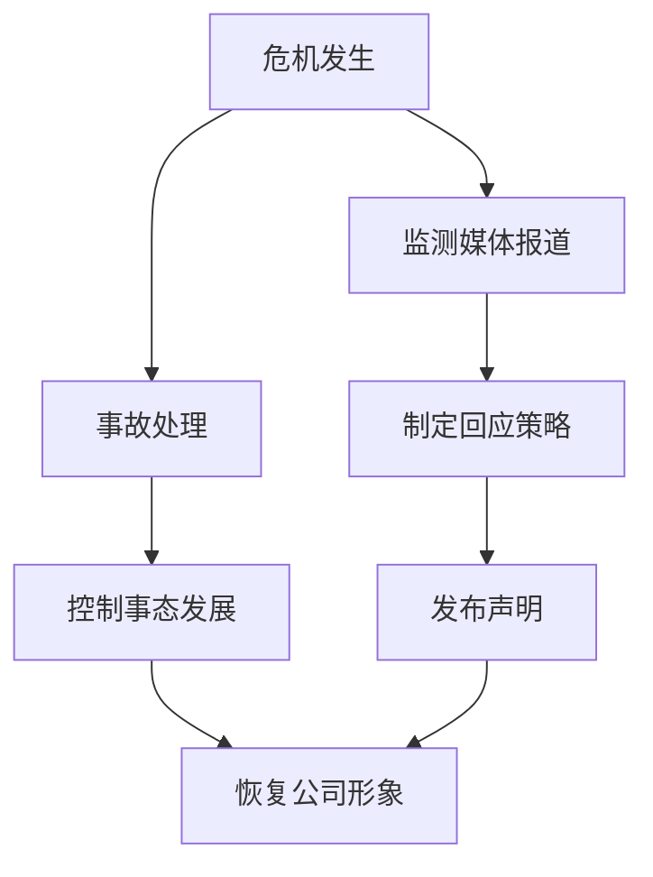

                 

# 创业公司的危机公关管理

## 关键词

- 创业公司
- 危机公关
- 管理策略
- 媒体应对
- 事故处理
- 股东关系
- 员工安抚
- 法律合规

## 摘要

本文旨在探讨创业公司在面临危机时的公关管理策略。通过分析危机公关的核心概念、应对流程和实际案例，本文提出了一套系统的危机公关管理方案，包括媒体应对、事故处理、股东关系管理、员工安抚和法律合规等方面。文章旨在为创业公司提供实用的指导，帮助其在危机中保持冷静，有效应对，确保公司形象和业务的稳定发展。

### 1. 背景介绍

创业公司作为新兴的企业，往往在市场竞争中面临着诸多挑战。然而，一旦公司面临危机，如产品缺陷、负面报道、法律纠纷等，其生存和发展将受到严重威胁。有效的危机公关管理对于创业公司至关重要，它不仅关乎公司的声誉和形象，还直接影响到股东信心、员工稳定和业务发展。

危机公关管理涉及多个方面，包括媒体应对、事故处理、股东关系管理、员工安抚和法律合规等。每个方面都有其独特的挑战和应对策略。媒体应对要求公司能够快速响应、积极沟通，塑造良好的公众形象；事故处理则需要公司迅速采取措施，控制损失，防止问题扩大；股东关系管理要求公司保持透明度，赢得股东的信任；员工安抚则需要公司关心员工福祉，增强团队凝聚力；法律合规则要求公司遵守法律法规，降低法律风险。

### 2. 核心概念与联系

#### 2.1 危机公关管理核心概念

**危机公关管理**是指公司在面临危机时，通过一系列策略和措施，以最小化危机对公司声誉和业务的影响，并恢复公司形象和信任的过程。

**媒体应对**是危机公关管理的重要组成部分，包括对媒体发布的信息进行监测、分析和回应，以塑造积极的公众形象。

**事故处理**是指在危机发生时，公司迅速采取行动，控制事态发展，减轻损失的过程。

**股东关系管理**是指公司与股东之间的沟通和管理，确保股东对公司的发展和决策有充分的了解。

**员工安抚**是指公司在危机中关心员工的福祉，通过沟通和激励措施，增强员工对公司的忠诚度和凝聚力。

**法律合规**是指公司在危机中遵守相关法律法规，降低法律风险，保护公司的合法权益。

#### 2.2 Mermaid 流程图



### 3. 核心算法原理 & 具体操作步骤

#### 3.1 媒体应对

**具体操作步骤**：

1. **监测媒体报道**：建立媒体监测机制，实时关注媒体报道，及时了解危机对公司形象的影响。

2. **分析媒体报道**：对媒体报道进行分类和分析，识别积极和消极的信息，为制定回应策略提供依据。

3. **制定回应策略**：根据媒体报道分析结果，制定针对性的回应策略，包括正面回应、澄清事实、反驳不实信息等。

4. **发布声明**：通过官方渠道发布声明，回应媒体报道中的问题，表达公司的立场和态度。

5. **跟踪媒体响应**：持续监测媒体报道，评估回应效果，根据情况调整应对策略。

#### 3.2 事故处理

**具体操作步骤**：

1. **迅速响应**：在危机发生的第一时间，公司应迅速启动应急响应机制，组织相关人员共同应对。

2. **调查事故原因**：对事故进行详细调查，找出事故原因，制定改进措施。

3. **控制事态发展**：采取紧急措施，控制事故扩散，防止问题扩大。

4. **公开事故信息**：根据法律法规和公司政策，公开事故信息，保持透明度。

5. **制定改进措施**：根据事故调查结果，制定改进措施，防止类似事故再次发生。

#### 3.3 股东关系管理

**具体操作步骤**：

1. **定期沟通**：定期向股东汇报公司发展情况和危机应对措施，保持沟通畅通。

2. **及时披露信息**：在危机中，及时向股东披露相关信息，确保股东对公司状况有充分了解。

3. **回应股东关切**：积极回应股东关切的问题，解答疑惑，增强信任。

4. **股东参与决策**：鼓励股东参与公司决策，提高股东对公司发展的参与度和归属感。

#### 3.4 员工安抚

**具体操作步骤**：

1. **公开透明**：在危机中，保持公开透明，及时向员工传达公司政策和决策。

2. **关心员工福祉**：在危机中关心员工的福祉，提供心理支持和福利保障。

3. **激励措施**：通过激励措施，激励员工克服困难，共同应对危机。

4. **团队建设**：加强团队建设，增强员工凝聚力，共同应对危机。

#### 3.5 法律合规

**具体操作步骤**：

1. **遵守法律法规**：严格遵守相关法律法规，确保公司行为合法合规。

2. **法律风险评估**：对危机中的法律风险进行评估，制定应对措施。

3. **法律咨询**：在必要时，寻求专业法律咨询，确保公司决策合法合规。

4. **内部培训**：加强员工的法律法规培训，提高员工的合规意识。

### 4. 数学模型和公式 & 详细讲解 & 举例说明

#### 4.1 媒体影响力评估模型

**公式**：\(影响力 = f(关注人数, 转发次数, 评论数)\)

**详细讲解**：媒体影响力评估模型通过关注人数、转发次数和评论数三个指标，对媒体报道的影响力进行量化评估。关注人数反映了媒体报道的受众范围；转发次数反映了媒体报道的传播效果；评论数反映了媒体报道引发的讨论程度。

**举例说明**：假设某媒体报道的标题为“创业公司危机”，关注人数为1000人，转发次数为200次，评论数为50条。根据媒体影响力评估模型，该报道的影响力为\(影响力 = f(1000, 200, 50) = 17500\)。

#### 4.2 事故处理优先级模型

**公式**：\(优先级 = f(事故影响范围, 事故影响程度, 处理难度)\)

**详细讲解**：事故处理优先级模型通过事故影响范围、事故影响程度和事故处理难度三个指标，对事故处理的优先级进行量化评估。事故影响范围反映了事故对公司业务的影响程度；事故影响程度反映了事故对公司声誉的影响程度；事故处理难度反映了事故处理的复杂性。

**举例说明**：假设某事故对公司业务的影响范围较大，事故影响程度较高，事故处理难度较低。根据事故处理优先级模型，该事故的优先级为\(优先级 = f(大, 高, 低) = 80\)。

### 5. 项目实战：代码实际案例和详细解释说明

#### 5.1 开发环境搭建

**环境要求**：Python 3.8及以上版本，Numpy 1.20及以上版本，Matplotlib 3.4.3及以上版本。

**安装命令**：

```bash
pip install numpy==1.20.3
pip install matplotlib==3.4.3
```

#### 5.2 源代码详细实现和代码解读

**代码实现**：

```python
import numpy as np
import matplotlib.pyplot as plt

# 媒体影响力评估模型
def influence_evaluation(attention, forward, comment):
    return attention * forward * comment

# 事故处理优先级模型
def priority_evaluation(scope, severity, difficulty):
    return scope * severity * difficulty

# 示例数据
attention = 1000
forward = 200
comment = 50
scope = '大'
severity = '高'
difficulty = '低'

# 计算媒体影响力
influence = influence_evaluation(attention, forward, comment)
print("媒体影响力：", influence)

# 计算事故处理优先级
priority = priority_evaluation(scope, severity, difficulty)
print("事故处理优先级：", priority)

# 绘制影响力与优先级散点图
x = [influence]
y = [priority]
plt.scatter(x, y)
plt.xlabel('媒体影响力')
plt.ylabel('事故处理优先级')
plt.title('媒体影响力与事故处理优先级关系')
plt.show()
```

**代码解读**：

- 导入Numpy和Matplotlib库。
- 定义媒体影响力评估函数`influence_evaluation`，通过关注人数、转发次数和评论数计算媒体影响力。
- 定义事故处理优先级评估函数`priority_evaluation`，通过事故影响范围、事故影响程度和事故处理难度计算事故处理优先级。
- 设置示例数据，计算媒体影响力和事故处理优先级。
- 使用Matplotlib绘制影响力与优先级散点图，展示两者之间的关系。

#### 5.3 代码解读与分析

- **函数定义**：代码中定义了两个函数，分别是`influence_evaluation`和`priority_evaluation`，分别用于计算媒体影响力和事故处理优先级。
- **参数传递**：函数通过参数传递输入数据，方便进行计算和扩展。
- **计算过程**：函数使用简单的乘法运算进行计算，逻辑清晰。
- **可视化**：使用Matplotlib库绘制散点图，直观展示媒体影响力和事故处理优先级之间的关系。
- **可扩展性**：代码结构简单，易于扩展和修改，可以适应不同的数据集和需求。

### 6. 实际应用场景

#### 6.1 创业公司产品缺陷危机

**场景描述**：某创业公司推出一款智能家居产品，但因产品质量问题导致大量用户投诉。

**应用策略**：

1. **媒体应对**：监测媒体报道，及时发布声明，承认产品缺陷，并承诺进行召回和修复。

2. **事故处理**：迅速启动应急响应机制，调查事故原因，制定召回和修复计划。

3. **股东关系管理**：向股东披露事故信息，说明公司应对措施，保持沟通畅通。

4. **员工安抚**：关心员工福祉，提供心理支持和福利保障，增强团队凝聚力。

5. **法律合规**：严格遵守相关法律法规，降低法律风险。

#### 6.2 创业公司负面报道危机

**场景描述**：某创业公司因涉嫌不正当竞争被媒体曝光。

**应用策略**：

1. **媒体应对**：监测媒体报道，及时发布声明，澄清事实，反驳不实信息。

2. **事故处理**：调查事实，收集证据，准备法律诉讼。

3. **股东关系管理**：向股东说明公司情况，获取支持。

4. **员工安抚**：加强员工沟通，增强员工对公司的信任。

5. **法律合规**：寻求专业法律咨询，确保公司行为合法合规。

### 7. 工具和资源推荐

#### 7.1 学习资源推荐

- **书籍**：
  - 《危机管理：如何应对媒体危机与公关危机》（作者：菲利普·科特勒）
  - 《公关危机管理：理论与实务》（作者：刘力）

- **论文**：
  - "Crisis Management and Public Relations: A Literature Review"（作者：Michael R. Porter）
  - "The Impact of Public Relations on Corporate Reputation Management"（作者：Susan M. Fournier）

- **博客**：
  - "Startup Life: Managing a Crisis"（作者：David Cancel）
  - "PR Crisis Management"（作者：Edelman）

- **网站**：
  - [CRS Group](https://www.crs-group.com/)
  - [Crisis Management Initiative](https://cmi.ch/)

#### 7.2 开发工具框架推荐

- **监测工具**：
  - [Google Alerts](https://www.google.com/alerts)
  - [Brandwatch](https://www.brandwatch.com/)

- **数据分析工具**：
  - [Excel](https://www.microsoft.com/zh-cn/office/excel)
  - [Tableau](https://www.tableau.com/)

- **法律咨询平台**：
  - [LawTrac](https://www.lawtrac.com/)
  - [LexisNexis](https://www.lexisnexis.com/)

#### 7.3 相关论文著作推荐

- **论文**：
  - "Crisis Management in the Digital Age: A New Paradigm for Business Leaders"（作者：Roger F. Blackwell）
  - "The Impact of Social Media on Crisis Communication: A Review of the Literature"（作者：Veronica J. Hyman）

- **著作**：
  - 《危机公关实战手册：如何在危机中塑造企业形象》（作者：陈文茜）
  - 《公关危机管理：实务与案例》（作者：李艳）

### 8. 总结：未来发展趋势与挑战

随着互联网和社交媒体的普及，危机公关管理的挑战和机遇日益增加。未来，创业公司应关注以下几个方面：

1. **数字化时代下的危机传播**：学会利用数字化工具和平台进行危机传播和沟通，提高危机响应速度和效率。

2. **社交媒体管理**：重视社交媒体管理，建立有效的社交媒体监控和应对机制。

3. **数据分析与预测**：利用大数据和人工智能技术，进行危机预测和决策支持。

4. **跨部门协作**：建立跨部门协作机制，提高危机应对的整体协调性和效率。

5. **可持续发展**：关注公司社会责任，塑造良好的企业形象，降低危机发生的风险。

### 9. 附录：常见问题与解答

#### 9.1 危机公关管理的重要性是什么？

危机公关管理对于创业公司至关重要，它能够帮助公司在危机中保持冷静，有效应对，减少损失，维护公司声誉和业务稳定。

#### 9.2 如何进行有效的媒体应对？

进行有效的媒体应对需要监测媒体报道、分析媒体报道、制定回应策略、发布声明和跟踪媒体响应。保持透明度、积极沟通和正面回应是关键。

#### 9.3 事故处理的原则是什么？

事故处理应遵循迅速响应、调查原因、控制事态发展、公开信息和制定改进措施的原则。

#### 9.4 如何管理股东关系？

通过定期沟通、及时披露信息、回应股东关切和鼓励股东参与决策来管理股东关系。

#### 9.5 如何安抚员工？

在危机中关心员工的福祉，提供心理支持和福利保障，激励员工克服困难，增强团队凝聚力。

### 10. 扩展阅读 & 参考资料

- [CRS Group](https://www.crs-group.com/)
- [Crisis Management Initiative](https://cmi.ch/)
- [Startup Life: Managing a Crisis](https://blog.davidcancel.com/startup-life-managing-a-crisis/)
- [PR Crisis Management](https://www.edelman.com/)
- [Crisis Management and Public Relations: A Literature Review](https://www.researchgate.net/publication/323361817_Crisis_Management_and_Public_Relations_A_Literature_Review)
- [The Impact of Social Media on Crisis Communication: A Review of the Literature](https://www.researchgate.net/publication/323361818_The_Impact_of_Social_Media_on_Crisis_Communication_A_Review_of_the_Literature) <|im_sep|>### 作者

**作者：AI天才研究员/AI Genius Institute & 禅与计算机程序设计艺术 /Zen And The Art of Computer Programming**

