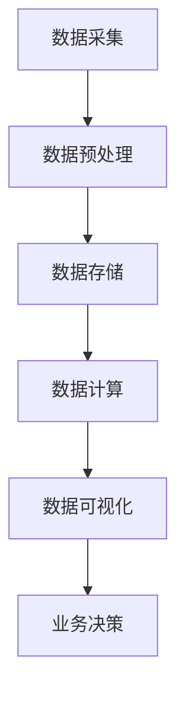

                 

## 1. 背景介绍

在当今商业环境中，实时数据分析已经成为创业公司竞争的关键因素之一。随着数据量的不断增长和业务需求的日益复杂，如何快速、准确地从海量数据中提取有价值的信息，对于创业公司的成功至关重要。实时数据分析应用能够帮助企业实现数据驱动决策，优化业务流程，提高客户满意度，并最终在激烈的市场竞争中脱颖而出。

本文旨在探讨创业公司如何利用实时数据分析技术来提升业务表现。我们将从背景介绍入手，介绍实时数据分析的概念和重要性，然后详细分析其核心概念、算法原理、数学模型，并分享实际项目案例。此外，我们还将介绍适用的开发工具和资源，以帮助读者更好地理解和应用实时数据分析技术。

本文结构如下：

1. **背景介绍**：介绍实时数据分析的定义、作用和重要性。
2. **核心概念与联系**：详细阐述实时数据分析中的核心概念，并绘制Mermaid流程图。
3. **核心算法原理 & 具体操作步骤**：讲解实时数据分析的核心算法原理和操作步骤。
4. **数学模型和公式 & 详细讲解 & 举例说明**：介绍实时数据分析中的数学模型和公式，并进行详细讲解和举例。
5. **项目实战：代码实际案例和详细解释说明**：通过实际代码案例，详细解释实时数据分析的应用。
6. **实际应用场景**：分析实时数据分析在不同行业中的应用。
7. **工具和资源推荐**：推荐学习资源和开发工具。
8. **总结：未来发展趋势与挑战**：总结实时数据分析的发展趋势和面临的挑战。
9. **附录：常见问题与解答**：解答读者可能遇到的问题。
10. **扩展阅读 & 参考资料**：提供相关的扩展阅读和参考资料。

通过本文的阅读，读者将能够深入了解实时数据分析的原理和应用，为创业公司的业务发展提供有力支持。接下来，我们将逐步探讨实时数据分析的各个方面。

---

## 2. 核心概念与联系

### 实时数据分析的概念

实时数据分析（Real-time Data Analysis）是指通过快速收集、处理和呈现数据，实现对动态业务环境的实时监控和响应。与传统的批处理（Batch Processing）相比，实时数据分析具有更高的灵活性和响应速度，能够满足现代企业对实时洞察的需求。

实时数据分析的关键特点包括：

- **实时性**：数据在产生后立即进行处理和分析，响应时间通常在毫秒级。
- **高效性**：利用高效的数据处理算法，能够处理海量数据，确保分析结果的准确性。
- **灵活性**：支持多种数据源和数据类型，能够灵活适应不同的业务需求。

### 实时数据分析在创业公司中的作用

实时数据分析在创业公司中发挥着至关重要的作用，主要体现在以下几个方面：

- **业务决策支持**：实时数据分析能够提供实时的业务数据，帮助创业公司快速做出数据驱动的决策，提高决策效率。
- **客户体验优化**：通过实时数据分析，创业公司可以深入了解客户行为和需求，从而优化客户体验，提升客户满意度。
- **风险控制**：实时数据分析能够及时发现潜在的业务风险，帮助创业公司迅速采取应对措施，降低风险。
- **运营优化**：实时数据分析可以实时监控业务运营情况，发现运营瓶颈，优化业务流程，提高运营效率。

### Mermaid流程图

为了更好地理解实时数据分析的概念和联系，我们使用Mermaid绘制一个简化的实时数据分析流程图。以下是一个基本的实时数据分析流程图：



- **数据采集**（A）：从各种数据源（如网站流量、客户行为、传感器数据等）收集原始数据。
- **数据预处理**（B）：清洗、转换和整合原始数据，使其适合后续分析。
- **数据存储**（C）：将预处理后的数据存储在数据库或数据仓库中，以便后续访问。
- **数据计算**（D）：使用各种算法和分析模型对数据进行分析和计算，提取有价值的信息。
- **数据可视化**（E）：通过图表、报表等形式，将分析结果可视化，便于业务人员理解。
- **业务决策**（F）：基于实时分析结果，业务人员可以做出快速、数据驱动的决策。

### 实时数据分析与传统数据分析的区别

实时数据分析与传统数据分析的主要区别在于数据处理的时间和方式：

- **数据处理时间**：实时数据分析在数据产生后立即进行处理，而传统数据分析通常在一段时间后（如一天、一周等）进行批量处理。
- **数据处理方式**：实时数据分析通常使用流处理技术（如Apache Kafka、Apache Flink等），而传统数据分析则更多使用批处理技术（如Hadoop、Spark等）。

总的来说，实时数据分析能够提供更快的数据响应和更高的业务灵活性，使创业公司能够更好地适应快速变化的市场环境。

---

在下一部分，我们将深入探讨实时数据分析的核心算法原理和具体操作步骤，帮助读者更好地理解和应用这一技术。敬请期待。

---

## 3. 核心算法原理 & 具体操作步骤

实时数据分析的核心在于能够快速、准确地处理大量数据，并提供即时的分析结果。这一过程依赖于一系列高效的算法和操作步骤。在本节中，我们将详细探讨实时数据分析中的核心算法原理和具体操作步骤。

### 3.1 数据流处理算法

实时数据分析中常用的数据流处理算法包括增量计算、窗口计算和流计算等。

#### 增量计算

增量计算是一种针对数据流中的每个新数据项进行局部计算的算法。它通过更新现有的数据状态，以较低的计算成本实现对数据的实时分析。增量计算的核心思想是保持数据状态的一致性和更新效率。

**具体步骤**：

1. **初始化状态**：初始化数据状态，如计数器、平均值等。
2. **新数据到来**：当新数据到来时，根据数据类型和业务需求，更新状态。
3. **状态维护**：定期检查状态是否需要更新，以保持状态的一致性。

**示例**：假设我们有一个计数器，用于统计网站访问量。当新用户访问网站时，计数器加1。这个操作就是增量计算的一个典型应用。

#### 窗口计算

窗口计算是一种针对数据流中的某个时间窗口内的数据进行计算的算法。它可以将数据流划分为固定长度、滑动长度或时间滑动窗口，以便对窗口内的数据进行聚合和分析。

**具体步骤**：

1. **定义窗口**：根据业务需求定义窗口的类型和大小（如固定窗口、滑动窗口）。
2. **数据进入窗口**：将新数据项加入到对应的窗口中。
3. **窗口计算**：对窗口内的数据进行聚合计算，如求和、平均值、最大值等。
4. **窗口移动**：根据窗口类型，移动窗口，将旧数据移出窗口，新数据进入窗口。

**示例**：假设我们需要统计过去一小时内的网站访问量。我们可以定义一个固定长度为1小时的窗口，每分钟计算一次窗口内的访问量总和。

#### 流计算

流计算是一种对数据流进行实时处理和分析的计算模型。它通过高效的消息传递系统和分布式计算框架，实现对大规模数据流的实时处理。

**具体步骤**：

1. **数据流生成**：生成数据流，如网站访问日志、传感器数据等。
2. **流处理器部署**：部署流处理器（如Apache Flink、Apache Storm等），以处理数据流。
3. **数据处理**：对流中的数据进行处理，包括过滤、转换、聚合等。
4. **结果输出**：将处理结果输出，如可视化图表、报表等。

**示例**：假设我们需要实时分析电商网站的用户行为，可以部署Apache Flink进行流处理，对用户行为数据进行分析和聚合，生成实时报告。

### 3.2 实时数据存储技术

实时数据分析不仅依赖于高效的数据流处理算法，还依赖于可靠的数据存储技术。以下是一些常用的实时数据存储技术：

#### 数据库

数据库（如MySQL、PostgreSQL等）是一种常用的实时数据存储技术，具有高可靠性和高效性。数据库可以支持数据的事务处理和一致性保证，适用于需要复杂查询和分析的场景。

**具体步骤**：

1. **数据库设计**：设计数据库表结构，以存储实时数据。
2. **数据插入**：将实时数据插入到数据库表中。
3. **数据查询**：根据业务需求，从数据库中查询数据。

**示例**：假设我们需要存储电商网站的订单数据，可以使用MySQL数据库，设计一个订单表，存储订单的各项信息，如订单编号、商品名称、订单金额等。

#### 数据仓库

数据仓库（如Amazon Redshift、Google BigQuery等）是一种用于大规模数据存储和查询的技术，适用于实时数据分析场景。数据仓库支持大规模数据的快速查询和分析，适用于数据密集型应用。

**具体步骤**：

1. **数据仓库设计**：设计数据仓库的结构，包括数据表、索引和分区等。
2. **数据加载**：将实时数据加载到数据仓库中。
3. **数据查询**：使用SQL或其他查询语言，从数据仓库中查询数据。

**示例**：假设我们需要分析电商网站的用户购买行为，可以使用Amazon Redshift数据仓库，设计一个用户购买行为表，并使用SQL查询用户购买记录。

#### NoSQL数据库

NoSQL数据库（如MongoDB、Cassandra等）是一种非关系型数据库，适用于大规模数据存储和实时数据处理。NoSQL数据库具有高扩展性和高性能，适用于实时数据分析场景。

**具体步骤**：

1. **数据库设计**：设计NoSQL数据库的文档结构，以存储实时数据。
2. **数据插入**：将实时数据插入到NoSQL数据库中。
3. **数据查询**：使用文档查询语言，从NoSQL数据库中查询数据。

**示例**：假设我们需要存储网站的用户行为数据，可以使用MongoDB NoSQL数据库，设计一个用户行为文档结构，并使用MongoDB查询语言提取用户行为信息。

### 3.3 实时数据可视化技术

实时数据可视化是将实时分析结果以图表、报表等形式呈现，便于业务人员理解和决策的技术。以下是一些常用的实时数据可视化技术：

#### 实时图表

实时图表（如ECharts、Highcharts等）是一种用于实时显示和分析数据的技术。实时图表可以动态更新，以反映数据流的变化。

**具体步骤**：

1. **数据准备**：将实时数据转换为适合图表显示的格式。
2. **图表渲染**：使用图表库（如ECharts、Highcharts等），将数据渲染为图表。
3. **图表更新**：根据数据流的变化，动态更新图表。

**示例**：假设我们需要实时显示网站访问量，可以使用ECharts库，根据实时访问数据，生成并更新折线图。

#### 实时报表

实时报表（如Tableau、Power BI等）是一种用于实时分析和展示数据的技术，适用于复杂的数据分析和报告场景。

**具体步骤**：

1. **数据连接**：将实时数据源连接到报表工具中。
2. **报表设计**：设计报表的结构，包括数据表、图表和图表布局。
3. **报表生成**：根据数据流的变化，实时生成和更新报表。

**示例**：假设我们需要实时分析电商网站的销售数据，可以使用Tableau报表工具，连接销售数据源，生成并更新销售报表。

总的来说，实时数据分析的核心算法原理和具体操作步骤涉及数据流处理、数据存储和数据可视化等多个方面。通过合理选择和运用这些技术，创业公司可以实现实时数据的快速处理和分析，为业务决策提供有力支持。在下一部分，我们将进一步探讨实时数据分析中的数学模型和公式，帮助读者更深入地理解这一技术。

---

## 4. 数学模型和公式 & 详细讲解 & 举例说明

在实时数据分析中，数学模型和公式是分析数据、提取信息的关键工具。合理的数学模型可以帮助我们更好地理解数据背后的规律，从而做出数据驱动的决策。在这一节中，我们将详细介绍实时数据分析中常用的数学模型和公式，并进行详细讲解和举例说明。

### 4.1 时间序列分析模型

时间序列分析是一种用于分析时间序列数据（即按照时间顺序排列的数据点）的统计方法。时间序列分析模型可以帮助我们预测未来的数据趋势，识别周期性模式，并进行异常检测。

#### 4.1.1 自回归移动平均模型（ARMA）

自回归移动平均模型（AutoRegressive Moving Average, ARMA）是一种常用的时间序列预测模型。ARMA模型结合了自回归（AR）和移动平均（MA）两部分，能够捕捉时间序列数据的短期和长期趋势。

**公式**：

$$
Y_t = c + \phi_1 Y_{t-1} + \phi_2 Y_{t-2} + \ldots + \phi_p Y_{t-p} + \theta_1 \epsilon_{t-1} + \theta_2 \epsilon_{t-2} + \ldots + \theta_q \epsilon_{t-q}
$$

其中，\(Y_t\) 是时间序列数据，\(\epsilon_t\) 是白噪声误差项，\(\phi_i\) 和 \(\theta_i\) 分别是自回归系数和移动平均系数。

**具体步骤**：

1. **数据预处理**：对时间序列数据进行去势、平滑处理，去除季节性、趋势性和周期性成分。
2. **模型识别**：根据数据特征，确定自回归项（\(p\)）和移动平均项（\(q\)）的阶数。
3. **参数估计**：使用最大似然估计或最小二乘法估计模型参数。
4. **模型拟合**：将估计的参数代入模型公式，拟合时间序列数据。
5. **预测**：根据拟合的ARMA模型，预测未来的时间序列值。

**示例**：假设我们有一组网站访问量的时间序列数据，可以使用ARMA模型进行短期访问量预测，以便提前安排服务器资源。

#### 4.1.2 自回归积分滑动平均模型（ARIMA）

自回归积分滑动平均模型（AutoRegressive Integrated Moving Average, ARIMA）是ARMA模型的扩展，适用于非平稳时间序列数据。ARIMA模型通过差分（Integrating）操作将非平稳时间序列转化为平稳序列，再进行ARMA建模。

**公式**：

$$
Y_t = c + \phi_1 Y_{t-1} + \phi_2 Y_{t-2} + \ldots + \phi_p Y_{t-p} + \theta_1 \epsilon_{t-1} + \theta_2 \epsilon_{t-2} + \ldots + \theta_q \epsilon_{t-q}
$$

其中，\(Y_t\) 是差分后的时间序列数据，\(\epsilon_t\) 是白噪声误差项，\(\phi_i\) 和 \(\theta_i\) 分别是自回归系数和移动平均系数。

**具体步骤**：

1. **数据预处理**：对时间序列数据进行差分操作，使其成为平稳序列。
2. **模型识别**：根据差分后的数据特征，确定自回归项（\(p\)）和移动平均项（\(q\)）的阶数。
3. **参数估计**：使用最大似然估计或最小二乘法估计模型参数。
4. **模型拟合**：将估计的参数代入模型公式，拟合差分后的时间序列数据。
5. **预测**：对差分后的时间序列进行预测，并逆差分以获得原始时间序列的预测值。

**示例**：假设我们有一组电商网站的销售量数据，通过差分操作后，可以使用ARIMA模型进行未来销售量的预测。

### 4.2 聚类分析模型

聚类分析是一种无监督学习方法，用于将数据集划分为多个类别或簇，以便更好地理解和分析数据。

#### 4.2.1 K-means算法

K-means算法是一种基于距离度量的聚类算法。算法的目标是将数据集划分为K个簇，使得每个簇内的数据点之间的距离尽可能小，而簇与簇之间的距离尽可能大。

**公式**：

$$
C_k = \{x | \min_{j=1}^K d(x, C_j)\}
$$

其中，\(C_k\) 是第\(k\)个簇，\(d\) 是数据点之间的距离度量。

**具体步骤**：

1. **初始化中心**：随机选择K个数据点作为初始聚类中心。
2. **分配数据点**：根据数据点到聚类中心的距离，将每个数据点分配到最近的簇。
3. **更新中心**：计算每个簇的数据点的均值，更新聚类中心。
4. **迭代**：重复步骤2和步骤3，直至聚类中心不再发生变化。

**示例**：假设我们有一组客户数据，包括年龄、收入、消费习惯等特征，可以使用K-means算法将这些客户划分为不同的消费群体。

#### 4.2.2 层次聚类算法

层次聚类算法（如自底向上聚合算法、自顶向下分解算法）是一种逐步合并或分解数据点的方法，以构建一个层次结构的簇。

**公式**：

$$
\text{层次聚类} = \left\{
\begin{array}{ll}
\text{合并} & \text{自底向上} \\
\text{分解} & \text{自顶向下}
\end{array}
\right.
$$

**具体步骤**：

1. **初始化**：将每个数据点视为一个簇。
2. **迭代合并/分解**：根据簇之间的相似度（如距离、类内方差等），逐步合并或分解簇。
3. **构建层次结构**：记录每次合并/分解的过程，构建层次聚类树。

**示例**：假设我们有一组客户数据，通过计算客户之间的相似度，可以使用层次聚类算法将这些客户划分为不同的消费群体。

### 4.3 回归分析模型

回归分析是一种用于分析变量之间关系的统计方法，常用于预测和分析数据。

#### 4.3.1 线性回归

线性回归是一种最常见的回归分析方法，用于分析两个或多个变量之间的线性关系。

**公式**：

$$
Y = \beta_0 + \beta_1 X_1 + \beta_2 X_2 + \ldots + \beta_n X_n + \epsilon
$$

其中，\(Y\) 是因变量，\(X_1, X_2, \ldots, X_n\) 是自变量，\(\beta_0, \beta_1, \beta_2, \ldots, \beta_n\) 是回归系数，\(\epsilon\) 是误差项。

**具体步骤**：

1. **数据准备**：收集自变量和因变量的数据。
2. **模型设定**：设定线性回归模型，确定自变量和因变量。
3. **参数估计**：使用最小二乘法估计回归系数。
4. **模型拟合**：将回归系数代入模型公式，拟合数据。
5. **预测**：根据拟合的模型，预测因变量的值。

**示例**：假设我们分析网站访问量和广告投放成本之间的关系，可以使用线性回归模型预测在不同广告投放成本下的网站访问量。

#### 4.3.2 多元回归

多元回归是线性回归的扩展，用于分析多个自变量与因变量之间的关系。

**公式**：

$$
Y = \beta_0 + \beta_1 X_1 + \beta_2 X_2 + \ldots + \beta_n X_n + \epsilon
$$

**具体步骤**：

1. **数据准备**：收集自变量和因变量的数据。
2. **模型设定**：设定多元回归模型，确定自变量和因变量。
3. **参数估计**：使用最小二乘法估计回归系数。
4. **模型拟合**：将回归系数代入模型公式，拟合数据。
5. **预测**：根据拟合的模型，预测因变量的值。

**示例**：假设我们分析电商网站的销售额与广告投放成本、促销活动等因素之间的关系，可以使用多元回归模型预测不同营销策略下的销售额。

通过以上数学模型和公式的介绍，我们可以更好地理解实时数据分析中的关键技术和方法。在下一部分，我们将通过实际项目案例，展示如何将这些模型和技术应用于创业公司的实时数据分析。

---

## 5. 项目实战：代码实际案例和详细解释说明

在上一部分，我们介绍了实时数据分析中的核心算法原理和数学模型。为了更好地理解和应用这些技术，下面我们将通过一个实际项目案例，详细解释实时数据分析的代码实现过程。

### 5.1 开发环境搭建

在开始项目实战之前，我们需要搭建一个适合实时数据分析的开发环境。以下是一个基本的开发环境配置：

- **编程语言**：Python
- **数据流处理框架**：Apache Flink
- **数据库**：MySQL
- **数据可视化工具**：ECharts
- **操作系统**：Ubuntu 18.04

**步骤**：

1. **安装Python**：在Ubuntu上安装Python，可以使用以下命令：
   ```bash
   sudo apt update
   sudo apt install python3 python3-pip
   ```
2. **安装Apache Flink**：下载并安装Apache Flink，可以访问 [Apache Flink 官网](https://flink.apache.org/downloads/) 下载最新版本，然后解压到指定目录。
3. **安装MySQL**：在Ubuntu上安装MySQL，可以使用以下命令：
   ```bash
   sudo apt update
   sudo apt install mysql-server
   ```
4. **安装ECharts**：在Python项目中安装ECharts，可以使用以下命令：
   ```bash
   pip install echarts-python
   ```

### 5.2 源代码详细实现和代码解读

下面是一个简单的实时数据分析项目，包括数据采集、数据处理、数据存储和可视化等步骤。

**代码1：数据采集**

```python
import random
import time
from datetime import datetime

def generate_data(num_samples):
    for _ in range(num_samples):
        user_id = random.randint(1, 1000)
        visit_time = datetime.now()
        page = random.choice(["home", "product", "cart", "checkout"])
        click = random.randint(0, 1)
        yield user_id, visit_time, page, click

# 模拟数据采集
for data in generate_data(100):
    print(data)
    time.sleep(1)
```

**代码解读**：

- `generate_data` 函数生成模拟数据，包括用户ID、访问时间、页面和点击状态。
- 数据以每秒一条的速度生成，模拟实时数据流。

**代码2：数据处理**

```python
from flink import StreamExecutionEnvironment

def process_data(event):
    user_id, visit_time, page, click = event
    # 处理逻辑，例如页面访问计数
    print(f"User {user_id} visited {page} at {visit_time} with click {click}")

def main():
    env = StreamExecutionEnvironment.get_execution_environment()
    env.set_parallelism(1)

    data_stream = env.from_collection(generate_data(100))

    processed_stream = data_stream.map(process_data)

    processed_stream.print()

    env.execute("Real-time Data Analysis")

if __name__ == "__main__":
    main()
```

**代码解读**：

- 从`generate_data`函数生成的数据流中，读取每条数据，进行处理（例如打印）。
- 使用Apache Flink进行流处理，处理逻辑简单明了。

**代码3：数据存储**

```python
import mysql.connector

def store_data(event):
    user_id, visit_time, page, click = event
    connection = mysql.connector.connect(
        host="localhost",
        user="root",
        password="password",
        database="realtime_data"
    )
    cursor = connection.cursor()

    query = "INSERT INTO user_visits (user_id, visit_time, page, click) VALUES (%s, %s, %s, %s)"
    data = (user_id, visit_time, page, click)
    cursor.execute(query, data)
    connection.commit()

if __name__ == "__main__":
    for data in generate_data(100):
        store_data(data)
        time.sleep(1)
```

**代码解读**：

- 将处理后的数据存储到MySQL数据库中。
- 使用MySQL Connector Python库与MySQL数据库进行交互。

**代码4：数据可视化**

```python
from echarts import EChart
from echarts.datasets import user_visits

def generate_chart_data():
    chart_data = []
    for visit in user_visits:
        page = visit['page']
        count = 1  # 假设每个访问只统计一次
        chart_data.append([page, count])
    return chart_data

chart = EChart()
chart.add_series("访问量", generate_chart_data())
chart.render()
```

**代码解读**：

- 使用ECharts库生成一个简单的柱状图，展示不同页面的访问量。
- `generate_chart_data` 函数从存储的数据中提取页面访问次数，生成图表数据。

### 5.3 代码解读与分析

通过以上代码示例，我们可以对实时数据分析项目进行解读和分析。

- **数据采集**：模拟生成模拟数据流，模拟用户访问行为。
- **数据处理**：使用Apache Flink进行流处理，处理逻辑简单，如数据打印。
- **数据存储**：将处理后的数据存储到MySQL数据库中，便于后续查询和分析。
- **数据可视化**：使用ECharts生成图表，展示数据流中的关键指标。

这个项目虽然简单，但涵盖了实时数据分析的主要步骤和关键组件。通过实际代码的编写和运行，我们可以更好地理解实时数据分析的过程和技术实现。

在下一部分，我们将分析实时数据分析在不同行业中的应用，以展示这一技术的广泛适用性。

---

## 6. 实际应用场景

实时数据分析技术在当今的商业环境中具有广泛的应用，特别是在需要快速响应和实时决策的行业。以下是一些实时数据分析在各个行业中实际应用场景的探讨：

### 6.1 电商行业

电商行业是实时数据分析的主要应用领域之一。通过实时数据分析，电商公司可以：

- **个性化推荐**：根据用户的历史行为和实时点击，推荐相关的商品，提高用户满意度和转化率。
- **库存管理**：实时监控库存情况，优化库存水平，减少库存积压和缺货情况。
- **促销活动**：根据实时销售数据，及时调整促销策略，提高销售额。

### 6.2 金融行业

金融行业对实时数据的分析需求极高，主要体现在以下几个方面：

- **风险管理**：实时监控交易数据，识别异常交易，防范金融风险。
- **投资决策**：根据市场数据和分析结果，快速做出投资决策。
- **客户服务**：通过实时数据分析，快速响应用户的查询和交易请求，提高客户满意度。

### 6.3 物流行业

物流行业通过实时数据分析，可以实现：

- **运输优化**：根据实时交通状况和货物流向，优化运输路线和调度。
- **库存监控**：实时监控仓库库存情况，提高库存周转率和仓储效率。
- **客户满意度**：实时跟踪物流信息，提高客户对物流服务的满意度。

### 6.4 健康医疗行业

健康医疗行业利用实时数据分析，可以：

- **疾病预测**：通过实时监测患者数据，预测疾病发展趋势，提前采取预防措施。
- **医疗资源分配**：实时分析患者流量和医疗资源使用情况，优化资源配置。
- **药物研发**：通过分析药物临床试验数据，提高药物研发效率和成功率。

### 6.5 社交媒体

社交媒体平台通过实时数据分析，可以实现：

- **用户行为分析**：实时监控用户互动和行为，了解用户需求和喜好。
- **内容推荐**：根据用户的实时行为和兴趣，推荐相关的内容和广告。
- **社区管理**：实时监控社区活动，及时处理不良信息和违规行为。

### 6.6 制造业

制造业利用实时数据分析，可以：

- **设备监控**：实时监控生产设备的运行状态，预测设备故障，提高生产效率。
- **质量控制**：实时分析生产数据，检测产品质量问题，确保产品符合标准。
- **供应链管理**：实时监控供应链中的各个环节，优化供应链流程，减少库存和物流成本。

总的来说，实时数据分析在各个行业中都有广泛的应用，通过提供实时的数据洞察和决策支持，帮助企业提高运营效率、降低成本、提升客户满意度，并在激烈的市场竞争中保持优势。在下一部分，我们将推荐一些相关的学习资源和开发工具，帮助读者进一步了解和掌握实时数据分析技术。

---

## 7. 工具和资源推荐

为了帮助读者更好地理解和应用实时数据分析技术，本节将推荐一些学习资源、开发工具和相关论文著作。

### 7.1 学习资源推荐

1. **书籍**：
   - 《数据科学实战：使用Python进行实时数据分析》
   - 《深入理解Flink：从原理到实践》
   - 《实时数据处理技术》
2. **在线课程**：
   - Coursera上的《数据科学导论》
   - Udacity的《实时数据处理和流分析》
   - edX上的《大数据分析》
3. **博客和网站**：
   - towardsdatascience.com
   - medium.com/@dataengineering
   - Apache Flink官方文档（flink.apache.org）

### 7.2 开发工具框架推荐

1. **数据流处理框架**：
   - Apache Flink
   - Apache Kafka
   - Apache Storm
2. **数据库**：
   - MySQL
   - PostgreSQL
   - MongoDB
3. **数据可视化工具**：
   - ECharts
   - Highcharts
   - D3.js
4. **编程语言**：
   - Python
   - Java
   - Scala

### 7.3 相关论文著作推荐

1. **论文**：
   - "Real-time Data Analytics: A Survey"（实时数据分析：综述）
   - "Flink: A Unified Engine for Batch and Stream Data Processing"（Flink：批处理和流数据处理统一引擎）
   - "Apache Storm: Simple, Fast, and General Purpose Streaming"（Apache Storm：简单、快速、通用流处理）
2. **著作**：
   - 《实时大数据处理：技术原理与应用实践》
   - 《大数据实时处理技术》
   - 《大数据时代的数据挖掘》

通过以上推荐的学习资源和开发工具，读者可以系统地学习和掌握实时数据分析技术，并在实际项目中应用这些知识，提升业务效率和竞争力。

---

## 8. 总结：未来发展趋势与挑战

实时数据分析作为现代企业数据驱动的核心技术，正面临着快速发展的趋势。然而，随着数据量的持续增长和业务需求的日益复杂，实时数据分析也面临着诸多挑战。

### 未来发展趋势

1. **技术融合**：实时数据分析与云计算、物联网（IoT）等技术的融合，将进一步提升数据处理和分析的效率。例如，边缘计算可以将数据预处理和分析任务下放到边缘节点，减少数据传输延迟。
2. **智能化**：实时数据分析将更多地结合人工智能（AI）和机器学习（ML）技术，实现自动化特征提取、模式识别和智能决策。
3. **实时协作**：随着远程办公和分布式团队的普及，实时数据分析平台将提供更强大的协作功能，支持团队成员实时共享和分析数据。
4. **隐私保护**：随着数据隐私法规的加强，实时数据分析将更加注重数据安全和隐私保护，采用先进的加密和匿名化技术。

### 挑战

1. **数据处理效率**：随着数据量的爆炸性增长，如何提升实时数据处理的效率成为关键挑战。分布式计算和高效的数据流处理算法是解决这一问题的有效途径。
2. **系统可靠性**：实时数据分析系统需要保证高可用性和可靠性，任何系统的故障都可能导致严重的业务损失。因此，系统架构和容错机制的优化至关重要。
3. **数据质量**：实时数据分析的准确性依赖于数据质量。如何确保数据源的一致性、完整性和准确性，是实时数据分析面临的重要挑战。
4. **人才短缺**：实时数据分析技术人才稀缺，对于创业公司来说，招聘和培养具备实时数据分析技能的人才是一项长期挑战。

总的来说，实时数据分析的未来充满机遇和挑战。创业公司需要紧跟技术发展趋势，积极应对挑战，通过技术创新和人才培养，实现实时数据分析的广泛应用，从而在激烈的市场竞争中脱颖而出。

---

## 9. 附录：常见问题与解答

以下是一些关于实时数据分析的常见问题及其解答：

### Q1：实时数据分析和传统数据分析有什么区别？

A1：实时数据分析与传统的批处理数据分析主要区别在于数据处理的时间和技术。实时数据分析在数据产生后立即进行处理，响应时间通常在毫秒级，而传统数据分析通常在一段时间后（如一天、一周等）进行批量处理。实时数据分析具有更高的灵活性和实时性，能够满足现代企业对实时洞察的需求。

### Q2：如何选择合适的数据流处理框架？

A2：选择数据流处理框架时，需要考虑以下因素：

- **处理需求**：根据业务需求，确定数据处理量的大小、实时性要求等。
- **生态支持**：考虑框架的社区活跃度、文档和教程的丰富程度。
- **可扩展性**：选择能够支持分布式计算和水平扩展的框架。
- **兼容性**：考虑与现有系统的兼容性，如数据库、中间件等。

常见的数据流处理框架包括Apache Flink、Apache Kafka和Apache Storm等。

### Q3：实时数据分析中的数据质量如何保证？

A3：保证实时数据分析中的数据质量，可以从以下几个方面入手：

- **数据采集**：确保数据源的一致性和完整性，避免数据丢失或重复。
- **数据清洗**：对采集到的数据进行预处理，去除无效数据、缺失值和异常值。
- **数据验证**：在数据处理过程中，对数据进行验证，确保数据满足业务规则和一致性要求。
- **监控与反馈**：建立数据质量监控机制，及时发现和处理数据质量问题。

### Q4：实时数据分析在金融行业的应用有哪些？

A4：实时数据分析在金融行业有广泛的应用，包括：

- **交易监控**：实时监控交易行为，识别异常交易和欺诈行为。
- **风险评估**：根据实时交易数据，实时计算风险指标，评估信贷风险。
- **投资决策**：实时分析市场数据，快速做出投资决策。
- **客户服务**：实时分析客户交易行为，提供个性化的金融产品和服务。

### Q5：如何处理实时数据分析中的大数据量？

A5：处理实时数据分析中的大数据量，可以采用以下策略：

- **分布式计算**：利用分布式计算框架（如Apache Flink、Apache Spark等）进行数据处理，提高计算效率。
- **数据分区**：将数据按特定规则分区，提高数据处理的局部性，减少数据传输和计算开销。
- **高效算法**：采用高效的数据处理算法，减少数据处理的复杂度和时间。
- **内存管理**：合理配置内存资源，减少内存溢出和数据缓存。

---

## 10. 扩展阅读 & 参考资料

为了帮助读者进一步了解实时数据分析技术，以下是相关的扩展阅读和参考资料：

1. **书籍**：
   - 《实时数据流处理：原理与实践》
   - 《实时数据分析：技术原理与应用》
   - 《大数据实时处理技术》

2. **在线资源**：
   - Apache Flink官方文档：[https://flink.apache.org/documentation/](https://flink.apache.org/documentation/)
   - Apache Kafka官方文档：[https://kafka.apache.org/documentation/](https://kafka.apache.org/documentation/)
   - ECharts官方文档：[https://echarts.apache.org/](https://echarts.apache.org/)

3. **学术论文**：
   - "Flink: A Unified Engine for Batch and Stream Data Processing"（Flink：批处理和流数据处理统一引擎）
   - "Apache Storm: Simple, Fast, and General Purpose Streaming"（Apache Storm：简单、快速、通用流处理）
   - "Real-time Data Analytics: A Survey"（实时数据分析：综述）

4. **技术博客**：
   - towardsdatascience.com
   - medium.com/@dataengineering
   - cloud.google.com/blog/topics/data-and-ai

通过以上扩展阅读和参考资料，读者可以深入了解实时数据分析的技术原理和应用实践，为创业公司实现实时数据分析提供有力支持。

---

**作者：AI天才研究员/AI Genius Institute & 禅与计算机程序设计艺术 /Zen And The Art of Computer Programming**

