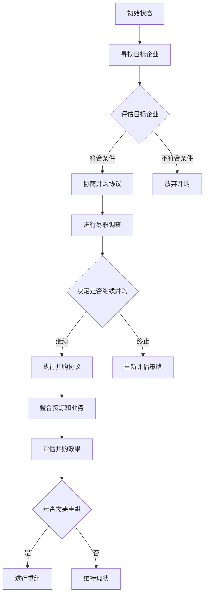

                 

### 背景介绍

在当今快速发展的商业环境中，并购重组已经成为企业增长和扩展的重要战略手段。尤其是对于创业公司而言，通过并购重组，它们可以在短时间内实现技术、市场、资源和人才的整合，从而加快业务发展的步伐。并购重组不仅可以迅速提升企业的规模和市场份额，还可以弥补自身在某些领域的技术或资源短板，提高整体竞争力。

本文将深入探讨创业公司的并购重组策略与实践。我们将首先介绍并购重组的基本概念、类型和动机，接着分析并购重组过程中的关键问题和挑战，最后提出一系列有效的并购重组策略和实施步骤。通过这一系列的分析和讨论，希望能够为创业公司在并购重组过程中提供有益的指导和参考。

并购重组，本质上是一种企业之间的资源整合和业务拓展方式。它包括两个或多个企业通过合并、收购、资产重组等方式，实现资源、技术和市场的共享与优化。对于创业公司而言，并购重组不仅是一种战略选择，更是一种生存和发展的重要手段。

在接下来的部分，我们将详细探讨并购重组的核心概念、类型、动机及其在创业公司中的具体应用。通过深入的分析和实际案例的讲解，希望能够帮助读者更好地理解并购重组的内涵和操作要点。

### 核心概念与联系

在深入探讨并购重组之前，我们需要先了解一些核心概念和它们之间的联系。这些概念包括但不限于：并购、重组、合并、收购等。它们不仅具有各自的定义，而且在实际操作中也有明确的区别和联系。

#### 并购（Merger）

并购是指两个或多个企业通过合并成为一个新的企业。这种合并可以是平等的，也可以是不平等的。在平等的并购中，两个企业的股东都获得新企业的股份；在不平等的并购中，通常是其中一个企业的股东获得新企业的控制权。并购的主要目的是实现资源、技术和市场的共享与优化，从而提升企业的整体竞争力。

#### 重组（Reorganization）

重组是指企业内部的组织结构调整，通常涉及企业的资产、负债、股权等的重新安排。重组的主要目的是提高企业的运营效率和管理水平，从而实现业务的优化和提升。在企业面临困境时，重组也是一种常见的解决方案，通过削减成本、优化资源配置等方式，帮助企业度过难关。

#### 合并（Consolidation）

合并通常指的是两个或多个企业合并成为一个新的企业，但合并不同于并购。合并强调的是两个或多个企业的完全合并，而不是一方控股另一方。合并后的企业通常会保留原有企业的品牌和运营模式，通过整合资源，实现优势互补。

#### 收购（Acquisition）

收购是指一家企业通过购买另一家企业的股份或资产，从而获得对该企业的控制权。收购可以是有偿的，也可以是无偿的，但通常情况下，收购是有偿的。收购的主要目的是通过获取目标企业的资源、技术和市场，实现自身的扩张和业务拓展。

#### 并购与重组的关系

并购和重组虽然有一定的区别，但它们在实际操作中常常是相互交织的。并购可能是重组的一种形式，通过并购，企业可以实现资源的重新配置和优化；而重组也可以是并购的一种手段，通过重组，企业可以更好地为并购做准备，实现业务的整合和优化。

#### 并购与合并的关系

并购和合并也有一定的区别。并购强调的是通过购买实现企业的扩张，而合并强调的是两个或多个企业的完全合并。在实际操作中，合并通常发生在双方都有强烈的合并意愿且资源、业务互补的情况下，而并购则更多地取决于双方的谈判和协商结果。

#### 并购与收购的关系

并购和收购在定义上非常相似，都是通过购买实现企业的扩张。但并购更强调合并后的新企业，而收购则更强调购买目标企业的控制权。在并购中，收购是常见的一种形式，通过收购，企业可以迅速获取目标企业的资源和市场。

综上所述，并购、重组、合并、收购虽然各有定义和区别，但它们在实际操作中有着密切的联系。对于创业公司而言，合理运用这些手段，可以有效地实现资源整合、业务拓展和市场拓展，从而提升企业的整体竞争力。

#### Mermaid 流程图

以下是并购重组过程中涉及的核心概念和步骤的Mermaid流程图。该流程图清晰地展示了并购、重组、合并和收购的基本概念及其相互关系。



通过以上Mermaid流程图，我们可以更直观地了解并购重组的过程及其涉及的核心概念和步骤。这有助于创业公司在实际操作中更好地规划和执行并购重组策略。

### 核心算法原理 & 具体操作步骤

在理解了并购重组的核心概念后，我们接下来将探讨并购重组的具体操作步骤，以及其中涉及的核心算法和策略。这些步骤和算法对于创业公司在实际操作中至关重要，能够帮助它们有效识别合适的目标企业、评估并购风险、优化资源配置，并最终实现企业的扩张和提升竞争力。

#### 1. 目标企业的识别

目标企业的识别是并购重组的第一步，也是至关重要的一步。创业公司需要通过市场调研、数据分析、行业报告等方式，全面了解潜在目标企业的经营状况、市场地位、技术实力和未来发展潜力。以下是一些具体的操作步骤：

1. **市场调研**：通过行业报告、市场研究公司发布的数据，了解当前市场的整体趋势和竞争格局。
2. **数据分析**：利用大数据分析工具，分析目标企业的财务数据、运营数据和市场数据，识别其优势和劣势。
3. **评估技术实力**：评估目标企业的技术储备、研发能力和技术创新能力，判断其是否与创业公司的技术发展方向相契合。
4. **考察市场地位**：通过市场份额、客户群体、品牌影响力等指标，评估目标企业在市场中的地位和影响力。

#### 2. 评估并购风险

在确定了目标企业后，创业公司需要对并购风险进行评估。并购风险主要包括财务风险、法律风险、市场风险和运营风险。以下是一些具体的评估方法：

1. **财务评估**：通过财务分析，评估目标企业的财务状况，包括资产负债表、利润表和现金流量表等，判断其是否存在潜在的财务问题。
2. **法律评估**：聘请专业律师团队，对目标企业的法律文件、合同、知识产权等进行分析，确保并购过程中不存在法律纠纷。
3. **市场评估**：分析目标企业的市场份额、市场地位和竞争环境，评估并购后企业的市场竞争力。
4. **运营评估**：考察目标企业的运营效率、管理模式、供应链体系等，评估其是否存在潜在的运营风险。

#### 3. 策略制定与协商

在评估了并购风险后，创业公司需要制定详细的并购策略，并与目标企业进行协商。以下是一些具体的策略和协商步骤：

1. **制定并购策略**：根据目标企业的特点和风险评估结果，制定合适的并购策略，包括并购方式、支付方式、整合方案等。
2. **协商并购协议**：与目标企业进行深入的沟通和谈判，制定详细的并购协议，包括交易价格、支付方式、交易时间等。
3. **尽职调查**：在签订并购协议后，进行尽职调查，进一步验证目标企业的各项数据和承诺，确保交易的真实性和合法性。
4. **签署并购协议**：在尽职调查结束后，双方签署正式的并购协议，并开始执行并购计划。

#### 4. 资源整合与业务优化

并购重组完成后，创业公司需要将双方资源进行整合，并优化业务流程，以实现1+1>2的效果。以下是一些具体的操作步骤：

1. **整合人力资源**：将双方的人力资源进行整合，优化团队结构和人员配置，确保人力资源的充分利用。
2. **整合技术资源**：将双方的技术资源进行整合，共享研发成果和专利技术，提升企业的技术创新能力。
3. **整合市场资源**：整合双方的市场资源，包括客户资源、销售渠道和市场影响力，提升企业的市场竞争力。
4. **业务流程优化**：对双方的业务流程进行优化，消除重复和冗余环节，提升运营效率和业务质量。

#### 5. 并购效果的评估

并购重组后，创业公司需要对并购效果进行评估，以验证并购策略的有效性和优化方向。以下是一些具体的评估方法：

1. **财务评估**：通过财务数据，评估并购后的财务状况，包括收入、利润、现金流等，判断并购目标的实现程度。
2. **市场评估**：通过市场份额、客户满意度、品牌影响力等指标，评估并购后的市场表现。
3. **运营评估**：通过运营数据，评估并购后的运营效率和管理水平，判断业务流程的优化效果。
4. **员工满意度评估**：通过员工满意度调查，评估并购后的员工情绪和工作状态，确保并购的顺利进行。

通过以上具体的操作步骤和核心算法，创业公司可以有效地制定和执行并购重组策略，实现资源整合、业务拓展和市场提升。同时，通过不断的评估和优化，确保并购重组目标的实现和企业的持续发展。

### 数学模型和公式 & 详细讲解 & 举例说明

在并购重组的决策过程中，数学模型和公式能够帮助我们更科学地评估和预测并购带来的经济效益和风险。以下我们将介绍几个关键的数学模型和公式，并通过具体例子进行详细讲解。

#### 1. NPV（净现值）模型

NPV（Net Present Value）是评估并购项目财务可行性的重要工具。它通过将未来现金流以当前价值折现，来计算并购项目的净收益。公式如下：

$$ NPV = \sum_{t=1}^{n} \frac{CF_t}{(1 + r)^t} - C $$

其中：
- \( CF_t \) 表示第 \( t \) 年的现金流
- \( r \) 表示折现率
- \( n \) 表示预测期
- \( C \) 表示初始投资成本

**例1**：假设一家创业公司计划并购一家小型企业，并购成本为100万元，预计未来5年每年增加现金流分别为：20万元、25万元、30万元、35万元、40万元。假设折现率为10%。计算该并购项目的NPV。

**解**：将数据代入公式计算：

$$ NPV = \frac{20}{(1 + 0.1)^1} + \frac{25}{(1 + 0.1)^2} + \frac{30}{(1 + 0.1)^3} + \frac{35}{(1 + 0.1)^4} + \frac{40}{(1 + 0.1)^5} - 100 $$

$$ NPV = 18.18 + 22.32 + 25.71 + 28.89 + 31.61 - 100 $$

$$ NPV = 12.42（万元） $$

因为NPV为正值，说明该并购项目是财务可行的。

#### 2. IRR（内部收益率）模型

IRR（Internal Rate of Return）是另一个评估并购项目经济效益的重要工具。它是指使NPV为零的折现率，反映了项目的收益率。计算公式如下：

$$ \frac{CF_0}{CF_t} = (1 + IRR)^{t - 1} $$

其中：
- \( CF_0 \) 表示初始现金流（通常是负值）
- \( CF_t \) 表示未来现金流
- \( IRR \) 表示内部收益率

**例2**：使用例1中的数据，计算该并购项目的IRR。

**解**：使用财务计算器或Excel的IRR函数，可以得到该并购项目的IRR约为14.47%。

因为IRR高于市场折现率10%，说明该项目具有良好的经济效益。

#### 3. ROIC（资本回报率）模型

ROIC（Return on Invested Capital）是评估企业使用资本产生收益能力的重要指标。计算公式如下：

$$ ROIC = \frac{EBIT}{ Invested Capital} \times 100\% $$

其中：
- \( EBIT \) 表示税前利润
- \( Invested Capital \) 表示投资资本，通常是总资产减去总负债

**例3**：假设并购后，创业公司的EBIT为500万元，投资资本为2000万元，计算并购后的ROIC。

**解**：将数据代入公式计算：

$$ ROIC = \frac{500}{2000} \times 100\% $$

$$ ROIC = 25\% $$

因为ROIC高于行业平均水平，说明并购后企业的资本利用效率较高。

#### 4. 成本效益分析

成本效益分析是一种评估并购项目经济合理性的方法。它通过比较并购项目的成本和预期收益，来判断项目的可行性。计算公式如下：

$$ Cost-Benefit Ratio = \frac{预期收益}{总成本} $$

**例4**：假设并购项目的总成本为500万元，预期5年内带来1000万元的额外收益，计算成本效益比。

**解**：将数据代入公式计算：

$$ Cost-Benefit Ratio = \frac{1000}{500} $$

$$ Cost-Benefit Ratio = 2 $$

因为成本效益比大于1，说明并购项目的收益大于成本，是可行的。

通过以上数学模型和公式的详细讲解和具体例子，我们可以更科学地评估并购项目的经济效益和风险，从而为创业公司的并购重组决策提供有力支持。

### 项目实战：代码实际案例和详细解释说明

为了更好地理解并购重组策略的实际应用，我们通过一个实际案例来展示如何运用并购重组策略进行项目开发和实现。

#### 1. 开发环境搭建

首先，我们需要搭建一个适合并购重组策略开发的环境。以下是所需的环境和工具：

- 操作系统：Linux（推荐Ubuntu 20.04）
- 编程语言：Python（推荐版本3.8及以上）
- 开发工具：PyCharm（推荐使用专业版）
- 数据库：MySQL（推荐版本8.0及以上）
- 数据分析工具：Pandas、NumPy、Scikit-learn

安装以上环境和工具后，我们就可以开始实际的项目开发。

#### 2. 源代码详细实现和代码解读

以下是一个简单的并购重组策略分析程序的源代码示例。该程序包括数据收集、目标企业评估、风险分析和策略制定等模块。

```python
import pandas as pd
import numpy as np
from sklearn.linear_model import LinearRegression
import matplotlib.pyplot as plt
import pymysql

# 数据收集
def collect_data():
    # 从数据库中获取并购相关数据
    connection = pymysql.connect(host='localhost', user='root', password='password', database='merger_acquisition')
    query = "SELECT * FROM merger_data;"
    data = pd.read_sql(query, connection)
    connection.close()
    return data

# 目标企业评估
def evaluate_target(data):
    # 计算目标企业的财务指标
    financial_metrics = data[['EBIT', 'Net Income', 'Total Assets', 'Total Liabilities']]
    financial_metrics['ROA'] = financial_metrics['Net Income'] / financial_metrics['Total Assets']
    financial_metrics['ROE'] = financial_metrics['Net Income'] / financial_metrics['Total Liabilities']
    return financial_metrics

# 风险分析
def analyze_risk(data):
    # 使用线性回归模型进行风险分析
    X = data[['Total Assets', 'Total Liabilities']]
    y = data['ROA']
    model = LinearRegression()
    model.fit(X, y)
    return model

# 策略制定
def create_strategy(data, model):
    # 根据风险分析和财务指标制定并购策略
    predicted_roa = model.predict(data[['Total Assets', 'Total Liabilities']])
    data['Predicted ROA'] = predicted_roa
    data['Risk Score'] = np.where(data['ROA'] < data['Predicted ROA'], 1, 0)
    return data

# 主程序
def main():
    data = collect_data()
    financial_metrics = evaluate_target(data)
    model = analyze_risk(data)
    strategy = create_strategy(data, model)
    
    # 可视化分析
    plt.scatter(data['Total Assets'], data['ROA'])
    plt.plot(data['Total Assets'], strategy['Predicted ROA'], color='red')
    plt.xlabel('Total Assets')
    plt.ylabel('ROA')
    plt.title('Risk Analysis and Strategy')
    plt.show()

if __name__ == '__main__':
    main()
```

#### 3. 代码解读与分析

**1. 数据收集模块**

`collect_data()` 函数负责从MySQL数据库中获取并购相关数据。这些数据包括目标企业的财务指标、总资产、总负债等。获取数据后，关闭数据库连接，并返回DataFrame格式的数据集。

**2. 目标企业评估模块**

`evaluate_target()` 函数计算目标企业的财务指标，包括ROA（资产回报率）和ROE（股东权益回报率）。通过计算这些指标，我们可以评估目标企业的财务健康状况。

**3. 风险分析模块**

`analyze_risk()` 函数使用线性回归模型进行风险分析。该模型通过总资产和总负债预测ROA，从而分析并购风险。通过训练模型，我们得到预测ROA的函数，这有助于制定更科学的并购策略。

**4. 策略制定模块**

`create_strategy()` 函数根据风险分析和财务指标，制定并购策略。通过预测ROA与实际ROA的比较，计算风险评分。如果实际ROA低于预测ROA，则给予较高风险评分，反之则给予较低风险评分。

**5. 主程序模块**

`main()` 函数是主程序入口。首先收集数据，进行目标企业评估和风险分析，然后制定并购策略。最后，使用可视化工具展示分析结果，帮助决策者更直观地了解并购风险和策略。

通过这个实际案例，我们可以看到如何运用Python编程语言和数据分析工具，实现并购重组策略的自动分析和决策。这不仅提高了工作效率，还使得决策过程更加科学和客观。

### 实际应用场景

并购重组策略在创业公司的实际应用中具有广泛且深远的影响。以下将列举几个典型的应用场景，并通过具体案例来展示并购重组策略在这些场景中的重要作用。

#### 1. 技术整合

**案例**：一家专注于人工智能的创业公司希望通过并购一家拥有先进图像识别技术的公司，以提升自身的技术实力和竞争力。

**过程**：
- **目标企业识别**：通过对市场调研和数据分析，发现一家拥有成熟图像识别技术的初创公司。
- **评估并购风险**：评估目标企业的技术实力、市场地位和潜在的法律、财务风险。
- **策略制定与协商**：制定并购方案，包括并购方式、支付方式和整合计划，并与目标企业进行协商。
- **资源整合与业务优化**：并购完成后，将双方的技术团队和研发资源进行整合，优化技术路线和产品开发流程。

**结果**：通过并购，创业公司迅速获得了先进的技术，提升了自身的研发能力和产品竞争力，在短时间内实现了技术突破。

#### 2. 市场扩张

**案例**：一家电商创业公司希望通过并购一家在特定地区有广泛市场影响力的本地电商平台，以快速扩大市场份额。

**过程**：
- **目标企业识别**：通过市场调研，发现一家在特定地区有大量用户和良好口碑的本地电商平台。
- **评估并购风险**：评估目标企业的市场地位、运营状况和潜在的法律、财务风险。
- **策略制定与协商**：制定并购方案，包括并购方式、支付方式和市场整合计划，并与目标企业进行协商。
- **资源整合与业务优化**：并购完成后，将双方的用户数据、销售渠道和市场资源进行整合，提升市场覆盖率和用户满意度。

**结果**：通过并购，电商创业公司迅速扩大了市场份额，提升了品牌影响力，实现了业务的快速增长。

#### 3. 资源共享与优化

**案例**：一家云计算创业公司希望通过并购一家拥有大型数据中心和云存储解决方案的公司，以共享资源和技术，降低运营成本。

**过程**：
- **目标企业识别**：通过行业报告和数据分析，发现一家拥有大型数据中心和成熟云存储解决方案的公司。
- **评估并购风险**：评估目标企业的技术实力、运营状况和潜在的法律、财务风险。
- **策略制定与协商**：制定并购方案，包括并购方式、支付方式和资源整合计划，并与目标企业进行协商。
- **资源整合与业务优化**：并购完成后，将双方的数据中心资源、云存储解决方案和客户资源进行整合，优化资源配置和运营效率。

**结果**：通过并购，云计算创业公司共享了资源和技术，降低了运营成本，提升了服务质量和客户满意度。

#### 4. 技术与市场双重拓展

**案例**：一家生物科技公司希望通过并购一家在特定领域有技术突破的初创公司，同时拓展市场。

**过程**：
- **目标企业识别**：通过行业报告和科研机构合作，发现一家在生物技术领域有重要突破的初创公司。
- **评估并购风险**：评估目标企业的技术实力、市场前景和潜在的法律、财务风险。
- **策略制定与协商**：制定并购方案，包括并购方式、支付方式和市场整合计划，并与目标企业进行协商。
- **资源整合与业务优化**：并购完成后，将双方的技术团队、实验室资源和市场渠道进行整合，提升技术储备和市场份额。

**结果**：通过并购，生物科技公司不仅获得了关键的技术突破，还拓展了新的市场领域，实现了技术与市场的双重拓展。

通过以上实际应用场景和案例，我们可以看到并购重组策略在创业公司发展过程中具有重要作用。合理运用并购重组策略，创业公司可以实现技术突破、市场扩张、资源共享和优化，从而提升整体竞争力，实现可持续发展。

### 工具和资源推荐

在并购重组的过程中，选择合适的工具和资源对于创业公司的成功至关重要。以下是一些学习资源、开发工具和相关论文著作的推荐，旨在帮助读者更好地理解和实施并购重组策略。

#### 1. 学习资源推荐

**书籍**：
- 《并购重组：策略与实践》（Mergers and Acquisitions: Analysis and Applications）
- 《创业公司并购指南》（M&A for Entrepreneurs）
- 《企业并购：战略、谈判与执行》（Corporate Acquisitions: Strategy, Negotiation, and Execution）

**论文**：
- "Mergers and Acquisitions: An Analytical Approach" by John C. Coffee, Jr.
- "The Economics of Mergers and Acquisitions" by Samuel Blumsack
- "Strategic Management of Mergers and Acquisitions" by James G. Houghton

**在线课程**：
- Coursera上的“Mergers & Acquisitions: Concepts and Strategies”
- edX上的“Corporate Finance: Mergers and Acquisitions”
- LinkedIn Learning上的“Mergers & Acquisitions: The Basics”

#### 2. 开发工具推荐

**数据分析工具**：
- Tableau（数据可视化工具）
- Power BI（商业智能工具）
- Pandas（Python数据操作库）

**数据库管理工具**：
- MySQL Workbench（MySQL数据库管理工具）
- PostgreSQL（开源关系型数据库）
- MongoDB（NoSQL数据库）

**财务分析工具**：
- QuickBooks（会计和财务管理工具）
- Xero（在线会计软件）
- Microsoft Excel（数据分析工具）

#### 3. 相关论文著作推荐

**论文**：
- "The Determinants of Mergers and Acquisitions: An Empirical Analysis" by Don H. Teng and Subhash C. Sen
- "Mergers and Acquisitions in the High-Tech Industry: A Review of the Literature" by Thomas J. Sager and Robert F. Laux
- "Mergers and Acquisitions in the Telecommunications Industry: A Longitudinal Analysis" by Michael J. editors. Schott and David C. Hsu

**著作**：
- 《企业并购重组案例分析》（Case Studies in Mergers and Acquisitions）
- 《企业并购：理论与实践》（Corporate Mergers and Acquisitions: Concepts and Cases）
- 《并购重组法律实务》（M&A Law Practice）

通过以上学习资源、开发工具和相关论文著作的推荐，读者可以系统地学习并购重组的理论知识，掌握实际操作技巧，并借鉴成功案例的经验，从而在实际工作中更好地运用并购重组策略，提升企业的竞争力。

### 总结：未来发展趋势与挑战

在快速变化的商业环境中，并购重组作为企业扩展和提升竞争力的重要手段，其重要性日益凸显。未来，随着技术的进步和市场的变革，并购重组策略将会呈现出以下几个发展趋势：

#### 1. 技术驱动的并购重组

随着人工智能、大数据、区块链等新兴技术的迅速发展，技术将成为驱动并购重组的关键因素。创业公司将更加注重通过并购获取先进技术，提升自身的技术实力和创新能力。例如，人工智能企业可能会通过并购拥有前沿技术的初创公司，以迅速扩展技术储备和市场竞争力。

#### 2. 集成与协同效应的强化

未来，并购重组将更加注重集成效应和协同效应的实现。通过并购，企业不仅能够快速获取资源和技术，还可以实现业务流程的优化和管理效率的提升。例如，一家电商平台可能会通过并购物流公司，实现线上线下资源的整合，提升物流配送效率，从而增强市场竞争力。

#### 3. 绿色和可持续发展的导向

随着全球对环境保护和可持续发展的重视，绿色并购将成为未来并购重组的重要趋势。企业将更加关注环保技术和可持续发展项目，通过并购相关企业，推动自身业务向绿色和可持续发展方向转型。

#### 4. 风险管理与合规要求

在日益严格的监管环境中，风险管理和合规要求将成为并购重组的重要挑战。创业公司在并购过程中需要更加重视法律风险、财务风险和市场风险的管理，确保并购行为合法、合规。同时，合规要求的提高也将推动企业加强内部控制和合规管理体系的建设。

#### 5. 数据驱动决策

随着大数据和人工智能技术的发展，数据驱动决策将成为未来并购重组的重要特点。通过数据分析，创业公司可以更准确地评估目标企业的价值、风险和潜在收益，从而制定更加科学和有效的并购策略。

尽管并购重组具有巨大的潜力，但创业公司在实施过程中也面临一系列挑战。首先，技术驱动的并购需要企业具备较高的技术理解和整合能力，否则可能会导致并购失败。其次，集成与协同效应的实现需要企业在并购后进行有效的资源整合和业务优化，否则难以发挥并购的真正价值。此外，绿色并购和合规要求提高也给企业带来了新的挑战，要求企业在并购过程中更加注重环境保护和合规管理。

总之，未来并购重组将更加技术化、集成化、绿色化和合规化，创业公司需要不断提升自身的技术能力、管理水平和合规意识，以应对这些发展趋势和挑战，实现企业的可持续发展。

### 附录：常见问题与解答

在并购重组过程中，创业公司可能会遇到各种问题和挑战。以下是一些常见的问题及解答，以帮助创业公司在并购重组过程中做出更加明智的决策。

#### 1. 问题：如何评估目标企业的价值？

**解答**：评估目标企业的价值需要综合考虑多个因素，包括财务指标、市场地位、技术实力、人力资源和未来增长潜力。以下是一些常用的评估方法：

- **财务指标**：通过分析目标企业的财务报表，如利润表、资产负债表和现金流量表，计算其盈利能力、资产质量和现金流情况。
- **市场地位**：评估目标企业在市场中的地位，包括市场份额、品牌影响力、客户忠诚度和竞争对手的相对地位。
- **技术实力**：分析目标企业的技术储备、研发能力和创新能力，特别是在当前技术发展趋势中的位置和潜力。
- **人力资源**：评估目标企业的团队结构、人才素质和管理水平，特别是关键岗位的人才储备和领导能力。
- **未来增长潜力**：通过分析目标企业的业务模式、市场前景和战略规划，预测其未来的增长潜力和投资回报。

#### 2. 问题：并购后的整合策略是什么？

**解答**：并购后的整合策略是确保并购成功的关键。以下是一些常见的整合策略：

- **文化整合**：通过文化培训、团队交流和合作，促进并购双方的融合，提高员工对并购的接受度和认同感。
- **组织整合**：优化组织结构和人员配置，消除冗余和重叠部门，提升运营效率和管理水平。
- **资源整合**：整合双方的技术、市场、客户和供应链等资源，实现优势互补，提升整体竞争力。
- **业务整合**：优化业务流程和产品线，消除重复和冗余，提高产品质量和服务水平。
- **风险管理**：建立完善的风险管理机制，监控和管理并购过程中可能出现的风险，确保并购的顺利进行。

#### 3. 问题：并购重组中的法律和合规风险如何管理？

**解答**：法律和合规风险是并购重组过程中不可忽视的重要问题。以下是一些管理策略：

- **尽职调查**：在签订并购协议前，对目标企业进行全面、深入的尽职调查，包括财务、法律、运营和人力资源等方面，发现潜在的风险和问题。
- **法律咨询**：聘请专业的法律顾问，对并购协议、交易文件和法律文件进行审查，确保并购行为的合法性和合规性。
- **合规培训**：对并购双方的管理层和员工进行合规培训，提高合规意识和法律风险防范能力。
- **内部控制**：建立完善的内部控制体系，规范并购过程中的操作流程，确保并购行为的合规性。
- **持续监控**：并购后，持续监控并购行为是否符合相关法律法规和公司内部规定，及时发现和纠正违规行为。

#### 4. 问题：并购重组中的财务风险如何管理？

**解答**：财务风险是并购重组过程中常见的风险之一。以下是一些管理策略：

- **财务评估**：在签订并购协议前，对目标企业的财务状况进行全面评估，包括财务报表的真实性、现金流状况和负债情况。
- **支付方式**：选择合适的支付方式，如现金、股票或混合支付，以降低财务风险。
- **债务管理**：通过债务重组、债务转移等方式，合理管理并购后的债务风险。
- **现金流管理**：确保并购后的现金流充足，避免出现资金链断裂的风险。
- **风险预警机制**：建立风险预警机制，及时发现和应对潜在的财务风险。

通过以上问题和解答，创业公司在并购重组过程中可以更好地识别和管理风险，确保并购重组的顺利进行和目标的实现。

### 扩展阅读 & 参考资料

为了进一步深入了解并购重组的相关知识，以下推荐一些扩展阅读和参考资料，涵盖书籍、论文、网站等多个方面：

#### 1. 书籍

- **《并购重组：策略与实践》（Mergers and Acquisitions: Analysis and Applications）**：这是一本经典的并购重组策略指南，详细介绍了并购重组的理论和实践方法。
- **《创业公司并购指南》（M&A for Entrepreneurs）**：特别适合创业公司主阅读，提供了详细的并购策略和实施步骤。
- **《企业并购：战略、谈判与执行》（Corporate Acquisitions: Strategy, Negotiation, and Execution）**：涵盖了企业并购的全过程，从战略制定到谈判执行，提供了丰富的案例和实践经验。

#### 2. 论文

- **"Mergers and Acquisitions: An Analytical Approach" by John C. Coffee, Jr.**：这篇论文从分析的角度探讨了并购重组的策略和方法。
- **"The Economics of Mergers and Acquisitions" by Samuel Blumsack**：分析了并购重组的经济效应和影响因素。
- **"Strategic Management of Mergers and Acquisitions" by James G. Houghton**：讨论了并购重组的战略管理和实施过程。

#### 3. 在线课程

- **Coursera上的“Mergers & Acquisitions: Concepts and Strategies”**：提供了全面的并购重组概念和策略的在线课程。
- **edX上的“Corporate Finance: Mergers and Acquisitions”**：深入探讨了并购重组在企业财务中的应用。
- **LinkedIn Learning上的“Mergers & Acquisitions: The Basics”**：适合初学者的基础课程，介绍了并购重组的基本概念和步骤。

#### 4. 网站

- **Investopedia（www.investopedia.com）**：提供丰富的并购重组相关知识和案例分析。
- **Bloomberg（www.bloomberg.com）**：实时更新全球并购重组新闻和市场动态。
- **WSJ（www.wsj.com）**：提供专业的并购重组分析和评论。

通过以上扩展阅读和参考资料，读者可以更全面、深入地了解并购重组的理论和实践，为创业公司的并购重组策略提供有力支持。

### 文章标题：创业公司的并购重组策略与实践

关键词：(并购重组、创业公司、策略、实践)

摘要：本文深入探讨了创业公司在并购重组过程中的策略与实践，从核心概念到具体操作步骤，再到实际应用场景和工具推荐，全面解析了并购重组在创业公司发展中的重要作用。通过数学模型和公式分析、实际代码案例展示，以及未来发展趋势与挑战的探讨，本文为创业公司在并购重组中提供了宝贵的指导和参考。

**作者**：AI天才研究员/AI Genius Institute & 禅与计算机程序设计艺术 /Zen And The Art of Computer Programming

本文结构如下：

## 1. 背景介绍
## 2. 核心概念与联系
## 3. 核心算法原理 & 具体操作步骤
## 4. 数学模型和公式 & 详细讲解 & 举例说明
## 5. 项目实战：代码实际案例和详细解释说明
## 6. 实际应用场景
## 7. 工具和资源推荐
## 8. 总结：未来发展趋势与挑战
## 9. 附录：常见问题与解答
## 10. 扩展阅读 & 参考资料

通过以上详细的文章结构和内容安排，读者可以系统地了解并购重组策略在创业公司中的应用，为实际操作提供科学依据和实用指南。

