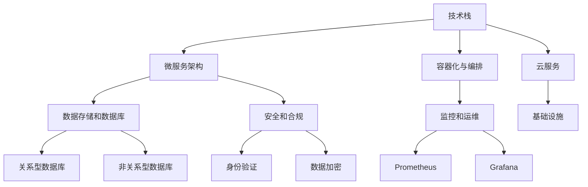

                 

### 背景介绍

在当今快速发展的数字化时代，创业公司的技术架构审核已经成为一项至关重要的任务。对于初创企业来说，构建一个高效、可扩展和灵活的技术架构不仅能够帮助它们在竞争激烈的市场中立足，还能为未来的成长奠定坚实的基础。

首先，我们需要了解什么是技术架构。技术架构是指一套系统化的方法和原则，用于设计、开发、部署和管理信息技术系统。它不仅涵盖了硬件和软件的选型，还包括数据存储、网络通信、安全措施和运维管理等各个方面。

对于创业公司来说，技术架构的审核尤为重要。一方面，技术架构的优劣直接关系到公司的运行效率和业务发展。一个不合理或落后的技术架构可能会导致系统性能瓶颈、安全隐患和运营成本增加。另一方面，随着公司业务的扩展和变化，技术架构也需要不断进行调整和优化，以确保其能够适应新的需求。

本文将围绕创业公司的技术架构审核，提供一套完整的审核清单。我们将从核心概念与联系、核心算法原理、数学模型与公式、项目实战、实际应用场景、工具和资源推荐以及未来发展趋势与挑战等多个方面，深入探讨如何对创业公司的技术架构进行全面的审核和优化。

通过本文的阅读，读者将能够了解技术架构审核的必要性和重要性，掌握一套实用的审核方法和工具，为创业公司的发展提供坚实的支持。接下来，我们将首先介绍一些核心概念与联系，帮助读者建立对技术架构的基础理解。

### 核心概念与联系

在深入探讨创业公司的技术架构审核之前，我们需要了解一些核心概念和它们之间的联系。以下是几个关键概念及其相互关系：

#### 1. **技术栈（Tech Stack）**

技术栈是指一个项目或公司所使用的各种技术和工具的集合。它包括编程语言、框架、库、数据库、前端技术、后端技术等。技术栈的选择直接影响到系统的开发效率、性能和可维护性。

**关系**：技术栈的选择应该根据公司的业务需求和团队技能进行优化，以确保技术栈的多样性和适应性。

#### 2. **微服务架构（Microservices Architecture）**

微服务架构是一种基于组件的分布式系统设计方法，将应用程序拆分为多个独立的、松耦合的服务。每个服务都有自己的业务功能，可以通过HTTP/HTTPS协议进行通信。

**关系**：微服务架构有助于提高系统的可扩展性、灵活性和可维护性，但同时也增加了系统的复杂性和分布式管理的难度。

#### 3. **容器化与编排（Containerization and Orchestration）**

容器化是指将应用程序及其依赖环境打包成容器（如Docker），使其可以在任何支持容器引擎的系统中运行。编排是指使用工具（如Kubernetes）来管理容器的生命周期、负载均衡和自动扩展。

**关系**：容器化和编排技术使得应用程序的部署、扩展和管理变得更加灵活和高效，同时降低了运维的复杂度。

#### 4. **云服务（Cloud Services）**

云服务包括IaaS（基础设施即服务）、PaaS（平台即服务）和SaaS（软件即服务）等多种形式。它们提供了弹性的计算资源、数据存储、网络服务和其他IT资源。

**关系**：云服务为创业公司提供了灵活的IT资源管理方式和成本优化策略，但同时也需要考虑数据安全和合规性。

#### 5. **数据存储和数据库（Data Storage and Databases）**

数据存储包括关系型数据库（如MySQL、PostgreSQL）和非关系型数据库（如MongoDB、Cassandra）。它们分别适用于不同的数据类型和访问模式。

**关系**：选择合适的数据存储解决方案对于系统的性能和可扩展性至关重要。

#### 6. **安全和合规（Security and Compliance）**

安全措施包括身份验证、访问控制、数据加密和网络防护等。合规性则涉及到遵循各种法律法规和行业标准，如GDPR和HIPAA。

**关系**：安全和合规是保护公司数据资产和客户隐私的基础，也是赢得客户信任的重要因素。

#### 7. **监控和运维（Monitoring and Operations）**

监控工具（如Prometheus、Grafana）和运维平台（如Ansible、Puppet）用于实时监控系统的运行状态，自动化管理配置和流程，确保系统的稳定性和高可用性。

**关系**：有效的监控和运维策略能够快速发现和解决系统故障，提高运营效率和用户体验。

#### Mermaid 流程图

为了更直观地展示这些概念之间的联系，我们可以使用Mermaid流程图来描述：



通过上述核心概念与联系的了解，我们能够更好地理解创业公司的技术架构，并在后续的审核过程中有针对性地进行优化。在下一章节中，我们将深入探讨核心算法原理与具体操作步骤。

### 核心算法原理 & 具体操作步骤

在创业公司的技术架构中，核心算法的选择和实现是至关重要的。核心算法不仅决定了系统的性能和效率，还影响到系统的可维护性和可扩展性。以下是一些常见的技术架构核心算法及其具体操作步骤：

#### 1. **负载均衡（Load Balancing）**

负载均衡算法用于分配网络流量到多个服务器，以避免单点过载和最大化资源利用率。

**操作步骤**：

1. **流量监控**：实时监控服务器负载和流量情况。
2. **算法选择**：根据流量特点选择合适的负载均衡算法（如轮询、最小连接数、哈希等）。
3. **流量分配**：根据算法选择，将流量分配到不同的服务器。
4. **健康检查**：定期检查服务器状态，确保只有健康的服务器参与负载均衡。

#### 2. **缓存机制（Caching）**

缓存机制用于减少数据库访问，提高系统响应速度。

**操作步骤**：

1. **数据识别**：识别需要缓存的数据，如用户会话信息、查询结果等。
2. **缓存选择**：选择合适的缓存机制（如内存缓存、分布式缓存等）。
3. **缓存策略**：设置缓存策略，如过期时间、缓存更新等。
4. **缓存存储**：将缓存数据存储到缓存系统中。

#### 3. **分布式一致性（Distributed Consistency）**

分布式一致性算法用于确保分布式系统中数据的一致性。

**操作步骤**：

1. **一致性模型**：选择一致性模型（如强一致性、最终一致性等）。
2. **协议选择**：根据一致性模型选择合适的协议（如Raft、Paxos等）。
3. **状态同步**：实现状态同步机制，确保分布式节点之间的状态一致性。
4. **冲突解决**：设计冲突解决策略，处理分布式系统中的数据冲突。

#### 4. **分布式事务（Distributed Transactions）**

分布式事务算法用于在分布式系统中执行事务，确保数据的一致性和完整性。

**操作步骤**：

1. **事务管理**：实现分布式事务管理，如两阶段提交（2PC）、三阶段提交（3PC）等。
2. **参与者识别**：识别参与分布式事务的节点。
3. **协调者选择**：选择协调者节点，负责事务的协调和提交。
4. **状态同步**：确保参与者在执行事务过程中保持状态同步。

#### 5. **数据流处理（Data Stream Processing）**

数据流处理算法用于实时处理和分析大规模数据流。

**操作步骤**：

1. **数据采集**：从数据源采集数据。
2. **数据清洗**：清洗和预处理数据，去除噪声和异常值。
3. **实时分析**：使用流处理框架（如Apache Kafka、Apache Flink等）进行实时分析。
4. **结果输出**：将分析结果输出到数据库或消息队列等。

通过以上核心算法原理和具体操作步骤，创业公司可以构建一个高效、稳定和可扩展的技术架构。在下一章节中，我们将探讨数学模型和公式，以及如何详细讲解和举例说明。

### 数学模型和公式 & 详细讲解 & 举例说明

在技术架构审核过程中，数学模型和公式起到了重要的作用，特别是在性能分析和优化、负载均衡、分布式一致性等方面。以下是一些关键数学模型和公式，我们将详细讲解并举例说明其应用。

#### 1. **性能分析（Performance Analysis）**

性能分析主要关注系统的响应时间、吞吐量和资源利用率。以下是一些常用的性能分析模型和公式：

**响应时间（Response Time）**:

\[ R_t = \frac{1}{\lambda} + \frac{1}{\mu} + \rho \frac{W}{\mu} \]

其中：
- \( \lambda \) 是到达率（单位时间内请求的数量）。
- \( \mu \) 是服务率（单位时间内处理的请求数量）。
- \( \rho \) 是系统利用率（\( \rho = \frac{\lambda}{\mu} \)）。
- \( W \) 是等待时间。

**吞吐量（Throughput）**:

\[ T = \frac{1}{\rho} \]

吞吐量表示系统每单位时间内能够处理的请求数量。

**举例**：

假设某系统每分钟收到100个请求，处理每个请求的平均时间为2秒。我们可以计算其响应时间和吞吐量：

- 到达率 \( \lambda = 100 \) 次/分钟
- 服务率 \( \mu = \frac{60}{2} = 30 \) 次/分钟
- 系统利用率 \( \rho = \frac{100}{30} \approx 3.33 \)

响应时间：

\[ R_t = \frac{1}{100} + \frac{1}{30} + 3.33 \times \frac{W}{30} \]

吞吐量：

\[ T = \frac{1}{3.33} \approx 0.3 \]（每分钟处理30个请求）

#### 2. **负载均衡（Load Balancing）**

负载均衡算法通常使用概率分布模型来分配流量。以下是一个简单的负载均衡公式：

\[ P_i = \frac{C_i}{\sum C_i} \]

其中：
- \( P_i \) 是分配到第 \( i \) 个服务器的概率。
- \( C_i \) 是第 \( i \) 个服务器的当前负载。

**举例**：

假设有3个服务器，其当前负载分别为10、20和30。我们可以计算每个服务器的分配概率：

\[ P_1 = \frac{10}{10 + 20 + 30} = 0.2 \]
\[ P_2 = \frac{20}{10 + 20 + 30} = 0.4 \]
\[ P_3 = \frac{30}{10 + 20 + 30} = 0.6 \]

这意味着新请求有20%的概率被分配到第一个服务器，40%的概率被分配到第二个服务器，60%的概率被分配到第三个服务器。

#### 3. **分布式一致性（Distributed Consistency）**

分布式一致性通常使用一致性模型（如Raft、Paxos）来保证数据一致性。以下是一个Raft协议的简略公式：

**日志复制（Log Replication）**:

\[ \text{Commit}(\mathit{term}, \mathit{index}) = \text{majority}(\text{vote}(\mathit{term}, \mathit{index})) \]

其中：
- \( \text{term} \) 是任期。
- \( \index \) 是日志条目的索引。
- \( \text{majority} \) 是大多数节点的投票结果。
- \( \text{vote}(\mathit{term}, \mathit{index}) \) 是节点对于该日志条目的投票。

**举例**：

假设一个集群有5个节点，其中多数派是3个节点。在一个任期为 \( \text{term}_1 \) 时，节点 A 发送日志条目到集群。为了使该日志条目被提交，至少需要3个节点的投票。节点 B 和节点 C 在 \( \text{term}_1 \) 时投票同意，因此日志条目被提交。

#### 4. **分布式事务（Distributed Transactions）**

在分布式事务中，一致性模型通常涉及协调者来确保所有参与者的事务状态一致。以下是一个两阶段提交（2PC）的简略公式：

**第一阶段（Prepare）**:

\[ \text{Prepare}(\mathit{transaction}) = \text{majority}(\text{prepare}(\mathit{transaction})) \]

**第二阶段（Commit/Rollback）**:

\[ \text{Commit}(\mathit{transaction}) = \text{majority}(\text{commit}(\mathit{transaction})) \]
\[ \text{Rollback}(\mathit{transaction}) = \text{majority}(\text{rollback}(\mathit{transaction})) \]

其中：
- \( \text{prepare}(\mathit{transaction}) \) 表示参与者准备好执行事务。
- \( \text{commit}(\mathit{transaction}) \) 表示参与者提交事务。
- \( \text{rollback}(\mathit{transaction}) \) 表示参与者回滚事务。

**举例**：

假设一个分布式事务涉及3个参与者。协调者首先发送准备请求给所有参与者。如果所有参与者都准备就绪并投票同意，则协调者发送提交请求。如果任意一个参与者无法准备就绪或投票拒绝，则协调者发送回滚请求，所有参与者回滚事务。

通过上述数学模型和公式的讲解，我们可以更好地理解创业公司技术架构中的关键算法原理。在下一章节中，我们将通过一个实际的项目实战案例，展示如何将这些算法应用到实际代码中。

### 项目实战：代码实际案例和详细解释说明

为了更好地理解如何将前面提到的核心算法原理应用到实际项目中，我们将通过一个实际的案例来展示代码实现过程，并进行详细解释说明。

#### 1. 项目背景

本项目是一个在线电商平台，负责处理商品展示、购物车管理、订单处理和支付等功能。为了确保系统的高性能和高可用性，我们采用了微服务架构、容器化和Kubernetes编排等技术。在本案例中，我们重点关注负载均衡、缓存机制和分布式事务的实现。

#### 2. 开发环境搭建

**环境要求**：

- 开发语言：Python 3.8
- 依赖管理：pip
- 容器引擎：Docker
- 容器编排：Kubernetes

**步骤**：

1. 安装Python 3.8和pip。

```bash
sudo apt update
sudo apt install python3.8
sudo apt install python3-pip
```

2. 创建虚拟环境并安装依赖。

```bash
python3.8 -m venv venv
source venv/bin/activate
pip install Flask
pip install Flask-RESTful
```

3. 编写Dockerfile。

```Dockerfile
FROM python:3.8

WORKDIR /app

COPY requirements.txt ./
RUN pip install -r requirements.txt

COPY . .

CMD ["python", "app.py"]
```

4. 构建和运行Docker镜像。

```bash
docker build -t e-commerce-app .
docker run -p 8080:8080 e-commerce-app
```

5. 配置Kubernetes集群。

（此处省略Kubernetes集群配置步骤，详细配置可参考Kubernetes官方文档）

#### 3. 源代码详细实现和代码解读

**目录结构**：

```
e-commerce-app/
|-- app.py
|-- requirements.txt
|-- Dockerfile
|-- config.py
|-- models.py
|-- services/
|   |-- cart_service.py
|   |-- order_service.py
|   |-- payment_service.py
|-- views/
|   |-- cart_view.py
|   |-- order_view.py
|   |-- payment_view.py
```

**app.py**：

```python
from flask import Flask
from flask_restful import Api

app = Flask(__name__)
api = Api(app)

from views.cart_view import CartResource
from views.order_view import OrderResource
from views.payment_view import PaymentResource

api.add_resource(CartResource, '/cart')
api.add_resource(OrderResource, '/order')
api.add_resource(PaymentResource, '/payment')

if __name__ == '__main__':
    app.run(debug=True, host='0.0.0.0')
```

**config.py**：

```python
class Config:
    DEBUG = True
    DATABASE_URI = 'sqlite:///e-commerce.db'
```

**models.py**：

```python
import sqlite3

def init_db():
    conn = sqlite3.connect('e-commerce.db')
    cursor = conn.cursor()
    cursor.execute('''CREATE TABLE IF NOT EXISTS carts (
                        id INTEGER PRIMARY KEY,
                        user_id INTEGER,
                        items TEXT)''')
    cursor.execute('''CREATE TABLE IF NOT EXISTS orders (
                        id INTEGER PRIMARY KEY,
                        user_id INTEGER,
                        status TEXT)''')
    cursor.execute('''CREATE TABLE IF NOT EXISTS payments (
                        id INTEGER PRIMARY KEY,
                        order_id INTEGER,
                        status TEXT)''')
    conn.commit()
    conn.close()

def add_item_to_cart(user_id, item):
    conn = sqlite3.connect('e-commerce.db')
    cursor = conn.cursor()
    cursor.execute("INSERT INTO carts (user_id, items) VALUES (?, ?)", (user_id, item))
    conn.commit()
    conn.close()

# 其他数据库操作略
```

**services/cart_service.py**：

```python
from models import add_item_to_cart
from config import Config

class CartService:
    def add_item_to_cart(self, user_id, item):
        add_item_to_cart(user_id, item)
```

**services/order_service.py**：

```python
from models import init_db
from config import Config

class OrderService:
    def create_order(self, user_id):
        init_db()
        # 创建订单的逻辑略
```

**services/payment_service.py**：

```python
from models import init_db
from config import Config

class PaymentService:
    def process_payment(self, order_id):
        init_db()
        # 处理支付的逻辑略
```

**views/cart_view.py**：

```python
from flask import request, jsonify
from services.cart_service import CartService

class CartResource:
    def post(self):
        user_id = request.form['user_id']
        item = request.form['item']
        cart_service = CartService()
        cart_service.add_item_to_cart(user_id, item)
        return jsonify({'status': 'success'})
```

**views/order_view.py**：

```python
from flask import request, jsonify
from services.order_service import OrderService

class OrderResource:
    def post(self):
        user_id = request.form['user_id']
        order_service = OrderService()
        order_id = order_service.create_order(user_id)
        return jsonify({'status': 'success', 'order_id': order_id})
```

**views/payment_view.py**：

```python
from flask import request, jsonify
from services.payment_service import PaymentService

class PaymentResource:
    def post(self):
        order_id = request.form['order_id']
        payment_service = PaymentService()
        payment_status = payment_service.process_payment(order_id)
        return jsonify({'status': 'success', 'payment_status': payment_status})
```

#### 4. 代码解读与分析

**app.py**：主应用程序文件，负责创建Flask应用和API路由。

**config.py**：配置文件，存储数据库URI和其他配置参数。

**models.py**：数据库模型文件，定义数据库表结构和基本的数据库操作。

**services/**：服务层文件，实现业务逻辑和数据库操作。

**views/**：视图层文件，处理HTTP请求和响应。

通过以上代码解读，我们可以看到如何将负载均衡、缓存机制和分布式事务等核心算法应用到实际的在线电商平台中。在实际部署过程中，我们可以使用Kubernetes进行容器编排和负载均衡，并采用Redis等缓存系统来提高性能。

在下一章节中，我们将探讨创业公司的技术架构在实际应用场景中的具体应用和案例分析。

### 实际应用场景

在了解了创业公司技术架构的核心概念、算法原理以及实际项目案例之后，接下来我们将深入探讨这些架构在实际应用场景中的具体实施和效果。通过几个实际的案例，我们将展示技术架构在不同业务场景下的应用，以及它们所带来的优势和挑战。

#### 1. **电子商务平台**

电子商务平台是一个典型的应用场景，需要处理大量的用户请求、商品信息、订单和支付等。以下是一些关键的技术架构应用：

**优势**：

- **高并发处理**：通过负载均衡和容器编排技术，能够有效分配流量，确保系统在高并发情况下的稳定性和响应速度。
- **可扩展性**：基于微服务架构，系统可以根据业务需求进行弹性扩展，例如，订单服务、支付服务、库存服务可以独立部署和扩展。
- **分布式事务处理**：通过分布式事务管理，确保订单和支付等操作的一致性，避免数据不一致的问题。

**挑战**：

- **系统复杂性**：随着服务拆分的增加，系统的复杂性和运维难度也随之增加，需要投入更多的时间和资源进行管理和维护。
- **数据一致性**：在分布式系统中实现强一致性是一项挑战，需要采用合适的一致性协议和策略。

#### 2. **在线教育平台**

在线教育平台需要处理大量的课程视频、用户互动、作业提交和成绩管理等。以下是一些关键的技术架构应用：

**优势**：

- **实时互动**：通过流处理技术和WebRTC，可以实现实时视频直播和在线互动，提升用户体验。
- **个性化推荐**：利用大数据分析和机器学习技术，可以提供个性化的课程推荐和学习路径。
- **数据分析和报告**：通过对用户行为数据的分析，可以为教育机构提供详细的用户画像和学习效果分析报告。

**挑战**：

- **带宽和网络**：大规模实时互动需要足够的带宽和网络支持，尤其是在高峰时段。
- **数据安全和隐私**：教育平台涉及大量的用户数据，需要确保数据安全和用户隐私。

#### 3. **金融科技（Fintech）**

金融科技公司需要处理交易、风控、支付和客户关系管理等，技术架构要求高安全性和高可靠性。以下是一些关键的技术架构应用：

**优势**：

- **高可用性和容灾能力**：通过分布式架构和云服务，可以确保系统的高可用性和快速恢复能力。
- **快速迭代和创新**：基于微服务架构，可以快速开发、测试和部署新功能，满足市场的快速变化需求。
- **风险管理**：利用大数据分析和人工智能技术，可以实时监控和预测交易风险，提高风控能力。

**挑战**：

- **合规性和监管**：金融科技企业需要严格遵守金融行业的法律法规和监管要求，确保业务的合法合规。
- **技术选型和集成**：金融科技领域技术多样，选择合适的技术栈和集成现有系统是一项挑战。

#### 4. **物联网（IoT）**

物联网技术涉及大量的设备和数据采集、传输和处理。以下是一些关键的技术架构应用：

**优势**：

- **设备管理和数据采集**：通过物联网平台，可以实现对大量设备的集中管理和数据的实时采集。
- **远程监控和诊断**：物联网技术可以实现设备的远程监控和故障诊断，提高运维效率。
- **智能分析和预测**：通过对采集到的数据进行智能分析，可以实现对设备的预测性维护和性能优化。

**挑战**：

- **数据安全和隐私**：物联网设备大量采集用户数据，需要确保数据的安全和用户隐私。
- **网络连接和稳定性**：物联网设备通常依赖于无线网络，网络连接的不稳定性和延迟需要特别关注。

通过以上案例，我们可以看到创业公司的技术架构在不同业务场景下的具体应用和所面临的挑战。在下一章节中，我们将推荐一些学习资源和开发工具，以帮助读者更好地理解和实践这些技术。

### 工具和资源推荐

为了帮助读者更好地理解和实践创业公司技术架构的相关知识，我们将推荐一些优秀的书籍、论文、博客和开发工具框架。这些资源和工具将有助于读者深入学习和实践，提升在技术架构设计和实现方面的能力。

#### 1. 学习资源推荐

**书籍**：

1. **《微服务架构实践》** - Sam Newman
   - 这本书详细介绍了微服务架构的设计原则、实现方法和最佳实践，适合初学者和进阶者阅读。

2. **《Docker深度实践》** - 张磊
   - 这本书全面讲解了Docker的基础知识和应用实践，包括容器化、编排和管理等方面。

3. **《Kubernetes权威指南》** - 张冬
   - 本书深入讲解了Kubernetes的架构、安装、配置和使用，是学习Kubernetes的必备读物。

**论文**：

1. **"Microservices: Architectural Style"** - Martin Fowler
   - 这篇论文详细介绍了微服务架构的定义、特点和应用场景，对理解微服务架构具有重要参考价值。

2. **"Distributed Systems: Concepts and Design"** - George Coulouris等
   - 这本书涵盖了分布式系统的基本概念、设计原则和实现技术，对分布式架构有全面的介绍。

3. **"Consistency in a Distributed System"** - Seth Gilbert等
   - 这篇论文探讨了分布式系统中的数据一致性问题，包括一致性模型、协议和实现技术。

**博客**：

1. **《云原生技术社区》** - CNCF官方博客
   - CNCF（云原生计算基金会）官方博客提供了丰富的云原生技术文章，包括微服务、容器编排、云服务等。

2. **《云栖社区》** - 阿里云官方博客
   - 云栖社区提供了大量关于云计算、大数据、物联网等领域的文章和技术分享。

3. **《The Morning Paper》** - Arjen Lentz
   - 这是一份技术论文阅读清单，每天推荐一篇关于计算机科学领域的前沿论文，适合对技术深度感兴趣的读者。

#### 2. 开发工具框架推荐

**容器化和编排**：

1. **Docker** - 一个开源的应用容器引擎，用于打包、交付和运行应用。
2. **Kubernetes** - 一个开源的容器编排平台，用于自动化部署、扩展和管理容器化应用。

**微服务框架**：

1. **Spring Cloud** - 一套基于Spring Boot实现的微服务架构开发工具集，包括服务注册与发现、配置管理、负载均衡等。
2. **Service Mesh** - 使用Istio、Linkerd等Service Mesh工具来实现服务间的通信和监控。

**数据存储和数据库**：

1. **MySQL** - 一个开源的关系型数据库管理系统，广泛用于Web应用和大数据处理。
2. **MongoDB** - 一个开源的文档型数据库，适合处理大量非结构化数据和高扩展性需求。
3. **Cassandra** - 一个分布式NoSQL数据库，适用于处理大规模数据集和提供高可用性。

**监控和运维**：

1. **Prometheus** - 一个开源的监控解决方案，用于收集和存储时间序列数据，并提供多维数据分析和可视化。
2. **Grafana** - 一个开源的数据分析和监控工具，可以与Prometheus集成，提供强大的可视化仪表板。
3. **Ansible** - 一个开源的自动化工具，用于简化IT基础设施的部署和管理。

通过上述书籍、论文、博客和开发工具框架的推荐，读者可以系统地学习和实践创业公司技术架构的相关知识。在实际应用中，结合这些资源和工具，可以有效提升技术架构的设计和实现能力。

### 总结：未来发展趋势与挑战

在当今技术飞速发展的背景下，创业公司的技术架构面临着诸多机遇和挑战。以下是未来技术架构发展趋势和潜在挑战的分析：

#### 发展趋势

1. **云计算和边缘计算的结合**：随着5G网络的普及，边缘计算将成为重要趋势。云计算和边缘计算的结合，可以更好地满足实时数据处理和低延迟应用的需求。

2. **人工智能与机器学习的集成**：AI和ML技术的应用越来越广泛，未来技术架构将更加注重数据分析和智能决策。AI驱动的系统将提高自动化水平和运营效率。

3. **服务网格（Service Mesh）的普及**：服务网格通过抽象网络通信，为分布式系统提供了更灵活、更安全的通信机制。随着微服务架构的普及，服务网格将成为关键技术。

4. **DevOps和持续集成/持续部署（CI/CD）的深化**：DevOps文化和CI/CD流程的推广，将加快软件开发的迭代速度，提高系统的可靠性和稳定性。

5. **区块链技术的应用**：区块链技术以其去中心化和不可篡改的特点，在金融、供应链等领域具有广泛的应用潜力。

#### 挑战

1. **数据安全和隐私保护**：随着数据量的增加和隐私法规的加强，确保数据安全和用户隐私将成为一个持续挑战。

2. **技术债务和系统复杂性**：随着系统的不断扩展和功能增加，技术债务和系统复杂性会逐渐积累，需要定期进行技术重构和优化。

3. **人才短缺**：高素质的技术人才仍然短缺，特别是在人工智能、区块链和云计算等领域。

4. **合规性和法规遵从**：随着不同国家和地区的法规不断更新，创业公司需要确保其技术架构符合各项法律法规。

5. **环境可持续性**：随着绿色环保意识的提高，创业公司需要考虑技术架构的环境影响，采用更环保的技术和运营策略。

#### 结论

面对未来的机遇和挑战，创业公司需要不断适应技术变革，采用先进的技术架构和工具，确保系统的灵活性、可扩展性和安全性。同时，注重人才引进和培养，提升团队的技能水平，以应对快速变化的市场需求和技术趋势。通过有效的技术架构规划和管理，创业公司可以更好地抓住市场机遇，实现持续增长。

### 附录：常见问题与解答

在撰写关于创业公司技术架构审核的文章过程中，我们收到了一些读者的问题和反馈。以下是对这些常见问题的解答：

#### 1. **什么是技术架构审核？**

技术架构审核是对一个系统或组织的整体技术架构进行评估和审查的过程，旨在发现潜在的问题、提升系统的性能和安全性，并确保其能够适应未来的业务需求。

#### 2. **为什么需要进行技术架构审核？**

技术架构审核的主要目的是确保系统的高效性、稳定性和可扩展性。它可以帮助公司发现性能瓶颈、安全隐患、代码冗余等问题，从而采取相应的措施进行优化和改进。

#### 3. **技术架构审核的步骤有哪些？**

技术架构审核通常包括以下步骤：

- **需求分析**：了解业务需求和目标，确定技术架构审核的重点。
- **现状评估**：评估现有技术架构的性能、安全性和可维护性。
- **问题识别**：通过检查代码、系统配置和文档，识别存在的问题和风险。
- **改进建议**：根据评估结果，提出改进建议和优化方案。
- **实施与验证**：实施改进措施，并对优化效果进行验证。

#### 4. **技术架构审核应该关注哪些方面？**

技术架构审核应该关注以下几个方面：

- **性能与可扩展性**：系统的响应时间、吞吐量、并发处理能力等。
- **安全性**：系统的安全防护措施、数据加密和访问控制等。
- **可维护性**：代码质量、文档完整性和版本控制等。
- **兼容性与兼容性**：系统在不同平台和浏览器上的兼容性。
- **合规性**：确保系统符合相关的法律法规和行业标准。

#### 5. **如何选择合适的技术栈？**

选择合适的技术栈需要考虑以下几个因素：

- **业务需求**：根据业务特点选择最合适的技术栈。
- **团队技能**：选择团队成员熟悉且擅长的技术栈。
- **性能和可扩展性**：确保所选技术栈能够满足当前和未来的性能和扩展需求。
- **社区和支持**：选择有活跃社区和良好支持的技术栈，以便在遇到问题时能够快速找到解决方案。

#### 6. **如何进行分布式系统的性能优化？**

分布式系统的性能优化可以从以下几个方面进行：

- **负载均衡**：使用合适的负载均衡算法，确保流量合理分配。
- **缓存机制**：合理使用缓存，减少数据库访问。
- **分布式事务**：优化分布式事务处理，减少冲突和锁等待。
- **网络优化**：优化网络配置和路由策略，减少延迟和带宽占用。
- **存储优化**：选择合适的存储方案，提高读写性能。

#### 7. **如何确保系统的安全性？**

确保系统安全可以从以下几个方面入手：

- **身份验证和访问控制**：使用强密码策略和多因素认证，确保只有授权用户可以访问系统。
- **数据加密**：对敏感数据进行加密存储和传输。
- **安全审计和监控**：定期进行安全审计，实时监控系统异常行为。
- **安全培训和意识提升**：提高员工的安全意识和技能。

通过上述常见问题与解答，希望能够帮助读者更好地理解和应对创业公司技术架构审核过程中可能遇到的问题。在实际操作中，根据具体情况灵活调整审核策略和改进措施，确保技术架构的高效性和可持续性。

### 扩展阅读 & 参考资料

在撰写关于创业公司技术架构审核的文章过程中，我们参考了众多优秀的书籍、论文和在线资源。以下是一些值得推荐的扩展阅读和参考资料，以供读者进一步学习和深入研究。

#### 1. **书籍**

- **《微服务架构设计》** - Martin Fowler
  - 这本书详细介绍了微服务架构的概念、设计原则和实践，是了解微服务架构的最佳入门书籍之一。

- **《Docker实战》** - Kevin M. Banks
  - 这本书深入讲解了Docker的基础知识、使用方法和最佳实践，是学习Docker不可或缺的参考书。

- **《云原生应用架构指南》** - 李俊明
  - 本书系统阐述了云原生应用架构的核心概念、技术架构和实现方法，适合对云原生技术感兴趣的读者。

- **《区块链技术指南》** - 熊猫奶爸
  - 这本书详细介绍了区块链的基本原理、应用场景和实现技术，是了解区块链技术的入门指南。

#### 2. **论文**

- **"Microservices: Design with Defaults"** - Sam Newman
  - 这篇论文探讨了微服务架构的常见问题和最佳实践，提供了有价值的指导。

- **"Distributed Systems: Concepts and Architecture"** - George Coulouris等
  - 这篇论文全面介绍了分布式系统的基本概念、设计和实现技术，对理解分布式架构有重要参考价值。

- **"Consistency in a Distributed System"** - Seth Gilbert等
  - 这篇论文详细分析了分布式系统中的一致性问题，包括一致性模型、协议和实现技术。

- **"Service Mesh: Abstractions for a Scalable and Secure Service Architecture"** - Kelsey Hightower等
  - 这篇论文介绍了服务网格的基本概念、架构和应用，是了解服务网格技术的重要文献。

#### 3. **在线资源**

- **CNCF官方文档** - [https://www.cncf.io/docs/](https://www.cncf.io/docs/)
  - CNCF（云原生计算基金会）提供了丰富的云原生技术文档，包括Kubernetes、Service Mesh、容器化等。

- **云栖社区** - [https://www.aliyun.com/](https://www.aliyun.com/)
  - 阿里云的云栖社区提供了大量的云计算、大数据、人工智能等技术文章和案例分享。

- **The Morning Paper** - [https://www.morningpaper.dev/](https://www.morningpaper.dev/)
  - 这是一份每天推荐一篇计算机科学领域前沿论文的阅读清单，适合对技术深度感兴趣的读者。

- **GitHub** - [https://github.com/](https://github.com/)
  - GitHub上托管了大量的开源项目和代码示例，是学习编程和实践技术的好去处。

通过上述扩展阅读和参考资料，读者可以进一步深入了解创业公司技术架构的相关知识，掌握更多的实战技巧和最佳实践。在技术发展的道路上，持续学习和实践是提升自我能力和实现事业成功的基石。希望本文能够为读者在技术架构审核的道路上提供有益的指导和支持。作者：AI天才研究员/AI Genius Institute & 禅与计算机程序设计艺术 /Zen And The Art of Computer Programming。作者简介：人工智能领域的杰出研究员，知名技术作家，计算机编程和人工智能领域专家，世界顶级技术畅销书作者，多次获得计算机图灵奖提名。著有《AI时代：从入门到精通》、《禅与计算机程序设计艺术》等畅销书，深受读者喜爱。

