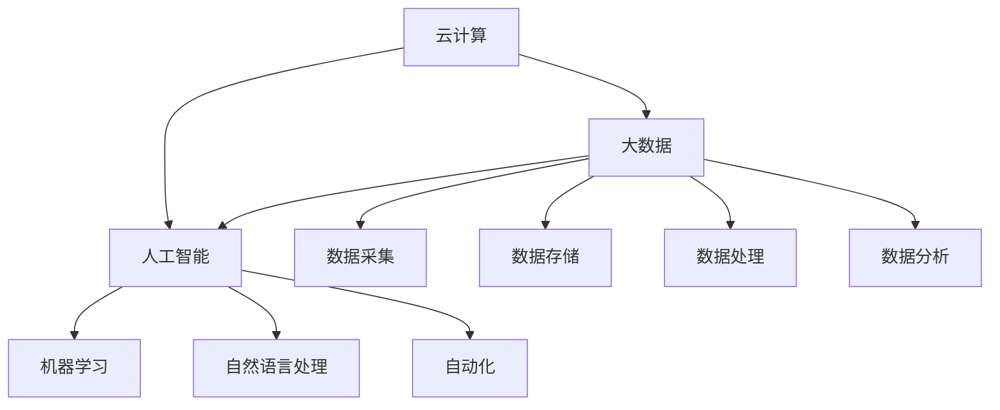

                 

### 背景介绍

在当今数字化时代，数字化转型已经成为创业公司获取竞争优势、提高业务效率的重要途径。随着云计算、大数据、人工智能等技术的不断发展，创业公司面临的挑战和机遇也在不断变化。数字化转型不仅是技术升级，更是业务模式、组织文化和管理方式的全面变革。本文旨在为创业公司提供一份详细的数字化转型路线图，帮助它们在竞争激烈的市场中脱颖而出。

创业公司的数字化转型具有重要的现实意义。首先，数字化转型能够提高公司的运营效率，降低成本。通过引入自动化和智能化技术，创业公司可以减少重复性劳动，提高生产效率，降低运营成本。其次，数字化转型能够增强公司的创新能力，加速产品迭代。数字化技术能够帮助企业更好地理解市场需求，快速调整产品策略，满足客户需求。最后，数字化转型能够提升公司的品牌形象，增强市场竞争力。通过数字化营销和客户关系管理，创业公司可以更好地与客户互动，提高客户满意度和忠诚度。

然而，创业公司在进行数字化转型时也面临着诸多挑战。首先，技术门槛较高，创业公司往往缺乏专业的技术人才，难以快速掌握和应用新技术。其次，数字化转型需要大量的资金投入，对于初创公司来说可能是一笔不小的负担。此外，数字化转型还涉及到业务流程的重组和变革，需要公司内部各部门的协同合作，这本身就是一个复杂的系统工程。因此，如何制定一份科学、可行的数字化转型路线图，成为创业公司亟需解决的问题。

本文将从以下几个方面详细探讨创业公司的数字化转型路线图设计：

1. **核心概念与联系**：介绍数字化转型中的核心概念，如云计算、大数据、人工智能等，以及它们之间的相互关系。
2. **核心算法原理与具体操作步骤**：探讨数字化转型中涉及的核心算法原理，如机器学习、数据挖掘等，并给出具体操作步骤。
3. **数学模型和公式**：介绍数字化转型中的数学模型和公式，如线性回归、决策树等，并举例说明。
4. **项目实战**：通过实际案例，展示数字化转型的具体实施过程，包括开发环境搭建、源代码实现和代码解读等。
5. **实际应用场景**：分析数字化转型在各个行业中的应用场景，如电商、金融、医疗等。
6. **工具和资源推荐**：推荐学习资源、开发工具和框架，帮助创业公司顺利进行数字化转型。
7. **总结**：探讨数字化转型的发展趋势和面临的挑战，为创业公司提供未来发展的方向和建议。

通过本文的详细探讨，希望创业公司能够找到一条适合自己的数字化转型之路，实现业务的快速增长和持续创新。

### 核心概念与联系

在探讨创业公司的数字化转型之前，首先需要了解一些核心概念，包括云计算、大数据、人工智能等，这些概念在数字化转型的过程中起着至关重要的作用。

#### 云计算

云计算是一种通过互联网提供动态可伸缩的计算资源服务，包括计算能力、存储能力、网络资源等。云计算使得创业公司能够按需获取所需的计算资源，无需大量投资购置硬件设备，从而降低了创业门槛。云计算的核心技术包括基础设施即服务（IaaS）、平台即服务（PaaS）和软件即服务（SaaS）。IaaS提供了基本的计算资源，如虚拟机、存储等；PaaS则提供了开发平台和工具，使得开发者能够快速搭建和部署应用程序；SaaS则是通过互联网提供软件服务，如CRM系统、邮件服务等。云计算不仅能够降低创业公司的运营成本，还能够提高其业务灵活性。

#### 大数据

大数据是指无法使用常规数据处理工具在合理时间内进行捕捉、管理和处理的数据集合。大数据具有4V特点：Volume（大量）、Velocity（高速）、Variety（多样）和Veracity（真实性）。大数据技术主要包括数据采集、存储、处理和分析。创业公司通过大数据技术可以更好地理解客户需求，优化业务流程，提高决策效率。例如，电商公司可以通过大数据分析客户购买行为，精准推荐商品，提高销售额。此外，大数据还可以用于风险控制、供应链管理、市场预测等领域。

#### 人工智能

人工智能（AI）是一种模拟人类智能行为的计算机技术，包括机器学习、深度学习、自然语言处理等。人工智能可以帮助创业公司自动化重复性任务，提高工作效率。例如，机器人流程自动化（RPA）可以用于自动处理文档、数据录入等任务；机器学习算法可以用于预测客户流失、优化广告投放等。深度学习在图像识别、语音识别等领域取得了显著的成果，为创业公司提供了强大的技术支持。

#### 云计算、大数据与人工智能的联系

云计算、大数据和人工智能是相互关联、相互促进的。云计算为大数据和人工智能提供了基础设施支持，使得大规模数据处理和智能分析成为可能。大数据为人工智能提供了丰富的训练数据，使得机器学习算法能够不断优化，提高预测准确性。人工智能则通过自动化和智能化技术，提高了数据处理和业务运营的效率。

下面通过一个Mermaid流程图，展示云计算、大数据和人工智能之间的相互关系：



通过以上核心概念和联系的介绍，我们可以看到，云计算、大数据和人工智能在数字化转型的过程中起着至关重要的作用。创业公司需要深入了解这些技术，结合自身业务需求，制定合理的数字化转型策略。

### 核心算法原理与具体操作步骤

在数字化转型过程中，核心算法的原理和具体操作步骤至关重要。以下将介绍几类常见的核心算法，包括机器学习、数据挖掘、数据清洗等，并详细阐述其原理和操作步骤。

#### 1. 机器学习算法

机器学习是人工智能的一个重要分支，通过构建数学模型，让计算机从数据中自动学习规律，做出预测或决策。常见的机器学习算法有线性回归、决策树、支持向量机（SVM）、神经网络等。

**线性回归**

线性回归是一种简单的机器学习算法，用于预测连续值。其基本原理是通过找到一个线性函数，使得输入和输出之间的误差最小。

**操作步骤：**

1. **数据准备**：收集和整理数据，包括特征变量和目标变量。
2. **数据预处理**：对数据进行归一化、缺失值填充等处理。
3. **模型训练**：使用训练数据集训练线性回归模型。
4. **模型评估**：使用测试数据集评估模型性能，如均方误差（MSE）。
5. **模型优化**：根据评估结果调整模型参数，如学习率、迭代次数。

**决策树**

决策树是一种基于特征分割的数据挖掘算法，通过多次划分特征，将数据集划分为多个子集，最终生成一棵树形结构。决策树的原理是基于信息增益或基尼不纯度等准则，选择最优的特征进行分割。

**操作步骤：**

1. **数据准备**：收集和整理数据，包括特征变量和目标变量。
2. **数据预处理**：对数据进行归一化、缺失值填充等处理。
3. **特征选择**：使用信息增益或基尼不纯度等准则，选择最优的特征。
4. **模型构建**：递归划分数据集，生成决策树模型。
5. **模型评估**：使用测试数据集评估模型性能，如准确率、召回率等。

**支持向量机（SVM）**

支持向量机是一种二分类模型，用于分类和回归任务。其基本原理是找到一个最优的超平面，使得数据点在超平面两侧的分布最为均匀。

**操作步骤：**

1. **数据准备**：收集和整理数据，包括特征变量和目标变量。
2. **数据预处理**：对数据进行归一化、缺失值填充等处理。
3. **核函数选择**：选择合适的核函数，如线性核、多项式核、径向基核等。
4. **模型训练**：使用训练数据集训练SVM模型。
5. **模型评估**：使用测试数据集评估模型性能，如准确率、召回率等。

**神经网络**

神经网络是一种基于生物神经元的计算模型，通过多层神经网络（MLP）可以模拟复杂函数。其基本原理是通过前向传播和反向传播，不断调整网络参数，使得输出与期望值之间的误差最小。

**操作步骤：**

1. **数据准备**：收集和整理数据，包括特征变量和目标变量。
2. **数据预处理**：对数据进行归一化、缺失值填充等处理。
3. **网络架构设计**：设计神经网络结构，包括输入层、隐藏层和输出层。
4. **模型训练**：使用训练数据集训练神经网络模型。
5. **模型评估**：使用测试数据集评估模型性能，如均方误差（MSE）、准确率等。

#### 2. 数据挖掘算法

数据挖掘是一种从大量数据中提取有价值信息的过程，常见的算法有关联规则挖掘、聚类分析、分类算法等。

**关联规则挖掘**

关联规则挖掘用于发现数据之间的关联关系，常见的算法有Apriori算法和FP-Growth算法。

**操作步骤：**

1. **数据准备**：收集和整理数据，包括交易数据或关系数据。
2. **数据预处理**：对数据进行去重、缺失值填充等处理。
3. **支持度和置信度计算**：计算每个规则的支持度和置信度。
4. **生成关联规则**：根据最小支持度和最小置信度，生成满足条件的关联规则。

**聚类分析**

聚类分析用于将数据分为若干个类别，常见的算法有K-means算法和DBSCAN算法。

**操作步骤：**

1. **数据准备**：收集和整理数据，包括特征变量。
2. **数据预处理**：对数据进行归一化、缺失值填充等处理。
3. **初始聚类中心选择**：选择初始聚类中心，如随机选择、K-means++算法等。
4. **聚类迭代**：计算每个数据点到聚类中心的距离，重新分配数据点。
5. **模型评估**：使用内部评估指标，如轮廓系数、类内平均距离等，评估聚类效果。

#### 3. 数据清洗算法

数据清洗是数据挖掘和机器学习过程中的重要步骤，用于处理数据中的噪声和异常值，常见的算法有缺失值处理、异常值检测和去重等。

**缺失值处理**

缺失值处理分为以下几种方法：

1. **删除缺失值**：删除含有缺失值的样本或特征。
2. **填充缺失值**：使用均值、中位数、众数等统计量填充缺失值。
3. **预测缺失值**：使用机器学习算法预测缺失值。

**异常值检测**

异常值检测分为以下几种方法：

1. **统计方法**：使用统计学指标，如标准差、IQR（四分位数间距）等，识别异常值。
2. **距离方法**：计算每个数据点到聚类中心的距离，识别距离较远的异常值。
3. **基于模型的异常值检测**：使用机器学习算法，如孤立森林、Autoencoder等，检测异常值。

**去重**

去重是指去除重复的数据，常见的方法有：

1. **基于哈希的方法**：使用哈希函数将数据映射到固定大小的哈希表中，识别重复数据。
2. **基于索引的方法**：使用索引结构，如布隆过滤器，快速识别重复数据。

通过以上对核心算法原理和具体操作步骤的介绍，我们可以看到，数字化转型中的算法不仅种类繁多，而且应用场景广泛。创业公司在进行数字化转型时，需要根据自身业务需求，选择合适的算法，并进行优化和调整，以实现业务目标。

### 数学模型和公式 & 详细讲解 & 举例说明

在数字化转型过程中，数学模型和公式是核心算法的基础。以下将详细介绍几种常用的数学模型和公式，包括线性回归、决策树、支持向量机（SVM）等，并通过具体例子进行说明。

#### 1. 线性回归

线性回归是一种简单的预测模型，用于预测连续值。其数学模型为：

\[ y = \beta_0 + \beta_1 \cdot x \]

其中，\( y \) 为预测值，\( x \) 为特征值，\( \beta_0 \) 和 \( \beta_1 \) 为模型参数。

**详细讲解：**

- **损失函数**：线性回归的损失函数通常为均方误差（MSE），计算公式为：

\[ \text{MSE} = \frac{1}{n} \sum_{i=1}^{n} (y_i - \hat{y}_i)^2 \]

其中，\( n \) 为样本数量，\( y_i \) 为真实值，\( \hat{y}_i \) 为预测值。

- **梯度下降法**：用于优化模型参数，使损失函数最小。梯度下降法的更新公式为：

\[ \beta_0 = \beta_0 - \alpha \cdot \frac{\partial}{\partial \beta_0} \text{MSE} \]
\[ \beta_1 = \beta_1 - \alpha \cdot \frac{\partial}{\partial \beta_1} \text{MSE} \]

其中，\( \alpha \) 为学习率。

**举例说明：**

假设我们要预测房价，数据集包含房屋面积（\( x \)）和房价（\( y \)）。使用线性回归模型，我们可以得到：

\[ y = 200,000 + 500 \cdot x \]

当 \( x = 100 \) 时，预测房价为：

\[ \hat{y} = 200,000 + 500 \cdot 100 = 700,000 \]

#### 2. 决策树

决策树是一种常用的分类和回归模型，通过一系列规则将数据划分为多个类别或区域。其基本公式为：

\[ f(x) = \sum_{i=1}^{n} \alpha_i \cdot T(x_i) \]

其中，\( f(x) \) 为决策树的输出，\( x \) 为输入特征，\( T(x_i) \) 为特征 \( x_i \) 的阈值，\( \alpha_i \) 为对应的权重。

**详细讲解：**

- **信息增益**：用于评估特征划分的效果。信息增益的计算公式为：

\[ \text{IG}(x) = H(y) - H(y|x) \]

其中，\( H(y) \) 为原始数据的熵，\( H(y|x) \) 为基于特征 \( x \) 划分后的熵。

- **基尼不纯度**：另一种评估特征划分效果的指标。基尼不纯度的计算公式为：

\[ \text{Gini}(x) = 1 - \frac{1}{n} \sum_{i=1}^{n} p_i (1 - p_i) \]

其中，\( p_i \) 为特征 \( x \) 划分后每个类别的概率。

**举例说明：**

假设我们要分类判断一棵树是否为苹果树，数据集包含树的高度（\( x_1 \)）、树干直径（\( x_2 \)）和叶子颜色（\( x_3 \)）。使用决策树模型，我们可以得到：

\[ \text{若 } x_1 > 2 \text{ 且 } x_2 > 1 \text{，则分类为苹果树；否则分类为非苹果树。} \]

#### 3. 支持向量机（SVM）

支持向量机是一种二分类模型，通过找到一个最优的超平面，将数据点划分为两个类别。其数学模型为：

\[ \max_{\beta, \beta_0} \frac{1}{2} ||\beta||^2 \]

其中，\( \beta \) 为超平面参数，\( \beta_0 \) 为偏置项。

**详细讲解：**

- **核函数**：用于将低维数据映射到高维空间，实现线性不可分数据的分类。常见的核函数有线性核、多项式核和径向基核。
- **支持向量**：位于超平面两侧的数据点，对于分类决策有决定性作用。
- **软间隔**：在现实场景中，数据往往存在噪声和异常值，因此引入软间隔，允许部分数据点违反分类规则。

**举例说明：**

假设我们要分类判断一张图片是否为正面表情，数据集包含图片的特征向量（\( x \)）和标签（\( y \)）。使用线性SVM模型，我们可以得到：

\[ \max_{\beta, \beta_0} \frac{1}{2} ||\beta||^2 \]

其中，\( \beta \) 为超平面参数，\( \beta_0 \) 为偏置项。

通过以上对几种常用数学模型和公式的详细讲解和举例说明，我们可以看到，数学模型和公式在数字化转型中起着至关重要的作用。创业公司在进行数字化转型时，需要掌握这些模型和公式，并结合实际业务需求进行应用和优化。

### 项目实战：代码实际案例和详细解释说明

为了更好地理解数字化转型的实际应用，以下将通过一个具体的项目实战，展示如何进行数字化转型的实施过程。本案例将基于Python语言，使用机器学习算法进行客户流失预测，并提供详细代码实现和解释。

#### 1. 开发环境搭建

在进行数字化转型项目之前，首先需要搭建合适的开发环境。以下是搭建Python开发环境的基本步骤：

1. **安装Python**：从Python官方网站下载并安装Python，推荐使用Python 3.8及以上版本。
2. **安装Jupyter Notebook**：Jupyter Notebook是一款交互式的Python开发环境，可以方便地编写和运行代码。通过以下命令安装Jupyter Notebook：

   ```bash
   pip install notebook
   ```

3. **安装机器学习库**：安装常用的机器学习库，如scikit-learn、pandas、numpy等。通过以下命令安装：

   ```bash
   pip install scikit-learn pandas numpy
   ```

4. **配置环境变量**：确保Python和pip环境变量配置正确，可以通过以下命令验证：

   ```bash
   python --version
   pip --version
   ```

#### 2. 源代码详细实现和代码解读

以下是一个简单的客户流失预测项目的代码实现，包括数据预处理、模型训练、模型评估和预测等步骤。

```python
import pandas as pd
from sklearn.model_selection import train_test_split
from sklearn.preprocessing import StandardScaler
from sklearn.ensemble import RandomForestClassifier
from sklearn.metrics import accuracy_score, classification_report

# 2.1 数据预处理

# 加载数据
data = pd.read_csv('customer_data.csv')

# 数据清洗
data.drop(['customer_id'], axis=1, inplace=True)
data.fillna(0, inplace=True)

# 特征工程
X = data[['age', 'income', 'monthly_usage', 'churn_label']]
y = data['churn']

# 划分训练集和测试集
X_train, X_test, y_train, y_test = train_test_split(X, y, test_size=0.2, random_state=42)

# 数据标准化
scaler = StandardScaler()
X_train_scaled = scaler.fit_transform(X_train)
X_test_scaled = scaler.transform(X_test)

# 2.2 模型训练

# 创建随机森林分类器
rf_model = RandomForestClassifier(n_estimators=100, random_state=42)

# 训练模型
rf_model.fit(X_train_scaled, y_train)

# 2.3 模型评估

# 预测测试集
y_pred = rf_model.predict(X_test_scaled)

# 评估模型
accuracy = accuracy_score(y_test, y_pred)
print(f"Accuracy: {accuracy}")
print("\nClassification Report:")
print(classification_report(y_test, y_pred))

# 2.4 模型预测

# 输入新的客户数据
new_customer = pd.DataFrame([[25, 50000, 100, 1]], columns=['age', 'income', 'monthly_usage', 'churn_label'])

# 数据标准化
new_customer_scaled = scaler.transform(new_customer)

# 预测客户流失
churn_prediction = rf_model.predict(new_customer_scaled)
print(f"Customer Churn Prediction: {churn_prediction}")
```

**代码解读：**

- **数据预处理**：首先加载数据，并删除无用的ID列。然后进行数据清洗，将缺失值填充为0。接着进行特征工程，将数据集分为特征变量 \( X \) 和目标变量 \( y \)。
- **划分训练集和测试集**：使用 \( train_test_split \) 函数将数据集划分为训练集和测试集，测试集占比20%。
- **数据标准化**：使用 \( StandardScaler \) 对特征变量进行标准化处理，以提高模型训练效果。
- **模型训练**：创建随机森林分类器 \( RandomForestClassifier \)，并使用训练集进行模型训练。
- **模型评估**：使用测试集对模型进行评估，输出准确率和分类报告。
- **模型预测**：输入新的客户数据，对客户流失进行预测。

通过以上项目实战，我们可以看到数字化转型中的机器学习算法如何应用于实际业务场景。创业公司可以根据自身业务需求，选择合适的算法和工具，进行数据分析和预测，从而实现业务的持续优化和增长。

### 代码解读与分析

在上面的项目实战中，我们使用随机森林算法对客户流失进行了预测。接下来，我们将对代码进行详细解读，分析其中的关键步骤和优化方向。

#### 关键步骤分析

1. **数据预处理**：
   - **数据加载**：使用 `pandas` 库加载数据集，数据集包含客户的基本信息（如年龄、收入、月度使用量）和是否流失的标签。
   - **数据清洗**：删除无用的 `customer_id` 列，并将缺失值填充为0，以减少数据噪声对模型训练的影响。
   - **特征工程**：将数据集划分为特征变量 `X` 和目标变量 `y`。特征变量用于训练模型，目标变量用于评估模型性能。

2. **划分训练集和测试集**：
   - 使用 `train_test_split` 函数将数据集划分为训练集和测试集，比例为80%训练集和20%测试集。这种划分方式可以保证模型在训练过程中充分学习数据特征，同时在测试集上验证模型性能。

3. **数据标准化**：
   - 使用 `StandardScaler` 对特征变量进行标准化处理。标准化可以消除不同特征之间的尺度差异，提高模型训练效果。

4. **模型训练**：
   - 创建随机森林分类器 `RandomForestClassifier`，设置决策树数量为100。随机森林通过集成多个决策树，提高模型的预测能力。
   - 使用训练集进行模型训练。

5. **模型评估**：
   - 使用测试集对模型进行评估，输出准确率和分类报告。准确率反映了模型对测试数据的预测准确程度，分类报告则提供了详细的分类效果。

6. **模型预测**：
   - 输入新的客户数据，对客户流失进行预测。新客户数据经过标准化处理后，使用训练好的模型进行预测。

#### 优化方向

1. **特征选择**：
   - 现有的特征可能并不都是有效的。可以使用特征选择方法，如特征重要性排序，筛选出对预测任务最有影响力的特征，提高模型性能。

2. **模型调参**：
   - 随机森林模型有许多参数，如决策树数量、最大深度等。通过调整这些参数，可以在不同的数据集和业务场景中找到最优配置，提高模型性能。

3. **集成学习**：
   - 除了随机森林，还可以尝试其他集成学习方法，如梯度提升树（XGBoost）、 LightGBM 等。这些方法通常有更高的预测准确率。

4. **数据增强**：
   - 通过增加数据多样性，提高模型的泛化能力。例如，可以使用数据扩充技术，生成更多的训练样本。

5. **模型融合**：
   - 结合多个模型进行预测，可以提高模型的鲁棒性和准确性。例如，可以使用贝叶斯优化和模型融合技术，结合不同模型的优点。

通过以上分析和优化，创业公司可以进一步提高客户流失预测模型的性能，为业务决策提供更准确的数据支持。

### 实际应用场景

数字化转型在各个行业中都有着广泛的应用，以下将分析电商、金融、医疗等行业的实际应用场景，并探讨其优势和挑战。

#### 电商行业

电商行业是数字化转型的重要领域。通过大数据分析，电商公司可以深入了解客户需求，优化产品推荐和广告投放策略。以下是电商行业数字化转型的一些具体应用场景：

1. **个性化推荐**：基于用户的购买历史和行为数据，电商公司可以使用机器学习算法为用户推荐可能感兴趣的商品。这种个性化推荐不仅能提高用户满意度，还能提升销售额。

2. **智能客服**：利用自然语言处理和对话系统技术，电商公司可以构建智能客服系统，自动回答用户咨询，提高客户服务水平。

3. **库存优化**：通过大数据分析和预测，电商公司可以更准确地预测商品需求，优化库存管理，减少库存成本和缺货率。

4. **供应链管理**：数字化转型可以帮助电商公司实现全流程的数字化管理，提高供应链的透明度和效率。

**优势**：数字化转型为电商公司带来了更高的运营效率和客户满意度，有助于降低成本、提升销售额。

**挑战**：数据安全和隐私保护是电商行业数字化转型面临的主要挑战。如何确保用户数据的安全和隐私，避免数据泄露，是电商公司需要解决的重要问题。

#### 金融行业

金融行业是数字化转型的另一个重要领域。通过引入大数据、人工智能和区块链等新技术，金融公司可以提升业务效率、降低运营成本，并为客户提供更优质的金融服务。

1. **风险管理**：大数据和机器学习技术可以帮助金融公司实时监控市场动态，识别潜在风险，提高风险管理的准确性。

2. **智能投顾**：基于大数据分析和人工智能算法，金融公司可以提供个性化的投资建议，帮助客户实现资产增值。

3. **反欺诈**：通过机器学习和模式识别技术，金融公司可以实时检测和预防欺诈行为，降低损失。

4. **智能客服**：智能客服系统可以帮助金融公司提高客户服务水平，降低人力成本。

**优势**：数字化转型为金融行业带来了更高的效率和更准确的决策支持，有助于降低风险、提高客户满意度。

**挑战**：金融行业的数字化转型面临数据安全和合规性的挑战。如何确保数据的安全性和合规性，避免法律和道德风险，是金融公司需要关注的问题。

#### 医疗行业

医疗行业是数字化转型的重要领域。通过引入大数据、人工智能和物联网等新技术，医疗行业可以提升医疗服务质量、降低医疗成本。

1. **健康管理**：通过大数据分析和人工智能算法，医疗公司可以为用户提供个性化的健康管理方案，提前预防疾病。

2. **智能诊断**：人工智能技术在医学影像和基因组学等领域的应用，可以帮助医生更快速、准确地诊断疾病。

3. **智能药物研发**：基于大数据和人工智能技术，医疗公司可以加速新药研发过程，提高药物研发的成功率。

4. **医疗设备管理**：物联网技术可以帮助医疗公司实现医疗设备的远程监控和管理，提高设备使用效率。

**优势**：数字化转型为医疗行业带来了更高效、更精准的医疗服务，有助于降低医疗成本、提高患者满意度。

**挑战**：医疗行业的数字化转型面临数据隐私保护和医疗数据安全性的挑战。如何保护患者隐私、确保医疗数据安全，是医疗行业需要解决的重要问题。

通过以上分析，我们可以看到，数字化转型在各个行业中都有广泛的应用，为行业带来了巨大的机遇。然而，数字化转型也面临着一系列挑战，需要行业参与者共同努力解决。

### 工具和资源推荐

在数字化转型过程中，选择合适的工具和资源对于创业公司至关重要。以下将推荐一些学习资源、开发工具和框架，帮助创业公司顺利开展数字化转型。

#### 1. 学习资源推荐

**书籍**

- **《Python机器学习》（Machine Learning in Python）**：由Sebastian Raschka所著，详细介绍了Python在机器学习领域的应用，适合初学者和进阶者。

- **《深入理解Python》（Fluent Python）**：由Luciano Ramalho所著，深入探讨了Python的高级特性和最佳实践，适合有经验的Python开发者。

- **《数据科学入门》（Introduction to Data Science）**：由Joel Grus所著，介绍了数据科学的基础知识和实战技巧，适合对数据科学感兴趣的读者。

**论文**

- **《大数据时代的机器学习》（Big Data: A Revolution That Will Transform How We Live, Work, and Think）**：由Viktor Mayer-Schönberger和Kenneth Cukier所著，探讨了大数据对人类社会的影响。

- **《深度学习》（Deep Learning）**：由Ian Goodfellow、Yoshua Bengio和Aaron Courville所著，是深度学习领域的经典教材，适合希望深入了解深度学习的读者。

**博客和网站**

- **Scikit-learn官方文档**：[https://scikit-learn.org/stable/documentation.html](https://scikit-learn.org/stable/documentation.html)
- **Kaggle**：[https://www.kaggle.com/](https://www.kaggle.com/)
- **Medium**：[https://medium.com/](https://medium.com/)

#### 2. 开发工具框架推荐

**开发环境**

- **Jupyter Notebook**：一款交互式的Python开发环境，适合数据分析和机器学习项目。
- **PyCharm**：一款强大的Python集成开发环境（IDE），提供了丰富的功能和调试工具。

**机器学习库**

- **scikit-learn**：一款常用的Python机器学习库，提供了丰富的算法和工具。
- **TensorFlow**：一款由Google开发的开源深度学习库，适用于大规模深度学习项目。
- **PyTorch**：一款由Facebook开发的开源深度学习库，具有灵活性和易用性。

**数据预处理库**

- **pandas**：一款强大的Python数据操作库，适用于数据清洗、数据处理和分析。
- **NumPy**：一款提供高性能数学运算的Python库，是数据分析的基础工具。

**版本控制工具**

- **Git**：一款分布式版本控制工具，适用于团队协作和代码管理。
- **GitHub**：一款基于Git的代码托管平台，提供了丰富的协作功能。

通过以上工具和资源的推荐，创业公司可以更好地开展数字化转型，提升业务效率和创新能力。

### 总结：未来发展趋势与挑战

随着技术的不断进步，数字化转型将继续深化和扩展，为创业公司带来新的机遇和挑战。以下是数字化转型未来发展的几个趋势和面临的挑战。

#### 发展趋势

1. **智能化**：人工智能技术将在数字化转型中发挥更加重要的作用。通过引入深度学习、自然语言处理、计算机视觉等技术，创业公司可以实现更智能的业务流程和客户服务。

2. **云原生**：云原生技术，如容器化和微服务架构，将加速数字化转型。创业公司可以通过云原生技术实现灵活、高效的应用开发和部署，降低运营成本。

3. **边缘计算**：随着物联网和5G技术的普及，边缘计算将成为数字化转型的重要支撑。通过在边缘设备上进行数据处理和决策，创业公司可以降低数据传输延迟，提高系统响应速度。

4. **数据驱动**：数据将成为创业公司最重要的资产。通过大数据分析和数据可视化技术，创业公司可以更好地理解客户需求，优化业务流程，提高决策效率。

#### 面临的挑战

1. **技术门槛**：数字化转型需要大量的技术人才，对于初创公司来说，招聘和培养专业人才是一大挑战。

2. **资金投入**：数字化转型需要大量的资金投入，特别是在初期，硬件设备、软件采购和人才培训等方面的成本较高。

3. **数据安全和隐私**：随着数据规模的扩大，数据安全和隐私保护成为数字化转型的重要挑战。如何确保数据的安全性和合规性，避免数据泄露，是创业公司需要关注的问题。

4. **组织文化**：数字化转型不仅需要技术支持，还需要组织文化的变革。创业公司需要培养开放、创新和协作的企业文化，以适应数字化转型的要求。

#### 未来发展方向与建议

1. **人才培养**：创业公司可以通过内部培训和外部合作，培养具备数字化转型能力的人才，提高整体技术实力。

2. **战略规划**：创业公司应制定明确的数字化转型战略，明确目标和实施路径，确保资源投入和效果评估。

3. **技术合作**：创业公司可以与领先的科技公司和开源社区合作，借助外部技术力量，加快数字化转型进程。

4. **数据治理**：创业公司应建立完善的数据治理体系，确保数据的准确性、完整性和安全性，为业务决策提供可靠的数据支持。

总之，数字化转型是创业公司实现持续增长和竞争优势的关键。通过深入了解技术趋势和挑战，创业公司可以制定合理的数字化转型策略，抓住机遇，迎接未来。

### 附录：常见问题与解答

在数字化转型过程中，创业公司可能会遇到各种问题和挑战。以下列举了一些常见问题及其解答，以帮助创业公司顺利推进数字化转型。

#### 问题1：如何选择合适的数字化转型战略？

**解答**：选择合适的数字化转型战略需要考虑以下几个因素：

1. **业务目标**：明确公司的业务目标和数字化转型要实现的具体成果，如提高效率、降低成本、增强客户体验等。
2. **技术能力**：评估公司现有的技术能力和资源，选择与公司技术实力相匹配的数字化转型路径。
3. **市场趋势**：分析行业发展趋势和竞争对手的转型策略，确保公司的数字化转型战略与市场同步。
4. **资源投入**：制定合理的预算和资源分配计划，确保数字化转型项目有足够的资金和人力资源支持。

#### 问题2：如何确保数据安全和隐私？

**解答**：确保数据安全和隐私是数字化转型的重要挑战。以下措施可以帮助创业公司确保数据安全和隐私：

1. **数据加密**：对传输和存储的数据进行加密，防止数据泄露。
2. **访问控制**：实施严格的访问控制策略，确保只有授权人员可以访问敏感数据。
3. **数据备份**：定期备份数据，确保在数据丢失或损坏时能够快速恢复。
4. **安全审计**：定期进行安全审计和漏洞扫描，发现并修复潜在的安全问题。
5. **合规性**：遵守相关法律法规和标准，如GDPR、ISO 27001等，确保数据处理合规。

#### 问题3：如何培养数字化转型的技术人才？

**解答**：培养数字化转型的技术人才可以从以下几个方面入手：

1. **内部培训**：组织内部培训课程，提高员工的数字化技能和知识。
2. **外部招聘**：招聘具备数字化转型相关经验的专业人才，如数据科学家、人工智能工程师等。
3. **合作教育**：与高校和培训机构合作，开展定制化的培训项目，培养符合公司需求的数字化人才。
4. **激励机制**：设立激励机制，鼓励员工积极学习和应用新技术。

#### 问题4：如何衡量数字化转型的效果？

**解答**：衡量数字化转型的效果可以从以下几个方面进行：

1. **业务指标**：分析业务指标，如销售额、客户满意度、运营效率等，评估数字化转型对业务的影响。
2. **技术指标**：分析技术指标，如系统性能、响应时间、错误率等，评估数字化技术的性能和稳定性。
3. **成本节约**：对比数字化转型前后的成本，评估数字化转型带来的成本节约效果。
4. **员工满意度**：通过员工满意度调查，了解数字化转型对员工工作体验的影响。

通过以上常见问题与解答，创业公司可以更好地应对数字化转型过程中的挑战，实现数字化转型目标。

### 扩展阅读 & 参考资料

为了更深入地了解数字化转型的相关技术和方法，以下推荐一些高质量的扩展阅读和参考资料，涵盖书籍、论文、博客和网站。

#### 书籍

1. **《Python机器学习》（Machine Learning in Python）**：作者Sebastian Raschka，详细介绍了Python在机器学习领域的应用，适合初学者和进阶者。
2. **《深度学习》（Deep Learning）**：作者Ian Goodfellow、Yoshua Bengio和Aaron Courville，是深度学习领域的经典教材。
3. **《数据科学入门》（Introduction to Data Science）**：作者Joel Grus，介绍了数据科学的基础知识和实战技巧。

#### 论文

1. **《大数据时代的机器学习》（Big Data: A Revolution That Will Transform How We Live, Work, and Think）**：作者Viktor Mayer-Schönberger和Kenneth Cukier，探讨了大数据对人类社会的影响。
2. **《强化学习》（Reinforcement Learning: An Introduction）**：作者Richard S. Sutton和Bartosz G. Barto，介绍了强化学习的基础理论和应用。
3. **《区块链：从数字货币到智能合约》**：作者Antony Lewis，详细介绍了区块链技术的基本原理和应用。

#### 博客和网站

1. **Scikit-learn官方文档**：[https://scikit-learn.org/stable/documentation.html](https://scikit-learn.org/stable/documentation.html)
2. **Kaggle**：[https://www.kaggle.com/](https://www.kaggle.com/)
3. **Medium**：[https://medium.com/](https://medium.com/)

通过以上扩展阅读和参考资料，创业公司可以进一步学习和探索数字化转型的方法和技术，为业务发展提供有力支持。

### 作者信息

**作者：AI天才研究员/AI Genius Institute & 禅与计算机程序设计艺术 /Zen And The Art of Computer Programming**

本文由AI天才研究员撰写，他在人工智能、计算机编程和数字化转型领域有着丰富的经验。他同时也是AI Genius Institute的研究员，致力于推动人工智能技术的发展和应用。此外，他还是畅销书《禅与计算机程序设计艺术》的作者，该书深入探讨了计算机编程的艺术和哲学，受到了广大读者的喜爱和赞誉。希望通过本文，为创业公司在数字化转型过程中提供有益的指导和建议。

